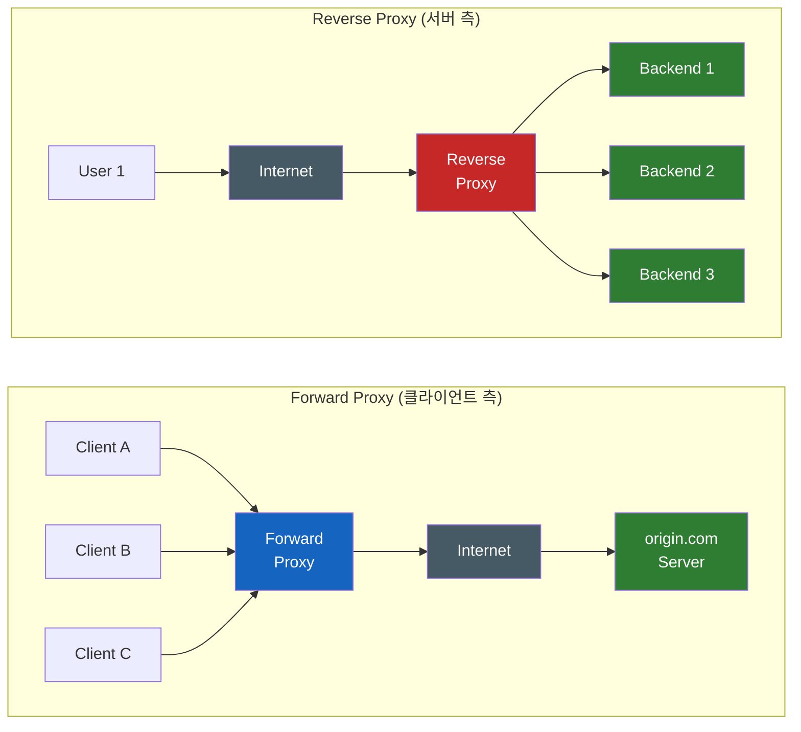
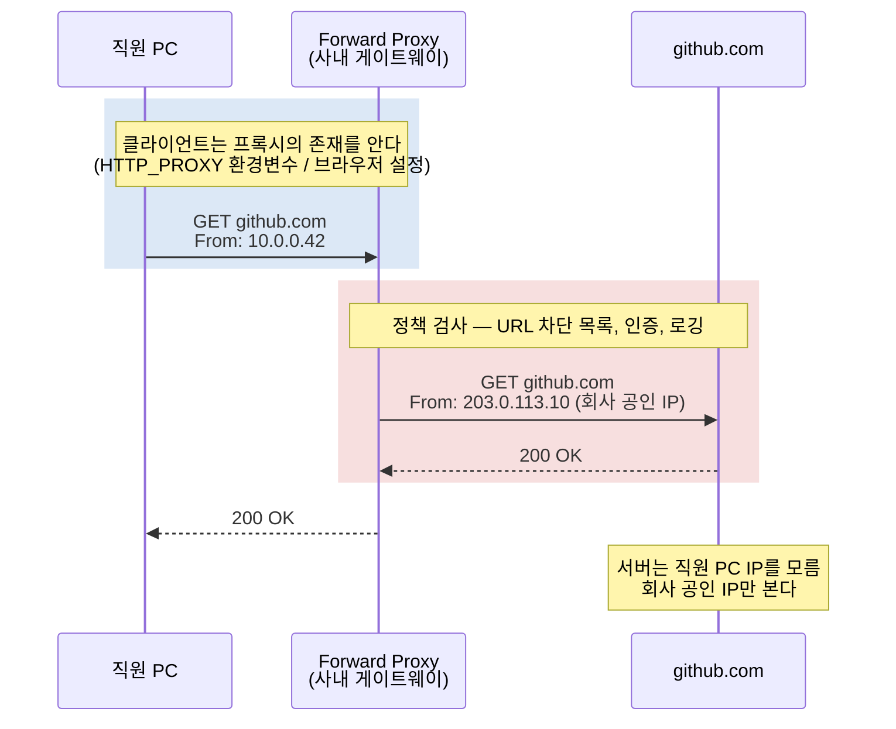
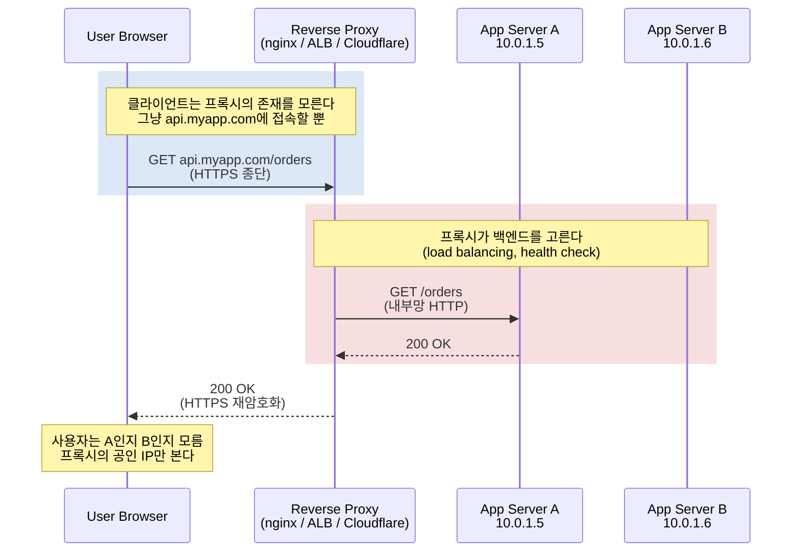
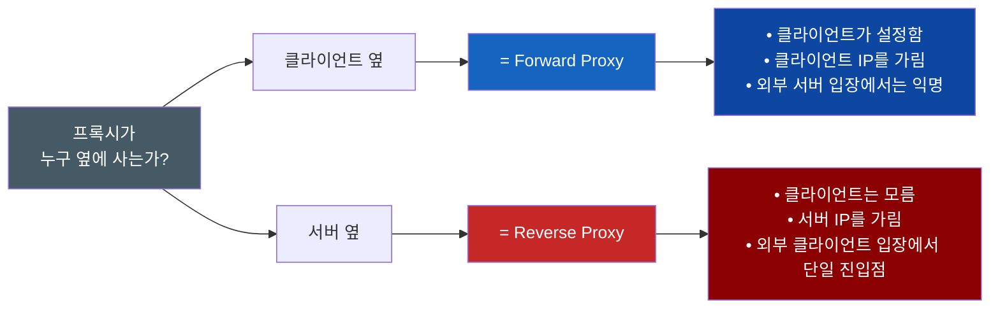
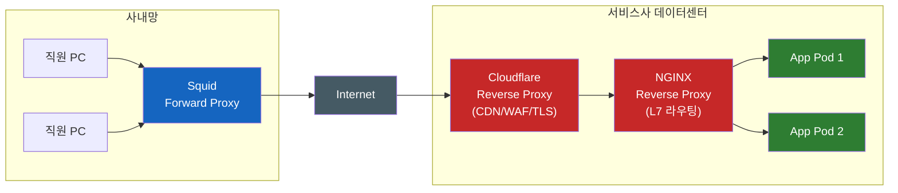

# Forward Proxy와 Reverse Proxy — 누구의 대리인인가

프록시(proxy)는 영어로 "대리인"이라는 뜻이다. 그런데 같은 "대리인"이라는 이름을 단 두 종류의 서버가 정반대 진영에 서 있다. **Forward Proxy** 는 클라이언트의 대리인이고, **Reverse Proxy** 는 서버의 대리인이다. 그림으로 그려놓으면 둘 다 "Client → 무언가 → Server" 구조라 비슷해 보이기 때문에 매번 헷갈린다. 이 문서는 "어느 쪽에 붙어 있는가"라는 한 가지 기준으로 두 개념을 안 까먹게 박아두는 것이 목표다.

## 결론부터 말하면

핵심은 **누구를 대리하느냐** 하나다. 나머지는 거기서 자동으로 따라온다.

| | Forward Proxy | Reverse Proxy |
|---|---|---|
| **대리하는 쪽** | 클라이언트 | 서버 |
| **숨기는 것** | 클라이언트의 IP/신원 | 서버의 IP/구성 |
| **클라이언트가 프록시를 아는가?** | 보통 **안다** (직접 설정) — Transparent 방식은 모름 | **모른다** (DNS만 본다) |
| **서버가 클라이언트를 아는가?** | 보통 **숨김** (프록시 IP만 본다 — 설정에 따라 `Via` 등으로 노출 가능) | 직접은 모름, 보통 `X-Forwarded-For`로 전달받음 (신뢰 설정 필요) |
| **누구에게 이득인가?** | 클라이언트(개인/조직) | 서비스 운영자 |
| **대표 사례** | 사내 인터넷 게이트웨이, VPN, Squid | NGINX, Cloudflare, ALB, API Gateway |

위 그림에서 결정적인 차이는 **프록시가 "Internet" 표지판의 어느 쪽에 붙어 있는가** 다. Forward Proxy는 클라이언트들과 같은 집(사내망)에 산다. Reverse Proxy는 서버들과 같은 집(데이터센터)에 산다. 이 한 가지 시각만 기억하면 나머지는 다 자연스럽게 풀린다.

## 1. 왜 "대리인"이 두 종류로 갈라졌는가

원래 컴퓨터 네트워크는 단순했다. 클라이언트가 IP 주소로 서버에 직접 TCP 커넥션을 맺고, 응답을 받으면 끝이었다. 그런데 인터넷이 커지면서 양쪽 진영에 각자의 고민이 생겼다.

**클라이언트 쪽의 고민** 은 이런 것이었다. "직원 500명이 각자 인터넷을 자유롭게 쓰면 어떻게 통제하지?", "유료 학술 사이트는 회사 IP만 인증해주는데, 직원 PC가 직접 접속하면 인증이 안 된다", "악성 사이트 차단을 PC마다 깔지 말고 한 곳에서 끝내고 싶다". 답은 자연스럽다 — **클라이언트들 앞에 게이트웨이를 하나 세우고, 모두 거기를 통해 나가게 하자.** 이게 Forward Proxy다.

**서버 쪽의 고민** 은 정반대였다. "사용자가 10만 명인데 서버 1대로는 안 된다. 그렇다고 10대의 IP를 다 노출하긴 싫다", "HTTPS 인증서를 백엔드마다 따로 깔기 귀찮다", "DDoS 공격을 백엔드 직전이 아니라 그 앞에서 흡수하고 싶다", "백엔드를 Java에서 Go로 바꿔도 클라이언트는 영향 없게 하고 싶다". 답은 다시 자연스럽다 — **서버들 앞에 게이트웨이를 하나 세우고, 외부에는 그 IP만 노출하자.** 이게 Reverse Proxy다.

같은 "두 호스트 사이에 중계자를 둔다"는 아이디어가, **어느 쪽 고민을 푸느냐** 에 따라 정반대 위치에 배치된 것이다. 그래서 두 개념의 차이를 외우려고 "Forward는 어쩌고…"를 통째로 외우면 안 된다. **누구의 문제를 풀려고 만든 도구냐** 를 떠올리면 위치는 따라온다.

## 2. Forward Proxy — 클라이언트의 대리인

Forward Proxy는 **클라이언트가 명시적으로 "나 대신 다녀와줘"라고 부탁하는** 서버다. 직원 PC의 브라우저 설정에 `proxy.company.com:8080`을 박아두거나, 운영체제의 `HTTP_PROXY` 환경변수를 설정한다. 그러면 그 PC에서 나가는 모든 HTTP 요청이 프록시로 향한다.

여기서 두 가지 디테일이 중요하다.

**첫째, 외부 서버(github.com)는 직원 PC의 사설 IP를 절대 못 본다.** 도착한 패킷의 출발지 IP는 회사의 공인 IP다. 그래서 회사 입장에서는 "이 IP 대역만 우리 회사 직원"이라는 사실을 외부에 노출할 수 있고, 학술 DB 같은 IP 기반 인증 서비스가 동작한다.

**둘째, 클라이언트는 보통 프록시를 거치고 있다는 사실을 안다.** 운영체제·브라우저 설정에 프록시 주소를 명시해야 트래픽이 그쪽으로 흐르기 때문이다. 이 방식을 **Explicit Proxy** 라고 부른다.

다만 모든 Forward Proxy가 Explicit인 것은 아니다. 회사·통신사·공공 Wi-Fi에서는 **Transparent Proxy** 가 흔하다. 게이트웨이 라우터가 출구로 나가는 트래픽을 **사용자 설정과 무관하게** 가로채 프록시로 넘긴다 (보통 iptables/NAT 리다이렉트). 다만 **80과 443은 다루는 방식이 다르다.** 평문 HTTP(80)는 프록시가 URL·헤더를 그대로 읽어 정책을 적용할 수 있어 투명 프록싱이 단순하다. 반면 HTTPS(443)는 패킷이 암호화되어 있어 프록시가 내용을 보려면 **MITM 인증서를 사내 PC에 미리 설치** 해야 하고, 그렇지 않으면 도메인 정도만 보고(SNI 기반) 통과·차단을 결정하거나 통째로 TCP 터널링만 해주는 수준에 그친다. 사용자는 자기 PC가 프록시를 거친다는 사실조차 모를 수 있다. "클라이언트가 안다"는 진술은 **본질이 아니라 운영 형태에 따른 결과** 라는 점을 기억해두자. 본질은 여전히 "그 프록시가 누구의 이익을 대리하느냐"다 — Transparent 방식이어도 사내망 관리자(=클라이언트 조직)를 위해 일하므로 Forward다.

대표적인 활용 사례는 다음과 같다.

| 사례 | 무엇을 푸는가 |
|------|---------------|
| **사내 인터넷 게이트웨이** (Squid 등) | 모든 직원 트래픽을 한 곳으로 모아 URL 차단, 멀웨어 스캔, 감사 로그 |
| **VPN** (※ 계층이 다른 사촌, §6.3 참조) | 클라이언트 IP를 VPN 서버 IP로 가려서 우회/익명화 |
| **학교·도서관 망** | IP 기반 라이선스가 있는 외부 DB 접근을 학교 IP로 통일 |
| **개발자의 [SSH ProxyJump](../infra/SSH-ProxyJump.md)** | Bastion을 통해 사설망 안의 호스트로 SSH 점프 |
| **[Bastion Host](../infra/Bastion-Host.md)** | 사설망 서버에 외부에서 SSH 접속할 때 거치는 경유지 |

> **TLS는 어떻게 되는가?** Forward Proxy가 HTTPS 트래픽을 평문으로 보려면 **MITM 방식의 인터셉트** 가 필요하다 — 프록시가 자체 발급한 루트 CA를 사내 PC에 미리 설치해두고, 외부 사이트마다 가짜 인증서를 즉석에서 만들어 클라이언트를 속이는 방식이다. 이는 의도된 MITM이지만, 본질적으로 [MITM 공격](../security/MITM-Man-In-The-Middle-중간자-공격.md)과 동일한 메커니즘이다. 인터셉트를 안 하는 프록시는 HTTPS 요청을 그냥 `CONNECT` 메서드로 터널링만 해주고 내용은 보지 않는다.

## 3. Reverse Proxy — 서버의 대리인

Reverse Proxy는 정반대다. **클라이언트는 프록시의 존재를 모른다.** `api.myapp.com`에 접속한다고 생각할 뿐, 그게 NGINX인지, ALB인지, Cloudflare인지, 그 뒤에 백엔드 서버가 몇 대 있는지 알 길이 없다. DNS만 보고 가니까 도착해서야 알게 되고, 도착해도 평범한 HTTP 응답이 오니까 모른다.

여기서도 두 가지가 결정적이다.

**첫째, 클라이언트는 백엔드의 IP나 개수를 모른다.** 백엔드를 1대에서 100대로 늘려도, Spring Boot에서 Go로 바꿔도, Pod이 재시작돼도 클라이언트는 영향이 없다. 프록시 뒤는 운영자의 자유 공간이다.

**둘째, 백엔드는 클라이언트의 원래 IP를 그냥은 모른다.** 백엔드가 보는 출발지 IP는 프록시의 내부 IP다. 그래서 로깅·rate limiting을 위해 프록시가 **`X-Forwarded-For`** 헤더에 원본 IP를 담아 전달하는 관례가 생겼다 (이걸 신뢰하려면 프록시가 신뢰할 수 있어야 하므로 `Trust-Proxy` 설정이 따라온다).

Reverse Proxy 한 대가 보통 처리하는 일은 다음과 같다.

| 기능 | 설명 |
|------|------|
| **Load Balancing** | 여러 백엔드에 요청 분산 ([L4/L7 차이](../network/L4와-L7-로드밸런서의-차이.md)) |
| **TLS Termination** | HTTPS를 프록시에서 푼다. 백엔드는 평문 HTTP로 처리 → 인증서 관리 일원화 |
| **Caching** | 정적 자원·자주 조회되는 응답을 캐시 |
| **Compression** | gzip/brotli를 프록시에서 처리 |
| **WAF (Web Application Firewall)** | SQL injection·XSS·Bot 트래픽 차단 |
| **Rate Limiting** | IP·키별 요청 횟수 제한 |
| **L7 Routing** | `/api/*`는 백엔드 A, `/admin/*`는 백엔드 B로 분기 |

Java 개발자라면 **Spring Cloud Gateway** , **API Gateway** , Kubernetes의 **Ingress Controller** 가 모두 Reverse Proxy의 구체적 구현이다. 실무에서 클라우드 한복판에 있는 거의 모든 시스템은 프론트에 Reverse Proxy를 두고 있다.

## 4. 헷갈리지 않는 기억법 — "프록시가 누구 옆에 사느냐"

다음 한 줄만 외우면 된다.

> **Forward Proxy는 클라이언트의 동네에 산다. Reverse Proxy는 서버의 동네에 산다.**

이 한 줄에서 나머지 모든 차이가 자동으로 도출된다.

또 하나 자주 쓰는 비유는 **"식당 비유"** 다.

- **Forward Proxy = 부모가 아이를 대신해 주문하는 상황** . 종업원은 부모만 보지 아이를 못 본다. 부모가 아이의 요구사항을 검열하기도 한다("아이스크림 9개는 너무 많아, 1개만 주세요").
- **Reverse Proxy = 식당의 주문 접수대** . 손님은 접수대 직원하고만 대화한다. 안에 셰프가 몇 명인지, 누가 내 요리를 만들었는지 손님은 모른다. 셰프가 바뀌어도, 한 명이 그만둬도 손님 입장에서는 똑같다.

기억이 안 날 때는 한 문장만 떠올리면 된다. **"프록시가 누구를 위해 일하는가?"** 사용자의 사생활을 지키기 위해? 그건 Forward. 운영자의 인프라를 지키기 위해? 그건 Reverse.

## 5. 둘 다 등장하는 실제 토폴로지

이론으로는 둘이 다르지만, **실제 트래픽 한 번이 양쪽을 다 지나는 경우** 가 흔하다. 회사에서 누군가가 자기 회사 사이트에 접속하는 상황을 그려보자.

이 한 요청에서 프록시는 **세 번** 등장한다.

1. **Squid (Forward Proxy)** — 직원의 사내망 트래픽을 모아 정책을 적용하고, 회사 공인 IP로 인터넷에 내보낸다. *직원을 대리한다.*
2. **Cloudflare (Reverse Proxy)** — 인터넷에서 들어온 요청을 받아 WAF/CDN/TLS 종료를 처리한다. *서비스사를 대리한다.*
3. **NGINX (Reverse Proxy)** — 데이터센터 안에서 L7 라우팅·로드밸런싱을 하고 Pod에 분배한다. *서비스사를 대리한다.*

같은 패킷이 흐르는데, **위치가 클라이언트 측이면 Forward** , **서버 측이면 Reverse** 다. "Forward냐 Reverse냐"는 절대적 속성이 아니라 **상대적 관점** 이라는 것이 이 그림에서 드러난다.

> **참고.** 위 토폴로지에서 트래픽 방향과 관련된 용어(Upstream/Downstream, Ingress/Egress)가 어떻게 적용되는지는 [네트워크 방향 용어 정리](../network/네트워크-방향-용어-정리-Upstream-Downstream-Ingress-Egress.md) 에 따로 정리해두었다. Forward Proxy는 사내망 입장에서 Egress, Reverse Proxy는 데이터센터 입장에서 Ingress 경로에 놓인다.

## 6. 비슷해서 자주 헷갈리는 것들

### 6.1 Reverse Proxy vs Load Balancer

거의 같은 자리에 있고 기능도 겹치지만 강조점이 다르다.

| | Reverse Proxy | Load Balancer |
|---|---|---|
| **주된 동기** | 단일 진입점, 캐싱, TLS 종단, L7 라우팅 | 트래픽 분산, 장애 대응 |
| **계층** | 보통 L7 (HTTP) | L4 (TCP) 또는 L7 |
| **대표 제품** | NGINX, Cloudflare | AWS NLB(L4), HAProxy, ALB(L7) |

요즘 NGINX·HAProxy·Envoy 같은 도구는 두 역할을 모두 한다. 그래서 "내가 쓰는 NGINX는 Reverse Proxy면서 Load Balancer다"가 정답이다. 자세한 계층 차이는 [L4와 L7 로드밸런서의 차이](../network/L4와-L7-로드밸런서의-차이.md) 참조.

### 6.2 Reverse Proxy vs API Gateway

API Gateway는 Reverse Proxy의 **상위 개념이 아니라, Reverse Proxy 메커니즘 위에 API 관리 기능을 얹은 특화·확장 형태** 다.

- **Reverse Proxy** : "트래픽을 어떻게 백엔드에 전달하느냐"에 집중 (HTTP 수준)
- **API Gateway** : 거기에 더해서 **API 관리** 영역 — 인증/인가, API 키, 사용량 과금, OpenAPI 문서, 버전 관리, 변환(REST↔gRPC)까지 포함

NGINX는 Reverse Proxy로 시작해서 API Gateway 기능을 추가했고(NGINX Plus), Kong·AWS API Gateway·Spring Cloud Gateway는 처음부터 API Gateway로 설계됐다. 다만 내부적으로 다 Reverse Proxy 메커니즘 위에 올라가 있다.

### 6.3 Forward Proxy vs VPN

둘 다 클라이언트 IP를 가리지만 작동 계층이 다르다.

| | Forward Proxy | VPN |
|---|---|---|
| **동작 계층** | 응용 계층 (HTTP/SOCKS) | 네트워크 계층 (IP 패킷 전체 터널) |
| **무엇을 가리는가** | 특정 애플리케이션의 트래픽 | Full-tunnel은 PC의 **모든** 트래픽, Split-tunnel은 지정된 대역만 |
| **암호화** | HTTPS는 종단간, 프록시 자체는 평문도 가능 | 터널 자체가 암호화 |
| **설치** | 브라우저·OS proxy 설정 | OS·라우터에 VPN 클라이언트 |

VPN은 사실상 "더 낮은 계층에서 동작하는 Forward Proxy"라고 봐도 큰 무리는 없다. 둘 다 클라이언트의 대리인이기 때문이다. VPN이 가상 NIC·라우팅 테이블·캡슐화로 어떻게 "사설 IP 접근"을 만들어내는지는 [VPN은 어떻게 나를 회사망 안으로 데려가는가](../network/VPN은-어떻게-나를-회사망-안으로-데려가는가.md) 에 따로 정리해두었다.

## 7. 정리

### 핵심 포인트

1. **"누구를 대리하는가"가 모든 것이다**
   - Forward = 클라이언트의 대리인, Reverse = 서버의 대리인.
   - 이 한 줄에서 나머지 차이는 다 따라온다.

2. **"누가 그 존재를 아는가"로도 외울 수 있다**
   - Forward Proxy는 **클라이언트가 안다** (직접 설정함). 서버는 모른다.
   - Reverse Proxy는 **클라이언트가 모른다** (DNS만 본다). 서버는 안다.

3. **위치는 상대적이다**
   - 같은 NGINX도 어느 쪽에 붙어 있느냐로 정체가 정해진다.
   - 사내망에 두면 Forward, 데이터센터에 두면 Reverse.

4. **실무에서는 둘 다 동시에 만난다**
   - 직원 PC → Squid(Forward) → Cloudflare(Reverse) → NGINX(Reverse) → Pod.
   - 한 요청에 두 종류 프록시가 모두 등장하는 게 일반적이다.

5. **헷갈릴 땐 식당 비유**
   - Forward = 부모가 아이 대신 주문 (종업원은 아이를 못 봄).
   - Reverse = 식당의 주문 접수대 (손님은 셰프를 못 봄).

### 다음으로 읽기

- [NGINX 리버스 프록시와 로드밸런싱 완전 정복](../nginx/NGINX-리버스-프록시와-로드밸런싱-완전-정복.md) — 실제 NGINX 설정 레벨로 Reverse Proxy를 더 깊이
- [L4와 L7 로드밸런서의 차이](../network/L4와-L7-로드밸런서의-차이.md) — Reverse Proxy의 계층 차이
- [네트워크 방향 용어 정리](../network/네트워크-방향-용어-정리-Upstream-Downstream-Ingress-Egress.md) — Upstream/Downstream, Ingress/Egress 관점
- [Bastion Host](../infra/Bastion-Host.md) · [SSH ProxyJump](../infra/SSH-ProxyJump.md) — Forward Proxy의 SSH 영역 사촌

---

## 출처

- [Cloudflare — What is a reverse proxy?](https://www.cloudflare.com/learning/cdn/glossary/reverse-proxy/) — Reverse Proxy 공식 설명 + Forward Proxy 정의도 같은 페이지에 포함
- [Cloudflare Blog — A Primer on Proxies](https://blog.cloudflare.com/a-primer-on-proxies/) — Forward Proxy의 종류(HTTP CONNECT, MASQUE 등)와 동작 메커니즘
- [NGINX — Reverse Proxy 가이드](https://docs.nginx.com/nginx/admin-guide/web-server/reverse-proxy/) — `proxy_pass`·`X-Forwarded-For` 등 실무 설정
- [MDN — Proxy servers and tunneling](https://developer.mozilla.org/en-US/docs/Web/HTTP/Proxy_servers_and_tunneling) — HTTP 표준 관점에서의 프록시 동작
- [Forward Proxy vs Reverse Proxy (System Design Newsletter)](https://newsletter.systemdesign.one/p/forward-proxy-vs-reverse-proxy) — 비유 기반의 직관적 비교
- [StrongDM — Forward Proxy vs Reverse Proxy](https://www.strongdm.com/blog/difference-between-proxy-and-reverse-proxy) — 보안 관점에서의 둘의 역할 비교
- [Squid — Open source forward proxy](http://www.squid-cache.org/) — 대표적 Forward Proxy 구현체
