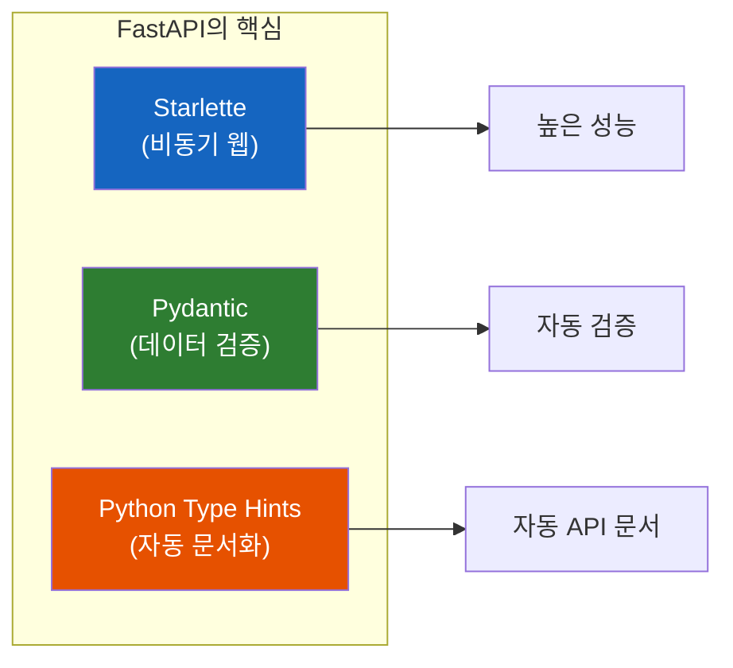
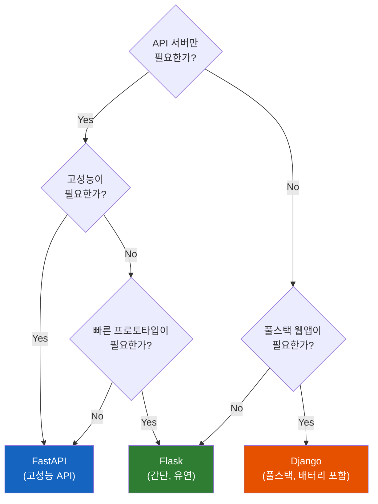

# FastAPI: 왜 빠르고 왜 쓰는가

Python으로 API 서버를 만들어야 한다. Flask? Django? 아니면 요즘 핫하다는 FastAPI? 선택지가 많아서 고민된다. FastAPI가 "Fast"한 이유는 뭘까? 그냥 이름만 그런 걸까?

> **이 문서의 범위:** 기본 개념과 함께 `Header`, `Query`, `Path`, `HTTPException`, `Response` 등 **실무에서 자주 쓰이는 패턴** 도 다룬다.

## 결론부터 말하면

**FastAPI는 "개발 속도"와 "실행 속도" 두 마리 토끼를 잡은 프레임워크다.**

| 특성 | Flask | Django | FastAPI |
|------|-------|--------|---------|
| 개발 속도 | 빠름 | 보통 | **매우 빠름** |
| 실행 속도 | 보통 | 느림 | **매우 빠름** |
| 타입 힌트 | 선택 | 선택 | **필수/자동** |
| API 문서 | 수동 | 수동 | **자동 생성** |
| 비동기 지원 | 제한적 | 제한적 | **네이티브** |
| 학습 곡선 | 낮음 | 높음 | 낮음 |



---

## 1. 왜 "Fast"인가?

### 1.1 두 가지 의미의 Fast

FastAPI의 "Fast"는 두 가지 의미를 가진다:

1. **개발이 빠르다** (Developer Experience)
2. **실행이 빠르다** (Runtime Performance)

### 1.2 실행 속도: Starlette 덕분

FastAPI는 내부적으로 **Starlette** 위에서 동작한다. Starlette는 비동기 웹 프레임워크의 핵심이다.

```python
# Flask (WSGI, 동기)
@app.route("/users")
def get_users():
    users = db.query(User).all()  # 블로킹! 다른 요청은 대기
    return jsonify(users)

# FastAPI (ASGI, 비동기)
@app.get("/users")
async def get_users():
    users = await db.query(User).all()  # 논블로킹! 다른 요청 처리 가능
    return users
```

> **주의:** `await`만 붙인다고 마법처럼 비동기가 되는 건 아니다. 비동기 DB 드라이버(`asyncpg`, `databases`, `SQLAlchemy async` 등)를 사용해야 진짜 논블로킹 I/O가 가능하다.

**벤치마크 (초당 요청 수, 높을수록 좋음):**

| 프레임워크 | 요청/초 | 비고 |
|-----------|--------|------|
| FastAPI | ~15,000 | ASGI + uvicorn |
| Flask | ~2,000 | WSGI + gunicorn |
| Django | ~1,500 | WSGI + gunicorn |

> **왜 이렇게 차이가 날까?** WSGI는 동기 방식이라 I/O 대기 시간에 스레드가 놀고 있다. ASGI는 비동기라서 I/O 대기 중에도 다른 요청을 처리할 수 있다.

### 1.3 개발 속도: Pydantic + Type Hints

Flask로 요청 데이터를 검증하려면:

```python
# Flask - 수동 검증 (지옥의 시작)
@app.route("/users", methods=["POST"])
def create_user():
    data = request.get_json()

    # 일일이 검증해야 한다
    if not data.get("name"):
        return {"error": "name is required"}, 400
    if not isinstance(data.get("age"), int):
        return {"error": "age must be integer"}, 400
    if data.get("age") < 0:
        return {"error": "age must be positive"}, 400
    if not data.get("email"):
        return {"error": "email is required"}, 400
    if "@" not in data.get("email", ""):
        return {"error": "invalid email format"}, 400

    # 드디어 비즈니스 로직...
    user = User(**data)
    db.session.add(user)
    db.session.commit()
    return {"id": user.id}
```

FastAPI로 같은 작업을:

```python
# FastAPI - 자동 검증 (천국)
from pydantic import BaseModel, EmailStr, Field

class UserCreate(BaseModel):
    name: str
    age: int = Field(ge=0)  # >= 0
    email: EmailStr

@app.post("/users")
async def create_user(user: UserCreate):
    # 검증은 이미 완료됨! 바로 비즈니스 로직
    db_user = User(**user.model_dump())
    await db.add(db_user)
    return {"id": db_user.id}
```

**Pydantic이 자동으로 해주는 것:**
- 타입 변환 (`"123"` → `123`)
- 필수 필드 검증
- 값 범위 검증 (`ge=0`)
- 이메일 형식 검증 (`EmailStr`)
- 에러 메시지 자동 생성

---

## 2. 자동 API 문서화

### 2.1 Swagger UI와 ReDoc

FastAPI를 실행하면 **두 가지 API 문서가 자동 생성** 된다:

- `http://localhost:8000/docs` → Swagger UI
- `http://localhost:8000/redoc` → ReDoc

```python
from fastapi import FastAPI
from pydantic import BaseModel

app = FastAPI(
    title="My API",
    description="사용자 관리 API",
    version="1.0.0"
)

class User(BaseModel):
    """사용자 정보"""
    name: str
    email: str

@app.post("/users", summary="사용자 생성", tags=["Users"])
async def create_user(user: User) -> dict:
    """
    새 사용자를 생성합니다.

    - **name**: 사용자 이름 (필수)
    - **email**: 이메일 주소 (필수)
    """
    return {"id": 1, "name": user.name}
```

이 코드만으로 완전한 API 문서가 생성된다. Swagger에서 직접 API를 테스트할 수도 있다.

### 2.2 Flask/Django와 비교

| 기능 | Flask | Django | FastAPI |
|------|-------|--------|---------|
| API 문서 생성 | flask-swagger 설치 + 설정 | drf-yasg 설치 + 설정 | **기본 내장** |
| 요청 예시 | 수동 작성 | 수동 작성 | **자동 생성** |
| 응답 스키마 | 수동 작성 | Serializer 정의 | **Type Hint에서 추론** |
| 대화형 테스트 | 별도 설정 | 별도 설정 | **기본 내장** |

---

## 3. 비동기 처리: async/await

### 3.1 왜 비동기가 중요한가?

API 서버의 대부분 시간은 **I/O 대기** 에 쓰인다:

```
[요청 처리 시간 분석]
├── DB 쿼리 대기: 50ms ████████████████████
├── 외부 API 호출 대기: 30ms ████████████
├── 파일 읽기 대기: 10ms ████
└── 실제 연산: 1ms ▌

→ 99%가 대기 시간!
```

동기 방식(Flask)에서는 대기 중에 스레드가 **아무것도 못 한다.** 비동기 방식(FastAPI)에서는 대기 중에 **다른 요청을 처리** 한다.

### 3.2 실전 예시: 여러 외부 API 호출

```python
import asyncio
import httpx

# 동기 방식 - 순차 실행 (느림)
def get_data_sync():
    result1 = requests.get("https://api1.com/data").json()  # 100ms
    result2 = requests.get("https://api2.com/data").json()  # 100ms
    result3 = requests.get("https://api3.com/data").json()  # 100ms
    return [result1, result2, result3]  # 총 300ms

# 비동기 방식 - 동시 실행 (빠름)
async def get_data_async():
    async with httpx.AsyncClient() as client:
        tasks = [
            client.get("https://api1.com/data"),  # 100ms
            client.get("https://api2.com/data"),  # 100ms (동시)
            client.get("https://api3.com/data"),  # 100ms (동시)
        ]
        responses = await asyncio.gather(*tasks)
        return [r.json() for r in responses]  # 총 ~100ms
```

### 3.3 동기 함수도 사용 가능

FastAPI는 `async def`와 일반 `def` 모두 지원한다:

```python
# 비동기 함수 - I/O 작업에 적합
@app.get("/async-endpoint")
async def async_handler():
    data = await async_db_query()
    return data

# 동기 함수 - CPU 작업에 적합 (자동으로 스레드풀에서 실행)
@app.get("/sync-endpoint")
def sync_handler():
    result = heavy_cpu_computation()
    return result
```

---

## 4. 의존성 주입 (Dependency Injection)

### 4.1 DI가 필요한 이유

인증, DB 세션, 설정 등 **여러 엔드포인트에서 공통으로 필요한 것들** 이 있다:

```python
# DI 없이 - 반복 코드 지옥
@app.get("/users")
async def get_users():
    token = request.headers.get("Authorization")
    if not token:
        raise HTTPException(401)
    user = verify_token(token)  # 매번 반복
    db = get_db_session()        # 매번 반복
    ...

@app.get("/posts")
async def get_posts():
    token = request.headers.get("Authorization")  # 또 반복
    if not token:
        raise HTTPException(401)
    user = verify_token(token)   # 또 반복
    db = get_db_session()         # 또 반복
    ...
```

### 4.2 FastAPI의 Depends

```python
from fastapi import Depends, HTTPException

# 의존성 정의 (동기 방식 - def 사용)
def get_db():
    db = SessionLocal()
    try:
        yield db
    finally:
        db.close()  # yield 사용: 응답 전후로 실행되는 동기 제너레이터

# 완전 비동기 방식 (권장 - SQLAlchemy 1.4+)
from sqlalchemy.ext.asyncio import AsyncSession
from typing import AsyncGenerator

async def get_async_db() -> AsyncGenerator[AsyncSession, None]:
    async with AsyncSessionLocal() as session:
        yield session

# 동기 방식: 인증 의존성도 동기로 통일
def get_current_user_sync(
    token: str = Header(...),
    db: Session = Depends(get_db)
):
    user = verify_token_sync(token, db)  # 동기 함수
    if not user:
        raise HTTPException(401, "Invalid token")
    return user

# 동기 엔드포인트 (동기 의존성만 사용)
@app.get("/users")
def get_users(
    db: Session = Depends(get_db),
    user: User = Depends(get_current_user_sync)
):
    return db.query(User).all()

# 비동기 방식: 인증 의존성도 비동기로 통일
async def get_current_user_async(
    token: str = Header(...),
    db: AsyncSession = Depends(get_async_db)
):
    user = await verify_token_async(token, db)  # 비동기 함수
    if not user:
        raise HTTPException(401, "Invalid token")
    return user

# 비동기 엔드포인트 (비동기 의존성만 사용)
@app.get("/users/async")
async def get_users_async(
    db: AsyncSession = Depends(get_async_db),
    user: User = Depends(get_current_user_async)
):
    result = await db.execute(select(User))
    return result.scalars().all()
```

> **주의:** 동기/비동기를 혼합하지 마라! 동기 엔드포인트는 동기 의존성만, 비동기 엔드포인트는 비동기 의존성만 사용해야 일관성 있고 예측 가능한 코드가 된다.

### 4.3 Java 개발자를 위한 비교

```java
// Spring의 DI
@RestController
public class UserController {
    @Autowired
    private UserService userService;

    @GetMapping("/users")
    public List<User> getUsers(@AuthenticationPrincipal User user) {
        return userService.findAll();
    }
}
```

```python
# FastAPI의 DI

# 서비스 의존성 정의 (Spring의 @Bean과 유사)
def get_user_service(db: Session = Depends(get_db)) -> UserService:
    return UserService(db)

@app.get("/users")
async def get_users(
    user: User = Depends(get_current_user),
    service: UserService = Depends(get_user_service)  # 서비스 주입
):
    return await service.find_all()
```

**비슷한 개념:**
- Spring `@Autowired` ≈ FastAPI `Depends()`
- Spring `@AuthenticationPrincipal` ≈ FastAPI `Depends(get_current_user)`

> **Depends 캐싱:** 동일 요청 내에서 같은 의존성이 여러 번 사용되면 FastAPI가 결과를 캐시한다. 예를 들어 `get_users`와 `get_current_user`가 모두 `Depends(get_db)`를 사용하면, DB 세션은 한 번만 생성되어 공유된다.

---

## 5. 실전 프로젝트 구조

### 5.1 권장 구조

```
my_project/
├── app/
│   ├── __init__.py
│   ├── main.py              # FastAPI 앱 생성
│   ├── config.py            # 설정
│   ├── dependencies.py      # 공통 의존성
│   │
│   ├── routers/             # 라우터 (컨트롤러)
│   │   ├── __init__.py
│   │   ├── users.py
│   │   └── posts.py
│   │
│   ├── schemas/             # Pydantic 모델 (DTO)
│   │   ├── __init__.py
│   │   ├── user.py
│   │   └── post.py
│   │
│   ├── models/              # DB 모델 (SQLAlchemy)
│   │   ├── __init__.py
│   │   ├── user.py
│   │   └── post.py
│   │
│   └── services/            # 비즈니스 로직
│       ├── __init__.py
│       ├── user_service.py
│       └── post_service.py
│
├── tests/
├── requirements.txt
└── Dockerfile
```

### 5.2 라우터 분리

```python
# app/routers/users.py
from fastapi import APIRouter, Depends

router = APIRouter(prefix="/users", tags=["Users"])

@router.get("/")
async def list_users():
    ...

@router.get("/{user_id}")
async def get_user(user_id: int):
    ...

# app/main.py
from fastapi import FastAPI
from app.routers import users, posts

app = FastAPI()
app.include_router(users.router)
app.include_router(posts.router)
```

---

## 6. FastAPI vs Flask vs Django 선택 기준



### 선택 가이드

| 상황 | 추천 | 이유 |
|------|------|------|
| REST API 서버 | **FastAPI** | 자동 문서화, 타입 안전성, 고성능 |
| ML 모델 서빙 | **FastAPI** | 비동기, Pydantic 검증, 확장성 |
| 간단한 웹훅/스크립트 | **Flask** | 최소 설정, 빠른 시작 |
| 관리자 페이지 필요 | **Django** | Admin 내장, ORM 완성도 |
| 풀스택 웹앱 | **Django** | 템플릿, 인증, 세션 내장 |
| 마이크로서비스 | **FastAPI** | 경량, 고성능, 컨테이너 친화적 |

---

## 7. 빠른 시작

### 7.1 설치 및 실행

```bash
# 설치
pip install fastapi uvicorn

# 최소 코드 (main.py)
cat << 'EOF' > main.py
from fastapi import FastAPI

app = FastAPI()

@app.get("/")
async def root():
    return {"message": "Hello, FastAPI!"}
EOF

# 실행 (개발용)
uvicorn main:app --reload

# 확인
# http://localhost:8000      → API
# http://localhost:8000/docs → Swagger UI
```

> **프로덕션 배포:** 개발 시에는 `--reload` 옵션이 편리하지만, 프로덕션에서는 Gunicorn과 Uvicorn 워커를 조합하여 멀티 프로세스로 실행한다:
> ```bash
> gunicorn main:app -w 4 -k uvicorn.workers.UvicornWorker
> ```

### 7.2 CRUD 예시

```python
from fastapi import FastAPI, HTTPException
from pydantic import BaseModel

app = FastAPI()

# 인메모리 DB (예시용)
users_db: dict[int, dict] = {}
counter = 0

class UserCreate(BaseModel):
    name: str
    email: str

class UserResponse(BaseModel):
    id: int
    name: str
    email: str

# Create
@app.post("/users", response_model=UserResponse)
async def create_user(user: UserCreate):
    global counter
    counter += 1
    users_db[counter] = {"id": counter, **user.model_dump()}
    return users_db[counter]

# Read
@app.get("/users/{user_id}", response_model=UserResponse)
async def get_user(user_id: int):
    if user_id not in users_db:
        raise HTTPException(404, "User not found")
    return users_db[user_id]

# Update
@app.put("/users/{user_id}", response_model=UserResponse)
async def update_user(user_id: int, user: UserCreate):
    if user_id not in users_db:
        raise HTTPException(404, "User not found")
    users_db[user_id] = {"id": user_id, **user.model_dump()}
    return users_db[user_id]

# Delete
@app.delete("/users/{user_id}")
async def delete_user(user_id: int):
    if user_id not in users_db:
        raise HTTPException(404, "User not found")
    del users_db[user_id]
    return {"message": "Deleted"}
```

---

## 8. 실무 필수 패턴: Header, Query, Path, Response

실무 프로젝트를 보면 `Header()`, `Query()`, `Path()` 같은 것들이 자주 등장한다. 처음 보면 "이게 뭐지?" 싶은데, 알고 나면 매우 직관적이다.

### 8.1 파라미터 타입별 역할

FastAPI는 요청의 **어디서 데이터를 가져올지** 를 명시적으로 선언한다:

```python
from fastapi import FastAPI, Path, Query, Header, Body

@app.get("/items/{item_id}")
async def get_item(
    item_id: int = Path(..., description="아이템 ID"),           # URL 경로: /items/123
    q: str | None = Query(None, max_length=50),                  # 쿼리스트링: ?q=검색어
    user_agent: str | None = Header(None),                       # HTTP 헤더: User-Agent
):
    return {"item_id": item_id, "q": q, "user_agent": user_agent}
```

| 파라미터 타입 | 데이터 위치 | 예시 |
|--------------|------------|------|
| `Path()` | URL 경로 | `/users/123` → `user_id=123` |
| `Query()` | 쿼리스트링 | `?page=1&size=10` |
| `Header()` | HTTP 헤더 | `Authorization: Bearer xxx` |
| `Body()` | 요청 본문 | JSON payload (Pydantic 모델 사용 시 자동) |
| `Cookie()` | 쿠키 | `session_id=abc` |

> **Body() 참고:** Pydantic 모델을 인자로 받으면 자동으로 요청 본문에서 읽는다. 명시적 `Body()`는 여러 본문 파라미터를 받거나 `embed=True` 옵션이 필요할 때 사용한다.

### 8.2 Header(): 헤더에서 값 추출

**실무에서 가장 헷갈리는 부분!** `Header()`를 사용해야 HTTP 헤더에서 값을 가져온다.

```python
from fastapi import Header
from typing import Annotated

@app.get("/items/")
async def read_items(
    # user_agent 변수명 → User-Agent 헤더로 자동 변환 (언더스코어 → 하이픈)
    user_agent: Annotated[str | None, Header()] = None,
    # 커스텀 헤더
    x_token: Annotated[str | None, Header()] = None,  # X-Token 헤더
):
    return {"User-Agent": user_agent, "X-Token": x_token}
```

**핵심 포인트:**
- `user_agent` → `User-Agent` 헤더로 자동 변환 (snake_case → kebab-case)
- 변환을 끄려면: `Header(convert_underscores=False)`
- 같은 헤더가 여러 개면: `x_token: list[str] = Header()`

### 8.3 Query(): 쿼리 파라미터 검증

```python
from fastapi import Query
from typing import Annotated

@app.get("/items/")
async def search_items(
    # 필수 파라미터 (기본값 없음)
    keyword: Annotated[str, Query(min_length=2, max_length=50)],
    # 선택 파라미터 (기본값 있음)
    page: Annotated[int, Query(ge=1)] = 1,
    size: Annotated[int, Query(ge=1, le=100)] = 10,
    # 정규식 검증
    order: Annotated[str | None, Query(pattern="^(asc|desc)$")] = None,
    # 여러 값 받기: ?tag=python&tag=fastapi
    tags: Annotated[list[str] | None, Query()] = None,
):
    return {"keyword": keyword, "page": page, "size": size, "tags": tags}
```

**검증 옵션:**

| 옵션 | 설명 | 예시 |
|-----|------|------|
| `min_length` | 최소 문자열 길이 | `Query(min_length=3)` |
| `max_length` | 최대 문자열 길이 | `Query(max_length=50)` |
| `ge` | 이상 (>=) | `Query(ge=1)` |
| `le` | 이하 (<=) | `Query(le=100)` |
| `gt` | 초과 (>) | `Query(gt=0)` |
| `lt` | 미만 (<) | `Query(lt=1000)` |
| `pattern` | 정규식 | `Query(pattern="^[a-z]+$")` |
| `alias` | 다른 이름으로 받기 | `Query(alias="item-query")` |
| `deprecated` | 문서에 deprecated 표시 | `Query(deprecated=True)` |

### 8.4 Path(): 경로 파라미터 검증

```python
from fastapi import Path

@app.get("/users/{user_id}/posts/{post_id}")
async def get_user_post(
    user_id: Annotated[int, Path(ge=1, description="사용자 ID")],
    post_id: Annotated[int, Path(ge=1, description="게시글 ID")],
):
    return {"user_id": user_id, "post_id": post_id}
```

### 8.5 HTTPException: 에러 응답

```python
from fastapi import HTTPException
from fastapi.responses import JSONResponse

@app.get("/items/{item_id}")
async def get_item(item_id: int):
    if item_id not in items_db:
        # 기본 사용법
        raise HTTPException(status_code=404, detail="Item not found")
    return items_db[item_id]

@app.get("/admin/items/{item_id}")
async def get_admin_item(item_id: int, x_token: str = Header()):
    if x_token != "secret-admin-token":
        # 커스텀 헤더 포함
        raise HTTPException(
            status_code=403,
            detail="Invalid admin token",
            headers={"X-Error": "Token validation failed"}
        )
    return items_db.get(item_id)
```

**커스텀 예외 핸들러:**

```python
from fastapi import Request
from fastapi.responses import JSONResponse

# 커스텀 예외 정의
class ItemNotFoundException(Exception):
    def __init__(self, item_id: int):
        self.item_id = item_id

# 예외 핸들러 등록
@app.exception_handler(ItemNotFoundException)
async def item_not_found_handler(request: Request, exc: ItemNotFoundException):
    return JSONResponse(
        status_code=404,
        content={
            "error": "ITEM_NOT_FOUND",
            "message": f"Item {exc.item_id} does not exist",
            "item_id": exc.item_id
        }
    )

# 사용
@app.get("/items/{item_id}")
async def get_item(item_id: int):
    if item_id not in items_db:
        raise ItemNotFoundException(item_id)
    return items_db[item_id]
```

### 8.6 Response Model: 응답 스키마 정의

```python
from pydantic import BaseModel, EmailStr

# 입력용 모델 (비밀번호 포함)
class UserCreate(BaseModel):
    username: str
    email: EmailStr
    password: str

# 출력용 모델 (비밀번호 제외!)
class UserResponse(BaseModel):
    id: int
    username: str
    email: EmailStr

@app.post("/users", response_model=UserResponse)
async def create_user(user: UserCreate):
    # password가 포함된 user를 반환해도
    # response_model=UserResponse 덕분에 password는 응답에서 제외됨
    db_user = {"id": 1, **user.model_dump()}
    return db_user  # password 자동 필터링!
```

**response_model 옵션:**

```python
# 기본값이 설정되지 않은 필드만 반환
@app.get("/items/{item_id}", response_model=Item, response_model_exclude_unset=True)
async def get_item(item_id: int):
    return items_db[item_id]

# 특정 필드만 포함
@app.get("/items/{item_id}/summary", response_model=Item, response_model_include={"name", "price"})
async def get_item_summary(item_id: int):
    return items_db[item_id]

# 특정 필드 제외
@app.get("/items/{item_id}/public", response_model=Item, response_model_exclude={"internal_code"})
async def get_item_public(item_id: int):
    return items_db[item_id]
```

### 8.7 StreamingResponse와 JSONResponse

```python
from fastapi.responses import JSONResponse, StreamingResponse
import asyncio

# 커스텀 JSON 응답 (상태 코드, 헤더 직접 제어)
@app.get("/custom")
async def custom_response():
    return JSONResponse(
        status_code=201,
        content={"message": "Created"},
        headers={"X-Custom-Header": "custom-value"}
    )

# 스트리밍 응답 (대용량 파일, 실시간 데이터)
async def generate_data():
    for i in range(10):
        yield f"data: {i}\n\n"
        await asyncio.sleep(0.5)

@app.get("/stream")
async def stream_response():
    return StreamingResponse(
        generate_data(),
        media_type="text/event-stream"
    )
```

---

## 9. 정리

**FastAPI를 선택해야 하는 이유:**

1. **타입 안전성**: Python Type Hints로 버그를 컴파일 타임에 잡는다
2. **자동 문서화**: Swagger/ReDoc이 기본 내장
3. **고성능**: Starlette + uvicorn으로 Node.js급 성능
4. **개발 생산성**: Pydantic으로 검증 코드 90% 감소
5. **비동기 네이티브**: async/await 완벽 지원
6. **의존성 주입**: Spring처럼 깔끔한 DI

**FastAPI가 적합하지 않은 경우:**

- 풀스택 웹앱 (Django 추천)
- 레거시 Python 2 환경 (Flask 추천)
- 극도로 단순한 스크립트 (Flask 추천)

---

## 출처

- [FastAPI 공식 문서](https://fastapi.tiangolo.com/) - 공식 문서
- [Starlette 공식 문서](https://www.starlette.io/) - FastAPI의 기반 프레임워크
- [Pydantic 공식 문서](https://docs.pydantic.dev/) - 데이터 검증 라이브러리
- [TechEmpower Benchmarks](https://www.techempower.com/benchmarks/) - 웹 프레임워크 벤치마크
