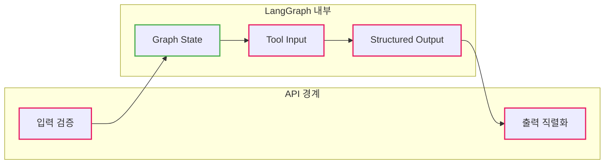

# Python TypedDict vs dataclass vs Pydantic 완전 비교

Python에서 데이터 구조를 정의하는 세 가지 방법의 차이점과 실전 활용 가이드

## 결론부터 말하면

**같은 데이터 구조를 세 가지 방법으로 정의할 수 있습니다:**

```python
# ========== 1. TypedDict - 딕셔너리 + 타입 힌트 ==========
from typing import TypedDict

class User(TypedDict):
    id: int
    name: str

user: User = {"id": 1, "name": "홍길동"}  # 런타임은 일반 dict
print(type(user))  # <class 'dict'>
print(user["name"])  # 딕셔너리 접근


# ========== 2. dataclass - 간단한 클래스 ==========
from dataclasses import dataclass

@dataclass
class User:
    id: int
    name: str

user = User(id=1, name="홍길동")  # 클래스 객체
print(type(user))  # <class '__main__.User'>
print(user.name)  # 속성 접근


# ========== 3. Pydantic - 런타임 검증 ==========
from pydantic import BaseModel

class User(BaseModel):
    id: int
    name: str

user = User(id=1, name="홍길동")  # 런타임 검증 + 자동 변환
user = User(id="123", name="홍길동")  # ✅ "123" → 123 (자동 변환!)
```

**핵심 차이:**

| 특징 | TypedDict | dataclass | Pydantic |
|------|-----------|-----------|----------|
| **런타임 타입** | `dict` | 클래스 | 클래스 |
| **접근** | `user["name"]` | `user.name` | `user.name` |
| **런타임 검증** | ❌ | ❌ | ✅ |
| **성능** | 가장 빠름 (1x) | 보통 (2-3x), `slots=True` 시 ~1x | Pydantic v2: 2-5x |
| **사용 케이스** | LangChain State, API 응답 | 내부 데이터 모델 | API 요청 검증 |

**선택 기준:**
- **성능/JSON 직렬화 중요** → `TypedDict`
- **속성 접근/가독성 중요** → `dataclass`
- **외부 입력 검증 필요** → `Pydantic`

## 1. TypedDict - 딕셔너리 타입 정의

### 기본 사용법

```python
from typing import TypedDict

class User(TypedDict):
    id: int
    name: str
    email: str

# ✅ 실제로는 그냥 dict!
user: User = {
    "id": 1,
    "name": "홍길동",
    "email": "hong@example.com"
}

print(type(user))  # <class 'dict'>
print(user["name"])  # 딕셔너리처럼 접근
```

### 주요 특징

```python
from typing import TypedDict, NotRequired

# 선택적 필드
class User(TypedDict):
    id: int
    name: str
    email: NotRequired[str]  # 선택적 필드 (Python 3.11+)

# 또는
class User(TypedDict, total=False):
    email: str  # 선택적 필드

# 사용
user1: User = {"id": 1, "name": "홍길동"}  # ✅ email 없어도 OK
user2: User = {"id": 1, "name": "홍길동", "email": "hong@example.com"}  # ✅ OK
```

### 장점

```python
# 1. 이미 dict라서 변환 불필요
import json

user: User = {"id": 1, "name": "홍길동"}
json.dumps(user)  # ✅ 바로 직렬화 가능!

# 2. 메모리 효율적
import sys
print(sys.getsizeof(user))  # 약 232 bytes (일반 dict와 동일)

# 3. 성능 최고 (런타임 오버헤드 없음)
for i in range(1000000):
    user = {"id": i, "name": f"user_{i}"}  # 가장 빠름
```

### 단점

```python
# ❌ 타입 오류를 런타임에 잡지 못함
user: User = {"id": "not_int", "name": 123}  # 실행됨! (mypy만 경고)

# ❌ 속성으로 접근 불가
user: User = {"id": 1, "name": "홍길동"}
print(user.name)  # ❌ AttributeError! (dict는 속성 접근 불가)
print(user["name"])  # ✅ OK

# ❌ IDE 자동완성 약함
user["  # IDE가 키 자동완성 제공 못할 수 있음
```

## 2. dataclass - 간단한 클래스

### 기본 사용법

```python
from dataclasses import dataclass

@dataclass
class User:
    id: int
    name: str
    email: str

# ✅ 클래스 인스턴스
user = User(id=1, name="홍길동", email="hong@example.com")

print(type(user))  # <class '__main__.User'>
print(user.name)   # 속성으로 접근
print(user["name"])  # ❌ TypeError! (dict가 아님)
```

### 주요 특징

```python
from dataclasses import dataclass, field, asdict

@dataclass
class User:
    id: int
    name: str
    email: str = "default@example.com"  # 기본값
    tags: list = field(default_factory=list)  # 가변 기본값

# 불변 객체
@dataclass(frozen=True)
class Point:
    x: int
    y: int

point = Point(x=10, y=20)
point.x = 30  # ❌ FrozenInstanceError! (수정 불가)
```

### slots=True: 성능 최적화 (Python 3.10+)

`slots=True` 옵션을 사용하면 **메모리 사용량이 TypedDict 수준으로 줄어들고, 속성 접근 속도도 빨라진다.**

```python
# ❌ 기본 dataclass: __dict__ 사용 (무거움)
@dataclass
class UserNormal:
    id: int
    name: str

# ✅ slots=True: __slots__ 사용 (가벼움)
@dataclass(slots=True)
class UserOptimized:
    id: int
    name: str

# 메모리 비교
import sys
normal = UserNormal(id=1, name="홍길동")
optimized = UserOptimized(id=1, name="홍길동")

print(sys.getsizeof(normal.__dict__))  # 약 104 bytes (__dict__ 오버헤드)
# UserOptimized는 __dict__가 없음!
```

**slots=True의 효과:**

| 항목 | 기본 dataclass | slots=True |
|------|---------------|------------|
| **메모리** | `__dict__` 포함 (무거움) | `__dict__` 없음 (가벼움) |
| **속성 접근** | 딕셔너리 조회 | 직접 메모리 접근 (빠름) |
| **동적 속성 추가** | 가능 | 불가능 |

**실무 권장:** Python 3.10 이상이라면 **항상 `slots=True`를 사용**하라. 성능이 TypedDict에 근접한다.

### 장점

```python
# 1. 속성 접근 (.name)
user = User(id=1, name="홍길동", email="hong@example.com")
print(user.name)  # ✅ 가독성 좋음
print(user.email)

# 2. __repr__ 자동 생성
print(user)  # User(id=1, name='홍길동', email='hong@example.com')

# 3. __eq__ 자동 생성
user1 = User(id=1, name="홍길동", email="hong@example.com")
user2 = User(id=1, name="홍길동", email="hong@example.com")
print(user1 == user2)  # ✅ True

# 4. IDE 자동완성 강력
user.  # IDE가 모든 속성 자동완성!
```

### 단점

```python
# ❌ JSON 직렬화 시 변환 필요
import json
from dataclasses import asdict

user = User(id=1, name="홍길동", email="hong@example.com")
json.dumps(user)  # ❌ TypeError!
json.dumps(asdict(user))  # ✅ OK (변환 필요)

# ❌ 타입 오류를 런타임에 잡지 못함
user = User(id="not_int", name=123, email="hong@example.com")
# ✅ 실행됨! (타입 검증 없음)
```

## 3. Pydantic - 데이터 검증

### 기본 사용법

```python
from pydantic import BaseModel, EmailStr, Field

class User(BaseModel):
    id: int
    name: str
    email: EmailStr  # 이메일 형식 검증!
    age: int = Field(gt=0, lt=150)  # 범위 검증

# ✅ 정상 생성
user = User(id=1, name="홍길동", email="hong@example.com", age=30)

# ❌ 런타임 ValidationError 발생!
try:
    user = User(id="not_int", name="홍길동", email="invalid", age=200)
except ValidationError as e:
    print(e)
    # id는 int여야 함!
    # email 형식이 잘못됨!
    # age는 150 미만이어야 함!
```

### 주요 특징

```python
from pydantic import BaseModel, validator

class User(BaseModel):
    id: int
    name: str
    email: str
    age: int

    # 커스텀 검증
    @validator('name')
    def name_must_not_be_empty(cls, v):
        if not v.strip():
            raise ValueError('이름은 비어있을 수 없습니다')
        return v

    @validator('age')
    def age_must_be_positive(cls, v):
        if v < 0:
            raise ValueError('나이는 0 이상이어야 합니다')
        return v
```

### 장점

```python
# 1. 런타임 타입 검증!
from pydantic import BaseModel, ValidationError

class User(BaseModel):
    id: int
    name: str

try:
    user = User(id="not_int", name="홍길동")
except ValidationError as e:
    print(e)  # ✅ 런타임에 타입 에러 잡음!

# 2. 자동 타입 변환
user = User(id="123", name="홍길동")  # 문자열 "123"
print(user.id)  # 123 (int로 자동 변환!)
print(type(user.id))  # <class 'int'>

# 3. JSON 직렬화/역직렬화 내장
user = User(id=1, name="홍길동")
json_str = user.model_dump_json()  # JSON 문자열
print(json_str)  # '{"id":1,"name":"홍길동"}'

user_dict = user.model_dump()  # dict
print(user_dict)  # {'id': 1, 'name': '홍길동'}

# 4. 복잡한 검증
from pydantic import EmailStr, HttpUrl

class User(BaseModel):
    email: EmailStr  # 이메일 형식 자동 검증
    website: HttpUrl  # URL 형식 자동 검증
    age: int = Field(ge=0, le=150)  # 범위 검증
```

### Pydantic v2: Rust 기반 성능 혁신

**Pydantic v2**(2023년 출시)는 코어 로직이 **Rust로 재작성**되어 성능이 비약적으로 개선되었다.

| 버전 | 성능 (vs TypedDict) | 특징 |
|------|---------------------|------|
| Pydantic v1 | 약 50배 느림 | 순수 Python |
| **Pydantic v2** | **약 2-5배 느림** | Rust 코어 (`pydantic-core`) |

```python
# Pydantic v2 성능 테스트
import time
from pydantic import BaseModel

class User(BaseModel):
    id: int
    name: str

# TypedDict (기준)
start = time.time()
for i in range(100000):
    user = {"id": i, "name": f"user_{i}"}
print(f"TypedDict: {time.time() - start:.2f}초")  # 약 0.05초

# Pydantic v2 (대폭 개선!)
start = time.time()
for i in range(100000):
    user = User(id=i, name=f"user_{i}")
print(f"Pydantic v2: {time.time() - start:.2f}초")  # 약 0.15-0.25초 (2-5배)
```

### 단점 (그래도 존재)

```python
# ⚠️ 여전히 검증 오버헤드는 있음
# 대량 데이터 처리 시 TypedDict/dataclass가 여전히 유리

# ⚠️ 메모리 사용량은 여전히 큼
import sys
user_dict = {"id": 1, "name": "홍길동"}
user_pydantic = User(id=1, name="홍길동")

print(sys.getsizeof(user_dict))  # 232 bytes
print(sys.getsizeof(user_pydantic))  # 약 400-500 bytes
```

**결론:** Pydantic v2는 "느려서 못 쓴다"는 말이 더 이상 유효하지 않다. 검증이 필요한 곳에서는 **적극 사용해도 된다.**

## 4. 핵심 차이 비교

### 비교표

| 특징 | TypedDict | dataclass | Pydantic |
|------|-----------|-----------|----------|
| **런타임 타입** | `dict` | 클래스 객체 | 클래스 객체 |
| **접근 방법** | `user["name"]` | `user.name` | `user.name` |
| **타입 검증** | ❌ (타입 체커만) | ❌ | ✅ 런타임 검증 |
| **데이터 변환** | ❌ | ❌ | ✅ 자동 변환 |
| **직렬화** | 불필요 (이미 dict) | `asdict()` 필요 | `.model_dump()` 내장 |
| **메모리** | 가벼움 (~230B) | 보통 (~300B), `slots=True` 시 가벼움 | 보통 (~400-500B) |
| **성능** | 빠름 (1x) | 보통 (2-3x), `slots=True` 시 ~1x | v2: 2-5x (v1은 50x) |
| **JSON 호환** | ✅ 바로 가능 | 변환 필요 | ✅ 바로 가능 |
| **IDE 자동완성** | 약함 | 강력 | 강력 |
| **불변성** | ❌ | `frozen=True` | `frozen=True` |
| **검증 로직** | ❌ | ❌ | ✅ 강력 |

### 언제 타입 체크가 일어나는가?

| 단계 | TypedDict | dataclass | Pydantic |
|------|-----------|-----------|----------|
| **코딩 시** | IDE 경고 | IDE 경고 | IDE 경고 |
| **mypy 실행** | ✅ 체크 | ✅ 체크 | ✅ 체크 |
| **런타임** | ❌ 체크 안함 | ❌ 체크 안함 | ✅ 체크함! |

## 5. 실전 비교 예시

### 타입 검증 비교

```python
from typing import TypedDict
from dataclasses import dataclass
from pydantic import BaseModel, ValidationError

# ========== TypedDict ==========
class UserDict(TypedDict):
    id: int
    name: str

user_dict: UserDict = {"id": "not_int", "name": 123}
print(user_dict)  # ✅ 실행됨! (검증 없음)


# ========== dataclass ==========
@dataclass
class UserDataclass:
    id: int
    name: str

user_dc = UserDataclass(id="not_int", name=123)
print(user_dc)  # ✅ 실행됨! (검증 없음)


# ========== Pydantic ==========
class UserPydantic(BaseModel):
    id: int
    name: str

try:
    user_pd = UserPydantic(id="not_int", name=123)
except ValidationError as e:
    print(e)  # ❌ ValidationError! (런타임 검증)
```

### JSON 직렬화 비교

```python
import json
from typing import TypedDict
from dataclasses import dataclass, asdict
from pydantic import BaseModel

# ========== TypedDict - 가장 간단 ==========
class UserDict(TypedDict):
    id: int
    name: str

user_dict: UserDict = {"id": 1, "name": "홍길동"}
json_str = json.dumps(user_dict)  # ✅ 바로 가능!
print(json_str)  # {"id": 1, "name": "홍길동"}


# ========== dataclass - 변환 필요 ==========
@dataclass
class UserDataclass:
    id: int
    name: str

user_dc = UserDataclass(id=1, name="홍길동")
json.dumps(user_dc)  # ❌ TypeError!
json_str = json.dumps(asdict(user_dc))  # ✅ 변환 후 가능
print(json_str)  # {"id": 1, "name": "홍길동"}


# ========== Pydantic - 내장 메서드 ==========
class UserPydantic(BaseModel):
    id: int
    name: str

user_pd = UserPydantic(id=1, name="홍길동")
json_str = user_pd.model_dump_json()  # ✅ 내장 메서드
print(json_str)  # {"id":1,"name":"홍길동"}
```

### 자동 타입 변환 비교

```python
# ========== TypedDict - 변환 없음 ==========
user_dict: UserDict = {"id": "123", "name": "홍길동"}
print(type(user_dict["id"]))  # <class 'str'> (문자열 그대로)


# ========== dataclass - 변환 없음 ==========
user_dc = UserDataclass(id="123", name="홍길동")
print(type(user_dc.id))  # <class 'str'> (문자열 그대로)


# ========== Pydantic - 자동 변환! ==========
user_pd = UserPydantic(id="123", name="홍길동")
print(type(user_pd.id))  # <class 'int'> (자동 변환!)
print(user_pd.id)  # 123
```

## 6. LangChain/LangGraph 1.0에서의 선택 가이드

### 결론: 용도별로 다르다

**"반은 맞고 반은 틀리다"** - 정확히 이해해야 한다.

| 사용처 | 추천 | 이유 |
|--------|------|------|
| **Graph State** (대화 상태) | **TypedDict** | `add_messages` 리듀서와 호환, 성능 |
| **Tool Input** (도구 인자) | **Pydantic** | LLM이 도구 호출 시 인자 검증 필수 |
| **Structured Output** (결과) | **Pydantic** | LLM 출력 JSON 검증 필수 |

### Pre-built Agent vs Custom Graph

**핵심:** 마이그레이션 가이드의 "Pydantic 지원 제거"는 **Pre-built Agent** 이야기다.

| 구분 | State 지원 | 설명 |
|------|-----------|------|
| **Pre-built Agent** | TypedDict만 | `create_agent`, `create_react_agent` 등 |
| **Custom Graph** | 둘 다 가능 | `StateGraph` 직접 정의 시 |

**Pre-built Agent (TypedDict만 지원):**

```python
from langchain.agents import create_agent, AgentState

# AgentState는 TypedDict 기반
# Pydantic 사용 불가
agent = create_agent(llm, tools, state_schema=MyState)
```

**Custom Graph (둘 다 가능, TypedDict 권장):**

```python
from langgraph.graph import StateGraph

# TypedDict도 되고
class StateDict(TypedDict):
    messages: list

# Pydantic도 되지만... 권장하지 않음
class StatePydantic(BaseModel):
    messages: list

graph = StateGraph(StateDict)  # ✅ 권장
graph = StateGraph(StatePydantic)  # ⚠️ 가능하지만 비권장
```

### 왜 State에 TypedDict를 권장하는가?

#### 이유 1: Reducer(`add_messages`)와의 궁합

LangGraph의 핵심은 **State를 계속 업데이트(Patch)**하는 것이다.

```python
from typing import TypedDict, Annotated
from langgraph.graph.message import add_messages

class State(TypedDict):
    # 덮어쓰지 않고 "추가"하라는 리듀서
    messages: Annotated[list, add_messages]
```

이 구조는 dict가 가볍고 직관적이다. Pydantic은 "검증 후 덮어쓰기"가 메인이라 Patch 방식과 맞지 않는다.

#### 이유 2: 성능

그래프가 돌면서 수십 번 State를 업데이트하는데, 매번 Pydantic 검증을 돌리면 비효율적이다.

#### 이유 3: 내부 호환성

`ToolNode` 등 내부 컴포넌트가 `state["messages"]` 형태로 접근한다. Pydantic은 `.messages`로 접근해서 호환 문제가 생길 수 있다.

#### 이유 4: Checkpointing (직렬화 안정성)

**가장 결정적인 이유.** LangGraph는 대화 중간 상태를 DB(Redis, Postgres 등)에 저장(Checkpoint)한다.

| 타입 | 저장 | 복구 | 안정성 |
|------|------|------|--------|
| **TypedDict** | 순수 JSON | 완벽 복구 | ✅ 높음 |
| **Pydantic** | JSON 가능 | 복원 시 문제 가능 | ⚠️ 낮음 |

```python
# Pydantic 복구 시 문제 예시
# 1. 저장: state → JSON → DB
# 2. 복구: DB → JSON → ??? (Pydantic 객체로 복원 실패 가능)
#    - 버전 호환성 문제
#    - 커스텀 Validator 문제
#    - 중첩 객체 Hydration 문제
```

**결론:** DB에 상태를 저장하고 불러오는 과정에서 에러를 방지하기 위해 TypedDict가 표준이다.

### 마이그레이션 방법

**Before (v0.x): Pydantic 사용**

```python
from pydantic import BaseModel

class AgentState(BaseModel):
    messages: list[str]
    next_step: str | None = None
    user_id: str
    context: dict = {}
```

**After (v1.0): TypedDict 사용**

```python
from typing import TypedDict, Annotated, NotRequired
from langgraph.graph.message import add_messages

# 방법 1: 직접 TypedDict 정의
class AgentState(TypedDict):
    messages: Annotated[list, add_messages]
    next_step: NotRequired[str]
    user_id: str
    context: NotRequired[dict]

# 방법 2: langchain.agents.AgentState 상속
from langchain.agents import AgentState

class MyAgentState(AgentState):
    user_id: str
    context: NotRequired[dict]
```

### 마이그레이션 체크리스트

```python
# ========== 변환 규칙 ==========

# 1. BaseModel/dataclass → TypedDict
from pydantic import BaseModel  # ❌ 제거
from typing import TypedDict    # ✅ 사용

# 2. 선택적 필드
field: str | None = None        # ❌ Before
field: NotRequired[str]         # ✅ After

# 3. 기본값 있는 필드
field: dict = {}                # ❌ Before (TypedDict는 기본값 불가)
field: NotRequired[dict]        # ✅ After

# 4. .model_dump() 호출 제거
graph.invoke(state.model_dump())  # ❌ Before
graph.invoke(state)               # ✅ After (이미 dict)

# 5. 검증 로직 → middleware로 이동
@validator('name')                # ❌ Before
def validate(state):              # ✅ After (middleware hook)
```

### 검증이 필요하다면? Middleware 사용

공식 가이드에서 권장하는 방식:

```python
from typing import TypedDict
from pydantic import BaseModel, ValidationError

# State는 TypedDict
class AgentState(TypedDict):
    messages: list
    user_data: dict

# 검증용 Pydantic 모델 (State 아님!)
class UserDataValidator(BaseModel):
    name: str
    age: int
    email: str

# Middleware hook에서 검증
def validation_middleware(state: AgentState) -> AgentState:
    """State 진입 시 검증"""
    try:
        validated = UserDataValidator(**state["user_data"])
        state["user_data"] = validated.model_dump()
    except ValidationError as e:
        state["error"] = str(e)
    return state
```

### TypedDict State 정의 패턴

```python
from typing import TypedDict, Annotated, NotRequired
from langgraph.graph.message import add_messages

# ========== 기본 State ==========
class SimpleState(TypedDict):
    messages: Annotated[list, add_messages]
    next_step: str


# ========== 선택적 필드 포함 ==========
class AgentState(TypedDict):
    messages: Annotated[list, add_messages]
    user_id: str
    context: NotRequired[dict]
    metadata: NotRequired[dict]


# ========== 복잡한 워크플로우 State ==========
class WorkflowState(TypedDict):
    messages: Annotated[list, add_messages]

    # 워크플로우 제어
    current_step: str
    completed_steps: list[str]

    # 데이터
    user_input: str
    processed_data: NotRequired[dict]
    final_result: NotRequired[str]

    # 메타데이터
    start_time: float
    error: NotRequired[str]
```

### TypedDict 다중 상속 (Mixin 패턴)

LangGraph를 짜다 보면 State가 점점 커진다. **다중 상속**을 활용하면 코드가 깔끔해진다.

```python
from typing import TypedDict, Annotated, NotRequired
from langgraph.graph.message import add_messages

# ========== 기본 State 모듈들 ==========
class MessageState(TypedDict):
    """메시지 관련"""
    messages: Annotated[list, add_messages]

class UserState(TypedDict):
    """사용자 정보"""
    user_id: str
    email: NotRequired[str]

class ToolState(TypedDict):
    """도구 실행 결과"""
    tool_results: NotRequired[list]
    last_tool: NotRequired[str]

# ========== Mixin으로 조합 ==========
class SimpleAgentState(MessageState, UserState):
    """간단한 에이전트: 메시지 + 사용자"""
    context: str

class FullAgentState(MessageState, UserState, ToolState):
    """전체 에이전트: 메시지 + 사용자 + 도구"""
    current_step: str
    final_answer: NotRequired[str]
```

**장점:**
- 재사용 가능한 State 블록 정의
- 필요한 기능만 조합
- Pydantic보다 유연한 다중 상속

### 협업 팁: TypedDict에는 주석을 꼼꼼히

TypedDict는 클래스처럼 생겼지만 **실제로는 딕셔너리**다. IDE 자동완성이 약하고, 팀원들이 각 필드의 의미를 알기 어려울 수 있다.

**Docstring과 주석을 꼼꼼히 달아라:**

```python
class AgentState(TypedDict):
    """
    에이전트 대화 상태 관리

    Attributes:
        messages: LangChain 메시지 리스트 (HumanMessage, AIMessage 등)
        user_id: 사용자 DB PK (UUID 형식)
        context: 최근 3턴 대화 요약본
        step: 현재 워크플로우 단계 ("init" | "process" | "done")
    """
    messages: Annotated[list, add_messages]
    user_id: str      # DB PK (UUID 형식)
    context: str      # 최근 3턴 요약본
    step: str         # "init" | "process" | "done"
```

**왜 중요한가:**
- Pydantic은 `Field(description="...")` 로 설명 추가 가능
- dataclass는 IDE가 속성을 잘 보여줌
- **TypedDict는 아무것도 없으면 그냥 딕셔너리처럼 보임** → 주석 필수

### 전체 아키텍처: 역할별 사용 도구



| 사용처 | 도구 | 이유 |
|--------|------|------|
| **API 입력** | Pydantic | 외부 데이터 검증 필수 |
| **Graph State** | TypedDict | 리듀서 호환, 성능 |
| **Tool Input** | Pydantic | LLM 도구 호출 인자 검증 |
| **Structured Output** | Pydantic | LLM 출력 JSON 검증 |
| **API 출력** | Pydantic | 응답 직렬화 |

### 정석 코드 예시

```python
from typing import TypedDict, Annotated
from pydantic import BaseModel, Field
from langgraph.graph import StateGraph
from langgraph.graph.message import add_messages

# ========== 1. Graph State → TypedDict ==========
class GraphState(TypedDict):
    messages: Annotated[list, add_messages]
    context: str

# ========== 2. Tool Input → Pydantic ==========
class SearchInput(BaseModel):
    """검색 도구의 입력 스키마"""
    query: str = Field(description="검색할 쿼리")
    max_results: int = Field(default=5, description="최대 결과 수")

@tool(args_schema=SearchInput)
def search(query: str, max_results: int) -> str:
    # 검색 로직
    ...

# ========== 3. Structured Output → Pydantic ==========
class FinalResponse(BaseModel):
    """LLM 최종 출력 스키마"""
    summary: str = Field(description="요약 내용")
    sentiment: str = Field(description="감정 분석 결과")
    confidence: float = Field(ge=0, le=1, description="신뢰도")

# LLM에 구조화된 출력 요청
llm_with_structure = llm.with_structured_output(FinalResponse)

# ========== 4. 그래프 구성 ==========
graph = StateGraph(GraphState)  # State는 TypedDict
# ... 노드 추가 ...
```

## 7. 선택 가이드

### 의사결정 플로우차트

```
데이터 구조를 정의해야 한다면?
    │
    ├─ 런타임 검증이 필수? ──────────────→ Pydantic
    │   (외부 입력, API 요청)
    │
    ├─ 속성 접근 선호? ─────────────────→ dataclass
    │   (코드 가독성, IDE 자동완성)
    │
    ├─ dict 형태로 전달? ───────────────→ TypedDict
    │   (LangChain State, API 응답)
    │
    ├─ 성능이 최우선? ─────────────────→ TypedDict
    │   (대량 데이터 처리)
    │
    └─ JSON 직렬화 빈번? ───────────────→ TypedDict
        (REST API, 메시지 큐)
```

### 구체적인 사용 사례

#### ✅ TypedDict를 쓰세요

```python
# 1. LangChain/LangGraph State
from typing import TypedDict
from langgraph.graph import StateGraph

class AgentState(TypedDict):
    messages: list[str]
    next_step: str

graph = StateGraph(AgentState)


# 2. API 응답 구조
class APIResponse(TypedDict):
    status: int
    data: dict
    message: str

def api_handler() -> APIResponse:
    return {
        "status": 200,
        "data": {"user": "홍길동"},
        "message": "Success"
    }


# 3. 설정 파일 구조
class Config(TypedDict):
    db_url: str
    api_key: str
    timeout: int

config: Config = {
    "db_url": "postgresql://...",
    "api_key": "secret",
    "timeout": 30
}
```

#### ✅ dataclass를 쓰세요

```python
# 1. 간단한 데이터 클래스
from dataclasses import dataclass

@dataclass
class Point:
    x: int
    y: int

point = Point(x=10, y=20)
print(point.x)  # 속성 접근


# 2. 불변 객체
@dataclass(frozen=True)
class Coordinate:
    lat: float
    lon: float

coord = Coordinate(lat=37.5, lon=127.0)
# coord.lat = 38.0  # ❌ FrozenInstanceError!


# 3. 내부 데이터 모델
@dataclass
class UserProfile:
    user_id: str
    name: str
    age: int
    tags: list = field(default_factory=list)
```

#### ✅ Pydantic을 쓰세요

```python
# 1. API 요청 검증
from pydantic import BaseModel, EmailStr, Field

class UserCreateRequest(BaseModel):
    username: str = Field(min_length=3, max_length=20)
    email: EmailStr
    age: int = Field(gt=0, lt=150)
    password: str = Field(min_length=8)

@app.post("/users")
def create_user(user: UserCreateRequest):
    # ✅ 자동으로 검증됨!
    return {"message": "User created"}


# 2. 환경 변수 검증
from pydantic_settings import BaseSettings

class Settings(BaseSettings):
    database_url: str
    api_key: str
    debug: bool = False

    class Config:
        env_file = ".env"

settings = Settings()  # ✅ 환경 변수 자동 로드 + 검증


# 3. 복잡한 데이터 변환
from pydantic import validator

class UserData(BaseModel):
    name: str
    email: str
    age: int

    @validator('email')
    def email_must_be_valid(cls, v):
        if '@' not in v:
            raise ValueError('유효한 이메일이 아닙니다')
        return v.lower()  # 소문자로 변환
```

### 비교 요약

| 사용 사례 | TypedDict | dataclass | Pydantic |
|----------|-----------|-----------|----------|
| **LangChain State** | ✅ 필수 | ❌ | ❌ |
| **API 응답** | ✅ 최적 | ⚠️ 변환 필요 | ✅ 좋음 |
| **API 요청 검증** | ❌ | ❌ | ✅ 최적 |
| **내부 데이터 모델** | ⚠️ | ✅ 최적 | ⚠️ 과함 |
| **설정 파일** | ✅ 좋음 | ✅ 좋음 | ✅ 최적 |
| **대량 데이터 처리** | ✅ 최적 | ⚠️ | ❌ 느림 |
| **불변 객체** | ❌ | ✅ frozen | ✅ frozen |
| **JSON 직렬화** | ✅ 최적 | ⚠️ 변환 필요 | ✅ 내장 |

## 8. Java와의 비교

### TypedDict ≈ Map with Type Hints

```python
# ========== Python TypedDict ==========
from typing import TypedDict

class User(TypedDict):
    id: int
    name: str

user: User = {"id": 1, "name": "홍길동"}


# ========== Java Map ==========
// 타입 안전성 없음
Map<String, Object> user = new HashMap<>();
user.put("id", 1);
user.put("name", "홍길동");

// 또는 Record (Java 14+)
public record User(int id, String name) {}
User user = new User(1, "홍길동");
```

### dataclass ≈ Java Record / Lombok @Data

```python
# ========== Python dataclass ==========
from dataclasses import dataclass

@dataclass
class User:
    id: int
    name: str

user = User(id=1, name="홍길동")


# ========== Java Record (Java 14+) ==========
public record User(int id, String name) {}
User user = new User(1, "홍길동");


# ========== Java Lombok @Data ==========
@Data
public class User {
    private int id;
    private String name;
}
User user = new User();
user.setId(1);
user.setName("홍길동");
```

### Pydantic ≈ Bean Validation (JSR 380)

```python
# ========== Python Pydantic ==========
from pydantic import BaseModel, EmailStr, Field

class User(BaseModel):
    id: int
    name: str
    email: EmailStr
    age: int = Field(gt=0, lt=150)

user = User(id=1, name="홍길동", email="hong@example.com", age=30)
# ✅ 자동 검증


# ========== Java Bean Validation ==========
import javax.validation.constraints.*;

public class User {
    @NotNull
    private Integer id;

    @NotBlank
    private String name;

    @Email
    private String email;

    @Min(0) @Max(150)
    private Integer age;
}

// 검증 실행
ValidatorFactory factory = Validation.buildDefaultValidatorFactory();
Validator validator = factory.getValidator();
Set<ConstraintViolation<User>> violations = validator.validate(user);
```

### 런타임 검증 비교

| 언어 | 타입 체크 시점 | 런타임 검증 |
|------|---------------|-------------|
| **Java** | 컴파일 타임 | Bean Validation |
| **Python TypedDict** | mypy 실행 시 | ❌ |
| **Python dataclass** | mypy 실행 시 | ❌ |
| **Python Pydantic** | 런타임 | ✅ |

## 실무 팁

### 1. 성능 순위 (Pydantic v2 기준)

```
TypedDict (가장 빠름) > dataclass(slots=True) ≈ TypedDict > dataclass > Pydantic v2
     1x                       ~1x                         2-3x         2-5x
```

**참고:** Pydantic v1은 50x 느렸지만, v2는 Rust 코어로 대폭 개선됨.

### 2. 메모리 순위

```
TypedDict ≈ dataclass(slots=True) > dataclass > Pydantic
   ~230 bytes      ~230 bytes         ~300 bytes    ~400-500 bytes
```

**참고:** `dataclass`에 `slots=True` 사용 시 TypedDict 수준으로 가벼워짐.

### 3. 검증 순위

```
Pydantic (런타임 검증) > dataclass/TypedDict (mypy만)
```

### 4. 최종 권장

```python
# ✅ 일반적인 경우
from typing import TypedDict  # 가벼움, 빠름, JSON 직렬화 쉬움

# ✅ 속성 접근 선호
from dataclasses import dataclass  # 가독성, IDE 지원

# ✅ 외부 입력 검증
from pydantic import BaseModel  # 안전, 자동 변환

# ⚠️ LangChain 1.0+
from typing import TypedDict  # 필수! (Pydantic/dataclass 지원 안됨)
```

### 5. 학습 순서

1. **TypedDict** - 가장 간단, 기본 타입 힌트
2. **dataclass** - 클래스 편의성 이해
3. **Pydantic** - 검증이 필요한 경우만

---

## 참고 자료

- [Python TypedDict 공식 문서](https://docs.python.org/3/library/typing.html#typing.TypedDict)
- [dataclass 공식 문서](https://docs.python.org/3/library/dataclasses.html)
- [Pydantic 공식 문서](https://docs.pydantic.dev/)
- [LangChain v1 마이그레이션 가이드 - State Type Restrictions](https://docs.langchain.com/oss/python/migrate/langchain-v1#state-type-restrictions) - 공식 문서
- [LangGraph v1 마이그레이션 가이드 - Deprecations](https://docs.langchain.com/oss/python/migrate/langgraph-v1#deprecations) - 공식 문서
- [LangChain & LangGraph 1.0 발표](https://blog.langchain.com/langchain-langgraph-1dot0/)
