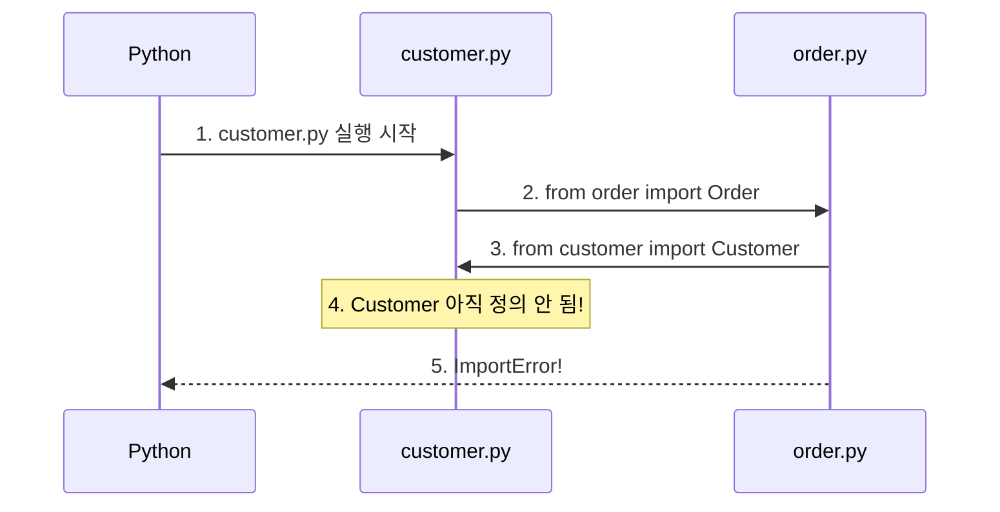
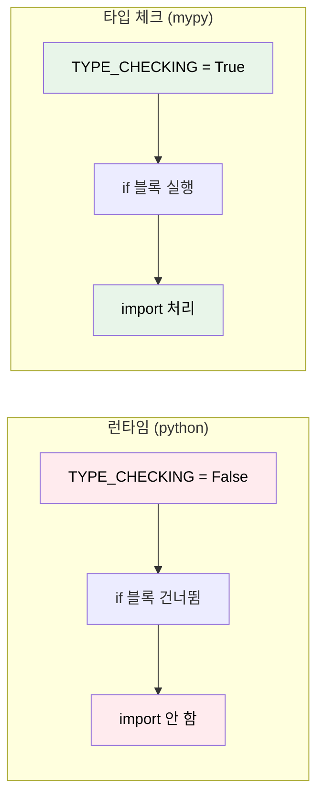

# Python Typing (타입 힌팅)

Java 개발자가 Python에서 가장 불안해하는 것, "이 함수가 뭘 받고 뭘 반환하는 거지?"

## 결론부터 말하면

Python은 동적 타이핑 언어지만, **타입 힌트**로 정적 분석의 이점을 누릴 수 있다. 단, Java와 달리 **런타임에는 완전히 무시**되므로 mypy 같은 타입 체커가 필요하다.

```python
# 타입 힌트 없이 - 뭘 받고 뭘 반환하는지 모름
def process(data):
    return result

# 타입 힌트 사용 - 한눈에 파악 가능
def process(data: dict[str, list[int]]) -> list[tuple[str, float]]:
    return result
```

| 특징 | Java | Python (타입 힌트) |
|------|------|-------------------|
| 타입 체크 시점 | 컴파일 타임 (강제) | 도구 실행 시 (선택) |
| 런타임 체크 | O | **X (무시됨!)** |
| 타입 없이 실행 | 불가능 | 가능 |

---

## 1. 왜 타입 힌트가 필요한가?

### 동적 타이핑의 자유로움, 그리고 대가

Java 개발자가 Python을 처음 접하면 해방감을 느낀다. 타입 선언 없이 바로 코드를 작성할 수 있기 때문이다.

```python
def add(a, b):
    return a + b

result = add(1, 2)  # 3
```

하지만 이 자유에는 대가가 따른다.

```python
result1 = add(1, 2)        # 3 (정수 덧셈)
result2 = add("1", "2")    # "12" (문자열 결합!)
result3 = add(1, "2")      # TypeError - 런타임에만 발견!
```

Java였다면 컴파일 단계에서 잡았을 버그가, Python에서는 **실제로 그 코드가 실행될 때까지** 발견되지 않는다. 테스트 커버리지가 낮으면? 프로덕션에서 터진다.

### 타입 힌트가 해결하는 것들

타입 힌트를 추가하면 세 가지 이점을 얻는다.

**첫째, 버그를 미리 잡는다.**

```python
def add(a: int, b: int) -> int:
    return a + b

result = add(1, "2")  # mypy: error: Argument 2 has incompatible type "str"
```

**둘째, IDE가 똑똑해진다.**

```python
# 타입 힌트 없이
user = get_user(1)
user.  # IDE가 뭘 추천할지 모름

# 타입 힌트 사용
def get_user(user_id: int) -> User:
    ...

user = get_user(1)
user.  # IDE가 User의 모든 속성/메서드 자동완성!
```

**셋째, 코드가 문서화된다.** 복잡한 함수도 시그니처만 보면 무슨 일을 하는지 파악할 수 있다.

---

## 2. 기본 문법

### 변수와 함수

```python
# 변수 타입 힌트
name: str = "John"
age: int = 30
is_active: bool = True

# 함수 파라미터와 반환값
def greet(name: str) -> str:
    return f"Hello, {name}"

# 반환값이 없는 경우
def log_message(message: str) -> None:
    print(message)
```

Java와 비교하면 타입 위치만 다르다:

```python
# Python
def get_user(user_id: int) -> str:
    return "John"

# Java
public String getUser(int userId) {
    return "John";
}
```

### 컬렉션 타입 (Python 3.9+)

```python
# list
numbers: list[int] = [1, 2, 3]
names: list[str] = ["John", "Jane"]

# dict
scores: dict[str, int] = {"math": 90, "english": 85}

# tuple (고정 길이)
point: tuple[int, int] = (10, 20)
rgb: tuple[int, int, int] = (255, 0, 0)

# set
tags: set[str] = {"python", "java"}
```

### Optional과 Union (Python 3.10+)

```python
# None이 될 수 있는 타입
def find_user(user_id: int) -> str | None:
    if user_id == 1:
        return "John"
    return None

# 여러 타입 가능
def process_id(value: int | str) -> str:
    return str(value)
```

Python 3.9 이하에서는 `typing` 모듈 필요:

```python
from typing import Optional, Union, List, Dict

def find_user(user_id: int) -> Optional[str]:  # str | None
    ...

def process(value: Union[int, str]) -> str:    # int | str
    ...

numbers: List[int] = [1, 2, 3]                 # list[int]
```

---

## 3. 중요: 런타임에는 무시된다!

이것이 Java 개발자가 가장 혼란스러워하는 부분이다.

```python
def add(a: int, b: int) -> int:
    return a + b

# 타입 힌트를 완전히 무시하고 실행됨!
result = add("Hello", "World")  # "HelloWorld" - 에러 없음!
```

Java에서는 상상할 수 없는 일이다:

```java
public int add(int a, int b) {
    return a + b;
}

add("Hello", "World");  // 컴파일 에러! 실행조차 불가
```

### 그렇다면 타입 체크는 언제?

| 단계 | Java | Python |
|------|------|--------|
| 코딩 시 | IDE 경고 | IDE 경고 (설정 시) |
| 컴파일 시 | **에러!** | 체크 안 함 |
| 타입 체커 | - | mypy/pyright 실행 시 |
| 런타임 | - | **무시됨!** |

Python에서 타입 체크를 받으려면 **별도 도구를 실행**해야 한다:

```bash
# mypy 설치
pip install mypy

# 타입 체크 실행
mypy script.py
# error: Argument 1 has incompatible type "str"; expected "int"
```

### 런타임 검증이 필요하다면? Pydantic

외부 입력(API, 사용자 입력)처럼 런타임에 타입을 검증해야 한다면 Pydantic을 사용한다:

```python
from pydantic import BaseModel, ValidationError

class User(BaseModel):
    id: int
    name: str

try:
    user = User(id="not_int", name="john")  # 런타임에 검증!
except ValidationError as e:
    print(e)  # id: Input should be a valid integer
```

---

## 4. 버전별 권장 문법

Python 버전에 따라 문법이 다르다. 최신 문법이 더 간결하다.

| 기능 | Python 3.8 이하 | Python 3.9+ | Python 3.10+ |
|------|----------------|-------------|--------------|
| 리스트 | `List[int]` | `list[int]` | `list[int]` |
| 딕셔너리 | `Dict[str, int]` | `dict[str, int]` | `dict[str, int]` |
| Optional | `Optional[str]` | `Optional[str]` | `str \| None` |
| Union | `Union[int, str]` | `Union[int, str]` | `int \| str` |

**권장:** Python 3.10 이상이라면 현대적 문법 사용

```python
# Python 3.10+ 권장
def process(value: int | str) -> str | None:
    return str(value) if value else None

users: list[dict[str, int | str]] = []
```

---

## 5. 고급 타입

### TypedDict - 딕셔너리 구조 정의

```python
from typing import TypedDict

class User(TypedDict):
    id: int
    name: str
    email: str

def create_user(user: User) -> None:
    print(user["name"])  # IDE 자동완성!
    # user["unknown"]    # error: 정의되지 않은 키

user: User = {"id": 1, "name": "John", "email": "john@example.com"}
```

### Generic - 재사용 가능한 타입

```python
from typing import TypeVar, Generic

T = TypeVar('T')

class Box(Generic[T]):
    def __init__(self, item: T):
        self.item = item

    def get(self) -> T:
        return self.item

int_box: Box[int] = Box(123)
str_box: Box[str] = Box("hello")
```

Java의 제네릭과 거의 동일하다:

```java
public class Box<T> {
    private T item;
    public T get() { return item; }
}
```

### Callable - 함수 타입

```python
from typing import Callable

# (int, int) -> int 형태의 함수
def apply(func: Callable[[int, int], int], a: int, b: int) -> int:
    return func(a, b)

result = apply(lambda x, y: x + y, 5, 3)  # 8
```

---

## 6. TYPE_CHECKING: 순환 import 해결하기

실무 코드를 보다 보면 이런 패턴을 자주 만난다:

```python
from typing import TYPE_CHECKING

if TYPE_CHECKING:
    from app.core.agents.base.base_agent import BaseAgent
    from app.core.config import AppConfig
```

처음 보면 "이게 뭐지?"라는 생각이 든다. 왜 굳이 `if` 문 안에 import를 넣을까?

### 6.1 문제 상황: 순환 import

두 모듈이 서로를 import하면 **순환 import** 문제가 발생한다.

```
order.py → customer.py import
customer.py → order.py import
→ ImportError!
```

실제 코드로 보자. 온라인 쇼핑몰을 만든다고 가정한다.

**customer.py**
```python
from order import Order  # Order를 import

class Customer:
    def __init__(self, name: str):
        self.name = name
        self.orders: list[Order] = []

    def place_order(self, product: str) -> Order:
        order = Order(customer=self, product=product)
        self.orders.append(order)
        return order
```

**order.py**
```python
from customer import Customer  # Customer를 import

class Order:
    def __init__(self, customer: Customer, product: str):
        self.customer = customer
        self.product = product

    def get_customer_name(self) -> str:
        return self.customer.name
```

이 코드를 실행하면?

```bash
$ python customer.py
ImportError: cannot import name 'Order' from partially initialized module 'order'
(most likely due to a circular import)
```

**왜 이런 일이 발생할까?**



Python은 파일을 **위에서 아래로** 실행한다. `customer.py`의 `class Customer` 정의에 도달하기 전에 `order.py`로 점프했고, `order.py`는 아직 정의되지 않은 `Customer`를 import하려고 시도한다.

### 6.2 해결책: TYPE_CHECKING

`TYPE_CHECKING`은 **런타임에는 항상 `False`** 인 상수다. 하지만 **타입 체커(mypy, pyright)는 `True`로 간주**한다.

```python
from typing import TYPE_CHECKING

print(TYPE_CHECKING)  # False - 런타임에는 항상 False!
```

이 특성을 이용하면 순환 import를 해결할 수 있다.

**customer.py (수정 후)**
```python
from typing import TYPE_CHECKING

if TYPE_CHECKING:
    from order import Order  # 런타임에는 실행 안 됨!

class Customer:
    def __init__(self, name: str):
        self.name = name
        self.orders: list["Order"] = []  # 문자열로 타입 힌트

    def place_order(self, product: str) -> "Order":  # 문자열로 타입 힌트
        from order import Order  # 실제 사용 시점에 import
        order = Order(customer=self, product=product)
        self.orders.append(order)
        return order
```

**order.py (수정 후)**
```python
from typing import TYPE_CHECKING

if TYPE_CHECKING:
    from customer import Customer  # 런타임에는 실행 안 됨!

class Order:
    def __init__(self, customer: "Customer", product: str):  # 문자열로 타입 힌트
        self.customer = customer
        self.product = product

    def get_customer_name(self) -> str:
        return self.customer.name
```

### 6.3 동작 원리

| 시점 | `if TYPE_CHECKING:` 블록 | 결과 |
|------|------------------------|------|
| **런타임** (python 실행) | ❌ 실행 안 됨 | 순환 import 발생 안 함 |
| **타입 체크** (mypy 실행) | ✅ 실행됨 | 타입 정보 정상 분석 |



### 6.4 Forward Reference (문자열 타입 힌트)

`TYPE_CHECKING` 블록의 import는 런타임에 실행되지 않으므로, 해당 타입은 **문자열로** 작성해야 한다. 이를 **Forward Reference** 라고 한다.

```python
if TYPE_CHECKING:
    from order import Order

class Customer:
    # ❌ 런타임 에러! Order가 정의되지 않음
    def place_order(self) -> Order:
        pass

    # ✅ 문자열로 작성하면 OK
    def place_order(self) -> "Order":
        pass
```

**Python 3.11+에서는 `from __future__ import annotations`를 사용하면 따옴표를 생략할 수 있다:**

```python
from __future__ import annotations  # 모든 타입 힌트를 문자열로 처리
from typing import TYPE_CHECKING

if TYPE_CHECKING:
    from order import Order

class Customer:
    # ✅ 따옴표 없이도 OK (Python 3.11+)
    def place_order(self) -> Order:
        pass
```

### 6.5 실무 예제: Agent 시스템

실제 프로젝트에서 볼 수 있는 패턴이다. Context 객체가 여러 컴포넌트를 참조하는 경우:

**ctx.py**
```python
from typing import TYPE_CHECKING
import logging

if TYPE_CHECKING:
    # 타입 힌트에만 필요한 import들
    from httpx import AsyncClient as HttpAsyncClient
    from redis.asyncio import Redis as RedisAsyncClient
    from app.core.agents.base.base_agent import BaseAgent
    from app.core.config import AppConfig
    from app.core.managers import LLMManager

logger = logging.getLogger(__name__)

class Context:
    """애플리케이션 전역 컨텍스트"""

    def __init__(self):
        self._agent: "BaseAgent | None" = None
        self._config: "AppConfig | None" = None
        self._http_client: "HttpAsyncClient | None" = None
        self._redis: "RedisAsyncClient | None" = None
        self._llm_manager: "LLMManager | None" = None

    def set_agent(self, agent: "BaseAgent") -> None:
        self._agent = agent

    def get_agent(self) -> "BaseAgent":
        if self._agent is None:
            raise RuntimeError("Agent not initialized")
        return self._agent

    async def get_http_client(self) -> "HttpAsyncClient":
        if self._http_client is None:
            import httpx  # 실제 사용 시점에 import
            self._http_client = httpx.AsyncClient()
        return self._http_client
```

**왜 이렇게 할까?**

1. **순환 import 방지**: `BaseAgent`가 `Context`를 참조할 수 있음
2. **시작 시간 단축**: 무거운 모듈을 실제 사용 시점까지 지연
3. **타입 안전성 유지**: mypy가 타입을 정상적으로 체크

### 6.6 정리: TYPE_CHECKING 사용 패턴

```python
from typing import TYPE_CHECKING

# 1. TYPE_CHECKING 블록에 타입 힌트용 import
if TYPE_CHECKING:
    from some_module import SomeClass

# 2. 타입 힌트는 문자열로 (Forward Reference)
def process(obj: "SomeClass") -> "SomeClass":
    pass

# 3. 실제 사용 시에는 함수 내부에서 import
def create_instance() -> "SomeClass":
    from some_module import SomeClass  # 지연 import
    return SomeClass()
```

| 상황 | 해결 방법 |
|------|----------|
| 순환 import 발생 | `TYPE_CHECKING` + Forward Reference |
| 무거운 모듈 지연 로딩 | `TYPE_CHECKING` + 함수 내 import |
| 타입 힌트만 필요한 경우 | `TYPE_CHECKING` 블록 사용 |

---

## 7. 실전 예제: Repository 패턴

```python
from typing import TypeVar, Generic, Protocol
from dataclasses import dataclass

class Entity(Protocol):
    id: int

T = TypeVar('T', bound=Entity)

class Repository(Generic[T]):
    def __init__(self):
        self._storage: dict[int, T] = {}

    def save(self, entity: T) -> T:
        self._storage[entity.id] = entity
        return entity

    def find_by_id(self, entity_id: int) -> T | None:
        return self._storage.get(entity_id)

    def find_all(self) -> list[T]:
        return list(self._storage.values())

# 사용
@dataclass
class User:  # Entity를 명시적으로 상속하지 않음!
    id: int
    name: str

user_repo: Repository[User] = Repository()
user_repo.save(User(id=1, name="John"))
```

여기서 주목할 점: `User`는 `Entity`를 **상속하지 않았는데** 왜 동작할까?

Python의 `Protocol`은 **구조적 타이핑**(Structural Typing)을 따른다. 클래스가 Protocol에 정의된 속성/메서드를 **가지고만 있으면** 타입이 일치한다고 판단한다. `User`에 `id: int`가 있으므로 `Entity` Protocol을 만족한다.

Java는 **명목적 타이핑**(Nominal Typing)을 사용한다. 반드시 `implements Entity`를 명시해야 한다:

```java
// Java - 명시적 선언 필수
interface Entity { int getId(); }

class User implements Entity {  // implements 필수!
    private int id;
    public int getId() { return id; }
}
```

---

## 정리

### 핵심 포인트

1. **타입 힌트는 런타임에 무시된다** - Java와 가장 큰 차이
2. **타입 체크는 별도 도구(mypy) 필요** - CI/CD에 통합 권장
3. **Python 3.10+ 문법 사용** - `int | str`, `list[int]`
4. **런타임 검증은 Pydantic** - 외부 입력 처리 시

### IDE 설정 (VS Code)

```json
{
    "python.analysis.typeCheckingMode": "basic"
}
```

### CI/CD 통합

```bash
pip install mypy
mypy --strict src/
```

---

## 출처

- [PEP 484 - Type Hints](https://peps.python.org/pep-0484/) - 공식 문서
- [mypy Documentation](https://mypy.readthedocs.io/)
- [Python typing 모듈](https://docs.python.org/3/library/typing.html)
