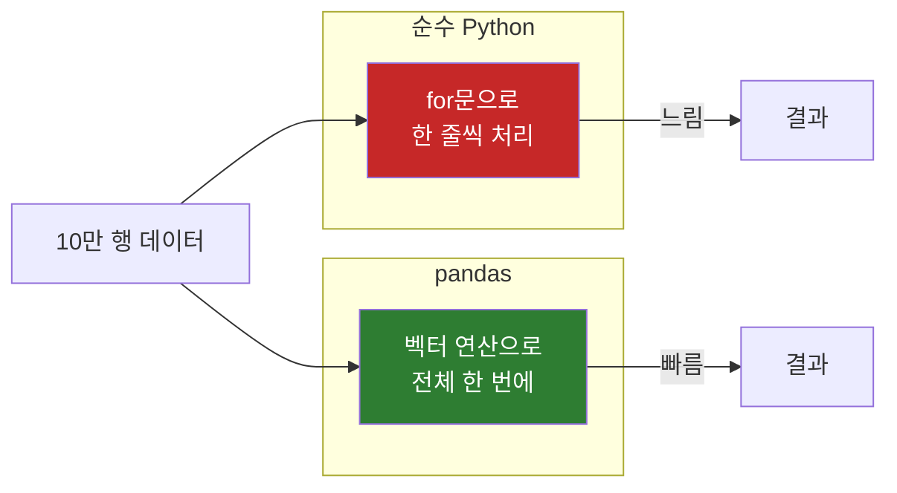
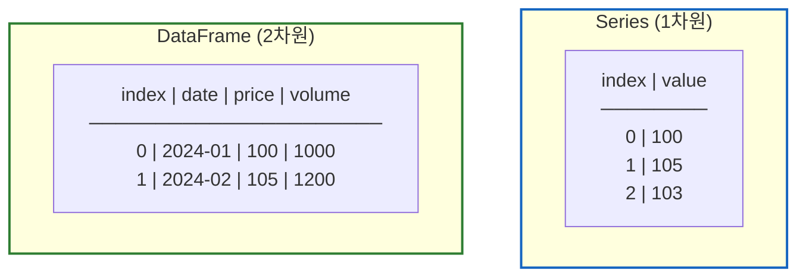
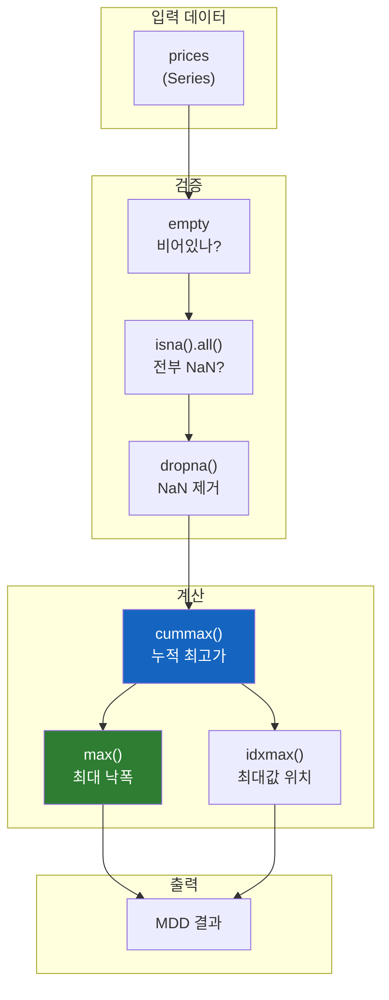

# Python pandas 핵심 함수 가이드

엑셀 수천 줄을 for문 없이 한 줄로 처리하는 마법

## 결론부터 말하면

**pandas는 표 형태 데이터를 다루는 Python 라이브러리** 다. 엑셀처럼 행과 열로 구성된 데이터를 for문 없이 벡터 연산으로 처리한다.



| 작업 | 순수 Python | pandas |
|------|-------------|--------|
| 10만 행 합계 | `for row in data: total += row` | `df['col'].sum()` |
| 조건 필터링 | 중첩 if문 | `df[df['price'] > 1000]` |
| 그룹별 집계 | 딕셔너리 수동 관리 | `df.groupby('category').mean()` |

## 1. 왜 pandas가 필요한가?

### 1.1 문제: 주식 데이터 10년치를 분석해야 한다

MDD(Maximum Drawdown) 알림봇을 만든다고 가정해보자. 주식의 고점 대비 최대 낙폭을 계산해야 한다.

순수 Python으로 하면?

```python
# ❌ 순수 Python: 복잡하고 느림
prices = [100, 105, 103, 110, 95, 102, 88, 92]

max_so_far = prices[0]
max_drawdown = 0

for price in prices:
    if price > max_so_far:
        max_so_far = price
    drawdown = (max_so_far - price) / max_so_far
    if drawdown > max_drawdown:
        max_drawdown = drawdown

print(f"MDD: {max_drawdown:.2%}")  # MDD: 20.00%
```

pandas로 하면?

```python
# ✅ pandas: 간결하고 빠름
import pandas as pd

prices = pd.Series([100, 105, 103, 110, 95, 102, 88, 92])
peak = prices.cummax()  # 누적 최대값
drawdown = (peak - prices) / peak
mdd = drawdown.max()

print(f"MDD: {mdd:.2%}")  # MDD: 20.00%
```

**코드가 절반으로 줄었고, 의도가 명확하다.** "누적 최대값 구하고, 낙폭 계산하고, 최대값 찾기" 가 그대로 코드로 읽힌다.

### 1.2 pandas의 두 가지 핵심 자료구조



| 자료구조 | 비유 | Python 대응 |
|----------|------|-------------|
| **Series** | 엑셀 한 열 | `list` + 인덱스 |
| **DataFrame** | 엑셀 시트 전체 | `list[dict]` + 인덱스 |

```python
import pandas as pd

# Series: 1차원 (한 열)
prices = pd.Series([100, 105, 103], name='price')
print(prices)
# 0    100
# 1    105
# 2    103
# Name: price, dtype: int64

# DataFrame: 2차원 (표 전체)
df = pd.DataFrame({
    'date': ['2024-01', '2024-02', '2024-03'],
    'price': [100, 105, 103],
    'volume': [1000, 1200, 900]
})
print(df)
#       date  price  volume
# 0  2024-01    100    1000
# 1  2024-02    105    1200
# 2  2024-03    103     900
```

## 2. 필수 함수 - 집계와 통계

### 2.1 기본 집계 함수

| 함수 | 역할 | 반환값 |
|------|------|--------|
| `sum()` | 합계 | 단일 값 |
| `mean()` | 평균 | 단일 값 |
| `min()` | 최소값 | 단일 값 |
| `max()` | 최대값 | 단일 값 |
| `count()` | 개수 (NaN 제외) | 단일 값 |
| `std()` | 표준편차 | 단일 값 |

```python
import pandas as pd

prices = pd.Series([100, 105, 103, 110, 95])

print(prices.sum())    # 513
print(prices.mean())   # 102.6
print(prices.min())    # 95
print(prices.max())    # 110
print(prices.count())  # 5
print(prices.std())    # 5.594...

# 한 번에 모든 통계
print(prices.describe())
# count      5.000000
# mean     102.600000
# std        5.594640
# min       95.000000
# 25%      100.000000
# 50%      103.000000
# 75%      105.000000
# max      110.000000
```

### 2.2 누적 함수 (cumulative)

**"여기까지의"** 값을 계산하는 함수들. MDD 계산의 핵심이다.

| 함수 | 역할 | 예시 |
|------|------|------|
| `cumsum()` | 누적 합계 | `[1,2,3]` → `[1,3,6]` |
| `cummax()` | 누적 최대값 | `[1,3,2,4]` → `[1,3,3,4]` |
| `cummin()` | 누적 최소값 | `[3,1,2,0]` → `[3,1,1,0]` |
| `cumprod()` | 누적 곱 | `[2,3,4]` → `[2,6,24]` |

```python
import pandas as pd

# 주가 데이터
prices = pd.Series([100, 105, 103, 110, 95, 102, 88])

# cummax(): 여기까지 중 최고가
peak = prices.cummax()
print(peak)
# 0    100  ← 100이 최고
# 1    105  ← 105가 새 최고
# 2    105  ← 103 < 105이므로 유지
# 3    110  ← 110이 새 최고
# 4    110  ← 95 < 110이므로 유지
# 5    110  ← 유지
# 6    110  ← 유지

# cummin(): 여기까지 중 최저가
trough = prices.cummin()
print(trough)
# 0    100
# 1    100  ← 105 > 100이므로 유지
# 2    100
# 3    100
# 4     95  ← 95가 새 최저
# 5     95
# 6     88  ← 88이 새 최저
```

**MDD 계산 실전 예시:**

```python
import pandas as pd

prices = pd.Series([100, 105, 103, 110, 95, 102, 88, 92])

# 1. 누적 최고가 (고점)
peak = prices.cummax()

# 2. 고점 대비 하락률 (Drawdown)
drawdown = (peak - prices) / peak

# 3. 최대 낙폭 (MDD)
mdd = drawdown.max()

print("주가:", prices.tolist())
print("고점:", peak.tolist())
print("낙폭:", drawdown.round(4).tolist())
print(f"MDD: {mdd:.2%}")

# 주가: [100, 105, 103, 110, 95, 102, 88, 92]
# 고점: [100, 105, 105, 110, 110, 110, 110, 110]
# 낙폭: [0.0, 0.0, 0.019, 0.0, 0.1364, 0.0727, 0.2, 0.1636]
# MDD: 20.00%
```

## 3. 필수 함수 - 조건과 필터링

### 3.1 조건 검사 함수

| 함수 | 역할 | 반환 |
|------|------|------|
| `isna()` / `isnull()` | NaN인지 확인 | Boolean Series |
| `notna()` / `notnull()` | NaN 아닌지 확인 | Boolean Series |
| `any()` | 하나라도 True? | 단일 Boolean |
| `all()` | 모두 True? | 단일 Boolean |
| `empty` | 비어있는지 (속성) | 단일 Boolean |

```python
import pandas as pd
import numpy as np

data = pd.Series([100, np.nan, 103, np.nan, 95])

# isna(): NaN인 위치 확인
print(data.isna())
# 0    False
# 1     True   ← NaN
# 2    False
# 3     True   ← NaN
# 4    False

# notna(): NaN이 아닌 위치
print(data.notna())
# 0     True
# 1    False
# 2     True
# 3    False
# 4     True

# any(): 하나라도 NaN이 있나?
print(data.isna().any())  # True

# all(): 모두 NaN인가?
print(data.isna().all())  # False

# empty: 데이터가 비어있나?
print(data.empty)                # False
print(pd.Series([]).empty)       # True
```

### 3.2 Boolean 인덱싱 (조건 필터링)

pandas의 가장 강력한 기능 중 하나. **조건식 자체로 필터링** 한다.

```python
import pandas as pd

df = pd.DataFrame({
    'stock': ['삼성전자', 'SK하이닉스', 'LG에너지솔루션', '카카오', '네이버'],
    'price': [70000, 180000, 450000, 55000, 210000],
    'change': [2.5, -1.2, 0.8, -3.5, 1.1]
})

# 조건: 가격이 10만원 이상
expensive = df[df['price'] >= 100000]
print(expensive)
#           stock   price  change
# 1     SK하이닉스  180000    -1.2
# 2  LG에너지솔루션  450000     0.8
# 4         네이버  210000     1.1

# 조건: 하락한 종목 (change < 0)
falling = df[df['change'] < 0]
print(falling)
#        stock   price  change
# 1  SK하이닉스  180000    -1.2
# 3       카카오   55000    -3.5

# 복합 조건: 가격 10만 이상 AND 상승 중
filtered = df[(df['price'] >= 100000) & (df['change'] > 0)]
print(filtered)
#           stock   price  change
# 2  LG에너지솔루션  450000     0.8
# 4         네이버  210000     1.1
```

**조건 연산자:**

| 연산 | 일반 Python | pandas |
|------|-------------|--------|
| AND | `and` | `&` |
| OR | `or` | `|` |
| NOT | `not` | `~` |

```python
# ❌ 잘못된 방법 (일반 Python 문법)
# df[df['price'] > 100000 and df['change'] > 0]  # 에러!

# ✅ 올바른 방법 (pandas 비트 연산자 + 괄호)
df[(df['price'] > 100000) & (df['change'] > 0)]
```

## 4. 필수 함수 - 데이터 변환

### 4.1 결측값 처리

| 함수 | 역할 |
|------|------|
| `dropna()` | NaN 행/열 제거 |
| `fillna(value)` | NaN을 특정 값으로 대체 |
| `ffill()` | 앞의 값으로 채움 (Forward Fill) |
| `bfill()` | 뒤의 값으로 채움 (Backward Fill) |

```python
import pandas as pd
import numpy as np

prices = pd.Series([100, np.nan, np.nan, 110, 95, np.nan])

# dropna(): NaN 제거
print(prices.dropna())
# 0    100.0
# 3    110.0
# 4     95.0

# fillna(): 특정 값으로 채우기
print(prices.fillna(0))
# 0    100.0
# 1      0.0
# 2      0.0
# 3    110.0
# 4     95.0
# 5      0.0

# ffill(): 앞의 값으로 채우기 (주가 데이터에 유용)
print(prices.ffill())
# 0    100.0
# 1    100.0  ← 앞의 100으로
# 2    100.0  ← 앞의 100으로
# 3    110.0
# 4     95.0
# 5     95.0  ← 앞의 95로

# bfill(): 뒤의 값으로 채우기
print(prices.bfill())
# 0    100.0
# 1    110.0  ← 뒤의 110으로
# 2    110.0  ← 뒤의 110으로
# 3    110.0
# 4     95.0
# 5      NaN  ← 뒤에 값이 없음
```

### 4.2 정렬

| 함수 | 역할 |
|------|------|
| `sort_values(by)` | 값 기준 정렬 |
| `sort_index()` | 인덱스 기준 정렬 |

```python
import pandas as pd

df = pd.DataFrame({
    'stock': ['삼성전자', 'SK하이닉스', '카카오'],
    'price': [70000, 180000, 55000],
    'change': [2.5, -1.2, -3.5]
})

# 가격 기준 오름차순
print(df.sort_values('price'))
#        stock   price  change
# 2       카카오   55000    -3.5
# 0     삼성전자   70000     2.5
# 1  SK하이닉스  180000    -1.2

# 가격 기준 내림차순
print(df.sort_values('price', ascending=False))
#        stock   price  change
# 1  SK하이닉스  180000    -1.2
# 0     삼성전자   70000     2.5
# 2       카카오   55000    -3.5

# 여러 열 기준 정렬
print(df.sort_values(['change', 'price'], ascending=[False, True]))
```

### 4.3 apply() - 커스텀 함수 적용

모든 행/열에 사용자 정의 함수를 적용한다.

```python
import pandas as pd

prices = pd.Series([100, 105, 103, 110, 95])

# 간단한 함수 적용
def categorize(price):
    if price >= 105:
        return '고가'
    elif price >= 100:
        return '중가'
    else:
        return '저가'

print(prices.apply(categorize))
# 0    중가
# 1    고가
# 2    중가
# 3    고가
# 4    저가

# lambda로 간단하게
print(prices.apply(lambda x: x * 1.1))  # 10% 인상
# 0    110.0
# 1    115.5
# 2    113.3
# 3    121.0
# 4    104.5
```

## 5. 필수 함수 - 그룹 연산

### 5.1 groupby()

**SQL의 GROUP BY** 와 동일. 특정 열 기준으로 그룹화 후 집계한다.

```python
import pandas as pd

df = pd.DataFrame({
    'sector': ['IT', 'IT', '금융', '금융', 'IT'],
    'stock': ['삼성전자', '카카오', '신한지주', 'KB금융', '네이버'],
    'price': [70000, 55000, 40000, 52000, 210000],
    'change': [2.5, -3.5, 1.2, 0.8, 1.1]
})

# 섹터별 평균 주가
print(df.groupby('sector')['price'].mean())
# sector
# IT      111666.666667
# 금융     46000.000000

# 섹터별 여러 통계
print(df.groupby('sector')['price'].agg(['mean', 'min', 'max', 'count']))
#              mean    min     max  count
# sector
# IT      111666.67  55000  210000      3
# 금융     46000.00  40000   52000      2

# 섹터별 전체 통계
print(df.groupby('sector').agg({
    'price': 'mean',
    'change': 'sum'
}))
#              price  change
# sector
# IT      111666.67     0.1
# 금융     46000.00     2.0
```

## 6. 실전 예제: MDD 알림봇

### 6.1 전체 코드

```python
import pandas as pd

def calculate_mdd(prices: pd.Series) -> dict:
    """
    MDD(Maximum Drawdown)를 계산한다.

    Args:
        prices: 주가 시계열 데이터

    Returns:
        dict: MDD 정보 (mdd, peak_date, trough_date)
    """
    # 결측값 확인
    if prices.empty:
        return {'mdd': None, 'error': '데이터가 비어있습니다'}

    if prices.isna().all():
        return {'mdd': None, 'error': '모든 값이 NaN입니다'}

    # NaN 제거
    prices = prices.dropna()

    # 1. 누적 최고가 (고점)
    peak = prices.cummax()

    # 2. 고점 대비 하락률
    drawdown = (peak - prices) / peak

    # 3. MDD와 해당 위치
    mdd = drawdown.max()
    mdd_idx = drawdown.idxmax()

    # 4. 고점 날짜 찾기 (MDD 발생일까지의 최고점)
    # .loc[:mdd_idx]는 mdd_idx를 포함하므로 +1 불필요
    peak_idx = prices.loc[:mdd_idx].idxmax()

    return {
        'mdd': mdd,
        'mdd_percent': f'{mdd:.2%}',
        'peak_idx': peak_idx,
        'trough_idx': mdd_idx,
        'peak_price': prices[peak_idx],
        'trough_price': prices[mdd_idx]
    }


def check_mdd_alert(prices: pd.Series, threshold: float = 0.1) -> bool:
    """
    MDD가 임계값을 초과하면 알림을 발생시킨다.

    Args:
        prices: 주가 시계열
        threshold: 알림 임계값 (기본 10%)

    Returns:
        bool: 알림 발생 여부
    """
    result = calculate_mdd(prices)

    if result.get('mdd') is None:
        return False

    return result['mdd'] >= threshold


# 사용 예시
if __name__ == '__main__':
    # 샘플 데이터 (날짜 인덱스)
    dates = pd.date_range('2024-01-01', periods=10, freq='D')
    prices = pd.Series(
        [100, 105, 103, 110, 95, 102, 88, 92, 98, 105],
        index=dates
    )

    result = calculate_mdd(prices)
    print(f"MDD: {result['mdd_percent']}")
    print(f"고점: {result['peak_idx'].date()} - {result['peak_price']:,}원")
    print(f"저점: {result['trough_idx'].date()} - {result['trough_price']:,}원")

    # 알림 체크
    if check_mdd_alert(prices, threshold=0.15):
        print("경고: MDD 15% 초과!")
```

**출력:**

```
MDD: 20.00%
고점: 2024-01-04 - 110원
저점: 2024-01-07 - 88원
경고: MDD 15% 초과!
```

### 6.2 사용된 pandas 함수 정리



## 7. 자주 쓰는 함수 요약 (with 예제)

### 집계 함수

| 함수 | 역할 | 예시 결과 |
|------|------|----------|
| `sum()` | 합계 | `513` |
| `mean()` | 평균 | `102.6` |
| `min()` | 최소값 | `95` |
| `max()` | 최대값 | `110` |
| `std()` | 표준편차 | `5.59` |
| `count()` | 개수 | `5` |

```python
import pandas as pd

prices = pd.Series([100, 105, 103, 110, 95])

prices.sum()    # 513       - 전체 합계
prices.mean()   # 102.6     - 평균
prices.min()    # 95        - 최소값
prices.max()    # 110       - 최대값
prices.std()    # 5.594...  - 표준편차
prices.count()  # 5         - 개수 (NaN 제외)
```

### 누적 함수

| 함수 | 역할 | 예시 |
|------|------|------|
| `cummax()` | 누적 최대 | `[1,3,2,4]` → `[1,3,3,4]` |
| `cummin()` | 누적 최소 | `[3,1,2,0]` → `[3,1,1,0]` |
| `cumsum()` | 누적 합 | `[1,2,3]` → `[1,3,6]` |

```python
import pandas as pd

s = pd.Series([1, 3, 2, 4])

s.cummax()  # [1, 3, 3, 4] - 여기까지 중 최대값
s.cummin()  # [1, 1, 1, 1] - 여기까지 중 최소값
s.cumsum()  # [1, 4, 6, 10] - 여기까지의 합계

# MDD 계산에 활용
prices = pd.Series([100, 110, 95, 88, 102])
peak = prices.cummax()  # [100, 110, 110, 110, 110]
drawdown = (peak - prices) / peak
# [0.0, 0.0, 0.136, 0.2, 0.073]
```

### 조건/검사 함수

| 함수 | 역할 | 반환 |
|------|------|------|
| `isna()` | NaN 여부 | Boolean Series |
| `notna()` | NaN 아닌지 | Boolean Series |
| `any()` | 하나라도 True | `True`/`False` |
| `all()` | 모두 True | `True`/`False` |
| `empty` | 비어있나 (속성) | `True`/`False` |

```python
import pandas as pd
import numpy as np

s = pd.Series([100, np.nan, 103, np.nan])

s.isna()   # [False, True, False, True] - NaN인 위치
s.notna()  # [True, False, True, False] - 값이 있는 위치

s.isna().any()   # True  - NaN이 하나라도 있나?
s.isna().all()   # False - 전부 NaN인가?
s.notna().all()  # False - 전부 값이 있나?

s.empty              # False - 데이터가 있음
pd.Series([]).empty  # True  - 빈 Series
```

### 위치 찾기 함수

| 함수 | 역할 | 예시 |
|------|------|------|
| `idxmax()` | 최대값 **인덱스** | `2024-01-04` |
| `idxmin()` | 최소값 **인덱스** | `2024-01-07` |

```python
import pandas as pd

# 날짜 인덱스 사용
dates = pd.date_range('2024-01-01', periods=5)
prices = pd.Series([100, 110, 95, 88, 102], index=dates)

prices.idxmax()  # Timestamp('2024-01-02') - 최고가 날짜
prices.idxmin()  # Timestamp('2024-01-04') - 최저가 날짜

# 정수 인덱스 사용
prices2 = pd.Series([100, 110, 95, 88, 102])
prices2.idxmax()  # 1 - 최대값 위치
prices2.idxmin()  # 3 - 최소값 위치
```

### 결측값 처리

| 함수 | 역할 |
|------|------|
| `dropna()` | NaN 제거 |
| `fillna(v)` | NaN을 v로 대체 |
| `ffill()` | 앞의 값으로 채움 |
| `bfill()` | 뒤의 값으로 채움 |

```python
import pandas as pd
import numpy as np

prices = pd.Series([100, np.nan, np.nan, 110, 95])

# NaN 제거
prices.dropna()
# 0    100.0
# 3    110.0
# 4     95.0

# 특정 값으로 채우기
prices.fillna(0)
# [100, 0, 0, 110, 95]

# 앞의 값으로 채우기 (주가 데이터에 유용)
prices.ffill()
# [100, 100, 100, 110, 95]

# 뒤의 값으로 채우기
prices.bfill()
# [100, 110, 110, 110, 95]
```

### 정렬 함수

| 함수 | 역할 |
|------|------|
| `sort_values()` | 값 기준 정렬 |
| `sort_index()` | 인덱스 기준 정렬 |
| `nlargest(n)` | 상위 n개 |
| `nsmallest(n)` | 하위 n개 |

```python
import pandas as pd

prices = pd.Series([100, 110, 95, 88, 102],
                   index=['A', 'B', 'C', 'D', 'E'])

# 값 기준 정렬
prices.sort_values()
# D     88
# C     95
# A    100
# E    102
# B    110

# 내림차순
prices.sort_values(ascending=False)
# B    110
# E    102
# A    100
# C     95
# D     88

# 상위 3개
prices.nlargest(3)
# B    110
# E    102
# A    100

# 하위 2개
prices.nsmallest(2)
# D    88
# C    95
```

## 8. 정리

### pandas를 쓰는 이유

| 이유 | 설명 |
|------|------|
| **간결함** | for문 없이 한 줄로 집계 |
| **성능** | C로 구현된 벡터 연산 (NumPy 기반) |
| **가독성** | 의도가 코드에 그대로 드러남 |
| **생태계** | 금융, 데이터 분석의 사실상 표준 |

### MDD 계산 핵심 3줄

```python
peak = prices.cummax()           # 1. 누적 최고가
drawdown = (peak - prices) / peak  # 2. 고점 대비 하락률
mdd = drawdown.max()             # 3. 최대 낙폭
```

---

## 출처

- [pandas 공식 문서](https://pandas.pydata.org/docs/) - 공식 API 레퍼런스
- [pandas User Guide](https://pandas.pydata.org/docs/user_guide/index.html) - 사용자 가이드
- [10 minutes to pandas](https://pandas.pydata.org/docs/user_guide/10min.html) - 빠른 시작 가이드
