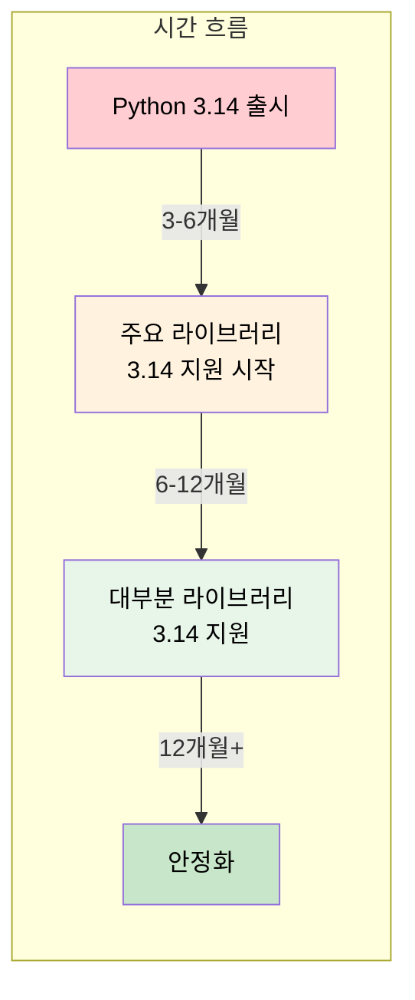
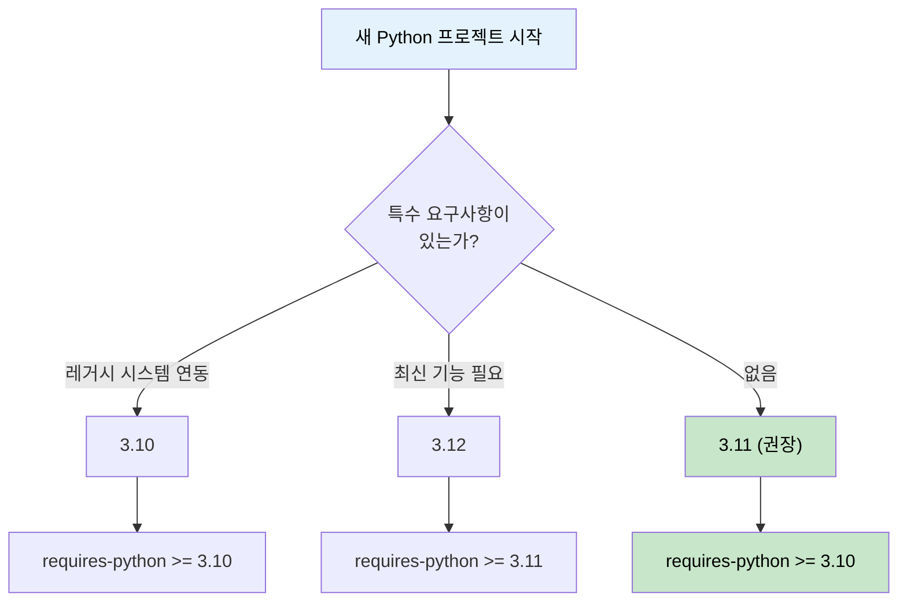

# Python 버전 선택 가이드

Python 프로젝트를 시작할 때 어떤 버전을 선택해야 하는지, 왜 최신 버전을 바로 쓰면 안 되는지에 대한 실무 가이드

## 결론부터 말하면

**"최신 버전에서 한두 단계 낮은 버전(N-1, N-2)"을 쓰는 것이 업계 표준이다.**

```python
# ❌ 피해야 할 선택
python = "3.14"  # 최신 버전 (2025.10 출시) - 라이브러리 호환성 확인 필요

# ✅ 권장하는 선택 (2025년 11월 기준)
python = "3.12"  # 강력 추천 - 검증된 안정성, 모든 라이브러리 지원
python = "3.13"  # 추천 - 최신 기능 + 좋은 호환성
python = "3.11"  # 안전한 선택 - 완벽한 호환성 (보안 패치만)
```

| 용도 | 추천 버전 | 이유 |
|------|----------|------|
| 에이전트/LLM 개발 | 3.11 또는 3.12 | 모든 AI 라이브러리 완벽 지원 |
| 새 프로젝트 | 3.12 또는 3.13 | 안정성 + 최신 기능 |
| 라이브러리 개발 | 3.10+ 지원 | 더 많은 사용자 커버 (3.9 EOL) |

## 1. 왜 버전이 중요한가?

### 1.1 버전에 따른 기능 차이

Python은 버전마다 새로운 문법과 기능이 추가된다.

```python
# Python 3.9: 딕셔너리 병합 연산자
merged = dict1 | dict2

# Python 3.10: 구조적 패턴 매칭 (match-case)
match command:
    case "start":
        start_server()
    case "stop":
        stop_server()
    case _:
        print("Unknown command")

# Python 3.10: 타입 힌트 개선 (Union → |)
def process(value: int | str) -> None:  # 3.10+
    pass

def process(value: Union[int, str]) -> None:  # 3.9 이하
    pass

# Python 3.11: 예외 그룹과 except*
try:
    async with asyncio.TaskGroup() as tg:
        tg.create_task(task1())
        tg.create_task(task2())
except* ValueError as eg:
    for exc in eg.exceptions:
        print(exc)

# Python 3.12: 타입 파라미터 문법
def first[T](items: list[T]) -> T:  # 3.12+
    return items[0]
```

### 1.2 성능 차이

Python 3.11에서 획기적인 성능 개선이 있었다.

```
Python 버전별 상대 성능 (3.10 = 100%)

3.10  ████████████████████ 100%
3.11  ████████████████████████████████ 160% (+60%)
3.12  █████████████████████████████████ 165% (+65%)
3.13  █████████████████████████████████ 167% (+67%)
```

### 1.3 보안 지원 기간

**Python 버전별 지원 기간 (2025년 11월 기준)**

| 버전 | 상태 | 보안 지원 종료 |
|------|------|---------------|
| 3.9 | EOL (지원 종료) | 2025년 10월 ❌ |
| 3.10 | 보안 패치만 | 2026년 10월 |
| 3.11 | 보안 패치만 | 2027년 10월 |
| 3.12 | 버그픽스 + 보안 | 2028년 10월 |
| 3.13 | 버그픽스 + 보안 | 2029년 10월 |
| 3.14 | 최신 안정 (2025.10.07 출시) | 2030년 10월 |

## 2. 왜 최신 버전을 바로 쓰면 안 되는가?

### 2.1 라이브러리 호환성 문제

Python 버전이 올라가면 라이브러리들이 따라오는 데 시간이 걸린다.



### 2.2 실제 설치 실패 사례

```bash
# Python 3.14에서 torch 설치 시도
$ pip install torch

ERROR: Could not find a version that satisfies the requirement torch
ERROR: No matching distribution found for torch

# 원인: torch가 아직 Python 3.14용 wheel을 빌드하지 않음
```

### 2.3 C 확장 라이브러리의 문제

NumPy, Pandas, TensorFlow 같은 라이브러리는 C/C++로 작성된 부분이 있어서 새 Python 버전에 맞춰 다시 컴파일해야 한다.

```python
# 이런 에러를 자주 보게 됨
import numpy as np
# ModuleNotFoundError: No module named 'numpy'

# 설치 시도
pip install numpy
# ERROR: Failed building wheel for numpy
# ERROR: Could not build wheels for numpy
```

### 2.4 스마트폰 비유

> **최신 Python 버전 = 최신 스마트폰**
>
> 📱 최신 스마트폰을 샀는데...
> - ❌ 즐겨쓰는 앱이 아직 호환 안 됨
> - ❌ 일부 앱은 실행하면 크래시
> - ❌ 업데이트 기다려야 함
>
> = **Python 최신 버전에서 라이브러리 호환 문제**

## 3. N-1, N-2 전략

### 3.1 업계 표준

```
현재 최신 안정 버전: Python 3.14 (2025년 10월 출시)

N-1 = 3.13  ← 추천 (최신 기능 + 안정성)
N-2 = 3.12  ← 강력 추천 (검증된 안정성)
N-3 = 3.11  ← 안전한 선택 (완벽한 호환성)
```

### 3.2 왜 N-1, N-2인가?

| 전략 | 장점 | 단점 |
|------|------|------|
| 최신 (N) | 최신 기능, 최고 성능 | 라이브러리 호환 문제 |
| N-1 | 최신 기능 + 좋은 호환성 | 일부 라이브러리 주의 필요 |
| N-2 | 완벽한 호환성, 검증됨 | 일부 최신 기능 없음 |
| N-3 이하 | 레거시 지원 | 보안 위험, 기능 부족 |

### 3.3 주요 기업들의 선택

**2025년 기준 주요 기업/프로젝트의 Python 버전**

| 기업/프로젝트 | 사용 버전 | 비고 |
|--------------|----------|------|
| AWS Lambda | 3.12 | 최신 런타임 |
| Google Cloud | 3.12 | Cloud Functions |
| LangChain | 3.9+ | 넓은 호환성 유지 |
| OpenAI SDK | 3.8+ | 하위 호환성 중시 |
| FastAPI | 3.8+ | 넓은 사용자 커버 |
| Django 5.0 | 3.10+ | 최신 기능 활용 |

## 4. 에이전트 개발 시 버전 선택

### 4.1 AI/LLM 관련 라이브러리 호환성

| 라이브러리 | 최소 버전 | 권장 버전 | 비고 |
|-----------|----------|----------|------|
| langchain | 3.9+ | 3.11+ | 일부 기능 3.10+ |
| langgraph | 3.9+ | 3.11+ | |
| openai | 3.8+ | 3.11+ | |
| anthropic | 3.8+ | 3.11+ | |
| pydantic | 3.8+ | 3.11+ | v2는 3.8+ |
| fastapi | 3.8+ | 3.11+ | |
| torch | 3.9+ | 3.11 | ⚠️ 3.13 지원 느림 |
| transformers | 3.9+ | 3.11 | |
| chromadb | 3.9+ | 3.11+ | |

### 4.2 추천 설정

```toml
# pyproject.toml - 에이전트 프로젝트
[project]
name = "my-agent"
requires-python = ">=3.10,<3.14"

[tool.poetry.dependencies]
python = "^3.11"  # 3.11 이상, 4.0 미만
```

```python
# setup.py (레거시)
setup(
    name="my-agent",
    python_requires=">=3.10,<3.14",
)
```

### 4.3 Docker 이미지 선택

```dockerfile
# ✅ 권장
FROM python:3.11-slim

# ✅ 대안
FROM python:3.12-slim

# ❌ 피해야 함
FROM python:3.14-slim  # 아직 불안정
FROM python:3.9-slim   # 곧 EOL
```

## 5. 버전별 주요 기능 요약

### Python 3.9 (2020년 10월)

```python
# 딕셔너리 병합 연산자
d1 = {"a": 1}
d2 = {"b": 2}
merged = d1 | d2  # {"a": 1, "b": 2}

# 타입 힌트에서 내장 컬렉션 직접 사용
def process(items: list[int]) -> dict[str, int]:  # 3.9+
    pass

# 3.8 이하에서는
from typing import List, Dict
def process(items: List[int]) -> Dict[str, int]:
    pass
```

### Python 3.10 (2021년 10월)

```python
# 구조적 패턴 매칭 (match-case)
def handle_response(response):
    match response:
        case {"status": 200, "data": data}:
            return process_data(data)
        case {"status": 404}:
            return "Not found"
        case {"status": status} if status >= 500:
            return f"Server error: {status}"
        case _:
            return "Unknown response"

# Union 타입의 새로운 문법
def square(number: int | float) -> int | float:
    return number ** 2

# 더 나은 에러 메시지
# 이전: SyntaxError: invalid syntax
# 이후: SyntaxError: '{' was never closed
```

### Python 3.11 (2022년 10월)

```python
# 예외 그룹과 except*
try:
    raise ExceptionGroup("errors", [ValueError("a"), TypeError("b")])
except* ValueError as eg:
    print(f"ValueError: {eg.exceptions}")
except* TypeError as eg:
    print(f"TypeError: {eg.exceptions}")

# 더 정확한 에러 위치 표시
def calculate(x, y, z):
    return x + y / z  # ZeroDivisionError 발생 시

# Python 3.11 에러 메시지:
#   return x + y / z
#              ~~^~~
# ZeroDivisionError: division by zero

# Self 타입
from typing import Self

class Builder:
    def set_name(self, name: str) -> Self:  # 3.11+
        self.name = name
        return self
```

### Python 3.12 (2023년 10월)

```python
# 타입 파라미터 문법 (제네릭 간소화)
def first[T](items: list[T]) -> T:  # 3.12+
    return items[0]

class Stack[T]:
    def __init__(self) -> None:
        self._items: list[T] = []

    def push(self, item: T) -> None:
        self._items.append(item)

# 3.11 이하에서는
from typing import TypeVar, Generic

T = TypeVar('T')

def first(items: list[T]) -> T:
    return items[0]

class Stack(Generic[T]):
    def __init__(self) -> None:
        self._items: list[T] = []

# f-string 개선 - 중첩 따옴표 허용
name = "world"
print(f"Hello {name.replace("world", "Python")}")  # 3.12+
```

### Python 3.13 (2024년 10월)

```python
# 실험적 JIT 컴파일러 (--enable-experimental-jit)
# 성능 최적화 지속

# 개선된 REPL
# - 여러 줄 편집
# - 컬러 출력
# - 더 나은 에러 메시지

# typing 모듈 개선
from typing import TypeIs

def is_str_list(val: list[object]) -> TypeIs[list[str]]:
    return all(isinstance(x, str) for x in val)
```

### Python 3.14 (2025년 10월)

```python
# 템플릿 문자열 리터럴 (t-string) - PEP 750
template = t"Hello {name}!"  # f-string과 유사하지만 지연 평가

# 어노테이션 지연 평가 (PEP 649)
# 타입 힌트가 런타임에 문자열로 저장되지 않고 필요 시 평가
class Node:
    def __init__(self, child: Node | None = None):  # 순환 참조 해결
        self.child = child

# 실험적 JIT 컴파일러 기본 포함 (macOS, Windows 바이너리)
# 공식 Android 바이너리 지원

# 서브인터프리터 표준 라이브러리 지원
import interpreters
interp = interpreters.create()
```

**주요 변경사항:**
- 템플릿 문자열 (t-string) 도입
- 어노테이션 지연 평가로 타입 힌트 개선
- JIT 컴파일러 공식 바이너리에 포함
- Android 공식 지원

## 6. Java와의 비교

Java 개발자라면 이런 비교가 도움이 될 수 있다.

| 항목 | Python | Java |
|------|--------|------|
| LTS 개념 | 없음 (매년 새 버전) | 있음 (8, 11, 17, 21) |
| 버전 선택 | N-1, N-2 전략 | LTS 버전 사용 |
| 하위 호환성 | 상대적으로 낮음 | 매우 높음 |
| 버전 관리 도구 | pyenv, conda | SDKMAN, jabba |
| 가상 환경 | venv, virtualenv | 불필요 (JAR 독립) |

```bash
# Python 버전 관리 (pyenv)
pyenv install 3.11.9
pyenv local 3.11.9

# Java 버전 관리 (SDKMAN)
sdk install java 21.0.2-tem
sdk use java 21.0.2-tem
```

## 7. 실무 팁

### 7.1 pyenv로 버전 관리

```bash
# pyenv 설치 (macOS)
brew install pyenv

# 사용 가능한 버전 확인
pyenv install --list | grep "3.11"

# 특정 버전 설치
pyenv install 3.11.9

# 프로젝트별 버전 설정
cd my-project
pyenv local 3.11.9  # .python-version 파일 생성

# 전역 기본 버전 설정
pyenv global 3.11.9
```

### 7.2 프로젝트 시작 시 체크리스트

- [ ] 사용할 주요 라이브러리의 Python 버전 요구사항 확인
- [ ] 팀/회사의 표준 Python 버전 확인
- [ ] 배포 환경(AWS Lambda, GCP 등)의 지원 버전 확인
- [ ] Docker 베이스 이미지 가용성 확인
- [ ] pyproject.toml에 requires-python 명시

### 7.3 버전 호환성 테스트

```yaml
# GitHub Actions - 여러 버전 테스트
name: Tests

on: [push, pull_request]

jobs:
  test:
    runs-on: ubuntu-latest
    strategy:
      matrix:
        python-version: ['3.10', '3.11', '3.12']

    steps:
    - uses: actions/checkout@v4
    - uses: actions/setup-python@v5
      with:
        python-version: ${{ matrix.python-version }}
    - run: pip install -e ".[test]"
    - run: pytest
```

## 요약

### 버전 선택 의사결정 트리



### 핵심 정리

| 원칙 | 설명 |
|------|------|
| N-1, N-2 전략 | 최신에서 1-2단계 낮은 버전이 가장 안정적 |
| 2025년 11월 권장 | **3.12** (강력 추천) 또는 **3.13** (최신 기능) |
| 최신 버전 (3.14) | 라이브러리 호환성 확인 후 사용 |
| EOL 주의 | 3.9 지원 종료 (2025.10), 3.10+ 사용 권장 |
| 명시적 버전 지정 | `requires-python`으로 항상 명시 |

## 출처

- [Python Release Schedule (PEP 602)](https://peps.python.org/pep-0602/) - 공식 릴리스 일정
- [PEP 745 – Python 3.14 Release Schedule](https://peps.python.org/pep-0745/) - 3.14 릴리스 일정
- [Status of Python Versions](https://devguide.python.org/versions/) - 공식 버전 상태
- [What's New in Python 3.14](https://docs.python.org/3/whatsnew/3.14.html) - 3.14 새 기능
- [Python 3.14.0 Release](https://www.python.org/downloads/release/python-3140/) - 공식 다운로드
