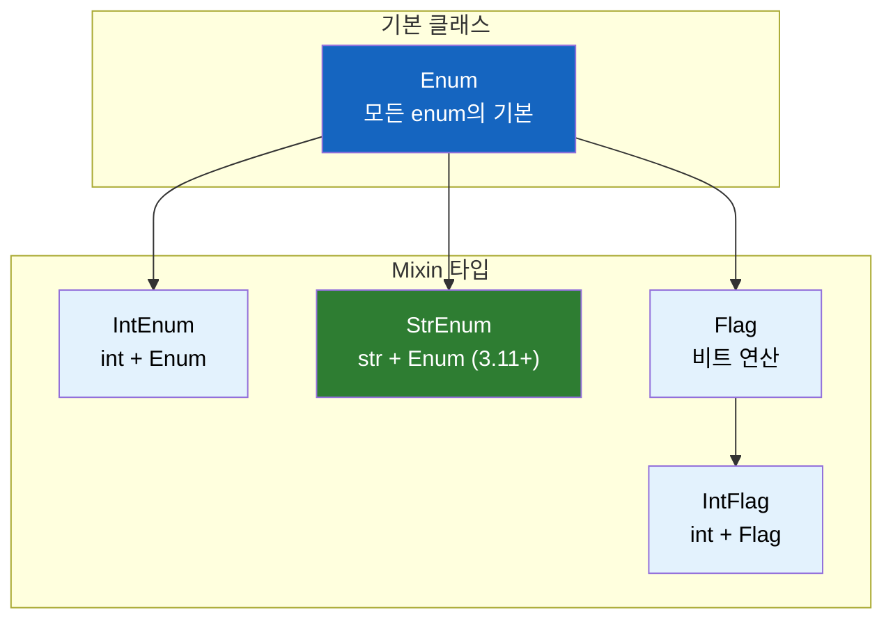

# Python의 Enum 완벽 가이드

Java 개발자라면 `enum`은 익숙할 것이다. Python에도 enum이 있을까? 있다면 Java와 뭐가 다를까?

## 결론부터 말하면

**Python 3.4부터 `enum` 모듈이 도입되었고, Python 3.11에서 `StrEnum`이 추가되어 더욱 강력해졌다.**

```python
# Python 3.11+
class ErrorCode(enum.StrEnum):
    AGENT_NODE_ERROR = "0001"
    NODE_EXECUTION_ERROR = "0002"
```

```java
// Java와 비교
public enum ErrorCode {
    AGENT_NODE_ERROR("0001"),
    NODE_EXECUTION_ERROR("0002");

    private final String code;
    ErrorCode(String code) { this.code = code; }
}
```

| 특징 | Python Enum | Java Enum |
|------|-------------|-----------|
| 도입 시기 | 3.4 (2014) | 1.5 (2004) |
| 문자열 상속 | `StrEnum` (3.11+) | 직접 구현 필요 |
| 자동 값 할당 | `auto()` | ordinal() |
| 메서드 추가 | 가능 | 가능 |
| 싱글톤 보장 | O | O |

---

## 1. 왜 Enum이 필요한가?

### 1.1 매직 넘버/문자열의 문제

enum 없이 상수를 관리한다고 생각해보자.

```python
# ❌ Bad: 매직 문자열
def handle_error(error_code: str):
    if error_code == "0001":
        return "Agent node failed"
    elif error_code == "0002":
        return "Node execution failed"

# 문제점
handle_error("0001")  # 뭘 의미하는지 모름
handle_error("001")   # 오타나도 런타임 전까지 모름
handle_error("9999")  # 존재하지 않는 코드도 허용
```

**문제점:**
1. 코드만 봐서는 의미를 알 수 없다
2. 오타가 나도 컴파일/린트 단계에서 잡히지 않는다
3. 자동완성이 안 된다
4. 리팩토링이 어렵다

### 1.2 상수 클래스도 부족하다

```python
# ❌ 조금 나아졌지만 여전히 부족
class ErrorCode:
    AGENT_NODE_ERROR = "0001"
    NODE_EXECUTION_ERROR = "0002"

# 문제점
ErrorCode.AGENT_NODE_ERROR = "9999"  # 변경 가능!
type(ErrorCode.AGENT_NODE_ERROR)     # str - 타입 안전성 없음
```

상수처럼 보이지만 실제로는 변경 가능하고, 타입 체크도 안 된다.

### 1.3 Enum의 등장

```python
# ✅ Good: Enum 사용
from enum import Enum

class ErrorCode(Enum):
    AGENT_NODE_ERROR = "0001"
    NODE_EXECUTION_ERROR = "0002"

# 장점
ErrorCode.AGENT_NODE_ERROR = "9999"  # AttributeError!
type(ErrorCode.AGENT_NODE_ERROR)     # <enum 'ErrorCode'>
```

---

## 2. Python Enum의 종류

Python은 용도에 따라 다양한 Enum 타입을 제공한다.



### 2.1 기본 Enum

```python
from enum import Enum

class Color(Enum):
    RED = 1
    GREEN = 2
    BLUE = 3

# 사용법
print(Color.RED)        # Color.RED
print(Color.RED.name)   # RED
print(Color.RED.value)  # 1
```

### 2.2 IntEnum - 정수처럼 동작

```python
from enum import IntEnum

class Priority(IntEnum):
    LOW = 1
    MEDIUM = 2
    HIGH = 3

# int처럼 비교 가능
Priority.HIGH > Priority.LOW  # True
Priority.HIGH + 1             # 4
int(Priority.HIGH)            # 3
```

**Java와의 차이점:** Java enum의 `ordinal()`은 선언 순서(0, 1, 2...)이지만, `IntEnum`은 직접 지정한 값이다.

### 2.3 StrEnum - 문자열처럼 동작 (Python 3.11+)

```python
from enum import StrEnum

class ErrorCode(StrEnum):
    AGENT_NODE_ERROR = "0001"
    NODE_EXECUTION_ERROR = "0002"
    TOOL_CALL_REQUEST_ERROR = "0003"

# str처럼 동작
print(ErrorCode.AGENT_NODE_ERROR)           # 0001 (str 출력!)
print(f"Error: {ErrorCode.AGENT_NODE_ERROR}")  # Error: 0001
ErrorCode.AGENT_NODE_ERROR == "0001"        # True
```

**핵심 포인트:** `StrEnum`은 `str`을 상속받기 때문에 문자열이 필요한 곳에 바로 사용할 수 있다.

```python
# 일반 Enum vs StrEnum
class RegularEnum(Enum):
    VALUE = "hello"

class StrEnumExample(StrEnum):
    VALUE = "hello"

print(RegularEnum.VALUE)      # RegularEnum.VALUE
print(StrEnumExample.VALUE)   # hello

# API 응답에서 차이
json.dumps({"code": RegularEnum.VALUE})      # TypeError!
json.dumps({"code": StrEnumExample.VALUE})   # {"code": "hello"}
```

### 2.4 Flag - 비트 플래그 조합

```python
from enum import Flag, auto

class Permission(Flag):
    READ = auto()    # 1
    WRITE = auto()   # 2
    EXECUTE = auto() # 4

# 비트 연산으로 조합
admin = Permission.READ | Permission.WRITE | Permission.EXECUTE
print(admin)  # Permission.READ|WRITE|EXECUTE

# 권한 체크
Permission.READ in admin  # True
```

Java의 `EnumSet`과 유사한 용도이다.

---

## 3. 실전 패턴

### 3.1 auto()로 자동 값 할당

```python
from enum import Enum, auto

class Status(Enum):
    PENDING = auto()   # 1
    RUNNING = auto()   # 2
    COMPLETED = auto() # 3
    FAILED = auto()    # 4

# 값이 중요하지 않을 때 유용
```

### 3.2 메서드 추가하기

```python
from enum import StrEnum

class HttpStatus(StrEnum):
    OK = "200"
    CREATED = "201"
    BAD_REQUEST = "400"
    NOT_FOUND = "404"
    INTERNAL_ERROR = "500"

    def is_success(self) -> bool:
        return self.value.startswith("2")

    def is_error(self) -> bool:
        return self.value.startswith(("4", "5"))

    @property
    def description(self) -> str:
        descriptions = {
            "200": "OK",
            "201": "Created",
            "400": "Bad Request",
            "404": "Not Found",
            "500": "Internal Server Error"
        }
        return descriptions.get(self.value, "Unknown")

# 사용
status = HttpStatus.NOT_FOUND
print(status.is_error())      # True
print(status.description)     # Not Found
```

Java 개발자에게 익숙한 패턴이다:

```java
// Java 동일 패턴
public enum HttpStatus {
    OK("200"), NOT_FOUND("404");

    public boolean isError() {
        return code.startsWith("4") || code.startsWith("5");
    }
}
```

### 3.3 에러 코드 시스템 구축

실무에서 자주 보는 패턴:

```python
from enum import StrEnum
from dataclasses import dataclass

class ErrorCode(StrEnum):
    # Agent 관련 에러 (0xxx)
    AGENT_NODE_ERROR = "0001"
    AGENT_TIMEOUT = "0002"

    # 실행 관련 에러 (1xxx)
    NODE_EXECUTION_ERROR = "1001"
    TOOL_CALL_REQUEST_ERROR = "1002"

    # 데이터 관련 에러 (2xxx)
    DATA_VALIDATION_ERROR = "2001"
    DATA_NOT_FOUND = "2002"

    @property
    def category(self) -> str:
        prefix = self.value[0]
        categories = {
            "0": "Agent",
            "1": "Execution",
            "2": "Data"
        }
        return categories.get(prefix, "Unknown")

    @property
    def message(self) -> str:
        messages = {
            "0001": "Agent node processing failed",
            "0002": "Agent operation timed out",
            "1001": "Node execution encountered an error",
            "1002": "Tool call request failed",
            "2001": "Data validation failed",
            "2002": "Requested data not found",
        }
        return messages.get(self.value, "Unknown error")


@dataclass
class AppError(Exception):
    code: ErrorCode
    detail: str = ""

    def __str__(self):
        return f"[{self.code}] {self.code.message}: {self.detail}"


# 사용 예시
def process_agent_node(node_id: str):
    try:
        # 처리 로직...
        raise ValueError("Something went wrong")
    except ValueError as e:
        raise AppError(
            code=ErrorCode.AGENT_NODE_ERROR,
            detail=f"Node {node_id} failed: {e}"
        )

# 호출
try:
    process_agent_node("node-123")
except AppError as e:
    print(e)  # [0001] Agent node processing failed: Node node-123 failed: ...
    print(e.code.category)  # Agent
```

### 3.4 Enum을 dict 키로 사용

```python
from enum import Enum

class Tier(Enum):
    FREE = "free"
    PRO = "pro"
    ENTERPRISE = "enterprise"

# Enum을 키로 사용
rate_limits = {
    Tier.FREE: 100,
    Tier.PRO: 1000,
    Tier.ENTERPRISE: 10000,
}

user_tier = Tier.PRO
print(rate_limits[user_tier])  # 1000
```

### 3.5 Enum 순회 및 검색

```python
from enum import StrEnum

class ErrorCode(StrEnum):
    AGENT_NODE_ERROR = "0001"
    NODE_EXECUTION_ERROR = "0002"

# 모든 멤버 순회
for code in ErrorCode:
    print(f"{code.name}: {code.value}")

# 값으로 검색
ErrorCode("0001")  # ErrorCode.AGENT_NODE_ERROR
ErrorCode["AGENT_NODE_ERROR"]  # ErrorCode.AGENT_NODE_ERROR

# 존재 여부 확인 (비효율적 - 매번 리스트 생성)
"0001" in [e.value for e in ErrorCode]  # True

# ✅ 더 효율적인 방법: Enum 생성자의 ValueError 활용
def value_exists(enum_class, value):
    try:
        enum_class(value)
        return True
    except ValueError:
        return False

value_exists(ErrorCode, "0001")  # True
value_exists(ErrorCode, "9999")  # False
```

---

## 4. Python 3.11 이전에서 StrEnum 사용하기

Python 3.11 미만에서는 `StrEnum`이 없다. 대안:

```python
# 방법 1: str과 Enum 다중 상속
class ErrorCode(str, Enum):
    AGENT_NODE_ERROR = "0001"
    NODE_EXECUTION_ERROR = "0002"

# 방법 2: aenum 라이브러리 사용
# pip install aenum
from aenum import StrEnum

# 방법 3: 직접 구현
class StrEnum(str, Enum):
    def _generate_next_value_(name, start, count, last_values):
        return name.lower()

    def __str__(self):
        return self.value
```

---

## 5. Java Enum과의 상세 비교

| 기능 | Python | Java |
|------|--------|------|
| 기본 선언 | `class Color(Enum)` | `enum Color` |
| 값 접근 | `.value` | getter 직접 구현 |
| 이름 접근 | `.name` | `.name()` |
| 순서 | 없음 (직접 구현) | `.ordinal()` |
| 문자열 변환 | `StrEnum` 또는 `__str__` | `toString()` |
| switch/match | `match` (3.10+) | `switch` |
| 비교 | `is`, `==` | `==`, `.equals()` |

```python
# Python match (3.10+)
match error_code:
    case ErrorCode.AGENT_NODE_ERROR:
        handle_agent_error()
    case ErrorCode.NODE_EXECUTION_ERROR:
        handle_node_error()
    case _:
        handle_unknown()
```

```java
// Java switch
switch (errorCode) {
    case AGENT_NODE_ERROR -> handleAgentError();
    case NODE_EXECUTION_ERROR -> handleNodeError();
    default -> handleUnknown();
}
```

---

## 6. 주의사항

### 6.1 Enum 비교는 `is`를 사용

```python
# ✅ Good: identity 비교
if status is Status.PENDING:
    pass

# ⚠️ 동작하지만 권장하지 않음
if status == Status.PENDING:
    pass
```

Enum 멤버는 싱글톤이므로 `is`가 더 명확하고 빠르다.

### 6.2 Enum은 불변(Immutable)

```python
class Status(Enum):
    ACTIVE = 1

Status.ACTIVE = 2  # AttributeError!
Status.ACTIVE.value = 2  # AttributeError!
```

### 6.3 상속 제한

```python
class Color(Enum):
    RED = 1

# ❌ 멤버가 있는 Enum은 상속 불가
class ExtendedColor(Color):  # TypeError!
    ORANGE = 4
```

### 6.4 값 중복과 별칭(Alias)

같은 값을 가진 멤버는 **별칭(alias)** 으로 처리된다. 이 동작은 의도치 않은 버그의 원인이 될 수 있다.

```python
class Color(Enum):
    RED = 1
    GREEN = 2
    CRIMSON = 1  # RED의 별칭이 됨

Color.CRIMSON is Color.RED  # True (동일 객체!)
Color(1)                    # Color.RED (CRIMSON 아님)
list(Color)                 # [Color.RED, Color.GREEN] - CRIMSON 제외!
```

**값 중복을 방지하려면 `@unique` 데코레이터를 사용한다:**

```python
from enum import Enum, unique

@unique
class ErrorCode(Enum):
    AGENT_ERROR = "0001"
    NODE_ERROR = "0001"  # ValueError: duplicate values found!
```

에러 코드나 상태 코드처럼 값이 고유해야 하는 Enum에는 `@unique`를 적용하는 것이 안전하다.

---

## 정리

| 상황 | 사용할 Enum |
|------|-------------|
| 단순 상수 그룹 | `Enum` |
| 정수 값 비교/연산 필요 | `IntEnum` |
| 문자열로 바로 사용 | `StrEnum` (3.11+) |
| 비트 플래그 조합 | `Flag` |
| JSON 직렬화 필요 | `StrEnum` 또는 `IntEnum` |

**Java 개발자를 위한 핵심:**
- Python enum도 Java처럼 타입 안전하고 싱글톤이다
- `StrEnum`은 Java에 없는 편리한 기능이다 (문자열 상속)
- 메서드 추가, 프로퍼티 정의 모두 가능하다

---

## 출처

- [Python enum 공식 문서](https://docs.python.org/3/library/enum.html) - 공식 문서
- [PEP 435 – Adding an Enum type](https://peps.python.org/pep-0435/) - Enum 도입 제안서
- [PEP 663 – StrEnum](https://peps.python.org/pep-0663/) - StrEnum 도입 제안서
