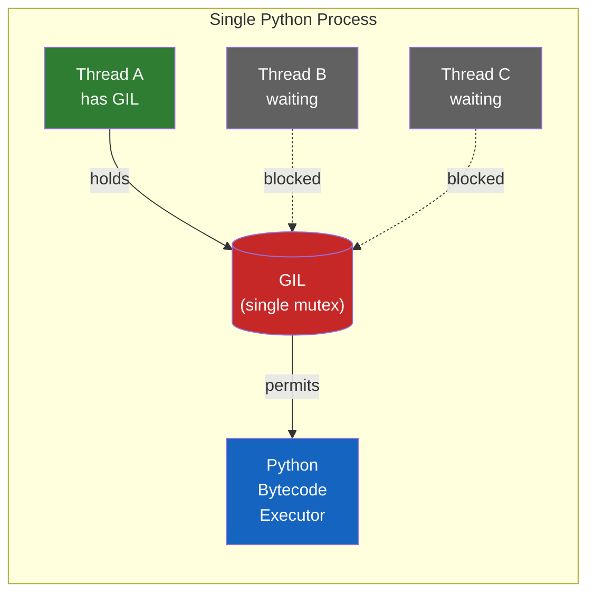
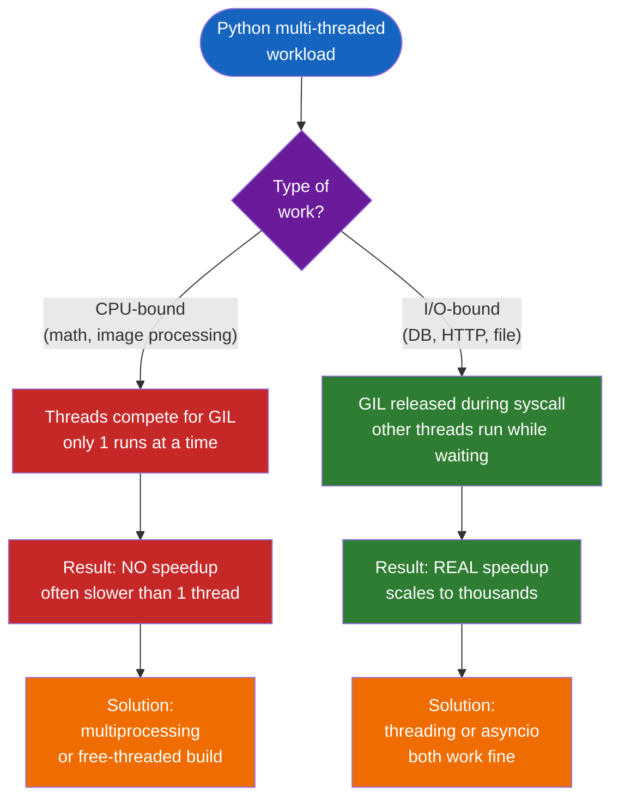
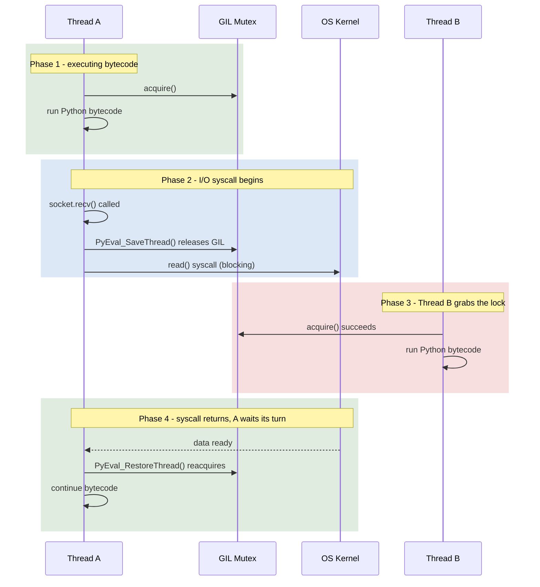

# Python의 GIL — 락이 있는데 왜 멀티스레딩이 동작하는가

"한 번에 하나의 스레드만 실행된다"는 말과 "FastAPI가 수천 개 요청을 처리한다"는 말이 어떻게 동시에 참일 수 있을까?

## 결론부터 말하면

**GIL은 "Python bytecode 실행"만 막는다. I/O 대기는 막지 않는다.** 이 한 문장이 GIL 미스터리의 95%를 푼다.

다시 말하면 GIL은 "Python 가상머신(CPython interpreter)의 입장권"이다. 한 프로세스 안에 입장권은 단 1장뿐이다. 그래서 스레드 100개를 띄워도 매 순간 Python bytecode를 실행하는 건 1개뿐이다. 그런데 만약 입장권을 들고 있는 스레드가 "잠깐 화장실 다녀올게요(= I/O 대기)"라며 입장권을 카운터에 맡기면, 그동안 다른 스레드가 입장권을 받아서 들어갈 수 있다. **DB가 응답을 돌려주는 95ms는 화장실 시간이고, 그 시간이 곧 멀티스레딩의 가치가 살아나는 구간이다.**



이 글은 두 가지 헷갈리는 지점을 정면에서 푼다.

1. **"락이 걸려 있는데 왜 멀티스레딩이 동작하지?"** -> GIL은 bytecode 한 줄 한 줄을 직렬화할 뿐, 스레드 자체를 막지는 않는다.
2. **"I/O 대기 중에 풀린다는 게 어떻게 자동으로 일어나지?"** -> CPython의 C 코드 안에서 syscall 직전에 명시적으로 release한다. 매크로 이름까지 있다. `Py_BEGIN_ALLOW_THREADS`.

자, 차근차근 풀어보자.

## 1. 왜 GIL이 존재하는가 — Java에는 없는 것

Java 개발자에게 GIL은 매우 낯설다. JVM에는 그런 게 없으니까. Spring Boot에서 스레드 200개를 돌리면 정말로 8코어 머신에서 8개 스레드가 동시에 CPU를 쓴다. 그런데 Python에서 스레드 200개를 돌리면 매 순간 1개만 CPU를 쓴다. 왜 이런 차이가 생겼을까?

답은 **CPython의 메모리 관리 방식**에 있다. CPython은 **참조 카운팅(reference counting)**으로 객체 수명을 관리한다.

```python
a = [1, 2, 3]   # 리스트 객체의 refcount = 1
b = a           # refcount = 2
del b           # refcount = 1
del a           # refcount = 0 → 즉시 메모리 해제
```

객체마다 "지금 나를 가리키는 변수가 몇 개인가"를 정수 하나로 들고 있고, 이 카운트가 0이 되는 순간 메모리가 해제된다. 단순하고 빠르고 결정적이다. Java의 GC와는 정반대 철학이다.

문제는 **이 정수 카운터를 여러 스레드가 동시에 건드리면 race condition이 터진다**는 것이다. `refcount += 1`은 어셈블리 레벨에서 "값을 읽어서 → 1을 더해서 → 다시 쓴다"의 세 단계로 쪼개진다. 두 스레드가 동시에 이 세 단계를 실행하면 `+1`이 한 번만 반영되는 사고가 일어난다. 그러면 객체가 살아 있어야 하는데 해제되거나, 해제돼야 하는데 영영 살아남는 메모리 누수가 생긴다.

해결책은 두 가지였다.

| 접근 | 방법 | 비용 |
|------|------|------|
| **객체별 락** | 모든 객체마다 mutex를 둔다 (Java의 길) | 단일 스레드 성능이 절반 이하로 떨어짐 |
| **인터프리터 전체 락** | 한 번에 한 스레드만 인터프리터를 쓰게 한다 (Python의 길) | 멀티스레드 CPU 활용 불가 |

Python은 1992년 후자를 선택했다. 그 락이 GIL이다. 결과적으로 **단일 스레드 코드는 매우 빠르고 단순하지만, CPU-bound 멀티스레드는 사실상 동작하지 않는** 언어가 되었다.

`★ Insight ─────────────────────────────────────`
Java가 GIL이 없는 이유는 "잘난 척"이 아니라 **GC 방식이 다르기 때문**이다. JVM은 참조 카운트를 안 쓰고 mark-and-sweep GC를 쓴다. 그래서 객체 접근마다 카운터를 건드릴 일이 없고, race condition을 걱정할 지점이 적다. 대신 GC pause라는 다른 비용을 낸다. **GIL과 GC pause는 같은 문제(메모리 안전성)를 푸는 두 가지 절충안**이다.
`─────────────────────────────────────────────────`

## 2. GIL이 정확히 막는 것 — bytecode 한 줄

여기서 첫 번째 헷갈림이 풀린다. GIL은 **"스레드가 동시에 존재하는 것"**을 막지 않는다. 스레드는 평소처럼 OS 스레드로 만들어지고, OS 스케줄러가 이들을 코어에 할당한다. GIL이 막는 것은 단 하나 — **"두 스레드가 같은 순간에 Python bytecode 명령어를 실행하는 것"**이다.

```python
import dis

def add(x, y):
    return x + y

dis.dis(add)
# 출력:
#   2  LOAD_FAST    x
#      LOAD_FAST    y
#      BINARY_OP    add
#      RETURN_VALUE
```

`x + y`라는 한 줄짜리 Python 코드가 4개의 bytecode 명령으로 분해된다. **GIL은 이 명령 하나하나가 직렬화되도록 보장한다.** 즉 어떤 스레드가 `LOAD_FAST x`를 실행하는 동안 다른 스레드는 어떤 bytecode도 실행할 수 없다.

여기까지 보면 "그럼 멀티스레딩 의미가 없는 것 아닌가?"라는 의문이 자연스럽다. 정답은 **"CPU-bound 작업에는 의미가 없고, I/O-bound 작업에는 매우 큰 의미가 있다"**이다.



이 차이의 핵심이 다음 섹션이다.

## 3. 두 번째 미스터리 — I/O 대기 중에 GIL이 풀린다는 게 무슨 말?

이 부분이 가장 와닿지 않는 지점이라고 했다. "어떻게 락이 자동으로 풀리지?"

**자동이 아니다. CPython의 C 코드 안에 명시적으로 적혀 있다.** 이게 핵심 사실이다.

CPython의 `socketmodule.c`를 들여다보면 이런 코드가 있다.

```c
// CPython source: Modules/socketmodule.c (단순화)
static PyObject *
sock_recv(PySocketSockObject *s, PyObject *args) {
    char buf[BUFSIZ];
    int n;

    Py_BEGIN_ALLOW_THREADS    // <-- 여기서 GIL을 release
    n = recv(s->sock_fd, buf, BUFSIZ, 0);   // 진짜 OS syscall
    Py_END_ALLOW_THREADS      // <-- 여기서 GIL을 다시 acquire

    return PyBytes_FromStringAndSize(buf, n);
}
```

`Py_BEGIN_ALLOW_THREADS`와 `Py_END_ALLOW_THREADS`는 매크로다. 안을 펼치면 각각 `PyEval_SaveThread()`와 `PyEval_RestoreThread()` 함수 호출이 된다. 이름 그대로 **"이 스레드의 상태를 잠시 저장해두고 GIL을 내려놓는다"**, **"GIL을 다시 잡고 상태를 복원한다"**라는 의미다.

이게 뭘 의미하느냐. **Python에서 `socket.recv()`를 호출하면 실제 OS 시스템콜로 내려가기 직전에 GIL을 내려놓고, 시스템콜이 끝나서 데이터를 들고 돌아오기 전에 GIL을 다시 잡는다.** 그 사이의 시간은 다른 스레드가 GIL을 차지할 수 있는 구간이다.



여기서 중요한 통찰 하나. **"GIL이 자동으로 풀린다"는 표현은 사실 부정확하다.** 정확히는 **"GIL이 풀리도록 C 확장 모듈 작성자가 명시적으로 코드를 박아넣은 함수에 한해서만 풀린다"**이다. `socket`, `urllib`, `time.sleep`, `subprocess`, `os.read`, `requests`, `httpx`, NumPy의 행렬 연산 같은 함수들은 전부 내부적으로 `Py_BEGIN_ALLOW_THREADS`를 호출한다. 그래서 이 함수들을 호출하는 동안에는 다른 스레드가 일할 수 있다.

반대로 **순수 Python으로만 작성된 무한 루프(`while True: pass`)는 GIL을 절대 놓지 않는다.** 그래서 그런 코드를 백그라운드 스레드에 돌리면 메인 스레드가 죽어버리는 것처럼 느려진다.

`★ Insight ─────────────────────────────────────`
이게 NumPy가 GIL 환경에서도 빠른 이유다. `np.dot(a, b)` 같은 행렬 곱은 내부적으로 BLAS 같은 C/Fortran 라이브러리를 호출하는데, **호출 직전에 GIL을 release하고 OpenMP로 멀티코어를 다 쓴다**. 그래서 NumPy 한 번 호출이 8코어를 모두 100%까지 끌어올릴 수 있다. **"Python이 느리다"는 말은 사실 "순수 Python bytecode가 느리다"는 뜻**이고, C 확장으로 내려가는 순간 GIL은 사라진다.
`─────────────────────────────────────────────────`

## 4. 5밀리초의 약속 — 강제 thread switch

위 메커니즘에는 한 가지 함정이 있다. 만약 어떤 스레드가 순수 Python 코드만 돌리고 I/O가 전혀 없다면 어떻게 될까? GIL을 영원히 안 놓는다는 뜻인데, 그러면 다른 스레드는 영영 차례가 안 온다.

이걸 막기 위해 CPython은 **5밀리초마다 강제로 GIL을 풀고 다른 스레드에 양보**한다. 이건 `sys.setswitchinterval()` / `sys.getswitchinterval()`로 확인하고 조정할 수 있다.

```python
>>> import sys
>>> sys.getswitchinterval()
0.005    # 기본 5ms
```

Python 3.2 이전에는 "100개 bytecode 명령마다"였는데, 명령마다 길이가 달라서 부정확하다는 지적을 받고 시간 기반으로 바뀌었다. 그래서 정확히 말하면 GIL이 release되는 시점은 두 가지다.

| 조건 | 트리거 |
|------|--------|
| **자발적 release** | I/O syscall, `time.sleep`, C 확장의 `Py_BEGIN_ALLOW_THREADS` |
| **강제 release** | 5ms마다 CPython이 GIL holder에게 "양보해라" 신호 |

후자 때문에 GIL은 race condition을 완벽히 막지 못한다. 다음 섹션에서 본다.

## 5. GIL이 막지 못하는 것 — `counter += 1`의 함정

Java 개발자가 가장 헷갈리는 두 번째 지점이 이거다. "GIL이 한 번에 한 스레드만 실행시킨다면, Python에서는 락 없이 변수를 공유해도 안전한 거 아닌가?"

답은 **NO**이다. GIL은 "한 번에 한 bytecode 명령"을 보장할 뿐, "한 번에 한 Python 줄"을 보장하지는 않는다.

```python
counter = 0

def increment():
    global counter
    counter += 1   # 이게 atomic이 아니다
```

`counter += 1` 한 줄은 4개의 bytecode로 분해된다.

```python
import dis
dis.dis(increment)
#   LOAD_GLOBAL    counter   <-- 여기서 5ms 타이머가 끝나면
#   LOAD_CONST     1
#   BINARY_OP      +
#   STORE_GLOBAL   counter   <-- 다른 스레드가 끼어들 수 있음
```

`LOAD_GLOBAL`로 `counter`의 현재 값(예: 5)을 읽어온 뒤 다른 스레드가 GIL을 가져가서 `counter`를 7로 만들어 놓아도, 우리 스레드는 5밖에 모른다. 그래서 `5 + 1 = 6`을 다시 써넣어 버린다. **두 번의 증가가 한 번으로 사라지는 lost update가 발생한다.**

따라서 Python에서도 공유 가변 상태에는 명시적 락이 필요하다.

```python
import threading

counter = 0
lock = threading.Lock()

def safe_increment():
    global counter
    with lock:
        counter += 1
```

**GIL은 "메모리 보호"가 아니라 "인터프리터 보호"다.** Python 객체가 망가지지 않을 뿐, 우리가 짠 로직이 망가지지 않는 건 별개의 문제다. 이게 GIL을 "있는데도 락이 필요한" 이상한 락으로 만든다.

## 6. asyncio와 GIL은 다른 이야기다

이제 사용자가 인용한 두 번째 문장으로 돌아가자.

> "GIL은 I/O 대기 중에는 풀린다. ... FastAPI가 async/await로 수천 개의 동시 요청을 단일 프로세스에서 처리할 수 있는 이유가 바로 이것이다."

이 문장은 **반은 맞고 반은 살짝 부정확하다**. 헷갈림의 원인이 바로 여기다.

핵심 분리: **threading의 동시성과 asyncio의 동시성은 메커니즘이 다르다.** 둘 다 "I/O 대기 시간을 활용한다"는 점은 같지만, 작동 원리가 완전히 다르다.

| 측면 | `threading` 모듈 | `asyncio` 모듈 |
|------|-----------------|----------------|
| **단위** | OS 스레드 (커널이 스케줄링) | Coroutine (이벤트 루프가 스케줄링) |
| **수** | 보통 수십~수백개 | 수만 개 가능 |
| **메모리** | 스레드당 ~8MB 스택 | 코루틴당 ~1KB |
| **switch 트리거** | OS 또는 GIL의 5ms 강제 | `await` 키워드 |
| **GIL 관계** | I/O syscall 시 GIL release로 다른 스레드 진행 | **단일 스레드 안에서 동작, GIL은 거의 무관** |
| **race condition** | 발생 가능 (lock 필요) | switch 지점이 `await`로 명시되어 거의 없음 |

여기서 가장 중요한 사실 하나: **asyncio는 단일 스레드에서 동작한다.** 즉 코루틴이 100개든 1만 개든, 매 순간 GIL을 가진 건 메인 스레드 1개뿐이고, 그 안에서 이벤트 루프가 코루틴을 차례로 깨운다. **"GIL이 풀려서 다른 코루틴이 실행된다"는 표현은 사실 잘못이다.** 그 GIL은 누구에게도 넘어가지 않는다. 어차피 한 스레드뿐이니까.

그러면 FastAPI는 어떻게 수천 개 요청을 처리할까? **"GIL을 잘 풀어줘서"가 아니라, "I/O 대기 시간 동안 다른 코루틴이 끼어들 수 있도록 `await` 지점을 만들어둬서"**다.

```python
@app.get("/users/{id}")
async def get_user(id: int):
    user = await db.fetch_one(...)   # await 지점: 다른 요청이 끼어들 수 있음
    posts = await db.fetch_all(...)  # await 지점
    return {"user": user, "posts": posts}
```

이 함수가 `await`에 도달하면 이벤트 루프가 함수 실행을 중지하고 다른 코루틴(다른 요청)을 깨운다. 그 다른 요청도 `await`에 도달하면 또 다른 요청을 깨운다. **이 모든 일이 한 스레드 안, 한 GIL 아래에서 일어난다.**

`★ Insight ─────────────────────────────────────`
정확히 말하면 FastAPI에서 GIL이 release되는 순간은 두 가지다. (1) `asyncpg`가 PostgreSQL에 쿼리를 던지고 응답을 기다릴 때 — C 레벨에서 socket.recv 비슷한 호출이 들어가면서 GIL이 잠깐 풀린다. (2) 다른 워커 프로세스가 동시에 요청을 처리할 때 — 이건 같은 GIL이 아니라 별도의 GIL이다(프로세스마다 GIL이 따로 있음). **사용자가 asyncio와 threading을 같은 메커니즘으로 이해하면 영원히 헷갈린다. 두 개는 형제가 아니라 사촌이다.**
`─────────────────────────────────────────────────`

이 미묘한 차이 때문에 FastAPI 매뉴얼은 이렇게 말한다. **"`async def` 안에서는 절대 동기 블로킹 코드를 호출하지 마라."** 왜냐하면 `await` 없이 동기 호출을 해버리면 그 시간 동안 이벤트 루프가 멈추고, 다른 모든 요청도 함께 멈추기 때문이다. GIL은 잘 풀려 있지만 단일 스레드 이벤트 루프가 막혀 있는 상황이다.

```python
# Bad
@app.get("/slow")
async def slow():
    time.sleep(5)   # 동기 블로킹! 이벤트 루프가 5초간 정지
    return "done"   # 이 5초 동안 다른 모든 요청이 멈춤

# Good
@app.get("/slow")
async def slow():
    await asyncio.sleep(5)   # 이벤트 루프가 다른 코루틴에 양보
    return "done"
```

## 7. 그래서 뭘 써야 하나 — 의사결정 트리

| 작업 종류 | 권장 방식 | 이유 |
|-----------|-----------|------|
| **CPU-bound** (이미지 처리, 암호화, 압축) | `multiprocessing` | 프로세스마다 GIL이 따로 있어서 진짜 병렬화됨 |
| **CPU-bound** (NumPy, Pandas) | `threading` 가능 | C 확장이 GIL을 release함 |
| **I/O-bound, 적은 동시성** (수십개) | `threading` | 코드가 동기적으로 단순하고 기존 라이브러리 그대로 사용 가능 |
| **I/O-bound, 많은 동시성** (수천~수만개) | `asyncio` + FastAPI | 메모리 효율, 컨텍스트 스위칭 비용 없음 |
| **혼합 워크로드** | `multiprocessing`으로 워커 + 각 워커가 `asyncio` | Uvicorn worker 모델이 정확히 이것 |

마지막 행이 가장 중요하다. 여기서 글 전체를 관통하는 한 가지 사실을 꺼내야 한다. **GIL은 프로세스마다 정확히 1개씩 존재한다.** 스레드 100개를 띄워도 한 프로세스 안에서는 GIL이 여전히 1개지만, 프로세스 4개를 띄우면 서로 독립적인 GIL이 4개가 된다. 8코어 머신에서 워커 프로세스 4개를 띄우면 매 순간 4개의 코어가 진짜로 Python bytecode를 동시에 실행한다. 그 위에 각 워커가 asyncio 이벤트 루프를 돌리면 코어 안에서 I/O 대기 시간까지 다시 묻어난다.

이 "프로세스 풀 + 이벤트 루프"라는 두 층 구조가 오늘날 Python 웹 서버 배포의 표준이 된 이유는 한 줄로 설명된다 — **GIL이 프로세스 단위라서다.** Java처럼 한 JVM 안에 스레드 풀 200개로 끝낼 수 있었다면 누구도 프로세스를 여러 개 띄우는 번거로운 방식을 택하지 않았을 것이다. 스레드만으로는 절대 풀리지 않는 GIL이라는 벽을, 프로세스를 한 층 더 쌓아서 우회한 것이 Python 진영의 답이다. 이게 `gunicorn -w 4`나 `uvicorn --workers 4` 같은 명령이 거의 모든 Python 웹 앱 배포 가이드의 첫 줄에 등장하는 진짜 이유다.

## 8. 미래 — Python 3.13의 free-threaded build

마지막으로 가장 뜨거운 최신 소식 하나. **2024년 10월 출시된 Python 3.13부터 GIL을 끌 수 있다.**

PEP 703이 2023년 승인되면서, CPython은 빌드 옵션으로 GIL을 제거한 free-threaded 버전을 제공하기 시작했다. 2025년 출시된 Python 3.14에서는 PEP 779를 통해 free-threaded build가 **공식 지원(Phase II)** 단계로 격상되었다. 더 이상 실험적 기능이 아니다.

| 단계 | Python 버전 | 상태 |
|------|------------|------|
| **Phase I** | 3.13 | 실험적 빌드 옵션 |
| **Phase II** | 3.14+ | 공식 지원, 옵션 빌드 |
| **Phase III** | 미정 | 기본 빌드로 채택 (커뮤니티 합의 필요) |

```bash
# Python 3.14 free-threaded build 설치 예시
uv python install 3.14t   # 't' suffix = threading
python3.14t --version
# Python 3.14.0 free-threading build
```

free-threaded 빌드의 특징:

- **단일 스레드 성능 페널티 5-10%** (Python 3.14 기준, 3.13에서는 30%였음)
- **CPU-bound 멀티스레드가 진짜 병렬화됨** (드디어!)
- **C 확장 호환성이 관건** — NumPy, pandas, PyTorch 등 주요 라이브러리는 free-threaded 지원을 추가하는 중
- **공유 상태 race condition은 그대로 존재** — 오히려 더 치명적이 될 수 있음 (`counter += 1`이 정말로 동시에 실행되니까)

Python 3.14는 또 `concurrent.interpreters` 모듈도 추가해서 한 프로세스 안에 격리된 인터프리터를 여러 개 띄우는 방식의 동시성도 도입했다. **"GIL 시대"의 끝이 보이기 시작한 것은 분명**하지만, 라이브러리 생태계가 따라오고 Phase III로 넘어가기까지는 몇 년이 더 걸릴 것이다.

`★ Insight ─────────────────────────────────────`
free-threaded Python이 등장해도 **threading vs asyncio의 의사결정은 거의 그대로 남는다.** asyncio는 GIL과 별 상관이 없는, "단일 스레드 안의 협력적 멀티태스킹" 방식이기 때문이다. free-threaded build가 바꾸는 건 주로 "지금까지 multiprocessing으로 우회하던 CPU-bound 작업이 threading으로 처리 가능해진다"는 부분이다. **즉 Python의 진짜 약점이었던 부분이 해소되는 것이지, asyncio의 자리가 사라지는 게 아니다.**
`─────────────────────────────────────────────────`

## 9. 정리

| 흔한 오해 | 실제 |
|-----------|------|
| GIL이 있으면 멀티스레딩이 무의미하다 | I/O-bound는 매우 효과적, CPU-bound만 무의미 |
| GIL이 자동으로 풀린다 | C 확장 코드에 명시적으로 박혀 있는 매크로(`Py_BEGIN_ALLOW_THREADS`)가 풀어준다 |
| GIL이 있으면 race condition이 안 생긴다 | `counter += 1`도 atomic이 아니다, 락이 필요하다 |
| asyncio는 GIL이 풀려서 동작한다 | asyncio는 단일 스레드, GIL과 거의 무관, 이벤트 루프의 `await` 지점이 핵심 |
| Java에는 GIL이 없으니 우월하다 | Java는 GC pause라는 다른 비용을 낸다, 트레이드오프일 뿐 |
| GIL은 영원하다 | Python 3.13부터 free-threaded build 가능, 3.14에서 공식 지원 |

**한 줄 요약**: GIL은 인터프리터의 입장권 1장이고, 입장권을 가진 스레드는 bytecode를 실행하지만 I/O syscall에 들어가는 순간 입장권을 카운터에 맡긴다. 그래서 100개 스레드 중 1개만 코드를 실행하지만, 그 1개가 끊임없이 바뀌면서 I/O 대기 시간이 묻어난다. **이 메커니즘은 Java의 스레드 모델보다 단순하지만, "왜 동작하는지"를 알기 전까지는 모순처럼 느껴진다.** 이제 모순이 아니다.

## 출처

- [Python Docs - What's New in Python 3.14](https://docs.python.org/3/whatsnew/3.14.html) (free-threaded mode 공식 지원)
- [PEP 703 - Making the Global Interpreter Lock Optional in CPython](https://peps.python.org/pep-0703/)
- [PEP 779 - Free-threaded Python is officially supported](https://peps.python.org/pep-0779/)
- [Python Docs - sys.setswitchinterval](https://docs.python.org/3/library/sys.html#sys.setswitchinterval)
- [Real Python - What Is the Python Global Interpreter Lock (GIL)?](https://realpython.com/python-gil/)
- [JetBrains Blog - Faster Python: Unlocking the Python Global Interpreter Lock](https://blog.jetbrains.com/pycharm/2025/07/faster-python-unlocking-the-python-global-interpreter-lock/)
- [CPython Source - ceval_gil.c](https://github.com/python/cpython/blob/main/Python/ceval_gil.c)


