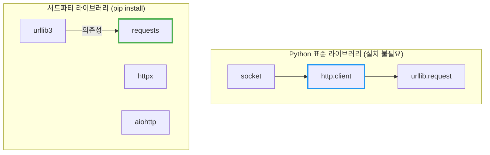
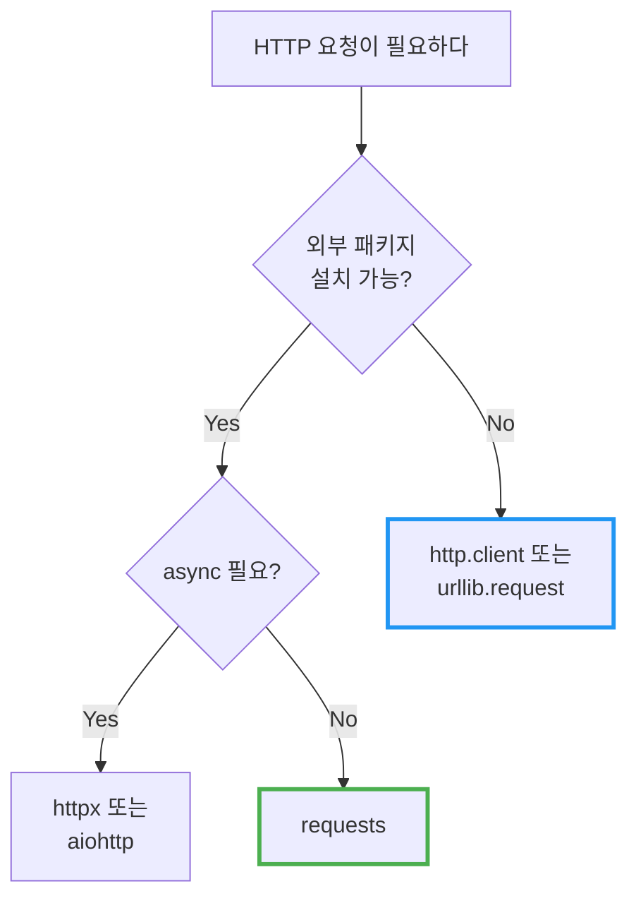

# Python의 http.client와 requests

API 문서를 보다 보면 `import http.client`와 `import requests` 두 가지 예제가 나온다. 둘 다 HTTP 요청을 보내는 건데, 왜 두 가지가 존재할까?

## 결론부터 말하면

**`http.client`는 Python 표준 라이브러리** 이고, **`requests`는 서드파티 라이브러리** 다.

| 구분 | http.client | requests |
|------|-------------|----------|
| **설치** | 불필요 (Python 내장) | `pip install requests` |
| **수준** | 저수준 (Low-level) | 고수준 (High-level) |
| **존재 시점** | Python 1.x부터 (httplib → http.client) | 2011년 (Python 2.6+) |
| **사용성** | 복잡함 | 직관적 |
| **의존성** | 없음 | urllib3, certifi 등 |



---

## 1. 왜 두 가지가 존재하는가?

### 1.1 http.client: Python의 기본 장비

Python은 "batteries included" 철학을 가진 언어다. 기본적인 HTTP 통신 기능은 언어에 내장되어 있어야 한다. 그래서 `http.client`(Python 2에서는 `httplib`)가 표준 라이브러리에 포함되어 있다.

하지만 문제가 있다. **http.client는 너무 저수준이다.**

Java 개발자에게 비유하자면, `http.client`는 마치 `java.net.HttpURLConnection`과 같다. 동작은 하지만, 직접 사용하기에는 너무 번거롭다.

### 1.2 requests: "HTTP for Humans"

2011년, Kenneth Reitz는 Python의 HTTP 라이브러리들이 너무 불편하다고 느꼈다. urllib, urllib2, httplib... 모두 사용하기 어려웠다. 그래서 그는 **"인간을 위한 HTTP"** 라는 슬로건으로 `requests`를 만들었다.

결과는? **압도적인 성공**. requests는 PyPI에서 가장 많이 다운로드되는 패키지 중 하나가 되었다.

---

## 2. 같은 작업, 다른 코드

### 2.1 GET 요청 비교

**http.client (표준 라이브러리)**

```python
import http.client
import json

# 연결 생성
conn = http.client.HTTPSConnection("api.example.com")

# 요청 전송
conn.request("GET", "/users/1", headers={"Accept": "application/json"})

# 응답 받기
response = conn.getresponse()
status = response.status
data = response.read().decode("utf-8")

# JSON 파싱은 직접 해야 함
result = json.loads(data)

# 연결 종료 (반드시 해야 함!)
conn.close()

print(f"Status: {status}")
print(f"Name: {result['name']}")
```

**requests (서드파티)**

```python
import requests

response = requests.get(
    "https://api.example.com/users/1",
    headers={"Accept": "application/json"}
)

# JSON 파싱 내장
result = response.json()

print(f"Status: {response.status_code}")
print(f"Name: {result['name']}")
```

차이가 보이는가? `requests`는 연결 관리, 인코딩, JSON 파싱을 모두 자동으로 처리한다.

### 2.2 POST 요청 비교

**http.client**

```python
import http.client
import json

conn = http.client.HTTPSConnection("api.example.com")

# 직접 JSON 문자열로 변환해야 함
payload = json.dumps({
    "name": "John",
    "email": "john@example.com"
})

headers = {
    "Content-Type": "application/json",
    "Accept": "application/json"
}

conn.request("POST", "/users", body=payload, headers=headers)
response = conn.getresponse()
data = json.loads(response.read().decode("utf-8"))
conn.close()
```

**requests**

```python
import requests

response = requests.post(
    "https://api.example.com/users",
    json={"name": "John", "email": "john@example.com"}  # 자동 JSON 변환
)

data = response.json()
```

`requests`의 `json=` 파라미터는 자동으로:
1. 딕셔너리를 JSON 문자열로 변환
2. `Content-Type: application/json` 헤더 추가

### 2.3 에러 처리 비교

**http.client**

```python
import http.client

try:
    conn = http.client.HTTPSConnection("api.example.com")
    conn.request("GET", "/users/1")
    response = conn.getresponse()

    # 상태 코드를 직접 확인해야 함
    if response.status == 200:
        data = response.read()
    elif response.status == 404:
        print("Not found")
    elif response.status >= 500:
        print("Server error")

except http.client.HTTPException as e:
    print(f"HTTP error: {e}")
except ConnectionError as e:
    print(f"Connection failed: {e}")
finally:
    conn.close()
```

**requests**

```python
import requests

try:
    response = requests.get("https://api.example.com/users/1")
    response.raise_for_status()  # 4xx, 5xx면 예외 발생
    data = response.json()

except requests.exceptions.HTTPError as e:
    print(f"HTTP error: {e}")
except requests.exceptions.ConnectionError as e:
    print(f"Connection failed: {e}")
except requests.exceptions.Timeout as e:
    print(f"Timeout: {e}")
except requests.exceptions.RequestException as e:
    print(f"Request failed: {e}")
```

---

## 3. 그렇다면 http.client는 언제 쓰는가?

"requests가 더 좋다면 http.client는 왜 아직 존재하는가?" 좋은 질문이다.

### 3.1 외부 의존성을 줄여야 할 때

Lambda, Docker, 임베디드 환경에서는 패키지 크기가 중요하다. `requests`를 설치하면 `urllib3`, `certifi`, `charset_normalizer` 등이 함께 설치된다.

```bash
# requests 설치 시 함께 설치되는 패키지들
$ pip install requests
Installing collected packages: urllib3, certifi, charset-normalizer, idna, requests
```

**http.client는 의존성이 0개다.** Python만 있으면 된다.

### 3.2 표준 라이브러리만 사용해야 할 때

일부 환경에서는 서드파티 패키지 설치가 금지되어 있다:
- 보안이 엄격한 기업 환경
- 제한된 Python 환경 (일부 클라우드 서비스)
- 표준 라이브러리만 사용하는 스크립트

### 3.3 저수준 제어가 필요할 때

HTTP 프로토콜을 직접 다뤄야 할 때:
- 커스텀 HTTP 메서드
- 청크 전송 제어
- 연결 풀링 직접 관리
- HTTP/1.0 강제 사용

---

## 4. Java 개발자를 위한 비교

| Python | Java | 특징 |
|--------|------|------|
| `http.client` | `HttpURLConnection` | 저수준, 표준 라이브러리 |
| `urllib.request` | `java.net.http.HttpClient` (Java 11+) | 표준, 약간 개선됨 |
| `requests` | OkHttp, Apache HttpClient | 서드파티, 사용하기 쉬움 |
| `httpx` | OkHttp (async) | 서드파티, async 지원 |

Java에서도 `HttpURLConnection`보다 OkHttp를 선호하듯이, Python에서도 `http.client`보다 `requests`를 선호한다.

---

## 5. 실무 권장사항



| 상황 | 권장 라이브러리 |
|------|-----------------|
| 일반적인 API 호출 | `requests` |
| 외부 의존성 불가 | `http.client` 또는 `urllib.request` |
| 비동기 HTTP | `httpx` 또는 `aiohttp` |
| HTTP/2 필요 | `httpx` |

---

## 6. 정리

| 질문 | 답변 |
|------|------|
| http.client는 새로 추가된 건가요? | 아니다. Python 1.x부터 있었다 (httplib → Python 3에서 http.client로 이름 변경) |
| 왜 requests가 더 많이 쓰이나요? | 사용하기 쉽고, 자동화된 기능이 많기 때문 |
| http.client를 써야 할 때는? | 외부 의존성을 줄여야 하거나, 저수준 제어가 필요할 때 |
| 어떤 걸 배워야 하나요? | `requests`부터 배우고, 필요할 때 `http.client` 사용법을 익히면 된다 |

**결론:** API 문서에서 `http.client` 예제가 나오는 이유는 "의존성 없이 바로 실행 가능"하기 때문이다. 하지만 실무에서는 대부분 `requests`를 사용한다.

---

## 출처

- [Python http.client Documentation](https://docs.python.org/3/library/http.client.html) - 공식 문서
- [Requests: HTTP for Humans](https://requests.readthedocs.io/) - 공식 문서
- [PEP 3108 - Standard Library Reorganization](https://peps.python.org/pep-3108/) - httplib → http.client 변경
