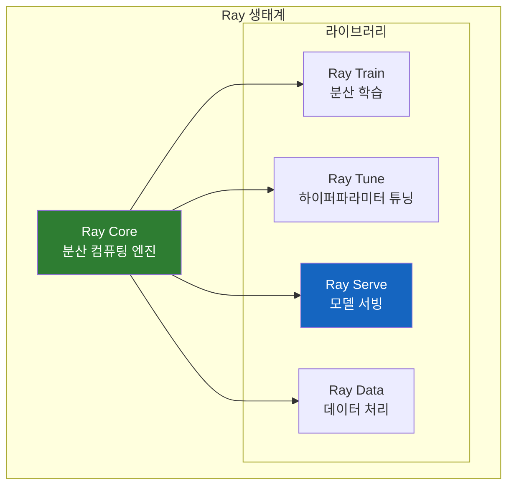
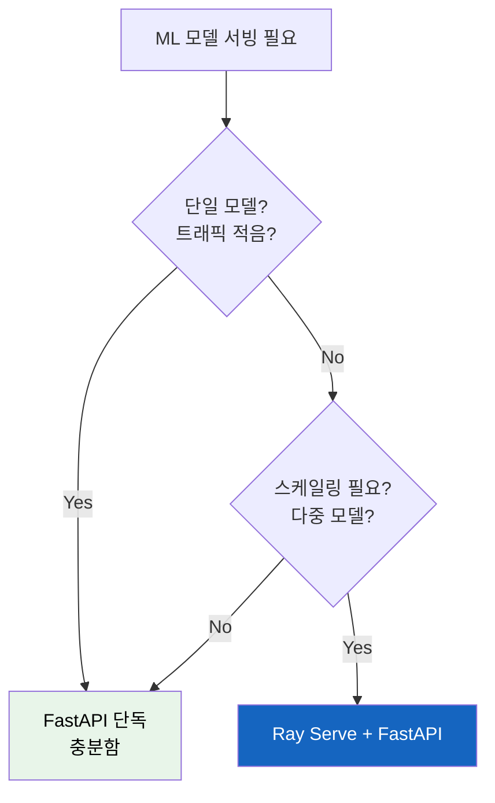

# Ray Serve와 FastAPI: ML 모델 서빙의 완성

FastAPI로 ML 모델을 서빙하고 있는데, 트래픽이 늘어나면 어떻게 해야 할까? 모델을 여러 개 조합해야 한다면? GPU 리소스를 효율적으로 사용하고 싶다면?

## 결론부터 말하면

**Ray Serve는 ML 모델 서빙에 특화된 분산 프레임워크다. FastAPI와 함께 사용하면 "개발 편의성 + 확장성"을 모두 얻을 수 있다.**

```python
from fastapi import FastAPI
from ray import serve

app = FastAPI()

@serve.deployment(num_replicas=3)  # 3개 복제본으로 자동 스케일링
@serve.ingress(app)
class MLService:
    @app.post("/predict")
    async def predict(self, request: PredictRequest):
        return self.model.predict(request.data)
```

| 특성 | FastAPI 단독 | Ray Serve + FastAPI |
|------|-------------|---------------------|
| 단일 모델 서빙 | ✅ 충분 | ✅ 가능 |
| 다중 모델 조합 | ⚠️ 직접 구현 | ✅ 내장 지원 |
| 자동 스케일링 | ❌ K8s 필요 | ✅ 내장 |
| GPU 리소스 관리 | ❌ 직접 구현 | ✅ 내장 |
| 요청 배칭 | ❌ 직접 구현 | ✅ 내장 |

---

## 1. 왜 FastAPI만으로 부족한가?

### 1.1 단일 모델은 괜찮다

FastAPI로 간단한 ML 모델을 서빙하는 건 어렵지 않다.

```python
from fastapi import FastAPI
import torch

app = FastAPI()
model = torch.load("model.pt")

@app.post("/predict")
async def predict(data: list[float]):
    tensor = torch.tensor(data)
    return {"result": model(tensor).tolist()}
```

트래픽이 적고 모델이 하나라면 이걸로 충분하다.

### 1.2 문제는 스케일링

하지만 실무에서는 이런 요구사항이 생긴다:

```
"트래픽이 10배 늘었어요. 서버 늘려주세요."
"이 모델은 GPU가 필요한데, 저 모델은 CPU면 돼요."
"요청이 몰릴 때 배치로 처리하면 더 빠를 것 같은데..."
"모델 A 결과를 모델 B에 넣어야 해요."
```

FastAPI 단독으로 해결하려면?


인프라 엔지니어가 필요하고, 분산 시스템 지식이 필요하다. ML 엔지니어가 모델에 집중하기 어렵다.

### 1.3 Spring 개발자라면 이해하기 쉽다

Java/Spring 세계에서 비유하면:

| ML 서빙 문제 | Spring 세계 비유 |
|-------------|-----------------|
| 단일 모델 서빙 | 단일 Spring Boot 앱 |
| 다중 모델 + 스케일링 | Spring Cloud + K8s + 서비스 메시 |
| Ray Serve | "ML 전용 Spring Cloud" |

Spring Boot 하나로 시작했다가, MSA로 전환하면서 Eureka, Ribbon, Hystrix 등을 붙이는 것처럼, FastAPI도 규모가 커지면 뭔가가 필요하다. 그게 Ray Serve다.

---

## 2. Ray Serve란?

### 2.1 Ray 생태계의 일부

Ray Serve는 분산 컴퓨팅 프레임워크 **Ray** 위에서 동작하는 ML 서빙 라이브러리다.



### 2.2 핵심 개념: Deployment

Ray Serve의 기본 단위는 **Deployment** 다. 하나의 서비스 단위라고 생각하면 된다.

```python
from ray import serve

@serve.deployment
class TextClassifier:
    def __init__(self):
        self.model = load_model("classifier.pt")

    def predict(self, text: str) -> str:
        return self.model(text)

# 배포
serve.run(TextClassifier.bind())
```

Spring의 `@Service`와 비슷하지만, **자동 스케일링, 리소스 할당, 복제본 관리**가 내장되어 있다.

### 2.3 왜 Ray Serve를 쓰는가?

**첫째, 분산 시스템 지식 없이 스케일링**

```python
@serve.deployment(
    num_replicas=5,           # 5개 복제본
    ray_actor_options={
        "num_gpus": 1,        # 각 복제본에 GPU 1개
        "num_cpus": 4,        # CPU 4코어
    }
)
class HeavyModel:
    ...
```

K8s 설정 파일 없이, Python 코드만으로 리소스를 할당한다.

**둘째, 요청 배칭 (Batching)**

GPU는 한 번에 여러 요청을 처리하는 게 효율적이다.

```python
@serve.deployment
class ImageClassifier:
    @serve.batch(max_batch_size=32, batch_wait_timeout_s=0.1)
    async def predict(self, images: list[Image]) -> list[str]:
        # 32개 이미지를 한 번에 처리 (GPU 효율 극대화)
        batch_tensor = torch.stack([to_tensor(img) for img in images])
        return self.model(batch_tensor)
```

100개 요청이 들어오면 32개씩 배치로 처리한다. 직접 구현하면 복잡하지만, Ray Serve는 데코레이터 하나로 끝난다.

**셋째, 모델 조합 (Model Composition)**

실제 ML 파이프라인은 여러 모델이 조합된다.

```python
@serve.deployment
class Summarizer:
    def __init__(self, translator, sentiment_analyzer):
        self.translator = translator
        self.sentiment_analyzer = sentiment_analyzer

    async def summarize(self, text: str) -> dict:
        # 1. 번역
        english_text = await self.translator.translate.remote(text)
        # 2. 감정 분석
        sentiment = await self.sentiment_analyzer.analyze.remote(english_text)
        return {"translated": english_text, "sentiment": sentiment}

# 모델 조합 (의존성 주입처럼)
translator = Translator.bind()
analyzer = SentimentAnalyzer.bind()
summarizer = Summarizer.bind(translator, analyzer)

serve.run(summarizer)
```

Spring의 DI처럼 모델 간 의존성을 주입하고, 각 모델은 **독립적으로 스케일링**된다.

---

## 3. Ray Serve + FastAPI 통합

### 3.1 왜 함께 쓰는가?

| 역할 | 담당 |
|------|------|
| HTTP 라우팅, 검증, 문서화 | **FastAPI** |
| 스케일링, 리소스 관리, 배칭 | **Ray Serve** |

FastAPI의 장점(Pydantic 검증, OpenAPI 문서, 타입 힌트)을 유지하면서, Ray Serve의 스케일링 기능을 사용한다.

### 3.2 통합 방법: @serve.ingress

```python
from fastapi import FastAPI
from pydantic import BaseModel
from ray import serve
import torch

app = FastAPI(title="ML Model API")

class PredictRequest(BaseModel):
    text: str
    max_length: int = 100

class PredictResponse(BaseModel):
    result: str
    confidence: float

@serve.deployment(
    num_replicas=3,
    ray_actor_options={"num_gpus": 0.5}  # GPU 절반씩 사용
)
@serve.ingress(app)  # FastAPI 앱을 Ray Serve에 연결
class TextGenerator:
    def __init__(self):
        self.model = torch.load("gpt_model.pt")

    @app.post("/generate", response_model=PredictResponse)
    async def generate(self, request: PredictRequest) -> PredictResponse:
        result = self.model.generate(request.text, max_length=request.max_length)
        return PredictResponse(result=result, confidence=0.95)

    @app.get("/health")
    async def health(self):
        return {"status": "healthy"}

# 실행
serve.run(TextGenerator.bind(), route_prefix="/api/v1")
```

**핵심 포인트:**
1. `@serve.deployment` - Ray Serve의 스케일링 설정
2. `@serve.ingress(app)` - FastAPI 앱 연결
3. 기존 FastAPI 코드를 거의 그대로 사용

### 3.3 기존 FastAPI 앱 마이그레이션

이미 FastAPI 앱이 있다면, 최소한의 수정으로 마이그레이션할 수 있다.

**Before: 순수 FastAPI**
```python
from fastapi import FastAPI

app = FastAPI()

@app.post("/predict")
async def predict(data: dict):
    return model.predict(data)

# uvicorn main:app --host 0.0.0.0 --port 8000
```

**After: Ray Serve + FastAPI**
```python
from fastapi import FastAPI
from ray import serve

app = FastAPI()

@serve.deployment(num_replicas=3)
@serve.ingress(app)
class APIDeployment:
    @app.post("/predict")
    async def predict(self, data: dict):  # self 추가
        return model.predict(data)

serve.run(APIDeployment.bind())
```

변경점:
1. 클래스로 감싸기
2. `@serve.deployment`, `@serve.ingress` 데코레이터 추가
3. 메서드에 `self` 파라미터 추가

---

## 4. 실전 예제: LLM 서빙 파이프라인

실제 LLM 애플리케이션은 여러 단계로 구성된다.


```python
from fastapi import FastAPI
from ray import serve
from pydantic import BaseModel

app = FastAPI()

# 1. 전처리 서비스
@serve.deployment(num_replicas=2)
class Preprocessor:
    def tokenize(self, text: str) -> list[int]:
        return self.tokenizer.encode(text)

# 2. 벡터 검색 서비스
@serve.deployment(num_replicas=2)
class VectorSearch:
    def search(self, query: str) -> list[str]:
        return self.db.similarity_search(query, k=5)

# 3. LLM 서비스 (GPU 필요)
@serve.deployment(
    num_replicas=1,
    ray_actor_options={"num_gpus": 1}
)
class LLMService:
    def __init__(self):
        self.model = load_llm("llama-7b")

    @serve.batch(max_batch_size=8)
    async def generate(self, prompts: list[str]) -> list[str]:
        return self.model.batch_generate(prompts)

# 4. 메인 API (FastAPI 통합)
@serve.deployment
@serve.ingress(app)
class RAGService:
    def __init__(self, preprocessor, vector_search, llm):
        self.preprocessor = preprocessor
        self.vector_search = vector_search
        self.llm = llm

    @app.post("/chat")
    async def chat(self, request: ChatRequest) -> ChatResponse:
        # 1. 관련 문서 검색
        docs = await self.vector_search.search.remote(request.query)

        # 2. 프롬프트 구성
        context = "\n".join(docs)
        prompt = f"Context: {context}\n\nQuestion: {request.query}"

        # 3. LLM 생성
        response = await self.llm.generate.remote(prompt)

        return ChatResponse(answer=response)

# 의존성 연결 및 배포
preprocessor = Preprocessor.bind()
vector_search = VectorSearch.bind()
llm = LLMService.bind()
rag = RAGService.bind(preprocessor, vector_search, llm)

serve.run(rag, route_prefix="/api")
```

**각 컴포넌트가 독립적으로 스케일링된다:**
- 전처리: CPU 2개 복제본
- 벡터 검색: CPU 2개 복제본
- LLM: GPU 1개 (배칭으로 효율화)
- API: 필요에 따라 자동 조절

---

## 5. 언제 뭘 써야 하는가?



| 상황 | 추천 |
|------|------|
| 프로토타입, PoC | FastAPI 단독 |
| 단일 모델, 낮은 트래픽 | FastAPI 단독 |
| 다중 모델 조합 | Ray Serve + FastAPI |
| GPU 리소스 최적화 필요 | Ray Serve + FastAPI |
| 자동 스케일링 필요 | Ray Serve + FastAPI |
| 요청 배칭 필요 | Ray Serve + FastAPI |

### Ray Serve의 한계

Ray Serve는 **서빙에 특화**되어 있다. 다음은 별도 도구가 필요하다:

- 모델 버전 관리 → MLflow, Weights & Biases
- 모델 모니터링 → Arize, Seldon Alibi
- 실험 추적 → MLflow, Neptune

---

## 정리

> **핵심:** Ray Serve는 ML 서빙의 "인프라 복잡성"을 Python 코드로 해결한다.

- **FastAPI 단독**: 단순 모델 서빙에 적합
- **Ray Serve + FastAPI**: 프로덕션 ML 서빙에 적합
- `@serve.ingress(app)`으로 기존 FastAPI 코드 재사용
- 배칭, 스케일링, 리소스 관리가 데코레이터로 해결

## 더 알아보기

- Ray Serve의 자동 스케일링(autoscaling) 설정은?
- Kubernetes에서 Ray Serve 배포하기
- Ray Serve vs TensorFlow Serving vs TorchServe 비교

---

## 출처

- [Ray Serve 공식 문서](https://docs.ray.io/en/latest/serve/index.html) - 공식 문서
- [Ray Serve + FastAPI: The best of both worlds](https://www.anyscale.com/blog/ray-serve-fastapi-the-best-of-both-worlds) - Anyscale 블로그
- [How to Scale Up Your FastAPI Application Using Ray Serve](https://medium.com/distributed-computing-with-ray/how-to-scale-up-your-fastapi-application-using-ray-serve-c9a7b69e786) - Medium
- [Serving PyTorch models with FastAPI and Ray Serve](https://www.anyscale.com/blog/serving-pytorch-models-with-fastapi-and-ray-serve) - Anyscale 블로그
