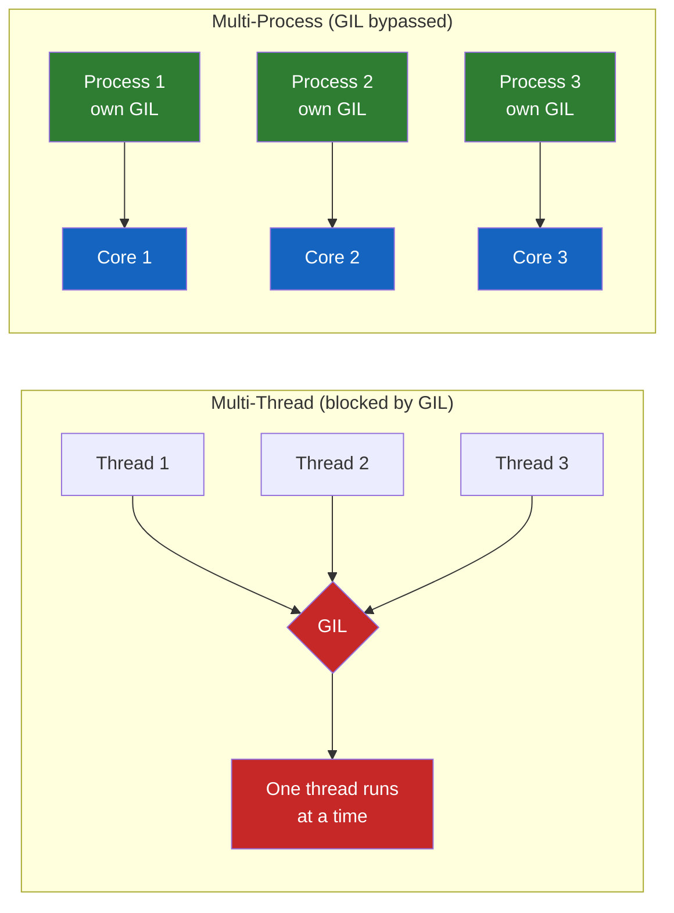
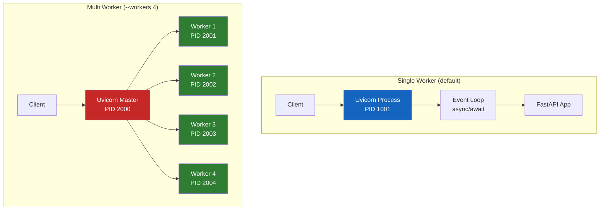
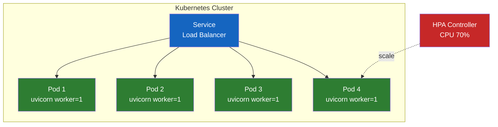

# Uvicorn Worker는 왜 프로세스인가 - FastAPI 프로덕션 배포의 핵심

FastAPI로 API를 만들어 배포하다 보면 누구나 한 번쯤 이런 명령어를 본다.

```bash
uvicorn main:app --workers 4
```

"worker 4개"가 무슨 뜻인지 어렴풋이 알 것 같으면서도, Java 개발자 입장에서는 어딘가 불편한 질문이 떠오른다. Tomcat에서는 `server.tomcat.threads.max=200`처럼 **스레드** 개수를 조절했는데, 왜 Python은 하필 "worker"라는 낯선 단어를 쓰고, 기본값이 왜 `1`인가? 심지어 Kubernetes 공식 가이드는 "컨테이너 안에서는 worker를 1개만 두라"고까지 말한다. 무언가 단순한 숫자 조정 이상의 이야기가 숨어 있다는 신호다.

이 글은 그 이야기를 따라가본다.

---

## 결론부터 말하면

**Uvicorn의 worker 하나는 "스레드 한 개"가 아니라 "독립된 Python 프로세스 한 개"다.** 왜 Python 웹 서버들은 굳이 이렇게 무거운 프로세스 복제 방식을 쓰는가? 답은 단 하나, **GIL(Global Interpreter Lock)**이다. 한 프로세스 안에서 동시에 단 하나의 스레드만 Python 바이트코드를 실행할 수 있기 때문에, 멀티코어 CPU를 전부 쓰려면 프로세스를 쪼개는 수밖에 없다.

그리고 이 선택은 연쇄적으로 세 가지 실무 결정을 끌고 온다.

| 결정 | 이유 |
|------|------|
| worker 기본값이 `1` | Uvicorn은 "프로세스 관리"를 자기 책임으로 보지 않는다. 외부 도구(Gunicorn, systemd, K8s)에 위임하는 설계 |
| 프로덕션에서 Gunicorn + UvicornWorker 조합 | Gunicorn이 워커 생명주기(재시작, graceful shutdown)를 Uvicorn보다 안정적으로 관리 |
| 컨테이너 환경에서는 worker=1 + replica 증설 | 컨테이너 하나 = 프로세스 하나가 관찰/스케일링 단위로 가장 깔끔하기 때문 |

다시 말해, "worker 수를 올린다"는 단순한 튜닝이 아니라 **GIL이라는 언어적 제약과, 그 제약을 우회하는 Python 생태계 전체의 관습**을 압축해놓은 결정이다.

---

## 1. 왜 Python 웹 서버는 "worker"를 쓰는가?

### Java 개발자의 당연한 기대

Java로 Spring Boot 앱을 배포할 때 우리는 이런 구조에 익숙하다. Tomcat이 하나의 JVM 프로세스로 떠 있고, 그 안에서 스레드 풀이 요청을 병렬로 처리한다. 코어가 8개짜리 서버라면 스레드를 200개쯤 띄워도 JVM이 알아서 OS 스레드에 매핑해서 멀티코어를 활용해준다. **프로세스는 하나, 스레드는 여럿** - 이게 JVM 세계의 디폴트다.

그런데 Python으로 넘어오면 이 공식이 깨진다. `uvicorn main:app`을 그냥 실행하면 단일 프로세스, 단일 이벤트 루프가 돌아간다. 같은 머신의 CPU 코어가 아무리 많아도 기본 설정으로는 **정확히 한 개의 코어만** 사용한다. 왜 Python은 이런 이상한 기본값을 선택했을까?

### 범인은 GIL이다

CPython(우리가 흔히 쓰는 Python 구현체)에는 **Global Interpreter Lock**이라는 전역 락이 있다. 이 락의 역할은 단 하나, "한 프로세스 안에서 동시에 단 하나의 스레드만 Python 바이트코드를 실행하도록 강제한다"는 것이다. GIL 때문에 Python에서 스레드를 100개 띄워도, CPU 연산은 결국 한 줄로 줄 서서 처리된다.



그렇다면 해결책은 무엇인가? **GIL은 프로세스마다 하나씩 있다.** 즉, 프로세스를 여러 개 띄우면 각자 자기만의 GIL을 가지고 독립적으로 실행된다. Python 생태계가 멀티코어를 활용하기 위해 "스레드 풀" 대신 "프로세스 풀" 전략을 선택한 근본 이유가 이것이다. Uvicorn의 `--workers` 옵션도 정확히 이 전략을 따른다.

### I/O 바운드는 왜 괜찮은가?

다만 여기서 중요한 반전이 있다. **GIL은 I/O 대기 중에는 풀린다.** DB 쿼리를 기다리거나, 외부 API 응답을 기다리거나, 디스크 읽기를 기다리는 동안에는 GIL을 다른 코루틴에 넘겨준다. FastAPI가 `async`/`await`로 수천 개의 동시 요청을 단일 프로세스에서 처리할 수 있는 이유가 바로 이것이다. I/O 바운드 작업에서는 프로세스가 1개여도 충분히 빠르다. **worker 수를 올려야 하는 건 CPU 바운드 상황에서만이다.**

$$\text{필요한 worker 수} \approx \begin{cases} 1 \sim 2 & \text{(I/O 바운드, async 활용)} \\ (2 \times \text{cores}) + 1 & \text{(CPU 바운드)} \end{cases}$$

---

## 2. 핵심 개념 - Worker가 만들어지는 방식

### Uvicorn의 두 가지 실행 모드

`uvicorn` 명령은 실제로 `--workers` 옵션 유무에 따라 완전히 다른 두 가지 모드로 동작한다.



**단일 모드**는 말 그대로 Python 인터프리터 하나, 이벤트 루프 하나다. 개발 중에 `uvicorn main:app --reload`로 띄우는 게 바로 이 모드다. 가볍고, 디버깅이 쉽고, 메모리도 적게 쓴다.

**멀티 모드**는 Uvicorn이 먼저 마스터 프로세스 하나를 만들고, 그 마스터가 **`os.fork()`로 자식 프로세스들을 복제**한다. 각 자식은 자기만의 이벤트 루프, 자기만의 GIL, 자기만의 메모리 공간을 가진다. 마스터는 실제 요청을 처리하지 않고 자식들이 같은 포트에서 `SO_REUSEPORT`로 소켓을 공유하며 커널이 요청을 분배한다.

### 메모리가 공유되지 않는다는 의미

이 구조에서 Java 개발자가 가장 자주 실수하는 지점이 있다. **worker 간에는 메모리가 전혀 공유되지 않는다.** Java에서는 싱글톤 빈을 만들면 모든 요청 스레드가 같은 객체를 본다. 하지만 Uvicorn worker 4개를 띄우면 동일한 싱글톤이 **4번 독립적으로 생성**된다.

```python
# Bad: worker 간에 캐시가 공유되지 않는다
cache: dict[str, str] = {}

@app.post("/cache")
async def set_cache(key: str, value: str):
    cache[key] = value  # Worker 1에만 저장됨

@app.get("/cache")
async def get_cache(key: str):
    return cache.get(key)  # Worker 2에서는 None 반환
```

이 코드는 단일 worker에서는 완벽히 동작하지만 `--workers 4`로 띄우는 순간 **간헐적으로 `None`을 반환하는 유령 버그**를 만든다. POST 요청은 Worker 1이 받았는데, GET 요청은 커널이 Worker 2로 보냈기 때문이다. 이런 in-memory 상태는 반드시 Redis 같은 외부 저장소로 옮겨야 한다.

### DB 커넥션 풀의 함정

또 하나의 함정은 **DB 커넥션 풀이 worker 단위로 잡힌다**는 점이다. 예를 들어 SQLAlchemy의 `pool_size=20`으로 설정하고 worker를 8개 띄우면 실제 최대 커넥션 수는 $20 \times 8 = 160$개가 된다. PostgreSQL이 `max_connections=100`으로 제한되어 있다면 **절반도 안 떠서 커넥션 부족 에러**가 터진다. 이 계산을 놓치고 worker 수만 늘리다가 DB가 먼저 죽는 사례가 실무에서 정말 흔하다.

$$\text{실제 최대 DB 커넥션} = \text{pool\_size} \times \text{worker 수}$$

---

## 3. 실무 사례로 보는 Worker 설정

### 사례 1: 내부 관리 API - I/O 바운드의 전형

스타트업에서 어드민 대시보드용 내부 API를 만든다고 가정해보자. 주요 작업은 **PostgreSQL 조회, Redis 캐시 조회, 외부 결제사 API 호출**이다. 동시 접속자는 많아야 수십 명, 트래픽은 예측 가능하다.

이런 경우 worker 수를 고민할 필요가 거의 없다.

```bash
# 개발 환경
uvicorn main:app --reload

# 프로덕션 (단일 컨테이너)
uvicorn main:app --host 0.0.0.0 --port 8000
```

**worker 1개로 충분하다.** 모든 요청이 I/O를 기다리는 동안 이벤트 루프가 다른 요청을 처리하기 때문에, async를 제대로 썼다면 단일 프로세스로도 초당 수천 건의 요청을 처리할 수 있다. 여기서 worker를 4개로 올리면 메모리 사용량만 4배가 되고 성능 이득은 거의 없다. **"그냥 올리면 좋을 것 같아서"가 가장 흔한 안티패턴**이다.

### 사례 2: ML 추론 서비스 - CPU 바운드의 전형

이제 완전히 반대 상황을 보자. 회사에서 이미지 분류 모델을 FastAPI로 서빙한다. 요청마다 PyTorch 모델이 이미지를 받아 추론을 돌린다. 한 추론에 CPU가 꽉 차서 200ms가 걸린다고 하자.

이 경우 async는 아무 도움이 되지 않는다. `async def`로 감싸든 말든 CPU 연산은 GIL에 묶여서 한 번에 하나씩만 처리된다. 단일 worker로 실행하면 두 번째 요청은 첫 번째가 끝날 때까지 **200ms 동안 그냥 대기**한다.

```bash
# CPU 8코어 서버에서 ML 추론 서비스
gunicorn main:app \
  --workers 8 \
  --worker-class uvicorn.workers.UvicornWorker \
  --bind 0.0.0.0:8000 \
  --timeout 120
```

여기서는 worker 수를 **코어 수만큼**으로 맞춘다. Uvicorn 공식 문서조차 async worker에 대해서는 `(2 × cores) + 1` 공식 대신 **`worker = cores`**를 권장한다. 이유는 async worker가 각자 자기 코어를 꽉 채워 돌기 때문에 컨텍스트 스위칭 오버헤드를 최소화하는 게 더 이득이기 때문이다. `--timeout 120`은 추론이 오래 걸리는 경우를 대비한 안전장치다. 기본값 30초로 두면 모델 로딩이 느릴 때 워커가 강제 종료된다.

추가로 이런 서비스에서는 `--preload` 옵션이 중요하다. 마스터 프로세스가 모델을 먼저 로드한 뒤 fork하면 **copy-on-write** 덕분에 자식들이 모델 메모리를 공유한다(Linux 한정). 10GB짜리 모델을 worker 8개가 각자 로드하면 80GB가 필요하지만, preload를 쓰면 초기에는 10GB로 시작한다.

### 사례 3: Kubernetes 배포 - "worker는 1개, replica로 늘려라"

가장 현대적인 배포 환경이다. FastAPI 앱을 Docker 이미지로 빌드해서 Kubernetes에 배포한다. 여기서는 **FastAPI 공식 문서마저 "worker를 1개만 두라"고 권장한다.** 왜일까?



이유는 크게 세 가지다. **첫째, 관찰 단위가 일치한다.** 컨테이너 하나에 프로세스 하나가 있으면, 그 프로세스가 죽으면 컨테이너가 죽고, Kubernetes가 자동으로 재시작한다. 컨테이너 안에 worker 4개를 넣으면 그중 하나가 좀비 상태가 되어도 컨테이너는 살아있어서 감지가 어렵다. **둘째, HPA(Horizontal Pod Autoscaler)가 정확히 동작한다.** Kubernetes가 CPU 사용률을 볼 때 "pod당 50%"를 기준으로 스케일링하는데, 한 pod에 worker 4개가 있으면 하나만 바쁘고 셋은 놀아도 평균이 12.5%로 나와서 스케일 아웃이 안 일어난다. **셋째, 메모리 예측이 쉽다.** 컨테이너 = 프로세스 1개라면 메모리 limit을 정하기가 훨씬 단순해진다.

```dockerfile
# Dockerfile
FROM python:3.13-slim
WORKDIR /app
COPY requirements.txt .
RUN pip install --no-cache-dir -r requirements.txt
COPY . .
# worker 1, replica는 K8s가 관리
CMD ["uvicorn", "main:app", "--host", "0.0.0.0", "--port", "8000"]
```

```yaml
# deployment.yaml
spec:
  replicas: 4  # 여기서 늘린다
  template:
    spec:
      containers:
        - name: api
          resources:
            limits:
              cpu: "1"
              memory: "512Mi"
```

이 패턴은 **"병렬 처리의 책임을 언어 런타임이 아닌 오케스트레이터에 위임"**하는 철학이다. Uvicorn은 단일 프로세스로 단순하게 돌고, 프로세스 복제는 Kubernetes가 담당한다. 책임 분리가 깔끔해진다.

### 사례 4: 단일 VM 배포 - Gunicorn 조합의 정석

마지막으로 EC2 한 대에 직접 배포하는 전통적 환경이다. 여기서는 Gunicorn + UvicornWorker 조합이 여전히 표준이다.

```bash
gunicorn main:app \
  --workers 4 \
  --worker-class uvicorn.workers.UvicornWorker \
  --bind 0.0.0.0:8000 \
  --max-requests 10000 \
  --max-requests-jitter 1000 \
  --graceful-timeout 30 \
  --keepalive 5
```

왜 Gunicorn을 앞에 두는가? Uvicorn도 `--workers` 옵션으로 멀티 프로세스를 지원하지만, **프로세스 생명주기 관리가 단순하다.** Gunicorn은 `max_requests`(일정 요청 수 후 워커 재시작으로 메모리 누수 방지), `graceful_timeout`(배포 시 진행 중인 요청을 끊지 않고 마무리), 워커 사망 시 자동 재생성 등 15년 넘게 다듬어진 프로덕션 기능을 제공한다. `max_requests_jitter`는 모든 워커가 정확히 같은 시점에 재시작하면서 일시적으로 서비스가 멈추는 **thundering herd** 현상을 막는 지터다.

주의: 흔한 실수 중 하나가 "Gunicorn workers 4개 + UvicornWorker가 내부에서 또 workers 4개"라는 **중첩 구성**이다. 이렇게 하면 프로세스가 16개로 늘어나면서 메모리만 날아간다. UvicornWorker는 기본적으로 내부 워커 수를 1로 고정하므로 Gunicorn 레벨에서만 worker 수를 조절하면 된다.

---

## 4. 정리

돌아보면 "worker 수를 올린다"는 단순한 튜닝 파라미터가 아니라, Python이라는 언어의 제약(GIL)과 그것을 우회하기 위한 생태계의 누적된 관습을 담고 있는 결정이었다. 이 글에서 본 핵심을 정리하면 다음과 같다.

| 핵심 질문 | 답 |
|-----------|-----|
| Worker는 무엇인가? | 독립된 Python 프로세스. 각자 GIL, 메모리, 이벤트 루프를 가짐 |
| 왜 스레드가 아닌 프로세스? | GIL 때문에 멀티코어를 스레드로 활용할 수 없음 |
| 기본값은? | **1** (명시하지 않으면 단일 프로세스) |
| I/O 바운드 앱의 worker 수? | 1~2개로 충분. async가 역할을 대신함 |
| CPU 바운드 앱의 worker 수? | 코어 수만큼 (async worker 기준) |
| K8s 환경의 worker 수? | **1개**, replica로 병렬화 |
| 단일 VM 환경의 조합? | Gunicorn + UvicornWorker, `(2 × cores) + 1` |
| 주의할 함정? | in-memory 상태 비공유, DB 커넥션 풀 $\times$ worker 수 |

Java 개발자에게 가장 기억해둘 비교 한 줄은 이것이다. **Tomcat은 "스레드를 늘려라"가 정답이지만, Uvicorn은 "프로세스를 늘리거나, 컨테이너를 늘려라"가 정답이다.** 이 한 문장만 머릿속에 박혀 있으면 다음에 `--workers`를 마주쳤을 때 헤매지 않는다.

그리고 마지막으로, worker 수는 **마지막에 고민할 튜닝 포인트**라는 점도 기억해두면 좋다. 더 앞선 질문은 "내 앱은 I/O 바운드인가 CPU 바운드인가?", "캐시나 세션 상태를 in-memory로 두고 있진 않은가?", "DB 커넥션 풀 설정은 worker 수를 고려했는가?"이다. 이 질문에 답하지 않은 채 worker 수만 올리면 문제가 해결되기는커녕 더 이상하게 꼬인다.

---

## 출처

- [FastAPI 공식 문서 - Server Workers](https://fastapi.tiangolo.com/deployment/server-workers/)
- [Uvicorn 공식 문서 - Deployment](https://www.uvicorn.org/deployment/)
- [Gunicorn 공식 문서 - Design](https://docs.gunicorn.org/en/stable/design.html)
- [Python 공식 문서 - GIL (Global Interpreter Lock)](https://docs.python.org/3/glossary.html#term-global-interpreter-lock)
- [Render - FastAPI Production Deployment Best Practices](https://render.com/articles/fastapi-production-deployment-best-practices)
- [OneUptime - How to Use Uvicorn for Production Deployments](https://oneuptime.com/blog/post/2026-02-03-python-uvicorn-production/view)
- [Mastering Gunicorn and Uvicorn - Medium](https://medium.com/@iklobato/mastering-gunicorn-and-uvicorn-the-right-way-to-deploy-fastapi-applications-aaa06849841e)
