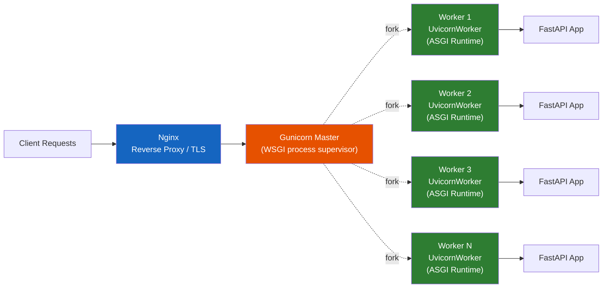
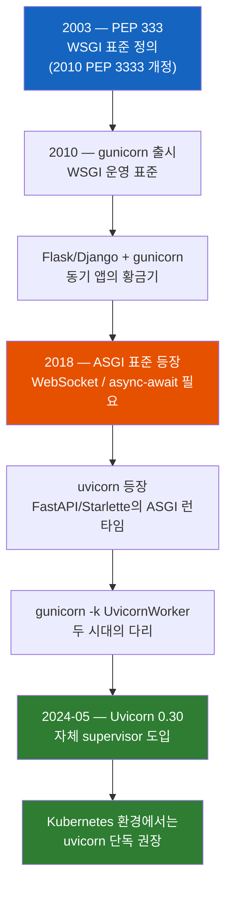

# gunicorn과 uvicorn은 경쟁자가 아니다

둘 다 Python 운영 서버라는데, 왜 보통 같이 쓰고, 2024년부터는 왜 "gunicorn은 더 이상 필요 없다"는 말이 도는 걸까?

## 결론부터 말하면

**gunicorn과 uvicorn은 같은 자리를 다투는 라이벌이 아니다.** gunicorn은 **프로세스 매니저(WSGI 서버)** 이고, uvicorn은 **ASGI 런타임**이다. 그래서 FastAPI 같은 비동기 앱에서는 보통 `gunicorn -k uvicorn_worker.UvicornWorker`처럼 **gunicorn이 uvicorn worker를 감싸는 형태** 로 같이 쓴다.

다만 2024년 5월 **Uvicorn 0.30** 에서 두 가지 변화가 동시에 일어났다. 첫째, **새로운 multiprocess manager** 가 도입되어 supervisor로서의 완성도가 올라갔다(주의: `--workers` 옵션 자체는 Uvicorn 0.10.0(2019)부터 있었으나, 죽은 워커 자동 재시작 같은 본격적인 supervisor 책임은 0.30에서 다듬어졌다). 둘째, 기존의 `uvicorn.workers.UvicornWorker`(Gunicorn worker class) 모듈은 **deprecated** 되어 별도의 `uvicorn-worker` 패키지(`uvicorn_worker.UvicornWorker`)로 분리됐다. 그래서 오늘날 권장 패턴은 환경에 따라 둘로 갈린다 — Kubernetes처럼 외부 supervisor가 있으면 **uvicorn 단독**, 단일 VM/베어메탈에서는 여전히 **gunicorn + uvicorn-worker 조합**.



| 구분 | gunicorn | uvicorn |
|------|----------|---------|
| 표준 | **WSGI** (동기) | **ASGI** (비동기) |
| 주된 역할 | 프로세스 매니저 + WSGI 서버 | ASGI 런타임 |
| 동시성 모델 | 멀티 프로세스 (pre-fork) | 기본은 단일 프로세스 + 이벤트 루프 (uvloop), `--workers` 지정 시 멀티 프로세스 |
| 어울리는 프레임워크 | Flask, Django (전통) | FastAPI, Starlette, Django ASGI |
| 자체 워커 관리 | 강력함 (오랜 표준) | 0.30 (2024-05) 부터 지원 |
| WebSocket | X (sync 워커는 미지원) | O (네이티브) |

---

## 1. 왜 두 서버가 따로 존재할까?

Python 진영에 운영 서버가 둘이라는 건 단순히 "선택지가 많아서"가 아니다. **두 개의 서로 다른 시대 표준** 이 공존하기 때문이다. 이 흐름을 이해하면 "왜 항상 같이 묶어 쓰지?"라는 의문이 자연스럽게 풀린다.



### 1.1 WSGI 시대 — gunicorn이 태어난 이유

2003년 PEP 333(이후 PEP 3333)으로 정의된 **WSGI(Web Server Gateway Interface)** 는 "웹 서버 ↔ Python 애플리케이션" 사이의 호출 규약이다. Java로 치면 **Servlet API에 해당** 한다. 한 가지 결정적 특성이 있다. WSGI는 본질적으로 **동기적** 이다. 요청이 들어오면 워커 하나가 그 요청을 처음부터 끝까지 처리하고 돌려준다. Flask, 그리고 전통적인 사용 방식의 Django가 모두 이 모델 위에 만들어졌다.

이 WSGI 앱을 운영용으로 안정적으로 굴리기 위한 가장 표준적인 도구가 **gunicorn**(2010년 출시)이다. gunicorn은 단순한 "서버"가 아니다. **마스터 프로세스가 여러 워커를 fork** 해서 띄우고, 워커가 죽으면 다시 띄우고, 메모리 누수를 막기 위해 일정 요청을 처리한 워커를 재시작시키는 **프로세스 매니저** 다. 이게 가능했던 배경에는 Python의 GIL이 있다. 멀티스레드만으로는 CPU 확장이 안 되니, 결국 멀티 프로세스로 갈 수밖에 없었고 gunicorn이 그 표준이 됐다.

### 1.2 ASGI 시대 — uvicorn이 등장한 이유

문제는 시간이 지나면서 발생했다. WebSocket, HTTP/2, 그리고 무엇보다 **`async/await` 기반 코드** 를 WSGI는 표현할 수 없었다. WSGI 인터페이스에는 비동기라는 개념 자체가 없었기 때문이다.

그래서 2018년경 **ASGI(Asynchronous Server Gateway Interface)** 가 등장했다. WSGI를 비동기로 확장한 새로운 호출 규약이다. 그리고 ASGI를 가장 빠르게 구현한 서버가 **uvicorn** 이다. C로 짠 **uvloop**(Node.js와 같은 libuv 위에서 동작하는 이벤트 루프)을 이용해서 단일 프로세스 안에서도 수천 개의 동시 연결을 처리한다.

여기서 중요한 점이 있다. **uvicorn은 처음부터 "빠른 ASGI 런타임"이 되는 데에 집중** 했다. 워커 관리, 재시작, 메모리 누수 방어 같은 "platform" 기능은 의도적으로 만들지 않았다. 그건 누군가 다른 도구가 책임지면 된다는 철학이었다. 이 철학적 선택이 다음 절의 이야기로 이어진다.

---

## 2. 핵심 개념: 누가 무엇을 책임지는가

이제 두 서버가 왜 같이 쓰이는지 자연스럽게 보인다. **gunicorn은 프로세스 supervisor 역할, uvicorn은 요청 처리 엔진 역할.** 둘은 같은 층위의 경쟁자가 아니라 서로 다른 층위에서 협력하는 도구다.

### 2.1 황금 조합: gunicorn + uvicorn-worker

`gunicorn`은 기본적으로 sync(WSGI) 워커를 띄운다. 그런데 `-k uvicorn_worker.UvicornWorker` 옵션을 주면, **각 gunicorn 워커가 사실은 풀스펙 uvicorn 서버** 가 된다. 결과적으로 다음의 역할 분담이 만들어진다.

- **gunicorn 마스터**: 워커 N개를 fork, 죽으면 재시작, `max-requests`로 메모리 누수 방지
- **각 uvicorn worker**: 그 안에서 이벤트 루프를 돌리며 ASGI 앱 처리

> **주의 — 패키지가 분리됐다.** Uvicorn 0.30(2024-05)부터 `uvicorn.workers.UvicornWorker` 모듈은 deprecated 처리되어 **별도 패키지 `uvicorn-worker`로 분리** 됐다. 따라서 새 프로젝트에서는 `pip install uvicorn-worker` 후 `-k uvicorn_worker.UvicornWorker`(언더스코어)를 사용해야 한다.

```bash
# 단일 VM에서 FastAPI 운영하는 가장 흔한 명령 (Uvicorn 0.30+ 권장)
pip install gunicorn uvicorn uvicorn-worker

gunicorn app.main:app \
  -k uvicorn_worker.UvicornWorker \
  --workers 4 \
  --bind 0.0.0.0:8000 \
  --timeout 60 \
  --max-requests 2000 --max-requests-jitter 200
```

`max-requests`는 워커 하나가 N개의 요청을 처리하면 알아서 재시작시키라는 옵션이다. Python 앱은 메모리 누수가 흔하고, 이걸 코드 레벨에서 잡기 어렵기 때문에 **"주기적으로 워커를 갈아끼우는" 운영 트릭** 이 표준이 됐다. `max-requests-jitter`는 모든 워커가 동시에 재시작하는 thundering herd를 막는다.

이 패턴은 Python 운영의 **self-healing 철학** 을 잘 보여준다. Java가 GC 튜닝으로 힙 안에서 메모리를 회수하는 길을 택했다면, Python은 **프로세스를 아예 갈아끼워** 메모리 파편화·C 확장 모듈의 누수까지 한 번에 정리하는 방식을 택했다. GIL 때문에 멀티 프로세스로 갈 수밖에 없었던 제약이, 역으로 운영 계층에서의 깔끔한 회복 메커니즘으로 발전한 셈이다.

### 2.2 2024년의 변화 — uvicorn 0.30 supervisor

그런데 **2024년 5월 Uvicorn 0.30** 부터 상황이 달라졌다. uvicorn 자체에 multi-process supervisor가 들어가면서 다음 기능이 표준이 되었다.

- `--workers N` 으로 여러 프로세스 띄우기
- 워커가 죽으면 자동 재시작
- `--limit-max-requests` 로 메모리 누수 완화

곧이어 FastAPI 측에서도 `tiangolo/uvicorn-gunicorn-fastapi` 도커 이미지를 **deprecated** 처리했고, FastAPI 0.111.0(2024-05-03)부터 추가된 `fastapi run` CLI는 이 uvicorn supervisor의 얇은 래퍼다.

> Now that Uvicorn supports managing workers with `--workers`, including restarting dead ones, there's no need for Gunicorn.
> — FastAPI 메인테이너 공지

다시 말해 **uvicorn 단독으로도 "production-ready"가 됐다**. 이게 "gunicorn이 더 이상 필요 없다"는 말의 진짜 출처다.

---

## 3. 실무에서는 어떻게 골라야 할까?

이론을 다 알았으면, 이제 실제 결정 매트릭스가 필요하다.

### 3.1 4가지 패턴

| 패턴 | 명령 | 어떨 때 쓰나 |
|------|------|-------------|
| **A. 순수 gunicorn (sync)** | `gunicorn app:app -w 4` | Flask/전통적 Django의 동기 앱. 가장 안정적이고 검증된 조합 |
| **B. gunicorn + uvicorn-worker** | `gunicorn app:app -k uvicorn_worker.UvicornWorker -w 4` | FastAPI를 단일 VM/베어메탈에 배포. K8s 없이 워커 supervisor가 필요한 경우 |
| **C. uvicorn 단독 + 멀티 워커** | `uvicorn app:app --workers 4` | Uvicorn 0.30+. 컨테이너 1개 안에서 멀티 워커가 필요하고 의존성을 줄이고 싶을 때 |
| **D. uvicorn 단일 프로세스 + K8s** | `uvicorn app:app` (워커 1) | Kubernetes 환경. **K8s가 supervisor 역할을 하므로 gunicorn은 불필요**. 컨테이너 = 1 프로세스 = 1 Pod 단위로 수평 확장 |

> FastAPI 공식 문서도 **K8s에서는 컨테이너당 단일 uvicorn 프로세스** 를 권장한다. K8s ReplicaSet/HPA가 워커 재시작·스케일링을 담당하기 때문이다.

### 3.2 워커 수는 어떻게 정하나?

가장 흔히 인용되는 공식은 다음과 같다.

$$
\text{workers} = (2 \times \text{CPU 코어 수}) + 1
$$

다만 이 공식은 원래 **gunicorn의 sync 워커** 환경에서 제안된 것이다. sync 워커는 한 요청을 처리하는 동안 I/O 대기(블로킹)에 들어가므로, 코어 수보다 워커를 많이 잡아야 대기 시간을 다른 워커가 채워준다는 논리다.

비동기 워커(`UvicornWorker`, uvicorn 단독)에서는 사정이 다르다. **워커 1개가 이미 이벤트 루프로 수천 개의 동시 연결** 을 다루기 때문에, 워커가 너무 많으면 컨텍스트 스위칭과 메모리 비용만 늘어난다. 그래서 비동기 환경에서는 다음이 더 적절하다.

| 워커 종류 | 권장 워커 수 |
|-----------|--------------|
| gunicorn sync 워커 (I/O bound 웹 API) | $(2 \times \text{cpu\_count}) + 1$ |
| 비동기 워커 (I/O bound) | $\text{cpu\_count}$ 정도에서 시작, 부하 테스트로 미세 조정 |
| 비동기 워커 (CPU bound, ML 추론 등) | $\text{cpu\_count}$ 또는 그 이하 |

워커가 많을수록 메모리도 그만큼 든다는 점도 함께 고려해야 한다. 이론값을 그대로 박지 말고 항상 **실제 부하 테스트로 검증** 하라.

### 3.3 자주 하는 실수 — supervisor의 진실을 두 갈래로 두기

가장 많이 보이는 실수는 **애플리케이션 안에 supervisor 책임을 두 갈래로 들고 있는 것** 이다. 같은 프로세스 안에서 두 supervisor가 동시에 살아 있는 일은 사실 드물다. 진짜 문제는 "어떤 entrypoint가 잡히느냐에 따라 supervisor와 워커 수가 바뀌는" **진실 충돌** 이다. 코드 안에 `uvicorn.run(..., workers=N)`을 박아두고 컨테이너 entrypoint는 별도로 `gunicorn`으로 잡으면, 환경별로 해석이 달라져 워커 수·시그널 처리·graceful shutdown 동작이 일관되지 않는다.

```python
# Bad: app/main.py — supervisor의 진실이 코드 안에도 박혀 있다.
from fastapi import FastAPI
import uvicorn

app = FastAPI()

if __name__ == "__main__":
    # gunicorn으로 띄울 거면서 코드에도 uvicorn supervisor 설정을 남겨둠
    uvicorn.run("app.main:app", host="0.0.0.0", port=8000, workers=4)
```

```bash
# Bad: 같은 모듈을 두 entrypoint가 다르게 해석한다.
#   - "python -m app.main"  → uvicorn.run(workers=4)이 실행되어 워커 4개
#   - "gunicorn app.main:app -k uvicorn_worker.UvicornWorker -w 8"
#     → if __name__=="__main__"는 무시되고 gunicorn이 워커 8개로 supervisor 노릇
# 한 코드, 두 개의 진실 → 환경마다 워커 수·라이프사이클 관리가 어긋난다.
CMD ["python", "-m", "app.main"]    # ← 이 경로면 uvicorn supervisor 작동
```

```bash
# Good: 애플리케이션 코드에는 supervisor 설정을 남기지 않고,
#       gunicorn이 워커 수를 단독으로 결정한다.
CMD ["gunicorn", "app.main:app", \
     "-k", "uvicorn_worker.UvicornWorker", \
     "--workers", "4", "--bind", "0.0.0.0:8000"]
```

규칙은 단순하다. **`gunicorn -k uvicorn_worker.UvicornWorker`를 쓴다면 애플리케이션 코드 안에 `uvicorn.run(...)`을 남겨두지 마라.** entrypoint마다 supervisor가 달라지면, 워커 수·시그널 처리·graceful shutdown 동작이 환경마다 어긋나 디버깅이 매우 어려워진다.

### 3.4 Java 개발자가 익숙한 그림으로 매핑

| Python 세계 | Java/Spring 세계 |
|-------------|------------------|
| WSGI | Servlet API |
| ASGI | Reactive Streams / WebFlux 비스무리 |
| gunicorn (master + workers) | systemd가 띄운 여러 Tomcat 인스턴스, 또는 K8s ReplicaSet |
| uvicorn (이벤트 루프) | Netty 위의 WebFlux |
| `gunicorn + uvicorn-worker` | Tomcat 노드 여러 개를 띄워두고, 각 노드 안에서 비동기 처리 |
| K8s + uvicorn 단독 | K8s가 외부 supervisor → 컨테이너 안은 단일 JVM |

큰 그림은 이렇다. Java처럼 한 JVM 안에서 스레드 풀로 처리하는 모델이 아니라, Python은 **GIL 때문에 외부에서 프로세스를 여러 개 띄우는 모델** 을 택해야 했다. 그 "외부에서 띄워주는 도구"가 처음에는 gunicorn 혼자였고, ASGI가 등장하면서 uvicorn worker로 확장됐고, 이제는 uvicorn 자체에도 그 기능이 들어왔다. 이게 본질적인 흐름이다.

### 3.5 supervisor가 누구냐에 따라 운영 책임이 달라진다

선택 기준이 "supervisor가 누구냐"라는 건 단순한 명령어 차이가 아니라 **운영 책임이 어느 계층으로 옮겨지느냐** 의 문제다. 이걸 의식하지 못하면 같은 코드인데도 한쪽에서는 잘 돌고 한쪽에서는 배포 때마다 503이 뜬다.

**Kubernetes + uvicorn 단독 (Pattern D)** 으로 옮기면 더 이상 애플리케이션이 죽은 워커를 살리는 supervisor를 들고 있지 않다. 대신 K8s가 보내는 `SIGTERM`을 안정적으로 수신해서 진행 중인 요청을 안전하게 끝내는 **Graceful Shutdown** 이 운영 안정성의 핵심 지표가 된다. uvicorn의 `--timeout-graceful-shutdown` 옵션과 FastAPI의 `lifespan` 훅을 활용해 DB 커넥션·외부 큐를 깔끔하게 정리하는 코드를 갖춰야 한다.

```python
# Graceful Shutdown 예시 (FastAPI lifespan 훅)
from contextlib import asynccontextmanager
from fastapi import FastAPI

@asynccontextmanager
async def lifespan(app: FastAPI):
    pool = await create_pg_pool()       # 시작 시 자원 확보
    app.state.pool = pool
    yield                                 # SIGTERM 수신 시 아래로 진행
    await pool.close()                    # 진행 중 요청 끝낸 뒤 정리

app = FastAPI(lifespan=lifespan)
```

```bash
uvicorn app.main:app --timeout-graceful-shutdown 30
```

반대로 **단일 VM + gunicorn (Pattern B)** 을 유지하는 이유 중 하나는 gunicorn의 성숙한 **시그널 처리** 다. 대표적으로 `SIGHUP`을 보내면 gunicorn이 워커를 **하나씩 순차적으로 교체** 하면서 설정·코드를 다시 읽어들인다(graceful reload). uvicorn 자체 supervisor도 reload 기능은 있지만, 무중단 배포 수준의 세밀한 워커 라이프사이클 제어는 아직 gunicorn 쪽이 더 안정적이다.

```bash
# 무중단으로 워커 교체 (gunicorn graceful reload)
kill -HUP $(cat /var/run/gunicorn.pid)
```

요컨대 supervisor를 K8s에 넘기면 애플리케이션은 **종료 신호 처리** 에 집중하면 되고, 그대로 gunicorn에 두면 **시그널 기반 reload 같은 고급 운영 기능** 을 그대로 누릴 수 있다. 이 트레이드오프가 패턴 선택의 본질이다.

---

## 4. 정리

### 핵심 포인트

1. **gunicorn vs uvicorn은 라이벌이 아니다**
   - gunicorn = WSGI 프로세스 매니저, uvicorn = ASGI 런타임. 같은 자리를 다투는 게 아니라 서로 다른 층위에서 협력한다.

2. **시대 구분이 핵심이다**
   - WSGI(동기, 2003) → Flask/Django + gunicorn 시대
   - ASGI(비동기, 2018) → FastAPI/Starlette + uvicorn 시대
   - 그 사이의 다리가 `gunicorn -k uvicorn_worker.UvicornWorker` (구 `uvicorn.workers.UvicornWorker`는 deprecated)

3. **2024-05 Uvicorn 0.30 부터는 uvicorn 단독도 production-ready**
   - 자체 supervisor가 추가됐고, FastAPI 0.111.0의 `fastapi run`이 그 wrapper. K8s 환경에서는 **uvicorn 단독이 권장** 된다.

4. **선택 기준은 "supervisor가 누구냐 + 운영 책임이 어디로 가느냐"**
   - 단일 VM/베어메탈 → gunicorn + uvicorn-worker (SIGHUP graceful reload 등 시그널 기반 운영 가능)
   - 컨테이너 + K8s → uvicorn 단독 (K8s가 supervisor, 앱은 SIGTERM Graceful Shutdown에 집중)
   - 동기 Flask/Django → 그냥 gunicorn

5. **워커 수는 워커 종류에 따라 다르고, supervisor 진실은 한 곳에만 둔다**
   - sync 워커: $(2 \times \text{cpu\_count}) + 1$
   - 비동기 워커: $\text{cpu\_count}$ 부근에서 시작, 부하 테스트로 미세 조정
   - 애플리케이션 코드와 entrypoint 양쪽에 supervisor 설정(`uvicorn.run(workers=N)` + 외부 `gunicorn`)을 동시에 남기지 말 것 — 둘이 동시에 굴러가는 일은 드물지만, **entrypoint마다 supervisor와 워커 수의 진실이 달라져** 환경별로 동작이 어긋난다.

---

## 출처

- [Uvicorn 공식 문서 - Deployment](https://www.uvicorn.org/deployment/) - 공식 문서
- [Gunicorn 공식 문서](https://docs.gunicorn.org/en/stable/) - 공식 문서
- [Gunicorn Settings - worker-connections](https://docs.gunicorn.org/en/stable/settings.html#worker-connections) - 공식 문서
- [Gunicorn Signal Handling (SIGHUP graceful reload)](https://docs.gunicorn.org/en/stable/signals.html) - 공식 문서
- [FastAPI 공식 문서 - Server Workers (Gunicorn with Uvicorn)](https://fastapi.tiangolo.com/deployment/server-workers/) - 공식 문서
- [FastAPI Release Notes (0.111.0)](https://fastapi.tiangolo.com/release-notes/) - 공식 릴리스 노트
- [PEP 3333 - Python Web Server Gateway Interface (WSGI)](https://peps.python.org/pep-3333/) - 공식 표준
- [ASGI Specification](https://asgi.readthedocs.io/en/latest/specs/main.html) - 공식 표준
- [uvicorn-worker (PyPI)](https://pypi.org/project/uvicorn-worker/)
- [Stack Overflow: Does FastAPI still need Gunicorn?](https://stackoverflow.com/questions/79694234/does-fastapi-still-need-gunicorn)
- [Uvicorn vs Gunicorn: It's Not a Fight, It's About Who Owns the Responsibility](https://medium.com/codecodecode/uvicorn-vs-gunicorn-its-not-a-fight-it-s-about-who-owns-the-responsibility-51eb6f7827aa)
- [Mastering Gunicorn and Uvicorn: The Right Way to Deploy FastAPI Applications](https://medium.com/@iklobato/mastering-gunicorn-and-uvicorn-the-right-way-to-deploy-fastapi-applications-aaa06849841e)
- [Render: FastAPI production deployment best practices](https://render.com/articles/fastapi-production-deployment-best-practices)
