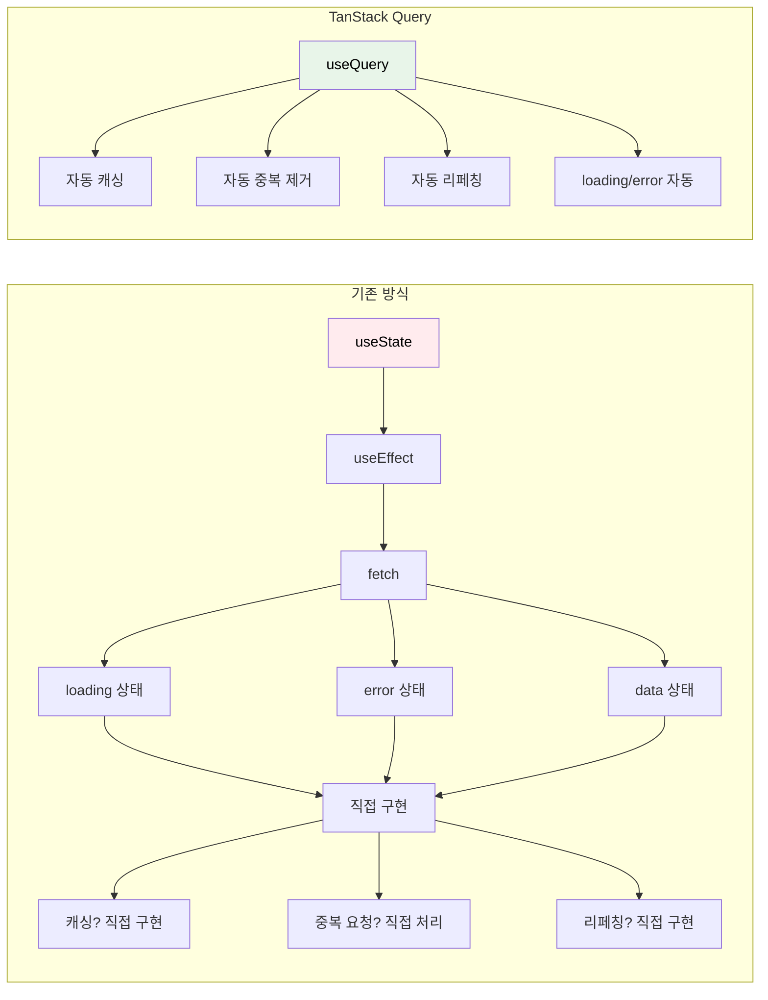
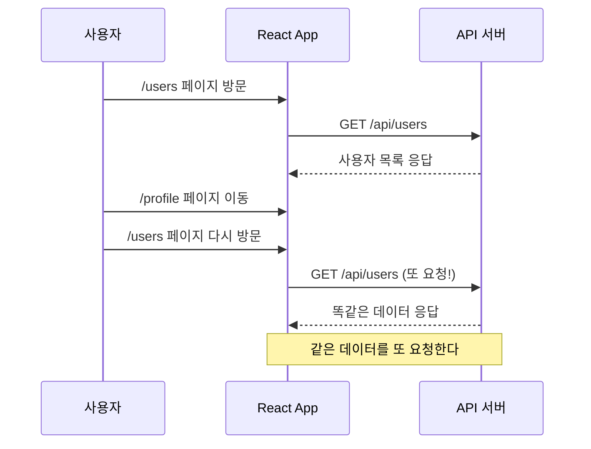
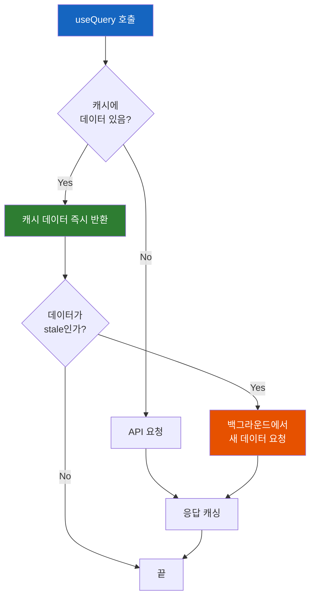
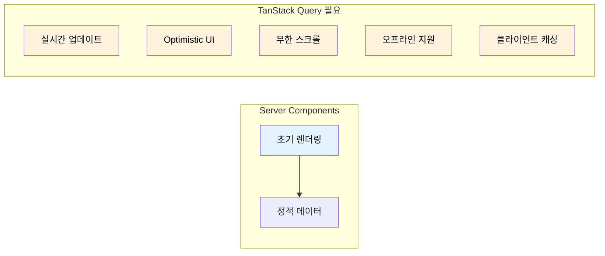

# TanStack Query가 탄생한 이유

"데이터 페칭 하나에 왜 이렇게 코드가 많아?" 라는 불만에서 시작된 라이브러리

## 결론부터 말하면

**TanStack Query는 "서버 상태(Server State)"를 관리하기 위해 탄생했다.** 기존 상태관리 라이브러리(Redux, MobX 등)는 "클라이언트 상태" 에 최적화되어 있어서, 서버 데이터를 다루려면 개발자가 직접 캐싱, 동기화, 에러 처리를 구현해야 했다.



| 구분 | 클라이언트 상태 | 서버 상태 |
|------|----------------|----------|
| 예시 | 모달 열림/닫힘, 테마 | 사용자 목록, 게시글 |
| 소유권 | 내 앱이 완전히 소유 | 서버가 소유, 내 앱은 복사본 |
| 동기화 | 필요 없음 | 서버와 항상 동기화 필요 |
| 최적 도구 | Redux, Zustand | **TanStack Query** |

---

## 1. 왜 기존 방식에 문제가 있었을까?

### 1.1 데이터 페칭의 현실

React에서 API 데이터를 가져오려면 보통 이렇게 작성한다:

```tsx
function UserList() {
  const [users, setUsers] = useState([]);
  const [loading, setLoading] = useState(true);
  const [error, setError] = useState(null);

  useEffect(() => {
    const fetchUsers = async () => {
      try {
        setLoading(true);
        const response = await fetch('/api/users');
        const data = await response.json();
        setUsers(data);
      } catch (err) {
        setError(err);
      } finally {
        setLoading(false);
      }
    };

    fetchUsers();
  }, []);

  if (loading) return <div>로딩 중...</div>;
  if (error) return <div>에러 발생!</div>;

  return <ul>{users.map(user => <li key={user.id}>{user.name}</li>)}</ul>;
}
```

코드가 길어 보이지만, 이건 **가장 기본적인 경우** 다. 실제로는 더 많은 것을 처리해야 한다.

### 1.2 실무에서 마주치는 문제들

**문제 1: 캐싱**

사용자 목록 페이지를 떠났다가 다시 돌아오면? 매번 API를 다시 호출한다. 데이터가 바뀌지 않았는데도.



**문제 2: 중복 요청**

같은 컴포넌트가 여러 곳에서 렌더링되면? 각각 API를 호출한다.

```tsx
// Header에서 사용자 정보 표시
function Header() {
  const [user, setUser] = useState(null);
  useEffect(() => { fetch('/api/me').then(...) }, []);  // 요청 1
  return <div>{user?.name}</div>;
}

// Sidebar에서도 사용자 정보 표시
function Sidebar() {
  const [user, setUser] = useState(null);
  useEffect(() => { fetch('/api/me').then(...) }, []);  // 요청 2 (중복!)
  return <div>{user?.email}</div>;
}
```

**문제 3: 데이터 신선도**

서버에서 데이터가 바뀌었는데, 내 화면에는 옛날 데이터가 보인다. 언제 다시 가져와야 할까?

**문제 4: 낙관적 업데이트(Optimistic Update)**

"좋아요" 버튼을 눌렀을 때, 서버 응답을 기다리지 않고 바로 UI를 업데이트하고 싶다. 실패하면 롤백해야 하는데... 이걸 직접 구현하려면?

---

## 2. 서버 상태는 클라이언트 상태와 근본적으로 다르다

### 2.1 두 가지 상태의 차이

Redux나 Zustand 같은 상태관리 라이브러리는 **클라이언트 상태** 를 위해 설계됐다:

```tsx
// 클라이언트 상태 - 완전히 내가 통제
const [isModalOpen, setIsModalOpen] = useState(false);
const [theme, setTheme] = useState('dark');
```

이 데이터는 내 앱 안에서만 존재하고, 내가 완전히 통제한다.

하지만 **서버 상태** 는 다르다:

```tsx
// 서버 상태 - 서버에 원본이 있고, 내 앱에는 복사본만 있음
const [users, setUsers] = useState([]);  // 이건 서버 데이터의 "스냅샷"
```

서버 상태의 특징:
- **원격에 저장됨** - 내가 소유하지 않는다
- **비동기로만 접근** 가능 - fetch, axios 등을 써야 함
- **다른 사람이 변경 가능** - 내가 모르는 사이에 바뀔 수 있음
- **시간이 지나면 "오래된" 상태** 가 됨

### 2.2 이 차이가 왜 중요한가?

Redux로 서버 상태를 관리하려고 하면 이렇게 된다:

```tsx
// Redux로 서버 상태 관리하기 (복잡해진다)
const userSlice = createSlice({
  name: 'users',
  initialState: {
    data: [],
    loading: false,
    error: null,
    lastFetched: null,  // 캐시 시간 직접 관리
  },
  reducers: {
    fetchStart: (state) => { state.loading = true; },
    fetchSuccess: (state, action) => {
      state.data = action.payload;
      state.loading = false;
      state.lastFetched = Date.now();
    },
    fetchError: (state, action) => {
      state.error = action.payload;
      state.loading = false;
    },
  }
});

// 캐시 만료 확인, 중복 요청 방지 등... 전부 직접 구현해야 함
```

매번 이런 보일러플레이트 코드를 작성해야 한다. **모든 API 엔드포인트마다!**

---

## 3. TanStack Query의 해결책

### 3.1 핵심 아이디어: Query와 Mutation

TanStack Query는 서버 상태를 두 가지로 구분한다:

| 개념 | 설명 | HTTP 메서드 |
|------|------|------------|
| **Query** | 데이터 읽기 | GET |
| **Mutation** | 데이터 변경 | POST, PUT, DELETE |

### 3.2 useQuery: 데이터 읽기의 혁명

아까 작성했던 긴 코드가 이렇게 바뀐다:

```tsx
function UserList() {
  const { data: users, isLoading, error } = useQuery({
    queryKey: ['users'],
    queryFn: () => fetch('/api/users').then(res => res.json()),
  });

  if (isLoading) return <div>로딩 중...</div>;
  if (error) return <div>에러 발생!</div>;

  return <ul>{users.map(user => <li key={user.id}>{user.name}</li>)}</ul>;
}
```

**useState 3개, useEffect, try-catch가 전부 사라졌다.**

하지만 더 중요한 건 코드 줄 수가 아니다. **자동으로 처리되는 것들** 이다:



### 3.3 자동으로 처리되는 것들

**1. 캐싱**

```tsx
// 컴포넌트 A
const { data } = useQuery({ queryKey: ['users'], queryFn: fetchUsers });

// 컴포넌트 B (같은 queryKey)
const { data } = useQuery({ queryKey: ['users'], queryFn: fetchUsers });

// API 호출은 1번만! 두 컴포넌트가 같은 캐시를 공유
```

**2. 중복 요청 제거(Deduplication)**

같은 queryKey로 동시에 여러 요청이 발생하면, 실제 네트워크 요청은 1번만 보낸다.

**3. 백그라운드 리페칭**

- 윈도우 포커스 시 자동 리페칭
- 네트워크 재연결 시 자동 리페칭
- 일정 시간마다 자동 리페칭 (폴링)

**4. Stale-While-Revalidate 전략**

오래된 캐시 데이터를 먼저 보여주고, 백그라운드에서 새 데이터를 가져온다. 사용자는 로딩 스피너를 보지 않아도 된다.

### 3.4 useMutation: 데이터 변경

```tsx
function CreateUser() {
  const queryClient = useQueryClient();

  const mutation = useMutation({
    mutationFn: (newUser) => fetch('/api/users', {
      method: 'POST',
      body: JSON.stringify(newUser),
    }),
    onSuccess: () => {
      // 사용자 목록 캐시 무효화 → 자동으로 리페칭
      queryClient.invalidateQueries({ queryKey: ['users'] });
    },
  });

  return (
    <button
      onClick={() => mutation.mutate({ name: '새 사용자' })}
      disabled={mutation.isPending}
    >
      {mutation.isPending ? '생성 중...' : '사용자 추가'}
    </button>
  );
}
```

---

## 4. 그런데, Next.js Server Components가 있는데 왜 필요해?

이것이 Reddit 토론의 핵심이다.

### 4.1 Server Components만으로 충분한 경우

Next.js 13+ App Router를 사용하면:

```tsx
// Server Component - 서버에서 직접 데이터 fetch
async function UserList() {
  const users = await fetch('https://api.example.com/users');
  return <ul>{users.map(...)}</ul>;
}

// Server Action - 서버에서 직접 mutation 처리
async function createUser(formData: FormData) {
  'use server';
  await db.users.create({ name: formData.get('name') });
  revalidatePath('/users');  // 페이지 리프레시
}
```

이 방식이 충분한 경우:
- 정적인 데이터 표시
- 폼 제출 후 페이지 새로고침이 괜찮은 경우
- 실시간성이 크게 중요하지 않은 경우

### 4.2 TanStack Query가 여전히 필요한 경우



| 시나리오 | Server Components | TanStack Query |
|---------|------------------|----------------|
| 초기 페이지 로드 | **추천** | 가능 |
| 실시간 데이터 (폴링) | 어려움 | **추천** |
| 낙관적 업데이트 | 불가능 | **추천** |
| 무한 스크롤/페이지네이션 | 가능하지만 복잡 | **추천** |
| 오프라인 우선 | 불가능 | **가능** |
| 복잡한 캐시 무효화 | 제한적 | **강력함** |

### 4.3 함께 사용하기

실제로 두 가지를 **함께** 사용하는 경우가 많다.

**방법 1: initialData (간단한 경우)**

```tsx
// Server Component
async function Page() {
  const initialUsers = await fetch('/api/users').then(r => r.json());
  return <UserList initialData={initialUsers} />;
}

// Client Component
'use client';
function UserList({ initialData }) {
  const { data: users } = useQuery({
    queryKey: ['users'],
    queryFn: fetchUsers,
    initialData,
  });
}
```

하지만 이 방식은 컴포넌트 트리가 깊어지면 **Prop Drilling** 문제가 생긴다.

**방법 2: HydrationBoundary (권장)**

TanStack Query에서 권장하는 패턴이다. 서버에서 prefetch한 데이터를 클라이언트 캐시에 직접 주입한다:

```tsx
// Server Component
import { dehydrate, HydrationBoundary, QueryClient } from '@tanstack/react-query';

async function Page() {
  const queryClient = new QueryClient();

  // 서버에서 미리 데이터를 가져와 캐시에 저장
  await queryClient.prefetchQuery({
    queryKey: ['users'],
    queryFn: fetchUsers,
  });

  return (
    // 캐시 상태를 클라이언트로 전달
    <HydrationBoundary state={dehydrate(queryClient)}>
      <UserList />
    </HydrationBoundary>
  );
}

// Client Component - props 없이 바로 캐시에서 읽음
'use client';
function UserList() {
  const { data: users } = useQuery({
    queryKey: ['users'],
    queryFn: fetchUsers,
  });
  // 서버에서 prefetch된 데이터가 즉시 사용됨
}
```

HydrationBoundary의 장점:
- Prop Drilling 없이 깊은 컴포넌트에서도 데이터 접근 가능
- 여러 컴포넌트가 같은 데이터를 필요로 할 때 자연스러운 동기화
- 클라이언트 캐시와 완벽하게 통합

### 4.4 Server Action + useMutation 조합

Next.js 15+ 환경에서 자주 사용되는 패턴이다. Server Action의 서버 로직과 TanStack Query의 클라이언트 캐시 관리를 결합한다:

```tsx
// Server Action 정의
'use server';
async function createUserAction(data: { name: string }) {
  const user = await db.users.create(data);
  return user;
}

// Client Component에서 useMutation과 결합
'use client';
function CreateUserForm() {
  const queryClient = useQueryClient();

  const mutation = useMutation({
    mutationFn: createUserAction,  // Server Action 호출
    onSuccess: () => {
      queryClient.invalidateQueries({ queryKey: ['users'] });
    },
  });

  return (
    <button onClick={() => mutation.mutate({ name: '새 사용자' })}>
      추가
    </button>
  );
}
```

### 4.5 낙관적 업데이트: useOptimistic vs TanStack Query

React 19에 `useOptimistic` 훅이 추가되면서 선택지가 생겼다:

| 기준 | React useOptimistic | TanStack Query |
|------|---------------------|----------------|
| 의존성 | 없음 (React 내장) | 외부 라이브러리 |
| 복잡도 | 단순한 케이스에 적합 | 복잡한 캐시 관리 가능 |
| 롤백 | 자동 (pending 상태 종료 시) | onError에서 수동 롤백 |
| 캐시 통합 | 없음 | 전체 쿼리 캐시와 통합 |
| 추천 상황 | 단일 컴포넌트 내 간단한 UI | 여러 컴포넌트가 같은 데이터 공유 |

**간단한 "좋아요" 버튼** 처럼 단일 컴포넌트에서 끝나는 경우는 `useOptimistic`이 가볍다. 하지만 **같은 데이터를 여러 곳에서 표시** 하거나 **복잡한 캐시 무효화** 가 필요하면 TanStack Query가 적합하다.

---

## 5. 정리

### TanStack Query를 써야 하는 경우

1. **클라이언트 측 데이터 캐싱** 이 필요할 때
2. **실시간 업데이트** (자동 리페칭, 폴링)가 필요할 때
3. **낙관적 업데이트** 로 빠른 UX를 제공하고 싶을 때
4. **무한 스크롤/페이지네이션** 을 구현할 때
5. 같은 데이터를 **여러 컴포넌트에서 공유** 할 때

### 안 써도 되는 경우

1. Server Components + Server Actions로 충분한 간단한 CRUD
2. 실시간성이 중요하지 않은 정적 페이지
3. 상태관리가 거의 필요 없는 작은 프로젝트

### 이름이 왜 바뀌었나?

React Query에서 **TanStack Query** 로 이름이 바뀐 이유는 간단하다. React뿐만 아니라 **Vue, Svelte, Solid, Angular** 에서도 사용할 수 있게 확장되었기 때문이다. TanStack은 이 라이브러리를 만든 팀/브랜드 이름이다.

---

## 출처

- [TanStack Query 공식 문서](https://tanstack.com/query/latest) - 공식 문서
- [Reddit: Is React Query needed?](https://www.reddit.com/r/nextjs/comments/1hwpydb/is_react_query_needed/) - 커뮤니티 토론
