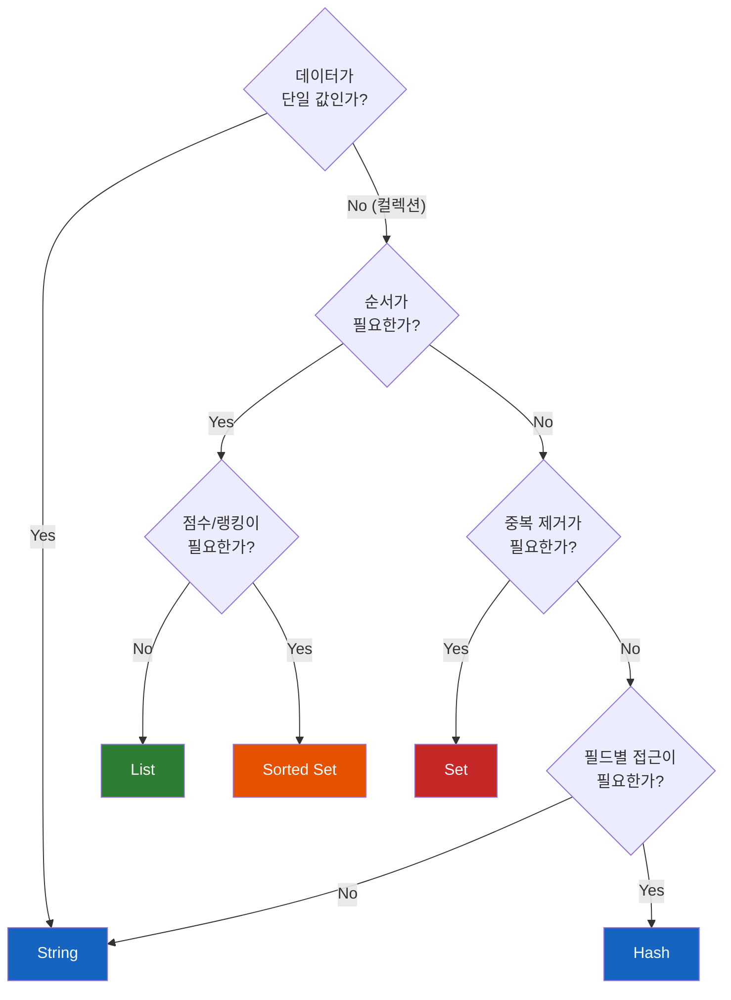

# Redis 5대 자료구조 - 이것만 알면 실무가 된다

Redis 사용의 80%는 `SET`/`GET`으로 끝난다고 한다. 하지만 나머지 20%를 모르면, 랭킹 시스템을 구현할 때 DB에 `ORDER BY`를 날리고, 메시지 큐를 위해 Kafka를 도입하고, 좋아요 중복 체크를 위해 DB 쿼리를 추가하게 된다. 이 모든 것을 Redis 하나로 해결할 수 있다면?

## 결론부터 말하면

Redis의 5대 자료구조는 각각 **특정 문제를 가장 효율적으로 해결** 하기 위해 존재한다. "어떤 자료구조가 있는가"가 아니라 **"이 문제에는 어떤 자료구조가 맞는가"** 로 접근해야 한다.

| 문제 | 자료구조 | 왜 이것인가 |
|------|---------|-----------|
| 캐싱, 세션, 카운터 | **String** | 가장 단순, 원자적 증감 |
| 작업 큐, 최근 목록 | **List** | 양방향 push/pop, 블로킹 지원 |
| 중복 제거, 집합 연산 | **Set** | 유일성 보장, 교/합/차집합 |
| 객체 저장, 메모리 최적화 | **Hash** | 필드 단위 접근, 소규모 시 메모리 효율적 |
| 랭킹, 스코어 기반 정렬 | **Sorted Set** | 자동 정렬, $O(\log n)$ 삽입/조회 |

## 1. String — Redis 사용의 80%

### 1.1 왜 String이 기본인가?

String은 Redis에서 가장 기본적인 자료구조다. 하지만 "문자열"이라는 이름에 속으면 안 된다. Redis의 String은 **최대 512MB의 바이너리 세이프 데이터** 를 저장할 수 있다. 텍스트, 숫자, JSON, 심지어 이미지 바이너리까지 담을 수 있다.

### 1.2 핵심 명령어

```bash
# 기본 저장/조회
SET user:1234:name "Alice"
GET user:1234:name          # "Alice"

# TTL과 함께 저장 (캐싱의 핵심)
SET session:abc123 "user_data" EX 3600   # 1시간 후 자동 삭제
# 또는
SETEX session:abc123 3600 "user_data"    # 동일

# 이미 있으면 저장하지 않음 (분산 락의 기본)
# 과거 SETNX 명령은 Redis 2.6.12부터 deprecated. SET ... NX로 원자 획득한다.
SET lock:order:5678 "worker-1" NX         # OK (성공) 또는 nil (이미 존재)

# 원자적 카운터
INCR page:views:home         # 1, 2, 3, ... (원자적 증가)
INCRBY product:stock:99 -1   # 재고 1 감소

# 일괄 처리 (네트워크 왕복 절약)
MSET user:1:name "Alice" user:2:name "Bob"
MGET user:1:name user:2:name   # ["Alice", "Bob"]
```

### 1.3 실무 패턴

**패턴 1: 캐싱 + TTL**

가장 흔한 패턴이다. DB 쿼리 결과를 String에 저장하고, TTL로 자동 만료시킨다.

```bash
# 상품 정보 캐싱 (5분 TTL)
SET product:123 '{"name":"MacBook","price":2500000}' EX 300
```

Spring에서 `@Cacheable("products")`를 사용하면, 내부적으로 이와 동일한 동작을 한다.

**패턴 2: 분산 락 (SETNX)**

여러 서버에서 동시에 같은 작업을 하면 안 되는 경우, `SETNX`(Set if Not eXists)로 분산 락을 구현한다.

```bash
# 락 획득 시도 (10초 TTL — 데드락 방지)
SET lock:payment:order123 "server-1" NX EX 10

# 작업 완료 후 락 해제
DEL lock:payment:order123
```

> **주의:** 실무에서는 이 단순한 패턴보다 **Redlock 알고리즘** 이나 **Redisson** 라이브러리를 사용하는 것이 안전하다. 단순 `SETNX`는 락 소유자 확인 없이 `DEL`하면 다른 서버의 락을 풀어버릴 수 있다.

**패턴 3: 원자적 카운터 (INCR)**

`INCR`은 **원자적(Atomic)** 이다. 여러 서버에서 동시에 호출해도 정확하게 1씩 증가한다. Lock이 필요 없다. Redis가 싱글 스레드이기 때문에 가능한 것이다.

```bash
# 실시간 조회수
INCR article:views:456

# API 요청 Rate Limiting (1분 윈도우)
INCR rate:user:789
EXPIRE rate:user:789 60     # 1분 후 리셋
```

## 2. List — 블로킹을 활용한 작업 큐

### 2.1 왜 List가 큐에 적합한가?

메시지 큐가 필요할 때 무조건 Kafka를 도입해야 할까? 단순한 작업 큐(이메일 발송, 알림 전송)는 Redis List로 충분하다. List는 **양쪽 끝에서 push/pop** 이 가능한 Linked List로, FIFO 큐를 자연스럽게 구현한다.

```bash
# Producer: 작업 추가 (오른쪽 push)
RPUSH task:email '{"to":"alice@ex.com","subject":"가입 환영"}'
RPUSH task:email '{"to":"bob@ex.com","subject":"주문 완료"}'

# Consumer: 작업 꺼내기 (왼쪽 pop)
LPOP task:email   # 가장 먼저 넣은 작업이 나옴 (FIFO)
```

### 2.2 BLPOP — 블로킹 팝의 위력

`LPOP`은 리스트가 비어있으면 `nil`을 반환하고 끝이다. Consumer는 끊임없이 "비어있나? 비어있나?" 하고 폴링해야 한다. 이것은 CPU 낭비다.

**`BLPOP`(Blocking Left Pop)** 은 리스트가 비어있으면 **새 요소가 들어올 때까지 대기** 한다. 폴링 없이 이벤트 기반으로 동작하여 CPU를 낭비하지 않는다.

```bash
# Consumer: 최대 30초 동안 대기
BLPOP task:email 30
# 새 작업이 들어오면 즉시 반환
# 30초 동안 없으면 nil 반환
```

### 2.3 BLPOP으로 우선순위 큐 구현

`BLPOP`에 **여러 키를 지정** 하면, 앞에 있는 키를 우선적으로 확인한다. 이것으로 우선순위 큐를 구현할 수 있다.

```bash
# 높은 우선순위 작업
RPUSH queue:high '{"task":"긴급 결제 처리"}'

# 낮은 우선순위 작업
RPUSH queue:low '{"task":"일반 알림 발송"}'

# Consumer: high를 먼저 확인, 없으면 low 확인
BLPOP queue:high queue:low 30
# queue:high에 데이터가 있으면 그것을 먼저 pop
# queue:high가 비어있을 때만 queue:low에서 pop
```

Java의 `PriorityBlockingQueue`와 비슷하지만, Redis를 사용하면 **여러 서버의 Consumer가 공유** 할 수 있다는 장점이 있다.

### 2.4 기타 유용한 명령어

```bash
LRANGE mylist 0 -1     # 전체 목록 조회 (pop 없이)
LRANGE mylist 0 9      # 상위 10개만 조회
LLEN mylist            # 리스트 길이
LTRIM mylist 0 99      # 최근 100개만 유지 (오래된 것 삭제)
```

`LTRIM`은 "최근 본 상품 N개"처럼 최근 데이터만 유지하는 패턴에 유용하다.

## 3. Set — 중복을 허용하지 않는 집합

### 3.1 왜 Set인가?

"이 사용자가 이미 좋아요를 눌렀는가?" "두 사용자의 공통 관심사는?" 이런 질문에 가장 효율적으로 답하는 자료구조가 Set이다. Set은 **중복을 허용하지 않는 문자열의 집합** 이다. 멤버 존재 여부 확인이 $O(1)$이다.

### 3.2 핵심 명령어

```bash
# 멤버 추가
SADD article:123:likes "user:alice"
SADD article:123:likes "user:bob"
SADD article:123:likes "user:alice"   # 이미 존재, 추가 안 됨 (0 반환)

# 멤버 존재 확인 — O(1)
SISMEMBER article:123:likes "user:alice"  # 1 (존재)
SISMEMBER article:123:likes "user:charlie"  # 0 (없음)

# 전체 멤버 조회
SMEMBERS article:123:likes   # ["user:alice", "user:bob"]

# 멤버 수
SCARD article:123:likes      # 2
```

### 3.3 집합 연산 — Set의 진짜 힘

Set의 진짜 강점은 **교집합, 합집합, 차집합** 을 Redis 서버에서 직접 계산한다는 것이다. 애플리케이션 코드에서 처리하면 양쪽 데이터를 모두 가져와서 비교해야 하지만, Redis에서는 명령 하나로 끝난다.

```bash
# Alice의 관심사
SADD interests:alice "java" "spring" "redis" "docker"

# Bob의 관심사
SADD interests:bob "python" "redis" "docker" "kubernetes"

# 공통 관심사 (교집합)
SINTER interests:alice interests:bob
# ["redis", "docker"]

# 모든 관심사 (합집합)
SUNION interests:alice interests:bob
# ["java", "spring", "redis", "docker", "python", "kubernetes"]

# Alice만의 관심사 (차집합)
SDIFF interests:alice interests:bob
# ["java", "spring"]
```

소셜 서비스에서 **"공통 친구"** 기능을 구현할 때 `SINTER`를 사용하면, DB에서 양쪽 친구 목록을 가져와서 코드로 비교하는 것보다 훨씬 빠르고 간결하다.

> **주의:** `SINTER`, `SUNION` 등의 집합 연산은 Set의 멤버 수가 많을수록 처리 시간이 길어진다. Redis는 싱글 스레드이므로, 수만 건 이상의 **Big Key** 에 대해 집합 연산을 수행하면 다른 모든 명령이 대기하게 된다. 대규모 Set의 집합 연산이 필요하면 `SINTERSTORE`로 결과를 별도 키에 저장하는 비동기 처리를 고려하거나, 애플리케이션 레벨에서 `SSCAN`으로 분할 처리하는 것이 안전하다.

## 4. Hash — String보다 메모리 효율적인 객체 저장

### 4.1 왜 Hash가 String보다 효율적일 수 있는가?

사용자 프로필을 Redis에 저장한다고 하자. String을 쓰는 방법은 두 가지다.

```bash
# 방법 1: JSON 직렬화 (하나의 키)
SET user:123 '{"name":"Alice","age":30,"email":"alice@ex.com"}'

# 방법 2: 필드별 개별 키
SET user:123:name "Alice"
SET user:123:age "30"
SET user:123:email "alice@ex.com"
```

방법 1은 이름만 바꾸고 싶어도 **전체 JSON을 읽고 → 파싱하고 → 수정하고 → 다시 저장** 해야 한다. 방법 2는 키가 3개로 늘어나서 **메모리 오버헤드** 가 크다 (Redis는 키 하나당 약 50~70바이트의 메타데이터를 사용한다).

Hash는 이 두 방법의 장점만 취한다.

```bash
# Hash: 하나의 키, 필드별 개별 접근
HSET user:123 name "Alice" age 30 email "alice@ex.com"

# 특정 필드만 조회 (전체를 읽을 필요 없음)
HGET user:123 name          # "Alice"

# 특정 필드만 수정
HSET user:123 age 31

# 전체 조회
HGETALL user:123
# name: Alice, age: 31, email: alice@ex.com

# 특정 필드 원자적 증감
HINCRBY user:123 age 1      # 32
```

### 4.2 메모리 효율의 비밀: ziplist/listpack 인코딩

Hash가 메모리 효율적인 진짜 이유는 **인코딩 방식** 에 있다. 필드 수가 적고 값이 작으면, Redis는 Hash를 일반 해시 테이블이 아닌 **ziplist(Redis 7.0+에서는 listpack)** 이라는 컴팩트한 구조로 저장한다.

| 조건 | 인코딩 | 메모리 |
|------|--------|--------|
| 필드 ≤ 512개 **AND** 값 ≤ 64바이트 | **listpack** (컴팩트) | 매우 적음 |
| 위 조건 초과 | **hashtable** (일반) | String과 비슷 |

이 임계값은 `hash-max-listpack-entries`(**기본 512**)와 `hash-max-listpack-value`(**기본 64**)로 조정할 수 있다. Redis 6.x 이전에서는 같은 역할을 하는 설정이 `hash-max-ziplist-entries`(기본 512), `hash-max-ziplist-value`(기본 64)이며, 이름만 다를 뿐 기본값은 동일하다.

> Instagram은 이 원리를 활용해서 수억 개의 키를 해시 버킷으로 묶어 저장하여 **메모리를 75% 절감** 했다. 수백만 개의 개별 String 키 대신, 1,000개 단위로 Hash에 묶어 저장하는 패턴이다.

### 4.3 주의사항

**Redis 7.4 이전**에는 Hash의 개별 필드에 TTL을 설정할 수 없었고, TTL은 키 단위로만 가능했다. **Redis 7.4부터는 `HEXPIRE`, `HPEXPIRE`, `HEXPIREAT`, `HTTL`, `HPERSIST` 같은 명령이 추가되어 Hash 필드 단위로 TTL을 직접 지정**할 수 있다. 7.4 미만 버전에서는 여전히 애플리케이션 레벨에서 만료 로직을 처리해야 한다.

```bash
# Redis 7.4+ 예시
HSET session u:123 "data..."
HEXPIRE session 3600 FIELDS 1 u:123   # u:123 필드만 1시간 TTL
HTTL session FIELDS 1 u:123           # 남은 TTL(초) 조회
```

## 5. Sorted Set — 실시간 랭킹의 끝판왕

### 5.1 왜 Sorted Set인가?

게임 리더보드를 RDBMS로 구현한다고 해보자.

```sql
-- 랭킹 조회: 매번 전체 정렬 필요
SELECT username, score FROM leaderboard ORDER BY score DESC LIMIT 10;

-- 특정 유저 순위: 전체를 세야 함
SELECT COUNT(*) + 1 FROM leaderboard WHERE score > (
    SELECT score FROM leaderboard WHERE username = 'alice'
);
```

사용자가 100만 명이면? 매번 100만 행을 정렬하거나 카운트해야 한다. 실시간 서비스에서는 감당할 수 없다.

Sorted Set은 **삽입 시점에 이미 정렬** 된다. 100만 명 중 특정 유저의 순위를 조회하는 데 $O(\log n)$이면 충분하다. 100만 명이어도 약 20번의 비교로 순위를 알 수 있다.

### 5.2 핵심 명령어

```bash
# 점수와 함께 멤버 추가
ZADD leaderboard 1500 "alice"
ZADD leaderboard 2300 "bob"
ZADD leaderboard 1800 "charlie"
ZADD leaderboard 2100 "diana"

# 점수 업데이트 (같은 멤버를 다시 ZADD하면 갱신)
ZADD leaderboard 1600 "alice"   # alice 점수 1500 → 1600

# 점수 증감
ZINCRBY leaderboard 100 "alice"  # alice 점수 1600 → 1700

# 상위 N명 조회 (높은 순) — Redis 6.2+ 권장 API: ZRANGE ... REV
ZRANGE leaderboard 0 2 REV WITHSCORES
# 1) "bob"      2300
# 2) "diana"    2100
# 3) "charlie"  1800

# 특정 멤버 순위 조회 (0-based, 높은 순)
ZREVRANK leaderboard "charlie"   # 2 (3위)

# 특정 점수 범위 조회 — Redis 6.2+ 권장 API: ZRANGE ... BYSCORE
ZRANGE leaderboard 1500 2000 BYSCORE WITHSCORES
# 점수 1500~2000 사이의 멤버들
#
# ※ ZREVRANGE, ZRANGEBYSCORE, ZREVRANGEBYSCORE, ZRANGEBYLEX 등은
#   Redis 6.2부터 deprecated. 새 코드에서는 ZRANGE에 REV/BYSCORE/BYLEX
#   옵션을 조합해 사용한다.
```

### 5.3 실무 패턴: 슬라이딩 윈도우 Rate Limiter

Sorted Set으로 **시간 기반 슬라이딩 윈도우** Rate Limiter를 구현할 수 있다. String + INCR 방식보다 정밀하다.

```bash
# 요청 시각을 score로, 고유 ID를 member로 저장
ZADD rate:user:789 1711000001 "req:uuid1"
ZADD rate:user:789 1711000002 "req:uuid2"
ZADD rate:user:789 1711000003 "req:uuid3"

# 1분 이전의 오래된 요청 제거
ZREMRANGEBYSCORE rate:user:789 0 1710999940

# 현재 윈도우 내 요청 수 확인
ZCARD rate:user:789   # 3개 → 허용 한도와 비교
```

이 방식은 **고정 윈도우(INCR + EXPIRE)** 와 달리, 윈도우 경계에서의 버스트 트래픽을 정확하게 제어할 수 있다.

## 6. 자료구조 선택 가이드

"어떤 자료구조를 써야 할까?"에 대한 의사결정 기준이다.



| 실무 상황 | 자료구조 | 핵심 명령어 |
|----------|---------|-----------|
| 세션/캐시 저장 | String | `SET ... EX`, `GET` |
| 분산 락 | String | `SET ... NX EX` |
| 조회수/재고 카운터 | String | `INCR`, `INCRBY` |
| 작업 큐/메시지 큐 | List | `RPUSH`, `BLPOP` |
| 최근 본 상품 N개 | List | `LPUSH`, `LTRIM` |
| 좋아요/태그/팔로우 | Set | `SADD`, `SISMEMBER` |
| 공통 친구/관심사 | Set | `SINTER` |
| 사용자 프로필 | Hash | `HSET`, `HGET` |
| 리더보드/랭킹 | Sorted Set | `ZADD`, `ZRANGE ... REV` |
| Rate Limiting | Sorted Set | `ZADD`, `ZREMRANGEBYSCORE` |

## 7. 정리

### 핵심 포인트

1. **String은 만능이지만, 다른 자료구조가 더 나은 경우를 알아야 한다**
   - 캐싱, 카운터, 분산 락은 String
   - 객체 저장이면 Hash가 필드별 접근과 메모리 측면에서 유리

2. **List의 BLPOP은 폴링 없는 작업 큐를 만든다**
   - 여러 키를 지정하면 우선순위 큐 구현 가능
   - 단순한 작업 큐는 Kafka 없이 Redis List로 충분

3. **Set은 "중복 제거 + 집합 연산"이 핵심이다**
   - `SISMEMBER`의 $O(1)$ 조회로 중복 체크
   - `SINTER`/`SUNION`/`SDIFF`로 서버 사이드 집합 연산

4. **Hash는 소규모 데이터에서 메모리 효율이 극대화된다**
   - 512개 이하 필드 + 64바이트 이하 값 → listpack 인코딩 (`hash-max-listpack-entries`/`value` 기본값)
   - Redis 7.4+에서는 `HEXPIRE`로 필드 단위 TTL 가능, 7.4 미만은 키 단위 TTL만 가능

5. **Sorted Set은 "정렬이 필요한 유니크 데이터"의 끝판왕이다**
   - $O(\log n)$으로 삽입과 순위 조회가 모두 가능
   - 리더보드뿐 아니라 슬라이딩 윈도우 Rate Limiter에도 활용

---

## 출처

- [Redis Documentation - Data Types](https://redis.io/docs/latest/develop/data-types/) - 공식 문서
- [Redis Documentation - BLPOP](https://redis.io/docs/latest/commands/blpop/) - BLPOP 공식 문서
- [Redis Documentation - Memory Optimization](https://redis.io/docs/latest/operate/oss_and_stack/management/optimization/memory-optimization/) - 메모리 최적화 공식 문서
- [Redis Documentation - Compare Data Types](https://redis.io/docs/latest/develop/data-types/compare-data-types/) - 자료구조 선택 가이드
- [Redis Hashes for Memory-Efficient Storage (2026)](https://oneuptime.com/blog/post/2026-01-21-redis-hashes-memory-efficient/view) - Hash 메모리 효율 가이드
