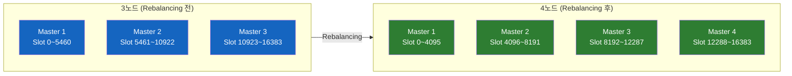
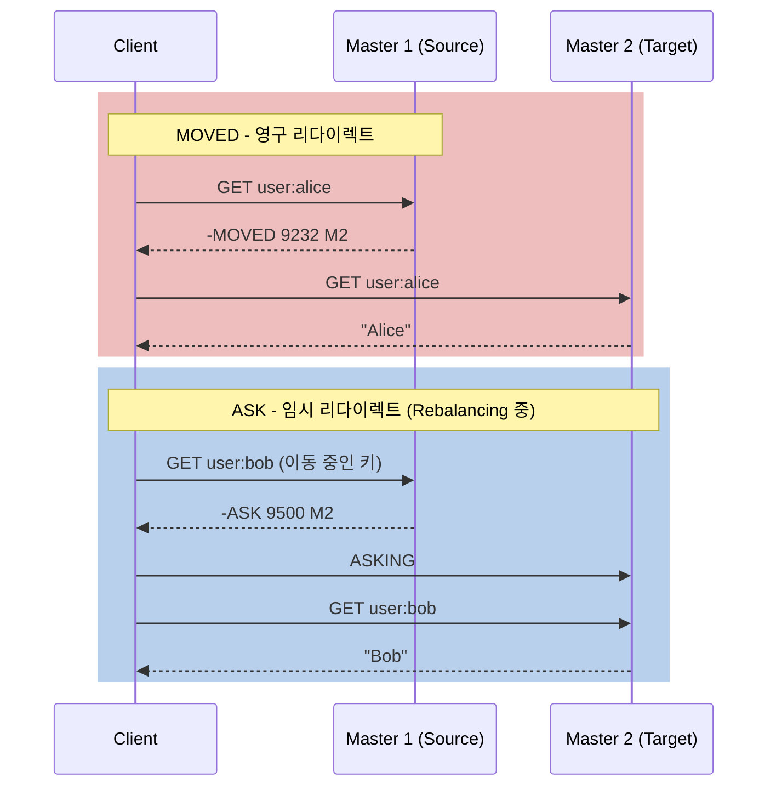
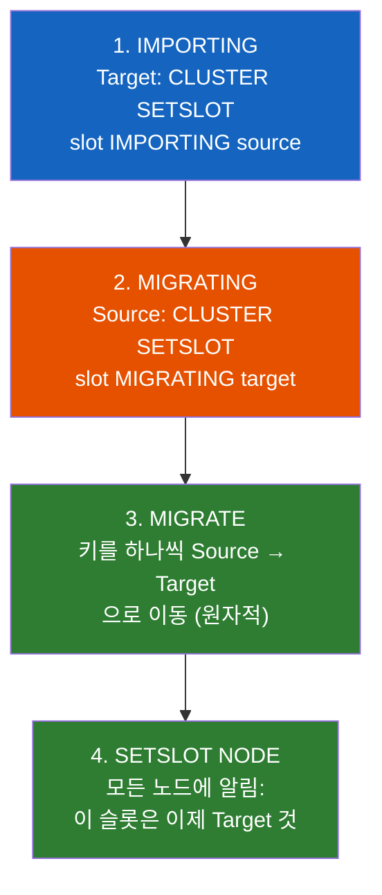
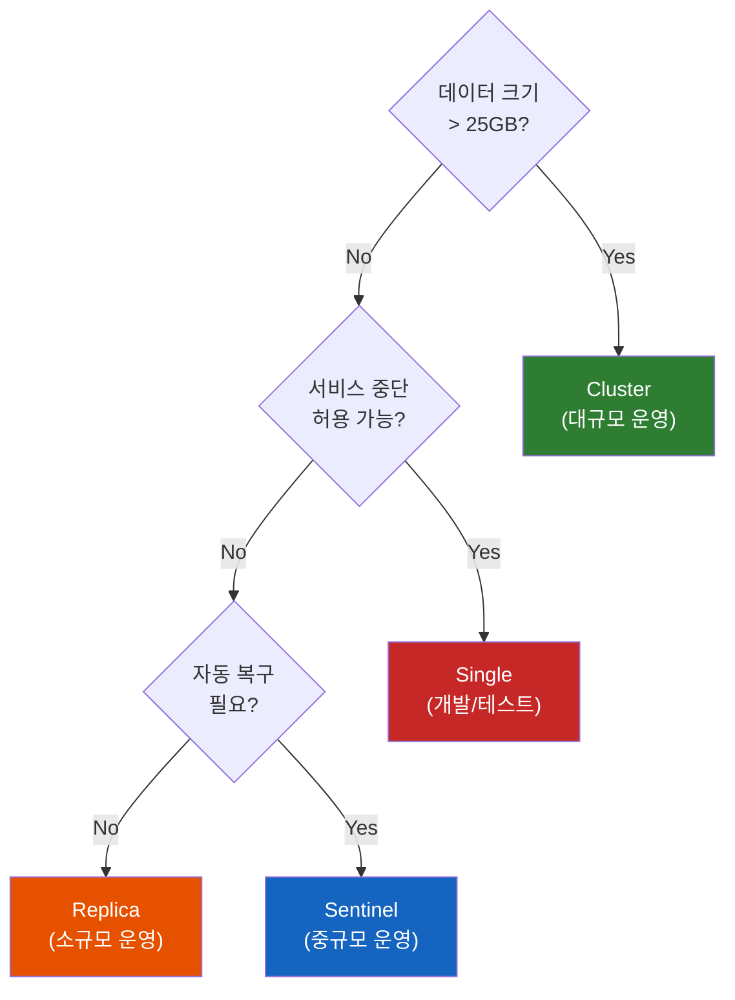

# Redis Cluster의 내부 동작과 Hash Slot Rebalancing

Redis Cluster에 새 노드를 추가하면 데이터는 어떻게 이동할까? 기존 노드를 제거하면 그 노드가 가진 데이터는? Hash Slot이라는 개념이 이 모든 것을 가능하게 하는데, 그 내부 동작을 이해하면 Cluster 운영이 두렵지 않게 된다.

## 결론부터 말하면

Redis Cluster는 **16,384개의 Hash Slot** 으로 키 공간을 나누고, 각 Master 노드가 슬롯의 일부를 담당한다. 노드를 추가/제거할 때는 **Slot을 이동(Rebalancing)** 하여 데이터를 재분배한다. 이 과정은 **서비스 중단 없이(온라인)** 이루어지며, `redis-cli --cluster` 도구로 자동화할 수 있다.



## 1. Hash Slot의 내부 동작

### 1.1 키는 어떻게 노드에 매핑되는가?

클라이언트가 `GET user:alice`를 실행하면, Redis Cluster는 이 키가 **어떤 노드** 에 있는지 알아야 한다. 이때 사용하는 것이 **Hash Slot** 이다.

$$\text{slot} = \text{CRC16}(\text{key}) \mod 16384$$

`user:alice`의 CRC16 값이 42,000이라면, $42000 \mod 16384 = 9232$이므로 슬롯 9232를 담당하는 노드로 요청이 라우팅된다. 3개 Master가 슬롯을 균등하게 나눈다면 슬롯 5461~10922를 담당하는 Master 2가 이 키를 보관하고 있다.

### 1.2 잘못된 노드에 요청하면? — MOVED와 ASK

클라이언트가 실수로 (또는 캐시된 라우팅 정보가 오래되어) 잘못된 노드에 요청을 보내면, Redis는 **MOVED** 리다이렉트를 반환한다.

```bash
# Master 1에 요청했지만 이 키는 Master 2에 있음
GET user:alice
# -MOVED 9232 192.168.1.11:6379
# "슬롯 9232는 192.168.1.11:6379에 있으니 거기로 가라"
```

**MOVED** 는 "영구적으로 그 노드가 담당한다"는 의미다. 클라이언트는 라우팅 테이블을 업데이트하고 이후에는 바로 올바른 노드로 요청한다.

반면 **ASK** 은 Rebalancing 중에 발생한다. "이 키는 지금 이동 중이니, **이번에만** 저쪽 노드에 물어봐라"는 의미다. 라우팅 테이블은 업데이트하지 않는다.



### 1.3 Gossip 프로토콜 — 노드 간 통신

Cluster의 노드들은 **Gossip 프로토콜** 로 서로의 상태를 교환한다. 각 노드는 **Cluster Bus** (데이터 포트 + 10000, 예: 6379 → 16379)를 통해 주기적으로 다른 노드에 heartbeat를 보낸다.

| 항목 | 설명 |
|------|------|
| Heartbeat 주기 | 매초 무작위로 몇 개 노드에 PING 전송 |
| 장애 감지 | `cluster-node-timeout`(기본 15초) 내 응답 없으면 PFAIL |
| 장애 확정 | 과반수 노드가 PFAIL에 동의하면 FAIL → Replica 자동 승격 |
| 정보 교환 | 슬롯 배치, 노드 상태, config epoch |

## 2. Hash Slot Rebalancing — 슬롯을 재분배하라

### 2.1 왜 Rebalancing이 필요한가?

**노드 추가 시:** 새 Master를 추가하면 처음에는 슬롯이 0개다. 기존 노드에서 슬롯을 일부 가져와야 데이터를 분담할 수 있다.

**노드 제거 시:** 제거할 노드의 슬롯을 다른 노드로 모두 옮긴 후에야 안전하게 제거할 수 있다.

**불균형 시:** 특정 노드에 슬롯이 편중되어 있으면 해당 노드만 과부하가 걸린다.

### 2.2 자동 Rebalancing

가장 간단한 방법은 `redis-cli --cluster rebalance`를 사용하는 것이다. 모든 Master에 슬롯을 균등하게 재분배한다.

```bash
# 현재 Cluster 상태 확인
redis-cli --cluster check 192.168.1.10:6379

# 자동 Rebalancing (모든 Master에 균등 분배)
redis-cli --cluster rebalance 192.168.1.10:6379

# 새로 추가한 빈 Master도 포함하여 Rebalancing
redis-cli --cluster rebalance 192.168.1.10:6379 --cluster-use-empty-masters
```

### 2.3 수동 Resharding

특정 슬롯만 이동하고 싶다면 `reshard`를 사용한다.

```bash
# 수동 Resharding: 특정 노드에서 다른 노드로 슬롯 이동
redis-cli --cluster reshard 192.168.1.10:6379 \
    --cluster-from <source-node-id> \
    --cluster-to <target-node-id> \
    --cluster-slots 4096 \
    --cluster-yes
# source에서 target으로 4,096개 슬롯 이동
```

### 2.4 Slot Migration의 내부 과정

하나의 슬롯이 노드 A에서 노드 B로 이동하는 과정은 4단계다.



**핵심:** 이 과정은 **온라인** 으로 이루어진다. 마이그레이션 중에도 클라이언트는 정상적으로 읽기/쓰기를 할 수 있다. Source 노드에 아직 있는 키는 Source에서 처리하고, 이미 Target으로 옮겨진 키는 ASK 리다이렉트를 통해 Target에서 처리한다.

## 3. 실전 환경 구성 가이드

### 3.1 최소 구성: 6노드 Cluster

프로덕션 Redis Cluster의 최소 구성은 **3 Master + 3 Replica = 6노드** 다.

```bash
# 6개 Redis 인스턴스 시작 (포트 7000~7005)
for port in 7000 7001 7002 7003 7004 7005; do
    redis-server --port $port \
        --cluster-enabled yes \
        --cluster-config-file nodes-${port}.conf \
        --cluster-node-timeout 15000 \
        --appendonly yes &
done

# Cluster 생성 (Master 3 + Replica 3)
redis-cli --cluster create \
    127.0.0.1:7000 127.0.0.1:7001 127.0.0.1:7002 \
    127.0.0.1:7003 127.0.0.1:7004 127.0.0.1:7005 \
    --cluster-replicas 1
```

`--cluster-replicas 1`은 각 Master마다 Replica 1개를 자동으로 배치한다.

### 3.2 노드 추가/제거

```bash
# 새 Master 추가
redis-cli --cluster add-node 127.0.0.1:7006 127.0.0.1:7000

# 새 Replica 추가 (특정 Master의 Replica로)
redis-cli --cluster add-node 127.0.0.1:7007 127.0.0.1:7000 \
    --cluster-slave \
    --cluster-master-id <master-node-id>

# 노드 제거 (먼저 슬롯을 모두 옮긴 후)
redis-cli --cluster del-node 127.0.0.1:7000 <node-id>
```

> **주의:** 노드를 제거하기 전에 반드시 해당 노드의 **모든 슬롯을 다른 노드로 reshard** 해야 한다. 슬롯이 남아있는 상태에서 노드를 제거하면 데이터가 유실된다.

### 3.3 4가지 아키텍처 실전 선택 기준

마지막으로, 강의 전체를 관통하는 4가지 아키텍처의 **실전 선택 기준** 을 정리한다.

| 기준 | Single | Replica | Sentinel | Cluster |
|------|--------|---------|----------|---------|
| **최소 노드** | 1 | 2 | 5 (2 Redis + 3 Sentinel) | 6 (3M + 3R) |
| **HA** | X | 수동 Failover | **자동 Failover** | **자동 Failover** |
| **수평 확장** | X | X | X | **O (샤딩)** |
| **메모리 한계** | 1대 | 1대 (Master) | 1대 (Master) | **N대 분산** |
| **Multi-key** | O | O | O | **제한적** (같은 슬롯만) |
| **운영 복잡도** | 매우 낮음 | 낮음 | 중간 | 높음 |
| **적합 데이터** | < 1GB | < 10GB | < 25GB | **25GB+** |

**실무 의사결정 흐름:**



> 대부분의 스타트업과 중소규모 서비스는 **Sentinel** 로 충분하다. Cluster는 데이터가 단일 노드 메모리를 초과하거나, 쓰기 트래픽을 여러 Master로 분산해야 할 때 비로소 필요하다. "멋있어 보여서" Cluster를 도입하면 운영 복잡도만 올라갈 뿐이다.

## 4. 정리

### 핵심 포인트

1. **Hash Slot은 키와 노드를 연결하는 중간 계층이다**
   - $\text{CRC16}(\text{key}) \mod 16384$로 슬롯 결정
   - MOVED(영구)와 ASK(임시) 리다이렉트로 올바른 노드 안내
   - Gossip 프로토콜로 노드 간 상태 교환 및 장애 감지

2. **Rebalancing은 온라인으로 수행된다**
   - `redis-cli --cluster rebalance`로 자동 균등 분배
   - IMPORTING → MIGRATING → MIGRATE → SETSLOT NODE 4단계
   - 서비스 중단 없이 슬롯과 데이터를 이동

3. **아키텍처 선택은 "필요한 만큼만" 이 원칙이다**
   - Single → Replica → Sentinel → Cluster 순으로 복잡도 증가
   - 대부분의 서비스는 Sentinel로 충분하며, Cluster는 데이터 > 25GB 또는 쓰기 분산이 필요할 때만

---

## 출처

- [Redis Documentation - Cluster Specification](https://redis.io/docs/latest/operate/oss_and_stack/reference/cluster-spec/) - Cluster 스펙 공식 문서
- [Redis Documentation - CLUSTER SETSLOT](https://redis.io/docs/latest/commands/cluster-setslot/) - 슬롯 마이그레이션 공식 문서
- [Hash Slot Resharding and Rebalancing for Redis Cluster](https://severalnines.com/blog/hash-slot-resharding-and-rebalancing-redis-cluster/) - Rebalancing 실전 가이드
- [Why We Moved from Redis Sentinel to a 9-Node Redis Cluster](https://medium.com/@soumya-rout/why-we-moved-from-redis-sentinel-to-a-9-node-redis-cluster-588907c5e4d2) - Sentinel → Cluster 전환 사례
