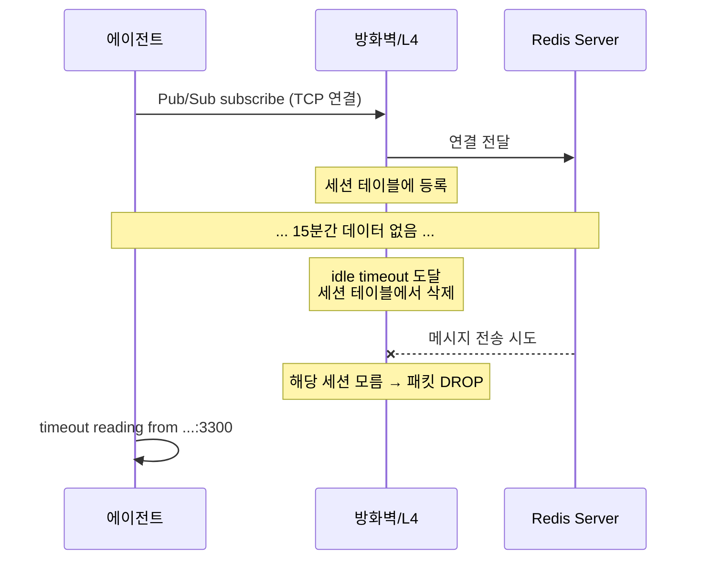

# Redis Pub/Sub이 폐쇄망에서 죽는 이유

`socket_keepalive=True`만 설정했는데 왜 Pub/Sub 연결이 끊길까? OS 기본값의 함정과 방화벽 idle timeout의 관계를 알아본다.

## 결론부터 말하면

Redis Pub/Sub은 **persistent connection** 이다. 메시지가 올 때까지 아무 데이터도 주고받지 않는다. 폐쇄망의 방화벽(L4 스위치)은 일정 시간 데이터가 없는 연결을 "죽은 연결"로 판단하고 **세션 테이블에서 삭제** 한다. `socket_keepalive=True`만으로는 OS 기본 keepalive 간격(Linux 7200초 = 2시간)이 적용되어, 방화벽 idle timeout(10~30분)보다 훨씬 길기 때문에 사실상 무용지물이다.



## 1. 왜 로컬에서는 되는데 폐쇄망에서만 안 될까?

이 문제의 핵심은 **중간에 네트워크 장비가 있느냐 없느냐** 다.

로컬 개발 환경에서는 에이전트와 Redis가 같은 머신이거나 같은 네트워크에 있다. 중간에 방화벽이 없으니 TCP 연결이 아무리 오래 idle 상태여도 끊기지 않는다. 그래서 `listen()`이 조용히 메시지를 기다리고 있어도 아무 문제가 없다.

하지만 폐쇄망 환경에서는 다르다. 에이전트와 Redis 사이에 **L4 스위치, 방화벽** 같은 네트워크 장비가 존재한다. 이 장비들은 모든 TCP 연결을 세션 테이블로 관리하는데, 메모리가 유한하기 때문에 일정 시간 트래픽이 없는 연결은 자동으로 정리한다. 보통 그 기준이 10~30분이다.

문제는 **양쪽 다 모른다** 는 것이다. Redis 서버는 클라이언트가 아직 연결되어 있다고 생각하고, 클라이언트도 연결이 살아있다고 생각한다. 하지만 중간의 방화벽이 이미 세션을 지워버렸기 때문에, 다음 패킷이 오가는 순간 timeout이 발생한다.

## 2. `socket_keepalive=True`의 함정

redis-py의 `socket_keepalive`는 **기본값이 `False`** 라서, 명시적으로 `True`로 켜지 않으면 TCP keepalive가 아예 꺼져 있다. `True`로 설정하면 keepalive가 활성화된다. 여기까지는 맞다. 그런데 **간격은 얼마인가?**

`socket_keepalive_options`를 명시하지 않으면 OS 기본값이 적용된다.

| OS | 기본 `TCP_KEEPIDLE` | 의미 |
|---|---|---|
| Linux | **7200초 (2시간)** | 2시간 후에야 첫 keepalive 패킷 전송 |
| macOS | **7200초 (2시간)** | 동일 |

방화벽 idle timeout이 15분이라면? 2시간 뒤에 keepalive를 보내봐야 이미 1시간 45분 전에 연결은 끊겨있다. `socket_keepalive=True`는 **스위치만 켠 것** 이고, `socket_keepalive_options`로 간격을 줄여야 실질적 효과가 있다.

## 3. 해결: 세 가지 설정의 역할

같은 프로젝트의 mcp-server 패키지에서는 이미 이 문제를 해결해두고 있었다. 핵심 설정 세 가지를 비교하면:

| 설정 | 레벨 | 역할 | 값 |
|---|---|---|---|
| `socket_keepalive_options` | TCP (커널) | OS에게 "이 간격으로 keepalive 보내라" 지시 | `TCP_KEEPIDLE: 30` |
| `health_check_interval` | Application | redis-py가 명령 실행 시점에 `PING`으로 헬스 체크 | `120`초 |
| `retry` + `retry_on_error` | Application | timeout 시 지수 백오프로 재시도 (redis-py 6.0+) | `Retry(ExponentialBackoff(), retries=3)`, `[TimeoutError]` |

**이 중 실질적인 방어선은 TCP keepalive다.** `health_check_interval`은 redis-py가 `parse_response()`에 진입하는 시점이나 `get_message(timeout=1.0)` 같은 non-blocking 폴링 루프에서만 PING을 트리거한다. Pub/Sub이 `listen()`으로 블로킹 상태에 들어가면 메시지가 올 때까지 소켓 읽기에 막혀 있어서, 120초가 지나도 주기적 PING이 저절로 나가지 않는다. 방화벽 idle timeout을 실질적으로 막는 건 **커널 레벨 TCP keepalive**이고, `health_check_interval`은 non-blocking 루프 구조에서 보조 방어선으로 동작한다. 두 계층은 역할이 다르다 — TCP keepalive는 **네트워크 경로(방화벽 세션)** 를 보존하고, PING은 **Redis 프로세스의 애플리케이션 가용성** 을 확인한다.

```python
import platform
import socket

from redis.backoff import ExponentialBackoff
from redis.exceptions import TimeoutError as RedisTimeoutError
from redis.retry import Retry

_KEEPALIVE = {
    "socket_keepalive": True,
    "socket_keepalive_options": (
        {socket.TCP_KEEPALIVE: 30}
        if platform.system() == "Darwin"
        else {socket.TCP_KEEPIDLE: 30, socket.TCP_KEEPINTVL: 15}
    ),
    # redis-py 6.0+ 권장 방식. 기존 `retry_on_timeout=True`는 deprecated.
    "retry": Retry(ExponentialBackoff(), retries=3),
    "retry_on_error": [RedisTimeoutError],
    "health_check_interval": 120,
}

# 사용: redis.Redis(..., **_KEEPALIVE)
```

OS별로 소켓 상수가 다르다는 점도 주의해야 한다. macOS는 `TCP_KEEPALIVE`, Linux는 `TCP_KEEPIDLE` + `TCP_KEEPINTVL`을 사용한다.

적용 후 타임라인을 보면 방화벽이 연결을 끊을 틈이 없다.

```
0초     30초     60초     90초     120초    150초
|--------|--------|--------|--------|--------|--------→
    keepalive  keepalive  keepalive   PING   keepalive
                                  (health_check)
```

## 4. 정리

| 핵심 | 설명 |
|---|---|
| 원인 | 방화벽 idle timeout < OS keepalive 기본값(2시간) |
| 증상 | `timeout reading from ...` 후 Pub/Sub watcher 영구 종료 |
| 해결 | `socket_keepalive_options`로 30초 간격 keepalive + `health_check_interval`로 PING |
| 교훈 | `socket_keepalive=True`만으로는 부족. **options로 간격을 명시해야 실효성 있음** |

이 문제는 Redis Pub/Sub뿐 아니라, WebSocket이나 gRPC 스트리밍 같은 **long-lived connection** 을 사용하는 모든 서비스에서 동일하게 발생할 수 있다. 폐쇄망이나 클라우드 환경(AWS NLB idle timeout 350초)에서 persistent connection을 쓴다면, keepalive 설정은 반드시 확인하자.

---

## 출처

- [redis-py 공식 문서 - Connection](https://redis-py.readthedocs.io/en/stable/connections.html)
- [Linux TCP keepalive HOWTO](https://tldp.org/HOWTO/TCP-Keepalive-HOWTO/overview.html)
