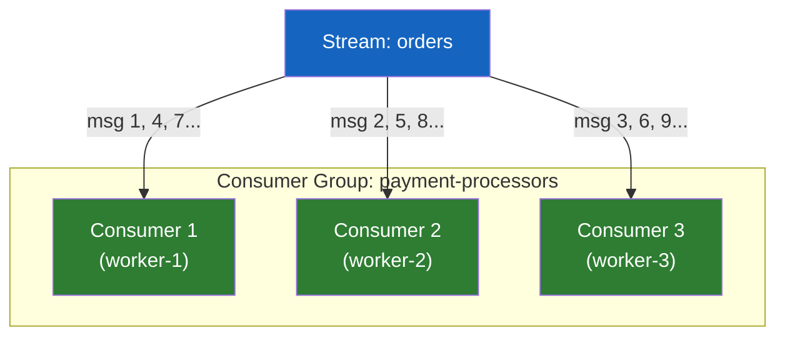
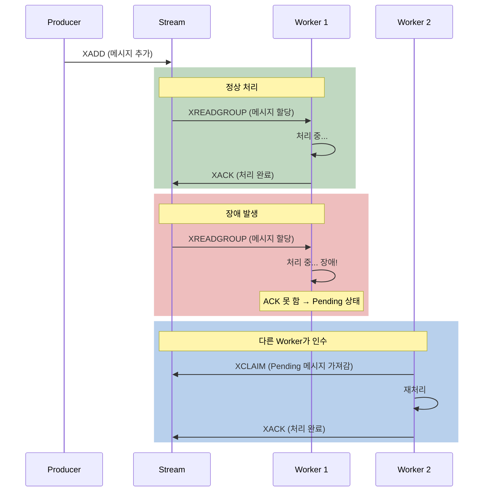

# Redis Stream - Pub/Sub의 한계를 넘어선 영속적 메시징

Pub/Sub으로 주문 이벤트를 발행했는데, 결제 서비스가 30초간 다운되어 있었다면? 그 30초 동안의 주문은 영원히 사라진다. 이 문제를 Redis 안에서 해결할 수 있다면?

## 결론부터 말하면

**Redis Stream** 은 Pub/Sub의 3가지 한계(비영속, ACK 없음, 재처리 불가)를 해결하는 **영속적 메시지 로그** 자료구조다. Kafka의 Consumer Group과 유사한 **분산 처리** 를 지원하면서도, Redis의 단순함을 유지한다. 이미 Redis를 사용하고 있다면, 간단한 이벤트 스트리밍에 Kafka 대신 Stream을 고려할 수 있다.

| 특성 | Pub/Sub | **Stream** |
|------|---------|-----------|
| 메시지 영속성 | X (Fire-and-Forget) | **O (디스크에 저장)** |
| 소비자 부재 시 | 유실 | **보관 (나중에 소비 가능)** |
| ACK (처리 확인) | X | **O (XACK)** |
| 메시지 재처리 | X | **O (ID로 재조회)** |
| Consumer Group | X | **O (분산 처리)** |
| 메시지 순서 보장 | X (순서 불확정) | **O (ID 기반 정렬)** |

## 1. 왜 Pub/Sub으로는 부족한가?

Pub/Sub은 **Fire-and-Forget** 이다. 이벤트를 발행하는 순간 소비자가 받아야 하고, 못 받으면 끝이다. 실시간 알림에는 적합하지만, **비즈니스 크리티컬한 이벤트** 에는 위험하다.

구체적으로 세 가지 문제가 있다.

**첫째, 소비자가 다운되면 메시지가 유실된다.** 결제 서비스가 배포 중이라 30초간 꺼져있었다면, 그 30초 동안 발행된 주문 이벤트는 영원히 사라진다.

**둘째, 처리 확인(ACK)이 없다.** 소비자가 메시지를 받긴 했는데, 처리 도중 에러가 나서 실패했다면? Pub/Sub은 메시지가 전달되었는지만 알지, **처리되었는지는 모른다.**

**셋째, 재처리가 불가능하다.** 메시지가 저장되지 않으니, "어제 오후 3시의 이벤트를 다시 처리해줘"가 불가능하다.

Redis Stream은 이 세 가지를 모두 해결한다.

## 2. Redis Stream의 핵심 개념

### 2.1 Stream은 "append-only 로그"다

Stream은 **시간 순서로 정렬된 메시지의 영속적 로그** 다. 새 메시지는 항상 **끝에 추가(append)** 되고, 기존 메시지는 수정되지 않는다. 각 메시지에는 고유한 **ID** 가 자동 부여된다.

```bash
# 메시지 추가 (XADD)
XADD orders * userId "alice" product "MacBook" amount "2500000"
# "1711000001234-0"  ← 자동 생성 ID (밀리초 타임스탬프-시퀀스)

XADD orders * userId "bob" product "iPhone" amount "1500000"
# "1711000001235-0"

# 메시지 조회 (XRANGE)
XRANGE orders - +
# 1) 1711000001234-0: userId=alice, product=MacBook, amount=2500000
# 2) 1711000001235-0: userId=bob, product=iPhone, amount=1500000
```

ID 형식은 `<밀리초 타임스탬프>-<시퀀스>` 다. 같은 밀리초에 여러 메시지가 들어오면 시퀀스가 증가한다. 이 ID 덕분에 **시간 기반 범위 조회** 가 가능하다.

```bash
# 특정 시간 범위의 메시지 조회
XRANGE orders 1711000001234 1711000001235

# 최근 10개 메시지 (역순)
XREVRANGE orders + - COUNT 10
```

### 2.2 XREAD — 메시지 읽기 (단순 소비)

`XREAD`는 Stream에서 메시지를 읽는 가장 기본적인 방법이다. 특정 ID 이후의 새 메시지를 가져온다.

```bash
# 특정 ID 이후 메시지 읽기
XREAD COUNT 10 STREAMS orders 1711000001234-0
# 1711000001234-0 이후의 메시지 최대 10개 반환

# 새 메시지 대기 (블로킹) — BLPOP과 유사
XREAD BLOCK 5000 COUNT 10 STREAMS orders $
# $: "지금부터 새로 들어오는 메시지만"
# 5초간 대기, 새 메시지가 오면 즉시 반환
```

`$`는 "현재 시점 이후"를 의미한다. `BLOCK`을 사용하면 폴링 없이 새 메시지를 대기할 수 있다.

### 2.3 Consumer Group — 분산 처리의 핵심

여기서부터가 Stream의 진짜 힘이다. **Consumer Group** 은 여러 소비자가 하나의 Stream을 **분담하여 처리** 할 수 있게 한다. Kafka의 Consumer Group과 동일한 개념이다.



**핵심:** 같은 Consumer Group 내의 소비자들은 메시지를 **중복 없이 나눠서** 받는다. 메시지 1은 worker-1이, 메시지 2는 worker-2가, 메시지 3은 worker-3이 처리한다. 소비자를 늘리면 처리량이 선형으로 증가한다.

```bash
# 1. Consumer Group 생성
XGROUP CREATE orders payment-processors $ MKSTREAM
# $: 지금부터 새 메시지만 / 0: 처음부터 모든 메시지

# 2. Consumer Group으로 메시지 읽기
XREADGROUP GROUP payment-processors worker-1 COUNT 5 BLOCK 2000 STREAMS orders >
# >: 아직 이 그룹에서 처리하지 않은 새 메시지만
# worker-1에게 최대 5개 메시지 할당

# 3. 처리 완료 확인 (ACK)
XACK orders payment-processors 1711000001234-0
# "이 메시지는 정상 처리 완료"
```

### 2.4 ACK과 Pending — 미처리 메시지 관리

`XACK`은 Pub/Sub에 없는 **처리 확인** 메커니즘이다. ACK하지 않은 메시지는 **Pending 상태** 로 남아있어, 장애 시 다른 소비자가 재처리할 수 있다.

```bash
# Pending(미처리) 메시지 확인
XPENDING orders payment-processors
# 1) (integer) 3          ← 미처리 메시지 3개
# 2) 1711000001234-0      ← 가장 오래된 미처리 ID
# 3) 1711000001236-0      ← 가장 최근 미처리 ID
# 4) 1) worker-1: 2개
#    2) worker-2: 1개

# 장애난 worker-1의 메시지를 worker-3이 가져가서 재처리
XCLAIM orders payment-processors worker-3 30000 1711000001234-0
# 30000ms(30초) 이상 Pending 상태인 메시지를 worker-3에게 이전
```

이 흐름을 정리하면:



### 2.5 Stream 크기 관리

Stream은 영속적이므로 메시지가 계속 쌓인다. 크기를 관리하지 않으면 메모리가 고갈된다.

```bash
# 방법 1: XADD 시 최대 길이 제한
XADD orders MAXLEN ~ 10000 * userId "alice" product "MacBook"
# ~ (근사): 정확히 10,000이 아닌 "대략 10,000" — 성능 효율적

# 방법 2: ID 기반 삭제 (특정 시점 이전 삭제)
XADD orders MINID ~ 1711000000000-0 * userId "bob" product "iPhone"
# 특정 ID 이전의 모든 메시지 삭제

# 방법 3: 수동 트리밍
XTRIM orders MAXLEN ~ 5000
```

`~`(틸드)를 사용하면 Redis가 **성능 최적화를 위해 약간의 여유** 를 두고 삭제한다. 정확한 개수가 중요하지 않은 대부분의 경우 `~`를 사용하는 것이 좋다.

## 3. Pub/Sub vs Stream vs Kafka — 언제 무엇을 쓸까?

| 기준 | Pub/Sub | Stream | Kafka |
|------|---------|--------|-------|
| 메시지 영속성 | X | O | O |
| 처리 확인(ACK) | X | O | O |
| Consumer Group | X | O | O |
| 처리량 | 높음 | 높음 | **매우 높음** |
| 운영 복잡도 | 낮음 | 낮음 | **높음** |
| 별도 인프라 | X (Redis 내장) | X (Redis 내장) | **O (Kafka 클러스터)** |
| 적합 상황 | 실시간 알림 | 중규모 이벤트 | 대규모 이벤트 스트리밍 |

**선택 기준:**
- 메시지 유실 OK + 실시간 → **Pub/Sub**
- 메시지 유실 NO + 이미 Redis 사용 중 → **Stream**
- 대규모 이벤트 스트리밍 + 다중 소비자 + 높은 처리량 → **Kafka**

> Redis Stream은 **Kafka를 대체하는 것이 아니라**, Kafka가 필요하지 않은 규모에서 **Kafka를 도입하지 않아도 되게** 해주는 것이다. 이미 Redis가 있다면 추가 인프라 없이 바로 사용할 수 있다는 것이 가장 큰 장점이다.

## 4. 정리

### 핵심 포인트

1. **Stream은 Pub/Sub의 3가지 한계를 해결한다**
   - 메시지 영속성: 소비자가 없어도 메시지 보관
   - ACK: 처리 완료 확인, 미처리 메시지 재전달 가능
   - Consumer Group: 여러 소비자가 메시지를 분담 처리

2. **Consumer Group + XACK + XCLAIM이 안정성의 핵심이다**
   - 같은 그룹 내 소비자는 메시지를 중복 없이 나눠 받는다
   - ACK하지 않은 메시지는 Pending 상태로 남아 재처리 가능
   - XCLAIM으로 장애난 소비자의 메시지를 다른 소비자가 인수

3. **Stream은 Kafka의 대체가 아니라 "경량 대안"이다**
   - Kafka가 필요 없는 규모에서 추가 인프라 없이 사용 가능
   - 이미 Redis가 있다면 Stream만으로 충분한 이벤트 드리븐 구현 가능

---

## 출처

- [Redis Documentation - Streams](https://redis.io/docs/latest/develop/data-types/streams/) - Stream 공식 문서
- [Redis Documentation - XADD](https://redis.io/docs/latest/commands/xadd/) - XADD 공식 문서
- [Redis Documentation - XREADGROUP](https://redis.io/docs/latest/commands/xreadgroup/) - Consumer Group 공식 문서
- [Redis Pub/Sub vs Streams: When to Choose (2026)](https://oneuptime.com/blog/post/2026-01-25-redis-pubsub-vs-streams/view) - Pub/Sub vs Stream 비교
- [Beyond the Hype: Why We Chose Redis Streams Over Kafka](https://dev.to/mtk3d/beyond-the-hype-why-we-chose-redis-streams-over-kafka-for-our-microservices-dmc) - Kafka vs Stream 실전 사례
