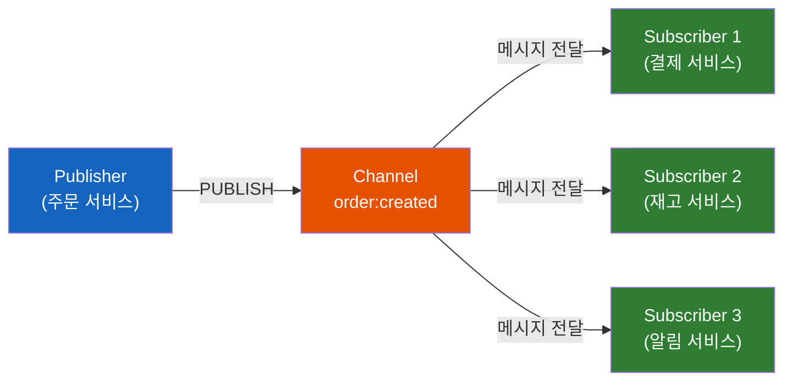
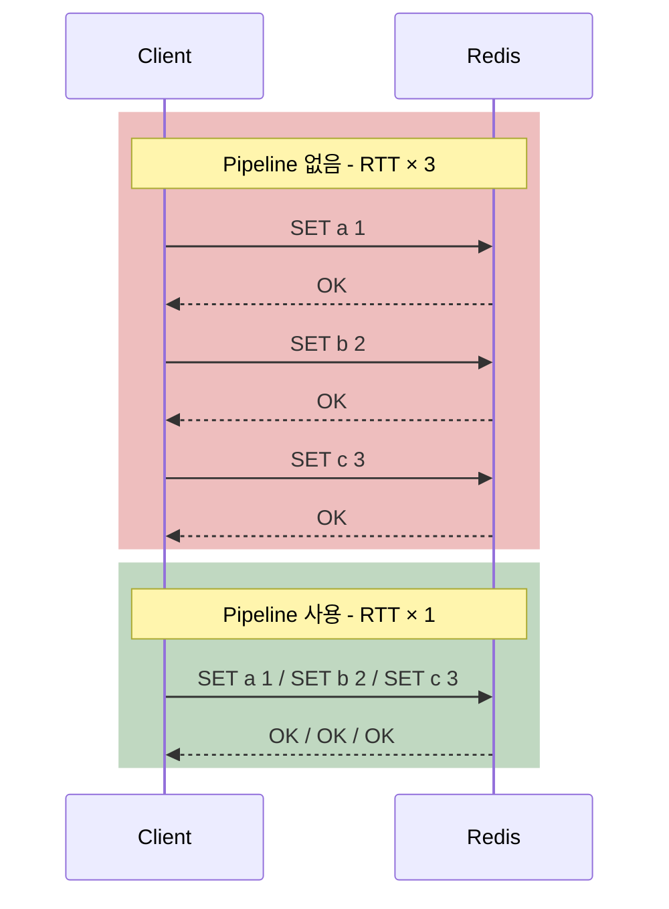

# Redis 고급 실행 패턴 - Pub/Sub부터 Lua Script까지

Redis에서 `SET`과 `GET`으로 단순 캐싱을 하는 것은 Redis의 10%만 쓰는 것이다. 이벤트를 브로드캐스트하고, 여러 명령을 한 번에 원자적으로 실행하고, 네트워크 왕복을 줄이고, 복잡한 비즈니스 로직을 서버에서 직접 실행하는 것 — 이것들이 Redis를 "전문가처럼" 쓰는 방법이다.

## 결론부터 말하면

Redis의 고급 실행 패턴은 **4가지** 다. 각각은 서로 다른 문제를 해결하며, **Pub/Sub → Transaction → Pipeline → Lua Script** 순으로 점점 강력해진다. 핵심 선택 기준은 **"원자성이 필요한가"** 와 **"중간 값이 필요한가"** 두 가지다.

| 패턴 | 원자성 | 중간 값 사용 | RTT | 주요 용도 |
|------|--------|-------------|-----|----------|
| **Pub/Sub** | - | - | - | 실시간 이벤트 브로드캐스트 |
| **Transaction** | O | **X** | N+2 | 명령 묶음의 격리 실행 |
| **Pipeline** | **X** | **X** | **1** | 네트워크 왕복 최소화 |
| **Lua Script** | **O** | **O** | **1** | 복잡한 원자적 로직 |

## 1. Pub/Sub — Fire-and-Forget 메시징

### 1.1 왜 Pub/Sub인가?

마이크로서비스 환경에서 서비스 A가 "주문이 생성되었다"는 이벤트를 다른 서비스들에 알려야 한다. 서비스 A가 서비스 B, C, D를 직접 호출하면 **강결합(Tight Coupling)** 이 된다. 서비스 D가 추가되면 A의 코드를 수정해야 한다.

**Pub/Sub** 은 발행자(Publisher)와 구독자(Subscriber)가 **서로의 존재를 모르는** 완전한 **느슨한 결합(Loose Coupling)** 을 제공한다. 발행자는 채널에 메시지를 보내고, 구독자는 관심 있는 채널을 구독할 뿐이다.



### 1.2 핵심 명령어

```bash
# 터미널 1: 구독
SUBSCRIBE order:created
# 대기 상태... 메시지가 오면 자동 수신

# 터미널 2: 발행
PUBLISH order:created '{"orderId":123,"userId":"alice"}'
# (integer) 3  ← 3명의 구독자에게 전달됨

# 패턴 구독 (와일드카드)
PSUBSCRIBE order:*
# order:created, order:cancelled, order:shipped 등 모든 이벤트 수신
```

### 1.3 Pub/Sub의 핵심 한계: Fire-and-Forget

**Pub/Sub의 가장 중요한 특성은 "메시지를 저장하지 않는다"는 것이다.** 이것을 **Fire-and-Forget(쏘고 잊기)** 이라 부른다.

- 구독자가 **없으면** 메시지는 그냥 **사라진다**
- 구독자가 **연결이 끊겼다 다시 연결되면**, 끊어진 동안의 메시지는 **영원히 유실** 된다
- **확인(ACK) 메커니즘이 없다** — 구독자가 실제로 메시지를 처리했는지 알 수 없다

그래서 Pub/Sub은 **메시지 유실이 허용되는** 실시간 알림, 캐시 무효화, 채팅 등에 적합하다. 결제 처리나 주문 확인처럼 **절대 유실되면 안 되는** 메시지에는 적합하지 않다. 그런 경우에는 뒤에서 다룰 **Redis Stream** 이 더 적합하다.

> Java 개발자라면 Spring의 `ApplicationEventPublisher`와 비슷하다고 이해하면 된다. 인메모리 이벤트 발행이고, 애플리케이션이 죽으면 이벤트도 사라진다. 하지만 서비스 간 통신이 가능하다는 점에서 더 강력하다.

## 2. Transaction — MULTI/EXEC, 그런데 Rollback이 없다

### 2.1 Redis Transaction은 ACID를 보장할까?

결론부터 말하면, **부분적으로만 보장한다.** 그리고 이것이 Redis Transaction의 가장 중요한 특성이다.

| ACID | Redis | 설명 |
|------|-------|------|
| **A**(Atomicity) | **부분적** | EXEC 이전 에러는 전체 취소, EXEC 이후 런타임 에러는 실패한 명령만 스킵 (롤백 없음) |
| **C**(Consistency) | **X** | 런타임 에러 시 나머지 명령은 계속 실행됨 |
| **I**(Isolation) | **O** | 트랜잭션 중 다른 클라이언트 명령이 끼어들지 않음 |
| **D**(Durability) | **조건부** | 영속성 설정(RDB/AOF)에 따라 다름 |

> **"부분적 Atomicity"의 실제 의미:** Redis는 에러 시점을 두 단계로 구분한다.
>
> 1. **EXEC 이전 에러**(문법 오류, 존재하지 않는 명령 등) → Redis가 큐잉 단계에서 거부하고, `EXEC` 호출 시 **전체 트랜잭션을 `EXECABORT`로 취소**한다. 아무 명령도 실행되지 않는다.
> 2. **EXEC 이후 런타임 에러**(String 키에 `INCR` 같은 타입 불일치 등) → 실패한 명령만 에러 응답으로 보고되고, **나머지 명령은 정상적으로 계속 실행**된다. 아래의 `INCR user:123:name` 예시가 이 경우다.
>
> "롤백이 없다"는 말은 정확히 이 두 번째 경우를 가리킨다.

### 2.2 가장 위험한 특성: Rollback이 없다

RDBMS에서는 트랜잭션 중 오류가 발생하면 **전체가 롤백** 된다. 하지만 Redis는 다르다. 명령 하나가 실패해도 **나머지 명령은 계속 실행된다.**

```bash
MULTI
SET user:123:name "Alice"          # ✅ 성공
INCR user:123:name                 # ❌ 실패 (String에 INCR 불가)
SET user:123:email "alice@ex.com"  # ✅ 성공 (계속 실행됨!)
EXEC
# 결과: ["OK", "ERR wrong type", "OK"]
# name은 "Alice", email은 "alice@ex.com" — 부분 성공 상태
```

**왜 Redis는 롤백을 지원하지 않을까?** Redis 공식 입장은 명확하다: "Redis 명령은 문법이 틀렸거나, 잘못된 타입에 대해 실행했을 때만 실패한다. 이것은 프로그래밍 오류이지 런타임 조건이 아니다. 프로그래밍 오류는 개발 단계에서 잡아야 한다." 롤백 메커니즘을 추가하면 Redis의 **단순성과 성능이라는 핵심 가치를 훼손** 하기 때문이다.

### 2.3 WATCH — 낙관적 잠금(Optimistic Locking)

Transaction만으로는 "현재 값을 읽고, 그 값에 따라 쓰기"를 할 수 없다. 명령이 **큐에 쌓이기만 하고 실행되지 않기** 때문에 중간 값을 볼 수 없다.

`WATCH`는 이 문제를 **낙관적 잠금** 으로 해결한다. "이 키를 감시하다가, EXEC 시점에 누군가 변경했으면 트랜잭션 전체를 취소해라."

```bash
WATCH balance:alice
# 현재 잔액 확인
GET balance:alice    # "1000"

MULTI
DECRBY balance:alice 500
INCRBY balance:bob 500
EXEC
# 누군가 WATCH 이후 balance:alice를 수정했으면 → nil (취소)
# 아무도 수정하지 않았으면 → [(integer) 500, (integer) 500] (성공)
# ↑ DECRBY/INCRBY는 변경 후 정수 값을 반환한다 (OK 아님)
```

Java의 `CAS(Compare-And-Swap)` 또는 JPA의 `@Version` 낙관적 잠금과 같은 원리다. 충돌이 발생하면 재시도한다.

## 3. Pipeline — 네트워크 왕복을 줄여라

### 3.1 왜 Pipeline이 필요한가?

Redis 명령 하나의 실행 시간은 마이크로초 단위다. 하지만 네트워크 왕복(RTT)은 밀리초 단위다. 명령 100개를 하나씩 보내면, **99%의 시간이 네트워크 대기** 에 쓰인다.



Pipeline은 여러 명령을 **한꺼번에 보내고, 응답도 한꺼번에 받는다.** 네트워크 왕복이 1번으로 줄어든다.

### 3.2 Pipeline ≠ Transaction

여기서 흔히 혼동하는 부분이 있다. **Pipeline은 원자적이지 않다.** 다른 클라이언트의 명령이 Pipeline 명령 사이에 끼어들 수 있다. Pipeline은 순수하게 **네트워크 최적화** 일 뿐이다.

| 특성 | Transaction (MULTI/EXEC) | Pipeline |
|------|-------------------------|----------|
| 원자성 | O (격리 실행) | **X** (명령 사이에 다른 명령 끼어들 수 있음) |
| 네트워크 왕복 | 명령 수 + 2 (MULTI, EXEC) | **1** |
| 용도 | 명령 묶음의 격리 | 성능 최적화 |
| 중간 값 사용 | X | X |

**원자성도 필요하고 성능도 필요하면?** Pipeline 안에 Transaction을 넣으면 된다.

```python
# Python (redis-py) — Pipeline + Transaction
pipe = r.pipeline(transaction=True)  # transaction=True가 기본값
pipe.set("a", 1)
pipe.set("b", 2)
pipe.set("c", 3)
pipe.execute()
# 내부적으로: MULTI → SET a 1 → SET b 2 → SET c 3 → EXEC
# 하나의 RTT로 전송 + 원자적 실행
```

### 3.3 Pipeline 사용 시 주의사항

Pipeline에 넣는 명령이 너무 많으면, 서버 메모리에 모든 응답이 쌓인다. 명령 10만 개를 한 Pipeline에 넣으면 응답 10만 개가 메모리에 쌓인 후 한꺼번에 전달된다. **1,000~10,000개 단위** 로 나눠서 보내는 것이 적절하다.

## 4. Lua Script — Transaction과 Pipeline의 상위 호환

### 4.1 왜 Lua Script가 필요한가?

Transaction과 Pipeline에는 공통된 한계가 있다. **중간 값을 사용할 수 없다.** "A 키의 값을 읽고, 그 값이 100 이상이면 B 키를 업데이트한다" 같은 로직을 Transaction으로는 구현할 수 없다. 명령이 큐에 쌓이기만 하고 실행되지 않으니까.

WATCH로 낙관적 잠금을 쓸 수는 있지만, 충돌 시 재시도 로직이 필요하고, 충돌이 잦으면 성능이 떨어진다.

**Lua Script는 이 모든 문제를 한 번에 해결한다.**

| 특성 | Transaction | Pipeline | **Lua Script** |
|------|-----------|----------|---------------|
| 원자성 | O | X | **O** |
| 중간 값 사용 | X | X | **O** |
| 네트워크 왕복 | N+2 | 1 | **1** |
| 조건 분기 | X | X | **O** (if/else) |

### 4.2 EVAL — Lua Script 실행

```bash
# EVAL script numkeys key [key ...] arg [arg ...]

# 예: 재고 확인 후 차감 (원자적)
EVAL "
  local stock = tonumber(redis.call('GET', KEYS[1]))
  if stock >= tonumber(ARGV[1]) then
    redis.call('DECRBY', KEYS[1], ARGV[1])
    return stock - tonumber(ARGV[1])
  else
    return -1
  end
" 1 product:stock:123 3
# KEYS[1] = "product:stock:123", ARGV[1] = "3"
# 재고가 3개 이상이면 차감, 아니면 -1 반환
```

이 스크립트는 **원자적으로 실행** 된다. 재고 확인과 차감 사이에 다른 클라이언트가 끼어들 수 없다. WATCH + Transaction으로 같은 로직을 구현하면 충돌 시 재시도가 필요하지만, Lua Script는 그럴 필요가 없다.

### 4.3 EVALSHA — 스크립트 캐싱

매번 스크립트 전체를 전송하는 것은 비효율적이다. `SCRIPT LOAD`로 스크립트를 미리 등록하고, SHA1 해시로 실행할 수 있다.

```bash
# 1. 스크립트 등록
SCRIPT LOAD "return redis.call('GET', KEYS[1])"
# "e0e1f9fabfc9d4800c877a703b823ac0578ff831"

# 2. SHA로 실행 (스크립트 본문 전송 불필요)
EVALSHA "e0e1f9fabfc9d4800c877a703b823ac0578ff831" 1 mykey
```

### 4.4 Lua Script 주의사항

**Lua Script 실행 중에는 Redis가 블로킹된다.** Redis는 싱글 스레드이므로, Lua Script가 실행되는 동안 다른 모든 명령이 대기한다. 따라서 Lua Script는 **가능한 한 짧고 빠르게** 실행되어야 한다. 기본 타임아웃은 5초이며, `lua-time-limit`으로 조정할 수 있다.

**실무 원칙:**
- 단순 로직 (10줄 이내) → Lua Script 적합
- 복잡한 비즈니스 로직 → 애플리케이션 코드에서 처리
- 외부 I/O (HTTP 호출 등) → Lua에서 **절대 불가** (Redis가 멈춤)

### 4.5 실무 활용: Rate Limiter

Lua Script의 대표적 실무 활용 사례인 **Sliding Window Rate Limiter** 다.

```bash
EVAL "
  local key = KEYS[1]
  local limit = tonumber(ARGV[1])
  local window = tonumber(ARGV[2])
  local now = tonumber(ARGV[3])

  -- 윈도우 밖의 오래된 요청 제거
  redis.call('ZREMRANGEBYSCORE', key, 0, now - window)

  -- 현재 윈도우 내 요청 수 확인
  local count = redis.call('ZCARD', key)

  if count < limit then
    -- 허용: 현재 요청 추가
    redis.call('ZADD', key, now, now .. ':' .. math.random())
    redis.call('EXPIRE', key, window)
    return 1  -- 허용
  else
    return 0  -- 거부
  end
" 1 rate:user:789 10 60 1711000001
-- 1분(60초) 윈도우에 10개 요청 제한
```

이 전체 로직이 **하나의 원자적 연산** 으로 실행된다. 여러 서버에서 동시에 호출해도 Race Condition이 발생하지 않는다.

## 5. 언제 무엇을 쓸까? — 선택 가이드

| 상황 | 권장 패턴 | 이유 |
|------|----------|------|
| 실시간 알림, 캐시 무효화 | **Pub/Sub** | 유실 허용, 느슨한 결합 |
| 여러 명령을 하나의 단위로 | **Transaction** | 격리 실행 보장 |
| 대량 명령 일괄 전송 | **Pipeline** | RTT 최소화 |
| 원자성 + 대량 전송 | **Pipeline + Transaction** | 두 장점 결합 |
| 읽고 → 판단하고 → 쓰기 | **Lua Script** | 중간 값 사용 + 원자성 |
| Rate Limiting, 분산 락 | **Lua Script** | Race Condition 방지 |
| 메시지 유실 불가 | **Redis Stream** (별도 TIL) | 영속성 + 소비자 그룹 |

## 6. 정리

### 핵심 포인트

1. **Pub/Sub은 Fire-and-Forget이다**
   - 메시지가 저장되지 않으며, 구독자가 없으면 유실된다
   - 실시간 알림, 캐시 무효화에 적합 / 결제나 주문 처리에는 부적합

2. **Redis Transaction은 Rollback이 없다**
   - 런타임 에러가 발생해도 나머지 명령은 계속 실행된다
   - WATCH로 낙관적 잠금을 구현할 수 있지만 충돌 시 재시도 필요

3. **Pipeline은 원자성이 아니라 성능 최적화다**
   - 네트워크 왕복을 1회로 줄이지만, 명령 사이에 다른 명령이 끼어들 수 있다
   - Transaction과 결합하면 원자성 + 성능 모두 확보

4. **Lua Script는 Transaction + Pipeline의 상위 호환이다**
   - 원자적 실행 + 중간 값 사용 + 단일 RTT
   - 단, 실행 중 Redis가 블로킹되므로 짧고 빠르게 작성해야 한다

---

## 출처

- [Redis Documentation - Pub/Sub](https://redis.io/docs/latest/develop/interact/pubsub/) - Pub/Sub 공식 문서
- [Redis Documentation - Transactions](https://redis.io/docs/latest/develop/using-commands/transactions/) - Transaction 공식 문서
- [Redis Documentation - Pipelining](https://redis.io/docs/latest/develop/using-commands/pipelining/) - Pipeline 공식 문서
- [Redis Documentation - Scripting with Lua](https://redis.io/docs/latest/develop/programmability/eval-intro/) - Lua Script 공식 문서
- [You Don't Need Transaction Rollbacks in Redis](https://redis.io/blog/you-dont-need-transaction-rollbacks-in-redis/) - Redis 공식 블로그
