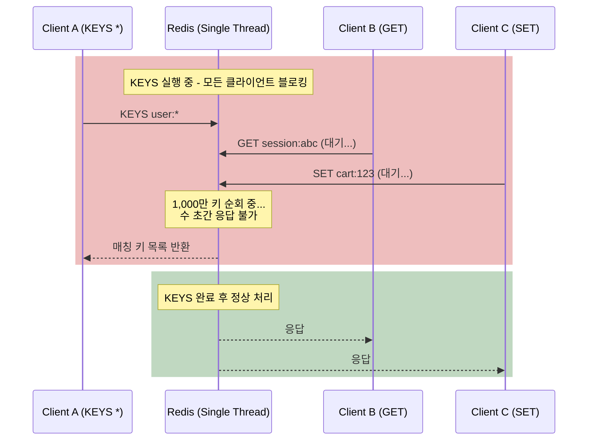
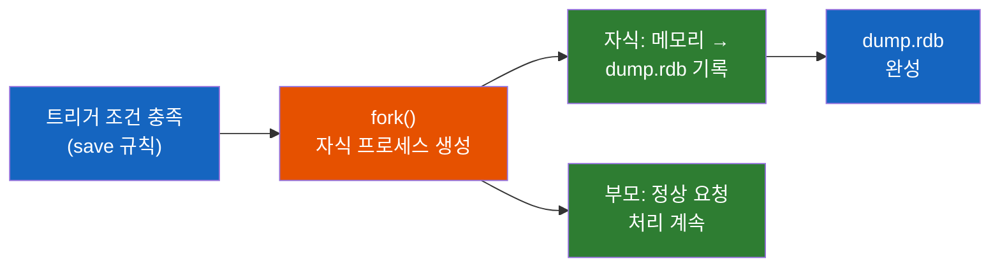
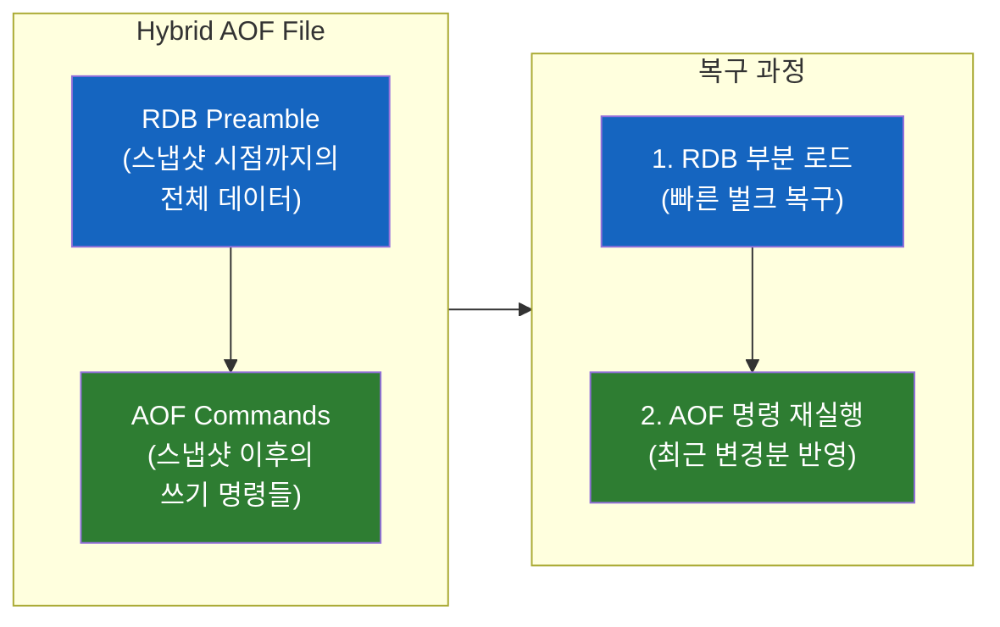

# Redis 운영에서 반드시 알아야 할 것들 - KEYS의 함정과 영속성 전략

프로덕션 Redis에서 `KEYS *`를 실행하면 어떻게 될까? 서비스가 수 초간 멈춘다. 그리고 Redis 서버가 갑자기 죽으면 데이터는? "인메모리니까 다 날아가겠지"라고 생각한다면, 영속성(Persistence)을 모르는 것이다.

## 결론부터 말하면

**`KEYS` 명령은 프로덕션에서 절대 사용하면 안 된다.** 전체 키를 순회하는 $O(N)$ 연산이 Redis의 싱글 스레드를 점유하여 서비스가 멈춘다. 대안은 **`SCAN`** 이다. 영속성은 **RDB(스냅샷)**, **AOF(명령 로그)**, **Hybrid(RDB + AOF)** 3가지 패턴이 있으며, Redis 7+ 기본값인 **Hybrid가 대부분의 실무 환경에 적합** 하다.

| 주제 | 위험/문제 | 해결 |
|------|---------|------|
| `KEYS *` | 전체 키 순회 → 서버 블로킹 | `SCAN` (커서 기반, 비블로킹) |
| 서버 재시작 시 데이터 유실 | 인메모리 → 전부 사라짐 | RDB / AOF / Hybrid |
| RDB만 사용 | 스냅샷 사이 데이터 유실 | AOF 병행 (Hybrid) |
| AOF만 사용 | 파일 커지고 복구 느림 | RDB 병행 (Hybrid) |

## 1. KEYS 명령의 함정 — 왜 프로덕션에서 금지인가?

### 1.1 KEYS는 어떻게 동작하는가?

개발 환경에서 "user로 시작하는 키가 뭐가 있지?" 하고 `KEYS user:*`를 치면 잘 동작한다. 키가 100개일 때는 문제없다. 하지만 프로덕션에서 키가 **1,000만 개** 라면?

`KEYS`는 Redis의 전체 키 공간을 **처음부터 끝까지 순회** 한다. 시간 복잡도는 $O(N)$으로, N은 전체 키의 수다. 그리고 Redis는 **싱글 스레드** 다. `KEYS`가 실행되는 동안 **다른 모든 명령이 대기** 한다.



키 1,000만 개에 대한 `KEYS *`는 수 초에서 수십 초가 걸릴 수 있다. 그 시간 동안 모든 클라이언트의 요청이 큐에 쌓이고, 타임아웃이 발생하고, 서비스가 장애로 이어진다. Redis 공식 문서에서도 `KEYS`를 `@dangerous`로 분류하고, **프로덕션 환경에서 사용하지 말라** 고 명시하고 있다.

### 1.2 SCAN — 안전한 대안

`SCAN`은 **커서 기반의 점진적 순회** 를 제공한다. 한 번에 모든 키를 가져오는 것이 아니라, **조금씩 나눠서** 가져온다. 각 호출 사이에 다른 명령이 실행될 수 있으므로, Redis가 블로킹되지 않는다.

```bash
# SCAN 기본 사용법
# SCAN cursor [MATCH pattern] [COUNT hint]

SCAN 0 MATCH "user:*" COUNT 100
# 반환: 1) "17"           ← 다음 커서 (0이면 순회 완료)
#       2) 1) "user:123"
#          2) "user:456"
#          3) "user:789"

# 다음 배치 조회 (커서 17부터)
SCAN 17 MATCH "user:*" COUNT 100
# 반환: 1) "0"            ← 커서 0 = 순회 완료
#       2) 1) "user:111"
#          2) "user:222"
```

**SCAN의 핵심 특성:**

| 특성 | 설명 |
|------|------|
| **비블로킹** | 한 번에 소량만 처리, 사이에 다른 명령 실행 가능 |
| **커서 기반** | 커서 0으로 시작, 반환된 커서가 0이면 순회 완료 |
| **COUNT는 힌트** | 정확히 N개를 반환한다는 보장은 없음 (대략적 가이드) |
| **중복 가능** | 순회 중 키가 추가/삭제되면 중복 반환될 수 있음 |
| **보장: 최소 1회** | 순회 시작~종료 시점에 존재한 모든 키는 최소 1회 반환 |

> **자료구조별 SCAN 변형:** `HSCAN`(Hash 필드 순회), `SSCAN`(Set 멤버 순회), `ZSCAN`(Sorted Set 멤버 순회)도 동일한 패턴으로 제공된다. 큰 Hash나 Set의 전체 멤버를 조회할 때도 `HGETALL`/`SMEMBERS` 대신 `HSCAN`/`SSCAN`을 써야 한다.

### 1.3 Redis 8의 개선: 패턴-슬롯 최적화

Redis 8에서 `KEYS`와 `SCAN`이 크게 개선되었다. 패턴이 **특정 hash tag를 포함** 하면, 전체 키 공간이 아닌 **해당 슬롯만 스캔** 한다.

```bash
# Redis 8 이전: 전체 키 공간 순회 (느림)
SCAN 0 MATCH "user123:*"

# Redis 8: hash tag 패턴이면 해당 슬롯만 순회 (빠름)
SCAN 0 MATCH "{user123}:*"
# → CRC16("user123")에 해당하는 슬롯만 검색
# → SCAN 약 3,000배, KEYS 약 1,000배 빨라짐
```

이 최적화는 Cluster 환경에서 hash tag(`{}`)를 사용한 키 설계를 했을 때 효과가 극대화된다. 단, hash tag가 패턴의 **앞부분** 에 위치해야 한다. `{user123}:*`는 최적화 대상이지만, `*:{user123}:*`처럼 태그 앞에 와일드카드가 있으면 여전히 전체 순회가 발생한다. 그리고 이것이 `KEYS`를 프로덕션에서 써도 된다는 의미는 아니다. hash tag가 없는 일반 패턴에서는 여전히 전체 순회가 발생한다.

### 1.4 실무에서 KEYS를 쓰고 싶을 때의 대안

| 목적 | KEYS 대신 | 방법 |
|------|----------|------|
| 특정 패턴의 키 찾기 | `SCAN ... MATCH` | 커서 기반 점진적 순회 |
| 키 개수 확인 | `DBSIZE` | 전체 키 수 즉시 반환, $O(1)$ |
| 특정 패턴 키 개수 | `SCAN` + 카운트 | 애플리케이션에서 집계 |
| 키 존재 여부 확인 | `EXISTS` | 특정 키 존재 확인, $O(1)$ |
| 키 타입 확인 | `TYPE` | 특정 키의 타입 반환 |
| 디버깅/개발 환경 | `KEYS` 허용 | **개발 환경에서만** |

## 2. 영속성(Persistence) — 인메모리인데 데이터를 안 잃는 법

### 2.1 왜 영속성이 필요한가?

Redis는 인메모리 데이터베이스다. 전원이 꺼지면? 메모리의 모든 데이터가 사라진다. "캐시니까 날아가도 괜찮지?"라고 생각할 수 있지만, 세 가지 상황을 생각해보자.

**첫째, 캐시 워밍업 시간.** 수백 GB의 캐시 데이터가 날아가면, 서버 재시작 후 DB에서 다시 캐시를 채우는 데 몇 시간이 걸릴 수 있다. 그 동안 모든 요청이 DB로 직행하여 **캐시 스탬피드** 가 발생한다.

**둘째, Redis를 DB로 쓰는 경우.** 세션 저장소, 랭킹 데이터, 작업 큐 등 Redis가 **1차 데이터 저장소** 인 경우, 데이터 유실은 곧 서비스 장애다.

**셋째, 복구 시간.** 영속성 없이 재시작하면 빈 Redis로 시작한다. 영속성이 있으면 디스크에서 데이터를 복원하여 **이전 상태로 빠르게 복구** 할 수 있다.

### 2.2 패턴 1: RDB (Redis Database Snapshot)

RDB는 **특정 시점의 메모리 전체를 디스크에 스냅샷** 으로 저장하는 방식이다. 사진을 찍듯이, 그 순간의 모든 데이터를 `dump.rdb` 파일에 기록한다.

```nginx
# redis.conf — RDB 설정
save 900 1      # 900초(15분) 동안 1개 이상 변경 시 스냅샷
save 300 10     # 300초(5분) 동안 10개 이상 변경 시 스냅샷
save 60 10000   # 60초(1분) 동안 10,000개 이상 변경 시 스냅샷

dbfilename dump.rdb
dir /var/lib/redis
```

**RDB의 동작 과정:**



핵심은 **`fork()`** 다. Redis는 자식 프로세스를 생성하여 디스크 쓰기를 위임하고, 부모 프로세스는 계속 클라이언트 요청을 처리한다. OS의 **Copy-on-Write(CoW)** 메커니즘 덕분에, fork 시점에 메모리를 복사하지 않고 **쓰기가 발생한 페이지만 복사** 한다.

> **주의: 메모리 순간 폭증.** fork() 후 부모 프로세스에서 쓰기가 많으면 CoW로 인해 메모리가 **최대 2배** 까지 사용될 수 있다. 메모리 10GB를 쓰고 있다면, RDB 스냅샷 중 최대 20GB가 필요할 수 있다. 서버 메모리를 Redis `maxmemory`의 2배로 확보해두는 것이 안전하다.

| 장점 | 단점 |
|------|------|
| 컴팩트한 단일 파일 (백업 용이) | 스냅샷 사이 데이터 유실 가능 |
| 빠른 복구 (파일 로드만 하면 됨) | fork() 시 메모리 순간 폭증 (CoW) |
| 자식 프로세스가 처리 → 부모 성능 영향 최소 | 데이터셋이 클수록 fork 시간 증가 |

### 2.3 패턴 2: AOF (Append Only File)

AOF는 **모든 쓰기 명령을 로그 파일에 순서대로 기록** 하는 방식이다. `SET user:123 "Alice"`를 실행하면, 이 명령 자체가 `appendonly.aof` 파일에 추가된다.

```nginx
# redis.conf — AOF 설정
appendonly yes
appendfilename "appendonly.aof"

# fsync 정책 (디스크에 실제로 기록하는 시점)
# appendfsync always    # 매 명령마다 (가장 안전, 가장 느림)
appendfsync everysec    # 1초마다 (권장 — 성능과 안전의 균형)
# appendfsync no        # OS에 맡김 (가장 빠름, 유실 위험)
```

**`appendfsync` 3가지 옵션:**

| 옵션 | 동작 | 최대 데이터 유실 | 성능 |
|------|------|-----------------|------|
| `always` | 매 명령마다 디스크 flush | 0 (유실 없음) | 매우 느림 |
| **`everysec`** | **1초마다 디스크 flush** | **최대 1초** | **권장** |
| `no` | OS가 알아서 flush | OS 버퍼 크기만큼 | 빠름 |

`everysec`가 기본값이자 권장 설정이다. 1초에 한 번씩 디스크에 기록하므로, 장애 시 **최대 1초의 데이터만 유실** 된다. `always`는 데이터 안전성은 최고이지만, 매 명령마다 디스크 I/O가 발생하여 Redis의 성능 이점을 크게 감소시킨다.

**AOF Rewrite:** AOF 파일은 계속 커진다. 같은 키에 100번 `SET`을 했으면 100개의 명령이 기록되지만, 실제로 필요한 것은 마지막 1개뿐이다. **AOF Rewrite** 는 현재 메모리 상태를 기반으로 최소한의 명령으로 AOF 파일을 재생성하여 크기를 줄인다.

```nginx
# AOF Rewrite 설정
auto-aof-rewrite-percentage 100   # AOF 파일이 이전 대비 100% 커지면 rewrite
auto-aof-rewrite-min-size 64mb    # 최소 64MB 이상일 때만 rewrite
```

| 장점 | 단점 |
|------|------|
| 데이터 유실 최소화 (everysec: 최대 1초) | 파일이 RDB보다 큼 |
| 사람이 읽을 수 있는 로그 형태 | 복구 시 모든 명령 재실행 → 느림 |
| append만 하므로 쓰기 성능 좋음 | Rewrite 필요 (주기적 정리) |

### 2.4 패턴 3: Hybrid (RDB + AOF)

RDB는 복구가 빠르지만 데이터 유실이 있고, AOF는 데이터 유실이 적지만 복구가 느리다. **Hybrid 방식은 이 두 가지의 장점만 취한다.**

```nginx
# redis.conf — Hybrid 설정 (Redis 4.0+ 지원, 7.0+ 기본 활성화)
aof-use-rdb-preamble yes
```

Hybrid는 AOF Rewrite 시 **파일 앞부분을 RDB 포맷으로, 뒷부분을 AOF 명령으로** 기록한다.



**복구 시:** RDB 부분을 먼저 로드하여 대부분의 데이터를 빠르게 복원하고, 그 이후의 AOF 명령만 재실행하면 된다. **RDB의 빠른 복구 + AOF의 낮은 데이터 유실** 을 모두 얻는다.

### 2.5 어떤 영속성 전략을 선택할까?

| 상황 | 권장 전략 | 이유 |
|------|----------|------|
| 순수 캐시 (유실 OK) | **RDB만** 또는 **영속성 OFF** | 복구 속도 중요, 데이터 유실 허용 |
| 일반적인 실무 환경 | **Hybrid (기본값)** | 빠른 복구 + 낮은 유실 |
| 데이터 유실 절대 불가 | **AOF (always)** | 매 명령 디스크 기록 (성능 트레이드오프) |
| 백업/재해 복구 | **RDB 스냅샷** + Hybrid | 별도 서버에 RDB 파일 주기적 복사 |

> **실무 권장:** Redis 7+ 기본값인 **Hybrid를 그대로 사용** 하는 것이 대부분의 상황에서 최선이다. AOF `appendfsync everysec`로 최대 1초 유실을 허용하면서, RDB preamble로 빠른 복구를 보장한다. 여기에 RDB 스냅샷을 별도 서버에 주기적으로 백업하면 재해 복구까지 대비할 수 있다.

## 3. 정리

### 핵심 포인트

1. **`KEYS`는 프로덕션에서 절대 사용하지 마라**
   - $O(N)$ 연산이 싱글 스레드를 블로킹하여 전체 서비스가 멈춘다
   - `SCAN`을 사용하여 커서 기반으로 점진적 순회
   - `HGETALL`/`SMEMBERS`도 큰 데이터에서는 `HSCAN`/`SSCAN`으로 대체

2. **RDB는 빠른 복구, AOF는 낮은 유실 — Hybrid가 정답이다**
   - RDB: 스냅샷 방식, 복구 빠름, 스냅샷 사이 유실 가능, fork 시 메모리 2배
   - AOF: 명령 로그 방식, 유실 최소화, 복구 느림, Rewrite 필요
   - Hybrid: RDB preamble + AOF tail → Redis 7+ 기본값

3. **메모리 관리는 영속성의 숨겨진 비용이다**
   - RDB fork() 시 CoW로 메모리 최대 2배 → `maxmemory`의 2배 확보
   - AOF Rewrite도 fork()을 사용하므로 같은 주의 필요

---

## 출처

- [Redis Documentation - KEYS](https://redis.io/docs/latest/commands/keys/) - KEYS 명령 공식 문서 (`@dangerous` 분류)
- [Redis Documentation - SCAN](https://redis.io/docs/latest/commands/scan/) - SCAN 명령 공식 문서
- [Redis Documentation - Persistence](https://redis.io/docs/latest/operate/oss_and_stack/management/persistence/) - 영속성 공식 문서
- [Faster KEYS and SCAN in Redis 8](https://redis.io/blog/faster-keys-and-scan-optimized/) - Redis 8 패턴-슬롯 최적화 공식 블로그
- [Redis Persistence and Durability Tutorial](https://redis.io/tutorials/operate/redis-at-scale/persistence-and-durability/) - 영속성 튜토리얼
