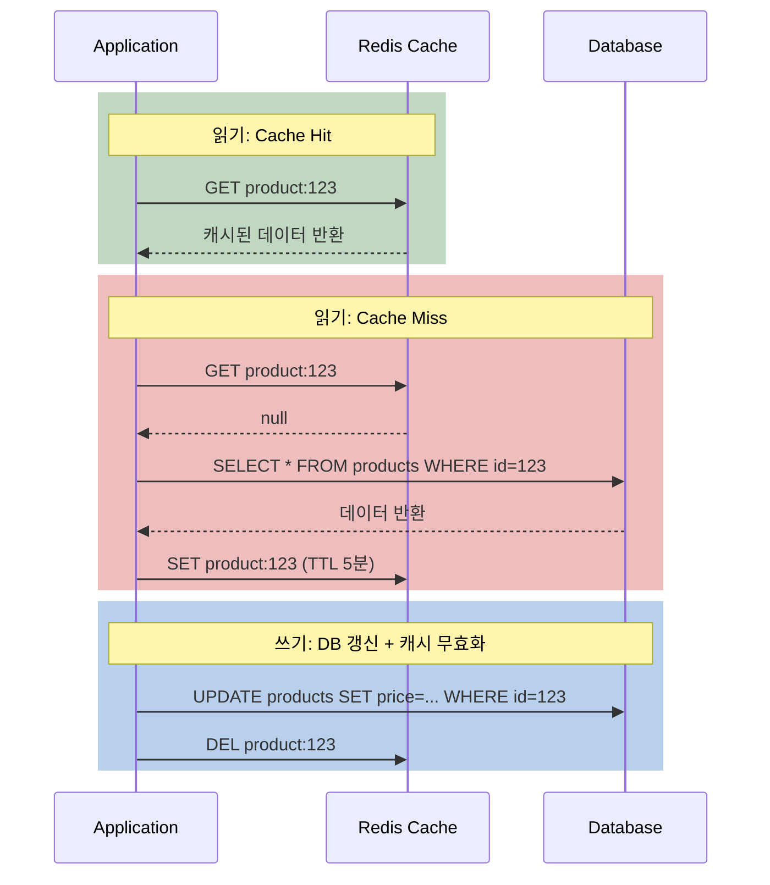
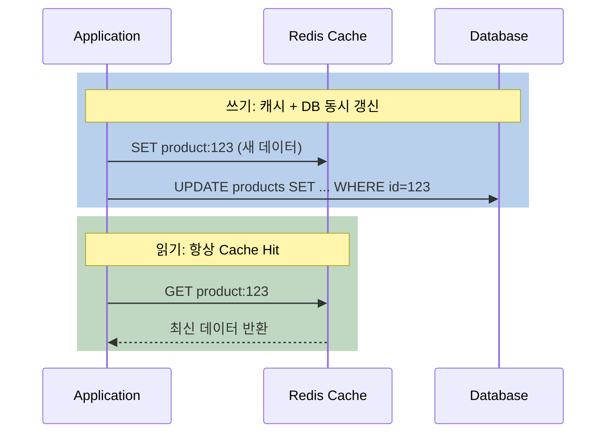
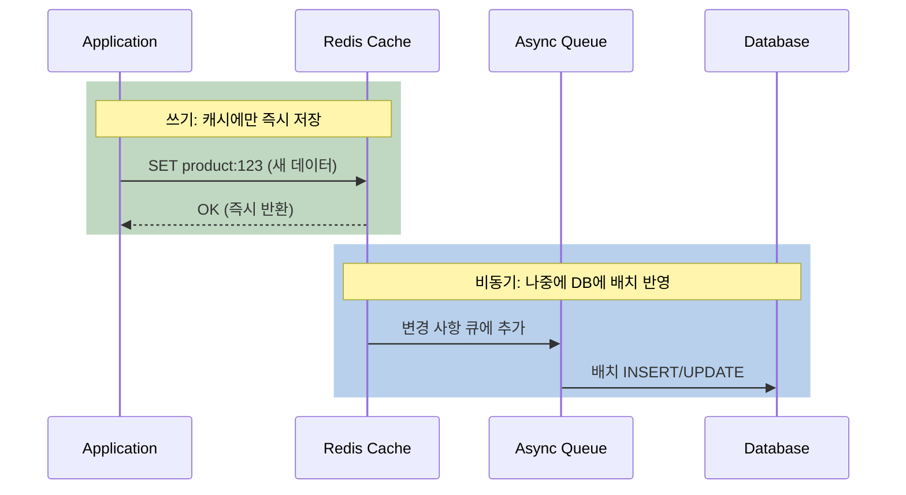
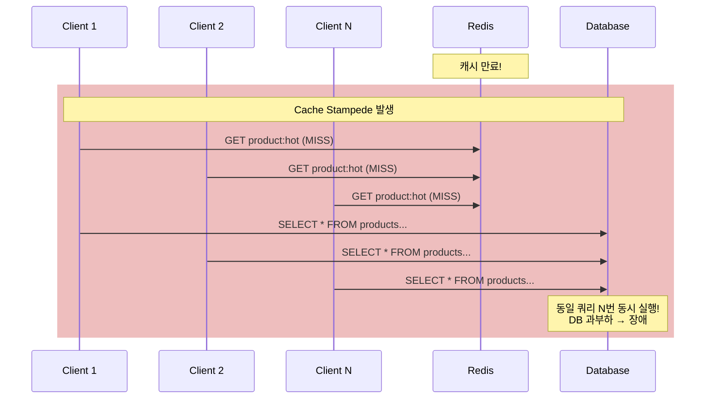

# Redis 캐시 전략과 Cache Stampede 방어

"Redis를 캐시로 쓰고 있어요"라고 말하면, 다음 질문은 반드시 이것이다. "어떤 캐시 전략을 쓰고 있나요?" 그리고 "캐시가 만료되었을 때 동시에 수천 개의 요청이 DB로 몰리는 문제는 어떻게 해결하나요?"

## 결론부터 말하면

캐시 전략은 **데이터 동기화 방식** 에 따라 3가지로 나뉜다. **Cache Aside** (애플리케이션이 관리), **Write Through** (캐시와 DB 동시 쓰기), **Write Behind** (캐시에만 쓰고 나중에 DB). 대부분의 실무에서는 **Cache Aside** 가 기본이다. 그리고 캐시 만료 시 발생하는 **Cache Stampede** 는 Mutex Lock, 확률적 조기 만료, 백그라운드 갱신으로 방어한다.

| 전략 | 읽기 | 쓰기 | 일관성 | 적합 상황 |
|------|------|------|--------|----------|
| **Cache Aside** | 캐시 → miss → DB → 캐시 저장 | DB 쓰기 + 캐시 무효화 | 중간 | **대부분의 경우 (기본)** |
| **Write Through** | 캐시 → miss → DB → 캐시 저장 | 캐시 + DB 동시 쓰기 | 높음 | 읽기 많고 일관성 필수 |
| **Write Behind** | 캐시에서 직접 | 캐시만 쓰기 → 비동기 DB 반영 | 낮음 | 쓰기 많고 유실 허용 |

## 1. 왜 캐시 전략이 중요한가?

Redis를 캐시로 쓸 때 핵심 문제는 **"DB와 캐시의 데이터를 어떻게 동기화할 것인가"** 다. 캐시에는 오래된 데이터가 있고, DB에는 최신 데이터가 있으면? 반대로 캐시에만 쓰고 DB에 반영하기 전에 서버가 죽으면?

이 동기화 문제를 해결하는 방식이 **캐시 전략(Caching Strategy)** 이다.

## 2. 3가지 캐시 전략

### 2.1 Cache Aside (Lazy Loading) — 가장 보편적인 전략

**애플리케이션이 직접** 캐시와 DB를 관리한다. 읽을 때 캐시를 먼저 확인하고, 없으면(miss) DB에서 가져와서 캐시에 저장한다. 쓸 때는 DB에 쓰고 **캐시를 무효화(삭제)** 한다.



Spring에서 `@Cacheable`과 `@CacheEvict`를 사용하면 이 패턴이 자동으로 적용된다.

```java
@Cacheable(value = "products", key = "#id")
public Product getProduct(Long id) {
    return productRepository.findById(id);  // Cache Miss 시 DB 조회
}

@CacheEvict(value = "products", key = "#id")
public void updateProduct(Long id, Product product) {
    productRepository.save(product);  // DB 갱신 + 캐시 삭제
}
```

**왜 쓰기 시 "갱신" 대신 "삭제"인가?** 캐시를 갱신하면 **Race Condition** 이 발생할 수 있다. 스레드 A가 DB를 쓰고 캐시를 갱신하기 직전에, 스레드 B가 DB를 쓰고 캐시를 먼저 갱신하면? 캐시에는 A의 오래된 데이터가 남는다. 삭제하면 다음 읽기에서 최신 데이터를 DB에서 다시 가져오므로 이 문제가 없다.

| 장점 | 단점 |
|------|------|
| 가장 단순하고 범용적 | Cache Miss 시 지연 발생 |
| 실제로 읽히는 데이터만 캐싱 (메모리 효율) | DB와 캐시 사이 일시적 불일치 가능 |
| 캐시 장애 시 DB로 폴백 가능 | 초기 요청은 항상 느림 (Cold Start) |

### 2.2 Write Through — 일관성이 생명인 경우

Write Through는 쓰기 시 **캐시와 DB를 동시에 갱신** 한다. 읽기 시에는 항상 캐시에 최신 데이터가 있으므로 Cache Miss가 적다.



| 장점 | 단점 |
|------|------|
| 캐시와 DB가 항상 일치 (강한 일관성) | **쓰기 지연 증가** (두 곳에 써야 하므로) |
| Cache Miss 거의 없음 | 읽히지 않는 데이터도 캐싱 (메모리 낭비) |
| 데이터 유실 위험 낮음 | 캐시 + DB 동시 쓰기 실패 시 정합성 문제 |

금융 시스템이나 사용자 인증 정보처럼 **데이터 일관성이 비즈니스 크리티컬** 한 경우에 적합하다.

### 2.3 Write Behind (Write Back) — 쓰기 성능이 우선인 경우

Write Behind는 **캐시에만 쓰고**, DB 반영은 **비동기로 나중에** 한다. 쓰기가 극도로 빠르지만, 캐시가 죽으면 아직 DB에 반영되지 않은 데이터가 유실될 수 있다.



| 장점 | 단점 |
|------|------|
| **쓰기 극도로 빠름** (캐시만 쓰므로) | **데이터 유실 위험** (캐시 죽으면 미반영 데이터 소실) |
| DB 부하 감소 (배치 처리) | 구현 복잡도 높음 |
| 배치로 모아서 쓰면 DB I/O 효율적 | 일관성 보장 어려움 |

실시간 분석 데이터, 로그 수집, 조회수/좋아요 카운터처럼 **약간의 유실이 허용되면서 쓰기가 폭발적으로 많은** 경우에 적합하다.

### 2.4 전략 선택 가이드

| 상황 | 권장 전략 | 이유 |
|------|----------|------|
| 일반적인 웹 서비스 | **Cache Aside** | 단순, 범용적, 메모리 효율 |
| 읽기 많고 일관성 필수 (결제, 인증) | **Write Through** | 캐시와 DB 항상 일치 |
| 쓰기 폭발적, 유실 허용 (조회수, 로그) | **Write Behind** | 쓰기 성능 극대화 |
| 읽기 극다수 + 가끔 쓰기 | **Cache Aside + TTL** | 기본값, 대부분 이것으로 충분 |

## 3. Cache Stampede — 캐시가 만료되면 DB가 죽는다

### 3.1 Cache Stampede란?

**Cache Stampede** (또는 **Thundering Herd** )는 인기 있는 캐시 키가 만료되는 순간, **수천 개의 요청이 동시에 DB로 몰려서** DB가 과부하로 다운되는 현상이다.

초당 10,000번 조회되는 인기 상품의 캐시가 만료되었다고 해보자. TTL이 끝나는 그 순간, 10,000개의 요청이 모두 Cache Miss를 만나고, **동시에 같은 DB 쿼리를 실행** 한다. DB는 순간적으로 10,000배의 부하를 받게 된다.



### 3.2 방어 전략 1: Mutex Lock (SETNX)

**한 명만 DB를 조회** 하고, 나머지는 기다리게 하는 방식이다. Redis의 `SETNX`로 분산 락을 구현한다.

```bash
# 의사 코드
GET product:hot
→ Cache Miss!

# 락 획득 시도
SET lock:product:hot "1" NX EX 5
→ 성공하면: DB 조회 → 캐시 저장 → 락 해제
→ 실패하면: 짧게 대기(100ms) 후 캐시 재조회 (다른 스레드가 채워놓았을 것)
```

```python
def get_with_mutex(key, ttl=300, lock_ttl=5):
    value = redis.get(key)
    if value is not None:
        return value

    lock_key = f"lock:{key}"
    if redis.set(lock_key, "1", nx=True, ex=lock_ttl):
        try:
            # 락 획득 성공 → DB 조회
            value = db.query(key)
            redis.setex(key, ttl, value)
            return value
        finally:
            redis.delete(lock_key)
    else:
        # 락 획득 실패 → 대기 후 재시도
        time.sleep(0.1)
        return redis.get(key)  # 다른 스레드가 채워놓았을 것
```

**장점:** 구현이 단순하고 효과 확실
**단점:** 락을 기다리는 동안 응답 지연 발생, 락 소유자가 죽으면 TTL까지 대기

### 3.3 방어 전략 2: 확률적 조기 만료 (Probabilistic Early Recomputation)

TTL이 끝나기 **전에** 미리 캐시를 갱신하는 방식이다. 모든 요청이 갱신하는 것이 아니라, TTL이 가까워질수록 **확률적으로** 일부 요청만 갱신을 시도한다.

핵심은 X-Fetch 알고리즘이다. 공식은 다음과 같다.

$$\text{shouldRefresh} = \text{now} - (\text{expiry} + \delta \times \beta \times \log(\text{random})) \geq 0$$

여기서 $\delta$는 **캐시 값을 계산/조회하는 데 걸리는 시간** 이다 (전체 TTL이 아님). `log(random())`은 항상 음수이므로, $\delta \times \beta \times \log(\text{random})$도 음수가 된다. 따라서 `expiry + (음수)` = **만료 시점보다 약간 이른 시점** 부터 확률적으로 갱신이 시작된다. $\beta$ 값(기본 1.0)이 클수록 더 일찍 갱신을 시도한다.

```python
import math, random, time

def get_with_per(key, ttl=300, delta=0.5, beta=1.0):
    # delta: DB 조회에 걸리는 예상 시간 (초)
    value, expiry = redis.get_with_ttl(key)

    if value is not None:
        now = time.time()
        # log(random())은 항상 음수 → gap은 음수 → 만료 전에 갱신 트리거
        gap = delta * beta * math.log(random.random())
        if now - (expiry + gap) >= 0:
            # 조기 갱신 (확률적으로 선택됨)
            value = db.query(key)
            redis.setex(key, ttl, value)
        return value

    # 완전 Cache Miss → DB 조회
    value = db.query(key)
    redis.setex(key, ttl, value)
    return value
```

**장점:** 락이 필요 없어 지연이 없다. Thundering herd를 **95% 감소** 시킨다.
**단점:** 완전한 방지가 아닌 확률적 완화. 100% 방어가 필요하면 Mutex와 병행해야 한다.

### 3.4 방어 전략 3: 논리적 만료 + 백그라운드 갱신

캐시의 **물리적 TTL을 설정하지 않고**, 대신 캐시 값 안에 **논리적 만료 시각** 을 저장한다. 만료 시각이 지나면 **백그라운드에서 비동기로 갱신** 하고, 그동안은 오래된 데이터를 반환한다.

```python
def get_with_background_refresh(key, ttl=300):
    data = redis.get(key)
    if data is None:
        return db.query(key)  # 완전 miss → 동기 조회

    value, logical_expiry = deserialize(data)

    if time.time() > logical_expiry:
        # 논리적으로 만료됨 → 백그라운드 갱신 시작
        refresh_in_background(key, ttl)  # 비동기 작업 발행

    return value  # 오래된 데이터라도 즉시 반환 (Stale-While-Revalidate)
```

**장점:** 응답 지연 없음 (항상 캐시에서 즉시 반환)
**단점:** 잠시 동안 오래된 데이터가 제공됨 (Stale data)

이 패턴은 HTTP의 **`stale-while-revalidate`** 캐시 전략과 동일한 철학이다.

### 3.5 방어 전략 비교

| 전략 | Stampede 방지 | 응답 지연 | 구현 복잡도 | 적합 상황 |
|------|-------------|----------|-----------|----------|
| **Mutex Lock** | 완전 방지 | 락 대기 시 있음 | 낮음 | 일반적인 경우 |
| **확률적 조기 만료** | ~95% 감소 | 없음 | 중간 | 높은 트래픽 |
| **백그라운드 갱신** | 완전 방지 | 없음 | 높음 | 오래된 데이터 허용 |
| **Mutex + 확률적** | 완전 방지 | 거의 없음 | 중간 | **실무 권장 조합** |

## 4. 정리

### 핵심 포인트

1. **Cache Aside가 기본이다**
   - 대부분의 웹 서비스에서 Cache Aside + TTL이면 충분하다
   - 쓰기 시 캐시를 "갱신"이 아니라 **"삭제"** 하는 것이 안전하다 (Race Condition 방지)

2. **Write Through는 일관성, Write Behind는 쓰기 성능**
   - Write Through: 캐시와 DB 동시 쓰기 → 항상 일치, 쓰기 느림
   - Write Behind: 캐시에만 쓰기 → 극도로 빠름, 데이터 유실 위험

3. **Cache Stampede는 반드시 방어해야 한다**
   - 인기 키 만료 → 동시 DB 쿼리 폭발 → DB 장애
   - 실무 권장: **확률적 조기 만료(정상) + Mutex Lock(폴백)** 조합
   - 오래된 데이터가 허용되면 백그라운드 갱신이 가장 안전

---

## 출처

- [Redis Documentation - Client-side Caching](https://redis.io/docs/latest/develop/use/client-side-caching/) - 클라이언트 캐싱 공식 문서
- [Cache Stampede Prevention - Redis Patterns](https://redis.antirez.com/fundamental/cache-stampede-prevention.html) - Stampede 방어 패턴
- [Redis Caching Patterns for Applications (2026)](https://oneuptime.com/blog/post/2026-02-20-redis-caching-patterns/view) - 캐시 전략 가이드
- [The Complete Guide to Cache Strategies (2026)](https://medium.com/@yogeshkrishnanseeniraj/the-complete-guide-to-cache-strategies-from-basics-to-production-2026-fa54a3230886) - 캐시 전략 종합 가이드
