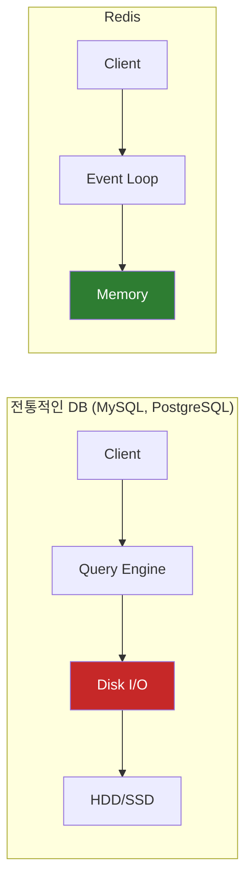
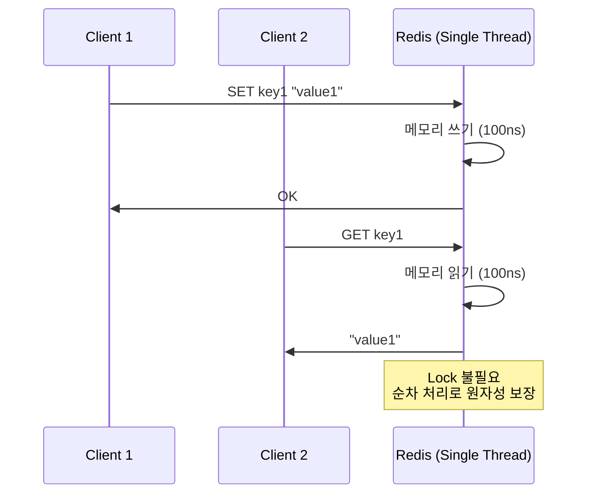
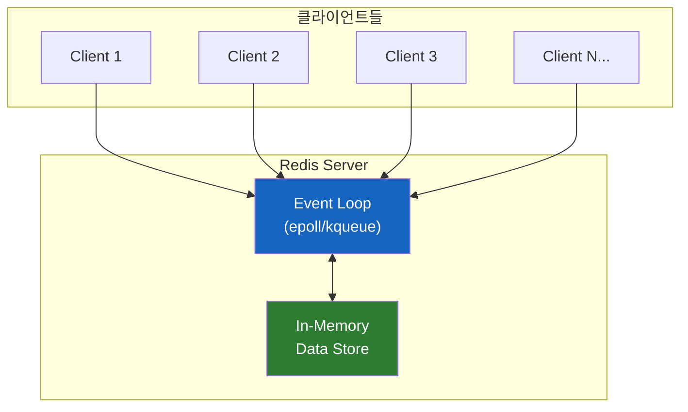
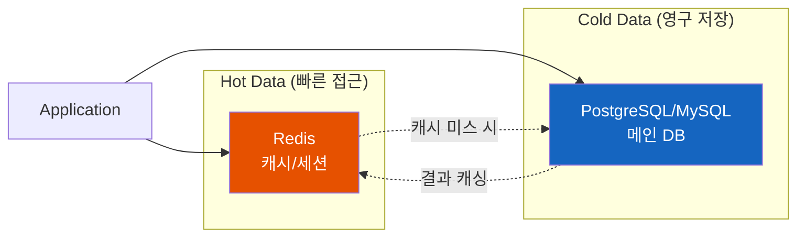

# Redis는 왜 쓰는가

"디스크가 너무 느려서 만들었다" — 2009년, 한 이탈리아 개발자의 불만에서 시작된 이야기

## 결론부터 말하면

**Redis는 "디스크 I/O의 한계"를 극복하기 위해 태어났다.** 전통적인 데이터베이스가 디스크에 데이터를 저장하는 동안, Redis는 모든 데이터를 메모리에 올려놓고 처리한다. 그 결과, 100,000배 빠른 응답 속도를 얻었지만, 메모리 비용과 데이터 영속성이라는 대가를 치러야 한다.



| 구분 | 전통적 DB (디스크) | Redis (메모리) |
|------|-------------------|----------------|
| 접근 속도 | ~10ms (HDD) / ~100µs (SSD) | **~100ns** |
| 속도 차이 | 기준 | **1,000 ~ 100,000배 빠름** |
| 저장 비용 | 저렴 | 비쌈 (RAM 가격) |
| 데이터 영속성 | 기본 보장 | 추가 설정 필요 |

---

## 1. 왜 Redis가 태어났는가?

### 1.1 2009년, 한 개발자의 좌절

Salvatore Sanfilippo(antirez)는 이탈리아에서 LLOOGG라는 실시간 웹 로그 분석 서비스를 운영하고 있었다. 문제는 "실시간"이었다. 사용자가 웹사이트에 접속할 때마다 로그를 기록하고, 즉시 분석 결과를 보여줘야 했다.

MySQL로 시작했지만, 곧 한계에 부딪혔다.

```
사용자 요청 → MySQL 쿼리 → 디스크 읽기 → 응답
                              ↑
                         여기서 병목!
```

디스크 I/O가 모든 것을 느리게 만들었다. 초당 수백 건의 요청을 처리해야 하는데, 매번 디스크를 읽고 쓰는 건 너무 느렸다.

### 1.2 "그냥 메모리에 다 올려버리면 안 되나?"

antirez는 단순하지만 과감한 결정을 내렸다. **데이터를 디스크 대신 메모리에 저장하자.**

그렇게 2009년 4월, Redis(Remote Dictionary Server)의 첫 버전이 공개되었다. Hacker News에 올렸을 때 반응은 미지근했다. "이미 비슷한 게 있는데?"라는 댓글이 대부분이었다.

하지만 Ruby on Rails 커뮤니티의 유명 개발자 Ezra Zygmuntowicz가 관심을 보였고, Ruby 클라이언트를 만들어주면서 Redis는 조금씩 퍼져나갔다.

### 1.3 증명의 시간

LLOOGG는 5년 동안 Redis 하나로 **20억 페이지뷰** 를 처리했다. 월 $150짜리 가상 머신에서 초당 350~400개의 명령을 처리하면서.

2009년 GitHub의 CEO Chris Wanstrath는 Redis로 Resque(작업 큐 시스템)를 만들었다. 2010년에는 Instagram과 Twitter가 Redis를 도입했다. "메모리에 데이터를 올린다"는 단순한 아이디어가 실제로 동작한다는 걸 증명한 것이다.

---

## 2. Redis가 해결한 문제: 디스크 I/O의 한계

### 2.1 저장 매체별 속도 차이

왜 메모리가 그렇게 빠를까? 물리적인 한계 때문이다.

| 저장 매체 | 접근 시간 | RAM 대비 |
|----------|----------|----------|
| **RAM** | ~100 나노초 | 1x |
| **SSD** | ~100 마이크로초 | 1,000x 느림 |
| **HDD** | ~10 밀리초 | 100,000x 느림 |

HDD는 물리적으로 디스크 헤드가 움직여야 한다. SSD는 전기 신호로 동작하지만, 여전히 NAND 플래시의 특성상 RAM보다 느리다. RAM은 전기 신호만으로 즉시 접근 가능하다.

### 2.2 전통적인 DB의 딜레마

MySQL이나 PostgreSQL 같은 RDBMS는 ACID(원자성, 일관성, 고립성, 지속성)를 보장해야 한다. 특히 **지속성(Durability)** — 데이터가 영구적으로 저장되어야 한다는 요구사항 때문에, 모든 쓰기 작업이 디스크까지 도달해야 한다.

```
INSERT INTO users (name) VALUES ('Kim');
       ↓
   트랜잭션 로그 기록 (디스크)
       ↓
   데이터 페이지 쓰기 (디스크)
       ↓
   "OK" 응답
```

이 과정에서 디스크 I/O가 발생할 수밖에 없다.

### 2.3 Redis의 해법: "디스크를 건너뛰자"

Redis는 과감하게 디스크를 건너뛰었다. 모든 데이터를 메모리에 저장하고, 디스크는 선택적으로만 사용한다.

```
SET user:1 "Kim"
       ↓
   메모리에 저장
       ↓
   "OK" 응답 (끝!)

   (옵션) 백그라운드에서 디스크에 기록
```

---

## 3. Redis의 설계 철학: 단순함의 미학

### 3.1 싱글스레드? 정말로?

Redis는 핵심 작업을 **싱글스레드** 로 처리한다. 2025년에 싱글스레드라니, 미친 짓 아닌가?

하지만 여기엔 깊은 통찰이 있다.

**멀티스레드의 숨은 비용:**
- Lock/Unlock 오버헤드
- Context Switching 비용
- Race Condition 처리
- 데드락 위험

Redis는 이 모든 복잡성을 제거했다. 메모리 연산은 너무 빨라서, CPU가 병목이 되기 전에 네트워크 대역폭이 먼저 한계에 도달한다.

> **참고: Redis 6.0의 I/O 멀티스레딩**
>
> Redis 6.0(2020년)부터는 네트워크 I/O 처리에 멀티스레드를 도입했다. 하지만 핵심 명령어 실행은 여전히 싱글스레드다. 클라이언트 요청을 읽고 응답을 쓰는 I/O 작업만 여러 스레드가 분담하여, 네트워크 병목을 개선했다. "싱글스레드의 단순함 + I/O 병렬화"라는 절충안인 셈이다.
>
> 단, 이 기능은 **기본적으로 비활성화** 되어 있다. `redis.conf`에서 `io-threads` 설정을 명시적으로 활성화해야 한다.



### 3.2 Event Loop: 적은 자원으로 많은 연결

Redis는 Node.js처럼 Event Loop 기반으로 동작한다. `epoll`(Linux)이나 `kqueue`(macOS) 같은 I/O 멀티플렉싱을 사용해서, 단일 스레드로 수천 개의 클라이언트 연결을 동시에 처리한다.



### 3.3 데이터 구조의 힘

Redis는 단순한 Key-Value 저장소가 아니다. 다양한 자료구조를 네이티브로 지원한다.

| 자료구조 | 용도 예시 | 시간복잡도 (추가/조회) |
|----------|----------|----------------------|
| **String** | 세션, 캐시 | $O(1)$ / $O(1)$ |
| **List** | 메시지 큐, 타임라인 | $O(1)$ / $O(n)$ |
| **Set** | 태그, 유니크 방문자 | $O(1)$ / $O(1)$ |
| **Sorted Set** | 리더보드, 랭킹 | $O(\log n)$ / $O(\log n + m)$ |
| **Hash** | 객체 저장 | $O(1)$ / $O(1)$ |

MySQL에서 리더보드를 구현하려면?

```sql
SELECT user_id, score
FROM leaderboard
ORDER BY score DESC
LIMIT 10;
-- 인덱스가 있어도 정렬 비용 발생
```

Redis에서는?

```bash
ZREVRANGE leaderboard 0 9 WITHSCORES
# Sorted Set은 이미 정렬되어 있음
# O(log n + m) - n은 전체 개수, m은 반환 개수
```

---

## 4. 트레이드오프: Redis의 한계

Redis가 만능이 아닌 이유. 모든 기술에는 대가가 있다.

### 4.1 메모리 비용 문제

**RAM은 비싸다.** 정말 비싸다.

| 용량 | RAM (DDR5) | SSD (NVMe) | 가격 차이 |
|------|-----------|------------|----------|
| 1TB | ~$2,000+ | ~$80 | **25배** |

10TB 데이터를 Redis에 저장하려면? 엄청난 비용이 든다. 그래서 Redis는 보통 "자주 접근하는 일부 데이터"만 저장하는 캐시로 사용된다.

### 4.2 데이터 영속성의 딜레마

Redis는 메모리 기반이다. 서버가 죽으면? 데이터도 사라진다.

물론 영속성 옵션이 있다:

| 방식 | 설명 | 트레이드오프 |
|------|------|-------------|
| **RDB** | 주기적 스냅샷 | 스냅샷 사이 데이터 유실 가능 |
| **AOF** | 모든 명령 로깅 | 디스크 I/O 증가, 느려짐 |
| **RDB + AOF** | 둘 다 사용 | 복잡성 증가 |

AOF는 `fsync` 정책으로 성능과 안정성 사이의 균형을 조절할 수 있다:

| fsync 정책 | 동작 | 트레이드오프 |
|-----------|------|-------------|
| `always` | 매 명령마다 디스크 동기화 | 가장 안전하지만 가장 느림 |
| `everysec` (기본값) | 1초마다 동기화 | **최대 1초 데이터 유실 가능**, 현실적 타협점 |
| `no` | OS에 맡김 | 가장 빠르지만 유실 위험 높음 |

**은행 시스템에 Redis를 메인 DB로?** 절대 안 된다. `fsync=always`로 설정해도, 한 건의 거래도 유실되면 안 되는 시스템에는 RDBMS의 트랜잭션이 더 적합하다.

### 4.3 복잡한 쿼리 불가

Redis에는 JOIN이 없다. SQL의 강력한 쿼리 기능도 없다.

```sql
-- MySQL: 가능
SELECT u.name, o.total
FROM users u
JOIN orders o ON u.id = o.user_id
WHERE o.date > '2024-01-01';

-- Redis: 불가능
-- 애플리케이션에서 직접 조합해야 함
```

관계형 데이터를 다루려면 데이터를 비정규화하거나, 애플리케이션에서 여러 번 쿼리해야 한다.

### 4.4 ACID 미보장

Redis는 완전한 ACID를 보장하지 않는다.

| ACID | Redis 지원 여부 |
|------|----------------|
| **Atomicity** | 단일 명령 수준에서만 |
| **Consistency** | 제한적 |
| **Isolation** | 싱글스레드라 자연스럽게 보장 |
| **Durability** | 설정에 따라 다름 (기본값은 미보장) |

복잡한 트랜잭션이 필요한 금융 시스템에는 부적합하다.

### 4.5 싱글스레드의 함정

싱글스레드의 장점이 때로는 단점이 된다.

```bash
KEYS *  # 모든 키 검색 - 프로덕션에서 절대 금지!
```

느린 명령 하나가 전체 Redis를 블로킹한다. `KEYS *` 같은 명령은 데이터가 많으면 몇 초간 Redis 전체를 멈출 수 있다.

**대안: `SCAN` 명령어**

프로덕션에서 모든 키를 순회해야 한다면 `SCAN`을 사용하라. 커서(cursor) 기반으로 동작하여 서버를 블로킹하지 않고 조금씩 키를 가져온다.

```bash
# KEYS * 대신 SCAN 사용
SCAN 0 MATCH "user:*" COUNT 100
# → 커서와 함께 일부 키 반환, 커서가 0이 될 때까지 반복
```

---

## 5. 그래서 언제 Redis를 쓰는가?

### 5.1 Redis가 빛나는 순간

| 용도 | 왜 Redis인가 |
|------|-------------|
| **캐시** | 자주 접근하는 데이터를 메모리에 |
| **세션 저장소** | 빠른 읽기/쓰기, 자동 만료(TTL) |
| **실시간 리더보드** | Sorted Set의 $O(\log n)$ 랭킹 |
| **Rate Limiting** | INCR + EXPIRE 조합 |
| **Pub/Sub 메시징** | 실시간 알림, 채팅 |
| **작업 큐** | List의 LPUSH/BRPOP |

### 5.2 Redis를 피해야 할 때

| 상황 | 대안 |
|------|------|
| 대용량 데이터 저장 | PostgreSQL, MongoDB, Cassandra |
| 복잡한 쿼리/JOIN | RDBMS |
| 100% 데이터 무손실 필수 | RDBMS with 트랜잭션 |
| 비용에 민감한 대용량 | 디스크 기반 DB |

### 5.3 일반적인 아키텍처 패턴

Redis는 보통 다른 DB와 함께 사용된다.



---

## 6. 정리

Redis는 "디스크가 느리다"는 단순한 문제에서 출발했다. 메모리에 데이터를 올리는 과감한 선택으로 100,000배 빠른 성능을 얻었지만, 그 대가로 메모리 비용, 데이터 영속성, 쿼리 기능의 제한을 받아들여야 한다.

**Redis를 쓸 때 기억할 것:**
- 캐시, 세션, 실시간 처리에는 최적
- 메인 DB 대체가 아닌 **보조** 역할
- 데이터 유실 가능성을 항상 고려
- 느린 명령 하나가 전체를 블로킹할 수 있음

antirez가 말했듯이, Redis는 "작고 우아한 기능이 최소한의 일을 하지만, 그 일을 너무 잘해서 다른 제품이 따라올 수 없는" 도구다. 그 철학을 이해하고 적재적소에 사용하는 것이 핵심이다.

---

## 출처

- [Redis Wikipedia](https://en.wikipedia.org/wiki/Redis)
- [Story: Redis and its creator antirez - Brachiosoft Blog](https://blog.brachiosoft.com/en/posts/redis/)
- [The Engineering Wisdom Behind Redis's Single-Threaded Design - AWS Community](https://community.aws/content/2tfQijlXleV5iM6hDkSGkMJlpcd/the-engineering-wisdom-behind-redis-s-single-threaded-design)
- [Why is Redis so Fast and Efficient? - AlgoMaster](https://blog.algomaster.io/p/why-is-redis-so-fast-and-efficient)
- [The Good and the Bad of Redis In-Memory Database - AltexSoft](https://www.altexsoft.com/blog/redis-pros-and-cons/)
- [When Shouldn't You Use Redis? - DEV Community](https://dev.to/itskunal/when-shouldnt-you-use-redis-1hd1)
- [Redis FAQ - Official Documentation](https://redis.io/docs/latest/develop/get-started/faq/)
