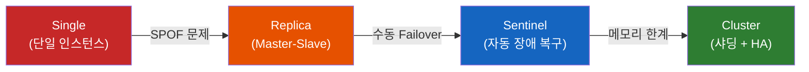
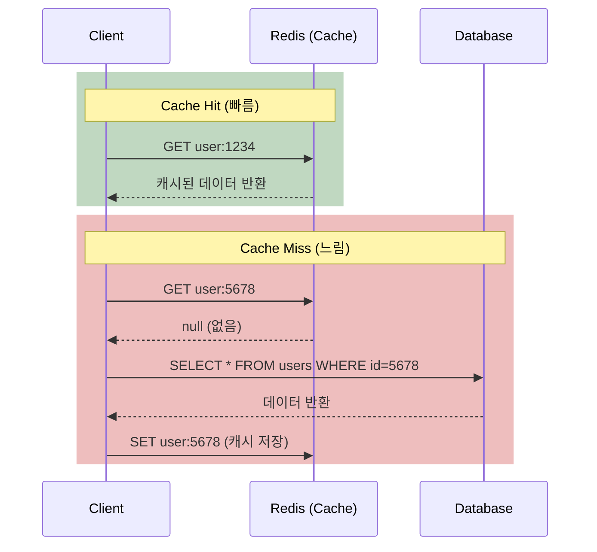
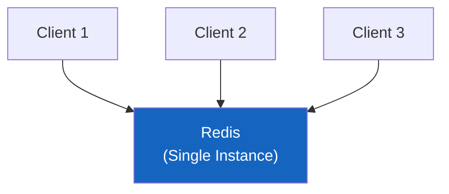
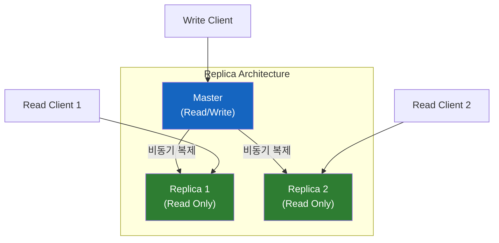
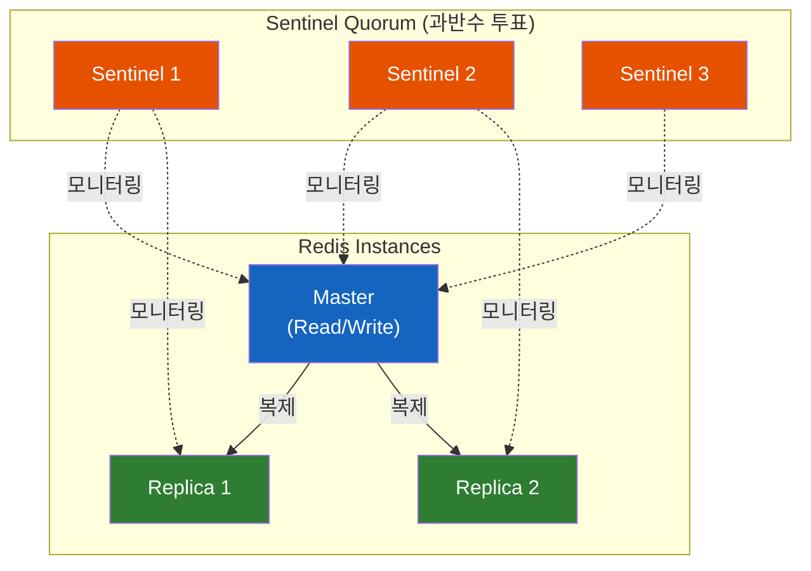
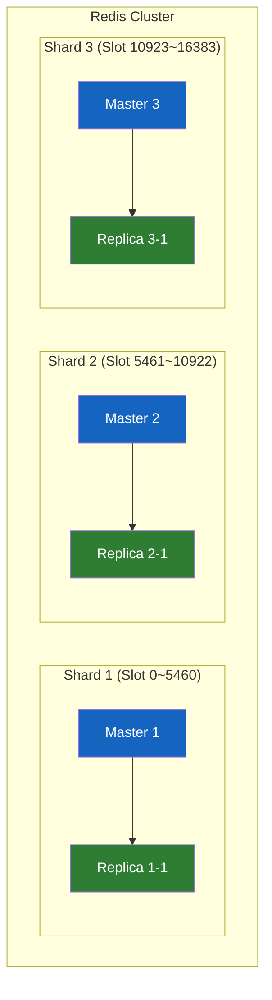
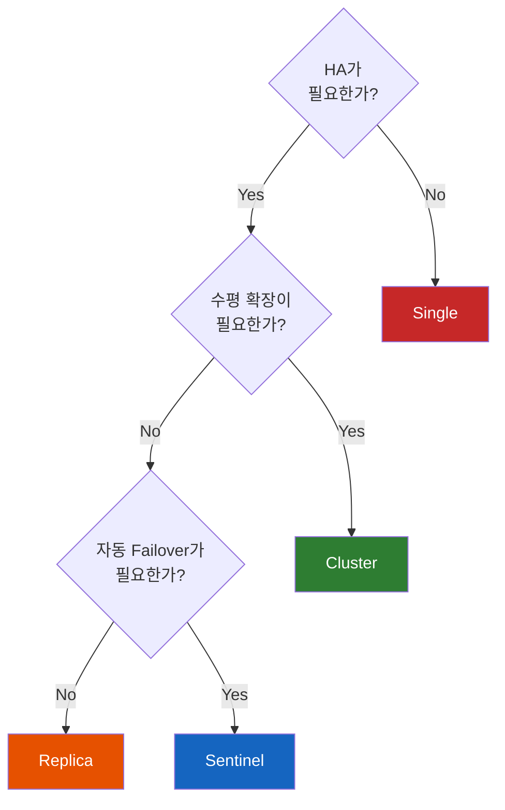

# Redis의 정체와 4가지 아키텍처 진화 과정

"Redis 써본 적 있어요?"라고 물으면 대부분 "네, 캐시로 쓰고 있어요"라고 답한다. 하지만 면접관이 "그럼 Redis 환경 구축 패턴에 대해 설명해주세요"라고 물으면? 싱글, 레플리카, 센티널, 클러스터 — 이 4가지는 단순한 나열이 아니라 **각각의 한계를 해결하며 진화해온 과정** 이다.

## 결론부터 말하면

Redis는 **인메모리 데이터 구조 저장소** 로, 단순한 캐시가 아니라 다양한 자료구조를 지원하는 데이터 플랫폼이다. Redis의 배포 구조는 **싱글 → 레플리카 → 센티널 → 클러스터** 순으로 진화했는데, 각 단계는 이전 단계의 **구체적인 문제** 를 해결하기 위해 등장했다.



| 구조 | 해결하는 문제 | 남아있는 한계 |
|------|-------------|-------------|
| **Single** | — | SPOF, 메모리 한계 |
| **Replica** | SPOF, 읽기 분산 | 수동 Failover |
| **Sentinel** | 자동 Failover | 쓰기 확장 불가, 메모리 한계 |
| **Cluster** | 수평 확장 (샤딩) | 운영 복잡도 증가 |

## 1. Redis는 대체 뭐야?

### 1.1 왜 모든 회사가 Redis를 쓰는가?

데이터베이스에 모든 데이터가 있다. MySQL, PostgreSQL, Oracle 같은 RDBMS가 데이터를 **디스크에 저장** 하고 있다. 그런데 문제가 있다. 디스크 I/O는 느리다. 사용자가 상품 목록을 볼 때마다 DB에 쿼리를 날리면, 트래픽이 몰릴 때 DB가 버티지 못한다.

그래서 **자주 접근하는 데이터를 메모리에 올려놓자** 는 발상이 나왔다. 메모리 접근 속도는 디스크의 수만~수십만 배 빠르다. 이것이 캐시(Cache)의 핵심 아이디어이고, 이 역할을 가장 잘 해내는 것이 **Redis** 다.



Java 개발자라면 Spring에서 `@Cacheable` 어노테이션을 쓸 때 뒤에서 Redis가 동작하는 것을 떠올리면 된다. `CacheManager`로 Redis를 연결하면, 메서드 결과가 자동으로 Redis에 캐싱된다.

### 1.2 Redis는 "캐시"가 아니라 "데이터 구조 저장소"다

Redis의 공식 정의는 **"인메모리 데이터 구조 저장소(In-memory Data Structure Store)"** 다. 단순한 key-value 캐시가 아니라, **다양한 자료구조를 네이티브로 지원** 한다는 것이 Redis의 진짜 강점이다.

| 자료구조 | Redis 타입 | 활용 사례 |
|---------|-----------|----------|
| 문자열 | String | 세션 저장, 단순 캐싱 |
| 해시맵 | Hash | 객체 저장 (User 프로필) |
| 리스트 | List | 메시지 큐, 최근 본 상품 |
| 집합 | Set | 태그, 좋아요 한 유저 목록 |
| 정렬 집합 | Sorted Set | 실시간 랭킹, 리더보드 |
| 스트림 | Stream | 이벤트 소싱, 로그 수집 |
| 비트맵 | Bitmap | 출석 체크, 사용자 활동 추적 |

예를 들어 게임의 **실시간 랭킹** 을 구현한다고 해보자. RDBMS라면 `ORDER BY score DESC` 쿼리를 매번 실행해야 한다. 하지만 Redis의 Sorted Set을 쓰면 `ZADD`로 점수를 넣고 `ZRANK`로 순위를 바로 조회할 수 있다. 시간 복잡도는 $O(\log n)$으로, 수백만 명의 유저 중 특정 유저의 순위를 **1ms 이내** 에 반환한다.

```bash
# 랭킹 추가
ZADD leaderboard 1500 "player:alice"
ZADD leaderboard 2300 "player:bob"
ZADD leaderboard 1800 "player:charlie"

# 상위 3명 조회 (점수 높은 순)
ZREVRANGE leaderboard 0 2 WITHSCORES
# 1) "player:bob"    2300
# 2) "player:charlie" 1800
# 3) "player:alice"   1500

# 특정 유저 순위 조회
ZREVRANK leaderboard "player:charlie"
# 1  (0-based, 2위)
```

### 1.3 Redis의 핵심 특성

**싱글 스레드.** Redis는 명령을 처리하는 메인 스레드가 **하나** 다. 이상하게 들릴 수 있다. "싱글 스레드인데 어떻게 빠르지?" 답은 간단하다. 모든 데이터가 **메모리에 있기 때문에** I/O 대기가 없다. CPU 연산 자체는 극히 짧아서, 싱글 스레드로도 초당 수십만 개의 명령을 처리할 수 있다. 오히려 싱글 스레드이기 때문에 **Lock이 필요 없어서** 더 빠르다.

> Redis 6.0부터 I/O 멀티스레딩이 도입되었지만, 이는 네트워크 I/O 처리에만 적용되고 **명령 실행 자체는 여전히 싱글 스레드** 다. 핵심 아키텍처는 변하지 않았다.

**영속성(Persistence).** 인메모리라고 해서 서버가 꺼지면 데이터가 사라지는 건 아니다. Redis는 두 가지 방식으로 디스크에 데이터를 저장한다.

| 방식 | 동작 | 장점 | 단점 |
|------|------|------|------|
| **RDB** (Snapshot) | 주기적으로 메모리 스냅샷 저장 | 빠른 복구, 작은 파일 | 스냅샷 사이 데이터 유실 가능 |
| **AOF** (Append Only File) | 모든 쓰기 명령을 로그로 저장 | 데이터 유실 최소화 | 파일이 크고 복구 느림 |

실무에서는 **RDB + AOF를 함께 사용** 하는 것이 일반적이다. RDB로 빠른 복구를 하고, AOF로 마지막 스냅샷 이후의 데이터를 복원한다.

## 2. 4가지 아키텍처의 진화 과정

여기서부터가 핵심이다. 단순히 "4가지 구조가 있다"가 아니라, **왜 각 구조가 등장해야 했는지** 를 이해하면 면접에서도, 실무에서도 상황에 맞는 선택을 할 수 있다.

### 2.1 Single — 시작은 단순하게

가장 기본적인 구조다. Redis 인스턴스 하나가 모든 읽기/쓰기를 처리한다.



**장점:** 구성이 간단하고, 운영 비용이 낮다. 개발 환경이나 트래픽이 적은 서비스에서 충분하다.

**문제:** 두 가지 치명적인 한계가 있다.

1. **SPOF(Single Point of Failure):** Redis가 죽으면 모든 것이 멈춘다. 캐시가 날아가면 모든 요청이 DB로 직행하여 **캐시 스탬피드(Cache Stampede)** 가 발생하고, DB까지 죽을 수 있다.
2. **메모리 한계:** 한 대의 서버 메모리가 한계다. 데이터가 64GB를 넘으면?

이 문제들을 해결하기 위해 레플리카 구조가 등장했다.

### 2.2 Replica (Master-Slave) — 데이터를 복제하자

Master에 쓰고, Slave(Replica)에서 읽는 구조다. Master의 데이터가 Replica로 **비동기 복제** 된다.



**해결한 문제:**
- **SPOF 부분 해결:** Master가 죽어도 Replica에 데이터가 남아있다
- **읽기 분산:** 읽기 요청을 Replica로 분산하여 Master 부하 감소

**남아있는 문제:** Master가 죽으면 **누군가 수동으로** Replica 중 하나를 새 Master로 승격시켜야 한다. 새벽 3시에 장애가 나면? 운영자가 일어나서 수동으로 처리해야 한다. 이것이 **수동 Failover** 의 문제다.

또한 비동기 복제이므로, Master에 쓴 데이터가 Replica에 아직 복제되지 않은 상태에서 Master가 죽으면 **데이터 유실** 이 발생할 수 있다.

### 2.3 Sentinel — 자동으로 장애를 복구하자

Sentinel은 "감시자"라는 뜻이다. Redis 인스턴스를 모니터링하다가, Master가 다운되면 **자동으로 Replica를 새 Master로 승격** 시킨다.



**Sentinel이 하는 일:**

1. **모니터링(Monitoring):** Master와 Replica의 상태를 주기적으로 확인
2. **알림(Notification):** 장애 발생 시 관리자에게 알림
3. **자동 장애복구(Automatic Failover):** Master 다운 시 Replica를 새 Master로 승격
4. **설정 제공(Configuration Provider):** 클라이언트에게 현재 Master의 주소를 알려줌

**왜 Sentinel이 3개(홀수)인가?** Sentinel은 Master가 정말 죽었는지 **과반수 투표(Quorum)** 로 결정한다. 네트워크 단절로 Sentinel 하나만 Master와 연결이 끊길 수도 있기 때문이다. 과반수가 "Master가 죽었다"고 동의해야 Failover가 실행된다. 이것이 **Split Brain** (뇌가 쪼개지는 것, 즉 두 개의 Master가 동시에 존재하는 상황) 을 방지하는 메커니즘이다.

**남아있는 문제:** Sentinel은 **HA(고가용성)** 를 해결하지만, **수평 확장** 문제는 해결하지 못한다. 데이터는 여전히 하나의 Master에 모두 저장된다. Master의 메모리가 64GB라면, 그 이상의 데이터를 저장할 방법이 없다. 쓰기 트래픽도 Master 한 대가 모두 감당해야 한다.

### 2.4 Cluster — 데이터를 나눠 담자 (샤딩)

Redis Cluster는 데이터를 여러 노드에 **자동으로 분산** 하여 저장한다. 이것이 **샤딩(Sharding)** 이다. 각 노드가 전체 데이터의 일부만 담당하므로, 노드를 추가하면 전체 용량과 처리량이 선형으로 늘어난다.



**Hash Slot 방식:** Redis Cluster는 전체 키 공간을 **16,384개의 Hash Slot** 으로 나눈다. 키가 어떤 Slot에 속하는지는 다음 공식으로 결정된다.

$$\text{slot} = \text{CRC16}(\text{key}) \mod 16384$$

예를 들어 3개의 Master가 있으면, 각각 약 5,461개의 Slot을 담당한다. `user:alice`라는 키의 CRC16 값이 12000이면, $12000 \mod 16384 = 12000$이므로 Shard 3(Slot 10923~16383)이 담당한다.

**해결한 문제:**
- **수평 확장:** 노드 추가로 메모리와 처리량 확장
- **HA 내장:** 각 Shard의 Master가 죽으면 Replica가 자동 승격 (Sentinel 불필요)

**남아있는 한계:**
- **운영 복잡도:** 최소 6개 노드(3 Master + 3 Replica) 필요
- **Multi-key 제약:** 서로 다른 Slot에 있는 키들은 하나의 트랜잭션으로 처리 불가. Hash Tag `{}`로 같은 Slot에 강제 배치할 수 있다 — 예: `{user:123}:profile`과 `{user:123}:orders`는 `user:123` 부분만으로 Slot이 결정되어 **같은 노드에 저장** 된다
- **클라이언트 복잡도:** 클라이언트가 Cluster 프로토콜을 지원해야 한다 (Jedis, Lettuce 등 대부분의 라이브러리는 지원)

## 3. 어떤 구조를 선택할까? — 상황별 가이드

"무조건 Cluster가 좋은 거 아니야?"라고 생각할 수 있다. 하지만 **Cluster는 복잡하다.** 데이터가 10GB 이하인 서비스에 Cluster를 구성하면 오버엔지니어링이다. 각 구조는 **적합한 상황** 이 다르다.

| 상황 | 권장 구조 | 이유 |
|------|----------|------|
| 개발/테스트 환경 | **Single** | 간단, 비용 없음 |
| 소규모 서비스 (데이터 < 10GB) | **Replica** | 읽기 분산 + 데이터 백업 |
| 중규모 서비스 (HA 필수) | **Sentinel** | 자동 Failover, 운영 부담 적음 |
| 대규모 서비스 (데이터 > 25GB, 높은 쓰기 트래픽) | **Cluster** | 수평 확장, HA 내장 |

의사결정의 핵심은 **두 가지 축** 이다.

1. **고가용성(HA)이 필요한가?** → 서비스가 죽으면 안 되는가?
2. **수평 확장이 필요한가?** → 데이터가 한 대의 메모리에 안 들어가는가?



> **2026년 트렌드:** 많은 기업이 Sentinel과 Cluster를 **하이브리드** 로 조합하여 사용한다. 대규모 데이터는 Cluster로, 미션 크리티컬한 소규모 데이터(세션, 인증 토큰)는 Sentinel 구조로 분리하는 패턴이 늘고 있다.

## 4. 정리

### 핵심 포인트

1. **Redis는 "캐시"가 아니라 "인메모리 데이터 구조 저장소"다**
   - String, Hash, List, Set, Sorted Set, Stream 등 다양한 자료구조를 네이티브로 지원
   - 캐시뿐 아니라 랭킹, 메시지 큐, 세션 관리, 이벤트 소싱 등 다양한 용도로 활용

2. **4가지 아키텍처는 "문제 → 해결"의 진화 과정이다**
   - Single (SPOF) → Replica (수동 Failover) → Sentinel (메모리 한계) → Cluster (운영 복잡도)
   - 각 단계의 한계를 다음 단계가 해결하지만, 새로운 트레이드오프가 생긴다

3. **Sentinel은 HA, Cluster는 수평 확장 — 서로 다른 문제를 해결한다**
   - 데이터가 한 대 메모리에 들어가면 Sentinel로 충분
   - 데이터가 크거나 쓰기 트래픽이 높으면 Cluster
   - "무조건 Cluster"는 오버엔지니어링이 될 수 있다

---

## 출처

- [Redis Documentation](https://redis.io/docs/latest/) - 공식 문서
- [Redis Sentinel Documentation](https://redis.io/docs/latest/operate/oss_and_stack/management/sentinel/) - Sentinel 공식 문서
- [Redis Cluster Specification](https://redis.io/docs/latest/operate/oss_and_stack/reference/cluster-spec/) - Cluster 스펙 공식 문서
- [Redis Sentinel vs Clustering - Baeldung](https://www.baeldung.com/redis-sentinel-vs-clustering) - Sentinel vs Cluster 비교
- [Complete Guide to Redis Architecture (2026)](https://www.dragonflydb.io/guides/complete-guide-to-redis-architecture-use-cases-and-more) - Redis 아키텍처 가이드
