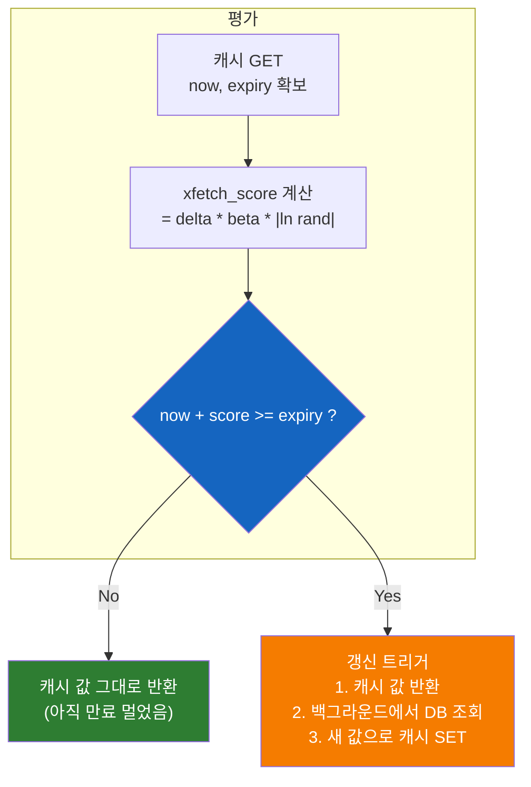
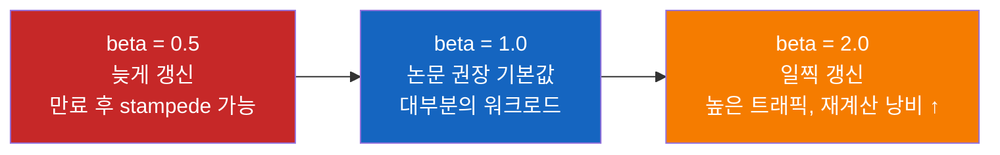
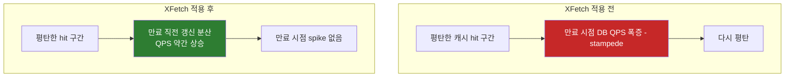

# 왜 XFetch는 락 없이도 캐시 스탬피드를 막을까

[기존 TIL — Redis 캐시 전략과 Cache Stampede 방어](Redis-캐시-전략과-Cache-Stampede-방어.md)에서 캐시 스탬피드 방어 전략 세 가지(Mutex, 확률적 조기 만료, 백그라운드 갱신)를 비교했다. 그중 **확률적 조기 만료** 의 정체가 바로 2015년 VLDB에서 발표된 **XFetch 알고리즘** 이다. 이번에는 한 알고리즘만 깊이 파고들어, 실무에서 어떻게 적용·튜닝·모니터링하는지 정리한다.

## 결론부터 말하면

XFetch는 만료 **직전** 에 각 요청이 "내가 미리 캐시를 갱신할지"를 **독립적이고 확률적으로** 결정한다. 락도 큐도 없고, 단지 만료가 가까워질수록 갱신 확률이 폭증할 뿐이다. 실무 적용은 5줄짜리 공식 하나면 끝난다. 핵심은 두 파라미터다.

| 파라미터 | 의미 | 권장값 |
|----------|------|--------|
| **β (beta)** | 조기 갱신 적극성. 클수록 더 일찍 갱신 | **1.0** (기본), 트래픽 매우 높으면 1.5~2.0 |
| **δ (delta)** | DB 재계산에 걸리는 **실측 시간** (초) | EWMA로 측정값 갱신 (고정값 X) |

아래 도식은 **δ = 2초, β = 1.0** 일 때의 직관적 예시다. 같은 트리거 시점이라도 δ·β가 크면 더 일찍부터 확률이 올라가고, 작으면 만료에 더 바짝 붙어서야 발화한다.


## 1. 왜 락(Mutex)이 아니라 확률인가?

캐시 스탬피드를 막는 가장 직관적인 방법은 **분산 락** 이다. "한 명만 DB 조회하고, 나머지는 기다려." 단순하고 효과 확실하다. 그런데 왜 논문은 굳이 확률적 방법을 제안했을까?

락 방식에는 세 가지 비용이 있다.

첫째, **대기 비용** 이다. 락을 얻지 못한 999명의 요청은 락 보유자가 DB 조회를 끝낼 때까지 멈춰 있어야 한다. DB 조회가 500ms 걸리면, 그 500ms 동안 응답 지연이 발생한다.

둘째, **락 자체의 분산 합의 비용** 이다. Redis 단일 노드라면 `SET NX EX` 한 번이면 되지만, Redis Sentinel/Cluster 환경에서 엄밀한 보증을 원하면 Redlock 같은 분산 합의가 필요하고, 그 자체가 추가 RTT를 만든다.

셋째, **락 보유자가 죽는 시나리오** 다. 락 TTL을 5초로 줬는데 GC stall로 10초 멈춰버리면, 다른 노드가 새 락을 얻은 사이에 늦게 깨어난 원래 보유자가 갱신을 시도해서 정합성이 깨진다.

XFetch는 이 모든 문제를 **다른 각도** 에서 푼다. "락으로 동시 접근을 막는 대신, **만료 자체가 동시에 일어나지 않도록** 시간 축으로 흩뿌리자." 만료 직전에 어느 한 요청이 미리 갱신해버리면, 다른 요청들은 새 데이터를 만나기 때문에 stampede가 애초에 발생하지 않는다.

## 2. XFetch의 핵심 공식

XFetch는 캐시를 읽을 때마다 다음 조건을 평가한다.

$$\text{now} - \delta \times \beta \times \ln(\text{rand}()) \geq \text{expiry}$$

이 식이 **참** 이면 **재계산을 트리거** 한다. 여기서 한 가지 짚고 가야 한다. **원 논문의 XFetch는 호출 스레드가 동기적으로** `RecomputeValue()`를 수행한 뒤 새 값을 캐시에 쓰고 그 값을 반환한다 — 즉, 트리거된 그 요청은 재계산 시간만큼 응답이 지연된다. 식이 거짓이면 그냥 캐시 값만 반환한다.

실무에서는 보통 이 동기 재계산을 **비동기 갱신 + stale 값 즉시 반환** (stale-while-revalidate)으로 변형해 결합한다. 트리거된 요청조차 기다리지 않게 만들면 응답 지연이 0에 수렴하기 때문이다. 3.1의 구현이 그 변형이다. 둘은 **시점 분산** 이라는 XFetch의 본질은 공유하되, 트리거된 요청을 동기로 처리할지 비동기로 처리할지가 다르다.

식이 직관적이지 않으니 부품별로 뜯어보자.

- `rand()`는 0과 1 사이의 균등 분포 난수다.
- `ln(rand())`는 0과 1 사이 값의 자연로그이므로 **항상 음수** 다. `rand()`가 1에 가까우면 0에 가까운 음수, 0에 가까우면 음의 무한대에 가깝다.
- `δ`는 **DB 재계산에 걸리는 시간** (초). DB 조회가 평균 0.5초 걸리면 δ = 0.5.
- `β`는 **적극성 계수** . 기본 1.0.

따라서 `δ × β × ln(rand())`는 항상 음수이고, "약간의 음수~큰 음수"의 분포를 가진다. 식을 이항하면 본질이 보인다.

$$\text{now} + \underbrace{|\delta \times \beta \times \ln(\text{rand}())|}_{\text{미래로 점프}} \geq \text{expiry}$$

즉, **"지금 시간에 약간의 미래 점프를 더했을 때, 그게 만료를 넘는다면 미리 갱신하라"** 는 의미다. 만료가 멀면 어지간한 점프로는 못 넘으므로 갱신 확률이 거의 0이다. 만료가 가까워질수록 작은 점프로도 넘기 쉬워지고, 만료 직후엔 항상 참이 되어 무조건 갱신한다.



여기서 **왜 하필 지수 분포(자연로그)인가** 가 논문의 핵심 기여다. Vattani 등은 "조기 갱신 낭비(early-expiration gap)"와 "stampede 발생 시 크기"의 trade-off가 **수학적으로 최소화** 되는 분포가 지수 분포임을 증명했다. 직관적으로는 "만료에 가까워질수록 확률이 폭증하되, 너무 일찍부터는 거의 발화하지 않는" 분포가 필요한데, 이걸 만족하는 가장 효율적인 함수가 `-ln(rand())`의 형태다.

## 3. 실무 구현 — Java/Spring 기준

### 3.1 가장 단순한 구현

먼저 외부 라이브러리 없이 Redis와 Lettuce 기반으로 구현해보자. 핵심은 **캐시에 값과 함께 만료 시각·재계산 시간을 같이 저장** 하는 것이다.

> **단위 일관성.** 2장의 공식에서는 가독성을 위해 δ를 **초** 단위로 설명했지만, 아래 Java 구현은 시스템 시각 API와 맞추어 모든 시간을 **밀리초(ms)** 로 통일한다. XFetch 공식은 좌변 `(now - expiry)`와 우변 `δ × β × ln(rand)`의 **단위만 일치하면** 동일하게 동작한다. 만약 본문의 권장값(β = 1.0, δ는 EWMA로 측정)을 그대로 코드에 옮길 때, δ가 ms 단위면 β는 그대로 두면 되고, 단위를 섞으면 갱신 확률 분포가 기대와 어긋난다.

```java
public class XFetchCache<T> {

    private final RedisTemplate<String, CacheEntry<T>> redis;
    private final double beta;

    public XFetchCache(RedisTemplate<String, CacheEntry<T>> redis, double beta) {
        this.redis = redis;
        this.beta = beta;
    }

    public T get(String key, Duration ttl, Supplier<T> loader) {
        CacheEntry<T> entry = redis.opsForValue().get(key);

        if (entry == null) {
            // Cold miss: 동기 로드 (이 경로는 stampede 가능성이 있어
            // Mutex와 결합하면 더 안전)
            return loadAndStore(key, ttl, loader, null);
        }

        if (shouldEarlyRefresh(entry)) {
            // 확률적 조기 갱신: 백그라운드로 갱신, 응답은 stale 값으로
            // 이전 entry를 넘겨야 expiry 누적 보정이 가능
            CompletableFuture.runAsync(() -> loadAndStore(key, ttl, loader, entry));
        }

        return entry.value;
    }

    private boolean shouldEarlyRefresh(CacheEntry<T> entry) {
        long now = System.currentTimeMillis();
        // ThreadLocalRandom — 고부하 환경에서 Math.random()의 공유 시드 경합 회피
        double rand = ThreadLocalRandom.current().nextDouble();
        // ln(rand())는 항상 음수 → -log로 양수화
        double xfetchScore = entry.deltaMs * beta * -Math.log(rand);
        return now + xfetchScore >= entry.expiryMs;
    }

    private T loadAndStore(String key, Duration ttl, Supplier<T> loader, CacheEntry<T> prev) {
        long start = System.currentTimeMillis();
        T value = loader.get();
        // deltaMs가 0이면 xfetchScore도 0이 되어 조기 갱신이 영구 비활성화된다 — 최소 1ms 보장
        // 실무에서는 이 raw 측정값을 그대로 쓰지 말고 4.1의 EWMA로 정제한 값을 저장한다
        long deltaMs = Math.max(1, System.currentTimeMillis() - start);

        // expiry 누적 보정: 이전 expiry 기준 + ttl (cold miss는 start 기준)
        // 이렇게 해야 조기 갱신이 반복되어도 사이클이 의도한 TTL로 유지된다
        // Math.max로 하한선 — 장애 후 재기동 등으로 prev.expiryMs가 한참 과거면
        // expiryMs가 과거가 되어 무한 재갱신 루프에 빠질 수 있으므로 방어
        long expiryMs = (prev != null)
            ? Math.max(start + ttl.toMillis(), prev.expiryMs + ttl.toMillis())
            : start + ttl.toMillis();
        CacheEntry<T> entry = new CacheEntry<>(value, expiryMs, deltaMs);

        // 물리 TTL = 논리 expiry까지 남은 시간 + 2δ (Grace Period 확보)
        long physicalTtlMs = (expiryMs - System.currentTimeMillis()) + 2 * deltaMs;
        redis.opsForValue().set(key, entry, Duration.ofMillis(physicalTtlMs));
        return value;
    }

    record CacheEntry<T>(T value, long expiryMs, long deltaMs) {}
}
```

이 구현의 핵심 포인트는 두 가지다.

**첫째, `delta`를 매번 실측해서 캐시에 함께 저장** 한다. DB 부하 상황이나 쿼리 복잡도가 바뀌면 재계산 시간이 변하는데, XFetch는 이 값에 민감하다. 고정값으로 두면 안 된다.

**둘째, 조기 갱신은 비동기로 던지고 응답은 stale 값을 즉시 반환** 한다. 이게 락 방식과의 결정적 차이다. 사용자는 절대 기다리지 않는다.

> **주의 — expiry 누적 보정.** 위 코드는 조기 갱신 시 새 `expiryMs`를 `prev.expiryMs + ttl`로 잡아 **누적 보정** 을 적용한 형태다. 만약 보정 없이 `now + ttl`로 새로 잡으면 매번 만료가 미래로 더 밀려, 갱신 사이클이 의도한 TTL보다 점점 짧아지는 누적 효과가 생긴다. 논문도 같은 보정(`ttl ← ttl + (expiry - now)`)을 제안한다. 트래픽 절감이 중요한 워크로드에서는 이 보정이 사실상 필수다.

> **주의 — Redis 물리 TTL과 Grace Period.** 위 코드는 Redis 물리 TTL을 `ttl + 2 × δ`로 잡아 **Grace Period** 를 확보한다. 이 보정이 없으면 비동기 갱신이 끝나기 전에 키가 먼저 만료·삭제되고, 다음 요청은 cold miss를 만나 동기 로드 경로(스탬피드가 다시 발생할 수 있는 구간)로 빠진다. **Grace Period는 SWR 변형 XFetch의 단순한 최적화가 아니라 필수 전제 조건** 이다.

> **주의 — 전용 Executor 사용.** `CompletableFuture.runAsync(...)` 한 줄 호출은 기본적으로 `ForkJoinPool.commonPool()`에서 실행된다. DB·Redis I/O 작업이 공용 풀을 점유하면 병렬 스트림 등 다른 비동기 코드까지 영향을 받는다. 실무에서는 캐시 갱신 전용 `ExecutorService`(예: `Executors.newFixedThreadPool(N)`)를 만들어 두 번째 인자로 주입한다.

### 3.2 in-flight 중복 갱신 방지

위 구현에는 빈틈이 하나 있다. **같은 노드** 에서 동시에 두 요청이 조기 갱신 조건을 만족하면 둘 다 DB를 친다. 노드 내부에서는 락이 싸므로 in-flight tracking으로 막아준다.

```java
private final ConcurrentHashMap<String, Boolean> inFlight = new ConcurrentHashMap<>();

private void triggerRefresh(String key, Duration ttl, Supplier<T> loader, CacheEntry<T> prev) {
    // putIfAbsent 패턴 — 노드 내에서 같은 키 갱신은 1회만
    if (inFlight.putIfAbsent(key, Boolean.TRUE) == null) {
        CompletableFuture.runAsync(() -> {
            try {
                // prev를 그대로 전달해야 expiry 누적 보정이 유지된다
                loadAndStore(key, ttl, loader, prev);
            } finally {
                inFlight.remove(key);
            }
        });
    }
}
```

이제 한 노드에서 1초에 1만 개 요청이 들어와도, 그 노드에서 발생하는 갱신은 키당 1회로 직렬화된다. 노드가 10대면 최악의 경우 10개 DB 쿼리가 발생할 수 있는데, 이것조차 막고 싶다면 Redis 분산 락을 **얇게** 결합한다. (다음 절)

### 3.3 Mutex와의 하이브리드 — 실무 권장 조합

XFetch만으로는 100% 보장이 아니다. 운 나쁘게도 정말 동시에 조기 갱신이 trigger되거나, cold miss(캐시가 통째로 없는 상태)에서는 stampede가 발생할 수 있다. **확률적 조기 갱신(정상 경로) + 짧은 Mutex(폴백)** 가 실무 권장 조합이다.

```java
private T loadAndStoreWithLock(String key, Duration ttl, Supplier<T> loader, CacheEntry<T> prev) {
    String lockKey = "lock:" + key;
    String token = UUID.randomUUID().toString();

    // SET NX EX — 짧은 락(2~5초), 토큰 기반
    Boolean acquired = redis.opsForValue()
        .setIfAbsent(lockKey, token, Duration.ofSeconds(5));

    if (Boolean.TRUE.equals(acquired)) {
        try {
            return loadAndStore(key, ttl, loader, prev);
        } finally {
            // Lua로 compare-and-delete (다른 사람 락 안 지우게)
            redis.execute(UNLOCK_SCRIPT, List.of(lockKey), token);
        }
    }

    // 락 실패: 짧은 재시도 루프로 캐시가 채워지길 기다림
    // sleep 한 번 + 즉시 loader.get()은 락 보유자의 DB 조회가 길면 stampede 재발
    for (int i = 0; i < 10; i++) {
        sleep(100);
        CacheEntry<T> entry = redis.opsForValue().get(key);
        if (entry != null) return entry.value;
    }
    // 1초 기다려도 안 채워지면 stale 값으로라도 폴백, 그것도 없으면 예외
    if (prev != null) return prev.value;
    throw new CacheLoadTimeoutException(key);
}
```

핵심은 **언제 락을 쓰느냐** 다. 정상 경로(만료 전 조기 갱신)는 락 없이 비동기로 돌고, **cold miss 또는 만료가 이미 지난 동기 로드 시에만** 락을 건다. 이렇게 하면 99% 트래픽은 락 비용 없이 흐르고, 진짜 위험한 순간만 직렬화된다.

## 4. 파라미터 튜닝 — δ와 β를 어떻게 정할까

### 4.1 δ (delta)는 측정값이다

가장 흔한 실수는 δ를 임의로 정하는 것이다. 논문은 **실제 재계산 시간** 을 쓰라고 명시한다.

| δ 측정 전략 | 장점 | 단점 |
|------------|------|------|
| **매 갱신 시 실측값 그대로** | 구현 단순 | 노이즈에 민감 (한 번 느린 쿼리에 좌우) |
| **EWMA (지수가중이동평균)** | 추세 반영, 안정적 | 약간 더 복잡 |
| **상수값 (예: 1초)** | 단순 | DB 부하 변화에 적응 못 함 |

실무에서는 **EWMA** 가 정석이다. 새 측정값이 들어올 때마다 부드럽게 갱신한다.

```java
// α = 0.2 정도면 적당히 빠르게 추세를 따라간다
private long updateDelta(long oldDeltaMs, long newMeasuredMs) {
    double alpha = 0.2;
    return (long) (alpha * newMeasuredMs + (1 - alpha) * oldDeltaMs);
}
```

### 4.2 β (beta)는 트래픽으로 정한다

β는 "얼마나 일찍 갱신을 시도할 것인가"를 조절한다.



| 상황 | 권장 β | 이유 |
|------|--------|------|
| 일반적인 웹 서비스 | **1.0** | 논문 기본값. 90% 이상 케이스 충분 |
| 초고트래픽 키 (인기 상품, 메인 피드) | **1.5 ~ 2.0** | 만료 직전에 stampede 발생 가능성 ↑, 일찍 갱신해서 안전 마진 확보 |
| 재계산 비용이 매우 비싼 키 | **0.7 ~ 1.0** | 갱신 자체가 비싸므로 너무 자주 미리 하지 말 것 |

β > 1로 올릴수록 만료 전 갱신 빈도가 늘어난다. **무료가 아니다** — DB 부하가 늘어난다. 모니터링하면서 적정값을 찾아야 한다.

## 5. Caffeine의 refreshAfterWrite와 무엇이 다른가

Java 진영에서 in-memory 캐시로 가장 많이 쓰이는 **Caffeine** 도 비슷한 기능을 제공한다.

```java
Caffeine.newBuilder()
    .expireAfterWrite(10, TimeUnit.MINUTES)
    .refreshAfterWrite(8, TimeUnit.MINUTES)  // 8분 후 첫 요청 시 비동기 갱신
    .build(key -> loadFromDb(key));
```

겉으로는 비슷해 보이지만 **결정적 차이** 가 있다.

| 특성 | Caffeine refreshAfterWrite | XFetch |
|------|---------------------------|--------|
| 갱신 트리거 | **고정 시각** 도달 후 첫 요청 | **확률** 적으로 분산 |
| 동시 갱신 위험 | 8분 시점에 모든 노드가 동시에 trigger 가능 | 노드/요청별로 시점이 흩어짐 |
| 분산 환경 적합도 | 단일 JVM 캐시에 적합 | **분산 캐시(Redis)에 적합** |
| 파라미터 튜닝 | refresh 시각만 결정 | δ, β로 분포 조절 |

요점은 이렇다. **Caffeine은 단일 JVM 내부에서만 동작하는 in-memory 캐시** 라서 "모든 노드가 동시에 8분 시점에 갱신 시도"라는 시나리오가 노드 수만큼 분산되어 그나마 완화된다. 하지만 **공유 Redis 캐시는 모든 노드가 같은 키의 같은 만료 시각을 본다.** 8분 시점이 되면 100대 서버가 동시에 trigger한다. 이때 XFetch의 **시점 분산** 이 결정적이다.

실무에서는 **L1 (Caffeine) + L2 (Redis with XFetch)** 의 multi-level 구조가 흔하다. L1은 짧은 TTL로 hot key를 빠르게 서빙하고, L2는 XFetch로 stampede 없이 갱신한다.

## 6. 효과 측정 — 모니터링 지표

XFetch가 잘 동작하는지 알려면 다음 지표를 봐야 한다.

| 지표 | 의미 | 정상값 |
|------|------|--------|
| **Cache miss rate** | 캐시 miss 비율 | TTL 대비 낮을수록 좋음 |
| **DB query QPS per key** | 키당 DB 쿼리 빈도 | 만료 시점에 spike가 없어야 함 |
| **Early refresh count** | XFetch 트리거 횟수 | 너무 많으면 β 낮춤 |
| **Refresh latency (p99)** | 비동기 갱신 소요 시간 | δ 측정값과 일치해야 함 |

Grafana에서 봐야 할 그래프는 **"만료 시점 부근의 DB QPS"** 다. XFetch 적용 전후를 비교하면, 적용 후엔 만료 spike가 사라지고 **시간축에 매끄럽게 분산** 된 갱신 패턴이 보여야 한다.



## 7. 정리

### 핵심 포인트

1. **XFetch는 "분산"이 본질이다**
   - 락은 동시 접근을 막아 stampede를 피하고, XFetch는 **만료 시점 자체를 시간 축에 분산** 시킨다.
   - 그래서 락 대기가 없고 응답 지연이 없다.

2. **파라미터는 두 개뿐**
   - **δ** : 실제 재계산 시간. EWMA로 측정값을 갱신해야 한다. 상수로 두면 안 된다.
   - **β** : 적극성. **기본 1.0**, 초고트래픽 키만 1.5~2.0으로 올린다.

3. **실무 권장 조합**
   - 정상 경로: XFetch (확률적 조기 갱신, 락 없음)
   - 폴백: Mutex Lock (cold miss 또는 동기 로드 시에만)
   - in-flight tracking: 노드 내 중복 갱신 차단

4. **Caffeine `refreshAfterWrite`와 혼동 금지**
   - Caffeine은 **고정 시각** 트리거 → 분산 환경에서 동시 trigger 가능
   - XFetch는 **확률 분포** 트리거 → 시점이 자연스럽게 흩어짐
   - 공유 캐시(Redis)에는 XFetch가 정답

5. **모니터링이 튜닝의 핵심**
   - "만료 시점 부근의 DB QPS spike가 사라졌는가"가 1차 지표
   - 너무 많은 early refresh가 발생하면 β를 낮춘다

---

## 출처

- [Optimal Probabilistic Cache Stampede Prevention (Vattani et al., VLDB 2015)](https://cseweb.ucsd.edu/~avattani/papers/cache_stampede.pdf) — 원 논문 PDF
- [VLDB Endowment 공식 페이지](http://www.vldb.org/pvldb/vol8/p886-vattani.pdf) — VLDB 페이지의 정식 사본
- [Internet Archive — Preventing Cache Stampede with Redis & XFetch (RedisConf17)](https://github.com/internetarchive/xfetch) — `stampede.php` 기반 RedisConf 2017 PHP 테스트 하네스/레퍼런스 구현
- [Avoiding Cache Stampede with XFetch (Kert on Software)](https://pjatk.in/avoiding-cache-stampede.html) — 실무 적용 사례 분석
- [How to Implement Probabilistic Early Expiration (OneUptime)](https://oneuptime.com/blog/post/2026-01-30-probabilistic-early-expiration/view) — JavaScript 구현 예제
- [Caffeine — refreshAfterWrite 공식 문서](https://github.com/ben-manes/caffeine/wiki/Refresh) — Caffeine refresh 동작 명세
