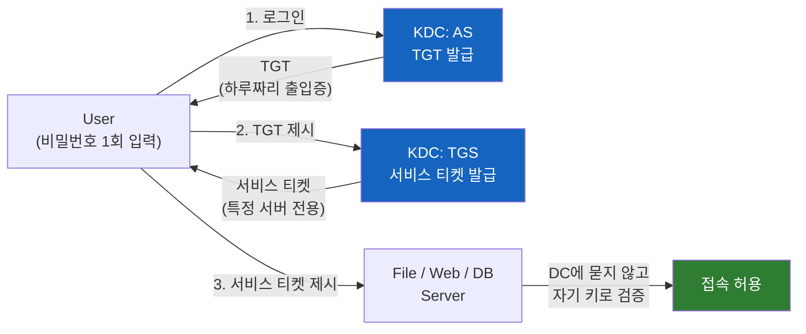
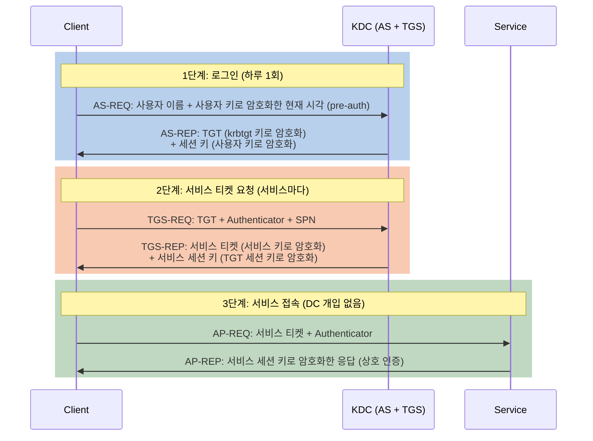

# Kerberos는 어떻게 비밀번호를 보내지 않고 로그인시킬까

아침에 회사 PC에 한 번 로그인하면 파일 서버, 사내 웹, 메일까지 비밀번호를 다시 묻지 않는다. 각 서버는 내 비밀번호를 모르는데, 어떻게 나를 믿는 걸까? 그리고 왜 Microsoft는 NTLM을 버리고 이 방식으로 가려는 걸까?

## 결론부터 말하면

**Kerberos는 모두가 믿는 제3자(KDC)가 발급한 "위조할 수 없는 티켓"으로 신원을 증명하는 프로토콜이다.** 비밀번호는 로그인 순간 내 PC 안에서 키로 바뀌어 쓰일 뿐 네트워크로 나가지 않고, 이후에는 시간 제한이 있는 티켓만 오간다. 서버는 티켓을 자기 키로 열어보는 것만으로 나를 확인하므로, 매 접속마다 도메인 컨트롤러에 물어볼 필요도 없다.

Microsoft가 만든 프로토콜이 아니라 1980년대 MIT에서 만든 개방 표준(현재 RFC 4120, Kerberos V5)이고, Windows는 2000년부터 Active Directory의 기본 인증으로 이를 구현해 왔다. Hadoop, Kafka, PostgreSQL, Spring Security도 같은 Kerberos를 쓴다.



| 비교 | NTLM | Kerberos |
|------|------|----------|
| 증명 방식 | 서버의 challenge에 매번 응답 | KDC가 발급한 티켓 제시 |
| 서버 인증(상호 인증) | 없음 → Relay 공격에 취약 | 있음 (요청 시). 단 서비스 단 signing·channel binding은 별도로 필요 |
| 서버가 검증할 때 | 매번 DC에 확인(pass-through) | 자기 키로 티켓을 직접 복호화 |
| 탈취한 자격 증명 재사용 | NT hash만 있으면 어디서든 응답 생성(Pass-the-Hash) | 수명 제한된 티켓, 대상 서비스 전용 |
| 전제 조건 | 거의 없음 | KDC 접근, SPN, 시계 동기화 |

---

## 1. 왜 Kerberos가 필요했을까 — 열린 캠퍼스 네트워크의 고민

### 1.1 1980년대 MIT, Project Athena

1983년 MIT는 Project Athena라는 이름으로 캠퍼스 전체에 수천 대의 워크스테이션을 깔았다. 학생 누구나 아무 워크스테이션에 앉아 파일 서버, 프린트 서버, 메일 서버를 쓸 수 있어야 했다. 문제는 이 네트워크가 **신뢰할 수 없다** 는 점이었다. 학생 한 명이 자기 PC에서 패킷을 엿보면 회선 위의 모든 것이 보인다.

이 환경에서 "내가 누구인지"를 증명하는 방법을 생각해 보자.

- **비밀번호를 그대로 보낸다** → 엿보는 순간 탈취된다.
- **서버마다 모든 사용자의 비밀번호를 저장한다** → 서버가 수십 대면 비밀번호도 수십 군데에 흩어지고, 한 대만 뚫려도 전체가 위험하다.
- **서버가 매번 중앙 서버에 물어본다** → 가능하지만, 비밀번호나 그 대용품이 여전히 회선을 오가야 한다.

필요한 것은 세 가지였다. 비밀번호가 회선에 실리지 않을 것, 서버들이 사용자 비밀번호를 몰라도 될 것, 한 번 로그인하면 여러 서버를 쓸 수 있을 것(Single Sign-On).

### 1.2 아이디어: 모두가 믿는 매표소

해법은 놀이공원의 매표소와 비슷하다. 놀이기구 직원은 손님의 신분증을 일일이 확인하지 않는다. 매표소가 발급한 **위조할 수 없는 티켓** 만 확인한다. 매표소만 신원을 확인하면, 나머지는 티켓을 믿으면 된다.

Kerberos에서 이 매표소가 **KDC(Key Distribution Center)** 다. KDC는 모든 사용자와 모든 서비스의 **비밀 키(long-term key)** 를 알고 있는 유일한 존재다. 사용자의 키는 비밀번호에서 유도되고, 서비스의 키는 그 서비스가 실행되는 계정(서비스 계정이나 컴퓨터 계정)의 비밀번호에서 유도된다. Windows에서는 모든 도메인 컨트롤러에서 KDC가 동작하고, Active Directory를 계정 데이터베이스로 쓴다.

이름도 여기서 왔다. Kerberos(케르베로스)는 그리스 신화에서 저승 문을 지키는 머리 셋 달린 개인데, 프로토콜의 세 당사자인 **클라이언트, 서비스, KDC** 를 뜻한다.

---

## 2. 핵심 개념: 티켓 두 장으로 동작한다

### 2.1 왜 티켓은 위조할 수 없을까

"티켓"은 결국 데이터 덩어리다. 그런데 왜 사용자가 위조할 수 없을까?

비밀은 **티켓을 누구의 키로 암호화하느냐** 에 있다. KDC가 파일 서버용 티켓을 만들 때, 티켓 내용(사용자 이름, 유효 시간, 세션 키 등)을 **파일 서버의 비밀 키** 로 암호화한다. 사용자는 이 티켓을 들고 다니지만 열어볼 수도, 고칠 수도 없다. 파일 서버의 키를 모르기 때문이다. 반면 파일 서버는 자기 키로 티켓을 열어보고, 그 안에 KDC만 넣을 수 있는 정보가 들어 있으니 "KDC가 이 사용자를 확인했구나"라고 믿을 수 있다.

그렇다면 KDC는 이 티켓을 어떤 서버의 키로 암호화할지 어떻게 알까? 사용자가 접속하려는 서비스를 **SPN(Service Principal Name)** 으로 지정하기 때문이다. SPN은 `HTTP/webapp.corp.example.com`처럼 "서비스 종류/호스트 이름" 형태의 이름이고, Active Directory에서 특정 계정에 등록된다. KDC는 SPN으로 계정을 찾고, 그 계정의 키로 티켓을 암호화한다. SPN이 등록되지 않았거나, Windows 기본 설정에서 서버를 IP 주소로 부르면(`TryIPSPN`과 IP 기반 SPN을 따로 구성하지 않는 한) Kerberos가 실패하고 NTLM으로 내려가는 이유가 바로 이것이다.

### 2.2 왜 티켓이 두 종류일까: TGT와 서비스 티켓

서비스마다 티켓이 필요하다면, 서비스에 접속할 때마다 비밀번호를 다시 입력해야 할까? 그러면 Single Sign-On이 안 된다. 그렇다고 비밀번호를 PC 메모리에 계속 들고 있으면 위험하다.

그래서 Kerberos는 티켓을 두 단계로 나눴다.

| 티켓 | 무엇에 쓰나 | 누구의 키로 암호화 | 비유 |
|------|------------|-------------------|------|
| **TGT** (Ticket-Granting Ticket) | 서비스 티켓을 "발급받기 위한" 티켓 | KDC 자신의 키(`krbtgt` 계정) | 놀이공원 자유이용권 팔찌 |
| **서비스 티켓** (Service Ticket) | 특정 서비스에 접속 | 대상 서비스 계정의 키 | 놀이기구별 탑승권 |

로그인할 때 비밀번호로 TGT를 한 번 받아두면, 이후에는 TGT만 보여주고 필요한 서비스 티켓을 계속 받을 수 있다. 비밀번호에서 유도한 키는 TGT를 받는 순간 이후로 필요 없다. Active Directory의 기본 TGT 수명은 10시간이라, "아침에 한 번 로그인하면 하루 종일" 이 된다.

### 2.3 전체 흐름

KDC는 논리적으로 두 역할을 한다. TGT를 발급하는 **AS(Authentication Service)** 와 서비스 티켓을 발급하는 **TGS(Ticket-Granting Service)** 다. 여기에 등장하는 **세션 키** 는 KDC가 그때그때 만들어 주는 임시 대칭 키로, 장기 키(비밀번호 유도 키) 대신 쓰여서 장기 키가 노출될 기회를 줄인다. **Authenticator** 는 "지금 이 순간 내가 이 세션 키를 갖고 있다"를 보여주는 증표로, 현재 시각을 세션 키로 암호화한 것이다.



각 단계에서 무슨 일이 일어나는지 따라가 보자.

**1단계 (AS 교환):** 사용자가 비밀번호를 입력하면 PC는 그것으로 사용자 키를 만들고, 현재 시각을 그 키로 암호화해 보낸다(pre-authentication). KDC는 데이터베이스에 있는 같은 키로 이를 풀어 시각이 맞으면 사용자가 진짜라고 판단한다. 응답으로 TGT와, 사용자 키로 감싼 세션 키를 준다. 이 세션 키를 꺼낼 수 있는 것은 진짜 비밀번호를 아는 사용자뿐이다. 비밀번호 자체는 한 번도 전송되지 않았다.

**2단계 (TGS 교환):** 파일 서버에 접속하려면 TGT와 Authenticator(세션 키로 암호화한 현재 시각), 그리고 접속할 SPN을 보낸다. KDC는 자기 키로 TGT를 열어 세션 키를 꺼내고, 그 세션 키로 Authenticator를 검증한다. 문제가 없으면 파일 서버 키로 암호화한 서비스 티켓을 준다.

**3단계 (AP 교환):** 클라이언트가 서비스 티켓을 파일 서버에 제시한다. 파일 서버는 자기 키로 티켓을 열어 사용자 정보와 서비스 세션 키를 얻고, Authenticator를 검증한다. **티켓 검증 자체에는 DC 왕복이 필요 없다.** (Windows에서는 티켓 안의 권한 정보인 PAC를 검증하느라 DC와 추가 통신이 생기는 경우가 있다.) 그리고 상호 인증을 요청했다면 서버가 같은 세션 키로 응답을 암호화해 돌려준다. 진짜 서버만 자기 키로 티켓을 열어 세션 키를 얻을 수 있으니, 클라이언트도 서버가 진짜임을 확인한다. NTLM에 없던 바로 그 부분이다.

### 2.4 왜 시계가 맞아야 할까

Authenticator에 굳이 현재 시각을 넣는 이유는 **재전송(replay) 공격** 때문이다. 공격자가 회선에서 AP-REQ를 통째로 녹화했다가 나중에 다시 보내면 어떨까? 서버는 Authenticator의 시각이 허용 범위(기본 5분) 밖이면 거부하고, 범위 안에서도 이미 본 Authenticator는 거부한다. 그래서 Kerberos 환경에서는 모든 PC와 서버의 시계가 맞아야 하고, 시계가 5분 넘게 어긋나면 "KRB_AP_ERR_SKEW" 같은 오류로 로그인이 실패한다. Active Directory가 도메인 전체 시간 동기화를 챙기는 이유다.

---

## 3. 그래서 NTLM보다 무엇이 나은가

NTLM의 대표적인 두 공격과 비교하면 차이가 분명해진다. (NTLM 쪽 이야기는 [NTLM은 왜 30년 만에 퇴출될까](./NTLM은-왜-30년-만에-퇴출될까.md)에서 자세히 다룬다.)

| 공격 | NTLM | Kerberos |
|------|------|----------|
| **Relay** (중간에서 인증을 다른 서버로 전달) | 서버를 확인하지 않아, 받은 인증을 아무 서버에나 중계하기 쉬움 | 서비스 티켓은 특정 서비스 키로 암호화되어 다른 서비스에서 쓸 수 없고, 상호 인증으로 가짜 서버를 식별. 단 같은 대상 서비스로의 중계(Kerberos Relay)는 여전히 가능해 signing·channel binding이 필요 |
| **Pass-the-Hash** (훔친 해시로 로그인) | NT hash 하나로 어느 서버든 응답 가능 | 서비스 접속에는 장기 키가 아니라 수명 제한된 티켓과 세션 키가 쓰임 |
| **Replay** (녹화 후 재전송) | 일회용 서버 challenge로 단순 재전송은 막음 | 타임스탬프 + 재사용 탐지 |
| **서버 부하** | 서버가 매 인증마다 DC에 확인 | 서버가 티켓을 스스로 검증 |

Relay 행을 눈여겨보자. Kerberos는 NTLM Relay처럼 "받은 인증을 아무 서버에나 들이미는" 공격을 구조적으로 어렵게 만들지만, Relay를 완전히 없애지는 않는다. 2022년 KrbRelayUp처럼 Kerberos 인증을 원래 대상 서비스로 중계하는 기법도 있었다. 그래서 LDAP signing, SMB signing, channel binding 같은 서비스 단 보호는 Kerberos 환경에서도 여전히 켜둬야 한다.

그런데 NTLM이 Kerberos 시대에도 30년을 버틴 이유는 반대로 **Kerberos의 전제 조건** 에 있다. 티켓을 받으려면 클라이언트가 KDC(포트 88)에 닿아야 하고, 서버는 SPN으로 불려야 하고, 계정은 KDC가 아는 도메인 계정이어야 한다. 이 조건이 깨지면 Windows는 NTLM으로 내려갔다. Microsoft가 2026년 하반기 정식 도입 예정인 **IAKerb** (DC에 닿지 못하는 클라이언트의 Kerberos 메시지를 애플리케이션 서버가 대신 KDC로 중계)와 **Local KDC** (로컬 계정용으로 각 머신에 두는 KDC)는 바로 이 전제 조건을 완화하려는 기능이다.

---

## 4. Kerberos도 만능은 아니다

Kerberos로 바꾼다고 공격이 사라지지는 않는다. 공격 대상이 "해시"에서 "티켓과 키"로 옮겨갈 뿐이다. 보안 담당자라면 아래 이름들은 알아두는 게 좋다.

| 공격 | 원리 | 대응 |
|------|------|------|
| **Kerberoasting** | 도메인 사용자는 누구나 SPN이 있는 서비스의 티켓을 요청할 수 있다. 티켓은 서비스 계정 키로 암호화되어 있으므로, 받아서 오프라인으로 비밀번호를 대입해 본다 | 서비스 계정에 길고 무작위한 비밀번호, gMSA(자동 회전 관리형 서비스 계정), RC4 비활성화 |
| **Pass-the-Ticket** | 메모리에 캐시된 TGT나 서비스 티켓을 훔쳐 다른 PC에서 재사용 | Credential Guard, 짧은 티켓 수명 |
| **Overpass-the-Hash** | RC4 암호화 유형에서는 사용자의 Kerberos 키가 NT hash와 같다. 훔친 NT hash로 TGT를 요청 | RC4 비활성화, AES 전용, Protected Users 그룹 |
| **Golden Ticket** | `krbtgt` 계정의 키를 탈취하면 아무 사용자의 TGT든 위조 가능 | DC 보호, `krbtgt` 비밀번호를 티켓 최대 수명(기본 10시간) 이상 간격을 두고 2회 재설정 |
| **Silver Ticket** | 특정 서비스 계정의 키를 탈취하면 KDC를 거치지 않고 그 서비스용 티켓을 위조. 서버가 DC에 묻지 않고 검증하므로 DC 로그에 흔적이 거의 없다 | 서비스 계정 비밀번호 관리(gMSA), PAC 검증 |

여기서 반복해서 등장하는 **RC4** 가 중요하다. RC4는 Kerberos가 오랫동안 호환성을 위해 지원해 온 낡은 암호화 유형인데, 키가 NT hash와 같아 Kerberoasting과 Overpass-the-Hash를 쉽게 만든다. Microsoft는 NTLM 퇴출과 병행해 2026년 들어 도메인 컨트롤러가 명시적 설정이 없는 계정에 AES만 쓰도록 기본값을 단계적으로 바꾸고 있다. 즉 **"NTLM에서 Kerberos로"는 사실 "NTLM + RC4에서 AES 기반 Kerberos로"** 다.

또 하나 실무에서 자주 부딪히는 것이 **이중 홉(double-hop)** 문제다. 사용자 → 웹 서버 → DB 서버처럼 중간 서버가 사용자 신분으로 다시 다른 서버에 접속해야 할 때, 웹 서버는 사용자의 TGT를 갖고 있지 않으므로 그냥은 안 된다. 이때는 위임(delegation)을 설정해야 하는데, 아무 서비스로나 위임하는 Unconstrained Delegation은 위험하므로 대상을 제한하는 Constrained Delegation이나 리소스 기반 제한 위임(RBCD)을 쓴다.

---

## 5. 실무에서 마주치는 Kerberos

### 5.1 내 티켓 보기

```powershell
# Windows: 현재 로그온 세션의 티켓 캐시
klist
#  #0> Client: alice @ CORP.EXAMPLE.COM
#      Server: krbtgt/CORP.EXAMPLE.COM @ CORP.EXAMPLE.COM   <- TGT
#      KerbTicket Encryption Type: AES-256-CTS-HMAC-SHA1-96
#  #1> Client: alice @ CORP.EXAMPLE.COM
#      Server: cifs/fileserver01.corp.example.com @ CORP.EXAMPLE.COM  <- 파일 서버 서비스 티켓
```

`krbtgt/...` 가 TGT이고, 그 아래가 지금까지 받은 서비스 티켓이다. 암호화 유형이 `RSADSI RC4-HMAC` 로 나온다면 RC4 정리 대상이다. macOS나 Linux에서는 `kinit alice@CORP.EXAMPLE.COM` 으로 TGT를 받고 `klist` 로 확인한다(MIT Kerberos 도구).

### 5.2 Java/Spring: SPNEGO로 사내 SSO 붙이기

웹 애플리케이션에서 Kerberos는 HTTP의 `Negotiate` 인증(SPNEGO)으로 쓰인다. 서버가 `401` 과 `WWW-Authenticate: Negotiate` 를 보내면, 도메인 PC의 브라우저는 `HTTP/<호스트>` SPN으로 서비스 티켓을 받아 `Authorization: Negotiate <토큰>` 에 실어 보낸다. 사용자는 로그인 화면을 보지 않는다.

서버 쪽은 서비스 계정의 키를 담은 **keytab** 파일로 티켓을 검증한다. keytab은 KDC가 티켓을 암호화할 때 쓴 바로 그 서비스 키를 파일로 꺼내둔 것이다. Spring Security Kerberos에서는 대략 다음과 같다.

```java
@Bean
SunJaasKerberosTicketValidator ticketValidator() {
    var validator = new SunJaasKerberosTicketValidator();
    validator.setServicePrincipal("HTTP/webapp.corp.example.com@CORP.EXAMPLE.COM"); // AD에 등록한 SPN
    validator.setKeyTabLocation(new FileSystemResource("/etc/webapp/webapp.keytab")); // 서비스 키
    return validator;
}

@Bean
KerberosServiceAuthenticationProvider kerberosProvider(UserDetailsService uds) {
    var provider = new KerberosServiceAuthenticationProvider();
    provider.setTicketValidator(ticketValidator()); // 티켓을 DC에 묻지 않고 keytab으로 직접 검증
    provider.setUserDetailsService(uds);           // 권한은 보통 LDAP에서 조회
    return provider;
}
// + SpnegoEntryPoint(401 Negotiate 응답), SpnegoAuthenticationProcessingFilter 등록
```

여기서 겪는 오류는 대부분 2절의 원리로 설명된다. 브라우저가 서버를 IP나 SPN과 다른 이름으로 부르면 티켓을 못 받아 NTLM 토큰(`TlRMTVNTUA...`)이 오고, keytab의 키 버전(kvno)이 AD의 서비스 계정 비밀번호 변경을 따라가지 못하면 복호화가 실패하고, 서버 시계가 어긋나면 skew 오류가 난다. 신원 확인은 Kerberos가, 그룹·권한 조회는 LDAP이 맡는 조합이 일반적이다. ([LDAP — 왜 사내 시스템들은 로그인을 LDAP에 물어볼까](./LDAP-왜-사내-시스템들은-로그인을-LDAP에-물어볼까.md) 참고)

---

## 6. 정리

### 핵심 포인트

1. **Kerberos는 비밀번호 대신 위조할 수 없는 티켓으로 인증한다**
   - 티켓은 대상 서비스의 키로 암호화되어 사용자는 열거나 고칠 수 없고, 서비스는 자기 키로 열어 DC 없이 검증한다
   - 비밀번호는 로그인 순간 PC 안에서 키로 바뀔 뿐 네트워크로 나가지 않는다

2. **TGT와 서비스 티켓, 두 단계가 Single Sign-On을 만든다**
   - 로그인 때 TGT를 한 번 받고(AS), 이후 서비스마다 TGT로 서비스 티켓을 받는다(TGS)
   - 서비스 접속(AP)에서 상호 인증을 요청해 서버 신원도 확인할 수 있고, 서비스 전용 티켓이 NTLM식 Relay를 어렵게 만든다 (Kerberos Relay까지 막으려면 signing·channel binding이 필요)

3. **편리함의 대가는 전제 조건이다**
   - KDC 접근, SPN(이름 기반 호출), 시계 동기화(기본 5분)가 깨지면 실패한다
   - 이 조건 때문에 Windows는 NTLM fallback을 남겨뒀고, IAKerb·Local KDC가 이를 완화하려 한다

4. **Kerberos도 공격 표면이 있다**
   - Kerberoasting, Pass-the-Ticket, Golden Ticket, 그리고 RC4가 남아 있다면 Overpass-the-Hash
   - 진짜 목표는 "NTLM + RC4"에서 "AES 기반 Kerberos"로의 전환이다

관련 노트: [NTLM은 왜 30년 만에 퇴출될까](./NTLM은-왜-30년-만에-퇴출될까.md), [LDAP — 왜 사내 시스템들은 로그인을 LDAP에 물어볼까](./LDAP-왜-사내-시스템들은-로그인을-LDAP에-물어볼까.md)

---

## 출처

- [Kerberos authentication overview in Windows Server - Microsoft Learn](https://learn.microsoft.com/en-us/windows-server/security/kerberos/kerberos-authentication-overview) - 공식 문서
- [RFC 4120: The Kerberos Network Authentication Service (V5)](https://www.rfc-editor.org/rfc/rfc4120) - 표준 명세
- [MS-KILE: Kerberos Protocol Extensions - Microsoft Learn](https://learn.microsoft.com/en-us/openspecs/windows_protocols/ms-kile/b4af186e-b2ff-43f9-b18e-eedb366abf13) - Windows 구현 명세
- [Advancing Windows security: Disabling NTLM by default - Windows IT Pro Blog](https://techcommunity.microsoft.com/blog/windows-itpro-blog/advancing-windows-security-disabling-ntlm-by-default/4489526) - IAKerb, Local KDC (2026-01-29)
- [Detect and Remediate RC4 Usage in Kerberos - Microsoft Learn](https://learn.microsoft.com/en-us/windows-server/security/kerberos/detect-remediate-rc4-kerberos) - RC4 기본값 비활성화
- [Spring Security Kerberos Reference](https://docs.spring.io/spring-security-kerberos/reference/) - SPNEGO 설정
- [Kerberos: The Network Authentication Protocol - MIT](https://web.mit.edu/kerberos/) - MIT Kerberos
