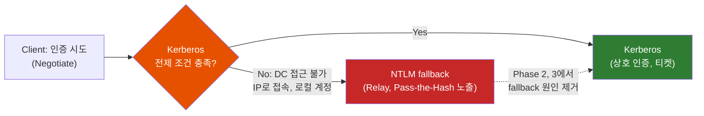
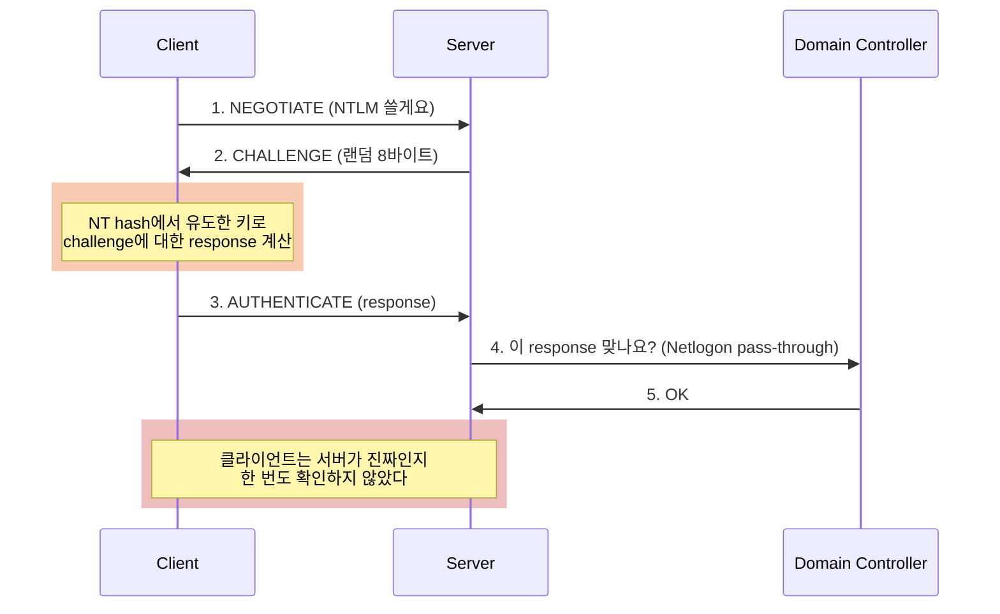
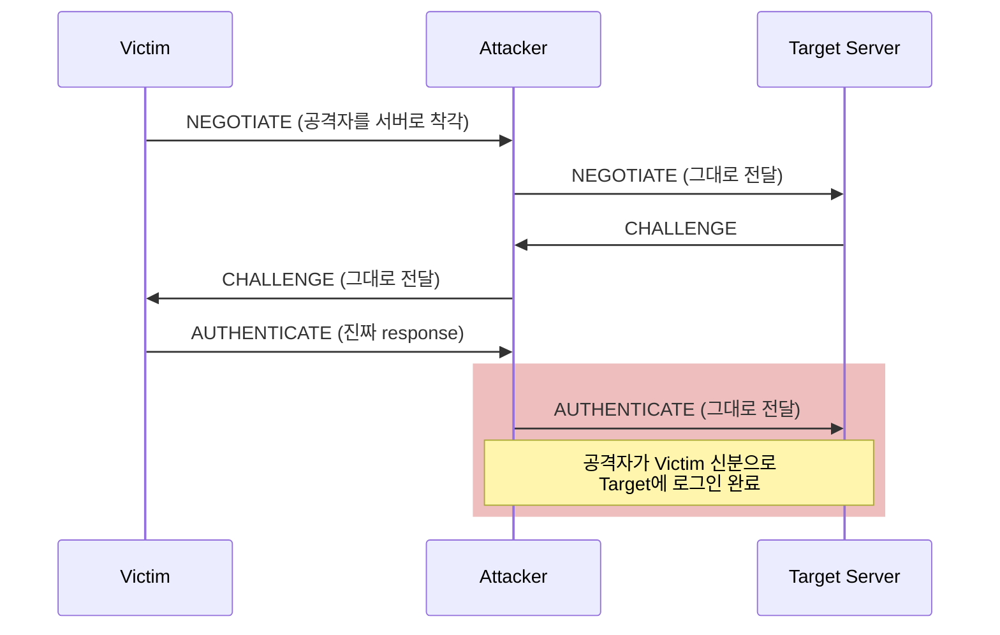
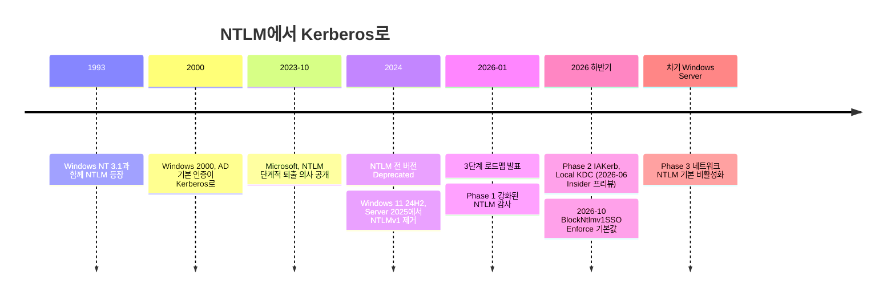

# NTLM은 왜 30년 만에 퇴출될까

Windows는 2000년부터 이미 Kerberos를 기본 인증으로 써왔다. 그런데 왜 1993년에 나온 NTLM은 지금까지 살아남았고, 왜 Microsoft는 2026년이 되어서야 "기본으로 끄겠다"고 선언했을까?

## 결론부터 말하면

**NTLM이 퇴출되는 이유는 설계 자체가 현대 공격에 무방비이기 때문이다.** 서버가 누구인지 확인하지 않으니 중간에서 인증을 가로채 다른 서버에 써먹는 **Relay 공격** 이 가능하고, 비밀번호 해시가 곧 열쇠라서 해시만 훔치면 비밀번호 없이 로그인하는 **Pass-the-Hash** 가 가능하다.

그럼에도 30년을 버틴 이유는 반대편에 있다. Kerberos는 "도메인 컨트롤러에 닿아야 한다", "서버를 이름(SPN)으로 불러야 한다", "도메인 계정이어야 한다" 같은 전제 조건이 있고, 이 조건이 깨지는 순간 Windows는 조용히 NTLM으로 **fallback** 해왔다. Microsoft의 퇴출 로드맵은 결국 이 fallback 원인을 하나씩 제거하는 작업이다.



| 구분 | 상태 | 시점 |
|------|------|------|
| NTLMv1 | **제거됨** (Windows 11 24H2, Windows Server 2025) | 2024년 하반기 |
| NTLMv1 파생 자격 증명(`BlockNtlmv1SSO`) | Audit → **Enforce 기본값 전환** | 2026년 10월 예정 |
| NTLM 전체(v2 포함) | **Deprecated** (동작하지만 개발 중단) | 2024년 6월 |
| 네트워크 NTLM | **기본 비활성화** (정책으로 재활성화 가능) | 차기 Windows Server 메이저 릴리스 |

> "Deprecated"와 "Disabled by default"와 "Removed"는 다른 말이다. NTLMv2는 아직 지워지지 않았고, 차기 릴리스에서도 OS 안에 남아 정책으로 다시 켤 수 있다.

---

## 1. 왜 NTLM이 문제인가 — 먼저 NTLM이 어떻게 동작하는지부터

### 1.1 비밀번호를 보내지 않고 증명하기: Challenge-Response

네트워크 너머의 서버에 "내가 김철수다"를 증명하는 가장 단순한 방법은 비밀번호를 그대로 보내는 것이다. 하지만 누군가 회선을 엿보면 끝이다. 그래서 NTLM은 **Challenge-Response** 방식을 택했다. 서버가 매번 다른 랜덤 값(challenge)을 던지면, 클라이언트는 비밀번호에서 유도한 키와 그 challenge로 계산한 값을 돌려준다(response). 같은 비밀번호를 아는 쪽만 같은 답을 만들 수 있으니, 비밀번호 자체는 회선에 한 번도 실리지 않는다.

여기서 "비밀번호에서 유도한 키"의 뿌리가 **NT hash** 다. 해시 함수는 입력을 고정 길이의 값으로 바꾸는 단방향 함수인데, NTLM은 비밀번호를 UTF-16으로 인코딩한 뒤 MD4로 해시한 값을 NT hash로 쓴다. salt가 없으니 같은 비밀번호는 어느 컴퓨터에서나 같은 NT hash가 된다.

response를 계산하는 방식은 버전마다 다르다. NTLMv1은 NT hash를 DES 키로 쪼개 challenge를 그대로 암호화한다. NTLMv2는 NT hash와 사용자명·도메인명으로 응답 키를 한 번 더 유도한 뒤, 서버 challenge에 클라이언트 challenge·타임스탬프 등을 붙인 데이터에 대해 HMAC-MD5를 계산한다. 하지만 어느 버전이든 **계산의 출발점은 NT hash 하나** 라는 점은 같다. 이 사실이 뒤에서 중요해진다.



1993년, Windows NT 3.1이 사내 LAN에서 파일 서버에 접속하던 시절에는 이 정도면 충분해 보였다. 비밀번호가 회선에 안 실리니 안전하다는 직관이다. 하지만 이 직관은 두 군데서 무너진다.

### 1.2 직관이 무너지는 첫 번째 지점: 해시가 곧 비밀번호다 (Pass-the-Hash)

다시 흐름을 보자. response를 만드는 데 필요한 것은 **비밀번호가 아니라 NT hash** 다. 그렇다면 공격자가 비밀번호는 모르지만 NT hash를 손에 넣었다면 어떨까?

답은 "로그인할 수 있다"이다. 공격자가 PC 한 대를 장악해 메모리(LSASS 프로세스)나 SAM 데이터베이스에서 NT hash를 덤프하면, 비밀번호를 크래킹할 필요 없이 그 해시로 challenge에 응답해 다른 서버에 접속할 수 있다. 이것이 **Pass-the-Hash** 다. 게다가 NT hash는 비밀번호를 바꾸기 전까지 변하지 않는다. 관리자가 여러 PC에 같은 로컬 관리자 비밀번호를 썼다면, 한 대에서 훔친 해시로 회사 전체를 옆으로 이동(lateral movement)할 수 있다. 랜섬웨어 침투 보고서에 단골로 등장하는 이유다.

### 1.3 직관이 무너지는 두 번째 지점: 서버를 확인하지 않는다 (Relay)

시퀀스 다이어그램의 마지막 노트를 다시 보자. NTLM에서 **증명하는 쪽은 클라이언트뿐** 이다. 서버가 진짜 그 서버인지 클라이언트는 확인하지 않는다. 이걸 "상호 인증(mutual authentication)이 없다"고 한다.

그렇다면 공격자가 클라이언트와 서버 사이에 끼어들어 중계만 하면 어떻게 될까?



공격자는 암호를 하나도 풀지 않았다. 피해자가 만든 진짜 response를 진짜 서버에 전달했을 뿐이다. 피해자가 도메인 관리자라면 공격자는 관리자 권한으로 LDAP이나 인증서 서비스(AD CS)에 접속해 도메인 전체를 장악할 수 있다. 이것이 **NTLM Relay** 이고, PetitPotam처럼 서버를 속여 공격자에게 인증을 시도하게 만드는 기법과 결합되면서 매년 새 변종이 나왔다.

SMB signing, LDAP signing, EPA(Extended Protection for Authentication, TLS 채널에 인증을 묶는 기법) 같은 완화책이 있지만, 모두 "서비스마다 따로 켜야 하는 보호막"이다. 프로토콜 자체가 서버를 확인하지 않는다는 근본 문제는 그대로 남는다.

### 1.4 그리고 낡은 암호

NTLMv1은 DES 기반이라 response를 수집하면 오프라인으로 NT hash를 복원할 수 있을 정도로 약하다. 과도기 방어책으로는 LSASS 메모리를 가상화 기반 보안(VBS)으로 격리해 NT hash 덤프 자체를 어렵게 만드는 Credential Guard가 있다. NTLMv2는 HMAC-MD5로 개선했지만 여전히 MD4로 만든 unsalted NT hash 위에 서 있다. Microsoft는 공식 블로그에서 NTLM의 위험을 "서버 인증 없음, replay·relay·pass-the-hash 취약, 약한 암호, 제한된 감사 가시성"으로 정리했다.

---

## 2. 그런데 왜 Kerberos가 있는데도 NTLM이 살아남았을까?

### 2.1 Kerberos는 이미 25년 전에 이겼다

Windows 2000부터 Active Directory 도메인의 기본 인증은 Kerberos다. Kerberos는 신뢰하는 제3자(KDC, 도메인 컨트롤러에서 동작)가 발급한 **티켓** 으로 인증하고, 서버도 자신을 증명하는 상호 인증을 지원하며, 비밀번호에서 유도한 장기 키를 네트워크에 실어 보내지 않는다. (동작 원리는 [Kerberos는 어떻게 비밀번호를 보내지 않고 로그인시킬까](./Kerberos는-어떻게-비밀번호를-보내지-않고-로그인시킬까.md)에서 자세히 다룬다.)

Windows 애플리케이션은 보통 프로토콜을 직접 고르지 않고 **Negotiate** (SPNEGO) 패키지에 맡긴다. Negotiate는 Kerberos를 먼저 시도하고, 안 되면 NTLM으로 내려간다. 즉 NTLM은 오래전부터 주연이 아니라 **비상구** 였다.

### 2.2 문제는 비상구가 너무 자주 열린다는 것

Kerberos에는 NTLM에 없는 전제 조건이 있다. 이 조건이 하나라도 깨지면 Negotiate는 군말 없이 NTLM을 쓴다.

| Kerberos가 실패하는 상황 | 왜 실패하나 | 흔한 예 |
|---|---|---|
| 클라이언트가 DC에 닿지 못함 | 티켓을 받으려면 KDC(포트 88)와 직접 통신해야 함 | 분리된 네트워크 대역, VPN 없는 재택, DMZ 서버 |
| 서버를 IP 주소로 호출 | KDC는 SPN(서비스 이름)으로 티켓 암호화 키를 찾는데, 기본 설정의 클라이언트는 IP 대상에 Kerberos를 시도하지 않음 (`TryIPSPN` + IP 기반 SPN 수동 등록으로 우회 가능) | `\\192.168.1.50\share` |
| SPN 미등록/중복 | 위와 같은 이유 | 서비스 계정을 바꾸고 `setspn`을 빠뜨림 |
| 로컬 계정 사용 | 로컬 계정에는 티켓을 발급해 줄 KDC가 없음 | 워크그룹 PC, 도메인 PC의 로컬 관리자 |
| 애플리케이션이 NTLM을 하드코딩 | Negotiate를 거치지 않음 | 오래된 사내 앱, 일부 Windows 구성 요소 |

그래서 "NTLM을 끄자"는 말은 오랫동안 "이 표의 모든 상황에서 업무가 멈춰도 괜찮다"는 뜻이었다. 아무도 그 버튼을 누를 수 없었던 이유다.

---

## 3. Microsoft의 퇴출 로드맵 — fallback 원인을 하나씩 지운다

2026년 1월 Microsoft는 Windows IT Pro 블로그에서 3단계 로드맵을 발표했다. 핵심은 순서다. **끄기 전에 먼저 보이게 하고, 그다음 Kerberos가 실패하던 상황을 고치고, 마지막에 끈다.**



### Phase 1: 가시성 확보 (지금 사용 가능)

Windows 11 24H2와 Windows Server 2025에는 강화된 NTLM 감사 로그가 들어 있다. 누가, 어느 서버로, **왜 Kerberos 대신 NTLM을 썼는지** 까지 기록한다. 무엇이 깨질지 모르면 끌 수 없으니, 모든 마이그레이션의 출발점이다.

### Phase 2: Kerberos가 실패하던 상황 해결 (2026년 하반기 예정)

2.2절의 표에 정확히 대응하는 기능들이다.

| fallback 원인 | 해결책 | 아이디어 |
|---|---|---|
| DC에 닿지 못함 | **IAKerb** | 클라이언트가 Kerberos 메시지를 애플리케이션 연결(예: SMB 445) 안에 실어 보내면, DC에 닿을 수 있는 서버가 대신 KDC에 중계 |
| 로컬 계정 | **Local KDC** | 각 머신에 작은 KDC를 두어 로컬 계정도 Kerberos 티켓을 받게 함 |
| 하드코딩된 NTLM | Windows 구성 요소 업데이트 | 핵심 구성 요소가 Kerberos를 먼저 협상하도록 변경 |

IAKerb와 Local KDC는 2026년 6월 Windows Insider Canary 채널에서 공개 프리뷰로 나왔고, Windows 11 24H2 이상과 Windows Server 2025를 대상으로 2026년 하반기 정식 배포가 계획되어 있다. Microsoft는 일정이 바뀔 수 있다고 명시했다.

### Phase 3: 기본 비활성화 (차기 Windows Server 메이저 릴리스)

네트워크 NTLM 인증이 기본으로 막히고, 필요하면 새 정책으로 명시적으로 다시 켜야 한다. 이 단계에서 알 수 없는 SPN으로의 접속, IP 주소 기반 인증 요청, 도메인 가입 장치의 로컬 계정처럼 "NTLM만 되던" 추가 사례에 대한 처리가 내장되고, 새 NTLM 차단 정책도 함께 들어온다. 즉 Phase 2만으로 2.2절의 모든 fallback이 사라지는 것은 아니고, IP 접속 같은 사례는 Phase 3에서야 다뤄진다. 완전 삭제는 그 이후의 목표다.

### 별도 트랙: NTLMv1의 마지막 정리

NTLMv1 프로토콜은 이미 제거됐지만, 도메인 환경의 MS-CHAPv2처럼 NTLMv1 계열 암호가 남아 있는 시나리오가 있다. Microsoft는 로그온한 사용자의 자격 증명으로 NTLMv1 파생 자격 증명을 자동 생성하는 SSO 동작을 막는 `BlockNtlmv1SSO` 레지스트리 키를 도입했고, 2026년 10월 업데이트에서 이 키를 따로 배포하지 않은 장치의 기본값을 Audit(0)에서 **Enforce(1)** 로 바꿀 예정이다. 차단 대상은 이 SSO 동작이며, Enforce에서도 사용자가 자격 증명을 직접 입력하는 인증은 계속 가능하다. 로드맵에서 가장 가까운 강제 시점이다.

---

## 4. 실무에서 마주치는 NTLM

### 4.1 Windows 환경: 어디서 NTLM이 쓰이는지 찾기

```powershell
# NTLM 운영 로그 확인 (Windows 11 24H2 / Server 2025의 강화된 감사)
Get-WinEvent -LogName "Microsoft-Windows-NTLM/Operational" -MaxEvents 100 |
    Select-Object TimeCreated, Id, Message

# 현재 세션이 받은 Kerberos 티켓 확인 - 비어 있으면 NTLM을 쓰고 있을 가능성
klist
```

가장 흔한 수정은 의외로 단순하다.

```text
Bad:  \\192.168.1.50\share                 -> SPN 없음 -> NTLM fallback
Good: \\fileserver01.corp.example.com\share -> SPN 매칭 -> Kerberos

# 서비스 계정에 SPN 등록 (웹 앱을 서비스 계정으로 돌릴 때)
setspn -S HTTP/webapp.corp.example.com CORP\svc-webapp
```

### 4.2 Java/Spring 개발자가 NTLM을 만나는 곳: `Negotiate` 헤더

사내 SSO를 붙이다 보면 HTTP에서 이런 헤더를 보게 된다.

```http
HTTP/1.1 401 Unauthorized
WWW-Authenticate: Negotiate

GET /api/me HTTP/1.1
Authorization: Negotiate TlRMTVNTUAABAAAAB4IIog...
```

`Negotiate` 뒤의 토큰은 Base64다. 토큰이 `TlRMTVNTUA` 로 시작하면 이는 `NTLMSSP` 문자열을 인코딩한 것이고, **브라우저가 Kerberos에 실패하고 NTLM으로 내려왔다는 신호** 다. 반대로 `YII` 로 시작하면 ASN.1로 감싼 GSS-API 토큰, 대개 SPNEGO로 감싼 Kerberos 티켓이다.

Spring Security Kerberos 같은 SPNEGO 필터는 Kerberos 토큰만 검증하므로, NTLM 토큰이 오면 인증이 실패한다. "로컬에선 되는데 IP로 접속하면 안 된다", "도메인 밖 PC에서만 안 된다"는 증상은 대부분 2.2절의 fallback 원인 중 하나다. 서버를 FQDN으로 부르고 SPN이 등록되어 있는지부터 확인하면 된다.

---

## 5. 정리

### 핵심 포인트

1. **NTLM의 결함은 패치가 아니라 설계의 문제다**
   - 서버를 확인하지 않아 Relay가 가능하고, NT hash가 곧 열쇠라 Pass-the-Hash가 가능하다
   - SMB/LDAP signing, EPA는 서비스별 보호막일 뿐 근본 해결이 아니다

2. **NTLM이 살아남은 이유는 Kerberos의 전제 조건이다**
   - DC 접근, SPN(이름 기반 호출), 도메인 계정 중 하나라도 깨지면 Negotiate가 조용히 NTLM으로 내려간다
   - 그래서 "NTLM 끄기"는 오랫동안 "이 모든 경우의 장애 감수"를 뜻했다

3. **Microsoft의 로드맵은 fallback 원인 제거 작업이다**
   - Phase 1 감사 → Phase 2 IAKerb·Local KDC(2026 하반기 예정) → Phase 3 차기 Windows Server에서 기본 비활성화
   - NTLMv1은 이미 제거, 2026년 10월 `BlockNtlmv1SSO` Enforce 기본값 전환 예정

4. **지금 할 일은 "보이게 하기"다**
   - NTLM 운영 로그로 사용처를 찾고, IP 접속을 FQDN으로 바꾸고, SPN을 정리한다
   - HTTP에서 `Negotiate TlRMTVNTUA...` 가 보이면 Kerberos fallback을 의심한다

관련 노트: [Kerberos는 어떻게 비밀번호를 보내지 않고 로그인시킬까](./Kerberos는-어떻게-비밀번호를-보내지-않고-로그인시킬까.md), [왜 사내 시스템들은 로그인을 LDAP에 물어볼까](./왜-사내-시스템들은-로그인을-LDAP에-물어볼까.md), [MITM - Man In The Middle 중간자 공격](./MITM-Man-In-The-Middle-중간자-공격.md)

---

## 출처

- [Advancing Windows security: Disabling NTLM by default - Windows IT Pro Blog](https://techcommunity.microsoft.com/blog/windows-itpro-blog/advancing-windows-security-disabling-ntlm-by-default/4489526) - Microsoft 공식, 3단계 로드맵 (2026-01-29)
- [NTLM overview - Microsoft Learn](https://learn.microsoft.com/windows-server/security/kerberos/ntlm-overview) - 공식 문서
- [Upcoming changes to NTLMv1 in Windows 11, version 24H2 and Windows Server 2025 - Microsoft Support](https://support.microsoft.com/en-us/servicing/os/windows/docs/2025/08/upcoming-changes-to-ntlmv1-in-windows-11-version-24h2-and-windows-server-2025) - `BlockNtlmv1SSO` 일정
- [Deprecated features in the Windows client - Microsoft Learn](https://learn.microsoft.com/windows/whats-new/deprecated-features) - NTLM Deprecated 공지
- [The evolution of Windows authentication - Windows IT Pro Blog](https://techcommunity.microsoft.com/blog/windows-itpro-blog/the-evolution-of-windows-authentication/3926848) - IAKerb, Local KDC 소개 (2023-10)
- [Reducing NTLM fallback with IAKerb and LocalKDC in Windows - 4sysops](https://4sysops.com/archives/reducing-ntlm-fallback-with-iakerb-and-localkdc-in-windows) - 2026-06 Insider 프리뷰
- [Microsoft to disable NTLM by default in future Windows releases - BleepingComputer](https://www.bleepingcomputer.com/news/microsoft/microsoft-to-disable-ntlm-by-default-in-future-windows-releases)
