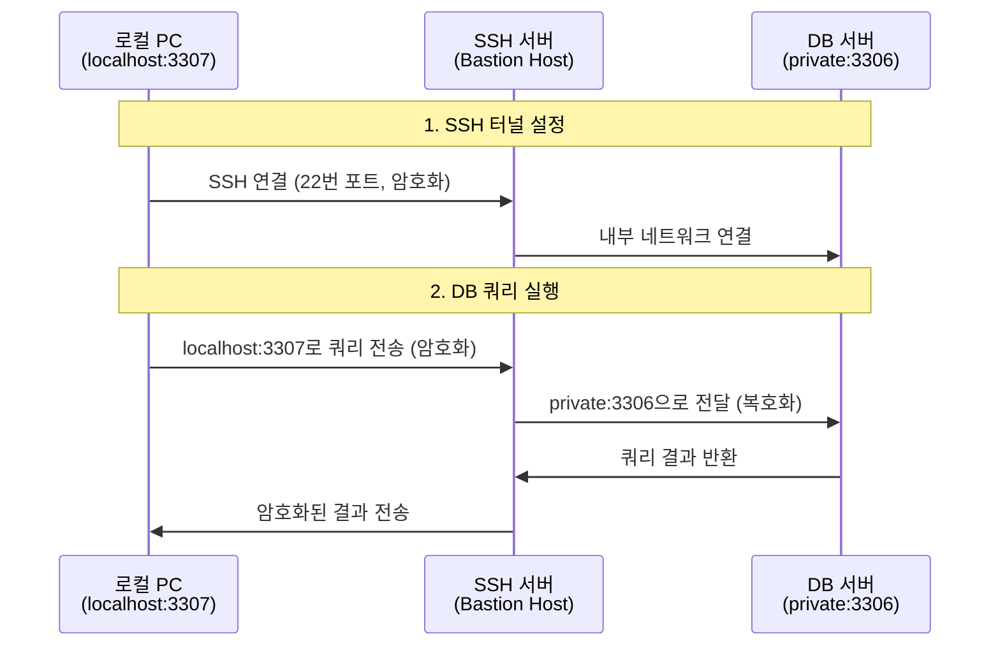
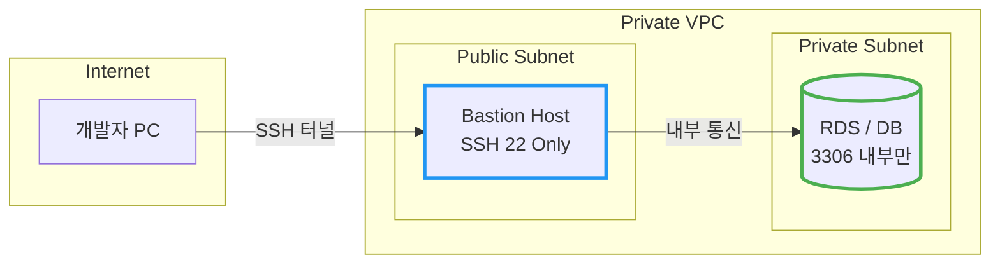

# SSH 터널링을 통한 안전한 데이터베이스 접속

암호화되지 않은 DB 연결을 SSH 채널로 감싸 안전하게 통신하는 방법.

## 결론부터 말하면

**SSH 터널링**은 DB 통신을 SSH 암호화 채널로 감싸서 안전하게 전송하는 기술이다.

```
// Before: 평문 통신 (위험)
Client ──────────────────▶ DB:3306 (쿼리/데이터 노출)

// After: SSH 터널링 (안전)
Client ══SSH 암호화 터널══▶ DB:3306 (모든 통신 암호화)
```

DB 포트를 외부에 열지 않고, SSH 서버(Bastion Host)만 노출하면 되므로 공격 표면도 줄어든다.

## 1. 왜 SSH 터널링이 필요한가?

카페에서 노트북으로 회사 DB에 접속한다고 가정해보자. MySQL, PostgreSQL 같은 DBMS는 기본적으로 **평문 통신**을 한다. 이 상태로 공용 Wi-Fi를 통해 DB에 접속하면 어떻게 될까?

| 위협 | 설명 |
|------|------|
| 패킷 스니핑 | 같은 네트워크의 공격자가 쿼리와 데이터를 그대로 볼 수 있음 |
| MITM 공격 | 중간에서 데이터를 변조하거나 가로챌 수 있음 |
| 포트 스캔 | DB 포트(3306, 5432)가 외부에 노출되면 무차별 대입 공격 대상이 됨 |

SSH 터널링은 이 모든 문제를 한 번에 해결한다. 모든 통신이 SSH로 암호화되고, DB 포트는 내부 네트워크에만 열어두면 된다.

## 2. 작동 원리

SSH 터널링의 핵심은 **로컬 포트를 원격 서버의 포트로 포워딩**하는 것이다.



클라이언트는 `localhost:3307`에 접속하지만, 실제로는 SSH 터널을 통해 원격 DB의 `3306` 포트로 연결된다.

## 3. 실제 사용법

### 3.1 터미널에서 SSH 터널 생성

```bash
# 기본 형식
ssh -L [로컬포트]:[DB호스트]:[DB포트] [SSH사용자]@[SSH서버]

# 예시: 로컬 3307 → Bastion → DB 3306
ssh -L 3307:db.private.internal:3306 ubuntu@bastion.example.com
```

| 옵션 | 설명 |
|------|------|
| `-L` | Local Port Forwarding (로컬 → 원격) |
| `-f` | 백그라운드 실행 |
| `-N` | 원격 명령 실행 안 함 (포트 포워딩만) |

백그라운드로 터널만 유지하려면:

```bash
ssh -fN -L 3307:db.private.internal:3306 ubuntu@bastion.example.com
```

### 3.2 DB 클라이언트에서 연결

터널이 열린 상태에서 `localhost`로 접속하면 된다.

```bash
# MySQL
mysql -h 127.0.0.1 -P 3307 -u dbuser -p

# PostgreSQL
psql -h 127.0.0.1 -p 5433 -U dbuser -d mydb
```

### 3.3 GUI 도구 설정 (DBeaver, DataGrip 등)

대부분의 DB 클라이언트는 SSH 터널링을 내장 지원한다.

| 설정 항목 | 값 | 설명 |
|----------|-----|------|
| SSH Host | bastion.example.com | SSH 서버 주소 |
| SSH Port | 22 | SSH 기본 포트 |
| SSH User | ubuntu | SSH 접속 계정 |
| SSH Auth | Key 또는 Password | 인증 방식 |
| DB Host | db.private.internal | DB 내부 주소 |
| DB Port | 3306 | DB 포트 |

**주의:** DB Host에는 SSH 서버에서 접근 가능한 **내부 주소**를 입력해야 한다.

## 4. 실무 아키텍처

AWS, GCP 같은 클라우드 환경에서의 일반적인 구성이다.



| 구성 요소 | 위치 | 접근 제어 |
|----------|------|----------|
| Bastion Host | Public Subnet | SSH(22) 포트만 외부 오픈 |
| DB 서버 | Private Subnet | 내부 IP에서만 접근 가능 |

DB는 **절대 외부에 노출하지 않고**, Bastion Host를 통해서만 접근하게 한다.

## 5. 보안 이점 정리

| 항목 | 일반 연결 | SSH 터널링 |
|------|----------|-----------|
| 데이터 암호화 | 평문 전송 | SSH 암호화 |
| DB 포트 노출 | 외부 오픈 필요 | 내부만 오픈 |
| 인증 | DB 계정만 | SSH 키 + DB 계정 (이중 인증) |
| 접근 제어 | IP 기반 방화벽 | Bastion Host 단일 진입점 |
| 감사 로그 | DB 로그만 | SSH 로그 + DB 로그 |

## 6. 주의사항

SSH 터널링이 만능은 아니다.

| 상황 | 권장 방안 |
|------|----------|
| 대량의 동시 접속 | VPN 또는 AWS PrivateLink 고려 |
| 애플리케이션 서버 연결 | 같은 VPC 내에 배포하여 내부 통신 |
| 장시간 유휴 연결 | SSH KeepAlive 설정 필요 |

```bash
# SSH 연결 유지 설정 (~/.ssh/config)
Host bastion
    HostName bastion.example.com
    User ubuntu
    ServerAliveInterval 60
    ServerAliveCountMax 3
```

---

## 출처

- [SSH Tunneling Explained](https://www.ssh.com/academy/ssh/tunneling) - SSH Academy
- [AWS Bastion Host Architecture](https://docs.aws.amazon.com/prescriptive-guidance/latest/patterns/access-a-bastion-host-by-using-session-manager-and-amazon-ec2-instance-connect.html) - AWS Documentation
- [PostgreSQL SSH Tunnel](https://www.postgresql.org/docs/current/ssh-tunnels.html) - PostgreSQL Documentation
