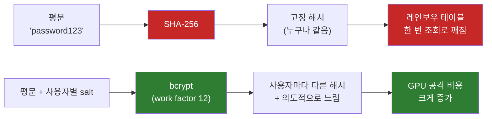
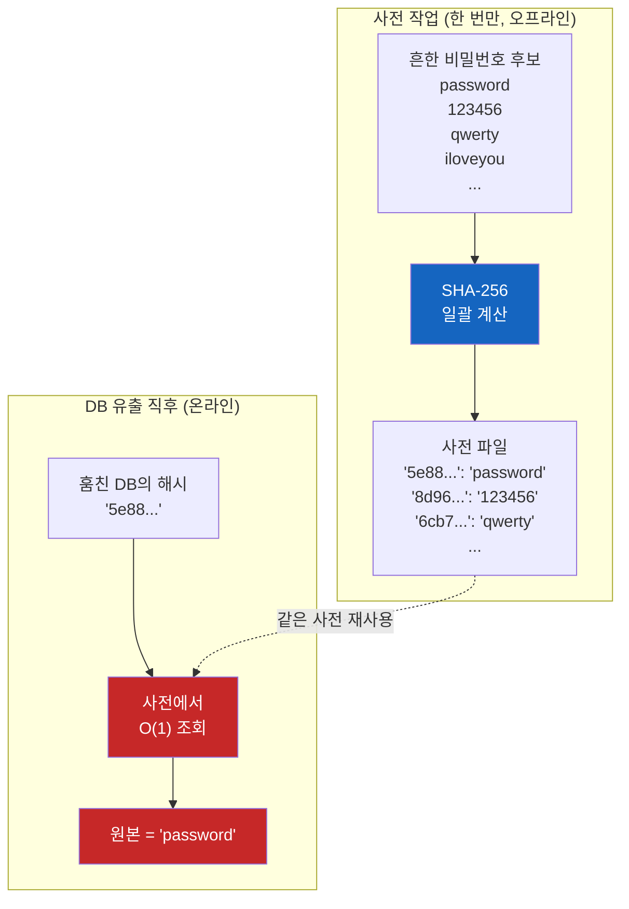
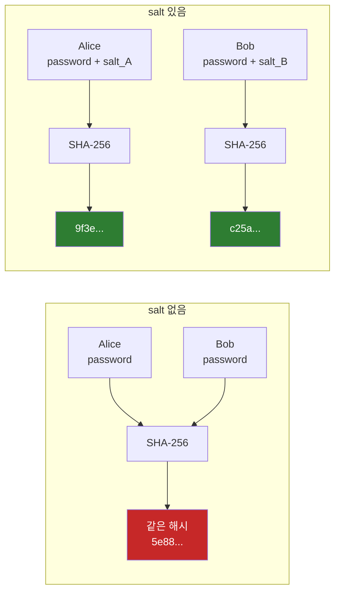
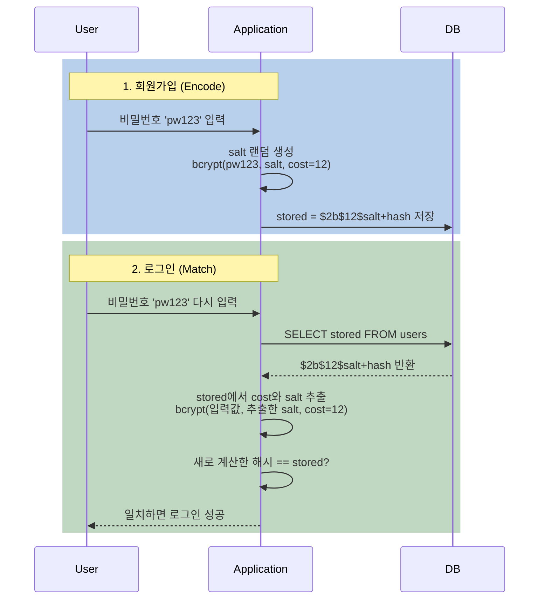

# 왜 SHA-256으로 비밀번호를 저장하면 안 될까?

평문으로 저장하면 안 된다는 건 알겠다. 그래서 SHA-256으로 해시해서 저장하면 끝나는 줄 알았다. 그런데 왜 모든 보안 가이드는 BCrypt와 salt를 쓰라고 강조할까? 레인보우 테이블이 도대체 뭐길래 단방향 해시도 위험하다고 할까?

## 결론부터 말하면

**단방향 해시 함수 하나만으로는 부족하다.** SHA-256, MD5처럼 빠른 해시는 "원본을 못 푼다"는 의미일 뿐, 공격자가 미리 계산해 둔 **레인보우 테이블(rainbow table)** 로 역추적되거나 GPU로 초당 수백억 번씩 brute-force 당한다. 이를 막으려면 사용자마다 다른 **salt**, 그리고 의도적으로 느린 해시(**bcrypt**, **Argon2id**)가 필요하다.



| 방식 | DB 유출 시 | Rainbow Table | GPU Brute-force |
|------|------------|---------------|-----------------|
| 평문 저장 | 즉시 노출 | - | - |
| SHA-256 (salt 없음) | 빠르게 깨짐 | **취약** (사전 재사용) | 초당 100억+ 시도 |
| SHA-256 + salt | 일괄 공격 차단 | **무력화 성공** | 개별 공격은 여전히 빠름 |
| bcrypt + salt | 일괄 공격 차단 | 무력화 성공 | **공격 비용 대폭 증가** |
| Argon2id + salt | 일괄 공격 차단 | 무력화 성공 | **CPU + 메모리 모두 비용** |

---

## 1. 단방향 해시 함수가 뭔지부터

비밀번호 저장 이야기를 꺼내기 전에, 우리가 손에 쥔 도구가 뭔지부터 보자. **단방향 해시 함수(one-way hash function)** 는 임의 길이의 입력을 받아 고정 길이의 출력을 내는 함수다. SHA-256은 입력이 무엇이든 항상 256비트(64자리 16진수) 출력을 낸다.

```
SHA-256("hello")     -> 2cf24dba5fb0a30e26e83b2ac5b9e29e1b161e5c1fa7425e73043362938b9824
SHA-256("hellp")     -> a01ab7d2c945e6e22aae0c44c8c2e83e0d8bee65d5a8b16ae2d4a5ee0d6f8a7c
SHA-256("password")  -> 5e884898da28047151d0e56f8dc6292773603d0d6aabbdd62a11ef721d1542d8
```

세 가지 핵심 성질이 있다.

| 성질 | 설명 |
|------|------|
| **결정론적(deterministic)** | 같은 입력은 항상 같은 출력. `SHA-256("hello")` 는 누구의 컴퓨터에서 몇 번을 돌려도 같은 값. |
| **고정 길이 출력** | 입력이 1바이트든 1GB든 출력은 256비트 고정. |
| **단방향(one-way)** | 출력에서 입력을 거꾸로 계산하는 것이 수학적으로 어렵다. "어렵다"는 우주의 종말까지 계산해도 안 된다는 뜻. |

단방향이라는 마지막 성질 덕분에 **"비밀번호를 평문 대신 해시값만 저장하면 DB가 통째로 유출되어도 원본은 모를 거다"** 라는 직관이 생긴다. 그래서 많은 신입 개발자가 처음에 SHA-256을 쓴다.

그런데 이 직관이 정확히 어디서 무너지는지가 이 글의 출발점이다.

---

## 2. 단방향이라면서, 도대체 어떻게 비밀번호가 깨지는 걸까?

DB가 유출되어 공격자가 `5e884898da28...` 같은 SHA-256 해시값들을 손에 넣었다고 하자. SHA-256은 단방향이니까 거꾸로 계산할 수 없다. 그럼 끝난 거 아닐까?

여기서 공격자의 발상 전환이 시작된다. **거꾸로 풀 수 없다면, 정방향으로 마구 시도해보면 되지 않을까?**

```python
# 공격자의 머릿속
candidates = ["password", "123456", "qwerty", "admin", "iloveyou", ...]  # 흔한 비밀번호 목록
for guess in candidates:
    if SHA-256(guess) == stolen_hash:
        print(f"비밀번호 = {guess}")
        break
```

이게 **사전 공격(dictionary attack)** 이다. "단방향"이라는 성질이 막아주는 건 "해시값에서 입력을 직접 계산하는 것"뿐이다. **공격자가 입력값을 추측해서 해시한 뒤 비교하는 행위는 막지 않는다.**

이때 공격자를 도와주는 두 가지 사실이 있다.

| 사실 | 의미 |
|------|------|
| **결정론적이다** | `SHA-256("password")` 는 누가 돌리든 같은 값 → 한 번 계산해두면 전 세계 모든 시스템에서 통한다 |
| **계산이 빠르다** | 현대 GPU는 SHA-256을 초당 100억 번 이상 계산 |

8자리 영숫자 비밀번호의 가능한 조합은 약 $62^8 \approx 2.18 \times 10^{14}$ 개. GPU 한 대로 초당 100억($10^{10}$)번 계산하면 **약 6시간이면 모든 8자리 영숫자 조합을 다 시도해볼 수 있다.** "단방향이라 안전하다"는 직관이 무너지는 순간이다.

> **빠른 해시는 일반 암호학에서는 미덕이지만 비밀번호 저장에서는 악덕이다.** 파일 무결성 검증, 디지털 서명에서는 빠를수록 좋지만, 비밀번호에서는 공격자도 함께 빨라진다.

---

## 3. 레인보우 테이블 — 한 번 만들면 평생 쓰는 만능 열쇠

사전 공격(brute-force)도 무서운데, 그래도 공격자 입장에서 매번 GPU를 6시간 돌리는 건 귀찮다. 그래서 더 효율적인 방법이 등장한다. **한 번 계산해놓고 영원히 재사용하면 어떨까?**

이게 **레인보우 테이블** 의 발상이다. 자주 쓰일 법한 비밀번호 후보들을 미리 SHA-256으로 돌려서 `(해시값 → 원본 비밀번호)` 사전을 만들어둔다. 공격자가 어느 시스템 DB를 훔치든, 그 사전을 한 번 조회하기만 하면 된다.



### 왜 "레인보우(rainbow)"라는 이름이 붙었나?

단순히 모든 `(비밀번호, 해시)` 쌍을 다 저장하면 용량이 너무 커진다. 8자리 영숫자만 해도 후보가 $62^8 \approx 2.18 \times 10^{14}$ 개니, 해시값까지 같이 저장하려면 페타바이트 단위가 된다.

1980년 Martin Hellman이 **chain 구조** 로 저장 공간을 줄이는 아이디어를 냈고, 2003년 Philippe Oechslin이 이를 발전시켜 **여러 reduction function을 번갈아 쓰는 방식**을 만들었다. 이 다양한 reduction function들이 색깔처럼 알록달록하다고 해서 **"rainbow"** 라는 이름이 붙었다. 핵심 아이디어는 "체인의 시작과 끝 해시만 저장하고, 중간은 검증 시 재계산해서 복원" 하는 것 — 디스크 용량과 계산 시간을 트레이드오프해서 사전을 압축한 셈이다.

엄밀히 말하면 실무에서 "레인보우 테이블 공격"이라고 부르는 건 두 종류를 통칭한다.

| 종류 | 구조 | 특징 |
|------|------|------|
| **Lookup table (dictionary table)** | `(해시 → 원본)` 단순 키-값 사전 | 조회는 빠름, 용량은 큼 |
| **Rainbow table (좁은 의미)** | reduction chain으로 압축한 테이블 | 조회는 약간 느림, 용량은 훨씬 작음 |

이 글에서는 "공격자가 미리 계산해둔 모든 형태의 사전"을 묶어 **레인보우 테이블** 이라고 부르겠다. 실무 영향(공격 비용, 방어 전략)은 동일하다.

### 레인보우 테이블이 무서운 진짜 이유

```
모든 SHA-256 시스템이 같은 함수를 쓴다
        +
SHA-256은 결정론적이다
        =
한 번 만든 사전을 모든 시스템 공격에 재사용할 수 있다
```

이 한 줄이 핵심이다. 어느 사이트가 털리든, 어느 회사 DB가 새든, 같은 사전 하나면 다 뚫린다. 사전 생성에 든 비용을 1억 명, 10억 명에게 분산할 수 있는 셈이라 공격자 입장에서 ROI가 어마어마하게 좋다. 실제로 구글에 SHA-256, MD5 해시값을 그대로 검색하면 원본이 나오는 경우가 많은데, 누군가가 만들어 공개해둔 사전 검색 결과에 걸리는 것이다.

> **레인보우 테이블이 SHA-256 자체를 깨는 게 아니다.** SHA-256의 수학적 안전성은 그대로다. 다만 "흔한 비밀번호"의 입력 공간이 너무 좁아서, 공격자가 미리 다 계산해 둘 수 있을 뿐이다. 자물쇠를 부수는 게 아니라, 미리 만들어 둔 만능 열쇠 다발에서 맞는 걸 꺼내는 것이다.

여기서 자연스러운 질문이 떠오른다. **이 만능 열쇠 다발을 무용지물로 만들 방법이 없을까?**

---

## 4. salt — 사전을 쓸모없게 만들기

만능 열쇠 다발이 통하는 이유는 **모든 사용자가 같은 자물쇠**를 쓰기 때문이다. 그렇다면 사용자마다 자물쇠를 살짝씩 다르게 만들면 된다. 이게 salt의 아이디어다.

salt는 이름 그대로 "양념" — 사용자가 비밀번호를 만들 때 시스템이 무작위 문자열을 하나 생성해서, 비밀번호와 합쳐 해시한다.

```
Alice: hash("password" + "x7P9aQ2zR")  -> 9f3e...
Bob:   hash("password" + "kL4mN8bV1")  -> c25a...
```

**같은 비밀번호 `"password"` 라도 salt가 다르면 결과 해시가 완전히 달라진다.** 이게 salt의 핵심이다.



### salt가 정확히 어떻게 레인보우 테이블을 깨뜨릴까?

이 부분이 자주 헷갈린다. **salt가 비밀이라서 막아주는 게 아니다.** salt는 보통 DB에 평문으로 같이 저장된다. bcrypt 같은 알고리즘은 아예 해시 문자열 안에 salt를 박아둔다. 비밀이 아닌데도 막아준다. 왜?

공격자 입장에서 다시 생각해보자.

**salt가 없을 때:**
```
비밀번호 후보 1억 개 → SHA-256 → 1억 개의 (해시 → 원본) 사전 → 모든 사용자에게 재사용
```

**salt가 있을 때:**
```
비밀번호 후보 1억 개 × salt 값마다 다시 → SHA-256 → 사용자별로 다른 사전
```

salt가 16바이트(128비트) 무작위라면 가능한 salt는 $2^{128} \approx 3.4 \times 10^{38}$ 개 — 지구상 모든 모래알 수($\sim 10^{18}$) 보다 압도적으로 크고, 현대 컴퓨팅 자원으로 전수 조사가 불가능한 크기다. **모든 (비밀번호, salt) 조합을 미리 계산해둘 방법이 없다.**

그럼 공격자가 DB를 훔칠 때 salt까지 같이 가져갔다고 해도, **그 사용자 한 명에 대해서만** 사전을 새로 만들어야 한다. 1억 명의 사용자가 있으면 1억 번 다시 만들어야 한다.

| 구분 | salt 없음 | salt 있음 |
|------|-----------|-----------|
| 사전 생성 | 한 번 | 사용자 수만큼 |
| 1명 깨는 비용 | 사전 조회 (싸다) | 사전 생성 (비싸다) |
| 1억 명 깨는 비용 | **사전 조회 1억 번 (여전히 싸다)** | **사전 생성 1억 번 (천문학적)** |

> **salt의 본질은 "비밀로 숨기는 것"이 아니라 "사전 생성 비용을 사용자 수만큼 곱하는 것"이다.** 일괄 공격(batch attack)을 차단하는 도구다.

### pepper — salt의 친구

salt와 비슷한 개념으로 **pepper(페퍼)** 가 있다. 차이점은 저장 위치다.

| | salt | pepper |
|--|------|--------|
| 저장 위치 | DB (해시와 함께) | 애플리케이션 코드, 환경변수, 별도 KMS |
| 공격자가 DB 훔쳤을 때 | 공격자도 알게 됨 | 여전히 모름 |
| 사용자별 | 다르다 | 같다 |

DB만 유출되고 애플리케이션 서버는 무사한 상황에서, pepper는 추가 방어선이 된다. salt + pepper 조합은 OWASP에서도 권장한다.

---

## 5. salt만 있으면 끝일까? — bcrypt와 Argon2의 등장

salt가 일괄 공격은 막았다. 하지만 한 명을 표적 삼은 GPU brute-force는 여전히 통한다. 공격자가 한 사용자의 (해시, salt) 쌍을 알면, 그 사용자에 대해서는 여전히 SHA-256을 빠르게 돌릴 수 있다. GPU 한 대로 초당 100억 번. 8자리 비밀번호는 6시간이면 다 시도된다.

여기서 패러다임이 바뀐다. **빠른 해시를 일부러 느린 해시로 만들자.** 이게 bcrypt, scrypt, PBKDF2, Argon2가 등장한 배경이다.

bcrypt는 **cost factor(work factor)** 개념을 도입했다. cost가 12라면 해시 함수를 $2^{12} = 4096$ 번 반복한다. cost가 13이 되면 두 배 느려진다. 사용자가 로그인할 때는 100~250ms 정도라 체감이 안 되지만, 공격자가 10억 개 후보를 시도하려면 **하드웨어 수십억 원어치를 수개월~수년간 돌려야** 한다.

```
$2b$12$N9qo8uLOickgx2ZMRZoMyeIjZAgcfl7p92ldGxad68LJZdL17lhWy
 │  │  └────────── 22자 salt ─────────┘└──── 31자 hash ────┘
 │  └─ cost factor (12) = 4096회 반복
 └──── bcrypt 버전 식별자 (2b)
```

bcrypt 해시를 잘 보면 **알고리즘 식별자, cost, salt, 해시가 모두 한 문자열에 들어 있다.** DB에는 이 한 컬럼만 저장하면 된다. salt 컬럼을 따로 만들 필요가 없다. 검증할 때 이 문자열에서 cost와 salt를 뽑아내 다시 계산하면 된다.

### 비대칭성 — 사용자에게 싸고 공격자에게 비싸게

bcrypt/Argon2의 핵심은 **사용자(인증자)와 공격자 사이의 자원 소모 비대칭성**을 극대화하는 것이다. 사용자는 1회 로그인에 100~250ms를 쓰는 게 큰 불편이 아니지만, 초당 수억 번 시도해야 하는 공격자에게 250ms는 물리적·경제적 공격 비용을 기하급수적으로 높이는 장벽이 된다.

> **2026년 OWASP 권장사항**:
> - **신규 시스템: Argon2id** — 메모리까지 강제해서 GPU/ASIC 병렬 공격을 물리적으로 차단한다. 수천 코어가 동시에 돌더라도 각 계산이 메모리를 독립적으로 점유하므로 메모리 대역폭이 먼저 고갈된다. **OWASP 최소 권장값은 `m=19 MiB, t=2, p=1`**, 그리고 동등한 보안을 제공하는 대안 프로파일로 `m=46/19/12/9/7 MiB` 등을 함께 제시한다. 운영 환경에서 자원이 허용한다면 더 높게 잡을 수 있지만, "OWASP 권장 = 무조건 64MB 이상"이 아님에 유의.
> - **기존 bcrypt 시스템**: work factor **최소 10 이상**, 서버 성능이 허용하는 한 가능한 한 높게(현대 하드웨어에서는 12~14가 흔함). 고정값이 아니라 **하드웨어 발전에 맞춰 정기적으로 재조정** 하는 운영 파라미터다.
> - **PBKDF2-HMAC-SHA256**: FIPS-140 같은 규제 준수가 필요할 때의 정공법.
>
> **주의 — 강한 해시는 곧 자원 소모다.** bcrypt cost를 너무 높이거나 Argon2id 메모리 파라미터를 무겁게 잡으면 인증 엔드포인트 자체가 **자원 고갈형 DoS 공격 벡터** 가 될 수 있다. 특히 Argon2id는 동시 로그인이 많아지면 메모리(`m_cost`)가 빠르게 누적 점유되어 서버 가용 메모리를 순식간에 고갈시킬 수 있다. 실무에서는 동시 처리량과 가용 자원을 **벤치마킹한 후 파라미터를 결정**하고, 강한 해시 + **로그인 rate limiting** + **WAF** 를 함께 두는 것이 표준이다.
>
> **bcrypt의 72바이트 제한 + password shucking.** bcrypt는 설계상 입력의 첫 72바이트만 해싱에 사용한다. 한글/이모지처럼 멀티바이트가 섞이면 더 짧다. 흔한 우회법은 **pre-hashing** 인데, 단순 `bcrypt(SHA-256(password))` 는 **password shucking** 공격에 노출된다 — 다른 사이트에서 SHA-256 평문 해시 덤프가 유출됐을 때 공격자가 그 해시값들을 그대로 bcrypt에 넣어 빠르게 매칭을 시도할 수 있다. 그래서 OWASP는 pepper와 결합한 **`bcrypt(base64(HMAC-SHA-384(pepper, password)))`** 형태를 권장한다. base64 인코딩은 일부 bcrypt 구현이 NULL 바이트를 문자열 종료로 오해해 그 뒤를 잘라내는 문제도 함께 해결한다. Argon2id는 길이 제한 자체가 없어 새 시스템에서는 이 문제가 사라진다.

---

## 6. 그럼 로그인할 때 DB의 해시랑 어떻게 매칭하지?

여기서 자연스러운 의문이 생긴다. **단방향이라 풀 수 없다면서, 어떻게 사용자가 입력한 비밀번호와 DB에 저장된 해시를 비교할 수 있을까?**

답은 단순하다. **"풀어서 비교"하는 게 아니라 "다시 해시해서 비교"한다.**



핵심은 **검증 시점에 같은 함수를 같은 파라미터로 다시 돌리는 것** 이다. 같은 입력 + 같은 salt + 같은 cost → 같은 해시. 이 등식이 보장되니까 비교가 가능하다. **단방향이라는 사실은 깨지지 않는다 — 단방향은 "역방향 계산"의 어려움이지, "정방향 재계산"의 어려움이 아니다.**

bcrypt의 똑똑한 점은 cost와 salt를 **해시 문자열 자체에 박아둔** 점이다. 검증할 때 별도 컬럼을 조회하거나 설정 파일을 읽을 필요 없이, 저장된 해시 문자열만 보면 "이건 cost 12로 만들어졌고, salt는 이거다"를 알 수 있다. 그래서 추후 cost를 13으로 올려도, 기존 cost 12 해시들은 그대로 검증 가능하다. 점진적 마이그레이션이 자연스럽게 된다.

---

## 7. Spring Security는 어떻게 이걸 처리할까?

Spring Security 5부터는 `DelegatingPasswordEncoder` 가 기본이다.

```java
@Configuration
public class SecurityConfig {

    @Bean
    public PasswordEncoder passwordEncoder() {
        // 기본 추천: 여러 알고리즘을 한꺼번에 등록한 위임자
        return PasswordEncoderFactories.createDelegatingPasswordEncoder();
    }
}
```

이 한 줄이 만드는 인코더는 다음과 같이 동작한다.

**저장(encode) 시:**

```java
String encoded = encoder.encode("pw123");
// 결과 예시 (Spring 공식 문서):
// {bcrypt}$2a$10$dXJ3SW6G7P50lGmMkkmwe.20cQQubK3.HZWzG3YB1tlRy.fqvM/BG
// └──┬──┘ └────────────────── 실제 bcrypt 해시 ──────────────────────┘
//  알고리즘 ID                  (내부 버전 식별자는 $2a / $2b / $2y 등 구현에 따라 다름)
```

prefix `{bcrypt}` 가 붙는 이유가 뭘까? **알고리즘을 식별하기 위해서** 다. 미래에 Argon2로 옮기면 새 사용자는 `{argon2}...` 로 저장된다. 같은 DB에 두 알고리즘이 공존한다.

**검증(matches) 시:**

```java
boolean ok = encoder.matches("pw123", encoded);
// 1. encoded 앞부분의 {bcrypt} 를 보고 BCryptPasswordEncoder로 위임
// 2. BCryptPasswordEncoder가 내부적으로 cost와 salt를 추출해 다시 해시
// 3. 결과가 같은지 비교
```

이 설계 덕분에 **알고리즘 마이그레이션이 가능** 해진다. 사용자가 로그인하는 순간:

1. 기존 `{bcrypt}` 해시로 검증해서 통과
2. 입력받은 평문 비밀번호를 **신규 알고리즘**(예: `{argon2}`)으로 다시 해시
3. DB의 해시를 새 값으로 업데이트

사용자는 평소처럼 로그인했을 뿐인데, 백엔드는 조용히 더 강한 알고리즘으로 옮겨간다. 강제 비밀번호 재설정 없이 보안을 업그레이드하는 방법이다.

> **주의 — `DelegatingPasswordEncoder` 만으로는 DB가 갱신되지 않는다.** 이 인코더는 "이 해시가 현재 권장 알고리즘으로 만들어졌나?"를 판단하는 `upgradeEncoding()` 메서드를 제공할 뿐, DB에 새 해시를 직접 쓰지는 않는다. 실제 재해싱이 일어나려면 `UserDetailsPasswordService` 인터페이스를 구현해 `updatePassword(user, newEncodedPassword)` 로직을 제공해야 한다. Spring Security의 `DaoAuthenticationProvider` 가 인증 성공 시 `upgradeEncoding()` 이 `true` 면 새 해시를 만들어 이 서비스를 호출하는 흐름이다. 두 조각을 함께 끼워야 점진적 마이그레이션이 완성된다.
>
> 실제 `BCryptPasswordEncoder.encode()` 내부를 보면 매번 `BCrypt.gensalt(strength)` 로 **새 salt를 생성**한다. 같은 비밀번호를 두 번 encode하면 매번 다른 결과가 나온다. 그런데도 `matches()` 가 동작하는 건, 검증 시 stored 해시에서 salt를 뽑아 쓰기 때문이다.

---

## 8. 정리

### 핵심 포인트

1. **단방향 해시는 "역계산 불가"이지 "추측 불가"가 아니다**
   - 단방향이 막아주는 건 "해시값에서 입력을 직접 계산하는 것"뿐
   - 공격자가 입력값을 추측해서 정방향으로 해시하고 비교하는 건 막지 못함
   - SHA-256 자체는 안전하지만, 빠른 계산 + 결정론적 출력 때문에 사전 공격과 GPU brute-force에 취약

2. **레인보우 테이블 = 사전 계산된 (해시 → 원본) 사전**
   - 모든 시스템이 같은 SHA-256을 쓰기 때문에, 한 번 만든 사전을 모든 시스템 공격에 재사용 가능
   - chain 구조로 압축한 것이 진짜 "rainbow table", 단순 키-값 저장은 lookup table — 실무 영향은 동일
   - 공격자의 ROI를 극대화하는 도구

3. **salt는 비밀이 아니라 사전 재사용을 막는 도구**
   - 사용자마다 다른 salt를 합쳐 해시 → 동일 비밀번호도 다른 해시 결과
   - DB에 같이 저장해도 무방. 목적은 **공격자의 사전 생성 비용을 사용자 수만큼 곱하는 것**
   - bcrypt/Argon2는 salt를 해시 문자열 안에 함께 저장한다

4. **로그인 매칭은 "풀기"가 아니라 "다시 해시해서 비교하기"**
   - 저장된 해시에서 cost와 salt를 추출 → 사용자 입력값을 같은 파라미터로 다시 해시 → 일치 여부 비교
   - 같은 입력 + 같은 salt + 같은 cost = 같은 해시 (결정론적)
   - 단방향성은 그대로 유지된다

5. **2026년 권장: Argon2id 우선, 기존 시스템은 bcrypt 유지 가능**
   - Argon2id는 메모리까지 강제해 GPU/ASIC의 대규모 병렬 공격에도 강함
   - bcrypt는 OWASP 기준 work factor 최소 10 이상, 운영 환경 벤치마크로 가능한 한 높게 설정 — 정기적으로 재조정하는 운영 파라미터
   - Spring Security `DelegatingPasswordEncoder` + `UserDetailsPasswordService` 조합으로 점진적 마이그레이션 가능

---

## 출처

- [OWASP Password Storage Cheat Sheet](https://cheatsheetseries.owasp.org/cheatsheets/Password_Storage_Cheat_Sheet.html) - 공식 가이드
- [Spring Security Password Storage Reference](https://docs.spring.io/spring-security/reference/features/authentication/password-storage.html) - 공식 문서
- [DelegatingPasswordEncoder API (Spring Security 7.0)](https://docs.spring.io/spring-security/site/docs/current/api/org/springframework/security/crypto/password/DelegatingPasswordEncoder.html) - 공식 API
- [Password Hashing in 2026 (Argon2 vs bcrypt)](https://www.inkyvoxel.com/password-hashing-in-2026/)
- [Complete Guide to PBKDF2 vs bcrypt vs Argon2 (Locksy)](https://www.locksy.dev/blog/complete-guide-to-pbkdf2-vs-bcrypt-vs-argon2-for-password-hashing)
