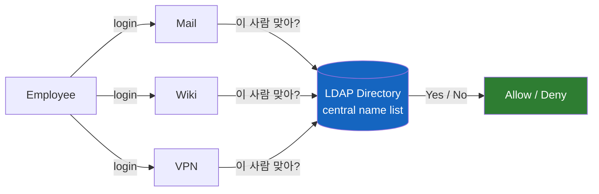
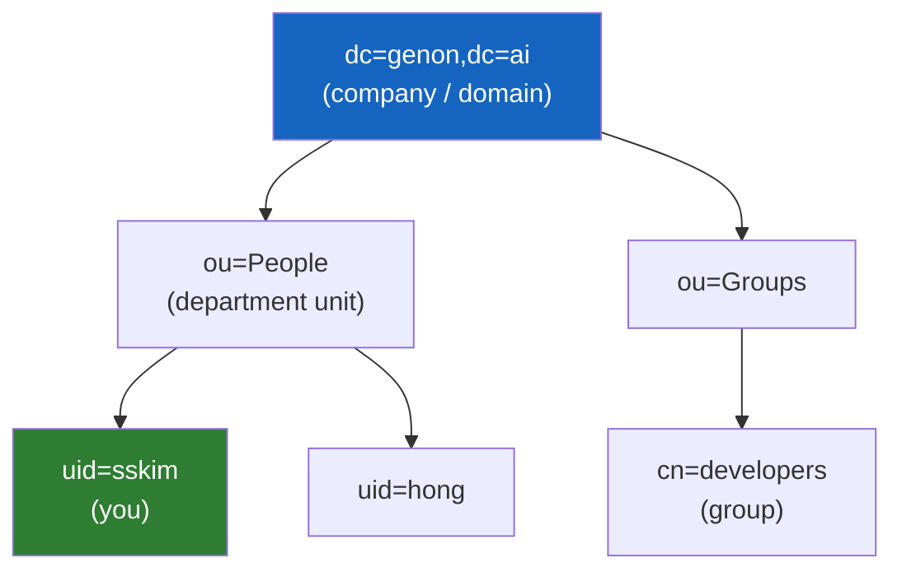
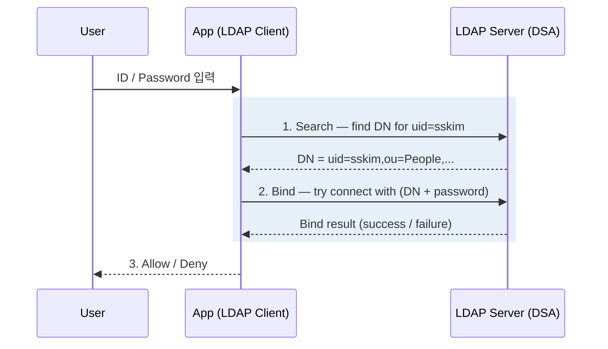

# 왜 사내 시스템들은 로그인을 LDAP에 물어볼까

회사 노트북을 켜고, 사내 위키에 들어가고, VPN에 접속한다. 분명 서로 다른 시스템인데 **같은 아이디와 비밀번호**가 통한다. 그리고 로그인 설정 화면 어딘가에는 늘 `LDAP`이라는 단어가 박혀 있다. 이 네 글자는 대체 무슨 일을 하길래 보안과 로그인 이야기마다 끼어드는 걸까?

## 결론부터 말하면

**LDAP은 "회사의 사용자 명부(디렉터리)"를 컴퓨터가 표준 방식으로 조회하고 인증하는 프로토콜**이다. 데이터베이스가 아니라 **통신 규약(protocol)** 이라는 점이 핵심이다 — HTTP가 웹페이지를 주고받는 약속이듯, LDAP은 "이 사람 우리 직원 맞아? 비밀번호 맞아?"를 묻고 답하는 약속이다.

모든 사내 시스템이 각자 계정을 들고 있는 대신, 계정을 **한 곳(디렉터리)** 에 모아두고 로그인할 때마다 거기에 물어보기 때문에 — 로그인·보안 화면에서 LDAP이 단골로 등장한다.



---

## 1. 왜 LDAP이 필요했을까 — 계정 관리 지옥

회사에 직원이 1,000명, 사내 시스템이 10개(메일, 위키, Jira, VPN, 사내 포털...) 있다고 해보자. 만약 각 시스템이 자기만의 계정 저장소를 따로 갖는다면 어떤 일이 벌어질까?

| 상황 | 각 시스템이 계정을 따로 관리할 때 |
|------|----------------------------------|
| 입사 | 신입사원 1명을 10개 시스템에 각각 등록 |
| 비밀번호 변경 | 10곳에서 따로 변경 (혹은 시스템마다 다른 비번) |
| 퇴사 | 10곳에서 빠짐없이 삭제 — 한 곳이라도 놓치면 **보안 구멍** |

이건 단순한 귀찮음이 아니라 **보안 사고의 씨앗**이다. 퇴사자의 VPN 계정 하나가 삭제되지 않고 남아 있으면, 그게 곧 침입 경로가 된다.

그래서 자연스러운 발상이 나온다. **"계정을 한 군데에 모아두고, 모든 시스템이 그곳에 물어보게 하면 안 될까?"** 이 "한 군데"가 바로 **디렉터리(Directory)** 이고, 그곳에 접근하는 표준 언어가 **LDAP**이다.

여기서 디렉터리란 데이터베이스의 일종이긴 하지만, "자주 읽고 거의 안 바뀌는" 정보(사용자·그룹·조직·장비)에 특화된 **읽기 최적화 저장소**다. 전화번호부를 떠올리면 된다 — 새 번호가 추가되는 일은 가끔이지만, 번호를 찾아보는 일은 하루에도 수십 번이다.

---

## 2. LDAP의 정체 — 이름의 한 글자씩 뜯어보기

LDAP은 **L**ightweight **D**irectory **A**ccess **P**rotocol의 약자다. 이름 자체가 정체를 거의 다 설명한다.

- **Directory (디렉터리)**: 위에서 본 "중앙 명부". 사용자·그룹·조직 정보를 모아둔 저장소.
- **Access (접근)**: 그 명부를 조회하고 인증하는 행위.
- **Protocol (프로토콜)**: 그 접근을 어떻게 주고받을지 정한 표준 통신 규약. → **그래서 LDAP은 "제품"이 아니라 "약속"이다.**
- **Lightweight (경량)**: 왜 "가볍다"고 할까? 여기에 역사가 있다.

LDAP은 1993년 미시간 대학에서, 그 이전의 무거운 디렉터리 표준이던 **X.500 DAP**(Directory Access Protocol)를 인터넷(TCP/IP) 환경에서 쓸 수 있도록 **경량화**한 것이다. X.500은 통신 규격이 복잡하고 무거웠는데, 그중 실무에 필요한 핵심만 추려 TCP/IP 위에 얹은 것이 "Lightweight" DAP, 즉 LDAP이다. 이후 1997년 인터넷 표준 디렉터리 프로토콜로 자리 잡았다.

### 디렉터리는 어떻게 생겼나 — 조직도를 닮은 트리

LDAP의 데이터는 관계형 DB의 테이블(행과 열)이 아니라, **회사 조직도처럼 위에서 아래로 뻗는 트리** 구조다. 이를 **DIT(Directory Information Tree)** 라고 부른다.



트리의 각 노드에 붙은 약자들은 처음 보면 암호 같지만, 의미는 단순하다.

| 약자 | 풀이 | 의미 |
|------|------|------|
| `dc` | Domain Component | 도메인 조각 (genon.ai → `dc=genon`, `dc=ai`) |
| `ou` | Organizational Unit | 부서·조직 단위 |
| `cn` | Common Name | 이름 (그룹명, 표시명 등) |
| `uid` | User ID | 로그인 아이디 |

한 사람을 가리키는 **전체 경로**를 잇대어 쓴 것이 **DN(Distinguished Name)** 이다. 예를 들어 당신을 가리키는 DN은 이렇게 생겼다.

```
uid=sskim,ou=People,dc=genon,dc=ai
```

이건 디렉터리 트리 안에서 한 사람을 유일하게 식별하는 **"절대 주소"** 다. 파일시스템의 절대 경로(`/home/people/sskim`)와 발상이 똑같다 — 루트에서부터 한 단계씩 내려와 정확히 한 객체를 짚는다.

---

## 3. 로그인은 실제로 어떻게 동작하나 — "Bind"의 정체

이제 핵심 질문. **LDAP으로 로그인한다는 건 구체적으로 무슨 일일까?**

LDAP에서 인증은 **Bind(바인드)** 라는 연산으로 이뤄진다. Java 개발자에게 익숙한 비유를 들자면, JDBC로 DB 커넥션을 맺을 때 `username`/`password`로 접속 인증을 하는 것과 정확히 같은 개념이다. "이 신원으로 접속(bind)이 되느냐?"가 곧 "이 사람이 맞느냐?"의 답이 된다.



흐름을 풀어 쓰면 이렇다.

1. **Search**: 사용자가 입력한 아이디(`sskim`)로 디렉터리를 뒤져 그 사람의 전체 주소인 **DN**을 찾아낸다.
2. **Bind**: 찾아낸 DN과 사용자가 입력한 비밀번호로 서버에 "접속이 되느냐"고 시도한다. 비밀번호가 맞으면 bind 성공, 틀리면 실패.
3. **결과**: bind 성공 → 인증 통과, 실패 → 로그인 거부.

즉 LDAP 서버는 **비밀번호 검증의 신뢰할 수 있는 출처(source of truth)** 역할을 한다. 각 앱은 비밀번호를 자기가 들고 있지 않고, "맞는지 아닌지"만 LDAP에 위임한다.

> 참고로 LDAP이 할 줄 아는 일은 인증뿐만이 아니다. 핵심 연산은 **Bind**(인증), **Search**(조회), **Add/Modify/Delete**(항목 추가·수정·삭제), **Unbind**(연결 종료)로 이뤄진다. 다만 일상에서 우리가 마주치는 건 거의 대부분 Bind와 Search다.

### 인증 방식: Simple vs SASL — 그리고 보안 함정

LDAP의 인증 방식은 크게 두 갈래다.

- **Simple authentication**: DN과 비밀번호를 그대로 보내 검증한다. 단순하지만, 기본(plain) LDAP에서는 이 **자격증명이 평문(clear text)으로 전송**된다.
- **SASL** (Simple Authentication and Security Layer): 인증 메커니즘을 갈아 끼울 수 있는 **프레임워크**다. 그 자체가 하나의 인증 방식이 아니라, Kerberos/GSSAPI 같은 메커니즘을 끼워 넣는 틀이다. 이런 메커니즘들은 챌린지-응답 방식으로 비밀번호를 직접 전송하지 않을 수 있어 더 안전하다.

여기서 "보안" 키워드와 LDAP이 엮이는 또 하나의 결정적 이유가 나온다. **평문 LDAP은 네트워크에서 비밀번호가 그대로 노출될 수 있다.** 그래서 실무에서는 반드시 암호화를 얹는다.

| 이름 | 정체 | 포트 |
|------|------|------|
| LDAP | 평문 (암호화 없음) | 389 |
| **LDAPS** | LDAP over SSL/TLS (암호화) | 636 |
| StartTLS | 389 포트에서 연결 도중 TLS로 승격 | 389 |

회사 환경에서 "LDAP을 쓴다"고 하면, 거의 항상 **LDAPS 또는 StartTLS로 암호화된 LDAP**을 의미한다.

---

## 4. 실제로 어디서 쓰이나 — 이름들의 정체

LDAP은 프로토콜(약속)이므로, 그 약속을 구현한 실제 제품들이 따로 있다. 우리가 현장에서 만나는 이름들은 대부분 이 구현체들이다.

| 제품 | 정체 |
|------|------|
| **Active Directory (AD)** | 마이크로소프트의 디렉터리 서비스. 윈도우 기반 회사 환경의 사실상 표준. 회사 노트북 윈도우 로그인은 이미 AD로 인증하고 있는 것이다. |
| **OpenLDAP** | 대표적 오픈소스 LDAP 서버. 리눅스 진영에서 널리 쓰인다. |
| **FreeIPA / 389 Directory Server** | 레드햇 계열 디렉터리 서비스. |

### Spring 개발자를 위한 한 컷

Spring Security는 LDAP 인증을 표준으로 지원한다. 설정의 골격은 "어느 LDAP 서버에 붙어서(`url`), 어떤 패턴으로 사용자 DN을 찾고(`userDnPatterns`/search), bind로 검증하라"는 것으로, 위에서 본 Search → Bind 흐름과 정확히 대응한다.

```java
@Bean
public AuthenticationManager authManager(/* ... */) {
    // url: ldaps://ad.genon.ai:636 같은 디렉터리 서버 주소
    // userDnPatterns: "uid={0},ou=People" — {0}에 입력한 아이디가 들어가 DN 완성
    // → 완성된 DN + 비밀번호로 bind 시도 = 인증
    // (실제 코드는 LdapAuthenticationProviderConfigurer로 구성)
    return ...;
}
```

핵심은, 우리가 직접 비밀번호를 비교하는 코드를 짜지 않는다는 것이다. **"이 DN으로 bind 되느냐"를 LDAP 서버에 위임**하고 그 결과만 받는다.

> **두 가지 방식 구분하기.** 위 예시처럼 `userDnPatterns`로 아이디를 끼워 넣어 DN을 즉시 조립하고 곧장 bind하는 방식을 **Direct Bind**라고 한다. 검색 단계를 생략하므로 빠르지만, DN의 위치 패턴이 고정적이어야 한다. 반면 3번 섹션에서 설명한 **Search-then-Bind**(먼저 디렉터리를 검색해 DN을 찾고, 그 DN으로 bind) 흐름을 쓰려면 `userSearchFilter`/`userSearchBase` 기반 설정을 사용한다. DN 구조가 사용자마다 일정하지 않은 환경에서는 후자가 필요하다.

### LDAP과 OAuth/SSO는 무슨 관계일까?

요즘 흔한 "구글로 로그인"(OAuth2/OIDC)과 LDAP은 **다른 계층**의 이야기라 헷갈리기 쉽다.

- **LDAP**: 주로 **사내(on-premise)** 환경에서 사용자 명부를 직접 들고 인증하는 전통적 방식.
- **OAuth2**: 인증 프로토콜이 아니라 **인가(authorization, 권한 위임)** 프레임워크다. "이 앱이 당신을 대신해 이 자원에 접근해도 되는가"를 토큰으로 위임한다.
- **OIDC** (OpenID Connect): OAuth2 **위에 올라간 인증(authentication) 계층**이다. "이 사람이 누구인가"를 검증하는 역할은 OAuth2가 아니라 바로 이 OIDC가 담당한다. "구글로 로그인"의 신원 확인이 여기에 해당한다.

둘은 경쟁 관계라기보다 자주 **함께 쓰인다**. 예를 들어 Keycloak 같은 SSO 서버가 앞단에서는 OIDC로 앱들에 토큰을 발급하면서, 뒷단에서는 회사의 **LDAP/AD를 사용자 저장소로 끌어다 쓰는** 구성이 매우 흔하다. 즉 LDAP이 여전히 "진짜 명부" 역할을 하고, SSO가 그 위에 현대적인 위임 인증 레이어를 씌우는 식이다.

---

## 5. 정리

| 오해 | 사실 |
|------|------|
| LDAP은 데이터베이스다 | **프로토콜(통신 규약)** 이다. 거의 항상 디렉터리 저장소와 한 몸으로 다닐 뿐. |
| LDAP은 비밀번호를 비교하는 함수다 | 비밀번호 검증을 **Bind 연산으로 서버에 위임**한다. 앱은 결과만 받는다. |
| LDAP은 그냥 켜면 안전하다 | 평문 LDAP은 비밀번호가 노출된다. 실무에선 **LDAPS/StartTLS**로 암호화한다. |
| LDAP과 AD는 다른 것이다 | AD는 **LDAP을 구현한** 마이크로소프트의 디렉터리 서비스다. |

한 줄 요약: **LDAP은 "회사 사용자 명부를 중앙에서 표준 방식으로 조회·인증하는 프로토콜"** 이다. 모든 시스템이 로그인할 때 이 명부에 물어보기 때문에, 보안과 로그인 화면에서 그 이름이 끊임없이 등장하는 것이다.

---

## 출처

- [RFC 4511 — Lightweight Directory Access Protocol (LDAP): The Protocol](https://datatracker.ietf.org/doc/html/rfc4511) (공식 표준 문서)
- [Red Hat — What is LDAP authentication?](https://www.redhat.com/en/topics/security/what-is-ldap-authentication)
- [Fortinet — What is LDAP Authentication? How Does It Work?](https://www.fortinet.com/resources/cyberglossary/ldap-authentication)
- [JumpCloud — What Is LDAP Authentication?](https://jumpcloud.com/blog/what-is-ldap-authentication)
- [UpGuard — What is LDAP? How it Works, Uses, and Security Risks](https://www.upguard.com/blog/ldap)
