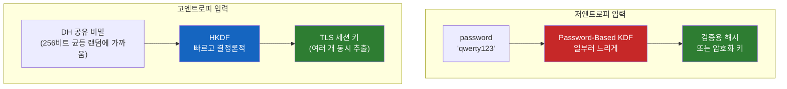
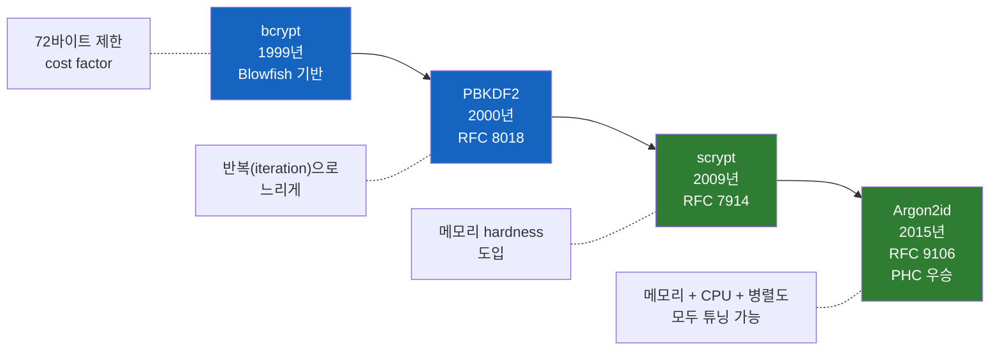
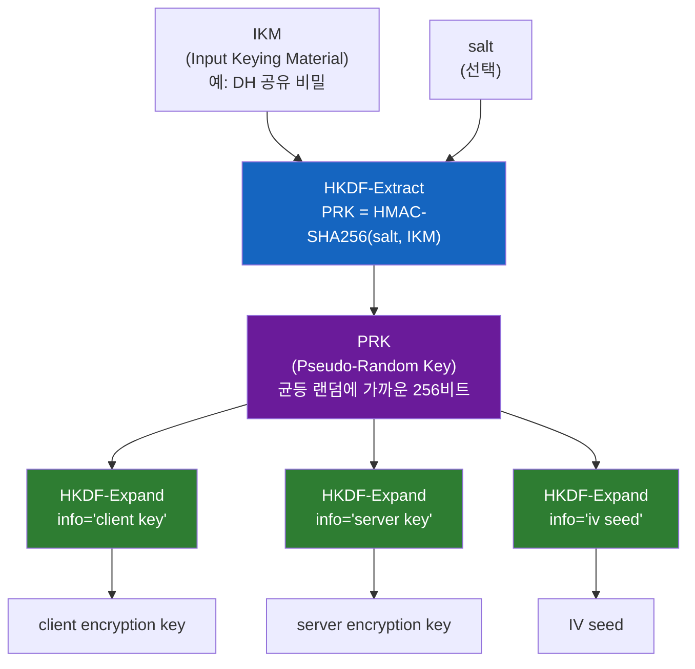

# 키 유도 함수(KDF)는 정확히 무엇이고 왜 필요할까?

비밀번호 저장 글을 쓰면서 bcrypt와 Argon2를 들여다봤는데, 책을 더 읽다 보니 이 알고리즘들이 사실 **KDF(Key Derivation Function, 키 유도 함수)** 라는 더 큰 가족의 일부였다. 그런데 이상한 점이 있었다. PBKDF2, bcrypt, scrypt, Argon2까지는 "비밀번호용"으로 쓴다고 치자. 그럼 왜 옆 페이지에는 HKDF라는 또 다른 KDF가 등장할까? 같은 KDF인데 RFC도, 사용처도, 추천 용도도 전혀 다르다. KDF는 도대체 하나의 도구인가, 여러 개인가?

## 결론부터 말하면

**KDF는 "어떤 비밀값에서 암호학적으로 안전한 키를 만들어내는 함수"의 통칭이다.** 입력의 성질이 두 가지로 갈리기 때문에 KDF도 두 부류로 나뉜다.

| 부류 | 입력 | 대표 알고리즘 | 핵심 요구사항 |
|------|------|---------------|---------------|
| **Password-Based KDF (PBKDF)** | 저엔트로피 (사람이 만든 비밀번호) | PBKDF2, bcrypt, scrypt, Argon2id | **느려야 한다** — 공격자의 brute-force 비용 증가 |
| **Key-Based KDF (KBKDF)** | 고엔트로피 (DH 공유키, 마스터키) | **HKDF**, NIST SP 800-108 KDFs | **빨라야 한다** — TLS 한 세션에 수십 번 호출 |



> **bcrypt/Argon2 = "비밀번호 검증용 도구"** 라는 시야에서 한 단계 올라가면, 이들은 **PBKDF의 한 종류** 일 뿐이다. KDF라는 우산 아래에는 비밀번호와 무관한 HKDF 같은 다른 도구도 있다. 이 글의 목적은 그 우산의 모양을 보는 것.

---

## 1. KDF가 도대체 뭔가? — 정의부터

**Key Derivation Function(KDF)** 은 어떤 입력 비밀값(input keying material, IKM)을 받아 **일정 길이의 암호학적 키**(output keying material, OKM)로 변환하는 함수다.

```
KDF: (비밀 입력, 부가정보) -> 의도한 길이의 키
```

여기까지 들으면 "그냥 SHA-256 한 번 돌리면 되는 거 아닌가?" 싶다. 실제로 SHA-256("my secret") 의 256비트 출력을 AES-256 키로 바로 써도 작동은 한다. 그런데 **왜 RFC와 NIST는 굳이 PBKDF2(RFC 8018), HKDF(RFC 5869), Argon2(RFC 9106) 같은 별도 표준을 만들었을까?**

이유는 SHA-256의 출력이 "키"로 쓰일 때 부족한 게 너무 많기 때문이다. 부족한 부분이 입력의 성질에 따라 달라서, KDF가 두 부류로 갈라진다.

### 1-1. 입력이 "사람이 만든 비밀번호"일 때 부족한 것

비밀번호는 **저엔트로피(low-entropy)** — 가능한 조합이 좁다. 8자리 영숫자라 해봐야 $62^8 \approx 2 \times 10^{14}$. SHA-256은 너무 빨라서 GPU 한 대로 6시간이면 다 시도된다 (이전 글에서 다룬 내용). 그래서 필요한 것은:

- **느리게 만들기** (cost factor, iterations)
- **메모리도 강제하기** (GPU/ASIC 차단)
- **사용자별 salt** (레인보우 테이블 차단)

이걸 처리하는 KDF를 **Password-Based KDF (PBKDF)** 라 부른다. PBKDF2, bcrypt, scrypt, Argon2id가 모두 여기 속한다.

### 1-2. 입력이 "이미 충분히 무작위인 비밀"일 때 부족한 것

TLS 핸드셰이크가 끝나면 클라이언트와 서버는 Diffie-Hellman 결과로 **고엔트로피(high-entropy) 공유 비밀** 을 갖는다. 256비트 정도의 거의-균등-랜덤 값. 이걸 그대로 AES 키로 쓸 수 있을까?

문제가 있다. 한 세션에는 키가 여러 개 필요하다 — 클라이언트→서버 암호화 키, 서버→클라이언트 암호화 키, MAC 키, IV 시드... 공유 비밀 하나에서 **여러 키를 독립적으로** 뽑아야 한다. 게다가 DH 결과는 비트가 균등하지 않을 수 있다(예: P-256 곡선의 x좌표는 완전 균등이 아니다). 그래서 필요한 것은:

- **분산 평탄화**: 입력의 비균등성을 제거해 균등 랜덤처럼 만들기 (extract)
- **확장**: 한 비밀에서 여러 키를 독립적으로 뽑기 (expand)
- **빠르게**: TLS 한 세션에서 수십 번 호출되니까

이걸 처리하는 KDF를 **Key-Based KDF (KBKDF)** 또는 **extract-and-expand KDF** 라 부른다. **HKDF(RFC 5869)** 가 사실상의 표준이다.

> **두 부류는 정반대 요구사항을 갖는다.** PBKDF는 "느려야" 안전하고, HKDF는 "빨라야" 실용적이다. 같은 단어(KDF)를 쓰지만 설계 목표가 다르다는 게 핵심이다.

---

## 2. Password-Based KDF의 진화 — 빠른 해시를 일부러 느리게

이전 글에서 본 bcrypt/Argon2는 모두 PBKDF다. 설계 동기가 어떻게 발전했는지 순서대로 정리해보자(bcrypt와 PBKDF2는 1999~2000년에 거의 동시기에 등장했고, 그 후 scrypt와 Argon2가 차례로 새로운 약점을 메꾸며 나왔다).



### 2-1. PBKDF2 (2000) — 반복 횟수로 느리게

핵심 발상은 단순하다. **HMAC을 수십만 번 반복** 한다. RFC 8018 §5.2 의 정의를 따라가면 출력 키를 hLen 바이트짜리 블록 $T_1, T_2, \ldots, T_l$ 로 나눠 만들고, 각 블록 $T_i$ 는 다음과 같이 계산한다:

```
PBKDF2(P, S, c, dkLen):
    for i = 1 to ceil(dkLen / hLen):
        U_1 = PRF(P, S || INT(i))         # INT(i): i를 4바이트 big-endian으로
        U_2 = PRF(P, U_1)
        U_3 = PRF(P, U_2)
        ...
        U_c = PRF(P, U_{c-1})
        T_i = U_1 XOR U_2 XOR ... XOR U_c
    return first dkLen bytes of (T_1 || T_2 || ... || T_l)
```

PRF는 보통 HMAC-SHA-256. 한 블록당 PRF를 `c`(iterations) 번 호출하고, 매 호출의 결과를 **XOR로 합산**하는 구조가 핵심이다. 직전 결과 $U_{j-1}$ 만 다음 입력으로 들어가지 salt나 카운터를 매번 끼우지 않는다 — 이 단순한 체인 + XOR이 RFC 8018이 명시하는 정확한 형태다.

iteration이 600,000이면 검증 한 번에 PRF 60만 번. OWASP 2026년 권장은 **HMAC-SHA-256 + 600,000 iterations**.

장점: 단순, 표준화 잘 되어 있음, **FIPS-140 인증** 가능.
약점: **메모리를 거의 안 쓴다** — GPU 수천 코어가 동시에 돌면 1대당 초당 수억 번. 시간은 늘었지만 병렬화에는 무방비다.

### 2-2. bcrypt (1999) — Blowfish 기반의 cost factor

PBKDF2와 비슷한 시기에 나왔지만 접근이 다르다. **Blowfish 암호의 키 스케줄(key schedule)을 의도적으로 비싸게 만들어** 반복한다. cost factor가 12면 $2^{12} = 4096$ 회.

장점: 검증된 역사, Spring Security 등 라이브러리 폭넓게 지원.
약점: **72바이트 입력 제한**, 메모리 hardness 없음, **password shucking** 공격(이전 글의 주의사항 참조).

### 2-3. scrypt (2009) — 메모리 hardness 등장

여기서 패러다임이 바뀐다. **GPU/ASIC가 위협이 되니, 메모리도 강제로 쓰게 만들자.**

scrypt는 큰 메모리 영역을 임의 접근(random access)하면서 계산한다. CPU는 메모리가 풍부하지만, GPU는 코어 수에 비해 메모리 대역폭이 좁고 ASIC은 칩에 메모리를 박아 넣는 데 비용이 든다. 즉, **메모리 hardness = 하드웨어 비대칭성을 회복하는 도구.**

파라미터: `N`(메모리 cost), `r`(블록 크기), `p`(병렬도). OWASP 권장은 `N=2^17, r=8, p=1` (~128MB).

### 2-4. Argon2id (2015) — Password Hashing Competition 우승

2013–2015년 PHC(Password Hashing Competition) 라는 공개 경연이 열렸다. 우승자가 Argon2. 세 가지 모드가 있고 그중 **Argon2id** 가 권장 기본값이다.

| 모드 | 특징 |
|------|------|
| Argon2d | 데이터 의존적 — 빠르지만 사이드채널에 약함 |
| Argon2i | 데이터 독립적 — 사이드채널 안전, GPU 저항 약함 |
| **Argon2id** | 둘의 하이브리드 — **OWASP/RFC 9106 권장** |

파라미터: `m`(메모리, KiB), `t`(시간/iterations), `p`(병렬도). OWASP 2026년 최소 권장은 `m=19 MiB, t=2, p=1` (또는 등가 프로파일들).

> **PHC 우승이 의미하는 것** — bcrypt나 scrypt는 한두 사람이 설계한 알고리즘이고, 광범위한 공개 분석을 거치지 않았다. Argon2는 24개 후보가 2년간 공개 검증을 받은 끝에 선정된 결과물이다. 이 "공개 검증"이라는 신뢰 기반 위에서 IRTF의 CFRG(Crypto Forum Research Group)가 RFC 9106(2021) 을 **Informational RFC** 로 발행해 구현 지향 명세와 테스트 벡터를 제공했다. 참고로 RFC 9106은 IETF Standards Track도 NIST 표준도 아니다 — 그러나 사실상 업계 참조 기준 역할을 한다.

### 2-5. 현재 권장 (OWASP 2026)

| 알고리즘 | 상태 | 사용 시점 |
|----------|------|-----------|
| **Argon2id** | A (Approved) | 신규 시스템 1순위 |
| scrypt | A | Argon2 미지원 환경 |
| bcrypt | A | 레거시 유지 |
| PBKDF2-HMAC-SHA256 | A | **FIPS-140 규제 준수 필요 시** |
| MD5/SHA-1 기반 KDF | D (Disallowed) | 사용 금지 |

---

## 3. 다른 부류 — HKDF, 빠른 KDF의 세계

여기서 시야를 넓힌다. **고엔트로피 입력에서 키를 만드는 KDF는 정반대 설계가 필요하다.**

대표 예가 **HKDF(HMAC-based Key Derivation Function, RFC 5869)** — TLS 1.3, Signal 프로토콜, QUIC, AWS KMS 등에서 핵심으로 쓰인다.

### 3-1. Extract-then-Expand 두 단계

HKDF의 발상은 분리(separation of concerns)다. **"비균등 입력을 균등하게 만드는 단계"** 와 **"균등한 비밀에서 여러 키를 뽑는 단계"** 를 나눈다.



**Extract 단계**: $\text{PRK} = \text{HMAC-Hash}(\text{salt}, \text{IKM})$ — 비균등한 입력 비트를 평탄화해서 의사난수 키(PRK) 하나를 만든다. 입력이 "조금만 무작위해도(min-entropy가 충분하면)" 출력은 균등 랜덤에 매우 가깝다는 것이 HMAC의 randomness extractor 성질이다.

> **HMAC 인자 배치에 주의** — 일반적으로 "비밀값이 HMAC의 key로 들어간다"는 직관이 있지만, HKDF-Extract에서는 **salt가 HMAC의 key 위치, IKM(실제 비밀값)이 message 위치** 에 들어간다. 직관과 반대인 이 배치는 의도적이다 — HKDF는 "salt가 비밀이 아니어도, 단지 IKM과 독립적이기만 해도" 작동하도록 설계됐다. salt는 비균등한 IKM의 비트 분포를 평탄화하는 **랜덤화 도구** 이지 비밀이 아니다. 그래서 HMAC의 key 자리에 공개된 salt를 둬도 안전성에 문제가 없다.

**Expand 단계**: PRK 하나에서 `info` 파라미터를 다르게 줘서 **서로 독립적인** 여러 키를 뽑는다. RFC 5869 본문 표기로:

$$T(i) = \text{HMAC-Hash}(PRK,\ T(i-1)\ ||\ \text{info}\ ||\ i)$$

`info`에 `"client encryption"`, `"server encryption"` 같은 컨텍스트 라벨을 넣는다. 이 메커니즘이 바로 **도메인 분리(Domain Separation)** 또는 **키 격리(Key Separation)** 라 불리는 현대 암호 프로토콜의 핵심 설계 장치다. HMAC이 PRF(pseudo-random function) 로 안전하다는 가정 아래, 같은 PRK라도 라벨이 다르면 결과 키들은 **계산적으로 구분이 불가능한 별도 키** 가 된다. 즉 한 키가 노출돼도 다른 라벨의 키를 효율적으로 추정할 수 없어 안전성이 분리된다.

> **info 파라미터 설계 팁** — 실무에서는 단순 용도 라벨에 그치지 않고 **애플리케이션 이름 + 프로토콜 버전 + 키 용도** 를 함께 묶어 넣는다. 예를 들어 `"myapp/v2/handshake/client-key"` 처럼. 이렇게 하면 같은 마스터 키를 다른 버전의 프로토콜이나 다른 애플리케이션이 우연히 재사용해도 키가 충돌하지 않는다 — TLS 1.3과 QUIC가 모두 이 패턴을 따른다.

> **출력 길이 제한** — HKDF-Expand는 한 번의 호출당 최대 $255 \times \text{HashLen}$ 바이트(SHA-256이면 $255 \times 32 = 8160$ 바이트)까지만 출력한다. TLS/QUIC처럼 여러 라벨로 짧은 키를 나눠 뽑는 용도에는 차고 넘치지만, KDF는 **무한 스트림 생성기가 아니다** 라는 점을 기억하자. 큰 바이트 스트림이 필요하면 KDF로 시드를 만들고 별도의 스트림 암호(ChaCha20 등)로 확장한다.

### 3-2. PBKDF와 정확히 어디가 다른가?

| | Password-Based KDF | HKDF |
|--|--------------------|------|
| 입력 엔트로피 | 낮음 (사람의 비밀번호) | 높음 (DH 공유 비밀, 마스터 키) |
| 속도 | **일부러 느리게** (100~250ms) | **빠르게** (수 마이크로초) |
| 메모리 hardness | Argon2/scrypt는 강제 | 없음 (불필요) |
| 출력 다중화 | 보통 1개 키 | **info 파라미터로 여러 키** |
| 주 용도 | 비밀번호 저장, 비밀번호→암호키 | 세션 키, 키 계층 |
| 대표 RFC | RFC 8018, 7914, 9106 | RFC 5869 |

> **HKDF로 비밀번호를 저장하면 안 된다.** HKDF는 빠르게 설계됐다 — 공격자에게도 빠르다. 반대로 **Argon2id로 TLS 세션 키를 매번 유도하면 안 된다.** 한 핸드셰이크당 100ms씩 잡아먹는 KDF는 실용성이 없다. 도구를 용도에 맞게 골라야 한다.

### 3-3. NIST의 KDF 분류

NIST는 SP 800-56C와 SP 800-108로 KBKDF를 표준화했다. 흥미로운 사실: **HKDF-Expand는 SP 800-108의 Feedback Mode KDF에 거의 일치** 하고, **HKDF 전체(Extract + Expand)는 SP 800-56C Rev. 2의 two-step key derivation 절차에 대응** 한다. 이때 HKDF-Extract는 그 two-step 절차의 **randomness extraction 단계** 에 해당한다. 참고로 SP 800-56C에는 별도로 정의된 one-step key derivation(OneStepNoCounter 등)이 따로 있는데, 이는 HKDF-Extract와는 다른 절차다. 결국 HKDF는 사실상 NIST 표준의 일부로 인정받는다.

PBKDF 쪽은 NIST SP 800-132("Recommendation for Password-Based Key Derivation")가 PBKDF2를 다룬다. NIST는 보수적이라 Argon2를 아직 800-132에 명시하지 않았지만, FIPS 외의 일반 권장은 OWASP가 Argon2id를 1순위로 둔다.

---

## 4. 실전 — 비밀번호로 AES 키를 만들고 싶다면?

이 부분이 책에서 자주 등장하는 사례다. 사용자가 입력한 비밀번호로 파일을 AES-256-GCM 암호화하고 싶다. SHA-256(password) 를 쓰면 안 된다는 건 알겠는데, 그럼 어떻게 해야 할까?

### 4-1. 잘못된 방법

```python
import hashlib
key = hashlib.sha256(password.encode()).digest()  # 32바이트 AES-256 키
# AES.new(key, ...)
```

문제: 비밀번호의 저엔트로피가 그대로 키에 반영된다. 공격자가 암호문 일부를 갖고 있으면 비밀번호 사전 공격으로 키를 복구할 수 있다. SHA-256이 빠르니까 GPU로 초당 수백억 번.

### 4-2. 올바른 방법 — PBKDF로 키를 유도

```python
from cryptography.hazmat.primitives.kdf.argon2 import Argon2id
import os

salt = os.urandom(16)  # 파일과 함께 저장
kdf = Argon2id(
    salt=salt,
    length=32,           # AES-256용 32바이트
    iterations=2,
    lanes=1,
    memory_cost=64 * 1024,  # 64 MiB
    ad=None,
    secret=None,
)
key = kdf.derive(password.encode())  # 이제 이 key를 AES에 쓰면 된다
```

암호화/복호화 양쪽이 같은 salt와 같은 파라미터로 같은 키를 재생성할 수 있다 — KDF의 결정론성. 그러면서도 공격자가 비밀번호를 추측하려면 시도마다 64MB 메모리 + 시간을 다 써야 한다.

### 4-3. 한 비밀번호로 여러 키가 필요하다면? — 하이브리드

파일 암호화 키와 무결성 검증 키 둘 다 필요할 때, **느린 KDF를 두 번 호출하는 건 낭비다.** 표준 패턴은:

```python
master_key = argon2id(password, salt)        # 느림 (한 번만)
enc_key = HKDF_Expand(master_key, info=b"encryption")  # 빠름
mac_key = HKDF_Expand(master_key, info=b"mac")         # 빠름
```

**Argon2id로 한 번 비싸게 master_key를 뽑고, HKDF로 빠르게 여러 키로 분기.** 두 부류 KDF가 협력하는 모범 사례다 — Argon2id는 비밀번호의 엔트로피 자체를 높이는 게 아니라 **공격자의 오프라인 추측 비용** 을 메모리/시간 비용으로 끌어올린다. 그 결과 추측 비용이 충분히 높아진 master_key를 HKDF가 받아서 용도별 키로 분기한다.

> **왜 Extract를 생략하고 Expand만 쓰는가?** Argon2id 출력은 이미 KDF가 의사난수로 만든 결과라 PRK 자격을 갖춘 균등 랜덤 비트열이다. 따라서 추가로 비균등성을 평탄화할 필요가 없고, 곧바로 **HKDF-Expand만** 호출해 라벨별 하위 키를 뽑으면 된다. 반대로 입력이 DH 공유 비밀처럼 비균등성이 남아 있는 값이면 Extract부터 거쳐야 한다 — 즉 **"이미 KDF 출력인 값은 Expand만, 원시 비밀은 Extract+Expand 둘 다"** 가 일반 규칙이다.

---

## 5. 정리

### 핵심 포인트

1. **KDF는 "비밀에서 키를 만드는 함수"의 통칭, 입력 엔트로피에 따라 두 부류로 갈린다**
   - Password-Based KDF: 저엔트로피 입력, 느리게 설계
   - Key-Based KDF (HKDF 등): 고엔트로피 입력, 빠르게 설계
   - 같은 "KDF"이지만 설계 목표가 정반대

2. **bcrypt/Argon2는 PBKDF의 한 종류** — 비밀번호 저장 글에서 본 알고리즘들이 KDF 우산 아래 있다는 것이 책에서 자연스럽게 KDF 단원으로 넘어가는 이유

3. **PBKDF의 진화는 하드웨어와의 군비경쟁** — 시간 hardness(PBKDF2/bcrypt) → 메모리 hardness(scrypt) → 종합 튜닝(Argon2id). GPU/ASIC 저항이 핵심 동인

4. **HKDF는 다른 게임이다** — extract-then-expand 두 단계로 (1) 비균등 입력을 평탄화하고 (2) info 파라미터로 여러 키를 독립적으로 뽑는다. TLS 1.3, Signal, QUIC의 기반

5. **실전에서는 둘이 협력한다** — 비밀번호로 여러 키가 필요하면 Argon2id로 master_key 한 번, HKDF로 키 분기. 비싼 단계는 한 번만, 분기는 싸게

### 어디에 어떤 KDF를 쓸지 — 한 줄 가이드

| 상황 | 선택 |
|------|------|
| 비밀번호 저장 | **Argon2id** (FIPS 필요 시 PBKDF2-HMAC-SHA256 600k+) |
| 비밀번호 → 암호화 키 (1개) | **Argon2id** |
| TLS/QUIC/Signal 같은 세션 키 도출 | **HKDF** |
| DH/ECDH 결과에서 여러 키 추출 | **HKDF** |
| 비밀번호에서 여러 키 도출 | **Argon2id로 master 1개 → HKDF로 분기** |

---

## 출처

- [RFC 9106 — Argon2 Memory-Hard Function](https://datatracker.ietf.org/doc/html/rfc9106)
- [RFC 7914 — scrypt Password-Based Key Derivation Function](https://datatracker.ietf.org/doc/html/rfc7914)
- [RFC 8018 — PKCS #5: Password-Based Cryptography Specification (PBKDF2)](https://datatracker.ietf.org/doc/html/rfc8018)
- [RFC 5869 — HMAC-based Extract-and-Expand Key Derivation Function (HKDF)](https://datatracker.ietf.org/doc/html/rfc5869)
- [NIST SP 800-132 — Recommendation for Password-Based Key Derivation](https://nvlpubs.nist.gov/nistpubs/Legacy/SP/nistspecialpublication800-132.pdf)
- [NIST SP 800-56C Rev. 2 — Recommendation for Key-Derivation Methods in Key-Establishment Schemes](https://nvlpubs.nist.gov/nistpubs/SpecialPublications/NIST.SP.800-56Cr2.pdf)
- [OWASP Password Storage Cheat Sheet](https://cheatsheetseries.owasp.org/cheatsheets/Password_Storage_Cheat_Sheet.html)
- [OWASP Application Security Verification Standard (ASVS)](https://owasp.org/www-project-application-security-verification-standard/) — Cryptography Appendix의 KDF 분류 기준 문서
- [Wikipedia — Key derivation function](https://en.wikipedia.org/wiki/Key_derivation_function)
- [The FIPS Compliance of HKDF (Filippo Valsorda)](https://words.filippo.io/fips-hkdf/)
