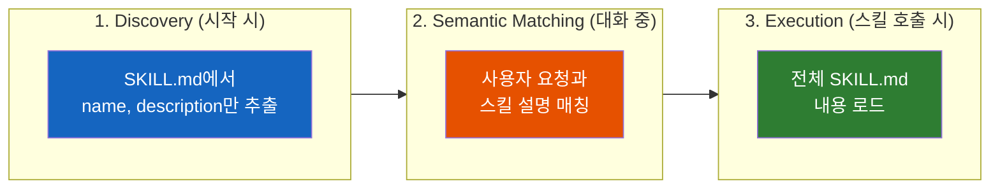

# Spring AI Agentic Patterns (Part 1): Agent Skills - 모듈식, 재사용 가능한 기능

Agent Skills는 AI 에이전트가 필요에 따라 발견하고 로드할 수 있는 지침, 스크립트, 리소스의 모듈식 폴더다. 프롬프트에 지식을 하드코딩하거나 모든 작업에 대해 전문화된 도구를 만드는 대신, 스킬은 에이전트 기능을 확장하는 유연한 방법을 제공한다.

Spring AI의 구현은 Agent Skills를 Java 생태계에 가져오며, LLM 이식성을 보장한다. 스킬을 한 번 정의하면 OpenAI, Anthropic, Google Gemini 또는 기타 지원되는 모델과 함께 사용할 수 있다.

**이 글은 Spring AI Agentic Patterns 시리즈의 첫 번째 포스트다.** 이 시리즈는 [Claude Code](https://code.claude.com/docs/en/overview)에서 영감을 받은 Spring AI를 위한 광범위한 에이전틱 패턴 세트인 [spring-ai-agent-utils](https://github.com/spring-ai-community/spring-ai-agent-utils) 툴킷을 탐구한다. Agent Skills(이 포스트)를 시작으로, Task Management, 대화형 워크플로우를 위한 AskUserQuestion, 복잡한 다중 에이전트 시스템을 위한 Hierarchical Sub-Agents를 다룰 예정이다.

> 이 글은 Spring 공식 블로그의 [Spring AI Agentic Patterns (Part 1): Agent Skills](https://spring.io/blog/2026/01/13/spring-ai-generic-agent-skills)를 번역하고, 추가적인 인사이트를 덧붙인 글이다.

🚀 **바로 시작하고 싶다면?** [Getting Started](#5-getting-started) 섹션으로 건너뛰어라.

Agent Skills부터 시작하자. 에이전트 지식을 조직화하기 위한 기반이다.

---

## 결론부터 말하면

**Agent Skills는 LLM이 필요할 때만 로드하는 "온디맨드 지식 모듈"이다.**



| 핵심 포인트 | 설명 |
|------------|------|
| Progressive Disclosure | 수백 개의 스킬을 등록해도 컨텍스트 윈도우는 가볍게 유지 |
| LLM 이식성 | OpenAI, Anthropic, Gemini 등 어떤 모델이든 동일한 스킬 사용 |
| Claude Code 호환 | 기존 Claude Code 스킬을 Spring AI에서 그대로 사용 가능 |

---

## 1. Agent Skills란 무엇인가?

Agent Skills는 `YAML frontmatter`가 포함된 Markdown 파일로 패키징된 모듈식 기능이다. 각 스킬은 메타데이터(최소한 `name`과 `description`)와 에이전트에게 특정 작업 수행 방법을 알려주는 지침이 포함된 `SKILL.md` 파일을 담은 폴더다. 스킬에는 스크립트, 템플릿, 참조 자료도 함께 번들링할 수 있다. frontmatter는 단순 문자열 값과 고급 사용 사례를 위한 복잡한 YAML 구조(리스트, 중첩 객체) 모두를 지원한다.

```
my-skill/
├── SKILL.md           # 필수: 지침 + 메타데이터
├── scripts/           # 선택: 실행 가능한 코드
├── references/        # 선택: 문서
└── assets/            # 선택: 템플릿, 리소스
```

스킬은 **Progressive Disclosure** 를 사용하여 컨텍스트를 효율적으로 관리한다:

1. **Discovery**: 시작 시 에이전트는 각 사용 가능한 스킬의 name과 description만 로드한다. 언제 관련될 수 있는지 알기에 충분한 정도만.
2. **Activation**: 작업이 스킬의 description과 일치하면, 에이전트는 전체 `SKILL.md` 지침을 컨텍스트에 읽어들인다.
3. **Execution**: 에이전트는 지침을 따르며, 필요에 따라 선택적으로 참조 파일을 로드하거나 번들된 코드를 실행한다.

이 접근법을 통해 수백 개의 스킬을 등록하면서도 컨텍스트 윈도우를 가볍게 유지할 수 있다.

> **💡 Tip:** Agent Skills에 대해 더 알아보려면 [공식 명세](https://agentskills.io/specification)를 확인하라.

---

## 2. 왜 Spring AI에서 Agent Skills를 사용하는가?

**Seamless Integration (원활한 통합)** - 몇 가지 도구를 등록하는 것만으로 기존 Spring AI 애플리케이션에 Agent Skills를 추가할 수 있다. 아키텍처 변경이 필요 없다.

**Portability and Model Agnostic - No Vendor Lock-In (이식성과 모델 무관성 - 벤더 종속 없음)** - 특정 LLM 플랫폼에 종속된 구현과 달리, 이 Spring AI 구현은 많은 LLM 프로바이더에서 작동하므로 코드나 스킬을 다시 작성하지 않고도 모델을 전환할 수 있다.

**Reusable and Composable (재사용 가능하고 조합 가능)** - 스킬은 프로젝트 간에 공유하고, 코드와 함께 버전 관리하고, 복잡한 워크플로우를 만들기 위해 조합하고, 헬퍼 스크립트와 참조 자료로 확장할 수 있다. Spring AI Skills는 기존 Claude Code Skills를 원활하게 지원한다.

> **💡 인사이트:** "기존 Claude Code Skills를 원활하게 지원한다"는 점이 핵심이다. Claude Code에서 이미 만들어진 수많은 스킬들을 Spring AI 애플리케이션에서 그대로 재사용할 수 있다. 이것이 진정한 이식성이다.

**관련 Spring AI 도구:** Agent Skills는 효율적인 도구 선택을 위한 [Dynamic Tool Discovery](https://spring.io/blog/2025/12/11/spring-ai-tool-search-tools-tzolov)와 스킬 실행 중 LLM 추론을 캡처하기 위한 [Tool Argument Augmentation](https://spring.io/blog/2025/12/23/spring-ai-tool-argument-augmenter-tzolov) 같은 다른 Spring AI 도구 기반 기능들과 잘 작동한다.

---

## 3. Spring AI Skills 작동 방식

Spring AI는 [도구 기반 통합 접근법](https://agentskills.io/integrate-skills#integration-approaches)을 사용하여, 모든 LLM이 스킬을 트리거하고 번들된 자산에 접근할 수 있는 도구를 구현한다. 이 구현은 [Claude Code](https://code.claude.com/docs/en/settings#tools-available-to-claude)의 `Skills`, `Bash`, `Read` 도구 명세를 밀접하게 따른다.

핵심 도구 세트는 다음과 같다: [SkillsTool](https://github.com/spring-ai-community/spring-ai-agent-utils/blob/main/spring-ai-agent-utils/docs/SkillsTool.md)(필수), [ShellTools](https://github.com/spring-ai-community/spring-ai-agent-utils/blob/main/spring-ai-agent-utils/docs/ShellTools.md)(선택), [FileSystemTools](https://github.com/spring-ai-community/spring-ai-agent-utils/blob/main/spring-ai-agent-utils/docs/FileSystemTools.md)(선택). SkillsTool은 AI 모델이 지정된 스킬을 필요에 따라 발견하고 로드할 수 있게 하는 `Skill` 함수를 제공하며, FileSystemTools(참조 파일 읽기)와 ShellTools(헬퍼 스크립트 실행)와 함께 작동한다.

스킬은 세 단계 프로세스를 통해 작동한다:


### 3.1 Discovery (시작 시)

초기화 시 SkillsTool은 설정된 스킬 디렉토리(예: `.claude/skills/`)를 스캔하고 각 `SKILL.md` 파일에서 YAML frontmatter를 파싱한다. `name`과 `description` 필드를 추출하여 `Skill` 도구의 설명에 직접 임베드되는 경량 스킬 레지스트리를 구축하고, 대화 컨텍스트를 소비하지 않으면서 LLM에게 보이게 만든다.

### 3.2 Semantic Matching (대화 중)

사용자가 요청하면, LLM은 도구 정의에 임베드된 스킬 설명을 검토한다. LLM이 사용자 요청이 스킬의 설명과 의미적으로 일치한다고 판단하면, 스킬 이름을 매개변수로 하여 `Skill` 도구를 호출한다.

### 3.3 Execution (스킬 호출 시)

`Skill` 도구가 호출되면, SkillsTool은 디스크에서 전체 `SKILL.md` 내용을 로드하고 스킬의 기본 디렉토리 경로와 함께 LLM에 반환한다. 그러면 LLM은 스킬 내용의 지침을 따른다. 스킬이 추가 파일이나 헬퍼 스크립트를 참조하면, LLM은 FileSystemTools의 `Read` 함수나 ShellTools의 `Bash` 함수를 사용하여 필요할 때 접근한다.

---

## 4. 실전 예제: Skills in Action

이 섹션에서는 실제 예제를 통해 스킬이 실제로 어떻게 작동하는지 보여준다.

### 참조 파일과 스크립트가 포함된 스킬

Step 3의 온디맨드 로딩은 스킬이 추가 리소스를 번들링할 때 강력해진다. 스킬은 보충 지침이 담긴 참조 파일과 데이터 처리를 위한 실행 가능한 스크립트를 포함할 수 있다. 모두 필요할 때만 로드된다.

다음은 YouTube 트랜스크립트 추출 헬퍼와 보충 `research_methodology.md` 지침을 포함하는 my-skill 스킬의 예다:

**스킬 디렉토리 구조:**

```
.claude/skills/my-skill/
├── SKILL.md
├── scripts/
│   └── get_youtube_transcript.py
└── research_methodology.md
```

**SKILL.md 내용:**

```markdown
...
**개념이 익숙하지 않거나 리서치가 필요한 경우:**
상세 가이드를 위해 `research_methodology.md`를 로드하세요.

**사용자가 YouTube 영상을 제공한 경우:**
영상의 트랜스크립트를 위해 `uv run scripts/get_youtube_transcript.py <video_url>`을 호출하세요.
...
```

사용자가 "이 영상의 개념을 설명해줘: https://youtube.com/watch?v=abc123. 리서치 방법론을 따라서"라고 요청하면, AI는:

1. my-skill 스킬을 호출하고 SKILL.md 내용을 로드한다
2. 리서치 방법론이 필요하다는 것을 인식하고 `Read`를 사용하여 `research_methodology.md`를 로드한다
3. YouTube URL을 인식하고 ShellTools를 통해 `Bash`를 사용하여 헬퍼 스크립트를 실행한다
4. 비디오 트랜스크립트를 사용하여 리서치 방법론 지침에 따라 개념을 설명한다


**스크립트 코드는 컨텍스트 윈도우에 들어가지 않는다.** 출력만 들어가므로, 이 접근법은 토큰 효율성이 매우 높다.

💡 **Demo:** 이 워크플로우를 구현한 [Skills-Demo](https://github.com/spring-ai-community/spring-ai-agent-utils/tree/main/examples/skills-demo)를 확인하라.

> ⚠️ **보안 참고:** 스크립트는 샌드박싱 없이 로컬 머신에서 직접 실행된다. 필요한 런타임(Python, Node.js 등)을 미리 설치해야 한다. 더 안전한 운영을 위해 컨테이너에서 에이전틱 애플리케이션을 실행하는 것을 고려하라.

> **💡 인사이트:** 이 패턴의 핵심은 "스크립트 코드가 아닌 출력만 컨텍스트에 들어간다"는 점이다. 예를 들어 100줄짜리 Python 스크립트가 있어도, LLM은 그 코드를 볼 필요 없이 실행 결과만 받는다. 이것이 토큰 효율성의 비결이다.

---

## 5. Getting Started

Spring AI 프로젝트에 Agent Skills를 추가할 준비가 되었는가?

### 5.1 의존성 추가

```xml
<dependency>
    <groupId>org.springaicommunity</groupId>
    <artifactId>spring-ai-agent-utils</artifactId>
    <version>0.4.1</version>
</dependency>
```

> **Note:** 최신 안정 릴리스는 [GitHub releases 페이지](https://github.com/spring-ai-community/spring-ai-agent-utils/releases)에서 확인하라.

> **Note:** Spring-AI 버전 `2.0.0-SNAPSHOT` 또는 `2.0.0-M2`(릴리스 시)가 필요하다.

### 5.2 에이전트 구성

```java
@SpringBootApplication
public class Application {

    @Bean
    CommandLineRunner demo(ChatClient.Builder chatClientBuilder) {
        return args -> {
            ChatClient chatClient = chatClientBuilder
                .defaultToolCallbacks(SkillsTool.builder()
                    .addSkillsDirectory(".claude/skills")
                    .build())
                .defaultTools(FileSystemTools.builder().build())
                .defaultTools(ShellTools.builder().build())
                .build();

            String response = chatClient.prompt()
                .user("Your task here")
                .call()
                .content();
        };
    }
}
```

> **💡 Production Tip:** 패키징된 애플리케이션의 경우, Spring Resources를 사용하여 클래스패스에서 스킬을 로드할 수 있다:
>
> ```java
> .defaultToolCallbacks(SkillsTool.builder()
>     .addSkillsResource(resourceLoader.getResource("classpath:.claude/skills"))
>     .build())
> ```
>
> 이것은 JAR/WAR 배포의 일부로 스킬을 배포할 때 특히 유용하다.

> **💡 인사이트:** JAR 패키징 환경에서 클래스패스 내 디렉토리를 리소스로 로드할 때, 표준 Java `Resource` 인터페이스는 하위 파일 목록을 가져오는 데 제약이 있을 수 있다. `spring-ai-agent-utils`는 내부적으로 `PathMatchingResourcePatternResolver`를 사용하여 이 문제를 해결한다.

### 5.3 첫 번째 스킬 만들기

```bash
mkdir -p .claude/skills/code-reviewer
cat > .claude/skills/code-reviewer/SKILL.md << 'EOF'
---
name: code-reviewer
description: Java 코드를 베스트 프랙티스, 보안 이슈, Spring Framework 컨벤션에 대해 리뷰합니다. 사용자가 코드 리뷰, 분석, 감사를 요청할 때 사용하세요.
---

# Code Reviewer

## Instructions

코드 리뷰 시:
1. 보안 취약점 확인 (SQL injection, XSS 등)
2. Spring Boot 베스트 프랙티스 검증 (@Service, @Repository 등의 적절한 사용)
3. 잠재적 null pointer exception 확인
4. 가독성과 유지보수성 개선 제안
5. 코드 예제와 함께 라인별 구체적인 피드백 제공
EOF
```

### 5.4 스킬과 함께 에이전트 사용

```java
String response = chatClient.prompt()
    .user("Review this controller class for best practices: " +
          "src/main/java/com/example/UserController.java")
    .call()
    .content();

System.out.println(response);
```

이것을 실행하면, LLM은:

1. "Review this controller"를 code-reviewer 스킬의 description과 매칭한다
2. `Skill` 도구를 호출하여 `SKILL.md`에서 전체 지침을 로드한다
3. `Read` 도구(FileSystemTools)를 사용하여 UserController.java 파일에 접근한다
4. 리뷰 지침을 따라 상세한 피드백을 제공한다

스킬의 지침이 프롬프트에 리뷰 로직을 하드코딩하지 않고도 LLM의 동작을 안내한다. 리뷰 방식을 변경하려면 스킬 파일만 업데이트하면 된다.

---

## 6. 현재 제한사항

Spring AI Agent Skills 구현은 강력하고 유연하지만, 알아두어야 할 몇 가지 현재 제한사항이 있다:

### 6.1 Script Execution Security (스크립트 실행 보안)

ShellTools를 통해 실행되는 스크립트는 샌드박싱 없이 로컬 머신에서 직접 실행된다. 이는 잠재적으로 안전하지 않은 코드가 파일시스템, 네트워크 또는 시스템 리소스에 접근할 수 있음을 의미한다. 특히 서드파티 소스의 스킬 스크립트는 사용 전에 항상 검토하라. 노출을 제한하려면 컨테이너화된 환경(Docker, Kubernetes)에서 에이전틱 애플리케이션을 실행하는 것을 고려하라.

### 6.2 No Human-in-the-Loop

현재 스킬이나 스크립트를 실행하기 전에 인간 승인을 요구하는 내장 메커니즘이 없다. LLM은 등록된 모든 스킬을 호출하고 번들된 스크립트를 자동으로 실행할 수 있다. 민감한 작업을 처리하는 프로덕션 환경에서는 Spring AI의 도구 콜백 메커니즘을 사용하여 사용자 정의 승인 워크플로우를 구현해야 할 수 있다. 예를 들어, `ToolCallback` 래퍼.

### 6.3 Limited Skill Versioning (제한된 스킬 버전 관리)

현재 스킬에 대한 내장 버전 관리 시스템이 없다. 스킬의 동작을 업데이트하면 해당 스킬을 사용하는 모든 애플리케이션이 즉시 새 버전을 사용하게 된다. 프로덕션 배포의 경우 디렉토리 구조를 통한 자체 버전 관리 전략을 구현하는 것을 고려하라(예: `.claude/skills/v1/`, `.claude/skills/v2/`).

> **💡 인사이트:** Human-in-the-Loop 부재는 프로덕션 환경에서 중요한 고려사항이다. Spring AI의 `ToolCallback`을 확장하여 특정 스킬 실행 전에 사용자 승인을 요청하는 래퍼를 구현할 수 있다. 예를 들어, 파일 삭제나 외부 API 호출 같은 민감한 작업에 대해서만 승인을 요구하는 방식이다.

---

## 7. 결론

Agent Skills는 벤더 종속 없이 Spring AI 애플리케이션에 모듈식, 재사용 가능한 기능을 제공한다. 도메인 지식을 온디맨드로 제공함으로써, 코드 변경 없이 에이전트 동작을 업데이트하고, 프로젝트 간에 스킬을 공유하고, LLM 프로바이더 간에 원활하게 전환할 수 있다.

spring-ai-agent-utils 구현은 간단한 도구 기반 접근법으로 Java 개발자에게 이 패턴을 접근 가능하게 만든다. 코딩 어시스턴트, 문서 생성기, 도메인 특화 에이전트를 구축하든, 스킬은 에이전트 지식을 조직화하기 위한 확장 가능한 기반을 제공한다.

**이것은 시작에 불과하다.** 이 시리즈의 다음 포스트들은 에이전트가 복잡한 워크플로우를 처리하는 방식을 변화시키는 고급 에이전틱 패턴을 더 깊이 다룰 것이다:

**이 시리즈에서 다룰 내용:**

* **Task Management** - TodoWriteTool이 상태 추적으로 투명하고 추적 가능한 에이전트 워크플로우를 관리하여 다중 단계 작업을 가능하게 하는 방법
* **Interactive Workflows with AskUserQuestion** - 에이전트가 실행 중에 사용자 선호도를 수집하고 요구사항을 명확히 하는 방법
* **Hierarchical Sub-Agents** - 전용 컨텍스트 윈도우로 복잡한 작업을 처리하는 전문화된 서브에이전트로 다중 에이전트 아키텍처를 구축하기 위한 TaskTools

그 과정에서 핵심 에이전틱 도구들(FileSystemTools, ShellTools, GrepTool, GlobTool, 웹 접근 도구)이 이러한 패턴과 어떻게 통합되어 정교한 에이전트 동작을 가능하게 하는지 보여줄 것이다.

[예제 프로젝트](https://github.com/spring-ai-community/spring-ai-agent-utils/tree/main/examples)를 탐색하거나 [Agent Skills 명세](https://agentskills.io/specification)를 살펴보며 더 알아보라.

---

## 출처

### Spring AI Agent Utils Toolkit

* **GitHub Repository**: [spring-ai-agent-utils](https://github.com/spring-ai-community/spring-ai-agent-utils)
* **Full Documentation**: [README.md](https://github.com/spring-ai-community/spring-ai-agent-utils/blob/main/spring-ai-agent-utils/README.md)
* **Tool Documentation** - 이 포스트에서 다룬 도구들: [SkillsTool](https://github.com/spring-ai-community/spring-ai-agent-utils/blob/main/spring-ai-agent-utils/docs/SkillsTool.md), [FileSystemTools](https://github.com/spring-ai-community/spring-ai-agent-utils/blob/main/spring-ai-agent-utils/docs/FileSystemTools.md), [ShellTools](https://github.com/spring-ai-community/spring-ai-agent-utils/blob/main/spring-ai-agent-utils/docs/ShellTools.md)
* **Spring AI Documentation**: [docs.spring.io/spring-ai](https://docs.spring.io/spring-ai/reference/)

### Example Projects

* [skills-demo](https://github.com/spring-ai-community/spring-ai-agent-utils/tree/main/examples/skills-demo) - 집중된 스킬 데모 (이 포스트)
* [code-agent-demo](https://github.com/spring-ai-community/spring-ai-agent-utils/tree/main/examples/code-agent-demo) - 전체 툴킷 통합 (Parts 2-3)
* [subagent-demo](https://github.com/spring-ai-community/spring-ai-agent-utils/tree/main/examples/subagent-demo) - 계층적 에이전트 (Part 4)

### Agent Skills

* **Specification**: [agentskills.io](https://agentskills.io/specification)
* **Claude Code Documentation**: [code.claude.com/docs](https://code.claude.com/docs/en/skills)

### Related Spring AI Blogs

* [Dynamic Tool Discovery](https://spring.io/blog/2025/12/11/spring-ai-tool-search-tools-tzolov) - 온디맨드 도구 로딩으로 34-64% 토큰 절약
* [Tool Argument Augmentation](https://spring.io/blog/2025/12/23/spring-ai-tool-argument-augmenter-tzolov) - 도구 실행 중 LLM 추론 및 내부 생각 캡처
