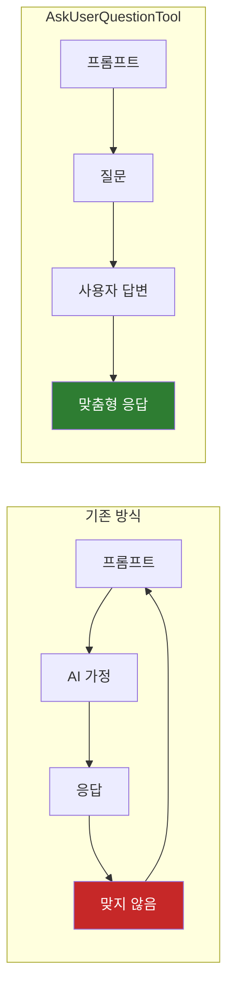
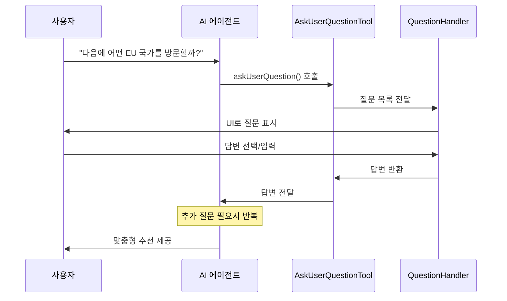
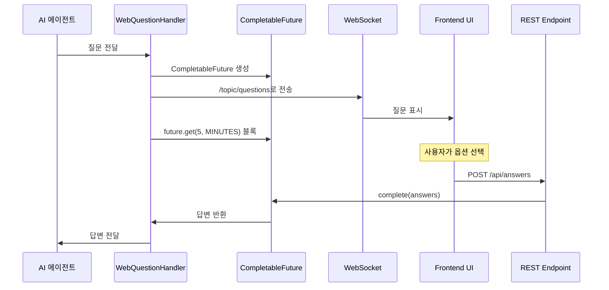

# Spring AI Agentic Patterns (Part 2): AskUserQuestionTool - 행동하기 전에 명확히 하는 에이전트

전통적인 AI 상호작용은 일반적인 패턴을 따른다: 프롬프트를 제공하면, AI가 가정을 하고, 응답을 생성한다. 그 가정이 당신의 필요와 맞지 않으면, 수정을 반복해야 한다. 각각의 가정은 재작업을 만든다. 시간과 컨텍스트 낭비다.

**AI 에이전트가 답변을 제공하기 전에 명확히 하는 질문을 할 수 있다면 어떨까?**

**AskUserQuestionTool** 은 이 문제를 해결한다. AI 에이전트가 답변 *전에* 명확히 하는 질문을 하고, 요구사항을 대화형으로 수집하고, 처음부터 실제 필요에 맞는 명세를 만들 수 있게 해준다.

Spring AI의 구현은 이 대화형 패턴을 Java 생태계에 가져오며, LLM 이식성을 보장한다. 질문 핸들러를 한 번 정의하면 OpenAI, Anthropic, Google Gemini 또는 기타 지원되는 모델과 함께 사용할 수 있다.

**이 글은 Spring AI Agentic Patterns 시리즈의 Part 2다.** [Part 1](https://spring.io/blog/2026/01/13/spring-ai-generic-agent-skills)에서는 AI 기능을 확장하는 모듈식 기능인 Agent Skills를 탐구했다. 이제 AI 에이전트를 요구사항을 대화형으로 수집하는 협력적 파트너로 변환하는 AskUserQuestionTool을 살펴본다.

> 이 글은 Spring 공식 블로그의 [Spring AI Agentic Patterns (Part 2): AskUserQuestionTool](https://spring.io/blog/2026/01/16/spring-ai-ask-user-question-tool)를 번역하고, 추가적인 인사이트를 덧붙인 글이다.

---

## 결론부터 말하면

**AskUserQuestionTool은 AI가 가정하는 대신 질문하게 만드는 도구다.**



| 핵심 포인트 | 설명 |
|------------|------|
| 가정 제거 | AI가 추측하는 대신 명확히 하는 질문을 먼저 함 |
| 첫 번째 시도에 정확한 응답 | 반복적인 수정 없이 맞춤형 솔루션 제공 |
| LLM 이식성 | 어떤 LLM 프로바이더에서든 동일하게 작동 |
| 구조화된 입력 | 객관식 + 자유 텍스트로 정확한 요구사항 수집 |

---

## 1. AskUserQuestionTool 작동 방식

[AskUserQuestionTool](https://github.com/spring-ai-community/spring-ai-agent-utils/blob/main/spring-ai-agent-utils/docs/AskUserQuestionTool.md)은 [spring-ai-agent-utils](https://github.com/spring-ai-community/spring-ai-agent-utils) 툴킷의 일부로, [Claude Code의 AskUserQuestion 도구](https://platform.claude.com/docs/en/agent-sdk/user-input#question-format)의 이식 가능한 Spring AI 구현이며, AI 에이전트가 실행 중에 사용자에게 객관식 질문을 할 수 있게 해준다.


이 도구는 질문-응답 워크플로우를 따른다:



1. **AI가 질문을 생성한다** - 에이전트가 입력이 필요하다고 판단하고 질문을 구성(각각 질문 텍스트, 헤더, 2-4개 옵션, multiSelect 플래그 포함)하여 `askUserQuestion` 도구 함수를 호출한다
2. **사용자가 답변을 제공한다** - 커스텀 핸들러가 이 질문들을 받아 UI를 통해 제시하고, 답변을 수집하여 AI에게 반환한다
3. **추가 질문을 한다** - 추가 사용자 피드백을 수집하기 위해 필요하면 1과 2를 반복한다
4. **AI가 컨텍스트와 함께 계속한다** - 에이전트가 답변을 사용하여 맞춤형 솔루션을 제공한다

각 질문은 다음을 지원한다:

* **Single-select 또는 multi-select** - 하나의 옵션을 선택하거나 여러 개를 조합
* **Free-text input** - 사용자가 미리 정의된 옵션 외에 항상 사용자 정의 텍스트를 제공할 수 있음
* **Rich context** - 모든 옵션에 의미와 트레이드오프를 설명하는 설명 포함

💡 **Portability and Model Agnostic - No Vendor Lock-In (이식성과 모델 무관성 - 벤더 종속 없음)** - 특정 LLM 플랫폼에 종속된 구현과 달리, 이 Spring AI 구현은 많은 LLM 프로바이더에서 작동하므로 코드나 질문 핸들러를 다시 작성하지 않고도 모델을 전환할 수 있다.

💡 **MCP Elicitation과의 관계** - AskUserQuestionTool은 대화형 사용자 입력에 대한 에이전트-로컬 접근법으로, [MCP Elicitation](https://modelcontextprotocol.io/specification/2025-03-26/client/elicitation) 기능과 개념적으로 유사하다. MCP Elicitation이 MCP 서버가 JSON 스키마를 통해 구조화된 사용자 입력을 요청할 수 있게 하는 반면, AskUserQuestionTool은 MCP 서버 없이 에이전트 내에서 직접 동일한 대화형 패턴을 제공한다. Spring AI는 서버 주도 시나리오를 위해 `@McpElicitation` 어노테이션을 통한 [전체 MCP Elicitation 지원](https://docs.spring.io/spring-ai/reference/api/mcp/mcp-annotations-client.html#_mcpelicitation)도 제공한다.

> **💡 인사이트:** MCP Elicitation과 AskUserQuestionTool의 차이를 이해하는 것이 중요하다. MCP Elicitation은 "서버 측"에서 클라이언트에게 정보를 요청하는 방식이고, AskUserQuestionTool은 "에이전트 내부"에서 사용자에게 직접 질문하는 방식이다. 대부분의 경우 AskUserQuestionTool이 더 단순하고 직관적이다.

⚠️ **Important:** 이 도구는 **메인 에이전트에서만 작동**한다. 서브에이전트는 격리된 컨텍스트에서 작동하여 직접적인 사용자 상호작용이 불가능하다.

---

## 2. Question과 Answer 구조

### 2.1 Question 구조

AI가 생성하는 각 질문은 다음 필드를 포함한다:

| 필드 | 설명 | 제약 |
|------|------|------|
| `question` | 완전한 질문 텍스트 | 필수, non-blank, "?"로 끝나야 함 |
| `header` | UI에 표시될 짧은 레이블 | 필수, 최대 12자 |
| `options` | 선택 가능한 옵션 목록 | 2-4개, 각각 `label`과 `description` 포함 |
| `multiSelect` | 복수 선택 허용 여부 | boolean |

**Single-select 예제:**

```json
{
  "question": "어떤 라이브러리를 날짜 포맷팅에 사용할까요?",
  "header": "Library",
  "options": [
    {"label": "Moment.js", "description": "인기 있지만 무거운 라이브러리"},
    {"label": "Day.js", "description": "Moment.js의 경량화 대안"},
    {"label": "date-fns", "description": "모듈식이고 tree-shakeable"}
  ],
  "multiSelect": false
}
```

**Multi-select 예제:**

```json
{
  "question": "어떤 기능을 활성화하시겠습니까?",
  "header": "Features",
  "options": [
    {"label": "Authentication", "description": "사용자 로그인 및 회원가입"},
    {"label": "Database", "description": "PostgreSQL 통합"},
    {"label": "Caching", "description": "Redis 캐싱 레이어"}
  ],
  "multiSelect": true
}
```

> **💡 인사이트:** `header`가 최대 12자로 제한된 이유는 UI 일관성 때문이다. Claude Code의 터미널 UI, 웹 기반 UI 등 다양한 환경에서 깔끔하게 표시되려면 짧은 레이블이 필요하다. "Authentication Method"보다 "Auth"가 낫다.

### 2.2 Answer 형식

`QuestionHandler`는 함수형 인터페이스로, `List<Question>`을 받아 `Map<String, String>`을 반환한다:

```java
@FunctionalInterface
public interface QuestionHandler {
    Map<String, String> handle(List<Question> questions);
}
```

- **Key**: 질문 텍스트 (`question` 필드 값)
- **Value**: 선택된 옵션 레이블
  - Single-select: `"Day.js"`
  - Multi-select: `"Authentication, Database"` (쉼표로 구분)
  - Free-text: 사용자가 직접 입력한 텍스트

람다식으로 간단히 구현할 수 있다:

```java
QuestionHandler handler = questions -> {
    Map<String, String> answers = new HashMap<>();
    for (Question q : questions) {
        String answer = promptUser(q);  // UI에서 답변 수집
        answers.put(q.question(), answer);
    }
    return answers;
};
```

---

## 3. Getting Started

### 3.1 의존성 추가

```xml
<dependency>
    <groupId>org.springaicommunity</groupId>
    <artifactId>spring-ai-agent-utils</artifactId>
    <version>0.7.0</version>
</dependency>
```

> **Note:** Spring AI `2.0.0-M4` 이상이 필요하다 (2026-04 기준 `spring-ai-agent-utils 0.7.0`과 호환). 최신 버전은 [GitHub releases](https://github.com/spring-ai-community/spring-ai-agent-utils/releases)에서 확인하라.

### 3.2 에이전트 구성

```java
ChatClient chatClient = chatClientBuilder
    .defaultTools(AskUserQuestionTool.builder()
        .questionHandler(this::handleQuestions)
        .build())
    .build();
```

### 3.3 QuestionHandler 구현

아래의 콘솔 또는 웹 예제를 사용하여 `QuestionHandler`를 구현하라.

에이전트가 명확화가 필요할 때 자동으로 도구를 호출하고 답변을 사용하여 맞춤형 솔루션을 제공한다.

💡 **Demo:** [ask-user-question-demo](https://github.com/spring-ai-community/spring-ai-agent-utils/tree/main/examples/ask-user-question-demo)

---

## 4. QuestionHandler 예제

### 4.1 내장 CommandLineQuestionHandler 사용

라이브러리는 CLI 애플리케이션을 위한 `CommandLineQuestionHandler`를 제공한다:

```java
import org.springaicommunity.agent.utils.CommandLineQuestionHandler;

AskUserQuestionTool askTool = AskUserQuestionTool.builder()
    .questionHandler(new CommandLineQuestionHandler())
    .build();

ChatClient chatClient = chatClientBuilder
    .defaultTools(askTool)
    .build();
```

이 핸들러는 번호가 매겨진 옵션과 함께 질문을 표시하고 다음을 지원한다:
- Single-select: 숫자 입력 (예: `1`) 또는 커스텀 텍스트
- Multi-select: 쉼표로 구분된 숫자 입력 (예: `1,3`) 또는 커스텀 텍스트
- 미리 정의된 옵션 대신 자유 텍스트 입력

> **💡 인사이트:** 프로토타이핑할 때는 `CommandLineQuestionHandler`로 빠르게 시작하고, 나중에 웹 기반 핸들러로 교체하면 된다. 핸들러만 바꾸면 되므로 에이전트 로직은 그대로 유지된다.

### 4.2 Console 기반 커스텀 QuestionHandler

콘솔 기반 커스텀 구현:

```java
private static Map<String, String> handleQuestions(List<Question> questions) {
    Map<String, String> answers = new HashMap<>();
    Scanner scanner = new Scanner(System.in);

    for (Question q : questions) {
        System.out.println("\n" + q.header() + ": " + q.question());

        for (int i = 0; i < q.options().size(); i++) {
            Option opt = q.options().get(i);
            System.out.printf("  %d. %s - %s%n", i + 1, opt.label(), opt.description());
        }

        System.out.println(q.multiSelect()
            ? "  (쉼표로 구분된 숫자를 입력하거나, 직접 텍스트를 입력하세요)"
            : "  (숫자를 입력하거나, 직접 텍스트를 입력하세요)");

        String response = scanner.nextLine().trim();

        // 숫자 선택 파싱 또는 자유 텍스트로 사용
        try {
            String[] parts = response.split(",");
            List<String> labels = new ArrayList<>();
            for (String part : parts) {
                int index = Integer.parseInt(part.trim()) - 1;
                if (index >= 0 && index < q.options().size()) {
                    labels.add(q.options().get(index).label());
                }
            }
            answers.put(q.question(),
                labels.isEmpty() ? response : String.join(", ", labels));
        } catch (NumberFormatException e) {
            answers.put(q.question(), response);
        }
    }
    return answers;
}
```

핸들러가 옵션을 표시하고, 숫자 선택("1,2" 같은)이나 자유 텍스트("적당한 예산" 같은)를 받아들이고, 에이전트에게 답변을 반환한다.

### 4.3 Web 기반 QuestionHandler (실제 구현)

웹 애플리케이션의 경우, `CompletableFuture`를 사용하여 비동기 UI 상호작용과 동기 `QuestionHandler` API를 연결한다:

```java
@RestController
public class WebQuestionHandler {

    private final AtomicReference<CompletableFuture<Map<String, String>>>
        pendingResponse = new AtomicReference<>();

    private final SimpMessagingTemplate messagingTemplate;  // WebSocket

    public WebQuestionHandler(SimpMessagingTemplate messagingTemplate) {
        this.messagingTemplate = messagingTemplate;
    }

    public AskUserQuestionTool createTool() {
        return AskUserQuestionTool.builder()
            .questionHandler(this::handleQuestions)
            .build();
    }

    private Map<String, String> handleQuestions(List<Question> questions) {
        // 1. Future 생성
        CompletableFuture<Map<String, String>> future = new CompletableFuture<>();
        pendingResponse.set(future);

        // 2. WebSocket으로 프론트엔드에 질문 전송
        messagingTemplate.convertAndSend("/topic/questions", questions);

        // 3. 사용자 응답 대기 (타임아웃 설정 필수!)
        try {
            return future.get(5, TimeUnit.MINUTES);
        } catch (TimeoutException e) {
            throw new RuntimeException("사용자 응답 타임아웃", e);
        } catch (Exception e) {
            throw new RuntimeException("응답 대기 중 오류", e);
        }
    }

    // 4. 사용자가 답변 제출시 호출되는 REST 엔드포인트
    @PostMapping("/api/answers")
    public ResponseEntity<Void> submitAnswers(@RequestBody Map<String, String> answers) {
        CompletableFuture<Map<String, String>> future = pendingResponse.getAndSet(null);
        if (future != null) {
            future.complete(answers);
            return ResponseEntity.ok().build();
        }
        return ResponseEntity.badRequest().build();
    }
}
```

**흐름도:**



> **💡 인사이트:** 웹 기반 구현에서 **타임아웃 처리는 필수**다. 사용자가 브라우저를 닫거나 응답하지 않으면 무한 대기할 수 있다. 5분 타임아웃은 시작점이고, 실제로는 사용 사례에 맞게 조정해야 한다. Spring WebFlux를 사용한다면 `Mono.fromFuture()`로 리액티브 파이프라인에 통합할 수도 있다.

---

## 5. 에러 처리와 검증

### 5.1 기본 검증

기본적으로 도구는 반환된 답변을 검증한다:

- Map이 null이 아니고 모든 질문에 대한 답변이 있어야 함
- 답변 값이 null이 아니어야 함 (빈 문자열은 허용)

검증 실패 시 `InvalidUserAnswerException`이 설명 메시지와 함께 발생한다. 이 예외는 사용자 입력 오류를 나타내며, AI 에이전트가 아닌 사용자에게 표시되어야 한다.

Spring AI는 도구 예외 처리를 boolean 속성으로 제어한다(기본값 `false` — 예외가 메시지로 변환되어 LLM에게 전달됨):

```properties
# true: 예외를 호출자에게 전파, false(기본): 메시지로 변환 후 LLM에 반환
spring.ai.tools.throw-exception-on-error=true
```

기본 `DefaultToolExecutionExceptionProcessor`는 다음 규칙을 적용한다: `RuntimeException`은 LLM에 전달되는 메시지로 변환되고, checked exception과 `Error`는 항상 호출자에게 재던져진다. `alwaysThrow=true`로 만들면 모든 도구 오류가 호출자에게 전파된다:

```java
@Bean
ToolExecutionExceptionProcessor toolExecutionExceptionProcessor() {
    return new DefaultToolExecutionExceptionProcessor(true); // 모든 도구 오류 재던지기
}
```

특정 예외 타입(예: `InvalidUserAnswerException`)만 호출자에게 전파하고 싶다면, 직접 `ToolExecutionExceptionProcessor`를 구현해 예외 타입을 분기하면 된다:

```java
@Bean
ToolExecutionExceptionProcessor toolExecutionExceptionProcessor() {
    return ex -> {
        if (ex.getCause() instanceof InvalidUserAnswerException) {
            throw ex; // 사용자 입력 오류는 호출자가 처리
        }
        return ex.getMessage(); // 그 외는 LLM에 메시지로 전달
    };
}
```

답변 키가 질문 텍스트와 일치하지 않으면 경고가 로깅되지만 실행은 계속된다.

### 5.2 검증 비활성화

```java
AskUserQuestionTool askTool = AskUserQuestionTool.builder()
    .questionHandler(questions -> collectUserAnswers(questions))
    .answersValidation(false)  // 검증 비활성화
    .build();
```

부분적인 답변이나 커스텀 검증 로직이 필요할 때 사용한다.

> **💡 인사이트:** 검증을 비활성화하는 것은 권장하지 않는다. 대신 커스텀 검증 로직을 `QuestionHandler` 내부에 구현하는 것이 좋다. 그래야 잘못된 입력이 AI에게 전달되기 전에 사용자에게 피드백을 줄 수 있다.

---

## 6. 실전 예제: 여행 추천 어시스턴트

다음은 [ask-user-question-demo](https://github.com/spring-ai-community/spring-ai-agent-utils/tree/main/examples/ask-user-question-demo)의 여행 추천 유스케이스로 도구가 실제로 어떻게 작동하는지 보여준다:

```
USER: 다음에 어떤 EU 국가를 방문하면 좋을까?

Interests: 여행할 때 주요 관심사는 무엇인가요?
1. History & Culture - 박물관, 유적지, 건축물
2. Nature & Outdoors - 하이킹, 해변, 산, 국립공원
3. Food & Drink - 요리 경험, 와인 지역, 푸드 투어
4. Cities & Urban - 도시 탐험, 쇼핑, 나이트라이프
(쉼표로 구분된 숫자를 입력하거나, 직접 텍스트를 입력하세요)
1,2

Season: 언제 여행할 계획인가요?
1. Spring - 3월~5월 - 온화한 기온, 관광객 적음
2. Summer - 6월~8월 - 따뜻한 날씨, 성수기
3. Fall - 9월~11월 - 서늘한 기온, 단풍
4. Winter - 12월~2월 - 크리스마스 마켓, 겨울 스포츠
(숫자를 입력하거나, 직접 텍스트를 입력하세요)
3

Budget: 이번 여행의 대략적인 예산 수준은?
1. Budget - 저렴한 숙소, 대중교통
2. Moderate - 편안한 숙소, 가끔 고급 식사
3. Luxury - 고급 호텔, 프라이빗 투어
4. Flexible - 경험에 따라 유동적
(숫자를 입력하거나, 직접 텍스트를 입력하세요)
2

Experience: 어떤 여행 경험을 원하시나요?
1. Tourist Classics - 유명 명소 중심
2. Hidden Gems - 현지인만 아는 곳
3. Mixed - 둘 다 적절히
(숫자를 입력하거나, 직접 텍스트를 입력하세요)
3

ASSISTANT: 역사, 문화, 자연에 관심이 있고 적당한 예산으로 가을 여행을
계획하시면서 인기 있는 곳과 숨겨진 명소를 적절히 원하신다면,
다음 EU 국가들을 고려해보세요:

1. **포르투갈** - 리스본의 역사 지구, 도루 밸리 와인 수확, 알가르브 해안선.
   가을에 쾌적한 기온과 합리적인 가격.

2. **그리스** - 고대 유적지, 아름다운 섬들, 가을에도 수영하기 좋고 인파가 적음.

3. **슬로베니아** - 블레드 호수, 줄리안 알프스, 장관인 가을 단풍.
   이웃한 오스트리아나 이탈리아보다 저렴함.
```

에이전트가 개인화된 추천을 제공하기 전에 대화형 질문을 통해 포괄적인 요구사항을 수집했다. 가정도 없고, 반복도 필요 없다.

> **💡 인사이트:** 이 패턴의 진정한 가치는 "첫 번째 응답의 품질"에 있다. 기존 방식이라면 "포르투갈 어때요?" → "아니, 난 자연을 좋아해" → "그럼 슬로베니아?" → "겨울에 가고 싶은데..." 같은 반복이 필요했을 것이다. AskUserQuestionTool은 이 모든 반복을 사전 질문으로 대체한다.

---

## 7. 다른 사용 사례

AskUserQuestionTool은 여행 추천 외에도 다양한 시나리오에서 활용될 수 있다:

### 7.1 코드 생성

```
USER: Spring Boot REST API를 만들어줘

Technology: 어떤 데이터베이스를 사용하시겠습니까?
1. PostgreSQL - 복잡한 쿼리, JSONB 지원
2. MySQL - 널리 사용됨, 쉬운 설정
3. MongoDB - 문서 지향, 유연한 스키마
4. H2 - 인메모리, 테스트용
1

Security: 인증 방식은?
1. JWT - 무상태, 스케일링에 유리
2. Session - 간단한 구현
3. OAuth2 - 소셜 로그인, 엔터프라이즈
4. None - 나중에 추가
1

Features: 포함할 기능은? (복수 선택)
1. Swagger/OpenAPI - API 문서화
2. Actuator - 모니터링/헬스체크
3. Validation - 입력 검증
4. Exception Handler - 전역 예외 처리
1,2,3,4
```

### 7.2 트러블슈팅

```
USER: 애플리케이션이 느려졌어

Symptom: 어떤 증상인가요?
1. 전체적으로 느림 - 모든 요청이 느림
2. 특정 API만 느림 - 일부 엔드포인트만
3. 간헐적으로 느림 - 가끔씩 발생
4. 점점 느려짐 - 시간이 지날수록
3

When: 언제 발생하나요?
1. 특정 시간대 - 트래픽이 많은 시간
2. 배포 후 - 최근 변경 후
3. 무작위 - 패턴 없음
4. 특정 작업 후 - 특정 기능 사용 후
1

Environment: 어떤 환경에서 발생하나요?
1. Production만 - 운영 환경에서만
2. 모든 환경 - 개발/스테이징 포함
3. 확인 안 됨 - 아직 비교 안 해봄
1
```

### 7.3 설정 마법사

```
USER: 새 프로젝트를 설정해줘

Project Type: 어떤 종류의 프로젝트인가요?
1. Web Application - REST API + 웹
2. Batch Processing - 대량 데이터 처리
3. Microservice - 마이크로서비스 아키텍처
4. CLI Tool - 커맨드라인 도구
1

Build Tool: 빌드 도구 선택
1. Gradle (Kotlin) - 현대적, 간결한 문법
2. Gradle (Groovy) - 널리 사용됨
3. Maven - 전통적, 광범위한 지원
1

Java Version: Java 버전은?
1. 25 (LTS) - 가장 최신 LTS (2025.09)
2. 21 (LTS) - 널리 사용되는 LTS
3. 17 (LTS) - 레거시 호환
1
```

> **💡 인사이트:** AskUserQuestionTool의 핵심은 "모호함을 제거하는 것"이다. 코드 생성, 트러블슈팅, 설정 등 어떤 작업이든 사용자의 정확한 의도를 파악해야 좋은 결과를 낼 수 있다. 이 도구는 그 과정을 구조화하고 표준화한다.

---

## 8. 결론

**AskUserQuestionTool** 은 AI 에이전트를 가정 기반 응답자에서 행동하기 전에 요구사항을 수집하는 협력적 파트너로 변환하여, 첫 번째 시도에서 필요에 맞는 답변을 제공한다.

**핵심 요약:**

| 상황 | 기존 방식 | AskUserQuestionTool |
|------|----------|---------------------|
| 불명확한 요청 | AI가 가정 후 응답 | AI가 질문 후 응답 |
| 결과가 맞지 않을 때 | 수정 반복 | 거의 없음 |
| 사용자 경험 | 프러스트레이션 | 협력적 대화 |
| 토큰 소비 | 반복으로 증가 | 효율적 |

이 시리즈에서 다룰 내용:

* **Task Management with TodoWriteTool** - 다중 단계 워크플로우를 투명하게 추적
* **Hierarchical Sub-Agents** - 전문화된 서브에이전트로 복잡한 다중 에이전트 아키텍처 구축

[ask-user-question-demo](https://github.com/spring-ai-community/spring-ai-agent-utils/tree/main/examples/ask-user-question-demo)로 실험을 시작하라.

---

## 출처

* **GitHub Repository**: [spring-ai-agent-utils](https://github.com/spring-ai-community/spring-ai-agent-utils)
* **AskUserQuestionTool Documentation**: [AskUserQuestionTool](https://github.com/spring-ai-community/spring-ai-agent-utils/blob/main/spring-ai-agent-utils/docs/AskUserQuestionTool.md)
* **Spring AI Documentation**: [docs.spring.io/spring-ai](https://docs.spring.io/spring-ai/reference/)
* **Demo**: [ask-user-question-demo](https://github.com/spring-ai-community/spring-ai-agent-utils/tree/main/examples/ask-user-question-demo) - 콘솔 기반 대화형 질문 (이 포스트)
* **Claude Agent SDK**: [User Input Documentation](https://platform.claude.com/docs/en/agent-sdk/user-input#question-format)

### Related Spring AI Blogs

* [Agent Skills - Modular Capabilities](https://spring.io/blog/2026/01/13/spring-ai-generic-agent-skills) - 이 시리즈의 Part 1
* [Dynamic Tool Discovery](https://spring.io/blog/2025/12/11/spring-ai-tool-search-tools-tzolov) - 34-64% 토큰 절약
* [Tool Argument Augmentation](https://spring.io/blog/2025/12/23/spring-ai-tool-argument-augmenter-tzolov) - 도구 실행 중 LLM 추론 캡처
