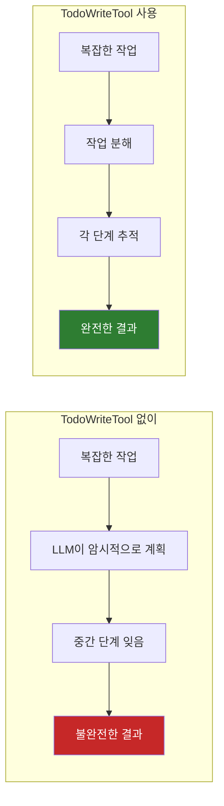
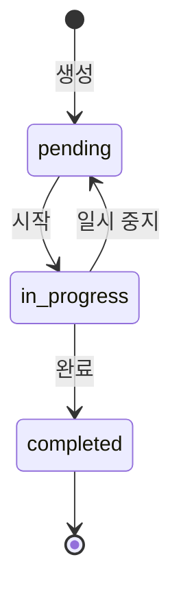

# Spring AI Agentic Patterns (Part 3): AI 에이전트가 작업을 잊어버리는 이유 (그리고 해결 방법)

AI 에이전트에게 복잡한 다중 단계 작업을 수행하도록 요청했는데, 중간에 중요한 단계를 건너뛴 것을 발견한 적이 있는가? 당신만 그런 것이 아니다.

연구에 따르면 LLM은 "lost in the middle" 실패에 취약하다. 긴 컨텍스트에 묻힌 작업을 잊어버리는 것이다. 에이전트가 파일 편집, 테스트 실행, 문서 업데이트를 동시에 처리할 때, 중요한 단계가 조용히 사라질 수 있다. Claude Code에서 영감을 받은 한 가지 해결책은 전용 `TodoWrite` 도구를 사용하여 계획을 명시적이고 관찰 가능하게 만드는 것이다. 결과: 단계를 절대 건너뛰지 않고 실시간으로 관찰할 수 있는 워크플로우.

**이 글은 Spring AI Agentic Patterns 시리즈의 Part 3다.** 모듈식 기능을 위한 [Agent Skills](https://spring.io/blog/2026/01/13/spring-ai-generic-agent-skills)와 대화형 워크플로우를 위한 [AskUserQuestionTool](https://spring.io/blog/2026/01/16/spring-ai-ask-user-question-tool)을 다뤘다. 이제 `TodoWriteTool`이 Spring AI 에이전트에 구조화된 작업 관리를 가져오는 방법을 탐구한다.

> 이 글은 Spring 공식 블로그의 [Spring AI Agentic Patterns (Part 3): Why Your AI Agent Forgets Tasks](https://spring.io/blog/2026/01/20/spring-ai-agentic-patterns-3-todowrite)를 번역하고, 추가적인 인사이트를 덧붙인 글이다.


---

## 결론부터 말하면

**TodoWriteTool은 LLM의 암시적 계획을 명시적이고 추적 가능한 워크플로우로 변환한다.**



| 핵심 포인트 | 설명 |
|------------|------|
| Lost in the Middle 해결 | LLM이 긴 컨텍스트 중간 정보를 잊는 현상 방지 |
| 실시간 진행 상황 | 어떤 단계가 완료되고 남았는지 관찰 가능 |
| 자기 조절 | LLM이 복잡도에 따라 작업 추적 필요 여부를 스스로 판단 |

---

## 1. TodoWriteTool이란?

`TodoWriteTool`은 LLM이 실행 중에 작업 목록을 생성, 추적, 업데이트할 수 있게 해주는 Spring AI 도구다. [Claude Code의 TodoWrite](https://platform.claude.com/docs/en/agent-sdk/todo-tracking)에서 영감을 받아, 암시적 계획을 명시적이고 추적 가능한 워크플로우로 변환한다. 전체 구현은 GitHub에서 확인할 수 있다: [TodoWriteTool.java](https://github.com/spring-ai-community/spring-ai-agent-utils/blob/main/spring-ai-agent-utils/src/main/java/org/springaicommunity/agent/tools/TodoWriteTool.java)

에이전트가 복잡한 작업을 받으면, 예를 들어 "설정 페이지에 다크 모드 토글을 추가하고 테스트를 실행해줘", `TodoWriteTool`을 사용하여 실행 전에 분해한다:


LLM은 계획을 업데이트해야 할 때마다 도구를 호출한다. 초기 작업 생성, 진행 상황 표시, 새로 발견된 작업 추가 등.

도구는 todo 항목 목록을 받으며, 각각 **id**, **content**(수행해야 할 작업), **status**를 포함한다. 각 todo 항목은 간단한 생명주기를 따른다:



도구는 중요한 제약을 강제한다: **한 번에 하나의 작업만 `in_progress` 상태일 수 있다.** 이것은 흩어진 병렬 작업 시도 대신 순차적이고 집중된 실행을 강제한다.

실행 중 실시간 진행 상황은 다음과 같다:

```
Progress: 2/4 tasks completed (50%)
[✓] Find top 10 Tom Hanks movies
[✓] Group movies in pairs
[→] Print inverted titles
[ ] Final summary
```

> **💡 인사이트:** "한 번에 하나의 작업만 in_progress" 제약은 단순해 보이지만 매우 중요하다. LLM은 여러 작업을 동시에 시도하다가 모두 중간에 멈추는 경향이 있다. 이 제약이 "하나씩 끝내기"를 강제한다.

---

## 2. LLM은 언제 이 도구를 사용해야 하는지 어떻게 아는가?

[도구 설명](https://github.com/spring-ai-community/spring-ai-agent-utils/blob/8df9b26bdeb98cccfe65c445dea7611605d80e4c/spring-ai-agent-utils/src/main/java/org/springaicommunity/agent/tools/TodoWriteTool.java#L54-L242)은 LLM에게 작업 추적이 적절한 시기를 알려준다:

> *"작업이 3개 이상의 별개 단계나 행동을 필요로 할 때 이 도구를 사용하세요. 단일하고 간단한 작업이거나 3개 미만의 사소한 단계로 완료할 수 있을 때는 건너뛰세요."*

이 자가 관리 동작은 에이전트가 복잡도에 따라 자율적으로 작업 목록 생성 여부를 결정한다는 것을 의미한다.

💡 **Tip:** 추가로, 최상의 결과를 위해 상세한 작업 관리 지침이 담긴 시스템 프롬프트를 사용하라. [MAIN_AGENT_SYSTEM_PROMPT_V2](https://github.com/spring-ai-community/spring-ai-agent-utils/blob/main/spring-ai-agent-utils/src/main/resources/prompt/MAIN_AGENT_SYSTEM_PROMPT_V2.md#task-management)가 Claude Code에서 영감을 받은 예제를 제공한다.

⚠️ **Important:** Todo-Write 패턴은 todo 목록 업데이트를 유지하고 LLM에 전달하기 위해 [Chat Memory](https://docs.spring.io/spring-ai/reference/api/chat-memory.html#page-title)에 의존한다. 또한 [ToolCallAdvisor](https://docs.spring.io/spring-ai/reference/api/advisors-recursive.html#_toolcalladvisor)를 활성화하면 내장 ChatModel 도구 호출을 대체하고 모든 도구 메시지가 chat memory에 로깅되도록 보장한다. 전체 advisors 구성은 아래 [Getting Started](#3-getting-started)를 참조하라.

> **💡 인사이트:** Chat Memory 의존성은 중요한 아키텍처적 결정이다. TodoWriteTool이 작동하려면 이전 도구 호출 결과가 다음 LLM 호출에 전달되어야 한다. 그래야 LLM이 "어디까지 했는지"를 알 수 있다. Chat Memory 없이는 매 호출마다 작업 목록이 리셋된다.

---

## 3. Getting Started

### 3.1 의존성 추가

```xml
<dependency>
    <groupId>org.springaicommunity</groupId>
    <artifactId>spring-ai-agent-utils</artifactId>
    <version>0.4.0</version>
</dependency>
```

ℹ️ **Note:** Spring AI 버전 `2.0.0-SNAPSHOT` 또는 `2.0.0-M2`(릴리스 시)가 필요하다.

### 3.2 에이전트 구성

```java
ChatClient chatClient = chatClientBuilder
    .defaultTools(TodoWriteTool.builder().build())
    .defaultAdvisors(
        ToolCallAdvisor.builder()
            .conversationHistoryEnabled(false)
            .build(),
        MessageChatMemoryAdvisor.builder(
            MessageWindowChatMemory.builder().build()
        ).build())
    .build();

String response = chatClient.prompt()
    .user("Find the top 10 Tom Hanks movies, group them in pairs, " +
          "and print each title reversed. Use TodoWrite to organize your tasks.")
    .call()
    .content();
```

⚠️ **Important:** `conversationHistoryEnabled(false)`를 설정하면 `MessageChatMemoryAdvisor`를 위해 내장 도구 호출 히스토리를 비활성화한다. 이 설정은 **Chat Memory와의 중복 히스토리 기록을 방지** 하고, **도구 실행 결과가 Advisor를 통해 일관되게 관리** 되도록 보장한다.

전체 예제(시스템 프롬프트와 추가 도구 포함)는 [todo-demo](https://github.com/spring-ai-community/spring-ai-agent-utils/tree/main/examples/todo-demo) 프로젝트를 참조하라.

### 3.3 (선택) 이벤트 기반 진행 상황 업데이트

도구는 애플리케이션이 실시간으로 UI를 업데이트하는 데 사용할 수 있는 이벤트를 발행한다. 예를 들어, 전용 ApplicationEvent와 이벤트 리스너를 정의한다:

```java
public class TodoUpdateEvent extends ApplicationEvent {
    private final List<Todo> todos;

    public TodoUpdateEvent(Object source, List<Todo> todos) {
        super(source);
        this.todos = todos;
    }

    public List<Todo> getTodos() {
        return todos;
    }
}

@Component
public class TodoProgressListener {

    @EventListener
    public void onTodoUpdate(TodoUpdateEvent event) {
        int completed = (int) event.getTodos().stream()
            .filter(t -> t.status() == Todos.Status.completed)
            .count();
        int total = event.getTodos().size();

        System.out.printf("\nProgress: %d/%d tasks completed (%.0f%%)\n",
            completed, total, (completed * 100.0 / total));
    }
}
```

그런 다음 `todoEventHandler`에 이벤트 퍼블리셔를 추가한다:

```java
@Autowired
ApplicationEventPublisher applicationEventPublisher;

ChatClient chatClient = chatClientBuilder
    .defaultTools(TodoWriteTool.builder()
        // todo 업데이트 이벤트 발행
        .todoEventHandler(event ->
            applicationEventPublisher.publishEvent(
                new TodoUpdateEvent(this, event.todos())))
        .build())
    // ...
    .build();
```

> **💡 인사이트:** 이벤트 기반 아키텍처는 Spring의 강점 중 하나다. `ApplicationEvent`를 사용하면 TodoWriteTool과 UI 업데이트 로직이 느슨하게 결합된다. 나중에 WebSocket 푸시, 로깅, 메트릭 수집 등 다양한 리스너를 추가해도 TodoWriteTool 코드는 변경할 필요가 없다.

---

## 4. 결론

TodoWriteTool은 Spring AI 에이전트에 구조화된 작업 관리를 가져와, 암시적 계획을 명시적이고 관찰 가능한 워크플로우로 변환한다. 에이전트의 계획을 보이고 추적 가능하게 만들어서, 더 신뢰할 수 있는 실행, 더 나은 사용자 경험, 더 쉬운 디버깅을 얻는다.

**핵심 요약:** 에이전트가 복잡한 작업에서 단계를 건너뛰고 있다면, TodoWriteTool을 추가하라. 오버헤드는 최소화되고, LLM이 작업 복잡도에 따라 추적이 필요한지 스스로 결정한다.

도메인 지식을 위한 [Agent Skills](https://spring.io/blog/2026/01/13/spring-ai-generic-agent-skills)와 대화형 명확화를 위한 [AskUserQuestionTool](https://spring.io/blog/2026/01/16/spring-ai-ask-user-question-tool)과 결합하면, TodoWriteTool은 신뢰할 수 있는 AI 에이전트 구축의 기반을 완성한다.

**다음 편 예고:** Part 4에서는 **Hierarchical Sub-Agents with TaskTools**를 탐구할 것이다. 전용 컨텍스트 윈도우로 복잡한 작업을 처리하는 전문화된 서브에이전트로 다중 에이전트 아키텍처를 구축한다.

---

## 출처

* **GitHub Repository**: [spring-ai-agent-utils](https://github.com/spring-ai-community/spring-ai-agent-utils)
* **TodoWriteTool Documentation**: [TodoWriteTool.md](https://github.com/spring-ai-community/spring-ai-agent-utils/blob/main/spring-ai-agent-utils/docs/TodoWriteTool.md)
* **Example Projects**:
  + [todo-demo](https://github.com/spring-ai-community/spring-ai-agent-utils/tree/main/examples/todo-demo) - 집중된 TodoWriteTool 데모
  + [code-agent-demo](https://github.com/spring-ai-community/spring-ai-agent-utils/tree/main/examples/code-agent-demo) - 전체 툴킷 통합

### Related

* [Claude Code Todo Tracking](https://platform.claude.com/docs/en/agent-sdk/todo-tracking) - 원래의 영감
* [Dynamic Tool Discovery](https://spring.io/blog/2025/12/11/spring-ai-tool-search-tools-tzolov) - 효율적인 도구 선택
* [Tool Argument Augmentation](https://spring.io/blog/2025/12/23/spring-ai-tool-argument-augmenter-tzolov) - LLM 추론 캡처

### Series Links

* **Part 1**: [Agent Skills](https://spring.io/blog/2026/01/13/spring-ai-generic-agent-skills) - 모듈식, 재사용 가능한 기능
* **Part 2**: [AskUserQuestionTool](https://spring.io/blog/2026/01/16/spring-ai-ask-user-question-tool) - 대화형 워크플로우
* **Part 3**: TodoWriteTool - 구조화된 계획 (이 포스트)
* **Part 4**: Hierarchical Sub-Agents (예정)
