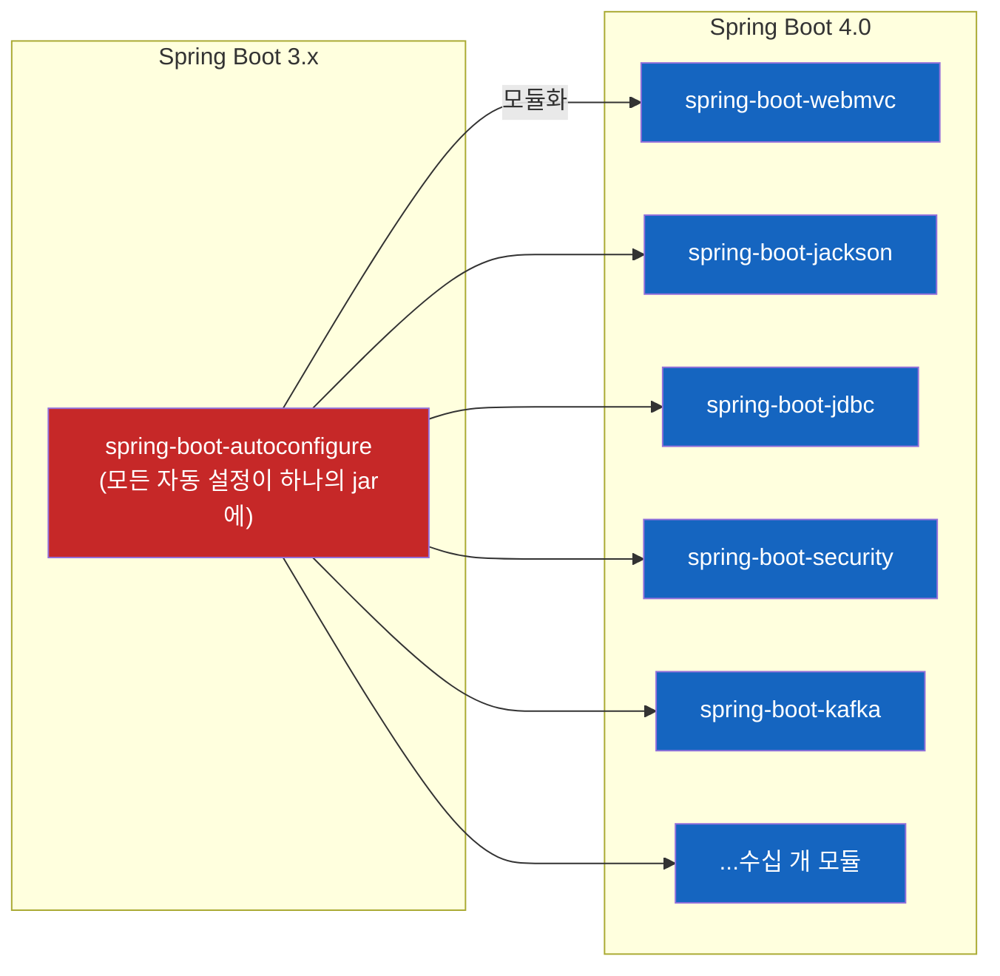
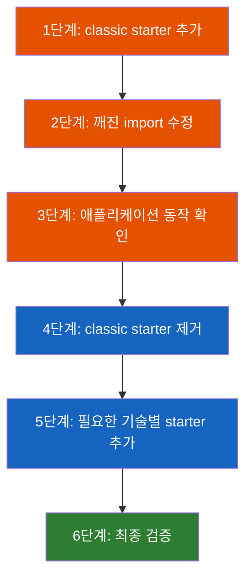

# Spring Boot 4.0 마이그레이션 가이드

Spring Boot 2.7에서 3.0으로 갈 때 javax → jakarta 전환이 대격변이었다면, 3.5에서 4.0으로 가는 이번 업그레이드는 **Spring Boot의 내부 구조 자체가 바뀌는** 수준의 변화다.

## 결론부터 말하면

**Spring Boot 4.0은 "모듈화"가 핵심이다.** 기존에 `spring-boot-autoconfigure`라는 거대한 jar 하나에 모든 자동 설정이 들어있던 구조에서, 기술별로 분리된 수십 개의 작은 모듈로 쪼개졌다. 이로 인해 starter 이름이 바뀌고, 패키지가 재배치되고, 의존성 선언 방식이 달라진다.



| 변경 영역 | 핵심 변화 | 영향도 |
|-----------|----------|--------|
| 모듈 구조 | 기술별 모듈 분리, starter 이름 변경 | **매우 높음** |
| Jackson | 2 → 3 (group ID, 패키지, 어노테이션 전부 변경) | **높음** |
| 테스트 | `@MockBean` deprecated, `@SpringBootTest` 축소 | **높음** |
| 시스템 요구사항 | Jakarta EE 11, Servlet 6.1, Spring Framework 7 | **높음** |
| 제거된 기능 | Undertow, 실행 스크립트, Spock 등 | 중간 |
| 프로퍼티 변경 | MongoDB, Session, Kafka 등 프로퍼티 경로 변경 | 중간 |

---

## 1. 업그레이드 전에 해야 할 일

### 1.1 왜 바로 4.0으로 가면 안 되는가?

Spring Boot 3.x에서 deprecated된 API들이 4.0에서 **전부 삭제** 되었다. 만약 deprecated 경고를 무시하고 있었다면, 4.0으로 올리는 순간 컴파일 에러가 쏟아진다.

그래서 Spring 팀이 권장하는 마이그레이션 순서는 이렇다:


**먼저 최신 3.5.x로 올리고, deprecated 메서드 호출을 전부 제거한 다음에 4.0으로 넘어가라.** 이 단계를 건너뛰면 마이그레이션이 훨씬 고통스러워진다.

### 1.2 시스템 요구사항

Spring Boot 4.0의 기반 기술이 전면 업그레이드되었다. 2.7 시절과 비교하면 격세지감이다.

| 요구사항 | Spring Boot 2.7 | Spring Boot 3.0 | Spring Boot 4.0 |
|----------|----------------|----------------|----------------|
| Java | 8+ | 17+ | **17+** (Java 21 또는 Java 25 LTS 권장, 2026-04 기준) |
| Kotlin | 1.6+ | 1.7+ | **2.2+** |
| GraalVM (`native-image`) | - | 22.3+ | **25+** |
| Jakarta EE | Java EE 8 | Jakarta EE 9+ | **Jakarta EE 11** |
| Servlet | 3.1+ | 5.0+ | **6.1** |
| Spring Framework | 5.x | 6.x | **7.x** |

여기서 주목할 점은 **Servlet 6.1** 이다. 이 버전 요구사항 때문에 Undertow가 아예 지원 목록에서 빠졌다. Undertow가 아직 Servlet 6.1을 지원하지 않기 때문이다.

### 1.3 의존성 검토

Spring Boot가 관리하는 의존성 버전이 대폭 변경되었다. [3.5.x 의존성 목록](https://docs.spring.io/spring-boot/3.5/appendix/dependency-versions/coordinates.html)과 [4.0.x 의존성 목록](https://docs.spring.io/spring-boot/4.0-SNAPSHOT/appendix/dependency-versions/coordinates.html)을 비교해서 영향을 파악해야 한다.

특히 Spring Boot가 관리하지 않는 의존성(예: Spring Cloud)은 호환 버전을 직접 확인해야 한다.

---

## 2. 제거된 기능들

4.0에서 아예 사라진 기능들이 있다. 하나씩 살펴보자.

### 2.1 Undertow 지원 제거

Spring Boot 4.0은 Servlet 6.1을 기준으로 삼는데, Undertow가 아직 이 버전을 지원하지 않는다. 그 결과 **Undertow starter와 임베디드 서버로서의 Undertow 지원이 완전히 삭제** 되었다.

만약 Undertow를 사용하고 있었다면 Tomcat이나 Jetty로 전환해야 한다. Spring 팀은 Servlet 6.1 비호환 컨테이너에 4.0 애플리케이션을 배포하는 것 자체를 권장하지 않는다.

### 2.2 실행 가능한 Uber Jar Launch Script 제거

기존에 Unix 계열 OS에서 jar 파일을 직접 실행 가능하게 만드는 임베디드 런치 스크립트 기능이 있었다. `./myapp.jar`처럼 스크립트 없이 바로 실행할 수 있게 해주는 기능이었는데, 몇 가지 한계가 있었다:

- Unix 전용이라 Windows에서 안 됨
- [효율적 배포 권장사항](https://docs.spring.io/spring-boot/4.0-SNAPSHOT/reference/packaging/efficient.html)과 충돌

이제는 `java -jar`로 실행하거나, Gradle의 [Application Plugin](https://docs.gradle.org/current/userguide/application_plugin.html) 같은 대안을 사용해야 한다.

### 2.3 Pulsar Reactive 제거

Spring Pulsar에서 reactor 지원을 제거하기로 결정하면서, Spring Boot에서도 reactive Pulsar 클라이언트 관리와 자동 설정이 함께 삭제되었다.

### 2.4 Spring Session Hazelcast / MongoDB 제거

이 두 프로젝트는 각각 Hazelcast 팀과 MongoDB 팀으로 리더십이 이관되었다. 따라서 Spring Boot 자체에서의 직접 지원은 제거되었고, 해당 벤더의 라이브러리를 직접 사용해야 한다.

### 2.5 Spock 통합 제거

Spock이 아직 Groovy 5를 지원하지 않기 때문에 Spring Boot의 Spock 통합도 제거되었다.

---

## 3. 모듈 의존성 — 가장 큰 변화

### 3.1 왜 모듈화를 했을까?

기존 Spring Boot의 구조를 생각해보자. `spring-boot-autoconfigure`라는 하나의 거대한 jar에 **모든 기술** 의 자동 설정 클래스가 들어있었다. Web MVC도, JPA도, Kafka도, Redis도 전부 이 하나의 jar 안에 있었다.

이게 왜 문제였을까? 예를 들어 Kafka만 쓰는 마이크로서비스를 만들어도, 클래스패스에는 Web MVC 자동 설정 클래스, JPA 자동 설정 클래스 등 쓰지 않는 코드가 잔뜩 포함되어 있었다. GraalVM Native Image로 빌드할 때는 이런 불필요한 클래스들이 빌드 시간과 이미지 크기에 직접적인 영향을 미쳤다.

Spring Boot 4.0은 이 문제를 해결하기 위해 **기술별로 모듈을 분리** 했다. 이제 필요한 기술의 모듈만 가져오면 된다.

### 3.2 새로운 네이밍 컨벤션

모듈화에 따라 일관된 네이밍 규칙이 생겼다:

| 구분 | 패턴 | 예시 (GraphQL) |
|------|------|---------------|
| 모듈명 | `spring-boot-<기술>` | `spring-boot-graphql` |
| 루트 패키지 | `org.springframework.boot.<기술>` | `org.springframework.boot.graphql` |
| Starter POM | `spring-boot-starter-<기술>` | `spring-boot-starter-graphql` |

테스트 인프라도 같은 규칙을 따른다:

| 구분 | 패턴 | 예시 (GraphQL) |
|------|------|---------------|
| 테스트 모듈명 | `spring-boot-<기술>-test` | `spring-boot-graphql-test` |
| 테스트 루트 패키지 | `org.springframework.boot.<기술>.test` | `org.springframework.boot.graphql.test` |
| 테스트 Starter POM | `spring-boot-starter-<기술>-test` | `spring-boot-starter-graphql-test` |

### 3.3 Starter 이름 변경 — 반드시 확인해야 할 목록

기존에 쓰던 starter 이름이 바뀌었다. 이전 이름은 deprecated 상태로 남아있지만 향후 제거될 예정이다.

| 기존 Starter (deprecated) | 새 Starter |
|--------------------------|-----------|
| `spring-boot-starter-web` | `spring-boot-starter-webmvc` |
| `spring-boot-starter-web-services` | `spring-boot-starter-webservices` |
| `spring-boot-starter-aop` | `spring-boot-starter-aspectj` |
| `spring-boot-starter-oauth2-authorization-server` | `spring-boot-starter-security-oauth2-authorization-server` |
| `spring-boot-starter-oauth2-client` | `spring-boot-starter-security-oauth2-client` |
| `spring-boot-starter-oauth2-resource-server` | `spring-boot-starter-security-oauth2-resource-server` |

**가장 충격적인 것은 `spring-boot-starter-web`이 `spring-boot-starter-webmvc`로 바뀐 것이다.** 거의 모든 Spring Boot 프로젝트에서 사용하는 의존성이 이름이 바뀌었으니, 기존 프로젝트에서 가장 먼저 수정해야 할 부분이다.

### 3.4 새로 생긴 전용 Starter — 이전에는 없던 것들

이전에는 전용 starter가 없어서 서드파티 의존성을 직접 선언해야 했던 기술들에 이제 전용 starter가 생겼다. 대표적인 예를 보자:

| 기술 | 이전 (3.x) | 이후 (4.0) |
|------|-----------|-----------|
| Flyway | `org.flywaydb:flyway-core` 직접 선언 | `spring-boot-starter-flyway` |
| Liquibase | `org.liquibase:liquibase-core` 직접 선언 | `spring-boot-starter-liquibase` |
| Jackson | 자동 포함 | `spring-boot-starter-jackson` |
| JDBC | `spring-boot-starter-data-jpa`에 포함 | `spring-boot-starter-jdbc` (별도) |

Flyway나 Liquibase를 쓰고 있었다면, 기존에 서드파티 의존성을 직접 선언하던 것을 **반드시 Spring Boot starter로 교체** 해야 한다. 그렇지 않으면 자동 설정이 제대로 동작하지 않을 수 있다.

### 3.5 주요 기술별 Starter 전체 매핑

방대하지만 중요한 내용이므로, 실무에서 자주 쓰이는 기술을 중심으로 정리한다.

**웹 관련:**

| 기술 | Main Starter | Test Starter |
|------|-------------|-------------|
| Spring Web MVC | `spring-boot-starter-webmvc` | `spring-boot-starter-webmvc-test` |
| Spring WebFlux | `spring-boot-starter-webflux` | `spring-boot-starter-webflux-test` |
| Spring GraphQL | `spring-boot-starter-graphql` | `spring-boot-starter-graphql-test` |
| REST Client | `spring-boot-starter-restclient` | `spring-boot-starter-restclient-test` |
| WebClient | `spring-boot-starter-webclient` | `spring-boot-starter-webclient-test` |

**데이터베이스 관련:**

| 기술 | Main Starter | Test Starter |
|------|-------------|-------------|
| JDBC | `spring-boot-starter-jdbc` | `spring-boot-starter-jdbc-test` |
| Spring Data JPA | `spring-boot-starter-data-jpa` | `spring-boot-starter-data-jpa-test` |
| Spring Data MongoDB | `spring-boot-starter-data-mongodb` | `spring-boot-starter-data-mongodb-test` |
| Spring Data Redis | `spring-boot-starter-data-redis` | `spring-boot-starter-data-redis-test` |
| Flyway | `spring-boot-starter-flyway` | `spring-boot-starter-flyway-test` |
| Liquibase | `spring-boot-starter-liquibase` | `spring-boot-starter-liquibase-test` |
| R2DBC | `spring-boot-starter-r2dbc` | `spring-boot-starter-r2dbc-test` |

**메시징 관련:**

| 기술 | Main Starter | Test Starter |
|------|-------------|-------------|
| Spring Kafka | `spring-boot-starter-kafka` | `spring-boot-starter-kafka-test` |
| Spring AMQP | `spring-boot-starter-amqp` | `spring-boot-starter-amqp-test` |
| Spring Pulsar | `spring-boot-starter-pulsar` | `spring-boot-starter-pulsar-test` |
| Websocket | `spring-boot-starter-websocket` | `spring-boot-starter-websocket-test` |

**보안 관련:**

| 기술 | Main Starter | Test Starter |
|------|-------------|-------------|
| Spring Security | `spring-boot-starter-security` | `spring-boot-starter-security-test` |
| OAuth2 Auth Server | `spring-boot-starter-security-oauth2-authorization-server` | 동일 패턴 `-test` |
| OAuth2 Client | `spring-boot-starter-security-oauth2-client` | 동일 패턴 `-test` |
| OAuth2 Resource Server | `spring-boot-starter-security-oauth2-resource-server` | 동일 패턴 `-test` |

**모니터링/운영 관련:**

| 기술 | Main Starter | Test Starter |
|------|-------------|-------------|
| Actuator | `spring-boot-starter-actuator` | `spring-boot-starter-actuator-test` |
| Micrometer Metrics | `spring-boot-starter-micrometer-metrics` | `spring-boot-starter-micrometer-metrics-test` |
| OpenTelemetry | `spring-boot-starter-opentelemetry` | `spring-boot-starter-opentelemetry-test` |
| Zipkin | `spring-boot-starter-zipkin` | `spring-boot-starter-zipkin-test` |

**배치 관련:**

| 기술 | Main Starter |
|------|-------------|
| Spring Batch (인메모리) | `spring-boot-starter-batch` |
| Spring Batch (DB 사용) | `spring-boot-starter-batch-jdbc` |

### 3.6 테스트 의존성의 변화

여기서 중요한 포인트가 있다. **모든 테스트 starter는 `spring-boot-starter-test`를 transitively 가져온다.** 따라서 더 이상 `spring-boot-starter-test`를 별도로 선언할 필요가 없다. 대신 테스트 대상 기술의 test starter만 나열하면 된다.

```xml
<!-- Before (3.x) -->
<dependency>
    <groupId>org.springframework.boot</groupId>
    <artifactId>spring-boot-starter-test</artifactId>
    <scope>test</scope>
</dependency>

<!-- After (4.0) — 예: JPA + Security 테스트 -->
<dependency>
    <groupId>org.springframework.boot</groupId>
    <artifactId>spring-boot-starter-data-jpa-test</artifactId>
    <scope>test</scope>
</dependency>
<dependency>
    <groupId>org.springframework.boot</groupId>
    <artifactId>spring-boot-starter-security-test</artifactId>
    <scope>test</scope>
</dependency>
```

특히 주의할 점은 `@WithMockUser`, `@WithUserDetails` 같은 Spring Security Test 어노테이션이 이제 `spring-boot-starter-security-test`가 있어야 제대로 동작한다는 것이다. 기존에는 `spring-security-test`만 있으면 됐지만, 모듈화로 인해 Boot의 test starter를 통해야 한다.

### 3.7 Classic Starter — 빠른 마이그레이션용 임시 방편

모듈 구조를 한 번에 다 바꾸기 어렵다면? Spring Boot 팀이 **Classic Starter** 라는 임시 방편을 제공한다.

| 기존 | Classic 대체 |
|------|-------------|
| `spring-boot-starter` | `spring-boot-starter-classic` |
| `spring-boot-starter-test` | `spring-boot-starter-test-classic` |

Classic starter는 모든 모듈을 포함하되 transitive 의존성은 제외하는 방식으로, 이전 세대 Spring Boot와 유사한 클래스패스를 제공한다. 이걸 쓰면 일단 깨진 import만 고치고 애플리케이션이 동작하는지 확인할 수 있다.

**단, Spring 팀은 이것이 임시 방편임을 명확히 하고 있다.** 결국에는 새로운 모듈 구조로 전환해야 한다.

**권장 마이그레이션 전략:**



### 3.8 자체 Starter를 만드는 프로젝트에 대한 참고사항

모듈화로 인해 **같은 artifact에서 Spring Boot 3과 4를 동시에 지원하는 것은 강력히 비권장** 된다. 사내 공통 라이브러리나 오픈소스 starter를 만들어 배포하는 경우, 별도의 메이저 버전으로 분리하는 것이 맞다.

---

## 4. 핵심 기능 업그레이드

### 4.1 JSpecify Nullability 어노테이션

Spring Boot 4.0에 **JSpecify nullability 어노테이션** 이 추가되었다. 이게 왜 중요할까?

기존에 Spring Framework는 자체적인 `@Nullable` 어노테이션을 `org.springframework.lang` 패키지에서 제공했다. 하지만 이건 Spring만의 비표준이었다. JSpecify는 Java 생태계 전체에서 표준으로 사용하려는 nullability 명세다.

문제는, null checker를 빌드에 사용하고 있거나 **Kotlin을 쓰고 있는 경우** 다. Kotlin은 Java의 nullability 어노테이션을 읽어서 nullable/non-nullable 타입을 결정하는데, Spring Boot 4.0에서 새로 추가된 JSpecify 어노테이션 때문에 **기존에 컴파일되던 코드가 컴파일 에러를 낼 수 있다.** 이전에는 플랫폼 타입(null 여부 불명)이었던 것이 이제 명확하게 non-null 또는 nullable로 바뀌기 때문이다.

기존에 `org.springframework.lang` 패키지의 nullable 어노테이션을 사용하고 있었다면 [Spring Framework의 마이그레이션 문서](https://docs.spring.io/spring-framework/reference/core/null-safety.html#null-safety-migrating)를 참고해서 전환해야 한다.

### 4.2 Logback 기본 Charset 변경

Logback의 기본 charset이 Log4j2의 동작과 일치하도록 변경되었다:

| 대상 | 기본 Charset |
|------|-------------|
| 로그 파일 | `UTF-8` |
| 콘솔 로그 | `Console#charset()` 사용 가능하면 그 값, 아니면 `UTF-8` |

한글 로깅을 사용하는 경우, 대부분 UTF-8을 쓰고 있을 테니 큰 문제는 없을 것이다. 하지만 혹시 EUC-KR 같은 레거시 인코딩을 쓰고 있었다면 확인이 필요하다.

### 4.3 BootstrapRegistry, EnvironmentPostProcessor 패키지 이동

이 두 가지는 Spring Boot의 깊은 내부 통합을 하는 경우에만 영향이 있다.

| 클래스 | 이전 패키지 | 새 패키지 |
|--------|-----------|----------|
| `BootstrapRegistry` 및 관련 클래스 | `org.springframework.boot` | `org.springframework.boot.bootstrap` |
| `EnvironmentPostProcessor` | `org.springframework.boot.env` | `org.springframework.boot` |

`spring.factories` 파일에 이 클래스들을 등록해서 사용하고 있었다면 코드와 설정 파일 모두 업데이트해야 한다. 참고로 deprecated된 `EnvironmentPostProcessor`의 이전 위치는 4.0에서 아직 남아있지만, 향후 제거될 예정이다.

### 4.4 PropertyMapper API 변경

`PropertyMapper`는 Spring Boot에서 설정 값을 매핑할 때 사용하는 유틸리티 클래스다. 4.0에서 동작 방식이 바뀌었다.

**이전 (3.x):** source 값이 `null`이어도 adapter/predicate 메서드를 호출했다.

**이후 (4.0):** source 값이 `null`이면 **기본적으로 호출하지 않는다.**

```java
// 4.0에서 source.method()가 null을 반환하면, destination.method()는 호출되지 않음
map.from(source::method).to(destination::method);

// null이어도 호출하고 싶다면 always() 사용
map.from(source::method).always().to(destination::method);
// → source.method()가 null이면 destination.method(null) 호출
```

기존에 `alwaysApplyingWhenNonNull()` 메서드를 사용하고 있었다면, 이 메서드가 삭제되었으므로 `always()`로 전환해야 한다. Spring Boot 자체가 이 API를 어떻게 적용했는지 [커밋 `239f384ac0`](https://github.com/spring-projects/spring-boot/commit/239f384ac0893d151b89f204886874c6adb00001)을 참고할 수 있다.

### 4.5 DevTools Live Reload 기본 비활성화

DevTools의 Live Reload가 **기본적으로 비활성화** 되었다. 개발 중에 Live Reload를 쓰고 있었다면 명시적으로 활성화해야 한다:

```properties
spring.devtools.livereload.enabled=true
```

---

## 5. Jackson 3 업그레이드 — 두 번째로 큰 변화

### 5.1 왜 Jackson 3이 큰 변화인가?

Jackson은 Java 생태계에서 가장 널리 쓰이는 JSON 라이브러리다. REST API를 만들면 거의 반드시 쓰게 된다. 그런데 Jackson 3은 **group ID와 패키지명이 완전히 바뀌었다.**

| 구분 | Jackson 2 | Jackson 3 |
|------|----------|----------|
| Group ID | `com.fasterxml.jackson` | `tools.jackson` |
| 패키지 | `com.fasterxml.jackson` | `tools.jackson` |

예외적으로 `jackson-annotations` 모듈은 기존 `com.fasterxml.jackson.core` group ID와 `com.fasterxml.jackson.annotation` 패키지를 유지한다.

### 5.2 어노테이션 / 클래스 이름 변경

Spring Boot에서 제공하던 Jackson 관련 클래스와 어노테이션도 이름이 바뀌었다:

| 이전 (3.x) | 이후 (4.0) | 설명 |
|-----------|-----------|------|
| `JsonObjectSerializer` | `ObjectValueSerializer` | 직렬화 |
| `JsonValueDeserializer` | `ObjectValueDeserializer` | 역직렬화 |
| `Jackson2ObjectMapperBuilderCustomizer` | `JsonMapperBuilderCustomizer` | ObjectMapper 커스터마이징 |
| `@JsonComponent` | `@JacksonComponent` | Jackson 컴포넌트 등록 |
| `@JsonMixin` | `@JacksonMixin` | Mixin 등록 |

이름 변경의 이유가 있다. 기존 `@JsonComponent`, `@JsonMixin`은 이름에 "Json"이 들어가 있어서 JSON 전용처럼 보였지만, 실제로 Jackson은 JSON뿐 아니라 YAML, XML 등 다양한 포맷을 지원한다. 그래서 "Jackson"이라는 라이브러리 이름으로 바꾼 것이다.

### 5.3 프로퍼티 경로 변경

JSON 관련 프로퍼티 경로도 바뀌었다:

| 이전 | 이후 |
|------|------|
| `spring.jackson.read.*` | `spring.jackson.json.read.*` |
| `spring.jackson.write.*` | `spring.jackson.json.write.*` |
| `spring.jackson.parser.*` (일부) | `spring.jackson.json.read.*` |

### 5.4 모듈 자동 감지 변경

Spring Boot 3에서는 "잘 알려진" Jackson 모듈만 자동 등록했지만, **4.0에서는 클래스패스에 있는 모든 Jackson 모듈을 감지하고 자동 등록** 한다. 이 동작을 원하지 않으면 다음 프로퍼티를 설정한다:

```properties
spring.jackson.find-and-add-modules=false
```

### 5.5 Jackson 2 호환 모드

모든 서드파티 라이브러리가 바로 Jackson 3을 지원하지는 않을 것이다. 이를 위해 두 가지 호환 방법을 제공한다:

**방법 1: Jackson 2 기본값 흉내내기**

```properties
spring.jackson.use-jackson2-defaults=true
```

이렇게 하면 Jackson 3의 `JsonMapper`가 Jackson 2와 최대한 유사한 기본값으로 설정된다.

**방법 2: Jackson 2 모듈 직접 사용**

Jackson 3으로 아예 전환할 수 없는 상황이라면, deprecated된 `spring-boot-jackson2` 모듈을 사용할 수 있다:

```xml
<!-- Maven -->
<dependency>
    <groupId>org.springframework.boot</groupId>
    <artifactId>spring-boot-jackson2</artifactId>
</dependency>
```

```groovy
// Gradle
implementation "org.springframework.boot:spring-boot-jackson2"
```

**주의:** `spring-boot-jackson2` 모듈을 사용할 경우, 기존의 `spring.jackson.*` 프로퍼티가 자동으로 적용되지 않는다. 반드시 `spring.jackson2.*` 네임스페이스로 옮겨 적어야 자동 설정이 동작한다. 예를 들어 `spring.jackson.serialization.indent-output=true`는 `spring.jackson2.serialization.indent-output=true`로 변경해야 한다. 이 부분을 놓치면 설정이 무시되는 원인을 찾기 어려울 수 있다.

더 주의할 점은, `spring-boot-jackson`(Jackson 3)과 `spring-boot-jackson2`를 함께 사용하는 경우다. 클래스패스에 Jackson 3 라이브러리가 transitive하게 들어오면 `spring.jackson.*` 프로퍼티가 Jackson 3용으로 해석되기 때문에, Jackson 2 설정은 반드시 `spring.jackson2.*`에 별도로 작성해야 한다. "프로퍼티를 설정했는데 안 먹힌다"는 삽질의 대부분은 이 네임스페이스 혼동에서 비롯된다.

Jackson 2만 단독으로 사용하려는 경우에는 `spring-boot-starter-jackson`(Jackson 3용)이 의존성 트리에 섞이지 않도록 주의해야 한다. 모듈화된 4.0 환경에서 두 버전의 Jackson starter가 공존하면, 의도치 않은 Jackson 3 `ObjectMapper`가 주입되거나 `spring.jackson2.*` 프로퍼티가 무시되는 디버깅하기 어려운 상황이 발생할 수 있다.

이 모듈은 임시 방편이고, 향후 릴리스에서 제거될 예정이다.

### 5.6 Jersey와 Jackson

Spring Boot 4.0은 Jersey 4.0을 지원하는데, **Jersey 4.0이 아직 Jackson 3을 지원하지 않는다.** 따라서 Jersey에서 JSON을 처리하려면 `spring-boot-jackson2`를 단독으로 또는 `spring-boot-jackson`과 함께 사용해야 한다.

---

## 6. 웹 기능 업그레이드

### 6.1 정적 리소스 위치에 /fonts/** 추가

`PathRequest#toStaticResources()`를 사용하고 있다면, 이번 릴리스에서 `/fonts/**` 경로가 추가되었다. 별도 설정 없이도 이 경로에 기존 정적 리소스와 동일한 보안 설정이 적용된다.

만약 fonts 경로를 포함하고 싶지 않다면 명시적으로 제외할 수 있다:

```java
PathRequest.toStaticResources()
    .atCommonLocations()
    .excluding(StaticResourceLocation.FONTS);
```

### 6.2 Spring Session 프로퍼티 변경

Spring Session 관련 프로퍼티 이름이 Spring Data 의존성을 반영하도록 변경되었다:

| 이전 | 이후 |
|------|------|
| `spring.session.redis.*` | `spring.session.data.redis.*` |
| `spring.session.mongodb.*` | `spring.session.data.mongodb.*` |

### 6.3 HttpMessageConverters Deprecated

이 변경은 실무에서 상당히 영향이 클 수 있다. Spring Boot의 `HttpMessageConverters`가 deprecated되었다. 왜일까?

기존 `HttpMessageConverters`에는 **클라이언트용 컨버터와 서버용 컨버터가 뒤섞여 있다** 는 구조적 문제가 있었다. Spring Framework 7에서 [컨버터 설정이 개선](https://github.com/spring-projects/spring-framework/issues/33894)되면서, 이 문제를 해결할 수 있게 되었다.

**이전 방식 (deprecated):**

```java
@Bean
public HttpMessageConverters customConverters() {
    return new HttpMessageConverters(new MyCustomConverter());
}
```

**새로운 방식:**

```java
// 서버 측 컨버터 커스터마이징
@Bean
public ServerHttpMessageConvertersCustomizer serverCustomizer() {
    return (converters) -> converters.addCustomConverter(new MyCustomConverter());
}

// 클라이언트 측 컨버터 커스터마이징
@Bean
public ClientHttpMessageConvertersCustomizer clientCustomizer() {
    return (converters) -> converters.addCustomConverter(new MyClientConverter());
}
```

각 customizer는 컨버터를 "custom" 컨버터로 추가하여 기본 컨버터보다 우선 적용되게 하거나, 자동 감지된 기본 컨버터를 대체하는 방식으로 사용할 수 있다.

**주의:** 기존에 `HttpMessageConverter` 빈을 컨텍스트에 등록하는 방식(예: `JacksonJsonHttpMessageConverter` 빈)은 **더 이상 지원되지 않는다.** 반드시 customizer를 통해야 한다.

### 6.4 Tomcat WAR 배포 시 변경

WAR 파일을 Tomcat에 배포하는 경우, `spring-boot-starter-tomcat` 의존성을 `spring-boot-starter-tomcat-runtime`으로 변경해야 한다.

---

## 7. 데이터 기능 업그레이드

### 7.1 Elasticsearch 클라이언트

Elasticsearch에서 기존 저수준 `RestClient`가 deprecated되고 새로운 `Rest5Client`로 교체되었다. Spring Boot의 자동 설정도 이에 맞춰 변경되었다.

| 이전 | 이후 |
|------|------|
| `RestClient` | `Rest5Client` |
| `RestClientBuilderCustomizer` | `Rest5ClientBuilderCustomizer` |

또한 클라이언트 코드가 `co.elastic.clients:elasticsearch-java` 모듈로 통합되었다. 기존의 `org.elasticsearch.client:elasticsearch-rest-client`와 `org.elasticsearch.client:elasticsearch-rest-client-sniffer` 모듈은 더 이상 필요 없으며, Spring Boot의 의존성 관리에서도 제거되었다.

### 7.2 Persistence 모듈 신설

범용 영속성 관련 코드를 담는 `spring-boot-persistence` 모듈이 새로 만들어졌다.

| 변경 사항 | 이전 | 이후 |
|----------|------|------|
| `@EntityScan` import | `org.springframework.boot.autoconfigure.domain.EntityScan` | `org.springframework.boot.persistence.autoconfigure.EntityScan` |
| 예외 변환 프로퍼티 | `spring.dao.exceptiontranslation.enabled` | `spring.persistence.exceptiontranslation.enabled` |

### 7.3 MongoDB 프로퍼티 대이동

MongoDB 프로퍼티 중 Spring Data에 의존하지 않는 것들이 `spring.data.mongodb.*`에서 `spring.mongodb.*`로 이동했다. 왜일까? 이전에는 Spring Data MongoDB가 없으면 MongoDB 자체를 쓸 수 없었지만, 모듈화로 인해 MongoDB 드라이버만 쓰는 것과 Spring Data MongoDB를 쓰는 것이 분리되었기 때문이다.

**`spring.mongodb.*`로 이동한 프로퍼티들** (Spring Data 불필요):

- `spring.mongodb.uri`
- `spring.mongodb.host`
- `spring.mongodb.port`
- `spring.mongodb.database`
- `spring.mongodb.username`
- `spring.mongodb.password`
- `spring.mongodb.authentication-database`
- `spring.mongodb.additional-hosts`
- `spring.mongodb.replica-set-name`
- `spring.mongodb.protocol`
- `spring.mongodb.ssl.bundle`
- `spring.mongodb.ssl.enabled`
- `spring.mongodb.representation.uuid`

**`spring.data.mongodb.*`에 그대로 남은 프로퍼티들** (Spring Data 필요):

- `spring.data.mongodb.auto-index-creation`
- `spring.data.mongodb.field-naming-strategy`
- `spring.data.mongodb.gridfs.bucket`
- `spring.data.mongodb.gridfs.database`
- `spring.data.mongodb.repositories.type`

**관리(management) 프로퍼티도 변경:**

| 이전 | 이후 |
|------|------|
| `management.health.mongo.enabled` | `management.health.mongodb.enabled` |
| `management.metrics.mongo.command.enabled` | `management.metrics.mongodb.command.enabled` |
| `management.metrics.mongo.connectionpool.enabled` | `management.metrics.mongodb.connectionpool.enabled` |

### 7.4 MongoDB UUID/BigDecimal 표현 방식

Spring Data MongoDB가 더 이상 `UUID`와 `BigInteger`/`BigDecimal`의 기본 표현 방식을 제공하지 않는다. 드라이버 권장사항에 맞춰 특정 표현 방식을 강제하지 않기로 한 것이다.

이제 명시적으로 설정해야 한다:

```properties
spring.mongodb.representation.uuid=standard
spring.data.mongodb.representation.big-decimal=decimal128
```

### 7.5 Hibernate 의존성 관리 변경

Hibernate의 리로케이션을 반영하여 의존성 관리가 변경되었다:

| 이전 | 이후 |
|------|------|
| `hibernate-jpamodelgen` | `hibernate-processor` |
| `hibernate-proxool` | 삭제 (더 이상 퍼블리시하지 않음) |
| `hibernate-vibur` | 삭제 (더 이상 퍼블리시하지 않음) |

JPA 메타모델 생성기를 사용하고 있었다면 `hibernate-jpamodelgen`에서 `hibernate-processor`로 artifact 이름을 변경해야 한다.

---

## 8. 메시징 기능 업그레이드

### 8.1 Kafka Streams 커스터마이징

Spring Boot의 `StreamBuilderFactoryBeanCustomizer`가 제거되고, Spring Kafka의 `StreamsBuilderFactoryBeanConfigurer`로 대체되었다. 마이그레이션 시 주의할 점은 새로운 configurer가 `Ordered` 인터페이스를 구현하며 기본값이 `0`이라는 것이다.

### 8.2 Spring Retry → Spring Framework 이관

**이건 Kafka와 AMQP 모두에 해당하는 중요한 변화다.** Spring Kafka와 Spring AMQP의 retry 기능이 Spring Retry에서 **Spring Framework의 새 retry 기능** 으로 이전되었다.

왜 이런 변화가 생겼을까? Spring Retry는 별도의 프로젝트였는데, retry 같은 기본적인 기능을 Framework 자체에 내장하는 것이 더 자연스럽다는 판단이 있었다. Spring Framework 7에 [`org.springframework.core.retry` 패키지](https://docs.spring.io/spring-framework/docs/7.0.x-SNAPSHOT/javadoc-api/org/springframework/core/retry/package-summary.html)가 추가되었다.

**Kafka retry 프로퍼티 변경:**

| 이전 | 이후 |
|------|------|
| `spring.kafka.retry.topic.backoff.random` | `spring.kafka.retry.topic.backoff.jitter` |

`jitter`는 `random`보다 더 세밀한 제어를 제공한다.

**AMQP retry 커스터마이저 변경:**

| 이전 | 이후 |
|------|------|
| `RabbitRetryTemplateCustomizer` | `RabbitTemplateRetrySettingsCustomizer` |
| (위와 동일) | `RabbitListenerRetrySettingsCustomizer` |

기존에는 하나의 커스터마이저가 target에 따라 분기했다면, 이제는 템플릿용과 리스너용이 명확히 분리되었다.

### 8.3 Spring Retry 의존성 관리 제거

Spring Framework에 retry 기능이 내장됨에 따라, **Spring Retry에 대한 의존성 관리가 Spring Boot에서 제거** 되었다. 여전히 Spring Retry를 사용하고 있다면 명시적으로 버전을 지정해야 한다. 하지만 장기적으로는 Spring Framework의 retry로 이전하는 것을 권장한다.

---

## 9. IO 기능 업그레이드

### 9.1 Spring Batch — 인메모리 기본 동작

이건 상당히 큰 변화다. **Spring Batch가 이제 데이터베이스 없이(인메모리로) 동작할 수 있게 되었고, 기본 starter가 이 인메모리 모드를 사용한다.**

| Starter | 동작 방식 |
|---------|----------|
| `spring-boot-starter-batch` | 인메모리 (DB 없음) |
| `spring-boot-starter-batch-jdbc` | DB에 메타데이터 저장 (이전 동작) |

기존에 Spring Batch를 쓰고 있었다면, 업그레이드 후 **Batch 메타데이터가 더 이상 DB에 저장되지 않는다.** 기존 DB 기반 메타데이터 저장 방식을 유지하려면 `spring-boot-starter-batch`를 `spring-boot-starter-batch-jdbc`로 교체해야 한다.

---

## 10. 테스트 기능 업그레이드 — 세 번째로 큰 변화

### 10.1 @MockBean / @SpyBean 제거

Spring Boot의 `@MockBean`과 `@SpyBean`은 3.4에서 deprecated된 뒤 **4.0에서 완전히 제거되었다.** 따라서 4.0에서는 단순한 컴파일 경고가 아니라 컴파일 에러가 발생하므로, Spring Framework의 `@MockitoBean`/`@MockitoSpyBean`으로 반드시 전환해야 한다.

```java
// Before (3.x)
@SpringBootTest
class ApplicationTests {
    @MockBean
    private GreetingService greetingService;
}

// After (4.0)
@SpringBootTest
class ApplicationTests {
    @MockitoBean
    private GreetingService greetingService;
}
```

**핵심 차이점이 있다.** `@MockBean`은 `@Configuration` 클래스의 필드에도 사용할 수 있었다. 여러 테스트 클래스에서 공통적으로 mocking할 빈들을 `@TestConfiguration`에 모아두는 패턴이 가능했다:

```java
// 이전 (3.x) — @Configuration에 @MockBean 사용 가능
@TestConfiguration
public class TestConfig {
    @MockBean
    private UserService userService;
    @MockBean
    private OrderService orderService;
}
```

하지만 `@MockitoBean`은 **테스트 클래스에서만 사용할 수 있다(필드 레벨과 클래스 레벨 모두 가능, `@Repeatable`). `@Configuration` 클래스의 필드에는 사용할 수 없다.** 대신 두 가지 대안이 있다:

**대안 1: 테스트 클래스에 직접 선언**

```java
@SpringBootTest
@MockitoBean(types = {OrderService.class, UserService.class})
@MockitoBean(name = "ps1", types = PrintingService.class)
class ApplicationTests {
    @Test
    void check() { /* ... */ }
}
```

**대안 2: 커스텀 어노테이션 만들기**

```java
@Target(ElementType.TYPE)
@Retention(RetentionPolicy.RUNTIME)
@MockitoBean(types = {OrderService.class, UserService.class})
@MockitoBean(name = "ps1", types = PrintingService.class)
public @interface SharedMocks {}

@SpringBootTest
@SharedMocks
class ApplicationTests {
    @Test
    void check() { /* ... */ }
}
```

참고로 Spring Boot 3.4·3.5에서는 `@MockBean`/`@SpyBean`이 `@Deprecated(forRemoval = true)`로 표시되어 `@SuppressWarnings("removal")`로 경고를 임시 억제할 수 있었지만, 4.0 시점에는 클래스 자체가 사라졌으므로 그런 회피책이 통하지 않는다. 4.0으로 올리기 전에 반드시 `@MockitoBean`/`@MockitoSpyBean`으로 모두 교체해야 한다.

### 10.2 MockitoTestExecutionListener 제거

Spring Boot 3.4에서 deprecated된 `MockitoTestExecutionListener`가 4.0에서 제거되었다. 이 리스너는 간접적으로 사용되었기 때문에 deprecation 경고를 놓치기 쉬웠다.

`@Mock`이나 `@Captor` 어노테이션이 달린 필드가 제대로 동작하지 않는다면, Mockito 자체의 `MockitoExtension`을 사용해야 한다:

```java
@ExtendWith(MockitoExtension.class)
class MyServiceTest {
    @Mock
    private DependencyService dependency;

    @Captor
    private ArgumentCaptor<String> captor;
}
```

### 10.3 @SpringBootTest의 축소 — MockMVC 자동 설정 제거

이전에는 `@SpringBootTest`만 달면 MockMVC가 자동으로 설정되었다. **4.0에서는 그렇지 않다.** MockMVC를 사용하려면 명시적으로 `@AutoConfigureMockMvc`를 추가해야 한다:

```java
// Before (3.x) — @SpringBootTest만으로 MockMVC 사용 가능
@SpringBootTest
class MyControllerTest {
    @Autowired
    private MockMvc mockMvc;
}

// After (4.0) — 명시적으로 @AutoConfigureMockMvc 추가
@SpringBootTest
@AutoConfigureMockMvc
class MyControllerTest {
    @Autowired
    private MockMvc mockMvc;
}
```

HtmlUnit 관련 설정도 변경되었다:

```java
// Before (3.x)
@AutoConfigureMockMvc(webClientEnabled = false, webDriverEnabled = false)

// After (4.0)
@AutoConfigureMockMvc(htmlUnit = @HtmlUnit(webClient = false, webDriver = false))
```

### 10.4 @SpringBootTest의 축소 — WebClient/TestRestTemplate 제거

`@SpringBootTest`가 더 이상 `WebClient`나 `TestRestTemplate` 빈을 자동으로 제공하지 않는다. 사용하려면 명시적으로 설정해야 한다:

```java
// TestRestTemplate 사용 시
@SpringBootTest
@AutoConfigureTestRestTemplate
class MyApiTest {
    @Autowired
    private TestRestTemplate restTemplate;
}
```

`TestRestTemplate`을 사용하면 컴파일 에러가 날 수 있다. 이 경우:
1. `org.springframework.boot:spring-boot-resttestclient`를 test-scoped 의존성으로 추가
2. `org.springframework.boot:spring-boot-restclient`를 runtime 의존성으로 추가
3. import 패키지를 `org.springframework.boot.resttestclient.TestRestTemplate`으로 변경

Spring 팀은 `TestRestTemplate` 대신 새로운 `RestTestClient` 클래스 사용을 권장한다:

```java
@SpringBootTest
@AutoConfigureRestTestClient
class MyApiTest {
    @Autowired
    private RestTestClient restTestClient;
}
```

### 10.5 @PropertyMapping 이동

| 이전 | 이후 |
|------|------|
| `org.springframework.boot.test.autoconfigure.properties.PropertyMapping` | `org.springframework.boot.test.context.PropertyMapping` |
| `...properties.Skip` | `...context.PropertyMapping.Skip` |

---

## 11. 빌드 및 의존성 관련 변경

### 11.1 Maven Optional 의존성

Optional 의존성이 uber jar에 더 이상 포함되지 않는다. 포함해야 한다면 설정에서 `<includeOptional>true</includeOptional>`을 지정해야 한다.

### 11.2 Spring Authorization Server

Spring Authorization Server가 [Spring Security의 일부](https://spring.io/blog/2025/09/11/spring-authorization-server-moving-to-spring-security-7-0)가 되었다. 따라서 별도의 의존성 관리가 제거되었고, `spring-authorization-server.version` 프로퍼티로 버전을 오버라이드할 수 없다. 대신 `spring-security.version`을 사용해야 한다.

### 11.3 Classic Uber-Jar Loader 제거

Classic uber-jar loader가 제거되었다. 빌드 파일에서 loader implementation 설정을 제거해야 한다:

**Maven:**
```xml
<!-- 아래 설정 제거 -->
<loaderImplementation>...</loaderImplementation>
```

**Gradle:**
```groovy
// 아래 설정 제거
loaderImplementation = org.springframework.boot.loader.tools.LoaderImplementation.CLASSIC
```

### 11.4 CycloneDX Gradle Plugin

CycloneDX Gradle 플러그인의 최소 지원 버전이 3.0.0으로 올라갔다.

---

## 12. Actuator 및 운영 기능

### 12.1 @NonNull / @Nullable 어노테이션 변경

Actuator endpoint 파라미터에서 `org.springframework.lang.Nullable`로 optional 파라미터를 선언할 수 없다. `org.jspecify.annotations.Nullable`로 전환해야 한다.

### 12.2 Liveness/Readiness Probe 기본 활성화

Liveness와 Readiness probe가 **기본적으로 활성화** 되었다. health endpoint가 `liveness`와 `readiness` 그룹을 기본으로 노출한다.

이전에는 Kubernetes 환경에서만 자동 활성화되었는데, 이제는 모든 환경에서 기본 활성화다. 불필요하면 비활성화할 수 있다:

```properties
management.endpoint.health.probes.enabled=false
```

---

## 13. 함께 확인해야 할 Spring 포트폴리오 릴리스 노트

Spring Boot 4.0은 Spring 포트폴리오 전체의 메이저 업그레이드와 함께 나왔다. 사용 중인 기술이 있다면 해당 릴리스 노트도 반드시 확인해야 한다:

| 프로젝트 | 버전 |
|---------|------|
| Spring Framework | 7.0 |
| Spring Security | 7.0 |
| Spring Data | 2025.1 |
| Spring Batch | 6.0 |
| Spring AMQP | 4.0 |
| Spring Kafka | 4.0 |
| Spring GraphQL | 2.0 |
| Spring Integration | 7.0 |
| Spring Pulsar | 2.0 |
| Spring Session | 4.0 |
| Spring REST Docs | 4.0 |
| Spring WS | 5.0 |

---

## 14. 정리 — 마이그레이션 체크리스트

실무에서 마이그레이션할 때 순서대로 따라가면 되는 체크리스트다:

**Phase 1: 준비**
- [ ] 최신 Spring Boot 3.5.x로 업그레이드
- [ ] 모든 deprecated API 호출 제거
- [ ] 의존성 호환성 확인 (특히 Spring Cloud, 사내 라이브러리)
- [ ] Java, Kotlin, GraalVM 버전 확인

**Phase 2: 의존성 전환**
- [ ] `spring-boot-starter-web` → `spring-boot-starter-webmvc`
- [ ] OAuth2 starter 이름 변경 (security 접두사 추가)
- [ ] `spring-boot-starter-aop` → `spring-boot-starter-aspectj`
- [ ] Flyway/Liquibase를 전용 starter로 전환
- [ ] (선택) `spring-boot-starter-classic`으로 임시 전환

**Phase 3: 코드 수정**
- [ ] Jackson 관련 import/어노테이션 변경 (`@JsonComponent` → `@JacksonComponent` 등)
- [ ] `@EntityScan` import 변경
- [ ] `BootstrapRegistry`, `EnvironmentPostProcessor` 패키지 변경
- [ ] `HttpMessageConverters` → `ServerHttpMessageConvertersCustomizer` / `ClientHttpMessageConvertersCustomizer`
- [ ] MongoDB 프로퍼티 경로 변경
- [ ] Session 프로퍼티 경로 변경
- [ ] Kafka/AMQP retry 설정 변경

**Phase 4: 테스트 수정**
- [ ] `@MockBean` → `@MockitoBean`, `@SpyBean` → `@MockitoSpyBean`
- [ ] `@SpringBootTest`에 `@AutoConfigureMockMvc` 추가
- [ ] `@SpringBootTest`에 `@AutoConfigureTestRestTemplate` 또는 `@AutoConfigureRestTestClient` 추가
- [ ] `@Mock`/`@Captor` 사용 시 `@ExtendWith(MockitoExtension.class)` 확인
- [ ] Security test 의존성을 `spring-boot-starter-security-test`로 전환
- [ ] `@PropertyMapping` import 변경

**Phase 5: 검증**
- [ ] 전체 빌드 및 테스트 통과 확인
- [ ] Actuator health endpoint 동작 확인
- [ ] (Classic starter 사용 시) Classic starter 제거 후 재검증

---

## 출처

- [Spring Boot 4.0 Migration Guide](https://github.com/spring-projects/spring-boot/wiki/Spring-Boot-4.0-Migration-Guide) - 공식 위키
- [Modularizing Spring Boot](https://spring.io/blog/2025/10/28/modularizing-spring-boot/) - 모듈화 배경 설명
- [Spring Framework 7.0 Release Notes](https://github.com/spring-projects/spring-framework/wiki/Spring-Framework-7.0-Release-Notes)
- [Jackson 3 Release Notes](https://github.com/FasterXML/jackson/wiki/Jackson-Release-3.0#major-changesfeatures-in-30)
- [Spring Security 7.0 Migration](https://docs.spring.io/spring-security/reference/7.0/migration/)
