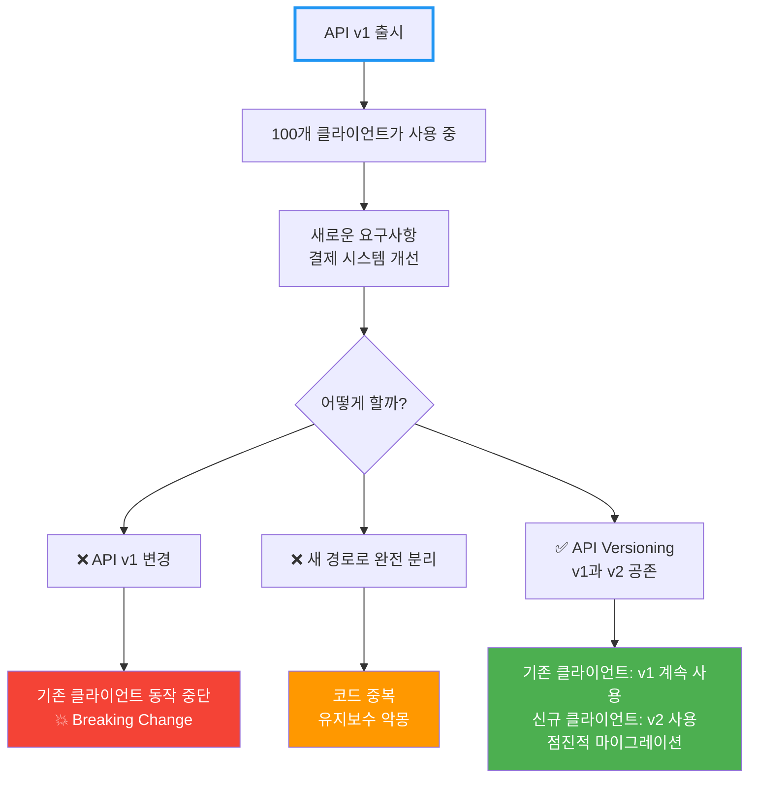
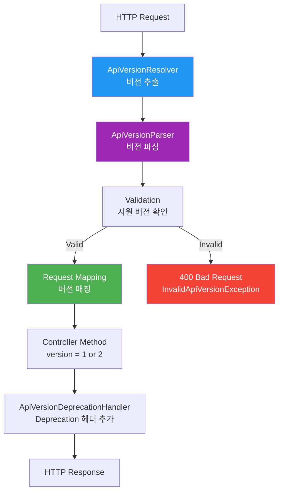
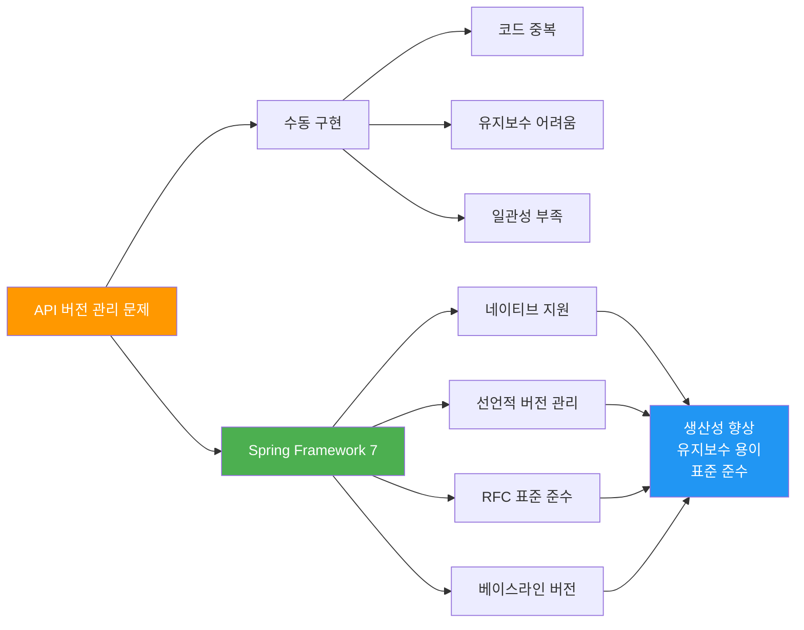

# Spring Framework 7 - API Versioning

Spring Framework 7에서 도입된 네이티브 API 버전 관리 기능

## 결론부터 말하면

**Spring Framework 7부터 API 버전 관리가 프레임워크에 내장**되었습니다.
`@GetMapping`, `@PostMapping` 등에 `version` 속성을 추가하고, `ApiVersionConfigurer`로 버전 확인 방법을 설정할 수 있습니다.

```java
// Before: 수동 버전 관리 (경로에 버전 포함)
@GetMapping("/api/v1/users/{id}")
public User getUserV1(@PathVariable Long id) {
    return userService.findById(id);
}

@GetMapping("/api/v2/users/{id}")
public UserV2 getUserV2(@PathVariable Long id) {
    return userService.findByIdV2(id);
}

// After: Spring Framework 7 (네이티브 버전 관리)
@Configuration
public class WebConfig implements WebMvcConfigurer {
    @Override
    public void configureApiVersioning(ApiVersionConfigurer configurer) {
        configurer.useRequestHeader("X-API-Version");  // 헤더로 버전 확인
    }
}

@RestController
@RequestMapping("/api/users")
public class UserController {
    @GetMapping(path = "/{id}", version = "1")
    public User getUserV1(@PathVariable Long id) {
        return userService.findById(id);
    }

    @GetMapping(path = "/{id}", version = "2")
    public UserV2 getUserV2(@PathVariable Long id) {
        return userService.findByIdV2(id);
    }
}
```

## 1. API 버전 관리가 필요한 이유

### 1.1 실세계 문제

**API는 변경되지만 기존 클라이언트는 계속 작동해야 합니다.**



### 1.2 구체적 사례

```java
// v1: 초기 API (단순한 주문 정보)
{
  "orderId": "12345",
  "amount": 50000,
  "status": "completed"
}

// v2: 개선된 API (상세 결제 정보 추가)
{
  "orderId": "12345",
  "amount": 50000,
  "status": "completed",
  "payment": {
    "method": "card",
    "cardLast4": "1234",
    "transactionId": "tx_abc123"
  },
  "shipping": {
    "address": "서울시 강남구...",
    "estimatedDelivery": "2025-01-25"
  }
}
```

**문제:**
- 기존 클라이언트(모바일 앱 v1.0)는 `payment`, `shipping` 필드를 모름
- 새 필드 추가 시 기존 앱이 깨질 수 있음
- 하지만 신규 클라이언트는 새 필드가 필요함

**해결:**
- v1 API는 그대로 유지 (기존 앱 보호)
- v2 API는 새 필드 포함 (신규 앱 지원)
- 두 버전이 공존

## 2. 기존 API 버전 관리 방식과 문제점

### 2.1 URI 경로 버전 관리 (가장 흔함)

```java
@RestController
public class OrderController {
    @GetMapping("/api/v1/orders/{id}")
    public OrderV1 getOrderV1(@PathVariable Long id) {
        return orderService.findByIdV1(id);
    }

    @GetMapping("/api/v2/orders/{id}")
    public OrderV2 getOrderV2(@PathVariable Long id) {
        return orderService.findByIdV2(id);
    }
}
```

**장점:**
- 명확하고 직관적
- 브라우저에서 쉽게 테스트

**단점:**
- ❌ URL이 버전마다 달라짐 (리소스가 다르게 보임)
- ❌ 코드 중복 (Controller, Service 모두 v1/v2 분리)
- ❌ 라우팅 복잡도 증가

### 2.2 헤더 버전 관리

```java
@RestController
@RequestMapping("/api/orders")
public class OrderController {
    @GetMapping("/{id}")
    public Order getOrder(
        @PathVariable Long id,
        @RequestHeader(value = "X-API-Version", defaultValue = "1") String version
    ) {
        if ("2".equals(version)) {
            return orderService.findByIdV2(id);
        }
        return orderService.findByIdV1(id);
    }
}
```

**장점:**
- URL이 깔끔함
- REST 원칙에 부합

**단점:**
- ❌ if-else 분기 난무
- ❌ 버전 증가 시 코드 복잡도 폭발적 증가
- ❌ 테스트 어려움

### 2.3 Query Parameter 버전 관리

```java
@GetMapping("/api/orders/{id}")
public Order getOrder(
    @PathVariable Long id,
    @RequestParam(value = "version", defaultValue = "1") String version
) {
    // if-else 분기...
}
```

**단점:**
- ❌ 캐싱 어려움 (쿼리 파라미터마다 다른 캐시 키)
- ❌ URL이 지저분함

### 2.4 Content Negotiation (Media Type)

```java
@GetMapping(value = "/{id}", produces = "application/vnd.myapp.v1+json")
public OrderV1 getOrderV1(@PathVariable Long id) {
    return orderService.findByIdV1(id);
}

@GetMapping(value = "/{id}", produces = "application/vnd.myapp.v2+json")
public OrderV2 getOrderV2(@PathVariable Long id) {
    return orderService.findByIdV2(id);
}
```

**장점:**
- REST 원칙에 가장 부합

**단점:**
- ❌ 복잡함 (개발자들이 잘 모름)
- ❌ 브라우저 테스트 어려움

## 3. Spring Framework 7의 네이티브 API Versioning

### 3.1 핵심 컴포넌트



### 3.2 5가지 핵심 요소

| 컴포넌트 | 역할 | 설명 |
|---------|------|------|
| **ApiVersionStrategy** | 전체 조율자 | 모든 버전 관리 설정 통합 |
| **ApiVersionResolver** | 버전 추출 | 요청에서 버전 정보 가져오기 |
| **ApiVersionParser** | 버전 파싱 | 문자열 → 비교 가능한 객체 (기본: 시맨틱 버전) |
| **Validation** | 검증 | 지원하는 버전인지 확인 |
| **ApiVersionDeprecationHandler** | Deprecation 처리 | RFC 9745, RFC 8594 기반 헤더 추가 |

## 4. 버전 확인 전략 (4가지)

### 4.1 Header 기반 (권장)

**가장 깔끔하고 REST 원칙에 부합**

```java
@Configuration
public class WebConfig implements WebMvcConfigurer {
    @Override
    public void configureApiVersioning(ApiVersionConfigurer configurer) {
        configurer.useRequestHeader("X-API-Version")  // 커스텀 헤더
                .addSupportedVersions("1", "2", "3");
    }
}
```

```java
@RestController
@RequestMapping("/api/orders")
public class OrderController {

    @GetMapping(path = "/{id}", version = "1")
    public OrderV1 getOrderV1(@PathVariable Long id) {
        return new OrderV1(id, "Order details v1");
    }

    @GetMapping(path = "/{id}", version = "2")
    public OrderV2 getOrderV2(@PathVariable Long id) {
        return new OrderV2(id, "Order details v2", "Extra field");
    }

    @GetMapping(path = "/{id}", version = "3")
    public OrderV3 getOrderV3(@PathVariable Long id) {
        return new OrderV3(id, "Order details v3", "Payment info");
    }
}
```

**요청:**
```bash
# v1 호출
curl -H "X-API-Version: 1" http://localhost:8080/api/orders/123

# v2 호출
curl -H "X-API-Version: 2" http://localhost:8080/api/orders/123

# v3 호출
curl -H "X-API-Version: 3" http://localhost:8080/api/orders/123
```

**장점:**
- ✅ URL이 깔끔 (`/api/orders/123`)
- ✅ 버전별 Controller 메서드 명확히 분리
- ✅ 코드 중복 최소화
- ✅ 테스트 용이

### 4.2 Query Parameter 기반

```java
@Configuration
public class WebConfig implements WebMvcConfigurer {
    @Override
    public void configureApiVersioning(ApiVersionConfigurer configurer) {
        configurer.useRequestParameter("api-version")
                .addSupportedVersions("1", "2");
    }
}
```

**요청:**
```bash
curl http://localhost:8080/api/orders/123?api-version=1
curl http://localhost:8080/api/orders/123?api-version=2
```

**장점:**
- ✅ 브라우저에서 쉽게 테스트
- ✅ URL에 버전 명시

**단점:**
- ⚠️ 캐싱 복잡도 증가
- ⚠️ URL이 지저분해짐

### 4.3 URI Path 기반

```java
@Configuration
public class WebConfig implements WebMvcConfigurer {
    @Override
    public void configureApiVersioning(ApiVersionConfigurer configurer) {
        configurer.useUriPath(0)  // 0번째 경로 세그먼트가 버전
                .addSupportedVersions("1", "2");
    }
}
```

```java
@RestController
@RequestMapping("/api/orders")
public class OrderController {

    @GetMapping(path = "/{id}", version = "1")
    public OrderV1 getOrderV1(@PathVariable Long id) {
        return new OrderV1(id, "v1");
    }

    @GetMapping(path = "/{id}", version = "2")
    public OrderV2 getOrderV2(@PathVariable Long id) {
        return new OrderV2(id, "v2");
    }
}
```

**요청:**
```bash
curl http://localhost:8080/1/api/orders/123  # v1
curl http://localhost:8080/2/api/orders/123  # v2
```

**특징:**
- 경로의 특정 세그먼트가 버전을 나타냄
- 다른 resolver와 달리 **항상 필수** (없으면 400 에러)

### 4.4 Media Type Parameter 기반

```java
@Configuration
public class WebConfig implements WebMvcConfigurer {
    @Override
    public void configureApiVersioning(ApiVersionConfigurer configurer) {
        configurer.useMediaTypeParameter("v")  // Accept/Content-Type의 v 파라미터
                .addSupportedVersions("1", "2");
    }
}
```

**요청:**
```bash
curl -H "Accept: application/json;v=1" http://localhost:8080/api/orders/123
curl -H "Accept: application/json;v=2" http://localhost:8080/api/orders/123
```

**장점:**
- ✅ Content Negotiation 활용
- ✅ REST 원칙에 부합

**단점:**
- ⚠️ 복잡함 (개발자들이 익숙하지 않음)

## 5. 고정 버전 vs 베이스라인 버전

### 5.1 고정 버전 (Fixed Version)

**정확히 해당 버전에만 매칭**

```java
@RestController
@RequestMapping("/api/users")
public class UserController {

    @GetMapping(path = "/{id}", version = "1")
    public UserV1 getUserV1(@PathVariable Long id) {
        return new UserV1(id, "John");
    }

    @GetMapping(path = "/{id}", version = "2")
    public UserV2 getUserV2(@PathVariable Long id) {
        return new UserV2(id, "John", "john@example.com");
    }
}
```

**동작:**
- `X-API-Version: 1` → `getUserV1()` 호출
- `X-API-Version: 2` → `getUserV2()` 호출
- `X-API-Version: 3` → **404 Not Found** (매칭 없음)

### 5.2 베이스라인 버전 (Baseline Version) - `+` 사용

**해당 버전 이상 모두 매칭**

```java
@RestController
@RequestMapping("/api/products")
public class ProductController {

    @GetMapping(path = "/{id}", version = "1")
    public ProductV1 getProductV1(@PathVariable Long id) {
        return new ProductV1(id, "Product");
    }

    @GetMapping(path = "/{id}", version = "1.1+")  // 1.1 이상
    public ProductV1_1 getProductV1_1(@PathVariable Long id) {
        return new ProductV1_1(id, "Product", "New field added");
    }

    @GetMapping(path = "/{id}", version = "2.0+")  // 2.0 이상
    public ProductV2 getProductV2(@PathVariable Long id) {
        return new ProductV2(id, "Product V2");
    }
}
```

**동작:**
- `X-API-Version: 1` → `getProductV1()` 호출
- `X-API-Version: 1.1` → `getProductV1_1()` 호출 (1.1+에 매칭)
- `X-API-Version: 1.5` → `getProductV1_1()` 호출 (1.1+에 매칭)
- `X-API-Version: 2.0` → `getProductV2()` 호출 (2.0+에 매칭)
- `X-API-Version: 2.5` → `getProductV2()` 호출 (2.0+에 매칭)
- `X-API-Version: 3.0` → `getProductV2()` 호출 (가장 가까운 2.0+에 매칭)

**장점:**
- ✅ 하위 호환성 유지
- ✅ 새 버전에서도 기존 메서드 재사용 가능
- ✅ 코드 중복 최소화

**사용 시나리오:**
```java
// 시나리오: 작은 개선사항 추가
@GetMapping(path = "/dashboard", version = "1")
public Dashboard getDashboardV1() {
    return new Dashboard("기본 정보");
}

@GetMapping(path = "/dashboard", version = "1.1+")  // 1.1부터 계속 사용
public Dashboard getDashboardV1_1() {
    return new Dashboard("기본 정보 + 새로운 위젯");
}

// v1.2, v1.3, v1.9 모두 getDashboardV1_1() 호출
// v2.0이 나오기 전까지 계속 사용됨
```

## 6. 시맨틱 버전 파싱 (Semantic Versioning)

### 6.1 기본 파서: SemanticApiVersionParser

**`major.minor.patch` 형식 지원**

```java
// 지원되는 버전 형식
"1"         → 1.0.0
"1.2"       → 1.2.0
"1.2.3"     → 1.2.3
"2.0.0"     → 2.0.0
```

### 6.2 비교 및 정렬

```java
1 < 1.1 < 1.2 < 2.0 < 2.1.5

// 버전 매칭 우선순위
// 요청: X-API-Version: 1.5

// 매칭 후보:
version = "1"      → 매칭 점수: 낮음
version = "1.1+"   → 매칭 점수: 중간 (베이스라인)
version = "2"      → 매칭 안 됨 (요청보다 높음)

// 가장 가까운 베이스라인 버전이 선택됨
```

### 6.3 커스텀 파서

```java
@Configuration
public class WebConfig implements WebMvcConfigurer {
    @Override
    public void configureApiVersioning(ApiVersionConfigurer configurer) {
        configurer.useRequestHeader("X-API-Version")
                .parser(new CustomVersionParser())  // 커스텀 파서
                .addSupportedVersions("v1", "v2", "latest");
    }
}

public class CustomVersionParser implements ApiVersionParser<String> {
    @Override
    public String parse(String version) {
        // "v1" → "1", "latest" → "999" 등 변환
        if ("latest".equals(version)) {
            return "999";
        }
        return version.replace("v", "");
    }
}
```

## 7. 버전 필수/선택 설정

### 7.1 버전 필수 (기본값)

```java
@Configuration
public class WebConfig implements WebMvcConfigurer {
    @Override
    public void configureApiVersioning(ApiVersionConfigurer configurer) {
        configurer.useRequestHeader("X-API-Version")
                .required(true)  // 기본값
                .addSupportedVersions("1", "2");
    }
}
```

**동작:**
- `X-API-Version` 헤더 없으면 → **400 Bad Request** (`MissingApiVersionException`)

### 7.2 버전 선택적

```java
@Configuration
public class WebConfig implements WebMvcConfigurer {
    @Override
    public void configureApiVersioning(ApiVersionConfigurer configurer) {
        configurer.useRequestHeader("X-API-Version")
                .required(false)  // 선택적
                .addSupportedVersions("1", "2", "3");
    }
}
```

**동작:**
- `X-API-Version` 헤더 없으면 → **가장 최신 버전 사용** (예: "3")

```java
@RestController
@RequestMapping("/api/orders")
public class OrderController {
    @GetMapping(path = "/{id}", version = "1")
    public OrderV1 getOrderV1(@PathVariable Long id) {
        return new OrderV1(id);
    }

    @GetMapping(path = "/{id}", version = "2")
    public OrderV2 getOrderV2(@PathVariable Long id) {
        return new OrderV2(id);
    }

    @GetMapping(path = "/{id}", version = "3")  // 최신
    public OrderV3 getOrderV3(@PathVariable Long id) {
        return new OrderV3(id);
    }
}

// 요청 (헤더 없음)
// curl http://localhost:8080/api/orders/123
// → getOrderV3() 호출 (최신 버전)
```

## 8. Deprecation 처리 (RFC 9745, RFC 8594)

### 8.1 자동 Deprecation 헤더

**Spring Framework 7은 RFC 9745와 RFC 8594를 구현**하여 구버전 API 사용 시 자동으로 `Deprecation`, `Sunset`, `Link` 헤더를 추가합니다.

```java
@Configuration
public class WebConfig implements WebMvcConfigurer {
    @Override
    public void configureApiVersioning(ApiVersionConfigurer configurer) {
        configurer.useRequestHeader("X-API-Version")
                .addSupportedVersions("1", "2", "3")
                .deprecateVersion("1", LocalDate.of(2025, 12, 31))  // v1은 2025-12-31에 종료
                .deprecateVersion("2", LocalDate.of(2026, 6, 30));   // v2는 2026-06-30에 종료
    }
}
```

**v1 API 호출 시 응답:**
```http
HTTP/1.1 200 OK
Content-Type: application/json
Deprecation: true
Sunset: Sun, 31 Dec 2025 00:00:00 GMT
Link: <https://api.example.com/docs/migration>; rel="deprecation"

{
  "orderId": "12345",
  "amount": 50000
}
```

### 8.2 Deprecation 헤더 의미

| 헤더 | 의미 | 예시 |
|------|------|------|
| `Deprecation` | 이 API는 deprecated 상태 | `Deprecation: true` |
| `Sunset` | 이 API가 종료되는 날짜 | `Sunset: Sun, 31 Dec 2025 00:00:00 GMT` |
| `Link` | 마이그레이션 문서 링크 | `Link: <https://docs.example.com/v2>; rel="deprecation"` |

### 8.3 클라이언트 대응

```javascript
// JavaScript 클라이언트 예시
fetch('https://api.example.com/api/orders/123', {
  headers: {
    'X-API-Version': '1'
  }
})
.then(response => {
  if (response.headers.get('Deprecation')) {
    const sunset = response.headers.get('Sunset');
    const link = response.headers.get('Link');

    console.warn(`⚠️ API v1 is deprecated!`);
    console.warn(`Sunset date: ${sunset}`);
    console.warn(`Migration guide: ${link}`);

    // 사용자에게 업데이트 알림
    showUpdateNotification();
  }

  return response.json();
});
```

## 9. 실전 활용 예제

### 9.1 전체 설정 예시

```java
@Configuration
public class ApiVersionConfig implements WebMvcConfigurer {

    @Override
    public void configureApiVersioning(ApiVersionConfigurer configurer) {
        configurer
            // 헤더로 버전 확인
            .useRequestHeader("X-API-Version")

            // 지원 버전
            .addSupportedVersions("1.0", "1.1", "2.0", "2.1")

            // 버전 필수 여부 (false = 선택적, 최신 버전 사용)
            .required(false)

            // Deprecation 설정
            .deprecateVersion("1.0", LocalDate.of(2025, 6, 30))
            .deprecateVersion("1.1", LocalDate.of(2025, 12, 31))

            // 커스텀 Deprecation 핸들러
            .deprecationHandler(new CustomDeprecationHandler());
    }

    static class CustomDeprecationHandler implements ApiVersionDeprecationHandler {
        @Override
        public void handleDeprecation(
            HttpServletRequest request,
            HttpServletResponse response,
            String version,
            LocalDate sunsetDate
        ) {
            // RFC 9745, RFC 8594 헤더 추가
            response.addHeader("Deprecation", "true");
            response.addHeader("Sunset", sunsetDate.toString());
            response.addHeader("Link",
                "<https://docs.example.com/api/migration>; rel=\"deprecation\"");

            // 추가 커스텀 헤더
            response.addHeader("X-Deprecated-Version", version);
            response.addHeader("X-Migration-Guide",
                "https://docs.example.com/api/v" + version + "/migration");
        }
    }
}
```

### 9.2 REST Controller 예시

```java
@RestController
@RequestMapping("/api/users")
public class UserController {

    private final UserService userService;

    public UserController(UserService userService) {
        this.userService = userService;
    }

    // v1.0: 기본 사용자 정보
    @GetMapping(path = "/{id}", version = "1.0")
    public UserV1 getUserV1(@PathVariable Long id) {
        User user = userService.findById(id);
        return new UserV1(user.getId(), user.getName());
    }

    // v1.1+: 이메일 추가 (1.1, 1.2, 1.9 등 모두 사용)
    @GetMapping(path = "/{id}", version = "1.1+")
    public UserV1_1 getUserV1_1(@PathVariable Long id) {
        User user = userService.findById(id);
        return new UserV1_1(
            user.getId(),
            user.getName(),
            user.getEmail()
        );
    }

    // v2.0+: 완전히 새로운 구조 (프로필 포함)
    @GetMapping(path = "/{id}", version = "2.0+")
    public UserV2 getUserV2(@PathVariable Long id) {
        User user = userService.findById(id);
        Profile profile = userService.getProfile(id);

        return new UserV2(
            user.getId(),
            user.getName(),
            user.getEmail(),
            new UserV2.ProfileDTO(
                profile.getBio(),
                profile.getAvatar(),
                profile.getSocialLinks()
            )
        );
    }

    // POST 예시
    @PostMapping(version = "1.0")
    public UserV1 createUserV1(@RequestBody CreateUserRequestV1 request) {
        User user = userService.create(request.getName());
        return new UserV1(user.getId(), user.getName());
    }

    @PostMapping(version = "2.0+")
    public UserV2 createUserV2(@RequestBody CreateUserRequestV2 request) {
        User user = userService.create(
            request.getName(),
            request.getEmail(),
            request.getProfile()
        );
        return toUserV2(user);
    }
}

// DTO 정의
record UserV1(Long id, String name) {}

record UserV1_1(Long id, String name, String email) {}

record UserV2(Long id, String name, String email, ProfileDTO profile) {
    record ProfileDTO(String bio, String avatar, List<String> socialLinks) {}
}

record CreateUserRequestV1(String name) {}

record CreateUserRequestV2(String name, String email, ProfileDTO profile) {
    record ProfileDTO(String bio, String avatar) {}
}
```

### 9.3 테스트 코드

```java
@SpringBootTest
@AutoConfigureMockMvc
class UserControllerTest {

    @Autowired
    private MockMvc mockMvc;

    @Test
    void getUserV1_ShouldReturnBasicInfo() throws Exception {
        mockMvc.perform(get("/api/users/1")
                .header("X-API-Version", "1.0"))
            .andExpect(status().isOk())
            .andExpect(jsonPath("$.id").value(1))
            .andExpect(jsonPath("$.name").value("John"))
            .andExpect(jsonPath("$.email").doesNotExist());  // v1에는 email 없음
    }

    @Test
    void getUserV1_1_ShouldReturnEmail() throws Exception {
        mockMvc.perform(get("/api/users/1")
                .header("X-API-Version", "1.1"))
            .andExpect(status().isOk())
            .andExpect(jsonPath("$.id").value(1))
            .andExpect(jsonPath("$.name").value("John"))
            .andExpect(jsonPath("$.email").value("john@example.com"));  // v1.1부터 email 포함
    }

    @Test
    void getUserV2_ShouldReturnProfile() throws Exception {
        mockMvc.perform(get("/api/users/1")
                .header("X-API-Version", "2.0"))
            .andExpect(status().isOk())
            .andExpect(jsonPath("$.profile.bio").value("Software Engineer"))
            .andExpect(jsonPath("$.profile.avatar").exists());
    }

    @Test
    void getUserWithoutVersion_ShouldUseLatest() throws Exception {
        // required(false) 설정 시 최신 버전 사용
        mockMvc.perform(get("/api/users/1"))
            .andExpect(status().isOk())
            .andExpect(jsonPath("$.profile").exists());  // v2 응답
    }

    @Test
    void getUserWithUnsupportedVersion_ShouldReturn400() throws Exception {
        mockMvc.perform(get("/api/users/1")
                .header("X-API-Version", "99"))
            .andExpect(status().isBadRequest());  // InvalidApiVersionException
    }

    @Test
    void getUserV1_ShouldIncludeDeprecationHeaders() throws Exception {
        mockMvc.perform(get("/api/users/1")
                .header("X-API-Version", "1.0"))
            .andExpect(status().isOk())
            .andExpect(header().string("Deprecation", "true"))
            .andExpect(header().exists("Sunset"))
            .andExpect(header().exists("Link"));
    }
}
```

### 9.4 여러 버전 전략 조합

```java
@Configuration
public class WebConfig implements WebMvcConfigurer {
    @Override
    public void configureApiVersioning(ApiVersionConfigurer configurer) {
        configurer
            // 1순위: 헤더
            .useRequestHeader("X-API-Version")

            // 2순위: 쿼리 파라미터 (헤더 없을 때)
            .or()
            .useRequestParameter("version")

            .addSupportedVersions("1", "2", "3");
    }
}
```

**동작:**
```bash
# 헤더 우선
curl -H "X-API-Version: 2" http://localhost:8080/api/users/1
# → v2 사용

# 헤더 없으면 쿼리 파라미터
curl http://localhost:8080/api/users/1?version=1
# → v1 사용

# 둘 다 있으면 헤더 우선
curl -H "X-API-Version: 2" http://localhost:8080/api/users/1?version=1
# → v2 사용 (헤더가 우선)
```

## 10. 마이그레이션 가이드

### 10.1 기존 URI 버전 관리에서 전환

```java
// Before: URI 경로에 버전 포함
@RestController
public class OrderControllerOld {
    @GetMapping("/api/v1/orders/{id}")
    public OrderV1 getOrderV1(@PathVariable Long id) {
        return orderService.findByIdV1(id);
    }

    @GetMapping("/api/v2/orders/{id}")
    public OrderV2 getOrderV2(@PathVariable Long id) {
        return orderService.findByIdV2(id);
    }
}

// After: Spring Framework 7
@Configuration
public class WebConfig implements WebMvcConfigurer {
    @Override
    public void configureApiVersioning(ApiVersionConfigurer configurer) {
        configurer.useRequestHeader("X-API-Version")
                .addSupportedVersions("1", "2");
    }
}

@RestController
@RequestMapping("/api/orders")  // 버전 제거
public class OrderController {
    @GetMapping(path = "/{id}", version = "1")
    public OrderV1 getOrderV1(@PathVariable Long id) {
        return orderService.findByIdV1(id);
    }

    @GetMapping(path = "/{id}", version = "2")
    public OrderV2 getOrderV2(@PathVariable Long id) {
        return orderService.findByIdV2(id);
    }
}
```

### 10.2 점진적 마이그레이션 (하위 호환성 유지)

**단계 1: 기존 경로 유지하면서 헤더 지원 추가**

```java
@Configuration
public class WebConfig implements WebMvcConfigurer {
    @Override
    public void configureApiVersioning(ApiVersionConfigurer configurer) {
        configurer
            .useRequestHeader("X-API-Version")  // 새 방식
            .or()
            .useUriPath(1)  // 기존 /api/v1/... 방식도 지원
            .addSupportedVersions("1", "2");
    }
}

@RestController
public class OrderController {
    // 새 방식 (권장)
    @GetMapping(path = "/api/orders/{id}", version = "1")
    public OrderV1 getOrderV1(@PathVariable Long id) {
        return orderService.findByIdV1(id);
    }

    @GetMapping(path = "/api/orders/{id}", version = "2")
    public OrderV2 getOrderV2(@PathVariable Long id) {
        return orderService.findByIdV2(id);
    }

    // 기존 방식 (deprecated, 하위 호환성)
    @GetMapping("/api/v1/orders/{id}")
    public OrderV1 getOrderV1Old(@PathVariable Long id) {
        return getOrderV1(id);  // 새 메서드 재사용
    }

    @GetMapping("/api/v2/orders/{id}")
    public OrderV2 getOrderV2Old(@PathVariable Long id) {
        return getOrderV2(id);  // 새 메서드 재사용
    }
}
```

**단계 2: 클라이언트에게 마이그레이션 공지**

```http
# 기존 경로 응답에 Deprecation 헤더 추가
HTTP/1.1 200 OK
Deprecation: true
Sunset: Sun, 31 Dec 2025 00:00:00 GMT
Link: <https://docs.example.com/api/migration>; rel="deprecation"
X-Migration-Message: Please use X-API-Version header instead of URI versioning

{
  "orderId": "12345"
}
```

**단계 3: 기존 경로 제거**

```java
// 충분한 기간(6개월~1년) 후 기존 경로 제거
@RestController
@RequestMapping("/api/orders")
public class OrderController {
    // 새 방식만 유지
    @GetMapping(path = "/{id}", version = "1")
    public OrderV1 getOrderV1(@PathVariable Long id) {
        return orderService.findByIdV1(id);
    }

    @GetMapping(path = "/{id}", version = "2")
    public OrderV2 getOrderV2(@PathVariable Long id) {
        return orderService.findByIdV2(id);
    }

    // 기존 경로 제거됨
}
```

### 10.3 버전별 Service 레이어 분리 패턴

```java
// Service Interface
public interface OrderService {
    OrderV1 findByIdV1(Long id);
    OrderV2 findByIdV2(Long id);
}

// Service Implementation
@Service
public class OrderServiceImpl implements OrderService {

    @Override
    public OrderV1 findByIdV1(Long id) {
        Order order = orderRepository.findById(id)
            .orElseThrow(() -> new OrderNotFoundException(id));

        // v1 DTO 변환 (단순)
        return new OrderV1(order.getId(), order.getAmount());
    }

    @Override
    public OrderV2 findByIdV2(Long id) {
        Order order = orderRepository.findById(id)
            .orElseThrow(() -> new OrderNotFoundException(id));

        // v2 DTO 변환 (상세)
        return new OrderV2(
            order.getId(),
            order.getAmount(),
            order.getStatus(),
            mapPayment(order.getPayment()),
            mapShipping(order.getShipping())
        );
    }

    private OrderV2.PaymentDTO mapPayment(Payment payment) {
        return new OrderV2.PaymentDTO(
            payment.getMethod(),
            payment.getCardLast4(),
            payment.getTransactionId()
        );
    }

    private OrderV2.ShippingDTO mapShipping(Shipping shipping) {
        return new OrderV2.ShippingDTO(
            shipping.getAddress(),
            shipping.getEstimatedDelivery()
        );
    }
}
```

## 11. 베스트 프랙티스

### ✅ Do's

1. **헤더 기반 버전 관리 사용**
   ```java
   configurer.useRequestHeader("X-API-Version")
   ```
   - URL이 깔끔
   - REST 원칙에 부합

2. **시맨틱 버전 사용**
   ```java
   version = "1.0"
   version = "1.1+"
   version = "2.0+"
   ```

3. **베이스라인 버전으로 하위 호환성 유지**
   ```java
   @GetMapping(path = "/{id}", version = "1.1+")
   // 1.1, 1.2, 1.9 모두 사용 가능
   ```

4. **Deprecation 정보 명시**
   ```java
   configurer.deprecateVersion("1.0", LocalDate.of(2025, 12, 31))
   ```

5. **마이그레이션 문서 제공**
   ```java
   response.addHeader("Link",
       "<https://docs.example.com/migration>; rel=\"deprecation\"");
   ```

6. **버전별 DTO 분리**
   ```java
   record OrderV1(Long id, BigDecimal amount) {}
   record OrderV2(Long id, BigDecimal amount, String status) {}
   ```

### ❌ Don'ts

1. **URI에 버전 넣지 말기** (가능하면)
   ```java
   // ❌ 나쁜 예
   @GetMapping("/api/v1/orders/{id}")

   // ✅ 좋은 예
   @GetMapping(path = "/api/orders/{id}", version = "1")
   ```

2. **너무 많은 버전 동시 유지 금지**
   ```java
   // ❌ 너무 많음 (유지보수 악몽)
   version = "1"
   version = "1.1"
   version = "1.2"
   version = "1.3"
   version = "2.0"
   version = "2.1"

   // ✅ 적절함 (최대 3-4개)
   version = "1.0"
   version = "2.0+"
   version = "3.0+"
   ```

3. **Breaking Change를 Minor 버전에 포함하지 말기**
   ```java
   // ❌ 나쁜 예 (1.0 → 1.1에서 필드 제거)
   version = "1.0"  // { "id": 1, "name": "John", "age": 30 }
   version = "1.1"  // { "id": 1, "name": "John" }  // age 제거 (Breaking!)

   // ✅ 좋은 예 (Major 버전 증가)
   version = "1.0"  // { "id": 1, "name": "John", "age": 30 }
   version = "2.0"  // { "id": 1, "name": "John" }  // age 제거
   ```

4. **버전 정보 없이 API 변경 금지**
   ```java
   // ❌ 위험 (기존 클라이언트 깨짐)
   @GetMapping("/api/orders/{id}")
   public Order getOrder(@PathVariable Long id) {
       // 응답 구조 변경하면 기존 클라이언트 동작 중단
   }

   // ✅ 안전 (버전 관리)
   @GetMapping(path = "/api/orders/{id}", version = "1")
   public OrderV1 getOrderV1(@PathVariable Long id) { }

   @GetMapping(path = "/api/orders/{id}", version = "2")
   public OrderV2 getOrderV2(@PathVariable Long id) { }
   ```

## 12. 예외 처리

### 12.1 버전 관련 예외

| 예외 | 상황 | HTTP 상태 |
|------|------|-----------|
| `MissingApiVersionException` | 버전 필수인데 제공 안 됨 | 400 Bad Request |
| `InvalidApiVersionException` | 지원하지 않는 버전 | 400 Bad Request |

### 12.2 글로벌 예외 핸들러

```java
@RestControllerAdvice
public class ApiVersionExceptionHandler {

    @ExceptionHandler(MissingApiVersionException.class)
    public ResponseEntity<ErrorResponse> handleMissingVersion(
        MissingApiVersionException ex
    ) {
        ErrorResponse error = new ErrorResponse(
            "MISSING_API_VERSION",
            "API version is required. Please provide X-API-Version header.",
            List.of("1.0", "2.0", "3.0")
        );
        return ResponseEntity.badRequest().body(error);
    }

    @ExceptionHandler(InvalidApiVersionException.class)
    public ResponseEntity<ErrorResponse> handleInvalidVersion(
        InvalidApiVersionException ex
    ) {
        ErrorResponse error = new ErrorResponse(
            "INVALID_API_VERSION",
            "Unsupported API version: " + ex.getRequestedVersion(),
            List.of("1.0", "2.0", "3.0")
        );
        return ResponseEntity.badRequest().body(error);
    }
}

record ErrorResponse(
    String code,
    String message,
    List<String> supportedVersions
) {}
```

**응답 예시:**
```json
{
  "code": "INVALID_API_VERSION",
  "message": "Unsupported API version: 99",
  "supportedVersions": ["1.0", "2.0", "3.0"]
}
```

## 13. 모니터링 및 메트릭

### 13.1 버전별 사용량 추적

```java
@Component
@Aspect
public class ApiVersionMetricsAspect {

    private final MeterRegistry meterRegistry;

    public ApiVersionMetricsAspect(MeterRegistry meterRegistry) {
        this.meterRegistry = meterRegistry;
    }

    @Around("@annotation(org.springframework.web.bind.annotation.GetMapping)")
    public Object trackVersionUsage(ProceedingJoinPoint joinPoint) throws Throwable {
        // 버전 정보 추출
        String version = extractVersion();

        // 메트릭 증가
        meterRegistry.counter("api.version.usage",
            "version", version,
            "endpoint", joinPoint.getSignature().getName()
        ).increment();

        return joinPoint.proceed();
    }
}
```

### 13.2 Deprecated 버전 알림

```java
@Component
public class DeprecatedVersionAlertService {

    private final NotificationService notificationService;

    @Scheduled(cron = "0 0 9 * * MON")  // 매주 월요일 9시
    public void checkDeprecatedVersionUsage() {
        Map<String, Long> versionUsage = getVersionUsageLastWeek();

        versionUsage.forEach((version, count) -> {
            if (isDeprecated(version) && count > 1000) {
                notificationService.sendAlert(
                    "⚠️ Deprecated API v" + version +
                    " is still heavily used: " + count + " requests last week"
                );
            }
        });
    }
}
```

## 14. Spring Boot 3 vs Spring Boot 4 비교

| 특징 | Spring Boot 3 | Spring Boot 4 |
|------|--------------|--------------|
| **API 버전 관리** | 수동 구현 필요 | ✅ 네이티브 지원 |
| **버전 지정 방식** | URI 경로, 커스텀 로직 | `version` 속성 |
| **설정** | 복잡한 커스텀 설정 | `ApiVersionConfigurer` |
| **Deprecation** | 수동 헤더 추가 | ✅ RFC 9745, RFC 8594 자동 지원 |
| **버전 파싱** | 수동 구현 | ✅ `SemanticApiVersionParser` 내장 |
| **베이스라인 버전** | 불가능 | ✅ `1.0+` 지원 |

```java
// Spring Boot 3: 수동 구현
@RestController
public class OrderController {
    @GetMapping("/api/v1/orders/{id}")
    public OrderV1 getOrderV1(@PathVariable Long id) {
        return orderService.findByIdV1(id);
    }

    @GetMapping("/api/v2/orders/{id}")
    public OrderV2 getOrderV2(@PathVariable Long id) {
        return orderService.findByIdV2(id);
    }
}

// Spring Boot 4: 네이티브 지원
@Configuration
public class WebConfig implements WebMvcConfigurer {
    @Override
    public void configureApiVersioning(ApiVersionConfigurer configurer) {
        configurer.useRequestHeader("X-API-Version");
    }
}

@RestController
@RequestMapping("/api/orders")
public class OrderController {
    @GetMapping(path = "/{id}", version = "1")
    public OrderV1 getOrderV1(@PathVariable Long id) {
        return orderService.findByIdV1(id);
    }

    @GetMapping(path = "/{id}", version = "2")
    public OrderV2 getOrderV2(@PathVariable Long id) {
        return orderService.findByIdV2(id);
    }
}
```

## 15. 결론

### Spring Framework 7 API Versioning의 장점



### 핵심 요약

1. **네이티브 지원**: 프레임워크 레벨에서 API 버전 관리 제공
2. **4가지 전략**: Header, Parameter, URI, Media Type
3. **베이스라인 버전**: `1.0+`로 하위 호환성 유지
4. **표준 준수**: RFC 9745, RFC 8594 기반 Deprecation
5. **점진적 마이그레이션**: 기존 코드와 공존 가능

### 다음 단계

1. ✅ Spring Boot 4.0으로 업그레이드
2. ✅ `ApiVersionConfigurer` 설정
3. ✅ Controller에 `version` 속성 추가
4. ✅ Deprecation 정책 수립
5. ✅ 클라이언트 마이그레이션 가이드 작성

## 출처

- [API Versioning in Spring](https://spring.io/blog/2025/09/16/api-versioning-in-spring/)
- [Spring Framework Reference - API Versioning](https://docs.spring.io/spring-framework/reference/web/webmvc-versioning.html)
- [Explore Spring Framework 7 Features - API Versioning](https://foojay.io/today/explore-spring-framework-7-features-api-versioning/)
- [RFC 9745 - HTTP Deprecation Header](https://www.rfc-editor.org/rfc/rfc9745.html)
- [RFC 8594 - The Sunset HTTP Header](https://www.rfc-editor.org/rfc/rfc8594.html)
