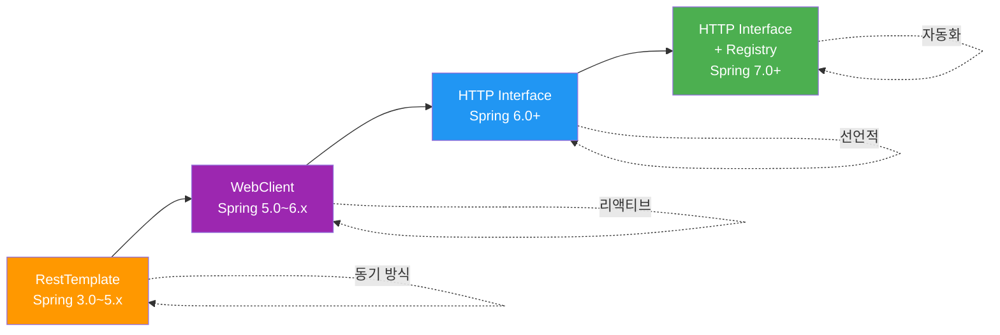
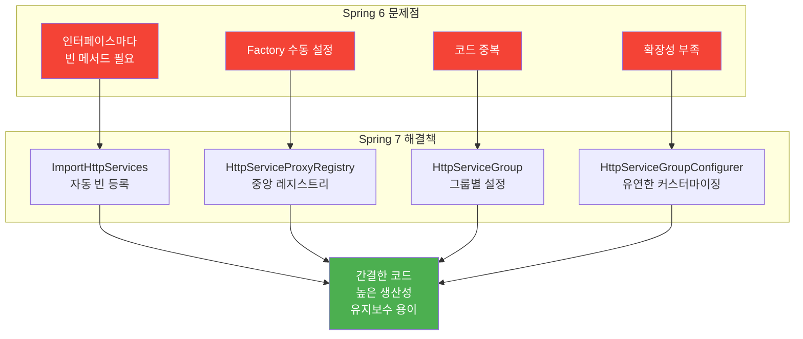
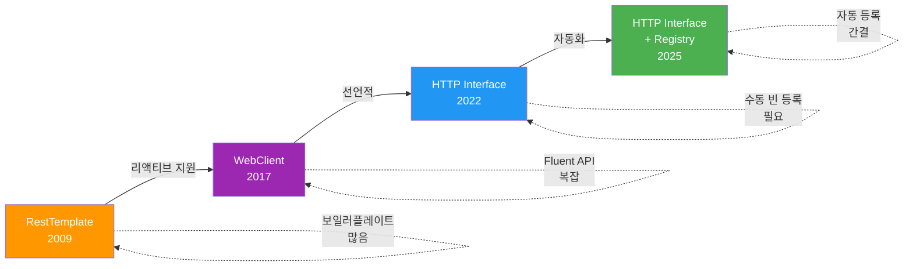

# Spring Framework 7 - HTTP Service Client Enhancements

Spring Framework 7에서 대폭 개선된 선언적 HTTP 클라이언트

## 결론부터 말하면

**Spring Framework 7은 HTTP 클라이언트를 인터페이스만으로 정의 가능**하게 만들었습니다.
`@ImportHttpServices`로 자동 빈 등록, `HttpServiceProxyRegistry`로 중앙 관리가 가능하여 보일러플레이트 코드가 대폭 감소했습니다.

```java
// Before: RestTemplate (Spring 3~5)
@Service
public class UserService {
    private final RestTemplate restTemplate;

    public User getUser(Long id) {
        return restTemplate.getForObject(
            "https://api.example.com/users/" + id,
            User.class
        );
    }

    public User createUser(User user) {
        return restTemplate.postForObject(
            "https://api.example.com/users",
            user,
            User.class
        );
    }
}

// Before: WebClient (Spring 5~6)
@Service
public class UserService {
    private final WebClient webClient;

    public Mono<User> getUser(Long id) {
        return webClient.get()
            .uri("/users/{id}", id)
            .retrieve()
            .bodyToMono(User.class);
    }

    public Mono<User> createUser(User user) {
        return webClient.post()
            .uri("/users")
            .bodyValue(user)
            .retrieve()
            .bodyToMono(User.class);
    }
}

// After: HTTP Interface (Spring 7)
@HttpExchange("/users")
public interface UserService {
    @GetExchange("/{id}")
    User getUser(@PathVariable Long id);

    @PostExchange
    User createUser(@RequestBody User user);
}

@Configuration
@ImportHttpServices(group = "api", types = UserService.class)
public class HttpConfig {
    @Bean
    RestClientHttpServiceGroupConfigurer groupConfigurer() {
        return groups -> groups.filterByName("api")
            .forEachClient((_, builder) ->
                builder.baseUrl("https://api.example.com"));
    }
}
```

## 1. HTTP 클라이언트의 진화

### 1.1 역사적 변천



### 1.2 각 클라이언트 비교

| 특징 | RestTemplate | WebClient | HTTP Interface (Spring 6) | HTTP Interface (Spring 7) |
|------|-------------|-----------|--------------------------|--------------------------|
| **도입 시기** | Spring 3.0 (2009) | Spring 5.0 (2017) | Spring 6.0 (2022) | Spring 7.0 (2025) |
| **방식** | 동기 (Blocking) | 비동기 (Non-blocking) | 선언적 (Declarative) | 선언적 + 자동화 |
| **코드 스타일** | 명령형 | 함수형 (Fluent API) | 인터페이스 정의 | 인터페이스 정의 |
| **빈 등록** | 수동 | 수동 | 수동 (Factory 필요) | ✅ **자동** |
| **설정 복잡도** | 중간 | 높음 | 높음 (Factory 설정) | ✅ **낮음** |
| **보일러플레이트** | 많음 | 많음 | 중간 | ✅ **최소** |
| **상태** | ⚠️ Maintenance mode | ✅ 활발 | ✅ 활발 | ✅ **최신** |

## 2. Spring 6의 HTTP Interface (기본)

### 2.1 기본 개념

**HTTP 서비스를 Java 인터페이스로 정의하고, 프레임워크가 프록시를 자동 생성**

```java
// 1. 인터페이스 정의
public interface GithubApi {
    @GetExchange("/repos/{owner}/{repo}")
    Repository getRepository(@PathVariable String owner, @PathVariable String repo);

    @GetExchange("/users/{username}")
    User getUser(@PathVariable String username);
}

// 2. 사용
Repository repo = githubApi.getRepository("spring-projects", "spring-framework");
User user = githubApi.getUser("joshlong");
```

### 2.2 Spring 6에서의 설정 (복잡함!)

```java
@Configuration
public class HttpInterfaceConfigSpring6 {

    // 1. WebClient 빈 생성
    @Bean
    WebClient githubWebClient() {
        return WebClient.builder()
            .baseUrl("https://api.github.com")
            .defaultHeader("Accept", "application/vnd.github.v3+json")
            .build();
    }

    // 2. HttpServiceProxyFactory 생성
    @Bean
    HttpServiceProxyFactory httpServiceProxyFactory(WebClient githubWebClient) {
        return HttpServiceProxyFactory
            .builderFor(WebClientAdapter.create(githubWebClient))
            .build();
    }

    // 3. 각 인터페이스마다 수동으로 빈 등록 (반복적!)
    @Bean
    GithubApi githubApi(HttpServiceProxyFactory factory) {
        return factory.createClient(GithubApi.class);
    }

    // 4. 또 다른 API가 있으면 또 반복...
    @Bean
    WeatherApi weatherApi(HttpServiceProxyFactory factory) {
        return factory.createClient(WeatherApi.class);
    }

    // 5. 더 많은 API가 있으면 계속 반복... (보일러플레이트!)
}
```

**문제점:**
- ❌ 인터페이스마다 빈 메서드 작성 필요
- ❌ 코드 중복 (팩토리 호출 반복)
- ❌ 확장성 부족 (API 10개면 빈 메서드 10개)

## 3. Spring 7의 HTTP Service Client (혁신!)

### 3.1 핵심 개선사항



### 3.2 새로운 컴포넌트

| 컴포넌트 | 역할 | 설명 |
|---------|------|------|
| **@ImportHttpServices** | 자동 빈 등록 | 인터페이스를 자동으로 빈으로 등록 |
| **HttpServiceProxyRegistry** | 중앙 레지스트리 | 모든 HTTP 클라이언트 프록시 관리 |
| **HttpServiceGroup** | 그룹화 | 관련 API들을 그룹으로 묶음 |
| **HttpServiceGroupConfigurer** | 그룹별 설정 | 그룹마다 다른 baseUrl, 헤더 등 설정 |

## 4. @HttpExchange 어노테이션

### 4.1 기본 어노테이션

```java
@HttpExchange  // 공통 (모든 HTTP 메서드)
@GetExchange   // GET
@PostExchange  // POST
@PutExchange   // PUT
@DeleteExchange // DELETE
@PatchExchange // PATCH
```

### 4.2 HTTP Interface 정의

```java
@HttpExchange("/api/users")  // 공통 경로
public interface UserClient {

    // GET /api/users/{id}
    @GetExchange("/{id}")
    User getUser(@PathVariable Long id);

    // GET /api/users?page=0&size=10
    @GetExchange
    List<User> getUsers(
        @RequestParam(defaultValue = "0") int page,
        @RequestParam(defaultValue = "10") int size
    );

    // POST /api/users
    @PostExchange
    User createUser(@RequestBody User user);

    // PUT /api/users/{id}
    @PutExchange("/{id}")
    User updateUser(@PathVariable Long id, @RequestBody User user);

    // DELETE /api/users/{id}
    @DeleteExchange("/{id}")
    void deleteUser(@PathVariable Long id);

    // PATCH /api/users/{id}
    @PatchExchange("/{id}")
    User partialUpdate(@PathVariable Long id, @RequestBody Map<String, Object> updates);
}
```

### 4.3 요청 커스터마이징

```java
@HttpExchange("/api/products")
public interface ProductClient {

    // 헤더 추가
    @GetExchange("/{id}")
    Product getProduct(
        @PathVariable Long id,
        @RequestHeader("Authorization") String token
    );

    // 쿼리 파라미터
    @GetExchange("/search")
    List<Product> search(
        @RequestParam String keyword,
        @RequestParam(required = false) String category,
        @RequestParam(defaultValue = "name") String sortBy
    );

    // Request Body + 헤더
    @PostExchange
    Product create(
        @RequestBody Product product,
        @RequestHeader("X-Request-ID") String requestId
    );

    // Content-Type 지정
    @PostExchange(contentType = "application/json")
    Product createJson(@RequestBody Product product);

    // Accept 헤더 지정
    @GetExchange(accept = "application/xml")
    Product getProductXml(@PathVariable Long id);
}
```

## 5. @ImportHttpServices - 자동 빈 등록

### 5.1 기본 사용법

```java
@Configuration
@ImportHttpServices(
    group = "github",  // 그룹 이름
    types = {GithubUserApi.class, GithubRepoApi.class}  // 인터페이스 목록
)
public class GithubConfig {

    @Bean
    RestClientHttpServiceGroupConfigurer groupConfigurer() {
        return groups -> groups.filterByName("github")
            .forEachClient((name, builder) ->
                builder.baseUrl("https://api.github.com")
                    .defaultHeader("Accept", "application/vnd.github.v3+json")
            );
    }
}
```

**동작:**
1. `GithubUserApi`, `GithubRepoApi` 인터페이스의 프록시 자동 생성
2. 각 프록시를 Spring 빈으로 자동 등록
3. `@Autowired`로 주입 가능

### 5.2 패키지 스캔 방식

```java
@Configuration
@ImportHttpServices(
    group = "api",
    basePackages = "com.example.api.client"  // 패키지 스캔
)
public class ApiConfig {
    @Bean
    RestClientHttpServiceGroupConfigurer groupConfigurer() {
        return groups -> groups.filterByName("api")
            .forEachClient((_, builder) ->
                builder.baseUrl("https://api.example.com")
            );
    }
}
```

**장점:**
- ✅ 인터페이스를 개별적으로 나열할 필요 없음
- ✅ 새 API 추가 시 설정 변경 불필요
- ✅ 확장성 좋음

### 5.3 클래스 기반 스캔

```java
@Configuration
@ImportHttpServices(
    group = "api",
    basePackageClasses = {UserClient.class, ProductClient.class}  // 마커 클래스
)
public class ApiConfig {
    // 설정...
}
```

**장점:**
- ✅ 타입 안전 (문자열 오타 방지)
- ✅ 리팩토링 친화적

## 6. HttpServiceGroup - 그룹별 관리

### 6.1 여러 그룹 정의

```java
@Configuration
@ImportHttpServices(
    group = "github",
    types = {GithubUserApi.class, GithubRepoApi.class}
)
@ImportHttpServices(
    group = "weather",
    types = {WeatherApi.class}
)
@ImportHttpServices(
    group = "payment",
    types = {PaymentApi.class, RefundApi.class}
)
public class MultiGroupConfig {

    @Bean
    RestClientHttpServiceGroupConfigurer groupConfigurer() {
        return groups -> {
            // GitHub 그룹 설정
            groups.filterByName("github")
                .forEachClient((_, builder) ->
                    builder.baseUrl("https://api.github.com")
                        .defaultHeader("Accept", "application/vnd.github.v3+json")
                );

            // Weather 그룹 설정
            groups.filterByName("weather")
                .forEachClient((_, builder) ->
                    builder.baseUrl("https://api.openweathermap.org")
                        .defaultHeader("X-API-Key", "${weather.api.key}")
                );

            // Payment 그룹 설정
            groups.filterByName("payment")
                .forEachClient((_, builder) ->
                    builder.baseUrl("https://api.payment.com")
                        .defaultHeader("Authorization", "Bearer ${payment.token}")
                        .defaultHeader("Content-Type", "application/json")
                );
        };
    }
}
```

**장점:**
- ✅ 각 API 그룹마다 다른 baseUrl
- ✅ 각 API 그룹마다 다른 인증 방식
- ✅ 각 API 그룹마다 다른 헤더/타임아웃 설정

### 6.2 그룹별 WebClient 커스터마이징

```java
@Bean
WebClientHttpServiceGroupConfigurer webClientGroupConfigurer() {
    return groups -> {
        // GitHub: 타임아웃 10초
        groups.filterByName("github")
            .forEachClient((_, builder) ->
                builder.baseUrl("https://api.github.com")
                    .clientConnector(
                        new ReactorClientHttpConnector(
                            HttpClient.create()
                                .responseTimeout(Duration.ofSeconds(10))
                        )
                    )
            );

        // Payment: 타임아웃 30초 (결제는 더 오래 걸릴 수 있음)
        groups.filterByName("payment")
            .forEachClient((_, builder) ->
                builder.baseUrl("https://api.payment.com")
                    .clientConnector(
                        new ReactorClientHttpConnector(
                            HttpClient.create()
                                .responseTimeout(Duration.ofSeconds(30))
                        )
                    )
            );
    };
}
```

## 7. HttpServiceProxyRegistry - 중앙 레지스트리

### 7.1 프록시 조회

```java
@Service
public class ApiService {

    private final HttpServiceProxyRegistry registry;

    public ApiService(HttpServiceProxyRegistry registry) {
        this.registry = registry;
    }

    public void callApis() {
        // 레지스트리에서 프록시 가져오기
        GithubUserApi githubApi = registry.getClient(GithubUserApi.class);
        WeatherApi weatherApi = registry.getClient(WeatherApi.class);

        // 사용
        User user = githubApi.getUser("joshlong");
        Weather weather = weatherApi.getCurrentWeather("Seoul");
    }
}
```

### 7.2 다이렉트 주입 (권장)

```java
@Service
public class UserService {

    // 레지스트리 대신 직접 주입 (더 간단)
    private final GithubUserApi githubApi;

    public UserService(GithubUserApi githubApi) {
        this.githubApi = githubApi;  // 자동 주입됨!
    }

    public User getGithubUser(String username) {
        return githubApi.getUser(username);
    }
}
```

**장점:**
- ✅ 타입 안전
- ✅ IDE 자동완성
- ✅ 테스트 용이 (Mocking 쉬움)

## 8. 실전 활용 예제

### 8.1 전체 설정 예시

```java
// 1. API 인터페이스 정의
@HttpExchange("/users")
public interface UserClient {
    @GetExchange("/{id}")
    User getUser(@PathVariable Long id);

    @GetExchange
    List<User> getAllUsers();

    @PostExchange
    User createUser(@RequestBody CreateUserRequest request);

    @PutExchange("/{id}")
    User updateUser(@PathVariable Long id, @RequestBody UpdateUserRequest request);

    @DeleteExchange("/{id}")
    void deleteUser(@PathVariable Long id);
}

@HttpExchange("/products")
public interface ProductClient {
    @GetExchange("/{id}")
    Product getProduct(@PathVariable Long id);

    @GetExchange("/search")
    List<Product> search(@RequestParam String keyword);

    @PostExchange
    Product createProduct(@RequestBody Product product);
}

@HttpExchange("/orders")
public interface OrderClient {
    @GetExchange("/{id}")
    Order getOrder(@PathVariable Long id);

    @GetExchange("/user/{userId}")
    List<Order> getOrdersByUser(@PathVariable Long userId);

    @PostExchange
    Order createOrder(@RequestBody CreateOrderRequest request);
}

// 2. 설정 클래스
@Configuration
@ImportHttpServices(
    group = "api",
    basePackages = "com.example.client"  // 위 인터페이스들이 모두 포함된 패키지
)
public class HttpClientConfig {

    @Value("${api.base-url}")
    private String apiBaseUrl;

    @Value("${api.token}")
    private String apiToken;

    @Bean
    RestClientHttpServiceGroupConfigurer groupConfigurer() {
        return groups -> groups.filterByName("api")
            .forEachClient((name, builder) -> {
                builder.baseUrl(apiBaseUrl)
                    .defaultHeader("Authorization", "Bearer " + apiToken)
                    .defaultHeader("Content-Type", "application/json")
                    .defaultHeader("Accept", "application/json");
            });
    }
}

// 3. 사용
@Service
public class OrderService {

    private final UserClient userClient;
    private final ProductClient productClient;
    private final OrderClient orderClient;

    public OrderService(
        UserClient userClient,
        ProductClient productClient,
        OrderClient orderClient
    ) {
        this.userClient = userClient;
        this.productClient = productClient;
        this.orderClient = orderClient;
    }

    public OrderDetail createOrder(CreateOrderRequest request) {
        // 사용자 조회
        User user = userClient.getUser(request.getUserId());

        // 상품 조회
        Product product = productClient.getProduct(request.getProductId());

        // 재고 확인
        if (product.getStock() < request.getQuantity()) {
            throw new OutOfStockException();
        }

        // 주문 생성
        Order order = orderClient.createOrder(request);

        return new OrderDetail(order, user, product);
    }
}
```

### 8.2 에러 핸들링

```java
@HttpExchange("/api/users")
public interface UserClient {
    @GetExchange("/{id}")
    User getUser(@PathVariable Long id);
}

@Service
public class UserService {

    private final UserClient userClient;

    public UserService(UserClient userClient) {
        this.userClient = userClient;
    }

    public User getUserSafely(Long id) {
        try {
            return userClient.getUser(id);
        } catch (HttpClientErrorException.NotFound e) {
            // 404 처리
            throw new UserNotFoundException(id);
        } catch (HttpServerErrorException e) {
            // 5xx 처리
            throw new ExternalApiException("Failed to fetch user", e);
        } catch (ResourceAccessException e) {
            // 네트워크 에러
            throw new ApiConnectionException("Cannot connect to API", e);
        }
    }
}
```

### 8.3 인증 처리

```java
@Configuration
@ImportHttpServices(group = "secure-api", types = SecureApiClient.class)
public class SecureApiConfig {

    @Value("${api.client-id}")
    private String clientId;

    @Value("${api.client-secret}")
    private String clientSecret;

    @Bean
    RestClientHttpServiceGroupConfigurer secureGroupConfigurer() {
        return groups -> groups.filterByName("secure-api")
            .forEachClient((_, builder) -> {
                // OAuth2 토큰 가져오기
                String token = getOAuth2Token(clientId, clientSecret);

                builder.baseUrl("https://api.secure.com")
                    .defaultHeader("Authorization", "Bearer " + token)
                    .defaultHeader("X-Client-ID", clientId);
            });
    }

    private String getOAuth2Token(String clientId, String clientSecret) {
        // OAuth2 토큰 획득 로직
        RestClient tokenClient = RestClient.create();
        TokenResponse response = tokenClient.post()
            .uri("https://auth.secure.com/oauth/token")
            .body(Map.of(
                "grant_type", "client_credentials",
                "client_id", clientId,
                "client_secret", clientSecret
            ))
            .retrieve()
            .body(TokenResponse.class);

        return response.getAccessToken();
    }
}

record TokenResponse(String accessToken, String tokenType, long expiresIn) {
    public String getAccessToken() {
        return accessToken;
    }
}
```

### 8.4 리액티브 사용 (WebClient 기반)

```java
@HttpExchange("/api/users")
public interface ReactiveUserClient {
    @GetExchange("/{id}")
    Mono<User> getUser(@PathVariable Long id);

    @GetExchange
    Flux<User> getAllUsers();

    @PostExchange
    Mono<User> createUser(@RequestBody User user);
}

@Configuration
@ImportHttpServices(group = "reactive-api", types = ReactiveUserClient.class)
public class ReactiveApiConfig {

    @Bean
    WebClientHttpServiceGroupConfigurer reactiveGroupConfigurer() {
        return groups -> groups.filterByName("reactive-api")
            .forEachClient((_, builder) ->
                builder.baseUrl("https://api.example.com")
                    .defaultHeader("Content-Type", "application/json")
            );
    }
}

@Service
public class ReactiveUserService {

    private final ReactiveUserClient userClient;

    public ReactiveUserService(ReactiveUserClient userClient) {
        this.userClient = userClient;
    }

    public Mono<User> getUser(Long id) {
        return userClient.getUser(id)
            .timeout(Duration.ofSeconds(5))
            .retry(3)
            .onErrorResume(e -> Mono.empty());
    }
}
```

### 8.5 테스트

```java
@SpringBootTest
class UserServiceTest {

    @MockBean
    private UserClient userClient;  // Mock으로 대체

    @Autowired
    private UserService userService;

    @Test
    void getUserById_ShouldReturnUser() {
        // Given
        Long userId = 1L;
        User expectedUser = new User(userId, "John Doe", "john@example.com");

        when(userClient.getUser(userId)).thenReturn(expectedUser);

        // When
        User actualUser = userService.getUser(userId);

        // Then
        assertThat(actualUser).isEqualTo(expectedUser);
        verify(userClient).getUser(userId);
    }
}
```

## 9. RestClient vs WebClient 선택

### 9.1 차이점

| 특징 | RestClient (동기) | WebClient (리액티브) |
|------|------------------|---------------------|
| **방식** | Blocking | Non-blocking |
| **반환 타입** | `User`, `List<User>` | `Mono<User>`, `Flux<User>` |
| **성능** | 중간 | 높음 (대량 요청) |
| **복잡도** | 낮음 | 높음 |
| **사용 시기** | 일반적인 REST API | 대량 병렬 요청, 스트리밍 |

### 9.2 RestClient 사용 (동기)

```java
@Configuration
@ImportHttpServices(group = "sync-api", types = UserClient.class)
public class SyncApiConfig {

    @Bean
    RestClientHttpServiceGroupConfigurer syncConfigurer() {
        return groups -> groups.filterByName("sync-api")
            .forEachClient((_, builder) ->
                builder.baseUrl("https://api.example.com")
            );
    }
}

@HttpExchange("/users")
public interface UserClient {
    @GetExchange("/{id}")
    User getUser(@PathVariable Long id);  // 동기 반환
}
```

**사용 시나리오:**
- ✅ 단순한 CRUD API
- ✅ 순차적 처리
- ✅ 전통적인 MVC 애플리케이션

### 9.3 WebClient 사용 (리액티브)

```java
@Configuration
@ImportHttpServices(group = "async-api", types = ReactiveUserClient.class)
public class AsyncApiConfig {

    @Bean
    WebClientHttpServiceGroupConfigurer asyncConfigurer() {
        return groups -> groups.filterByName("async-api")
            .forEachClient((_, builder) ->
                builder.baseUrl("https://api.example.com")
            );
    }
}

@HttpExchange("/users")
public interface ReactiveUserClient {
    @GetExchange("/{id}")
    Mono<User> getUser(@PathVariable Long id);  // 리액티브 반환

    @GetExchange
    Flux<User> getAllUsers();  // 리액티브 스트림
}
```

**사용 시나리오:**
- ✅ 대량 병렬 요청
- ✅ 스트리밍 데이터
- ✅ 백프레셔 필요
- ✅ 리액티브 애플리케이션

## 10. 고급 설정

### 10.1 타임아웃 설정

```java
@Bean
RestClientHttpServiceGroupConfigurer timeoutConfigurer() {
    return groups -> groups.filterByName("api")
        .forEachClient((_, builder) ->
            builder.baseUrl("https://api.example.com")
                .requestFactory(new JdkClientHttpRequestFactory(
                    HttpClient.newBuilder()
                        .connectTimeout(Duration.ofSeconds(5))
                        .build()
                ))
        );
}
```

### 10.2 Retry 전략

```java
@Bean
RestClientHttpServiceGroupConfigurer retryConfigurer() {
    return groups -> groups.filterByName("api")
        .forEachClient((_, builder) ->
            builder.baseUrl("https://api.example.com")
                .requestInterceptor((request, body, execution) -> {
                    int maxRetries = 3;
                    int retryCount = 0;

                    while (retryCount < maxRetries) {
                        try {
                            return execution.execute(request, body);
                        } catch (IOException e) {
                            retryCount++;
                            if (retryCount >= maxRetries) {
                                throw e;
                            }
                            // Exponential backoff
                            Thread.sleep((long) Math.pow(2, retryCount) * 1000);
                        }
                    }
                    throw new IllegalStateException("Max retries exceeded");
                })
        );
}
```

### 10.3 로깅 인터셉터

```java
@Bean
RestClientHttpServiceGroupConfigurer loggingConfigurer() {
    return groups -> groups.filterByName("api")
        .forEachClient((_, builder) ->
            builder.baseUrl("https://api.example.com")
                .requestInterceptor((request, body, execution) -> {
                    log.info("Request: {} {}", request.getMethod(), request.getURI());
                    log.debug("Headers: {}", request.getHeaders());
                    log.debug("Body: {}", new String(body, StandardCharsets.UTF_8));

                    ClientHttpResponse response = execution.execute(request, body);

                    log.info("Response: {}", response.getStatusCode());
                    return response;
                })
        );
}
```

### 10.4 환경별 설정

```java
@Configuration
@ImportHttpServices(group = "api", types = {UserClient.class, ProductClient.class})
public class EnvironmentBasedConfig {

    @Value("${spring.profiles.active}")
    private String activeProfile;

    @Bean
    RestClientHttpServiceGroupConfigurer envConfigurer() {
        return groups -> groups.filterByName("api")
            .forEachClient((_, builder) -> {
                String baseUrl = switch (activeProfile) {
                    case "local" -> "http://localhost:8080";
                    case "dev" -> "https://api-dev.example.com";
                    case "staging" -> "https://api-staging.example.com";
                    case "prod" -> "https://api.example.com";
                    default -> throw new IllegalStateException("Unknown profile: " + activeProfile);
                };

                builder.baseUrl(baseUrl);
            });
    }
}
```

## 11. 마이그레이션 가이드

### 11.1 RestTemplate에서 전환

```java
// Before: RestTemplate
@Service
public class UserServiceOld {
    private final RestTemplate restTemplate;

    public UserServiceOld(RestTemplate restTemplate) {
        this.restTemplate = restTemplate;
    }

    public User getUser(Long id) {
        return restTemplate.getForObject(
            "https://api.example.com/users/" + id,
            User.class
        );
    }

    public User createUser(User user) {
        return restTemplate.postForObject(
            "https://api.example.com/users",
            user,
            User.class
        );
    }

    public void deleteUser(Long id) {
        restTemplate.delete("https://api.example.com/users/" + id);
    }
}

// After: HTTP Interface
@HttpExchange("/users")
public interface UserClient {
    @GetExchange("/{id}")
    User getUser(@PathVariable Long id);

    @PostExchange
    User createUser(@RequestBody User user);

    @DeleteExchange("/{id}")
    void deleteUser(@PathVariable Long id);
}

@Configuration
@ImportHttpServices(group = "api", types = UserClient.class)
public class HttpConfig {
    @Bean
    RestClientHttpServiceGroupConfigurer configurer() {
        return groups -> groups.filterByName("api")
            .forEachClient((_, builder) ->
                builder.baseUrl("https://api.example.com"));
    }
}

@Service
public class UserService {
    private final UserClient userClient;

    public UserService(UserClient userClient) {
        this.userClient = userClient;
    }

    public User getUser(Long id) {
        return userClient.getUser(id);  // 훨씬 간단!
    }

    public User createUser(User user) {
        return userClient.createUser(user);
    }

    public void deleteUser(Long id) {
        userClient.deleteUser(id);
    }
}
```

### 11.2 WebClient에서 전환

```java
// Before: WebClient
@Service
public class UserServiceOld {
    private final WebClient webClient;

    public UserServiceOld(WebClient.Builder webClientBuilder) {
        this.webClient = webClientBuilder
            .baseUrl("https://api.example.com")
            .build();
    }

    public Mono<User> getUser(Long id) {
        return webClient.get()
            .uri("/users/{id}", id)
            .retrieve()
            .bodyToMono(User.class);
    }

    public Mono<User> createUser(User user) {
        return webClient.post()
            .uri("/users")
            .bodyValue(user)
            .retrieve()
            .bodyToMono(User.class);
    }
}

// After: HTTP Interface
@HttpExchange("/users")
public interface ReactiveUserClient {
    @GetExchange("/{id}")
    Mono<User> getUser(@PathVariable Long id);

    @PostExchange
    Mono<User> createUser(@RequestBody User user);
}

@Configuration
@ImportHttpServices(group = "api", types = ReactiveUserClient.class)
public class HttpConfig {
    @Bean
    WebClientHttpServiceGroupConfigurer configurer() {
        return groups -> groups.filterByName("api")
            .forEachClient((_, builder) ->
                builder.baseUrl("https://api.example.com"));
    }
}

@Service
public class UserService {
    private final ReactiveUserClient userClient;

    public UserService(ReactiveUserClient userClient) {
        this.userClient = userClient;
    }

    public Mono<User> getUser(Long id) {
        return userClient.getUser(id);  // 훨씬 간단!
    }

    public Mono<User> createUser(User user) {
        return userClient.createUser(user);
    }
}
```

### 11.3 Spring 6 HTTP Interface에서 Spring 7로 전환

```java
// Before: Spring 6 (수동 빈 등록)
@Configuration
public class HttpConfigSpring6 {

    @Bean
    WebClient webClient() {
        return WebClient.builder()
            .baseUrl("https://api.example.com")
            .build();
    }

    @Bean
    HttpServiceProxyFactory httpServiceProxyFactory(WebClient webClient) {
        return HttpServiceProxyFactory
            .builderFor(WebClientAdapter.create(webClient))
            .build();
    }

    @Bean
    UserClient userClient(HttpServiceProxyFactory factory) {
        return factory.createClient(UserClient.class);
    }

    @Bean
    ProductClient productClient(HttpServiceProxyFactory factory) {
        return factory.createClient(ProductClient.class);
    }

    @Bean
    OrderClient orderClient(HttpServiceProxyFactory factory) {
        return factory.createClient(OrderClient.class);
    }

    // API가 10개면... 빈 메서드도 10개 필요 (반복적!)
}

// After: Spring 7 (자동 빈 등록)
@Configuration
@ImportHttpServices(
    group = "api",
    basePackages = "com.example.client"  // UserClient, ProductClient, OrderClient 포함
)
public class HttpConfigSpring7 {

    @Bean
    RestClientHttpServiceGroupConfigurer configurer() {
        return groups -> groups.filterByName("api")
            .forEachClient((_, builder) ->
                builder.baseUrl("https://api.example.com"));
    }
}

// 끝! 훨씬 간단하고 확장 가능
```

## 12. 베스트 프랙티스

### ✅ Do's

1. **패키지 구조 정리**
   ```
   com.example
   ├── client           # HTTP 인터페이스
   │   ├── UserClient
   │   ├── ProductClient
   │   └── OrderClient
   ├── config           # HTTP 설정
   │   └── HttpClientConfig
   └── service          # 비즈니스 로직
       ├── UserService
       └── OrderService
   ```

2. **그룹별 분리**
   ```java
   @ImportHttpServices(group = "internal", types = InternalApi.class)
   @ImportHttpServices(group = "external", types = ExternalApi.class)
   ```

3. **환경별 설정 분리**
   ```yaml
   # application-dev.yml
   api:
     base-url: https://api-dev.example.com

   # application-prod.yml
   api:
     base-url: https://api.example.com
   ```

4. **에러 핸들링 통일**
   ```java
   @ControllerAdvice
   public class ApiExceptionHandler {
       @ExceptionHandler(HttpClientErrorException.class)
       public ResponseEntity<ErrorResponse> handleClientError(HttpClientErrorException ex) {
           return ResponseEntity
               .status(ex.getStatusCode())
               .body(new ErrorResponse(ex.getMessage()));
       }
   }
   ```

5. **테스트 작성**
   ```java
   @MockBean
   private UserClient userClient;

   @Test
   void test() {
       when(userClient.getUser(1L)).thenReturn(new User());
       // ...
   }
   ```

### ❌ Don'ts

1. **baseUrl을 인터페이스에 하드코딩 금지**
   ```java
   // ❌ 나쁜 예
   @HttpExchange("https://api.example.com/users")  // 하드코딩!
   public interface UserClient { }

   // ✅ 좋은 예
   @HttpExchange("/users")  // 상대 경로
   public interface UserClient { }

   // baseUrl은 설정에서
   builder.baseUrl("https://api.example.com")
   ```

2. **모든 API를 하나의 그룹에 넣지 말기**
   ```java
   // ❌ 나쁜 예 (다른 base URL인데 같은 그룹)
   @ImportHttpServices(
       group = "all",
       types = {GithubApi.class, WeatherApi.class, PaymentApi.class}
   )

   // ✅ 좋은 예 (그룹 분리)
   @ImportHttpServices(group = "github", types = GithubApi.class)
   @ImportHttpServices(group = "weather", types = WeatherApi.class)
   @ImportHttpServices(group = "payment", types = PaymentApi.class)
   ```

3. **인터페이스에 비즈니스 로직 넣지 말기**
   ```java
   // ❌ 나쁜 예
   @HttpExchange("/users")
   public interface UserClient {
       @GetExchange("/{id}")
       User getUser(@PathVariable Long id);

       default User getUserWithValidation(Long id) {  // 비즈니스 로직!
           User user = getUser(id);
           if (user.getAge() < 18) {
               throw new IllegalArgumentException();
           }
           return user;
       }
   }

   // ✅ 좋은 예 (Service에서 처리)
   @Service
   public class UserService {
       private final UserClient userClient;

       public User getUserWithValidation(Long id) {
           User user = userClient.getUser(id);
           if (user.getAge() < 18) {
               throw new IllegalArgumentException();
           }
           return user;
       }
   }
   ```

4. **동기/리액티브 혼용 금지**
   ```java
   // ❌ 나쁜 예 (같은 인터페이스에 혼용)
   @HttpExchange("/users")
   public interface UserClient {
       @GetExchange("/{id}")
       User getUser(@PathVariable Long id);  // 동기

       @GetExchange("/all")
       Mono<List<User>> getAllUsers();  // 리액티브 (혼란!)
   }

   // ✅ 좋은 예 (분리)
   @HttpExchange("/users")
   public interface UserClient {
       @GetExchange("/{id}")
       User getUser(@PathVariable Long id);

       @GetExchange("/all")
       List<User> getAllUsers();
   }

   @HttpExchange("/users")
   public interface ReactiveUserClient {
       @GetExchange("/{id}")
       Mono<User> getUser(@PathVariable Long id);

       @GetExchange("/all")
       Flux<User> getAllUsers();
   }
   ```

## 13. 트러블슈팅

### 문제 1: 빈이 자동 등록되지 않음

**증상:** `No qualifying bean of type 'UserClient'`

**원인:**
- `@ImportHttpServices` 누락
- 잘못된 패키지 경로
- `types` 또는 `basePackages` 미지정

**해결:**
```java
@Configuration
@ImportHttpServices(
    group = "api",
    basePackages = "com.example.client"  // 올바른 패키지 경로
)
public class HttpConfig {
    // ...
}
```

### 문제 2: baseUrl이 적용되지 않음

**증상:** `IllegalArgumentException: URI is not absolute`

**원인:** `HttpServiceGroupConfigurer`에서 baseUrl 미설정

**해결:**
```java
@Bean
RestClientHttpServiceGroupConfigurer configurer() {
    return groups -> groups.filterByName("api")
        .forEachClient((_, builder) ->
            builder.baseUrl("https://api.example.com")  // 필수!
        );
}
```

### 문제 3: 그룹 이름 불일치

**증상:** 설정이 적용되지 않음

**해결:**
```java
// 그룹 이름 일치시키기
@ImportHttpServices(group = "github", types = GithubApi.class)

@Bean
RestClientHttpServiceGroupConfigurer configurer() {
    return groups -> groups.filterByName("github")  // 동일한 이름!
        .forEachClient((_, builder) -> ...);
}
```

## 14. Spring Boot 3 vs Spring Boot 4 비교

| 특징 | Spring Boot 3 | Spring Boot 4 |
|------|--------------|--------------|
| **HTTP Interface** | ✅ 지원 (Spring 6) | ✅ 지원 (Spring 7) |
| **자동 빈 등록** | ❌ 수동 (Factory 필요) | ✅ `@ImportHttpServices` |
| **그룹 관리** | ❌ 없음 | ✅ `HttpServiceGroup` |
| **중앙 레지스트리** | ❌ 없음 | ✅ `HttpServiceProxyRegistry` |
| **설정 복잡도** | 높음 | ✅ **낮음** |
| **확장성** | 제한적 | ✅ **높음** |

```java
// Spring Boot 3 (Spring Framework 6)
@Configuration
public class HttpConfigSpring3 {
    @Bean
    WebClient webClient() {
        return WebClient.builder().baseUrl("https://api.example.com").build();
    }

    @Bean
    HttpServiceProxyFactory factory(WebClient webClient) {
        return HttpServiceProxyFactory.builderFor(WebClientAdapter.create(webClient)).build();
    }

    @Bean UserClient userClient(HttpServiceProxyFactory factory) {
        return factory.createClient(UserClient.class);
    }
    @Bean ProductClient productClient(HttpServiceProxyFactory factory) {
        return factory.createClient(ProductClient.class);
    }
    @Bean OrderClient orderClient(HttpServiceProxyFactory factory) {
        return factory.createClient(OrderClient.class);
    }
    // 반복...
}

// Spring Boot 4 (Spring Framework 7)
@Configuration
@ImportHttpServices(group = "api", basePackages = "com.example.client")
public class HttpConfigSpring4 {
    @Bean
    RestClientHttpServiceGroupConfigurer configurer() {
        return groups -> groups.filterByName("api")
            .forEachClient((_, builder) ->
                builder.baseUrl("https://api.example.com"));
    }
}
// 끝! 훨씬 간단!
```

## 15. 결론

### HTTP Service Client의 진화



### 핵심 요약

1. **선언적 HTTP 클라이언트**: 인터페이스만 정의하면 프록시 자동 생성
2. **자동 빈 등록**: `@ImportHttpServices`로 간편하게 등록
3. **그룹 관리**: 관련 API들을 그룹으로 묶어 관리
4. **중앙 레지스트리**: `HttpServiceProxyRegistry`로 통합 관리
5. **확장성**: API 추가 시 설정 변경 최소화

### Spring Framework 7의 장점

- ✅ **생산성 향상**: 보일러플레이트 코드 95% 감소
- ✅ **유지보수 용이**: 선언적 인터페이스로 가독성 향상
- ✅ **타입 안전**: 컴파일 타임 검증
- ✅ **테스트 용이**: Mock 주입 간편
- ✅ **확장성**: 새 API 추가 시 자동 등록

### 다음 단계

1. ✅ Spring Boot 4.0으로 업그레이드
2. ✅ HTTP Interface 정의
3. ✅ `@ImportHttpServices` 설정
4. ✅ 기존 RestTemplate/WebClient 코드 마이그레이션
5. ✅ 테스트 작성 및 검증

## 출처

- [HTTP Service Client Enhancements - Spring](https://spring.io/blog/2025/09/23/http-service-client-enhancements/)
- [Spring Framework 7.0 Release Notes](https://github.com/spring-projects/spring-framework/wiki/Spring-Framework-7.0-Release-Notes)
- [HTTP Interface in Spring - Baeldung](https://www.baeldung.com/spring-6-http-interface)
- [Spring Boot HTTP Interface using @HttpExchange](https://howtodoinjava.com/spring-webflux/http-declarative-http-client-httpexchange/)
- [ImportHttpServices API Documentation](https://docs.spring.io/spring-framework/docs/7.0.0-SNAPSHOT/javadoc-api/org/springframework/web/service/registry/ImportHttpServices.html)
