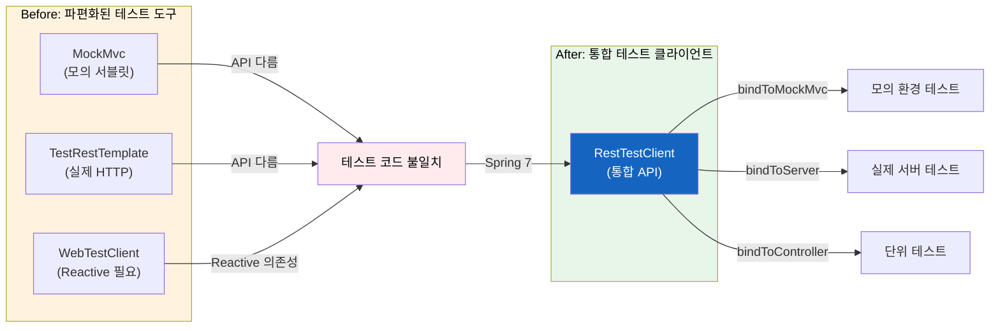
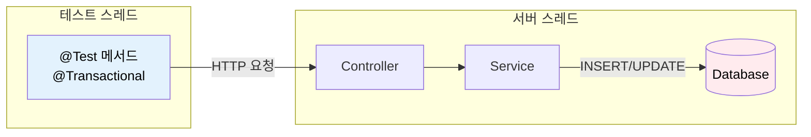

# Spring Framework 7 - RestTestClient

REST API 테스트의 파편화를 해결하는 통합 테스트 클라이언트

## 결론부터 말하면

**Spring Framework 7.0에서 RestTestClient가 새롭게 도입** 되었다. 기존에는 MockMvc, TestRestTemplate, WebTestClient 중 상황에 맞는 도구를 골라야 했고, 각각 API가 달라 테스트 코드가 일관되지 않았다. RestTestClient는 이 문제를 해결하여 **하나의 유창한 API로 모든 테스트 시나리오** 를 커버한다.

```java
// Before: 도구마다 다른 API
// MockMvc
mockMvc.perform(get("/api/users/1"))
    .andExpect(status().isOk())
    .andExpect(jsonPath("$.name").value("John"));

// TestRestTemplate
ResponseEntity<User> response = restTemplate.getForEntity("/api/users/1", User.class);
assertThat(response.getStatusCode()).isEqualTo(HttpStatus.OK);
assertThat(response.getBody().getName()).isEqualTo("John");

// After: RestTestClient (일관된 유창한 API)
restTestClient.get().uri("/api/users/1")
    .exchange()
    .expectStatus().isOk()
    .expectBody()
    .jsonPath("$.name").isEqualTo("John");
```



| 도구 | 역할 | Spring 7 이후 |
|------|------|---------------|
| MockMvc | 모의 서블릿 환경 테스트 | 유지 (RestTestClient가 래핑) |
| TestRestTemplate | 실제 HTTP 테스트 | **Deprecated 예정** |
| WebTestClient | Reactive 환경 테스트 | Reactive 전용으로 유지 |
| **RestTestClient** | **통합 테스트 클라이언트** | **신규 도입 (권장)** |

## 1. 왜 RestTestClient가 필요한가?

### 1.1 기존 테스트 도구의 문제점

Spring Boot에서 REST API를 테스트하려면 상황에 따라 다른 도구를 선택해야 했다. 문제는 각 도구마다 API가 달라서 테스트 코드의 일관성이 떨어진다는 것이다.

**MockMvc: 빠르지만 실제 HTTP가 아니다**

```java
@SpringBootTest
@AutoConfigureMockMvc
class UserControllerTest {

    @Autowired
    private MockMvc mockMvc;

    @Test
    void getUser() throws Exception {
        mockMvc.perform(get("/api/users/1")
                .accept(MediaType.APPLICATION_JSON))
            .andExpect(status().isOk())
            .andExpect(jsonPath("$.id").value(1));
    }
}
```

MockMvc는 실제 서블릿 컨테이너를 시작하지 않아 빠르지만, 실제 HTTP 통신을 하지 않는다. 서블릿 필터, Spring Security, 메시지 컨버터 등이 프로덕션 환경과 다르게 동작할 수 있다.

**TestRestTemplate: 실제 HTTP지만 API가 불편하다**

```java
@SpringBootTest(webEnvironment = SpringBootTest.WebEnvironment.RANDOM_PORT)
class UserControllerTest {

    @Autowired
    private TestRestTemplate restTemplate;

    @Test
    void getUser() {
        ResponseEntity<User> response = restTemplate.getForEntity("/api/users/1", User.class);

        assertThat(response.getStatusCode()).isEqualTo(HttpStatus.OK);
        assertThat(response.getBody()).isNotNull();
        assertThat(response.getBody().getId()).isEqualTo(1L);
    }
}
```

TestRestTemplate은 실제 HTTP 통신을 하지만, API가 유창(fluent)하지 않다. 응답 검증을 위해 별도의 assertion 라이브러리가 필요하고, 체이닝이 불가능하다.

**WebTestClient: 유창하지만 Reactive 의존성이 필요하다**

```java
@SpringBootTest(webEnvironment = SpringBootTest.WebEnvironment.RANDOM_PORT)
class UserControllerTest {

    @Autowired
    private WebTestClient webTestClient;

    @Test
    void getUser() {
        webTestClient.get().uri("/api/users/1")
            .accept(MediaType.APPLICATION_JSON)
            .exchange()
            .expectStatus().isOk()
            .expectBody()
            .jsonPath("$.id").isEqualTo(1);
    }
}
```

WebTestClient는 유창한 API를 제공하지만, `spring-webflux` 의존성이 필요하다. **Servlet 기반 애플리케이션에서 테스트만을 위해 Reactive 스택을 추가해야 하는 것은 부담이다.**

### 1.2 개발자들의 요청

Spring 커뮤니티에서 오랫동안 요청해온 기능이 있었다.

> "WebTestClient의 유창한 API는 좋지만, Reactive 의존성 없이 사용하고 싶다."

이 요청이 Spring Framework 7.0에서 RestTestClient로 구현되었다. RestTestClient는 WebTestClient와 동일한 스타일의 API를 제공하면서, **Reactive 의존성 없이** 동작한다.

### 1.3 비교 요약

| 특성 | MockMvc | TestRestTemplate | WebTestClient | RestTestClient |
|------|---------|------------------|---------------|----------------|
| 실제 HTTP 통신 | ❌ | ✅ | ✅ | ✅ |
| 모의 환경 지원 | ✅ | ❌ | ✅ | ✅ |
| 유창한 API | △ | ❌ | ✅ | ✅ |
| Reactive 의존성 | 불필요 | 불필요 | **필요** | 불필요 |
| Spring 7 권장 | △ | ❌ | △ | **✅** |

## 2. RestTestClient 설정 방법

RestTestClient는 테스트 시나리오에 따라 4가지 방식으로 바인딩할 수 있다.

### 2.1 Controller 직접 바인딩 (단위 테스트)

**가장 빠른 테스트.** Spring Context를 로드하지 않고 컨트롤러만 테스트한다.

```java
class UserControllerUnitTest {

    private RestTestClient client;

    @BeforeEach
    void setUp() {
        UserService mockService = mock(UserService.class);
        when(mockService.findById(1L)).thenReturn(new User(1L, "John"));

        client = RestTestClient.bindToController(
            new UserController(mockService)
        ).build();
    }

    @Test
    void getUser() {
        client.get().uri("/api/users/1")
            .exchange()
            .expectStatus().isOk()
            .expectBody()
            .jsonPath("$.id").isEqualTo(1)
            .jsonPath("$.name").isEqualTo("John");
    }
}
```

**주의:** 이 방식은 Spring Security, 서블릿 필터, 전역 예외 핸들러 등이 적용되지 않는다. 순수한 컨트롤러 로직만 테스트할 때 사용한다.

### 2.2 ApplicationContext 바인딩 (통합 테스트)

**Spring Context를 사용하는 통합 테스트.** 모의 서블릿 환경에서 실행된다.

```java
@SpringJUnitConfig(WebConfig.class)
class UserControllerIntegrationTest {

    private RestTestClient client;

    @BeforeEach
    void setUp(ApplicationContext context) {
        client = RestTestClient.bindToApplicationContext(context).build();
    }

    @Test
    void getUser() {
        client.get().uri("/api/users/1")
            .exchange()
            .expectStatus().isOk()
            .expectBody(User.class)
            .consumeWith(result -> {
                User user = result.getResponseBody();
                assertThat(user.getName()).isEqualTo("John");
            });
    }
}
```

### 2.3 MockMvc 바인딩 (Spring Boot)

**Spring Boot의 `@AutoConfigureMockMvc`와 함께 사용.** MockMvc의 기능을 RestTestClient의 유창한 API로 래핑한다.

```java
@SpringBootTest
@AutoConfigureMockMvc
class UserControllerTest {

    private RestTestClient client;

    @BeforeEach
    void setUp(MockMvc mockMvc) {
        client = RestTestClient.bindTo(mockMvc).build();
    }

    @Test
    void getUser() {
        client.get().uri("/api/users/1")
            .exchange()
            .expectStatus().isOk()
            .expectBody()
            .jsonPath("$.id").isEqualTo(1);
    }
}
```

### 2.4 실제 서버 바인딩 (E2E 테스트)

**실제 HTTP 통신을 하는 엔드투엔드 테스트.** 전체 네트워킹 스택과 메시지 변환이 테스트된다.

```java
@SpringBootTest(webEnvironment = SpringBootTest.WebEnvironment.RANDOM_PORT)
class UserControllerE2ETest {

    @LocalServerPort
    private int port;

    private RestTestClient client;

    @BeforeEach
    void setUp() {
        client = RestTestClient.bindToServer()
            .baseUrl("http://localhost:" + port)
            .build();
    }

    @Test
    void getUser() {
        client.get().uri("/api/users/1")
            .exchange()
            .expectStatus().isOk()
            .expectBody()
            .jsonPath("$.id").isEqualTo(1);
    }
}
```

### 2.5 바인딩 방식 선택 가이드

```mermaid
flowchart TD
    Start[테스트 시나리오?]

    Start --> Q1{Spring Context<br/>필요한가?}

    Q1 -->|No| BindController["bindToController()<br/>순수 단위 테스트"]
    Q1 -->|Yes| Q2{실제 HTTP<br/>필요한가?}

    Q2 -->|No| Q3{Spring Boot<br/>사용?}
    Q2 -->|Yes| BindServer["bindToServer()<br/>E2E 테스트"]

    Q3 -->|Yes| BindMockMvc["bindTo(mockMvc)<br/>Spring Boot MockMvc"]
    Q3 -->|No| BindAppContext["bindToApplicationContext()<br/>Spring Context 통합"]

    BindController --> Fast["⚡ 가장 빠름<br/>필터/보안 미적용"]
    BindMockMvc --> Medium["⚡ 빠름<br/>필터/보안 적용"]
    BindAppContext --> Medium
    BindServer --> Slow["🐢 상대적으로 느림<br/>완전한 HTTP 테스트"]

    style BindController fill:#E3F2FD,color:#000
    style BindMockMvc fill:#E8F5E9,color:#000
    style BindAppContext fill:#E8F5E9,color:#000
    style BindServer fill:#FFF3E0,color:#000
```



| 바인딩 방식 | 속도 | Spring Context | 실제 HTTP | 필터/보안 | 사용 시점 |
|-------------|------|----------------|-----------|-----------|-----------|
| `bindToController()` | ⚡⚡⚡ | ❌ | ❌ | ❌ | 순수 단위 테스트 |
| `bindToApplicationContext()` | ⚡⚡ | ✅ | ❌ | ✅ | 일반 Spring Framework 테스트 |
| `bindTo(mockMvc)` | ⚡⚡ | ✅ | ❌ | ✅ | Spring Boot `@AutoConfigureMockMvc` 환경 |
| `bindToServer()` | ⚡ | ✅ | ✅ | ✅ | E2E 테스트 |

> **`bindToApplicationContext()` vs `bindTo(mockMvc)` 선택 기준**
> - `bindTo(mockMvc)`: Spring Boot의 `@AutoConfigureMockMvc`로 자동 설정된 MockMvc를 재사용할 때 사용 (권장)
> - `bindToApplicationContext()`: Spring Boot 없이 일반 Spring Framework 테스트나 커스텀 설정이 필요할 때 사용

## 3. Spring Boot 4에서의 자동 설정

Spring Boot 4.0에서는 `@AutoConfigureRestTestClient` 어노테이션으로 RestTestClient를 자동 주입할 수 있다.

### 3.1 MockMvc 환경 (기본)

```java
@SpringBootTest
@AutoConfigureRestTestClient
class UserControllerTest {

    @Autowired
    private RestTestClient restTestClient;

    @Test
    void getUser() {
        restTestClient.get().uri("/api/users/1")
            .exchange()
            .expectStatus().isOk()
            .expectBody()
            .jsonPath("$.name").isEqualTo("John");
    }
}
```

`@SpringBootTest`와 함께 사용하면 MockMvc 기반으로 동작한다.

### 3.2 실제 서버 환경

```java
@SpringBootTest(webEnvironment = SpringBootTest.WebEnvironment.RANDOM_PORT)
@AutoConfigureRestTestClient
class UserControllerE2ETest {

    @Autowired
    private RestTestClient restTestClient;

    @Test
    void getUser() {
        restTestClient.get().uri("/api/users/1")
            .exchange()
            .expectStatus().isOk();
    }
}
```

`webEnvironment = RANDOM_PORT` 또는 `DEFINED_PORT`와 함께 사용하면 실제 서버에 HTTP 요청을 보낸다.

### 3.3 TestRestTemplate에서 마이그레이션

TestRestTemplate은 Spring Boot 4에서 deprecated 처리될 예정이다. 기존 코드를 RestTestClient로 마이그레이션하려면:

```java
// Before: TestRestTemplate
@SpringBootTest(webEnvironment = SpringBootTest.WebEnvironment.RANDOM_PORT)
class UserControllerTest {

    @Autowired
    private TestRestTemplate restTemplate;

    @Test
    void getUser() {
        ResponseEntity<User> response = restTemplate.getForEntity(
            "/api/users/1", User.class);

        assertThat(response.getStatusCode()).isEqualTo(HttpStatus.OK);
        assertThat(response.getBody().getName()).isEqualTo("John");
    }
}

// After: RestTestClient
@SpringBootTest(webEnvironment = SpringBootTest.WebEnvironment.RANDOM_PORT)
@AutoConfigureRestTestClient
class UserControllerTest {

    @Autowired
    private RestTestClient restTestClient;

    @Test
    void getUser() {
        restTestClient.get().uri("/api/users/1")
            .exchange()
            .expectStatus().isOk()
            .expectBody()
            .jsonPath("$.name").isEqualTo("John");
    }
}
```

## 4. 응답 검증 방법

RestTestClient는 두 가지 검증 방식을 제공한다.

### 4.1 빌트인 Assertions (체이닝)

```java
client.get().uri("/api/users/1")
    .accept(MediaType.APPLICATION_JSON)
    .exchange()
    // 상태 코드 검증
    .expectStatus().isOk()
    // 헤더 검증
    .expectHeader().contentType(MediaType.APPLICATION_JSON)
    // 바디 검증
    .expectBody()
    .jsonPath("$.id").isEqualTo(1)
    .jsonPath("$.name").isEqualTo("John")
    .jsonPath("$.email").exists();
```

> **참고: JSON 처리 방식**
>
> `RestTestClient`는 내부적으로 Spring의 `HttpMessageConverter`를 사용하여 요청/응답 본문을 처리한다. Spring Boot 환경에서는 기본적으로 `Jackson2HttpMessageConverter`가 등록되어 있어 추가 설정 없이 JSON 직렬화/역직렬화가 동작한다. `.jsonPath()`를 이용한 검증에는 Jayway JsonPath 라이브러리가 사용된다.

### 4.2 Soft Assertions (모든 검증을 한 번에)

일반적인 assertion은 첫 번째 실패에서 멈춘다. `expectAll()`을 사용하면 모든 검증을 수행하고 결과를 한 번에 보여준다.

```java
client.get().uri("/api/users/1")
    .exchange()
    .expectAll(
        spec -> spec.expectStatus().isOk(),
        spec -> spec.expectHeader().contentType(MediaType.APPLICATION_JSON),
        spec -> spec.expectBody().jsonPath("$.id").isEqualTo(1),
        spec -> spec.expectBody().jsonPath("$.name").isEqualTo("John")
    );
```

### 4.3 객체로 디코딩

응답을 Java 객체로 변환하여 검증할 수 있다.

```java
// 단일 객체
client.get().uri("/api/users/1")
    .exchange()
    .expectStatus().isOk()
    .expectBody(User.class)
    .consumeWith(result -> {
        User user = result.getResponseBody();
        assertThat(user.getName()).isEqualTo("John");
        assertThat(user.getEmail()).contains("@");
    });

// 결과 반환
EntityExchangeResult<User> result = client.get().uri("/api/users/1")
    .exchange()
    .expectStatus().isOk()
    .expectBody(User.class)
    .returnResult();

User user = result.getResponseBody();
```

### 4.4 컬렉션 검증

```java
// List로 디코딩
client.get().uri("/api/users")
    .exchange()
    .expectStatus().isOk()
    .expectBodyList(User.class)
    .hasSize(3)
    .contains(new User(1L, "John"));
```

### 4.5 JSON 전체 검증

```java
// 전체 JSON 비교
client.get().uri("/api/users/1")
    .exchange()
    .expectBody()
    .json("""
        {
            "id": 1,
            "name": "John",
            "email": "john@example.com"
        }
        """);

// 파일에서 읽어서 비교 (ClassPathResource 권장)
String expectedJson = new ClassPathResource("expected-user.json")
    .getContentAsString(StandardCharsets.UTF_8);

client.get().uri("/api/users/1")
    .exchange()
    .expectBody()
    .json(expectedJson);
```

파일에서 예상 JSON을 읽어와 비교하는 방식은, 특히 복잡하고 큰 JSON 응답을 검증할 때 테스트 코드와 응답 데이터를 분리하여 가독성을 높이는 좋은 패턴이다. `src/test/resources`에 JSON 파일을 위치시키고 `ClassPathResource`로 읽으면 실행 위치에 관계없이 안정적으로 동작한다.

> **참고:** `.json()` 메서드는 단순 문자열 비교가 아니라 JSON 구조를 파싱하여 **의미적 비교(semantic comparison)** 를 수행한다. 필드 순서나 공백 차이에 영향받지 않으므로 더 안정적인 테스트를 작성할 수 있다.

### 4.6 빈 응답 검증

```java
client.delete().uri("/api/users/1")
    .exchange()
    .expectStatus().isNoContent()
    .expectBody().isEmpty();
```

## 5. AssertJ 통합

RestTestClient는 AssertJ 스타일의 검증도 지원한다. `RestTestClientResponse` 래퍼를 통해 AssertJ의 `assertThat()` 문법을 사용할 수 있다.

```java
import static org.assertj.core.api.Assertions.assertThat;
import org.springframework.test.web.client.RestTestClientResponse;

@Test
void getUser() {
    ResponseSpec spec = client.get().uri("/api/users/1").exchange();
    RestTestClientResponse response = RestTestClientResponse.from(spec);

    // AssertJ 스타일 검증
    assertThat(response).hasStatusOk();
    assertThat(response).hasContentTypeCompatibleWith(MediaType.APPLICATION_JSON);
    assertThat(response).bodyJson()
        .extractingPath("$.name")
        .isEqualTo("John");
}
```

> **참고:** `RestTestClientResponse`는 Spring Framework에서 제공하는 래퍼 클래스로, `ResponseSpec`을 AssertJ 친화적인 형태로 변환한다. 빌트인 assertions과 AssertJ 중 팀의 선호에 따라 선택하면 된다.

## 6. 실전 예제

### 6.1 CRUD API 테스트

```java
@SpringBootTest(webEnvironment = SpringBootTest.WebEnvironment.RANDOM_PORT)
@AutoConfigureRestTestClient
class UserApiTest {

    @Autowired
    private RestTestClient client;

    @Test
    void createUser() {
        CreateUserRequest request = new CreateUserRequest("John", "john@example.com");

        client.post().uri("/api/users")
            .contentType(MediaType.APPLICATION_JSON)
            .bodyValue(request)
            .exchange()
            .expectStatus().isCreated()
            .expectHeader().exists("Location")
            .expectBody()
            .jsonPath("$.id").isNotEmpty()
            .jsonPath("$.name").isEqualTo("John");
    }

    @Test
    void getUser() {
        client.get().uri("/api/users/1")
            .exchange()
            .expectStatus().isOk()
            .expectBody(User.class)
            .consumeWith(result -> {
                assertThat(result.getResponseBody().getName()).isEqualTo("John");
            });
    }

    @Test
    void updateUser() {
        UpdateUserRequest request = new UpdateUserRequest("John Doe");

        client.put().uri("/api/users/1")
            .contentType(MediaType.APPLICATION_JSON)
            .bodyValue(request)
            .exchange()
            .expectStatus().isOk()
            .expectBody()
            .jsonPath("$.name").isEqualTo("John Doe");
    }

    @Test
    void deleteUser() {
        client.delete().uri("/api/users/1")
            .exchange()
            .expectStatus().isNoContent();

        // 삭제 확인
        client.get().uri("/api/users/1")
            .exchange()
            .expectStatus().isNotFound();
    }

    @Test
    void getUserNotFound() {
        client.get().uri("/api/users/999")
            .exchange()
            .expectStatus().isNotFound()
            .expectBody()
            .jsonPath("$.error").isEqualTo("User not found")
            .jsonPath("$.status").isEqualTo(404);
    }
}
```

### 6.2 인증이 필요한 API 테스트

```java
@SpringBootTest(webEnvironment = SpringBootTest.WebEnvironment.RANDOM_PORT)
@AutoConfigureRestTestClient
class SecuredApiTest {

    @Autowired
    private RestTestClient client;

    @Test
    void accessWithoutToken_shouldReturn401() {
        client.get().uri("/api/admin/users")
            .exchange()
            .expectStatus().isUnauthorized();
    }

    @Test
    void accessWithValidToken_shouldReturnData() {
        String token = obtainAccessToken("admin", "password");

        client.get().uri("/api/admin/users")
            .header("Authorization", "Bearer " + token)
            .exchange()
            .expectStatus().isOk()
            .expectBodyList(User.class)
            .hasSize(10);
    }

    @Test
    void accessWithInsufficientRole_shouldReturn403() {
        String token = obtainAccessToken("user", "password");

        client.get().uri("/api/admin/users")
            .header("Authorization", "Bearer " + token)
            .exchange()
            .expectStatus().isForbidden();
    }
}
```

### 6.3 파일 업로드 테스트

```java
@Test
void uploadFile() {
    MultiValueMap<String, Object> body = new LinkedMultiValueMap<>();
    body.add("file", new ClassPathResource("test-file.pdf"));
    body.add("description", "Test document");

    client.post().uri("/api/files")
        .contentType(MediaType.MULTIPART_FORM_DATA)
        .bodyValue(body)
        .exchange()
        .expectStatus().isCreated()
        .expectBody()
        .jsonPath("$.fileName").isEqualTo("test-file.pdf")
        .jsonPath("$.size").isNotEmpty();
}
```

## 7. 주의사항

### 7.1 바인딩 방식에 따른 테스트 범위

`bindToController()`는 컨트롤러만 테스트한다. 다음 항목들이 **적용되지 않는다:**

- 서블릿 필터
- Spring Security
- 전역 예외 핸들러 (`@ControllerAdvice`)
- 메시지 컨버터 (전역 설정)
- 인터셉터

**실제 동작을 테스트하려면 `bindToApplicationContext()` 또는 `bindToServer()`를 사용하라.**

```java
// ❌ 이 테스트는 Spring Security가 적용되지 않음
RestTestClient client = RestTestClient.bindToController(
    new UserController(userService)
).build();

// ✅ Spring Security 포함 테스트
@SpringBootTest
@AutoConfigureMockMvc
class UserControllerTest {
    @Autowired
    private MockMvc mockMvc;

    private RestTestClient client;

    @BeforeEach
    void setUp() {
        client = RestTestClient.bindTo(mockMvc).build();
    }
}
```

### 7.2 스레드 안전성

RestTestClient 인스턴스는 **불변(immutable)** 이다. 한 번 build()하면 변경할 수 없으므로 병렬 테스트에서 안전하게 공유할 수 있다.

```java
// ✅ 테스트 클래스 레벨에서 공유 가능
@SpringBootTest
@AutoConfigureRestTestClient
class ParallelTest {

    @Autowired
    private RestTestClient client;  // 스레드 안전

    @Test
    @Execution(ExecutionMode.CONCURRENT)
    void test1() {
        client.get().uri("/api/users/1").exchange().expectStatus().isOk();
    }

    @Test
    @Execution(ExecutionMode.CONCURRENT)
    void test2() {
        client.get().uri("/api/users/2").exchange().expectStatus().isOk();
    }
}
```

### 7.3 클라이언트 커스터마이징

`baseUrl`, 기본 헤더 등을 설정할 수 있다.

```java
RestTestClient client = RestTestClient.bindToServer()
    .baseUrl("http://localhost:8080")
    .defaultHeader("Accept", MediaType.APPLICATION_JSON_VALUE)
    .defaultHeader("X-API-Version", "2")
    .build();
```

### 7.4 @Transactional 롤백이 안 되는 경우

**`bindToServer()` 모드에서는 테스트의 `@Transactional`이 DB 변경을 롤백하지 않는다.**



| 바인딩 방식 | 스레드 모델 | @Transactional 롤백 |
|-------------|-------------|---------------------|
| `bindTo(mockMvc)` | 같은 스레드 | ✅ 동작 |
| `bindToApplicationContext()` | 같은 스레드 | ✅ 동작 |
| `bindToServer()` | **다른 스레드** | ❌ 롤백 안 됨 |

`bindToServer()` E2E 테스트에서 DB 정리가 필요하면 `@Sql` 어노테이션이나 별도의 정리 로직을 사용해야 한다.

### 7.5 RestTestClient vs WebTestClient 내부 동작 차이

`bindToServer()`로 실제 서버에 바인딩할 때, 두 클라이언트의 내부 동작이 다르다.

| 클라이언트 | I/O 모델 | HTTP 클라이언트 | 스레드 모델 |
|------------|----------|-----------------|-------------|
| RestTestClient | **블로킹** | JdkClientHttpRequestFactory 등 | 요청당 스레드 대기 |
| WebTestClient | **논블로킹** | Reactor Netty | 이벤트 루프 기반 |

**대부분의 테스트에서는 이 차이가 중요하지 않다.** 하지만 다음 상황에서는 고려해야 한다:

- **대규모 E2E 테스트**: 수백 개의 동시 요청을 테스트할 때 WebTestClient가 리소스 효율적
- **비동기 시나리오 테스트**: SSE, WebSocket 등 비동기 스트리밍을 테스트할 때 WebTestClient가 적합
- **일반적인 REST API 테스트**: RestTestClient로 충분 (Reactive 의존성 불필요)

## 8. TestRestTemplate에서 마이그레이션

Spring Boot 4.0에서 TestRestTemplate은 deprecated 처리될 예정이다. RestTestClient로의 마이그레이션을 권장한다.

| 버전 | TestRestTemplate 상태 | 권장 대안 |
|------|----------------------|-----------|
| Spring Boot 3.x | 사용 가능 | RestTestClient (선택적) |
| Spring Boot 4.0 | **Deprecated** | RestTestClient |
| Spring Boot 5.0 (예정) | 제거 예정 | RestTestClient |

### 마이그레이션이 간단한 이유

TestRestTemplate과 RestTestClient 모두 실제 HTTP 통신을 수행하므로, 테스트의 본질은 동일하다. API 스타일만 변경하면 된다.

```java
// Before: TestRestTemplate
ResponseEntity<User> response = restTemplate.getForEntity("/api/users/1", User.class);
assertThat(response.getStatusCode()).isEqualTo(HttpStatus.OK);
assertThat(response.getBody().getName()).isEqualTo("John");

// After: RestTestClient (유창한 API)
restTestClient.get().uri("/api/users/1")
    .exchange()
    .expectStatus().isOk()
    .expectBody()
    .jsonPath("$.name").isEqualTo("John");
```

> **참고: RestClient vs RestTestClient**
>
> 이름이 비슷하지만 역할이 다르다.
> - **RestClient**: 프로덕션 코드에서 외부 API를 호출 (`RestTemplate` 대체)
> - **RestTestClient**: 테스트 코드에서 자신의 API를 테스트 (`TestRestTemplate` 대체)
>
> 별개의 마이그레이션 경로이므로 혼동하지 않도록 주의하자.

**지금부터 새 프로젝트에서는 RestTestClient를 사용하고, 기존 프로젝트는 점진적으로 마이그레이션하는 것이 좋다.**

## 9. 정리

### RestTestClient를 사용해야 하는 이유

1. **통합된 API**: MockMvc, 라이브 서버, 컨트롤러 직접 테스트 모두 동일한 API
2. **유창한 문법**: 체이닝으로 가독성 높은 테스트 코드
3. **Reactive 의존성 불필요**: WebFlux 없이 WebTestClient 스타일 API 사용
4. **미래 대비**: TestRestTemplate deprecated 예정, RestTestClient가 표준

### 마이그레이션 체크리스트

- [ ] Spring Boot 4.0 / Spring Framework 7.0 업그레이드
- [ ] `@AutoConfigureRestTestClient` 어노테이션 추가
- [ ] TestRestTemplate → RestTestClient 마이그레이션
- [ ] MockMvc 테스트에서 `RestTestClient.bindTo(mockMvc)` 활용 검토

---

## 출처

- [RestTestClient :: Spring Framework](https://docs.spring.io/spring-framework/reference/testing/resttestclient.html) - 공식 문서
- [Spring Framework 7.0 Release Notes](https://github.com/spring-projects/spring-framework/wiki/Spring-Framework-7.0-Release-Notes)
- [Spring Boot 4.0 Release Notes](https://github.com/spring-projects/spring-boot/wiki/Spring-Boot-4.0-Release-Notes)
- [The state of HTTP clients in Spring](https://spring.io/blog/2025/09/30/the-state-of-http-clients-in-spring/)
- [Testing Spring REST APIs with RestTestClient: A Complete Guide](https://www.danvega.dev/blog/spring-framework-7-rest-test-client)
- [What's New for Testing in Spring Boot 4 and Spring Framework 7](https://rieckpil.de/whats-new-for-testing-in-spring-boot-4-0-and-spring-framework-7/)
- [Consider deprecating TestRestTemplate in favor of RestTestClient](https://github.com/spring-projects/spring-boot/issues/46632)
