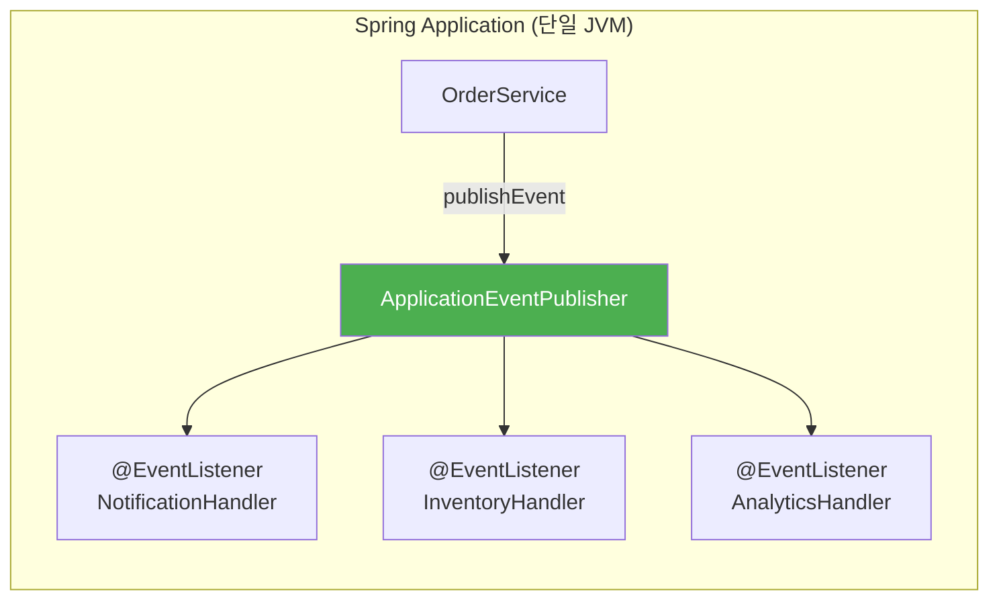
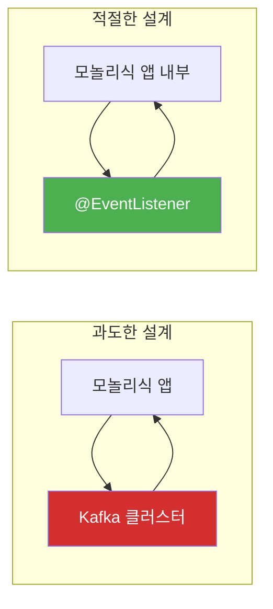
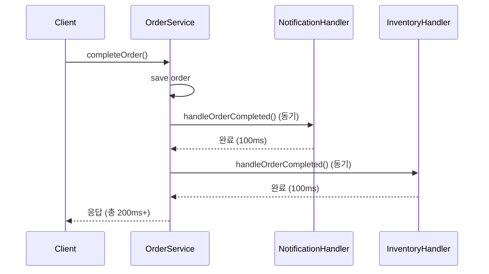
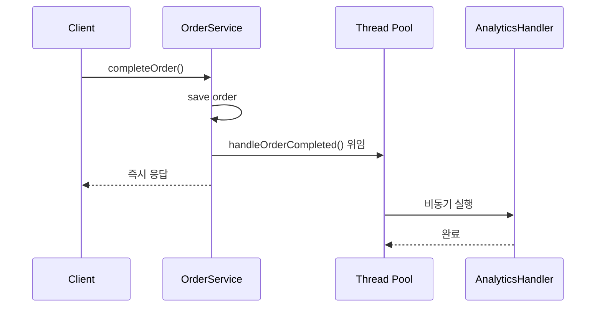
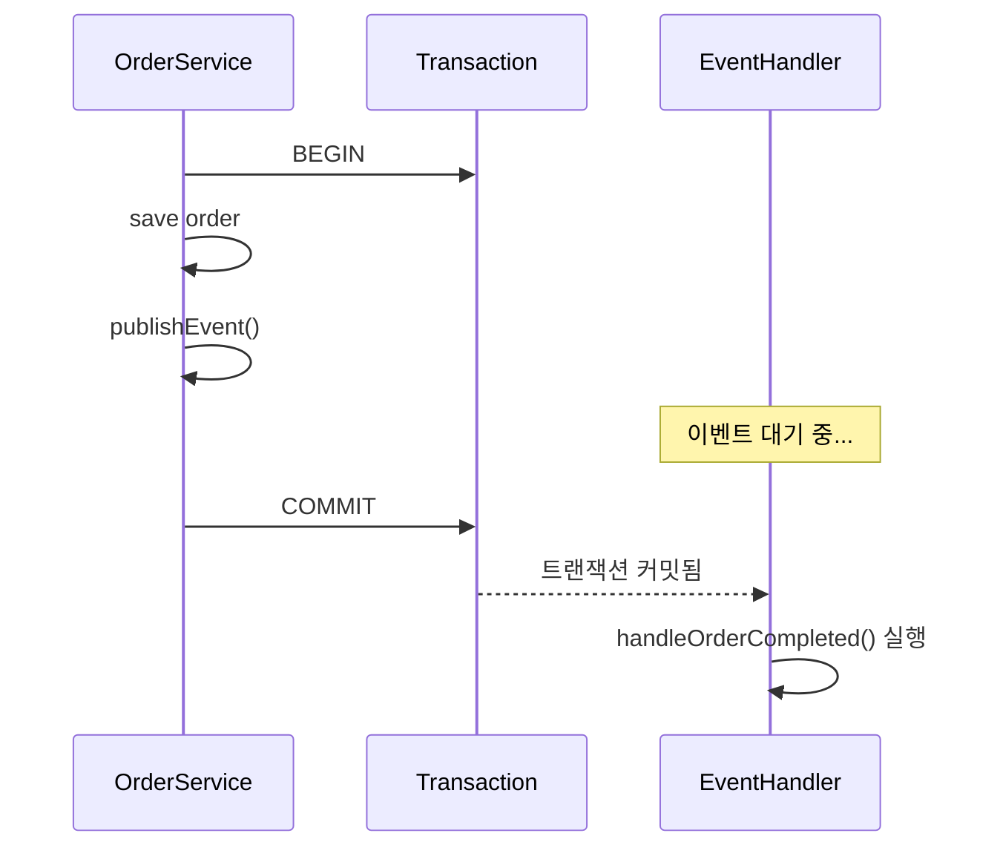
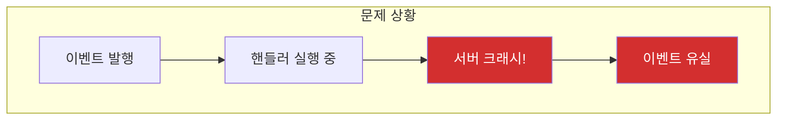
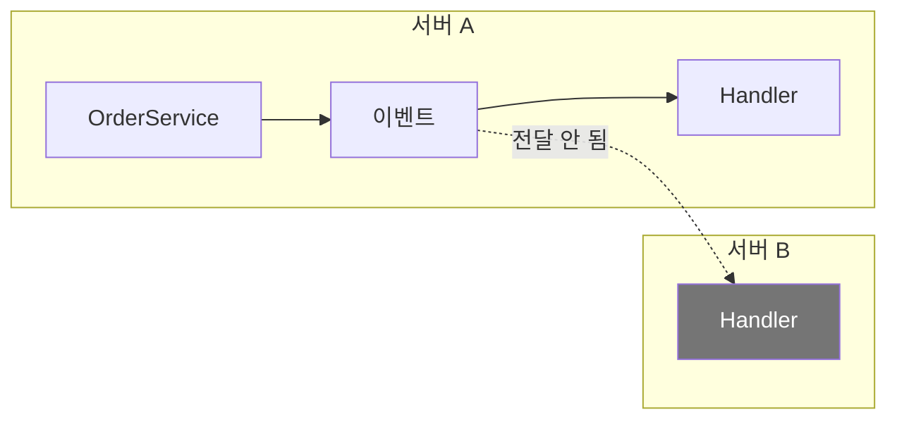

# Spring의 @EventListener

Kafka도 없고, RabbitMQ도 없다. 그런데 이벤트 기반 프로그래밍을 하고 싶다면? Spring만으로 충분하다.

## 결론부터 말하면

**`@EventListener`는 Spring 애플리케이션 내부에서 Pub/Sub 패턴을 구현하는 가장 간단한 방법이다.** 별도의 메시지 브로커 없이, 같은 JVM 안에서 모듈 간 느슨한 결합을 만들 수 있다.



| 특징 | 설명 |
|------|------|
| **브로커** | ApplicationContext (JVM 메모리) |
| **범위** | 단일 애플리케이션 내 |
| **성능** | 매우 빠름 (메서드 호출 수준) |
| **메시지 보존** | 없음 (앱 종료 시 유실) |
| **설정** | 거의 없음 (어노테이션만 붙이면 끝) |

**핵심:** 외부 인프라 없이 이벤트 기반 아키텍처를 시작할 수 있다. 단, 장애 복구나 분산 환경에서는 한계가 명확하다.

## 1. 왜 @EventListener가 필요한가?

### 1.1 Kafka 도입하기엔 너무 이르다

이벤트 기반 아키텍처의 장점은 알겠다. 그런데 지금 상황을 보자.

- 서버 1대로 운영 중인 모놀리식 애플리케이션
- 아직 마이크로서비스 전환 계획 없음
- Kafka/RabbitMQ 운영 경험도 없고, 인프라 비용도 부담

이런 상황에서 Kafka를 도입한다고? **과도한 엔지니어링**이다.



### 1.2 그렇다고 직접 호출을 계속할 순 없다

[Pub/Sub 패턴 문서](../computer-science/Pub-Sub-패턴.md)에서 봤듯이, 직접 호출은 결합도 문제를 일으킨다.

```java
// 이렇게 하면 OrderService가 모든 후처리 서비스를 알아야 한다
public class OrderService {
    private NotificationService notificationService;
    private InventoryService inventoryService;
    private AnalyticsService analyticsService;
    // 새 서비스 추가될 때마다 여기 수정...
}
```

**@EventListener는 이 딜레마를 해결한다.** Kafka 없이도 이벤트 기반으로 모듈을 분리할 수 있다.

## 2. 기본 사용법

### 2.1 이벤트 정의

```java
// 이벤트는 그냥 POJO다. 특별한 인터페이스 구현 불필요
public class OrderCompletedEvent {
    private final Long orderId;
    private final Long customerId;
    private final BigDecimal totalAmount;
    private final LocalDateTime completedAt;

    public OrderCompletedEvent(Long orderId, Long customerId, BigDecimal totalAmount) {
        this.orderId = orderId;
        this.customerId = customerId;
        this.totalAmount = totalAmount;
        this.completedAt = LocalDateTime.now();
    }

    // getters...
}
```

> **Spring 4.2 이전**에는 `ApplicationEvent`를 상속해야 했다. 지금은 아무 객체나 이벤트로 사용할 수 있다.

### 2.2 이벤트 발행

```java
@Service
@RequiredArgsConstructor
public class OrderService {
    private final ApplicationEventPublisher eventPublisher;

    @Transactional
    public void completeOrder(Order order) {
        // 핵심 비즈니스 로직
        order.complete();
        orderRepository.save(order);

        // 이벤트 발행 - "주문 완료됐어!"라고 외치기만 함
        eventPublisher.publishEvent(
            new OrderCompletedEvent(order.getId(), order.getCustomerId(), order.getTotalAmount())
        );
    }
}
```

`OrderService`는 이제 누가 이 이벤트를 듣는지 모른다. 알 필요도 없다.

### 2.3 이벤트 구독

```java
@Component
@Slf4j
public class NotificationEventHandler {

    @EventListener
    public void handleOrderCompleted(OrderCompletedEvent event) {
        log.info("알림 전송: 주문 {} 완료", event.getOrderId());
        // 푸시 알림 전송 로직
    }
}

@Component
@Slf4j
public class InventoryEventHandler {

    @EventListener
    public void handleOrderCompleted(OrderCompletedEvent event) {
        log.info("재고 차감: 주문 {}", event.getOrderId());
        // 재고 차감 로직
    }
}

@Component
@Slf4j
public class AnalyticsEventHandler {

    @EventListener
    public void handleOrderCompleted(OrderCompletedEvent event) {
        log.info("통계 기록: 주문 {} - {}원", event.getOrderId(), event.getTotalAmount());
        // 통계 집계 로직
    }
}
```

새로운 핸들러를 추가해도 `OrderService`는 수정할 필요가 없다. **이게 느슨한 결합의 힘이다.**

## 3. 동기 vs 비동기

### 3.1 기본은 동기 실행

`@EventListener`는 기본적으로 **동기**로 실행된다. 발행자와 같은 스레드에서 순차적으로 처리된다.



**문제:**
- 핸들러가 느리면 전체 응답 시간이 느려진다
- 핸들러에서 예외가 발생하면 발행자까지 영향을 받는다
- **여러 리스너 중 하나에서 예외가 발생하면 후순위 리스너는 호출되지 않는다**

> **Tip:** `ApplicationEventMulticaster`에 커스텀 `ErrorHandler`를 등록하면 예외를 처리하면서도 나머지 리스너를 계속 실행할 수 있다.

### 3.2 비동기 실행: @Async

```java
@Configuration
@EnableAsync  // 이거 빠뜨리면 @Async가 동작 안 함!
public class AsyncConfig {
    // 필요시 Executor 커스터마이징
}

@Component
@Slf4j
public class AnalyticsEventHandler {

    @Async  // 별도 스레드에서 실행
    @EventListener
    public void handleOrderCompleted(OrderCompletedEvent event) {
        // 시간이 오래 걸려도 발행자에게 영향 없음
        recordStatistics(event);
    }
}
```



**주의:** `@Async`를 사용하면 발행자의 트랜잭션 컨텍스트를 공유하지 않는다. 별도 스레드이기 때문이다.

### 3.3 동기 vs 비동기 선택 기준

| 상황 | 선택 | 이유 |
|------|------|------|
| 핸들러 실패 시 전체 롤백 필요 | **동기** | 같은 트랜잭션 내에서 처리 |
| 핸들러가 느리고, 실패해도 괜찮음 | **비동기** | 응답 시간 단축 |
| 핸들러 결과를 기다려야 함 | **동기** | 순서 보장 필요 |
| Fire-and-forget | **비동기** | 발행 후 잊어버려도 됨 |

## 4. 트랜잭션과의 관계: @TransactionalEventListener

### 4.1 문제: 커밋 전에 이벤트가 처리되면?

```java
@Transactional
public void completeOrder(Order order) {
    orderRepository.save(order);
    eventPublisher.publishEvent(new OrderCompletedEvent(order.getId(), order.getCustomerId(), order.getTotalAmount()));
    // 여기서 예외 발생하면? 트랜잭션 롤백!
    // 하지만 알림은 이미 전송됨...
}
```

이벤트는 발행 즉시 처리된다. 트랜잭션이 롤백되어도 이미 보낸 알림은 되돌릴 수 없다.

### 4.2 해결: @TransactionalEventListener

```java
@Component
public class NotificationEventHandler {

    @TransactionalEventListener(phase = TransactionPhase.AFTER_COMMIT)
    public void handleOrderCompleted(OrderCompletedEvent event) {
        // 트랜잭션 커밋 후에만 실행됨
        sendPushNotification(event);
    }
}
```



| TransactionPhase | 실행 시점 |
|------------------|----------|
| `AFTER_COMMIT` | 커밋 성공 후 **(기본값, 가장 많이 사용)** |
| `AFTER_ROLLBACK` | 롤백 후 |
| `AFTER_COMPLETION` | 커밋 또는 롤백 후 |
| `BEFORE_COMMIT` | 커밋 직전 |

### 4.3 주의: 트랜잭션이 없으면 실행 안 됨

```java
// 트랜잭션 없이 호출하면?
public void someMethod() {  // @Transactional 없음
    eventPublisher.publishEvent(new OrderCompletedEvent(...));
}

@TransactionalEventListener
public void handle(OrderCompletedEvent event) {
    // 이 핸들러는 실행되지 않는다!
}
```

트랜잭션이 없으면 `@TransactionalEventListener`는 기본적으로 실행되지 않는다. `fallbackExecution = true` 옵션으로 변경 가능:

```java
@TransactionalEventListener(fallbackExecution = true)
public void handle(OrderCompletedEvent event) {
    // 트랜잭션 없어도 실행됨
}
```

## 5. 실행 순서 제어: @Order

여러 핸들러가 있을 때 실행 순서를 지정할 수 있다.

```java
@Component
public class FirstHandler {
    @EventListener
    @Order(1)  // 먼저 실행
    public void handle(OrderCompletedEvent event) {
        // ...
    }
}

@Component
public class SecondHandler {
    @EventListener
    @Order(2)  // 나중에 실행
    public void handle(OrderCompletedEvent event) {
        // ...
    }
}
```

> **단, `@Async`와 함께 사용하면 순서 보장이 안 된다.** 비동기는 별도 스레드이므로.

## 6. 조건부 실행: condition

SpEL(Spring Expression Language)로 조건부 실행이 가능하다.

```java
@EventListener(condition = "#event.totalAmount > 100000")
public void handleLargeOrder(OrderCompletedEvent event) {
    // 10만원 이상 주문만 처리
    sendVIPNotification(event);
}

@EventListener(condition = "#event.customerId != null")
public void handleMemberOrder(OrderCompletedEvent event) {
    // 회원 주문만 처리
    addLoyaltyPoints(event);
}
```

## 7. 한계: HA와 장애 복구

여기가 핵심이다. **@EventListener의 가장 큰 한계는 장애 상황에서 드러난다.**

### 7.1 메시지 유실



In-Process 방식이므로 **이벤트가 메모리에만 존재**한다. 서버가 죽으면 처리 중이던 이벤트는 사라진다.

### 7.2 재처리 불가

```java
@EventListener
public void handleOrderCompleted(OrderCompletedEvent event) {
    externalApiCall();  // 여기서 실패하면?
    // 플랫폼 레벨의 재처리 기능 없음
}
```

Kafka라면 메시지가 브로커에 남아있어서 재처리가 가능하다. 하지만 @EventListener는 **플랫폼이 제공하는 재처리 기능이 없다.**

> **Spring Retry로 재시도는 가능하다:** `@Retryable`을 함께 사용하면 일시적 장애에 대한 재시도 로직을 간단히 추가할 수 있다. 단, 서버가 죽으면 재시도 상태도 함께 사라진다.
>
> ```java
> @Retryable(maxAttempts = 3, backoff = @Backoff(delay = 1000))
> @EventListener
> public void handleOrderCompleted(OrderCompletedEvent event) {
>     externalApiCall();  // 실패 시 최대 3번 재시도
> }
> ```

### 7.3 분산 환경 미지원



서버 A에서 발행한 이벤트는 서버 B의 핸들러에게 전달되지 않는다. **같은 JVM 내에서만 동작**하기 때문이다.

### 7.4 Kafka/RabbitMQ와 비교

| 특성 | @EventListener | Kafka/RabbitMQ |
|------|----------------|----------------|
| **메시지 보존** | 앱 메모리 (유실 가능) | 디스크 저장 (영구 보관) |
| **재처리** | 불가능 | 가능 (오프셋 리셋) |
| **분산 환경** | 미지원 | 지원 |
| **장애 복구** | 불가능 | 가능 |
| **순서 보장** | 동기 시 가능 | 파티션 내 보장 |
| **운영 복잡도** | 없음 | 높음 |
| **인프라 비용** | 없음 | 있음 |

## 8. 언제 @EventListener를 쓰고, 언제 외부 브로커를 써야 하는가?

```
┌─────────────────────────────────────────────────────────────┐
│ @EventListener를 써도 되는 경우                              │
├─────────────────────────────────────────────────────────────┤
│ • 모놀리식 애플리케이션                                      │
│ • 이벤트 유실이 치명적이지 않음 (로깅, 통계 등)              │
│ • 단일 서버 운영                                            │
│ • 빠른 개발이 우선                                          │
│ • Kafka 도입 전 프로토타이핑                                │
└─────────────────────────────────────────────────────────────┘

┌─────────────────────────────────────────────────────────────┐
│ 외부 브로커(Kafka/RabbitMQ)가 필요한 경우                   │
├─────────────────────────────────────────────────────────────┤
│ • 마이크로서비스 간 통신                                    │
│ • 이벤트 유실이 치명적 (결제, 주문 등)                      │
│ • 다중 서버 환경                                            │
│ • 장애 복구 및 재처리 필요                                  │
│ • 이벤트 히스토리 보관 필요                                 │
└─────────────────────────────────────────────────────────────┘
```

### 8.1 점진적 마이그레이션 전략

처음부터 Kafka를 도입할 필요는 없다. **@EventListener로 시작해서 나중에 외부 브로커로 전환**하는 것도 좋은 전략이다.

```java
// 1단계: 인터페이스 정의
public interface OrderEventPublisher {
    void publish(OrderCompletedEvent event);
}

// 2단계: In-Process 구현 (초기)
@Component
public class InProcessOrderEventPublisher implements OrderEventPublisher {
    private final ApplicationEventPublisher publisher;

    @Override
    public void publish(OrderCompletedEvent event) {
        publisher.publishEvent(event);
    }
}

// 3단계: Kafka 구현 (나중에 전환)
@Component
@Profile("kafka")
public class KafkaOrderEventPublisher implements OrderEventPublisher {
    private final KafkaTemplate<String, OrderCompletedEvent> kafkaTemplate;

    @Override
    public void publish(OrderCompletedEvent event) {
        kafkaTemplate.send("order-completed", event);
    }
}
```

```java
// 4단계: OrderService는 인터페이스만 의존
@Service
@RequiredArgsConstructor
public class OrderService {
    private final OrderEventPublisher eventPublisher;  // 인터페이스 주입

    @Transactional
    public void completeOrder(Order order) {
        order.complete();
        orderRepository.save(order);
        eventPublisher.publish(new OrderCompletedEvent(order.getId(), order.getCustomerId(), order.getTotalAmount()));
        // In-Process → Kafka 전환 시 이 코드는 수정할 필요 없음
    }
}
```

이렇게 하면 **발행 코드 수정 없이** 구현체만 교체할 수 있다. `@Profile`이나 설정 변경만으로 In-Process에서 Kafka로 전환 가능하다.

## 9. 정리

**@EventListener는 "가벼운 Pub/Sub"다.**

| 장점 | 단점 |
|------|------|
| 설정이 거의 없음 | 메시지 유실 가능 |
| 외부 의존성 없음 | 분산 환경 미지원 |
| 빠른 성능 | 재처리 불가 |
| 학습 곡선 낮음 | 장애 복구 어려움 |

**한 문장으로:** @EventListener는 외부 브로커 없이 이벤트 기반 아키텍처를 시작할 수 있게 해주지만, 장애 복구와 분산 환경에서는 Kafka/RabbitMQ가 필요하다.

---

## 출처

- [Spring Framework Documentation - Application Events](https://docs.spring.io/spring-framework/reference/core/beans/context-introduction.html#context-functionality-events)
- [Spring Framework Documentation - @EventListener](https://docs.spring.io/spring-framework/reference/core/beans/context-introduction.html#context-functionality-events-annotation)
- [Spring Framework Documentation - @TransactionalEventListener](https://docs.spring.io/spring-framework/reference/data-access/transaction/event.html)
