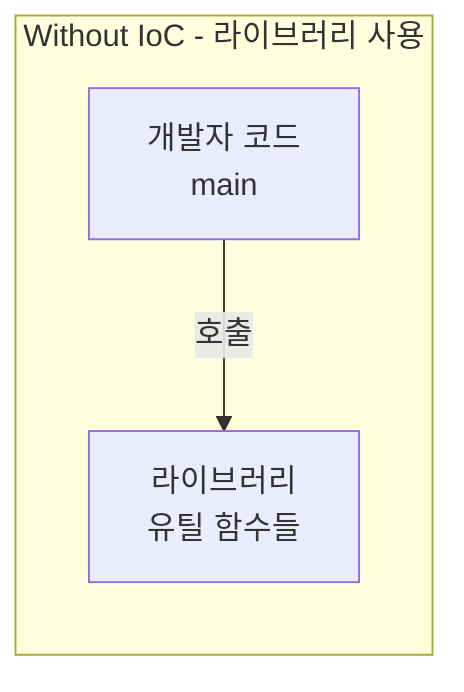
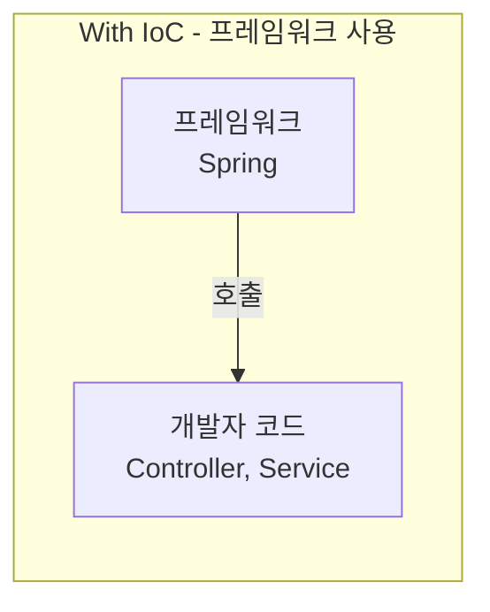
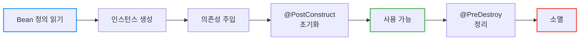
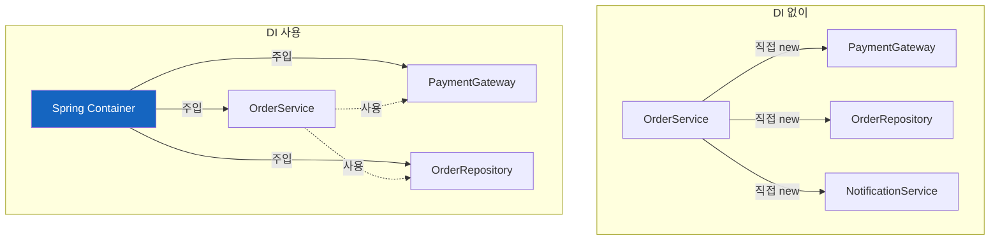
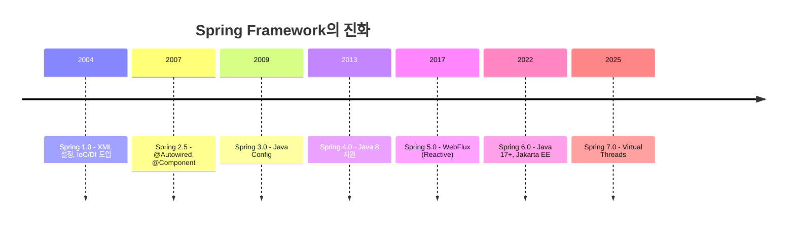

# Spring의 DI와 IoC

Spring Framework 7.0이 나와도 변하지 않는 핵심 철학 - 제어의 역전과 의존성 주입

## 결론부터 말하면

**IoC(Inversion of Control)는 "제어권을 넘긴다"는 철학**이고, **DI(Dependency Injection)는 그 철학을 구현하는 구체적인 방법**입니다.

```java
// Before: 개발자가 직접 모든 것을 제어
public class OrderService {
    private final PaymentGateway paymentGateway;

    public OrderService() {
        // 직접 객체를 생성 - 강한 결합
        this.paymentGateway = new StripePaymentGateway();
    }
}

// After: Spring이 제어, 개발자는 선언만
@Service
public class OrderService {
    private final PaymentGateway paymentGateway;

    // Spring이 알아서 주입 - 느슨한 결합
    public OrderService(PaymentGateway paymentGateway) {
        this.paymentGateway = paymentGateway;
    }
}
```

**왜 중요한가?**
- 테스트할 때 Mock 객체를 쉽게 주입 가능
- 구현체 교체가 설정 변경만으로 가능
- 비즈니스 로직에만 집중 가능

---

## 1. IoC (Inversion of Control) - 제어의 역전

### 1.1 만약 프레임워크 없이 웹 서버를 만든다면?

Spring 없이 처음부터 웹 서버를 만든다고 상상해보자. 우리가 직접 해야 할 일들이 산더미처럼 쌓인다.

```java
public class Main {
    public static void main(String[] args) {
        ServerSocket server = new ServerSocket(8080);

        while (true) {
            Socket client = server.accept();

            // 요청 파싱
            HttpRequest request = parseRequest(client);

            // 라우팅
            if (request.getPath().equals("/orders")) {
                // 컨트롤러 직접 생성
                OrderController controller = new OrderController(
                    new OrderService(
                        new OrderRepository(
                            new DataSource(...)
                        ),
                        new PaymentGateway(...)
                    )
                );
                controller.handleRequest(request);
            }

            // 응답 전송
            sendResponse(client, response);
        }
    }
}
```

소켓 연결 관리, HTTP 파싱, URL 라우팅, 객체 생성... 비즈니스 로직 한 줄 작성하기 전에 인프라 코드만 수백 줄이다. 그리고 이 모든 흐름을 **내가 직접 제어**해야 한다. `main`에서 시작해서 모든 것을 내가 호출하고, 내가 관리한다.

### 1.2 Spring과 함께라면

이제 같은 기능을 Spring으로 만들어보자.

```java
@SpringBootApplication
public class Main {
    public static void main(String[] args) {
        SpringApplication.run(Main.class, args);
        // 끝. 제어권을 Spring에게 넘김
    }
}

@RestController
@RequiredArgsConstructor
public class OrderController {
    private final OrderService orderService;

    @PostMapping("/orders")
    public Order createOrder(@RequestBody OrderRequest request) {
        return orderService.createOrder(request);
    }
}
```

놀랍게도 이게 전부다. 웹 서버 구동? Spring이 한다. HTTP 파싱? Spring이 한다. 라우팅? `@PostMapping`만 붙이면 Spring이 알아서 한다. 심지어 `OrderService` 객체도 Spring이 만들어서 넣어준다.

개발자는 이제 **"무엇을 할 것인가"만 선언**하면 된다. "이 URL로 요청이 오면 이 메서드를 실행해줘", "이 서비스가 필요해" 정도만 말해주면, **"어떻게 할 것인가"는 Spring이 알아서 처리**한다.

### 1.3 그래서 제어의 역전이란?

여기서 핵심적인 변화가 일어났다. 누가 누구를 호출하는지가 뒤집어진 것이다.



라이브러리를 사용할 때는 **내가 필요할 때 라이브러리를 호출**한다. 제어권은 온전히 내 코드에 있다. 내가 원하는 시점에, 내가 원하는 방식으로 라이브러리 함수를 불러서 쓴다.



하지만 프레임워크를 사용하면 상황이 역전된다. **프레임워크가 필요할 때 내 코드를 호출**한다. HTTP 요청이 들어오면 Spring이 내 Controller를 호출하고, 트랜잭션이 필요하면 Spring이 알아서 시작하고 커밋한다. 제어권이 프레임워크로 넘어간 것이다.

이것이 바로 할리우드 원칙이다: **"Don't call us, we'll call you."** (우리한테 전화하지 마세요, 우리가 전화할게요.)

할리우드 오디션장에서 지원자에게 하는 말처럼, Spring도 우리에게 말한다. "네가 날 호출하지 마. 필요하면 내가 너를 호출할게."

---

## 2. IoC 컨테이너와 Bean

### 2.1 Spring이 관리하는 객체들

그렇다면 Spring은 어떻게 내 객체들을 알고, 필요할 때 호출할 수 있는 걸까? 바로 **Bean**이라는 개념 덕분이다.

Bean은 Spring IoC 컨테이너가 생성하고 관리하는 객체를 말한다. 우리가 `new OrderService()`라고 직접 만드는 대신, Spring에게 "이 클래스를 Bean으로 등록해줘"라고 알려주면, Spring이 대신 객체를 만들고 필요한 곳에 넣어준다.

Bean을 등록하는 방법은 크게 두 가지가 있다.

```java
// 1. 어노테이션으로 자동 등록 - 내가 만든 클래스
@Component  // 일반적인 경우
@Service    // 비즈니스 로직 계층
@Repository // 데이터 접근 계층
@Controller // 프레젠테이션 계층

// 2. 직접 Bean으로 등록 - 외부 라이브러리 등
@Configuration
public class AppConfig {

    @Bean
    public ObjectMapper objectMapper() {
        return new ObjectMapper()
            .registerModule(new JavaTimeModule())
            .disable(SerializationFeature.WRITE_DATES_AS_TIMESTAMPS);
    }
}
```

`@Service`, `@Repository` 같은 어노테이션은 사실 모두 `@Component`의 별칭이다. 기능적으로는 동일하지만, 코드를 읽는 사람에게 "이 클래스는 비즈니스 로직을 담당해", "이 클래스는 데이터베이스 접근을 담당해"라는 의도를 전달할 수 있다.

외부 라이브러리의 경우 우리가 소스코드를 수정할 수 없으니, `@Bean` 어노테이션을 붙인 메서드를 만들어서 직접 등록해준다.

### 2.2 Bean의 생명주기

Spring 컨테이너는 Bean을 그냥 만들기만 하는 게 아니다. 생성부터 소멸까지 전체 생명주기를 관리한다.



이 생명주기를 활용하면 Bean이 생성된 직후에 초기화 작업을 하거나, 애플리케이션이 종료될 때 리소스를 정리하는 작업을 할 수 있다.

```java
@Service
public class CacheService {

    private Cache cache;

    @PostConstruct
    public void init() {
        // Bean 생성 후 초기화 작업
        this.cache = CacheBuilder.newBuilder()
            .maximumSize(1000)
            .expireAfterWrite(Duration.ofMinutes(10))
            .build();
        log.info("CacheService initialized");
    }

    @PreDestroy
    public void cleanup() {
        // 애플리케이션 종료 시 정리 작업
        this.cache.invalidateAll();
        log.info("CacheService cleaned up");
    }
}
```

### 2.3 Bean Scope - 얼마나 오래 살아있을까?

Bean이 언제 생성되고, 얼마나 공유되는지를 결정하는 것이 Scope다.

| Scope | 설명 | 사용 시점 |
|-------|------|----------|
| `singleton` | 컨테이너당 하나의 인스턴스 (기본값) | 대부분의 경우 |
| `prototype` | 요청마다 새 인스턴스 | 상태를 가지는 객체 |
| `request` | HTTP 요청당 하나 | 웹 애플리케이션 |
| `session` | HTTP 세션당 하나 | 사용자별 상태 유지 |

대부분의 경우 기본값인 singleton으로 충분하다. 하나의 OrderService 인스턴스가 모든 요청을 처리해도 문제없다. 왜냐하면 서비스 클래스는 보통 상태를 가지지 않기 때문이다 (stateless).

하지만 장바구니처럼 각 사용자마다 별도의 상태를 가져야 하는 경우라면 얘기가 다르다.

```java
@Component
@Scope("prototype")
public class ShoppingCart {
    private List<Item> items = new ArrayList<>();
    // 각 요청마다 새로운 장바구니 인스턴스가 생성됨
}
```

---

## 3. DI (Dependency Injection) - 의존성 주입

### 3.1 의존성이란 무엇인가?

이제 IoC의 구체적인 구현 방법인 DI로 넘어가보자. 먼저 "의존성"이 무엇인지 이해해야 한다.

```java
public class OrderService {
    private PaymentGateway paymentGateway;
}
```

이 코드에서 OrderService는 PaymentGateway **없이는 동작할 수 없다**. 주문을 처리하려면 결제가 필요하고, 결제를 하려면 PaymentGateway가 있어야 한다. 이런 관계를 "OrderService가 PaymentGateway에 **의존**한다"고 표현한다.

문제는 이 의존성을 **어떻게 해결할 것인가**이다.

### 3.2 의존성을 해결하는 세 가지 방법

#### 생성자 주입 (권장)

가장 권장되는 방식이다. 생성자의 파라미터로 필요한 의존성을 선언하면, Spring이 알아서 넣어준다.

```java
@Service
@RequiredArgsConstructor  // Lombok이 생성자를 만들어줌
public class OrderService {
    private final OrderRepository orderRepository;
    private final PaymentGateway paymentGateway;
    private final NotificationService notificationService;
}
```

왜 생성자 주입이 좋을까? 여러 가지 이유가 있다.

첫째, `final` 키워드를 사용할 수 있다. 한번 주입된 의존성은 절대 바뀌지 않는다는 것을 컴파일러 레벨에서 보장받는다.

둘째, 테스트하기 쉽다. Mock 객체를 생성자에 넣어주기만 하면 끝이다. Spring 컨테이너 없이도 테스트할 수 있다.

```java
@Test
void 주문_생성_성공() {
    // Mock 객체를 생성자에 직접 주입
    OrderRepository mockRepo = mock(OrderRepository.class);
    PaymentGateway mockPayment = mock(PaymentGateway.class);

    OrderService service = new OrderService(mockRepo, mockPayment, mockNotification);
    // 테스트 진행...
}
```

셋째, 순환 참조를 컴파일 타임에 잡아낸다. A가 B를 필요로 하고, B가 A를 필요로 하는 상황이라면 애플리케이션 시작 시점에 바로 에러가 난다.

#### Setter 주입 (선택적 의존성)

필수가 아닌 선택적 의존성에 사용한다.

```java
@Service
public class NotificationService {

    private final EmailSender emailSender;  // 필수
    private SmsSender smsSender;  // 선택

    public NotificationService(EmailSender emailSender) {
        this.emailSender = emailSender;
    }

    @Autowired(required = false)
    public void setSmsSender(SmsSender smsSender) {
        this.smsSender = smsSender;
    }

    public void notify(User user, String message) {
        emailSender.send(user.getEmail(), message);

        // SMS 발송은 선택적
        if (smsSender != null) {
            smsSender.send(user.getPhone(), message);
        }
    }
}
```

#### 필드 주입 (비권장)

코드는 가장 간결하지만, 여러 문제가 있어 권장하지 않는다.

```java
@Service
public class OrderService {

    @Autowired  // ❌
    private OrderRepository orderRepository;
}
```

테스트할 때 리플렉션을 써야 하고, `final`을 쓸 수 없어서 누군가 실수로 필드를 바꿔버릴 수도 있다. 또한 의존성이 코드에 숨어있어서 이 클래스가 뭘 필요로 하는지 한눈에 파악하기 어렵다.

### 3.3 같은 인터페이스, 여러 구현체가 있다면?

실무에서 자주 마주치는 상황이 있다. 결제 게이트웨이 인터페이스가 있고, Stripe과 Toss 두 가지 구현체가 있다면?

```java
public interface PaymentGateway {
    PaymentResult process(PaymentRequest request);
}

@Component
public class StripePaymentGateway implements PaymentGateway { ... }

@Component
public class TossPaymentGateway implements PaymentGateway { ... }
```

이 상태에서 OrderService가 PaymentGateway를 주입받으려고 하면 Spring은 혼란에 빠진다. 둘 중 뭘 넣어줘야 하지?

해결 방법은 여러 가지가 있다.

**@Primary**로 기본값 지정:
```java
@Component
@Primary  // 기본으로 사용될 구현체
public class StripePaymentGateway implements PaymentGateway { }
```

**@Qualifier**로 명시적 지정:
```java
public OrderService(
        @Qualifier("tossPaymentGateway") PaymentGateway paymentGateway) {
    this.paymentGateway = paymentGateway;
}
```

**변수명으로 매칭**: Spring은 기본적으로 Bean 이름을 qualifier로 사용한다. 그래서 변수명을 Bean 이름과 맞추면 알아서 매칭된다.

```java
// 변수명이 tossPaymentGateway이므로 TossPaymentGateway Bean이 주입됨
public OrderService(PaymentGateway tossPaymentGateway) {
    this.paymentGateway = tossPaymentGateway;
}
```

**모든 구현체를 Map으로 받기**: 런타임에 동적으로 선택해야 한다면 이 방법이 유용하다.

```java
@Service
public class PaymentService {
    private final Map<String, PaymentGateway> gateways;

    public PaymentService(Map<String, PaymentGateway> gateways) {
        this.gateways = gateways;  // {"stripePaymentGateway": ..., "tossPaymentGateway": ...}
    }

    public PaymentResult process(String gatewayType, PaymentRequest request) {
        PaymentGateway gateway = gateways.get(gatewayType + "PaymentGateway");
        return gateway.process(request);
    }
}
```

---

## 4. IoC/DI가 가져다주는 것들

### 4.1 테스트가 쉬워진다

DI의 가장 큰 수혜자는 테스트 코드다. 실제 데이터베이스에 연결하고, 실제 결제 API를 호출하는 테스트를 작성할 필요가 없다. Mock 객체를 넣어주면 그만이다.

```java
@Test
void 주문_생성_성공() {
    // Given
    OrderRepository mockRepo = mock(OrderRepository.class);
    PaymentGateway mockPayment = mock(PaymentGateway.class);

    when(mockPayment.process(any()))
        .thenReturn(PaymentResult.success());

    OrderService service = new OrderService(mockRepo, mockPayment);

    // When
    Order order = service.createOrder(new OrderRequest(...));

    // Then
    assertThat(order.getStatus()).isEqualTo(OrderStatus.PAID);
}
```

만약 OrderService가 내부에서 `new StripePaymentGateway()`를 직접 호출했다면? 테스트할 때마다 실제 Stripe API가 호출될 것이고, 테스트는 느리고, 불안정하고, 비용까지 들게 된다.

### 4.2 구현체 교체가 쉬워진다

개발 환경에서는 가짜 결제를, 운영 환경에서는 진짜 결제를 사용하고 싶다면? 코드 한 줄 바꾸지 않고 설정만으로 가능하다.

```java
@Profile("dev")
@Component
public class FakePaymentGateway implements PaymentGateway {
    @Override
    public PaymentResult process(PaymentRequest request) {
        return PaymentResult.success();  // 항상 성공
    }
}

@Profile("prod")
@Component
public class StripePaymentGateway implements PaymentGateway {
    @Override
    public PaymentResult process(PaymentRequest request) {
        // 실제 API 호출
    }
}
```

### 4.3 관심사가 분리된다

DI가 없다면 OrderService는 두 가지 책임을 진다: 주문 처리 로직 + 필요한 객체들 생성. DI를 사용하면 객체 생성이라는 책임이 Spring 컨테이너로 넘어간다. OrderService는 오직 주문 처리라는 본연의 책임에만 집중할 수 있다.



---

## 5. 실전에서 자주 쓰는 패턴들

### 5.1 전략 패턴과 DI의 조합

할인 정책이 있다고 하자. 정액 할인과 정률 할인이 있고, 나중에 새로운 정책이 추가될 수도 있다.

```java
public interface DiscountPolicy {
    Money calculateDiscount(Order order);
}

@Component
public class FixedDiscountPolicy implements DiscountPolicy {
    @Override
    public Money calculateDiscount(Order order) {
        return Money.of(1000);  // 1000원 할인
    }
}

@Component
@Primary
public class RateDiscountPolicy implements DiscountPolicy {
    @Override
    public Money calculateDiscount(Order order) {
        return order.getTotalAmount().multiply(0.1);  // 10% 할인
    }
}
```

OrderService는 어떤 할인 정책이 들어올지 모르고, 알 필요도 없다.

```java
@Service
@RequiredArgsConstructor
public class OrderService {
    private final DiscountPolicy discountPolicy;  // 어떤 구현체든 상관없음

    public Order createOrder(OrderRequest request) {
        Money discount = discountPolicy.calculateDiscount(order);
        // ...
    }
}
```

할인 정책을 바꾸고 싶다면? `@Primary`만 다른 클래스로 옮기면 된다. OrderService 코드는 그대로다.

### 5.2 이벤트로 더 느슨하게

주문이 완료되면 포인트도 적립하고, 알림도 보내고, 분석 데이터도 기록해야 한다. 이 모든 것을 OrderService에서 직접 호출한다면?

```java
// 이렇게 하면 OrderService가 모든 것에 의존하게 됨
@Service
public class OrderService {
    private final PointService pointService;
    private final NotificationService notificationService;
    private final AnalyticsService analyticsService;
    // ... 점점 늘어남
}
```

이벤트를 사용하면 이 결합을 끊을 수 있다.

```java
@Service
@RequiredArgsConstructor
public class OrderService {
    private final ApplicationEventPublisher eventPublisher;

    public Order completeOrder(Long orderId) {
        Order order = findOrder(orderId);
        order.complete();

        // 이벤트만 발행하고, 누가 처리하는지는 모름
        eventPublisher.publishEvent(new OrderCompletedEvent(
            order.getId(), order.getUserId(), order.getTotalAmount()
        ));

        return order;
    }
}

// 각자 독립적으로 이벤트를 처리
@Component
public class PointAccumulator {
    @EventListener
    public void handle(OrderCompletedEvent event) {
        // 포인트 적립
    }
}

@Component
public class NotificationSender {
    @EventListener
    public void handle(OrderCompletedEvent event) {
        // 알림 발송
    }
}
```

이제 새로운 후처리가 필요하면 `@EventListener`만 달린 새 컴포넌트를 추가하면 된다. OrderService는 건드릴 필요가 없다.

---

## 6. 주의해야 할 함정들

### 6.1 순환 참조

A가 B를 필요로 하고, B가 A를 필요로 하면 어떻게 될까?

```java
@Service
public class ServiceA {
    public ServiceA(ServiceB serviceB) { ... }
}

@Service
public class ServiceB {
    public ServiceB(ServiceA serviceA) { ... }  // 순환!
}
```

닭이 먼저냐 달걀이 먼저냐의 문제다. Spring은 이 상황을 해결할 수 없고, 애플리케이션 시작 시 에러가 난다. (생성자 주입을 사용했기 때문에 빠르게 실패한다. 필드 주입이었다면 런타임에 터졌을 것이다.)

해결책은 설계를 다시 생각해보는 것이다. 정말 서로가 서로를 필요로 하는가? 대부분의 경우 공통 로직을 별도의 서비스로 분리하거나, 이벤트 기반으로 바꾸면 해결된다.

### 6.2 Scope 혼합의 함정

Singleton Bean 안에서 Prototype Bean을 주입받으면 어떻게 될까?

```java
@Component
@Scope("singleton")
public class SingletonService {

    @Autowired
    private PrototypeBean prototypeBean;  // 문제!
}
```

Singleton은 한 번만 생성되므로, 그 안에 주입된 PrototypeBean도 딱 한 번만 주입된다. 이후에 SingletonService를 아무리 많이 사용해도 같은 PrototypeBean 인스턴스가 계속 사용된다. Prototype의 의미가 사라지는 것이다.

이런 경우에는 Provider를 사용해야 한다.

```java
@Component
@Scope("singleton")
public class SingletonService {

    private final ObjectProvider<PrototypeBean> prototypeBeanProvider;

    public void doSomething() {
        PrototypeBean bean = prototypeBeanProvider.getObject();  // 매번 새 인스턴스
    }
}
```

---

## 7. 20년간 변하지 않는 이유

Spring이 처음 나온 2004년부터 지금까지, 수많은 것들이 바뀌었다. XML 설정이 어노테이션으로 바뀌었고, 동기 처리가 리액티브로 확장되었고, Java 8이 Java 21이 되었다.



하지만 IoC와 DI는 그대로다. 왜일까?

이것들은 "좋은 객체지향 설계"의 원칙을 코드로 구현한 것이기 때문이다. 의존성을 외부에서 주입받으면 결합도가 낮아지고, 테스트가 쉬워지고, 변경이 유연해진다. 이것은 특정 기술의 유행이 아니라, 소프트웨어 공학의 기본 원리다.

기술은 바뀌어도 좋은 설계의 정의는 바뀌지 않는다. 그래서 IoC와 DI는 Spring의 핵심으로 남아있고, 앞으로도 그럴 것이다.

---

## 출처

- [Spring IoC, DI 란? - umbum.dev](https://umbum.dev/876/) - 본 문서 작성의 주요 참고 자료
- [Spring Framework Documentation - Core Technologies](https://docs.spring.io/spring-framework/reference/core.html) - 공식 문서
- [Inversion of Control Containers and the Dependency Injection pattern - Martin Fowler](https://martinfowler.com/articles/injection.html) - DI 개념의 원전
