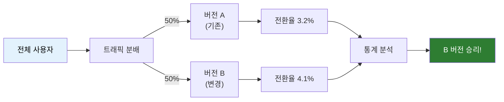
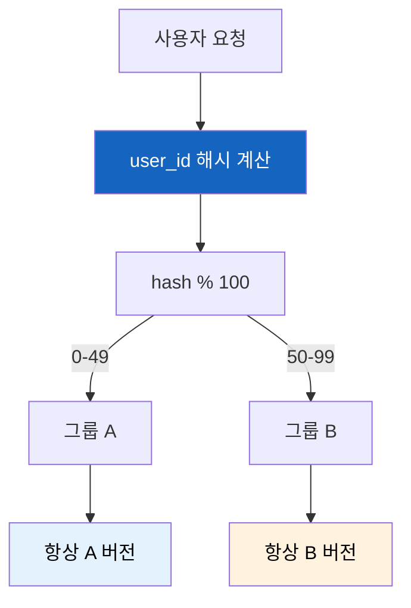
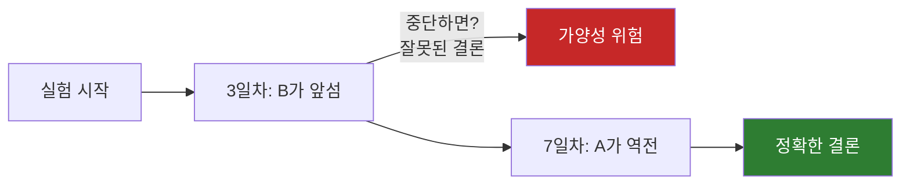
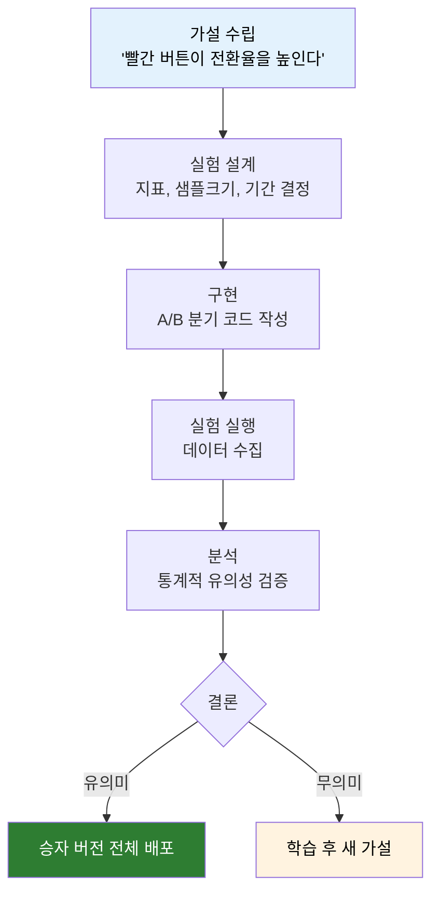

# A/B 테스트

"버튼 색을 빨간색으로 바꾸면 매출이 오를까?" 이 질문에 어떻게 답할 수 있을까?

## 결론부터 말하면

**A/B 테스트** 는 사용자를 두 그룹으로 나눠 서로 다른 버전을 보여주고, **어떤 버전이 더 나은지 데이터로 증명** 하는 실험 기법이다.



| 구성 요소 | 설명 |
|----------|------|
| **Control (A)** | 기존 버전, 변경 없음 |
| **Variant (B)** | 새로운 버전, 가설을 적용 |
| **지표(Metric)** | 성공을 측정하는 기준 (전환율, 클릭률 등) |
| **통계적 유의성** | 결과가 우연이 아님을 증명하는 수치 |

---

## 1. 왜 A/B 테스트가 필요한가?

### 1.1 직감은 틀릴 수 있다

"버튼을 더 크게 만들면 클릭이 늘겠지?"라는 직감이 항상 맞지는 않다. 실제로 많은 기업들이 직감과 반대되는 결과를 A/B 테스트로 발견했다:

| 회사 | 가설 | 실제 결과 |
|------|------|----------|
| Google | 파란색 링크가 더 좋을 것 | 41가지 파란색을 테스트해 최적 색상 발견, 연 $200M 추가 수익 |
| Booking.com | 긴박감 메시지가 예약을 늘릴 것 | "남은 객실 3개!" 표시로 전환율 상승 |
| Netflix | 큰 썸네일이 클릭을 늘릴 것 | 이미지 종류가 크기보다 중요했음 |

### 1.2 의사결정의 근거가 된다

A/B 테스트 없이는 이런 대화가 벌어진다:

```
PM: "버튼 색을 바꾸면 매출이 오를 거예요"
개발자: "근거가 뭐죠?"
PM: "... 느낌이요"
```

A/B 테스트가 있으면:

```
PM: "버튼 색 테스트 결과, 빨간색이 3.2% 전환율 상승을 보였어요"
PM: "p-value 0.02로 통계적으로 유의미합니다"
개발자: "데이터가 있으니 반영하죠"
```

---

## 2. A/B 테스트는 실제로 어떻게 동작하나?

### 2.1 핵심 메커니즘: 트래픽 분배

A/B 테스트의 핵심은 **사용자를 일관되게 같은 그룹에 배정** 하는 것이다. 사용자가 새로고침할 때마다 다른 버전을 보면 실험이 망가진다.



**왜 해시를 쓸까?** 랜덤이 아니라 해시를 쓰는 이유가 있다:

| 방식 | 문제점 |
|------|--------|
| `Math.random()` | 새로고침마다 다른 그룹에 배정됨 |
| 세션/쿠키 저장 | 디바이스 바꾸면 다른 그룹에 배정됨 |
| **user_id 해시** | 항상 같은 그룹, 어디서 접속해도 일관됨 |

### 2.2 실제 구현 코드 (Python 예시)

```python
import hashlib

def get_experiment_group(user_id: str, experiment_name: str) -> str:
    """
    사용자를 실험 그룹에 배정한다.
    동일한 user_id는 항상 동일한 그룹에 배정된다.
    """
    # user_id + experiment_name을 조합해 해시 생성
    key = f"{user_id}:{experiment_name}"
    hash_value = int(hashlib.md5(key.encode()).hexdigest(), 16)

    # 0-99 범위로 변환
    bucket = hash_value % 100

    # 50:50 분배
    if bucket < 50:
        return "control"  # A 그룹
    else:
        return "variant"  # B 그룹


# 사용 예시
user_id = "user_12345"
group = get_experiment_group(user_id, "button_color_test")

if group == "control":
    button_color = "blue"   # 기존
else:
    button_color = "red"    # 새로운 버전
```

**Java 버전:**

```java
public class ABTest {

    public static String getExperimentGroup(String userId, String experimentName) {
        String key = userId + ":" + experimentName;
        // 비트마스킹으로 양수 보장 (Math.abs는 Integer.MIN_VALUE에서 음수 반환)
        int hashValue = key.hashCode() & 0x7fffffff;
        int bucket = hashValue % 100;

        return bucket < 50 ? "control" : "variant";
    }
}
```

> **주의:** `Math.abs()`는 `Integer.MIN_VALUE`에서 음수를 반환한다. 비트마스킹 `& 0x7fffffff`로 부호 비트를 제거하면 안전하다.

> **프로덕션 팁:** `String.hashCode()`는 해시 분포의 균일성을 보장하지 않는다. 트래픽 분배에는 MurmurHash나 xxHash 같은 **비암호학적 해시** 가 적합하다. MD5 같은 암호학적 해시는 보안성에 중점을 두지만, A/B 테스트에서는 속도와 균등 분포가 더 중요하기 때문이다.

### 2.3 프론트엔드에서의 구현

프론트엔드에서는 보통 SDK를 사용한다:

```javascript
// LaunchDarkly, Optimizely 등의 SDK 사용 예시
import { useFeatureFlag } from '@company/ab-testing';

function CheckoutButton() {
    // 백엔드에서 그룹 정보를 받아옴
    const buttonColor = useFeatureFlag('checkout_button_color', 'blue');

    return (
        <button style={{ backgroundColor: buttonColor }}>
            구매하기
        </button>
    );
}
```

---

## 3. 통계적 유의성: 결과를 어떻게 신뢰하나?

### 3.1 왜 통계가 필요한가?

100명에게 테스트해서 A가 51%, B가 49%라면? 이건 B가 진짜 나쁜 걸까, 아니면 우연일까?

**통계적 유의성(Statistical Significance)** 은 "이 결과가 우연이 아닐 확률"을 계산한다.

| 용어 | 의미 | 일반적 기준 |
|------|------|------------|
| **p-value** | 결과가 우연일 확률 | < 0.05 (5% 미만) |
| **신뢰구간** | 실제 효과가 있을 범위 | 95% 신뢰구간 |
| **검정력(Power)** | 실제 효과를 감지할 확률 | > 80% |

### 3.2 샘플 크기 계산

테스트 기간과 샘플 크기는 **미리 계산** 해야 한다. 결과를 보면서 "충분한 것 같으니 끝내자"라고 하면 안 된다.

```
필요 샘플 크기 = f(기존 전환율, 감지하고 싶은 변화량, 신뢰수준)
```

| 기존 전환율 | 감지하려는 변화 | 필요 샘플 (그룹당) |
|------------|-----------------|-------------------|
| 5% | +1% (→6%) | 약 3,600명 |
| 5% | +0.5% (→5.5%) | 약 14,000명 |
| 10% | +1% (→11%) | 약 14,000명 |

> 작은 변화를 감지하려면 더 많은 샘플이 필요하다.

### 3.3 흔한 실수: Peeking Problem



**Peeking(엿보기) 문제:** 중간에 결과를 확인하고 일찍 끝내면 잘못된 결론을 내릴 수 있다. 미리 정한 기간과 샘플 크기를 채워야 한다.

---

## 4. 실제 기업들은 어떻게 하나?

### 4.1 A/B 테스트 플랫폼

| 플랫폼 | 특징 | 주 사용 기업 |
|--------|------|-------------|
| **Optimizely** | 엔터프라이즈급, 기능 풍부 | Gap, IBM |
| **LaunchDarkly** | 피처 플래그 + A/B 테스트 | Atlassian, Honeycomb |
| **Google Optimize** | 무료, GA 연동 (2023년 종료 → GA4 또는 VWO, AB Tasty로 대체) | 중소기업 |
| **Amplitude Experiment** | 분석 도구와 통합 | 스타트업 |
| **자체 구축** | 완전한 통제권 | Netflix, Facebook, 쿠팡 |

### 4.2 대기업의 A/B 테스트 문화

**Netflix:**
- 모든 UI 변경은 A/B 테스트를 거침
- 연간 수백 개의 동시 실험 진행
- 썸네일 이미지만으로 시청률 20-30% 차이 발견

**Amazon:**
- "1-Click 구매" 버튼도 A/B 테스트로 검증
- 페이지 로딩 100ms 지연 → 매출 1% 감소 발견

**쿠팡:**
- 검색 결과 순서, 추천 알고리즘 상시 테스트
- 자체 A/B 테스트 플랫폼 운영

### 4.3 A/B 테스트 프로세스



---

## 5. A/B 테스트의 한계와 주의점

### 5.1 언제 A/B 테스트가 적합하지 않은가?

| 상황 | 이유 | 대안 |
|------|------|------|
| 트래픽이 적음 | 통계적 유의성 확보 불가 | 사용자 인터뷰, 정성 분석 |
| 장기 효과 측정 | 실험 기간 내 효과 안 나타남 | 코호트 분석 |
| 급격한 변화 | 사용자 혼란 | 점진적 롤아웃 |
| 네트워크 효과 | 그룹 간 영향 | 클러스터 실험 |

### 5.2 흔한 함정

| 함정 | 문제 | 해결책 |
|------|------|--------|
| **다중 비교** | 여러 지표 동시 테스트 시 가양성 증가 | Bonferroni 보정 |
| **시즌 효과** | 특정 시기에만 유효한 결과 | 충분한 실험 기간 |
| **신규 유저 효과** | 기존 유저는 변화에 민감 | 신규/기존 분리 분석 |
| **Simpson's Paradox** | 전체와 부분 결과가 다름 | 세그먼트별 분석 |

---

## 6. 정리

A/B 테스트는 **데이터 기반 의사결정** 의 핵심 도구다.

| 핵심 포인트 | 설명 |
|------------|------|
| **일관된 그룹 배정** | user_id 해시로 항상 같은 그룹 |
| **통계적 유의성** | p-value < 0.05로 우연 배제 |
| **사전 설계** | 샘플 크기, 기간 미리 결정 |
| **Peeking 금지** | 중간에 결과보고 일찍 끝내지 않기 |

직감 대신 데이터로 증명하고, 작은 개선을 쌓아 큰 성과를 만드는 것이 A/B 테스트의 철학이다.

---

## 출처

- [Optimizely - A/B Testing](https://www.optimizely.com/optimization-glossary/ab-testing/)
- [Ron Kohavi - Trustworthy Online Controlled Experiments](https://www.cambridge.org/core/books/trustworthy-online-controlled-experiments/D97B26382EB0EB2DC2019A7A7B518F59) - A/B 테스트 바이블
- [Netflix Tech Blog - A/B Testing](https://netflixtechblog.com/what-is-an-a-b-test-b08cc1b57962)
- [Google - How We Test at Google](https://www.wired.com/2012/02/ff-abtesting/)
