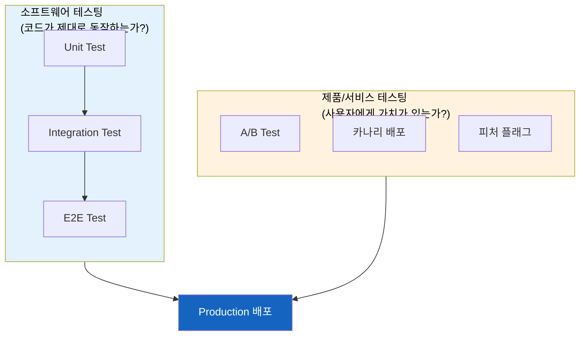
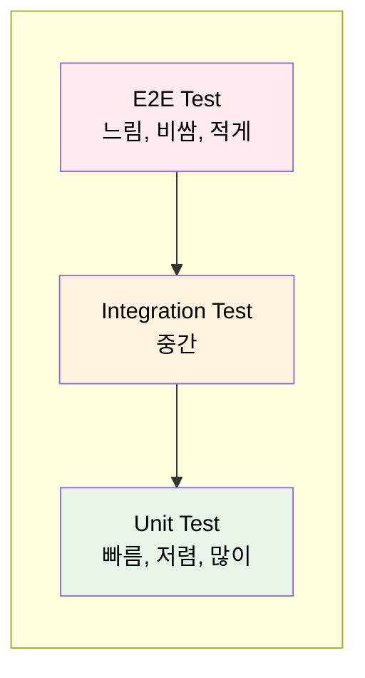
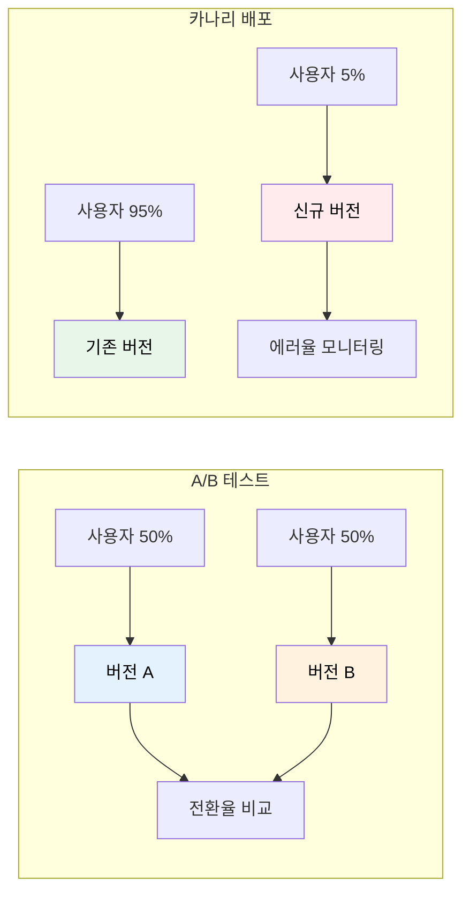
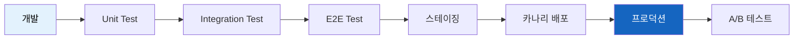

# 실무 테스팅 방법론 총정리

"테스트 코드 작성해야지"라고 말할 때, 우리는 정확히 무엇을 테스트하려는 걸까?

## 결론부터 말하면

테스팅은 크게 **두 가지 관점** 으로 나뉜다:

| 관점 | 업계 용어 | 목적 | 대표 기법 |
|------|----------|------|----------|
| **코드 품질** | Shift-left | 버그 없이 동작하는가? | Unit Test, Integration Test, E2E Test |
| **제품 검증** | Shift-right | 사용자에게 가치가 있는가? | A/B Test, 카나리 배포, 피처 플래그 |

> **Shift-left vs Shift-right:** 개발 주기 초반에 테스트를 집중하면 "Shift-left", 배포 후 실제 운영 환경에서 검증하면 "Shift-right"라고 부른다. 현대 소프트웨어 개발에서는 둘 다 중요하다.

---

## 1. 왜 테스팅 방법이 이렇게 많을까?

### 1.1 각각이 답하는 질문이 다르다

코드를 작성하고 배포하기까지, 우리는 여러 가지 질문에 답해야 한다:

| 질문 | 답을 주는 테스트 |
|------|-----------------|
| 이 함수가 제대로 동작하나? | Unit Test |
| 여러 모듈이 함께 동작하나? | Integration Test |
| 사용자 시나리오대로 흘러가나? | E2E Test |
| 새 버전이 기존보다 나은가? | A/B Test |
| 새 배포가 장애를 일으키지 않나? | 카나리 배포 |
| 특정 사용자에게만 기능을 열 수 있나? | 피처 플래그 |

### 1.2 테스트 피라미드: 얼마나 많이 작성해야 하나?

모든 테스트를 동일하게 작성하면 안 된다. 비용과 속도가 다르기 때문이다.

---

## 2. 소프트웨어 테스팅 (코드 품질)

코드가 **의도대로 동작하는지** 검증한다. 개발자가 주도한다.

### 2.1 테스트 레벨별 비교

| 레벨 | 범위 | 속도 | 의존성 | 작성 주체 |
|------|------|------|--------|----------|
| [Unit Test](./Unit-Test-단위-테스트.md) | 함수/클래스 | 밀리초 | 없음 (Mock) | 개발자 |
| [Integration Test](./Integration-Test-통합-테스트.md) | 모듈 간 연동 | 초 | DB, API 등 | 개발자 |
| [E2E Test](./E2E-Test-End-to-End-테스트.md) | 전체 시스템 | 분 | 전체 | 개발자/QA |

### 2.2 그 외 소프트웨어 테스팅

| 기법 | 목적 | 언제 사용? |
|------|------|-----------|
| [스모크 테스트](./스모크-테스트.md) | 핵심 기능이 동작하는지 빠르게 확인 | 배포 직후 |
| [회귀 테스트](./회귀-테스트.md) | 기존 기능이 깨지지 않았는지 확인 | 코드 변경 후 |
| [부하 테스트](./부하-테스트.md) | 시스템이 트래픽을 견디는지 확인 | 출시 전, 이벤트 전 |
| [침투 테스트](./침투-테스트.md) | 보안 취약점 발견 | 정기적 또는 출시 전 |

---

## 3. 제품/서비스 테스팅 (사용자 가치)

코드는 잘 동작하는데, **사용자에게 가치가 있는지** 는 별개 문제다. 이 질문에 답하는 테스팅 기법들이다.

### 3.1 실험과 배포 전략

| 기법 | 핵심 질문 | 상세 문서 |
|------|----------|----------|
| **A/B 테스트** | 어떤 버전이 더 나은가? | [A/B-테스트](./A/B-테스트.md) |
| **카나리 배포** | 새 버전이 안전한가? | [카나리-배포](./카나리-배포.md) |
| **블루-그린 배포** | 무중단으로 전환할 수 있는가? | [블루-그린-배포](./블루-그린-배포.md) |
| **피처 플래그** | 배포와 릴리스를 분리할 수 있는가? | [피처-플래그](./피처-플래그.md) |
| **섀도우 테스팅** | 실제 트래픽으로 검증할 수 있는가? | [섀도우-테스팅](./섀도우-테스팅.md) |

### 3.2 A/B 테스트 vs 카나리 배포: 뭐가 다른가?

자주 혼동되는 두 개념을 비교해보자:

| 구분 | A/B 테스트 | 카나리 배포 |
|------|-----------|------------|
| **목적** | 어떤 게 더 나은지 **비교** | 새 버전이 안전한지 **검증** |
| **측정 지표** | 전환율, 클릭률, 매출 등 | 에러율, 레이턴시, CPU 사용량 |
| **트래픽 비율** | 보통 50:50 | 1~10%로 시작 |
| **롤백 조건** | 실험 종료 후 결정 | 이상 징후 즉시 롤백 |
| **주 사용자** | PM, 데이터 분석가 | DevOps, SRE |

---

## 4. 어떤 테스트를 언제 사용해야 하나?

### 4.1 개발 단계별 테스트

### 4.2 상황별 선택 가이드

| 상황 | 추천 테스트 |
|------|------------|
| 새 기능 개발 중 | Unit Test + Integration Test |
| 배포 전 최종 확인 | E2E Test + 스모크 테스트 |
| 새 버전 점진적 롤아웃 | 카나리 배포 |
| UI/UX 개선 효과 측정 | A/B 테스트 |
| 특정 고객사에만 기능 제공 | 피처 플래그 |
| 대규모 트래픽 대비 | 부하 테스트 |

---

## 5. 정리

테스팅은 단순히 "버그를 잡는 것"이 아니다. **어떤 질문에 답하려는지** 에 따라 적절한 기법을 선택해야 한다.

- **코드가 동작하나?** → 소프트웨어 테스팅 (Unit, Integration, E2E)
- **사용자에게 가치 있나?** → 제품 테스팅 (A/B, 카나리, 피처 플래그)

둘은 대체 관계가 아니라 **보완 관계** 다. 잘 동작하는 코드도 사용자에게 가치가 없을 수 있고, 가치 있는 기능도 버그투성이면 무용지물이다.

---

## 개별 문서 목록

### 소프트웨어 테스팅
- [Unit Test (단위 테스트)](./Unit-Test-단위-테스트.md)
- [Integration Test (통합 테스트)](./Integration-Test-통합-테스트.md)
- [E2E Test (End-to-End 테스트)](./E2E-Test-End-to-End-테스트.md)
- [스모크 테스트](./스모크-테스트.md)
- [회귀 테스트](./회귀-테스트.md)
- [부하 테스트](./부하-테스트.md)
- [침투 테스트](./침투-테스트.md)

### 제품/서비스 테스팅
- [A/B 테스트](./A/B-테스트.md)
- [카나리 배포](./카나리-배포.md)
- [블루-그린 배포](./블루-그린-배포.md)
- [피처 플래그](./피처-플래그.md)
- [섀도우 테스팅](./섀도우-테스팅.md)

---

## 출처

- [Martin Fowler - TestPyramid](https://martinfowler.com/bliki/TestPyramid.html)
- [Google Testing Blog](https://testing.googleblog.com/)
- [The Practical Test Pyramid](https://martinfowler.com/articles/practical-test-pyramid.html)
