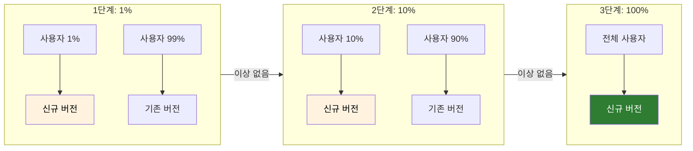
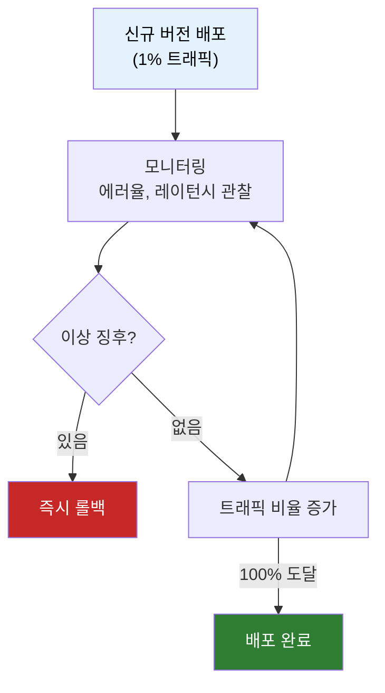
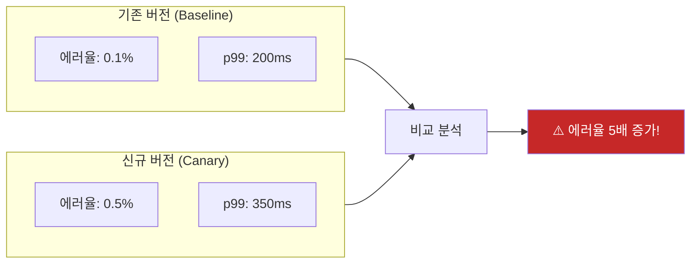

# 카나리 배포

새 버전을 배포했는데 장애가 터졌다. 전체 사용자가 영향을 받는다. 롤백하는 동안 CS팀 전화는 폭주하고, 매출 손실은 눈덩이처럼 불어난다. 이런 상황을 어떻게 방지할 수 있을까?

## 결론부터 말하면

**카나리 배포(Canary Deployment)** 는 새 버전을 **소수의 사용자에게만 먼저 배포** 하고, 문제가 없으면 점진적으로 확대하는 전략이다. 광산의 카나리아처럼, 위험을 먼저 감지하는 역할을 한다.



| 핵심 개념 | 설명 |
|----------|------|
| **점진적 롤아웃** | 1% → 10% → 50% → 100% 단계별 확대 |
| **모니터링** | 에러율, 레이턴시, CPU 등 실시간 감시 |
| **자동 롤백** | 이상 징후 감지 시 즉시 기존 버전으로 복귀 |

---

## 1. 왜 카나리 배포가 필요한가?

### 1.1 "광산의 카나리아"에서 온 이름

20세기 초 광부들은 카나리아 새를 광산에 가지고 들어갔다. 카나리아는 독가스에 민감해서, 새가 먼저 쓰러지면 광부들은 대피할 시간을 벌 수 있었다.

카나리 배포도 마찬가지다. **소수의 트래픽** 이 새 버전의 문제를 먼저 감지해준다.

### 1.2 기존 배포 방식의 문제

| 배포 방식 | 문제점 |
|----------|--------|
| **빅뱅 배포** | 전체 사용자가 즉시 영향, 롤백에 시간 소요 |
| **스테이징 테스트만** | 실제 트래픽, 데이터 볼륨을 재현 못함 |

아무리 스테이징에서 테스트해도, 프로덕션에서만 발생하는 문제가 있다:

- 실제 트래픽 패턴
- 레거시 데이터와의 호환성
- 특정 사용자 환경 (브라우저, 디바이스)
- 동시 사용자 수에 따른 성능 저하

### 1.3 A/B 테스트와 뭐가 다른가?

자주 혼동되지만, 목적이 완전히 다르다:

| 구분 | 카나리 배포 | A/B 테스트 |
|------|------------|-----------|
| **목적** | 안전한 배포 | 더 나은 버전 선택 |
| **측정 지표** | 에러율, 레이턴시 | 전환율, 클릭률 |
| **트래픽 비율** | 1~10%로 시작 | 보통 50:50 |
| **종료 조건** | 100% 도달 또는 롤백 | 통계적 유의성 확보 |
| **담당자** | DevOps, SRE | PM, 데이터 분석가 |

---

## 2. 카나리 배포는 어떻게 동작하나?

### 2.1 전체 흐름



### 2.2 트래픽 라우팅 구현

카나리 배포의 핵심은 **트래픽을 어떻게 분배하느냐** 다. 여러 레벨에서 구현할 수 있다:

| 레벨 | 도구 | 특징 |
|------|------|------|
| **로드밸런서** | Nginx, HAProxy | 가중치 기반 라우팅 |
| **서비스 메시** | Istio, Linkerd | 정밀한 트래픽 제어 |
| **쿠버네티스** | Argo Rollouts, Flagger | 자동화된 점진적 배포 |
| **클라우드 서비스** | AWS ALB, GCP Traffic Splitting | 관리형 서비스 |

### 2.3 Nginx 설정 예시

```nginx
upstream backend {
    # 기존 버전: 가중치 9 (90%)
    server old-version.internal:8080 weight=9;

    # 신규 버전: 가중치 1 (10%)
    server new-version.internal:8080 weight=1;
}

server {
    listen 80;

    location / {
        proxy_pass http://backend;
    }
}
```

### 2.4 Kubernetes + Istio 예시

Istio의 VirtualService로 정밀한 트래픽 제어가 가능하다:

```yaml
apiVersion: networking.istio.io/v1beta1
kind: VirtualService
metadata:
  name: my-service
spec:
  hosts:
    - my-service
  http:
    - route:
        # 기존 버전: 95%
        - destination:
            host: my-service
            subset: stable
          weight: 95
        # 신규 버전: 5%
        - destination:
            host: my-service
            subset: canary
          weight: 5
```

**DestinationRule로 서브셋 정의:**

```yaml
apiVersion: networking.istio.io/v1beta1
kind: DestinationRule
metadata:
  name: my-service
spec:
  host: my-service
  subsets:
    - name: stable
      labels:
        version: v1
    - name: canary
      labels:
        version: v2
```

### 2.5 Argo Rollouts로 자동화

Argo Rollouts는 카나리 배포를 선언적으로 자동화한다:

```yaml
apiVersion: argoproj.io/v1alpha1
kind: Rollout
metadata:
  name: my-app
spec:
  replicas: 10
  strategy:
    canary:
      steps:
        # 1단계: 10% 트래픽으로 시작
        - setWeight: 10
        # 5분 대기하며 모니터링 (자동 진행)
        - pause: { duration: 5m }
        # 2단계: 30%로 증가
        - setWeight: 30
        # 수동 승인 대기 (duration 없음 = 무기한 대기)
        - pause: {}
        # 3단계: 50%로 증가 (kubectl argo rollouts promote 명령으로 진행)
        - setWeight: 50
        - pause: { duration: 10m }
        # 최종: 100%
        - setWeight: 100
      # 분석 실패 시 자동 롤백
      analysis:
        templates:
          - templateName: success-rate
        startingStep: 1
  selector:
    matchLabels:
      app: my-app
  template:
    # Pod 스펙...
```

---

## 3. 모니터링: 무엇을 어떻게 감시하나?

### 3.1 핵심 지표 (Golden Signals)

Google SRE에서 제안하는 4가지 핵심 지표:

| 지표 | 설명 | 경고 기준 예시 |
|------|------|--------------|
| **Latency** | 응답 시간 | p99 > 500ms |
| **Traffic** | 처리량 | 급격한 감소 |
| **Errors** | 에러율 | > 1% |
| **Saturation** | 자원 사용률 | CPU > 80% |

### 3.2 카나리 vs 기존 버전 비교

단순히 신규 버전의 지표만 보면 안 된다. **기존 버전과 비교** 해야 한다:



### 3.3 자동 롤백 조건 설정

Argo Rollouts의 AnalysisTemplate 예시:

```yaml
apiVersion: argoproj.io/v1alpha1
kind: AnalysisTemplate
metadata:
  name: success-rate
spec:
  metrics:
    - name: success-rate
      # Prometheus 쿼리
      provider:
        prometheus:
          address: http://prometheus:9090
          query: |
            sum(rate(http_requests_total{status=~"2.*", version="canary"}[5m]))
            /
            sum(rate(http_requests_total{version="canary"}[5m]))
      # 성공률 95% 이상이어야 통과
      successCondition: result[0] >= 0.95
      # 5분마다 체크
      interval: 5m
      # 3번 연속 실패 시 롤백
      failureLimit: 3
```

---

## 4. 실제 기업들의 카나리 배포

### 4.1 Netflix

- 모든 배포에 카나리 단계 필수
- **Kayenta**: 자체 개발한 자동 카나리 분석 도구
- 통계적 비교로 카나리/베이스라인 차이 분석

### 4.2 Google

- **Canarying**: 모든 프로덕션 변경에 적용
- 여러 지역에 순차적으로 롤아웃
- 각 지역에서 문제 없으면 다음 지역으로

### 4.3 쿠팡

- MSA 환경에서 서비스별 카나리 배포
- 주문, 결제 등 핵심 서비스는 더 보수적인 비율로 시작

---

## 5. 카나리 배포의 한계와 주의점

### 5.1 적합하지 않은 경우

| 상황 | 이유 | 대안 |
|------|------|------|
| **DB 스키마 변경** | 버전 간 데이터 호환성 문제 | Expand/Contract 패턴 |
| **트래픽이 매우 적음** | 1%도 의미 있는 샘플이 안 됨 | 내부 테스트, 베타 |
| **상태 공유** | 세션, 캐시 불일치 | 스티키 세션 또는 상태 외부화 |

> **Expand/Contract 패턴:** DB 스키마 변경 시 (1) **확장**: 새 스키마 추가, 앱이 양쪽 모두 처리 (2) **마이그레이션**: 데이터 이전 (3) **축소**: 구 스키마 제거. 이 방식으로 다운타임 없이 안전하게 스키마를 변경할 수 있다.

### 5.2 흔한 실수

| 실수 | 문제 | 해결책 |
|------|------|--------|
| **모니터링 없이 배포** | 문제 감지 못함 | 배포 전 대시보드 준비 |
| **롤백 계획 없음** | 장애 시 대응 지연 | 자동 롤백 조건 사전 정의 |
| **너무 빠른 확대** | 문제 발견 전 확산 | 충분한 관찰 시간 확보 |
| **베이스라인 없음** | 비교 기준 부재 | 기존 버전 지표 수집 |

### 5.3 카나리 vs 블루-그린 vs 롤링

| 전략 | 특징 | 적합한 상황 |
|------|------|------------|
| **카나리** | 점진적, 실시간 검증 | 대부분의 서비스 배포 |
| **블루-그린** | 즉시 전환, 즉시 롤백 | DB 스키마 변경, 인프라 변경 |
| **롤링** | 순차적 교체 | 리소스 제한, 간단한 업데이트 |

---

## 6. 정리

카나리 배포는 **"조심스럽게 배포하자"** 라는 철학을 구현한 것이다.

| 핵심 포인트 | 설명 |
|------------|------|
| **소수로 시작** | 1~5% 트래픽으로 시작해 문제 영향 최소화 |
| **실시간 비교** | 카나리 vs 베이스라인 지표 비교 |
| **자동화** | Argo Rollouts, Flagger 등으로 자동 롤백 |
| **점진적 확대** | 문제 없으면 10% → 30% → 50% → 100% |

> "빠르게 배포하되, 안전하게 배포하라."

---

## 출처

- [Martin Fowler - CanaryRelease](https://martinfowler.com/bliki/CanaryRelease.html)
- [Argo Rollouts Documentation](https://argoproj.github.io/argo-rollouts/)
- [Netflix - Automated Canary Analysis](https://netflixtechblog.com/automated-canary-analysis-at-netflix-with-kayenta-3260bc7acc69)
- [Google SRE Book - Release Engineering](https://sre.google/sre-book/release-engineering/)
- [Istio Traffic Management](https://istio.io/latest/docs/concepts/traffic-management/)
