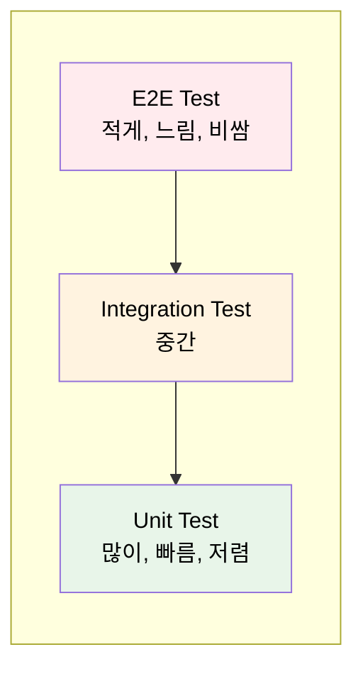
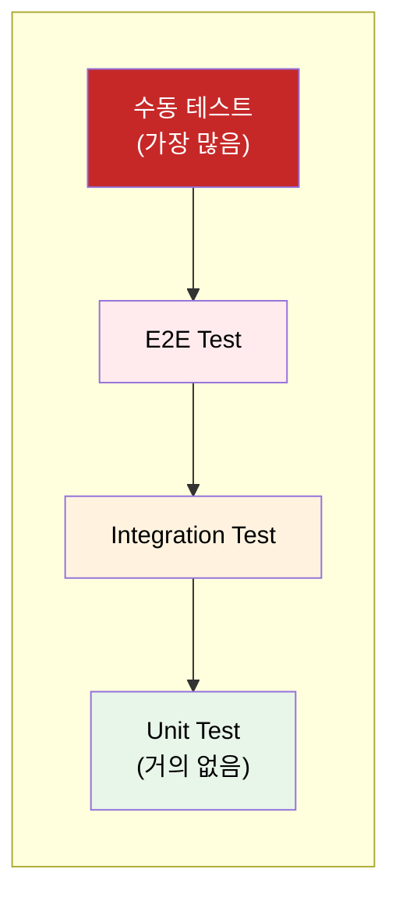
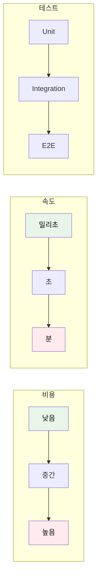
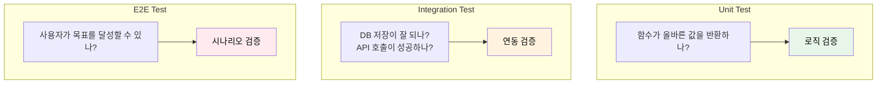
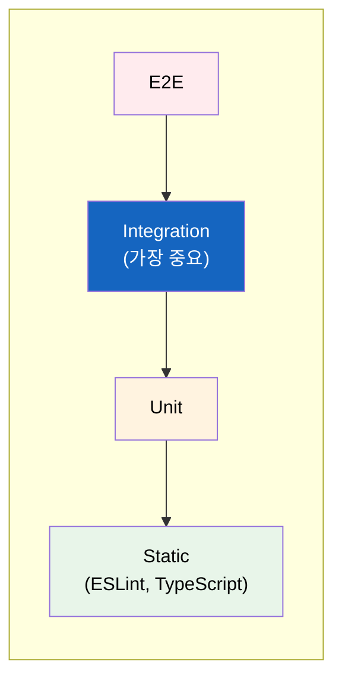
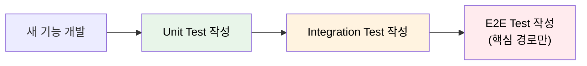

# 테스트 피라미드

"E2E 테스트를 많이 작성하면 버그를 다 잡을 수 있지 않나요?" 이 질문에 숨겨진 함정이 있다.

## 결론부터 말하면

**테스트 피라미드(Test Pyramid)** 는 테스트를 **어떤 비율로 작성해야 하는지** 가이드하는 모델이다. 아래로 갈수록 많이, 위로 갈수록 적게 작성한다.



| 레벨 | 비율 | 속도 | 비용 | 범위 |
|------|------|------|------|------|
| **E2E** | 10% | 분 단위 | 높음 | 전체 시스템 |
| **Integration** | 20% | 초 단위 | 중간 | 모듈 간 연동 |
| **Unit** | 70% | 밀리초 | 낮음 | 함수/클래스 |

---

## 1. 왜 피라미드 형태여야 하나?

### 1.1 E2E 테스트만 많으면 생기는 문제

E2E 테스트는 실제 사용자 시나리오를 검증하니까 가장 좋아 보인다. 하지만 E2E 테스트만 많으면:

| 문제 | 설명 |
|------|------|
| **느린 피드백** | 전체 테스트에 30분~1시간 소요 |
| **깨지기 쉬움** | UI 변경, 네트워크 지연으로 자주 실패 |
| **디버깅 어려움** | 어디서 문제인지 찾기 힘듦 |
| **높은 유지비용** | 변경마다 많은 테스트 수정 필요 |

### 1.2 역피라미드(Ice Cream Cone)의 함정

잘못된 테스트 구성을 "아이스크림 콘"이라고 부른다:



**왜 문제인가?**

- 수동 테스트: 반복할 수 없고, 사람이 지침
- E2E 위주: 느리고, 불안정하고, 비쌈
- Unit 부족: 빠른 피드백 없음, 리팩토링 두려움

### 1.3 피라미드의 핵심 원칙

> **빠르고 저렴한 테스트로 대부분을 검증하고, 느리고 비싼 테스트는 꼭 필요한 곳에만 사용하라.**



---

## 2. 각 레벨 상세 비교

### 2.1 Unit Test (단위 테스트)

**하나의 함수나 클래스** 가 의도대로 동작하는지 검증한다.

```java
// Java (JUnit)
@Test
void calculateDiscount_vipUser_returns20Percent() {
    User vipUser = new User("VIP");
    DiscountCalculator calculator = new DiscountCalculator();

    double discount = calculator.calculate(vipUser, 10000);

    assertEquals(2000, discount);
}
```

```python
# Python (pytest)
def test_calculate_discount_vip_user():
    vip_user = User(tier="VIP")
    calculator = DiscountCalculator()

    discount = calculator.calculate(vip_user, 10000)

    assert discount == 2000
```

| 특징 | 설명 |
|------|------|
| **범위** | 함수, 메서드, 클래스 |
| **의존성** | 모두 Mock/Stub으로 대체 |
| **속도** | 밀리초 (수천 개도 1분 이내) |
| **실행 환경** | 로컬, CI 모두 가능 |

### 2.2 Integration Test (통합 테스트)

**여러 모듈이 함께 동작** 하는지 검증한다. 실제 DB, 외부 API를 사용할 수 있다.

```java
// Spring Boot 통합 테스트
@SpringBootTest
@Testcontainers
class OrderServiceIntegrationTest {

    @Container
    static PostgreSQLContainer<?> postgres = new PostgreSQLContainer<>("postgres:15");

    @Autowired
    private OrderService orderService;

    @Test
    void createOrder_savesToDatabase() {
        Order order = new Order("user_123", List.of("item_1", "item_2"));

        Order saved = orderService.create(order);

        assertNotNull(saved.getId());
        assertEquals("user_123", saved.getUserId());
    }
}
```

| 특징 | 설명 |
|------|------|
| **범위** | 서비스 + DB, 서비스 + 외부 API |
| **의존성** | 일부 실제, 일부 Mock (Testcontainers 등) |
| **속도** | 초 단위 |
| **실행 환경** | Docker 필요한 경우 많음 |

### 2.3 E2E Test (End-to-End 테스트)

**사용자 시나리오 전체** 를 검증한다. 브라우저 자동화로 실제 클릭, 입력을 수행한다.

```javascript
// Playwright
test('사용자가 상품을 장바구니에 추가하고 결제한다', async ({ page }) => {
    // 로그인
    await page.goto('/login');
    await page.fill('#email', 'user@test.com');
    await page.fill('#password', 'password123');
    await page.click('button[type="submit"]');

    // 상품 선택
    await page.goto('/products');
    await page.click('.product-card:first-child');
    await page.click('#add-to-cart');

    // 결제
    await page.goto('/checkout');
    await page.click('#pay-button');

    // 확인
    await expect(page.locator('.order-success')).toBeVisible();
});
```

| 특징 | 설명 |
|------|------|
| **범위** | 프론트엔드 + 백엔드 + DB + 외부 서비스 |
| **의존성** | 전체 시스템 실행 필요 |
| **속도** | 분 단위 |
| **실행 환경** | 스테이징 또는 프로덕션과 유사한 환경 |

---

## 3. 각 테스트가 답하는 질문

| 테스트 | 질문 | 실패 시 의미 |
|--------|------|-------------|
| **Unit** | 이 함수가 제대로 계산하나? | 로직 버그 |
| **Integration** | DB에 제대로 저장되나? | 연동 문제 |
| **E2E** | 사용자가 결제를 완료할 수 있나? | 시스템 전체 문제 |



---

## 4. 테스팅 트로피: 피라미드의 대안?

Kent C. Dodds가 제안한 **테스팅 트로피(Testing Trophy)** 는 프론트엔드 관점에서 Integration Test의 중요성을 강조한다.



| 피라미드 | 트로피 |
|----------|--------|
| Unit을 가장 많이 | Integration을 가장 많이 |
| 백엔드에 적합 | 프론트엔드에 적합 |
| 함수 단위 검증 중시 | 사용자 상호작용 검증 중시 |

**트로피의 논리:**

> "사용자는 함수를 호출하지 않는다. 버튼을 클릭한다. 그러니 사용자처럼 테스트하라."

```javascript
// React Testing Library (Integration 스타일)
test('사용자가 할 일을 추가할 수 있다', async () => {
    render(<TodoApp />);

    await userEvent.type(screen.getByRole('textbox'), '우유 사기');
    await userEvent.click(screen.getByRole('button', { name: '추가' }));

    expect(screen.getByText('우유 사기')).toBeInTheDocument();
});
```

---

## 5. 실무 적용 가이드

### 5.1 상황별 비율 조정

| 상황 | Unit | Integration | E2E |
|------|------|-------------|-----|
| **백엔드 API** | 70% | 20% | 10% |
| **프론트엔드 SPA** | 30% | 50% | 20% |
| **레거시 시스템** | 10% | 30% | 60% (특성 테스트로 커버) |
| **마이크로서비스** | 50% | 40% | 10% |

> **특성 테스트(Characterization Test):** 레거시 코드의 현재 동작을 그대로 테스트로 기록하는 기법. 코드가 "어떻게 동작해야 하는지"가 아니라 "현재 어떻게 동작하는지"를 캡처한다. 이 테스트가 있으면 리팩토링 시 기존 동작을 깨뜨리지 않았는지 확인할 수 있다.

### 5.2 무엇을 어디서 테스트할까?

| 검증 대상 | 적합한 테스트 |
|----------|--------------|
| 복잡한 비즈니스 로직 | **Unit** |
| DB 쿼리, 트랜잭션 | **Integration** |
| API 엔드포인트 | **Integration** |
| 외부 서비스 연동 | **Integration** (Mock) + **E2E** (실제) |
| 핵심 사용자 플로우 | **E2E** |
| UI 컴포넌트 상호작용 | **Integration** (Testing Library) |

### 5.3 테스트 작성 순서

1. **Unit Test 먼저**: 새 기능의 핵심 로직 검증
2. **Integration Test**: 주요 연동 포인트 검증
3. **E2E Test**: 핵심 Happy Path만 검증



---

## 6. 흔한 실수와 해결책

### 6.1 Unit Test에서 너무 많이 Mock하기

```java
// ❌ Bad: 모든 것을 Mock
@Test
void createOrder_callsAllDependencies() {
    when(userService.getUser(any())).thenReturn(mockUser);
    when(inventoryService.check(any())).thenReturn(true);
    when(paymentService.process(any())).thenReturn(mockPayment);
    when(notificationService.send(any())).thenReturn(true);

    orderService.create(order);

    verify(userService).getUser(any());
    verify(inventoryService).check(any());
    // ... 구현을 테스트하는 것이 되어버림
}

// ✅ Good: 핵심 로직만 테스트
@Test
void calculateTotal_appliesDiscountCorrectly() {
    Order order = new Order(List.of(
        new Item("A", 1000),
        new Item("B", 2000)
    ));
    order.applyDiscount(10); // 10%

    assertEquals(2700, order.getTotal());
}
```

### 6.2 E2E에서 모든 경우를 테스트하기

```javascript
// ❌ Bad: 모든 유효성 검사를 E2E로
test('이메일 형식 오류', async ({ page }) => { ... });
test('비밀번호 길이 오류', async ({ page }) => { ... });
test('비밀번호 특수문자 없음', async ({ page }) => { ... });
// ... 수십 개의 유효성 검사 테스트

// ✅ Good: Unit에서 유효성 검사, E2E는 Happy Path만
// Unit Test
test('validateEmail returns error for invalid format', () => {
    expect(validateEmail('invalid')).toBe('올바른 이메일 형식이 아닙니다');
});

// E2E Test
test('사용자가 성공적으로 회원가입한다', async ({ page }) => {
    // 정상 케이스만 테스트
});
```

---

## 7. 정리

테스트 피라미드는 **테스트 효율성** 을 극대화하는 가이드다.

| 핵심 원칙 | 설명 |
|----------|------|
| **아래로 갈수록 많이** | Unit > Integration > E2E |
| **빠른 피드백 우선** | 느린 테스트는 최소화 |
| **적절한 레벨에서 검증** | 로직은 Unit, 연동은 Integration |
| **상황에 맞게 조정** | 프론트엔드는 트로피 모델 고려 |

> "테스트는 안전망이다. 촘촘한 그물(Unit)이 대부분을 잡고, 큰 그물(E2E)은 마지막 확인용이다."

---

## 출처

- [Martin Fowler - TestPyramid](https://martinfowler.com/bliki/TestPyramid.html)
- [Kent C. Dodds - The Testing Trophy](https://kentcdodds.com/blog/the-testing-trophy-and-testing-classifications)
- [Google Testing Blog - Just Say No to More End-to-End Tests](https://testing.googleblog.com/2015/04/just-say-no-to-more-end-to-end-tests.html)
- [Ham Vocke - The Practical Test Pyramid](https://martinfowler.com/articles/practical-test-pyramid.html)
