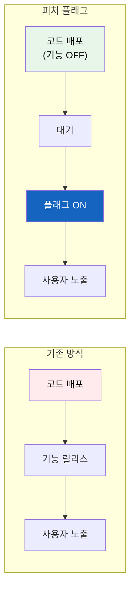
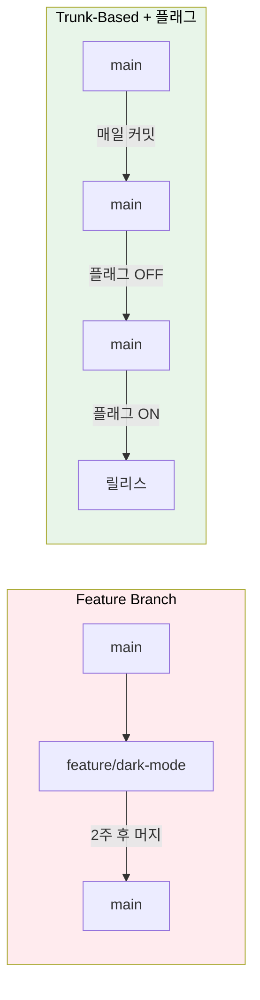
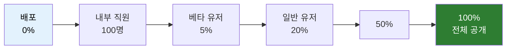

# 피처 플래그

금요일 오후 5시, 새 기능 배포가 예정되어 있다. 하지만 뭔가 불안하다. 문제가 생기면 주말 내내 고생해야 한다. 코드는 이미 준비됐는데, 월요일까지 기다려야 할까?

## 결론부터 말하면

**피처 플래그(Feature Flag)** 는 **코드 배포와 기능 릴리스를 분리** 하는 기술이다. 코드는 미리 배포해두고, 기능 활성화는 별도로 제어한다.



| 핵심 개념 | 설명 |
|----------|------|
| **배포 ≠ 릴리스** | 코드가 서버에 있어도 기능은 꺼둘 수 있음 |
| **런타임 제어** | 재배포 없이 기능 ON/OFF |
| **점진적 롤아웃** | 특정 사용자에게만 먼저 공개 |

---

## 1. 왜 피처 플래그가 필요한가?

### 1.1 배포의 두려움을 없앤다

피처 플래그 없이 배포하면 이런 상황이 벌어진다:

```
PM: "내일 출시해야 해요"
개발자: "근데 아직 QA가 안 끝났는데..."
PM: "일단 배포하고 보죠"
개발자: "문제 생기면 롤백해야 하는데, 다른 기능도 같이 롤백돼요"
PM: "..."
```

피처 플래그가 있으면:

```
개발자: "코드는 이미 배포해뒀어요. 플래그가 꺼져 있어서 아무도 못 봐요"
PM: "QA 끝나면 플래그만 켜면 되는 거죠?"
개발자: "네, 문제 생기면 플래그만 끄면 됩니다. 1초면 돼요"
```

### 1.2 피처 플래그의 용도

| 용도 | 설명 | 예시 |
|------|------|------|
| **릴리스 토글** | 미완성 기능 숨기기 | 개발 중인 다크모드 |
| **실험 토글** | A/B 테스트 | 결제 버튼 색상 실험 |
| **Ops 토글** | 운영 제어 | 트래픽 폭주 시 추천 기능 끄기 |
| **권한 토글** | 특정 사용자 기능 | 베타 테스터, 프리미엄 사용자 |

### 1.3 트렁크 기반 개발과의 관계

피처 플래그는 **트렁크 기반 개발(Trunk-Based Development)** 을 가능하게 한다:

| 방식 | 특징 | 문제점 |
|------|------|--------|
| **Feature Branch** | 기능별 브랜치, 완성 후 머지 | 머지 충돌, 오래된 브랜치 |
| **Trunk-Based + 피처 플래그** | main에 바로 커밋, 플래그로 숨김 | 플래그 관리 필요 |



---

## 2. 피처 플래그 구현

### 2.1 가장 단순한 형태

```python
# 환경 변수로 제어
import os

DARK_MODE_ENABLED = os.getenv("DARK_MODE_ENABLED", "false") == "true"

def get_theme():
    if DARK_MODE_ENABLED:
        return "dark"
    return "light"
```

**문제점:** 변경하려면 재배포 필요, 사용자별 제어 불가

### 2.2 설정 파일 기반

```python
# config/feature_flags.json
{
    "dark_mode": {
        "enabled": true,
        "percentage": 10,
        "allowed_users": ["user_123", "user_456"]
    }
}
```

```python
import json
import hashlib

class FeatureFlags:
    def __init__(self, config_path: str):
        with open(config_path) as f:
            self.flags = json.load(f)

    def is_enabled(self, flag_name: str, user_id: str = None) -> bool:
        flag = self.flags.get(flag_name, {})

        if not flag.get("enabled", False):
            return False

        # 특정 사용자 허용
        if user_id and user_id in flag.get("allowed_users", []):
            return True

        # 비율 기반 롤아웃
        percentage = flag.get("percentage", 100)
        if user_id:
            # flag_name 포함: 플래그마다 독립적인 사용자 분포 보장
            # hashlib 사용: 내장 hash()는 실행마다 결과가 달라질 수 있음
            key = f"{flag_name}:{user_id}"
            hash_value = int(hashlib.md5(key.encode()).hexdigest(), 16) % 100
            return hash_value < percentage

        # 익명 사용자: 100% 롤아웃일 때만 활성화
        return percentage == 100
```

### 2.3 Java/Spring 구현

```java
@Component
public class FeatureFlags {

    private final FeatureFlagRepository repository;

    // 주의: 실제 서비스에서는 매번 DB 조회 대신 인메모리 캐싱 필요
    // 백그라운드에서 주기적 갱신하거나 웹훅으로 변경사항 수신
    public boolean isEnabled(String flagName, String userId) {
        FeatureFlag flag = repository.findByName(flagName)
            .orElse(FeatureFlag.disabled());

        if (!flag.isEnabled()) {
            return false;
        }

        // 허용 목록 체크
        if (userId != null && flag.getAllowedUsers().contains(userId)) {
            return true;
        }

        // 비율 기반 롤아웃
        if (userId != null) {
            // flagName 포함: 플래그마다 독립적인 사용자 분포 보장
            // & 0x7fffffff: 음수 해시값을 양수로 변환 (hashCode()는 음수 반환 가능)
            String key = flagName + ":" + userId;
            int bucket = (key.hashCode() & 0x7fffffff) % 100;
            return bucket < flag.getPercentage();
        }

        // 익명 사용자: 100% 롤아웃일 때만 활성화
        return flag.getPercentage() == 100;
    }
}
```

**사용 예시:**

```java
@RestController
public class ThemeController {

    private final FeatureFlags featureFlags;

    @GetMapping("/theme")
    public String getTheme(@RequestHeader("X-User-Id") String userId) {
        if (featureFlags.isEnabled("dark_mode", userId)) {
            return "dark";
        }
        return "light";
    }
}
```

### 2.4 프론트엔드 구현

```javascript
// React 예시
import { useFeatureFlag } from './featureFlags';

function Navigation() {
    const isDarkModeEnabled = useFeatureFlag('dark_mode');

    return (
        <nav className={isDarkModeEnabled ? 'dark' : 'light'}>
            {/* ... */}
            {isDarkModeEnabled && (
                <button>다크모드 토글</button>
            )}
        </nav>
    );
}
```

---

## 3. 피처 플래그 관리 플랫폼

자체 구현도 가능하지만, 규모가 커지면 전용 플랫폼을 사용하는 것이 효율적이다.

### 3.1 주요 플랫폼 비교

| 플랫폼 | 특징 | 가격 |
|--------|------|------|
| **LaunchDarkly** | 업계 표준, 기능 풍부 | 유료 (엔터프라이즈) |
| **Unleash** | 오픈소스, 셀프호스팅 | 무료 / 유료 |
| **Flagsmith** | 오픈소스, 클라우드/셀프호스팅 | 무료 / 유료 |
| **ConfigCat** | 간단한 UI, 저렴 | 무료 티어 있음 |
| **자체 구축** | 완전한 통제 | 개발 비용 |

### 3.2 LaunchDarkly 예시

```javascript
// 초기화
import * as LaunchDarkly from 'launchdarkly-js-client-sdk';

const client = LaunchDarkly.initialize('YOUR_CLIENT_ID', {
    key: 'user_123',
    email: 'user@example.com',
    custom: {
        plan: 'premium'
    }
});

// 플래그 사용
client.on('ready', () => {
    const showNewFeature = client.variation('new-checkout-flow', false);

    if (showNewFeature) {
        renderNewCheckout();
    } else {
        renderOldCheckout();
    }
});
```

### 3.3 Unleash (오픈소스) 예시

```java
// Java SDK
import io.getunleash.Unleash;
import io.getunleash.DefaultUnleash;

Unleash unleash = new DefaultUnleash(
    UnleashConfig.builder()
        .appName("my-app")
        .unleashAPI("http://unleash-server/api")
        .build()
);

// 기본 사용
if (unleash.isEnabled("dark_mode")) {
    // 다크모드 로직
}

// 사용자 컨텍스트와 함께
UnleashContext context = UnleashContext.builder()
    .userId("user_123")
    .addProperty("plan", "premium")
    .build();

if (unleash.isEnabled("new_feature", context)) {
    // 새 기능 로직
}
```

---

## 4. 피처 플래그 활용 패턴

### 4.1 점진적 롤아웃



### 4.2 킬 스위치 (Kill Switch)

트래픽 폭주나 장애 시 특정 기능을 즉시 끄는 용도:

```python
class RecommendationService:
    def get_recommendations(self, user_id: str):
        # 킬 스위치가 켜져 있으면 빈 결과 반환
        if not feature_flags.is_enabled("recommendations_enabled"):
            return []

        # 무거운 추천 로직
        return self._compute_recommendations(user_id)
```

### 4.3 타겟팅 (Targeting)

특정 조건의 사용자에게만 기능 제공:

| 타겟팅 기준 | 예시 |
|------------|------|
| **사용자 ID** | 베타 테스터 그룹 |
| **이메일 도메인** | @company.com (내부 직원) |
| **지역** | 한국 사용자만 |
| **요금제** | 프리미엄 사용자만 |
| **디바이스** | iOS 앱 사용자만 |

```json
{
    "new_payment_method": {
        "enabled": true,
        "rules": [
            {
                "condition": "user.email endsWith '@company.com'",
                "value": true
            },
            {
                "condition": "user.country == 'KR' AND user.plan == 'premium'",
                "value": true
            },
            {
                "condition": "default",
                "value": false
            }
        ]
    }
}
```

> **참고:** 위와 같은 복잡한 조건 기반 타겟팅은 별도의 규칙 엔진을 구현하거나 LaunchDarkly, Unleash 같은 전문 플랫폼을 사용해야 한다. 앞서 소개한 간단한 자체 구현으로는 이런 고급 기능을 지원하기 어렵다.

---

## 5. 피처 플래그의 위험과 주의점

### 5.1 기술 부채가 된다

피처 플래그는 **임시** 여야 한다. 방치하면 코드가 복잡해진다:

```python
# ❌ 피처 플래그 지옥
def checkout(user, cart):
    if feature_flags.is_enabled("new_checkout_v1"):
        if feature_flags.is_enabled("new_checkout_v2"):
            if feature_flags.is_enabled("new_payment"):
                return new_checkout_v2_with_payment(user, cart)
            return new_checkout_v2(user, cart)
        return new_checkout_v1(user, cart)
    return old_checkout(user, cart)
```

### 5.2 플래그 생명주기 관리

| 단계 | 액션 |
|------|------|
| **생성** | 이름, 소유자, 만료일 지정 |
| **롤아웃** | 점진적 비율 증가 |
| **전체 공개** | 100% 도달 |
| **정리** | 코드에서 플래그 제거, 플래그 삭제 |


### 5.3 테스트 복잡성

피처 플래그는 테스트 조합을 늘린다:

| 플래그 수 | 조합 수 |
|----------|--------|
| 1개 | 2 |
| 5개 | 32 |
| 10개 | 1,024 |

**대응 방법:**
- 중요한 조합만 테스트
- 플래그별 독립적 테스트
- 오래된 플래그 적극 정리

### 5.4 동기화 문제

프론트엔드와 백엔드 플래그 상태가 다르면 문제 발생:


**해결책:**
- 백엔드를 먼저 켜고, 프론트엔드를 나중에 켜기
- 플래그 상태를 백엔드에서 프론트엔드로 전달

---

## 6. 정리

피처 플래그는 **배포 위험을 줄이고 릴리스를 유연하게** 만드는 강력한 도구다.

| 핵심 포인트 | 설명 |
|------------|------|
| **배포 ≠ 릴리스** | 코드 배포와 기능 공개를 분리 |
| **점진적 롤아웃** | 1% → 10% → 50% → 100% |
| **킬 스위치** | 문제 시 즉시 기능 비활성화 |
| **정리 필수** | 오래된 플래그는 기술 부채 |

> "피처 플래그는 안전벨트다. 있으면 안심이 되지만, 차에서 내릴 때는 풀어야 한다."

---

## 출처

- [Pete Hodgson - Feature Toggles (martinfowler.com)](https://martinfowler.com/articles/feature-toggles.html) - 피처 플래그의 바이블
- [LaunchDarkly - Feature Flag Guide](https://launchdarkly.com/blog/what-are-feature-flags/)
- [Unleash Documentation](https://docs.getunleash.io/)
