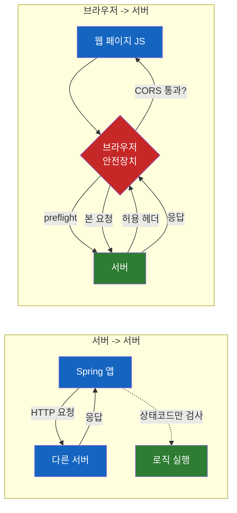
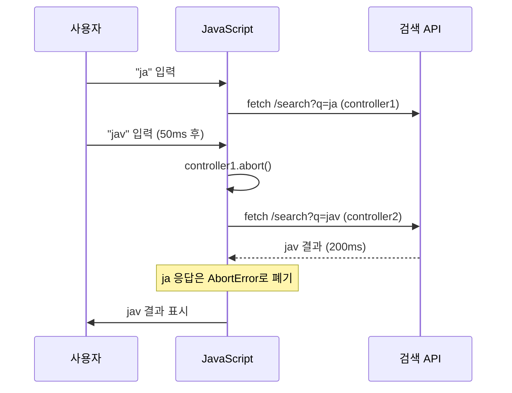
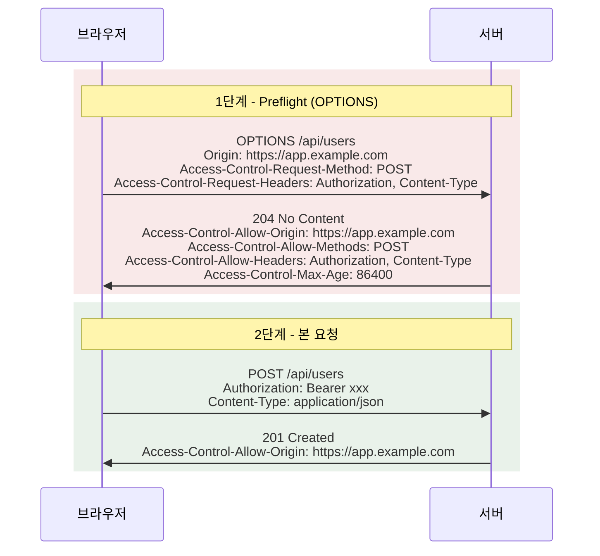

# Fetch, AbortController, CORS — 백엔드 개발자가 브라우저 HTTP를 만날 때

Spring으로 REST API는 자신 있는데, 정작 프론트엔드가 "CORS 에러가 떠요"라고 말하면 식은땀이 흐른 적 없는가? 브라우저의 HTTP 호출은 서버의 HTTP 호출과 다르다. 다른 게 너무 많다.

## 결론부터 말하면

**Fetch API는 브라우저의 HTTP 클라이언트, AbortController는 그 요청을 취소하는 리모컨, CORS는 브라우저가 cross-origin 응답을 JS에 노출할지 결정하는 보안 모델이다.** 셋 모두 "브라우저"라는 특수한 런타임이 만들어낸 제약에서 출발한다. Spring의 `RestTemplate`나 `WebClient`로 호출할 때는 만나지 않는 문제들이 브라우저에서는 매일 일어난다.



| 개념 | 한 줄 요약 | Spring에 비유하면 |
|------|-----------|-----------------|
| **Fetch API** | Promise 기반의 브라우저 HTTP 클라이언트 | `WebClient`의 브라우저 버전 |
| **AbortController** | 진행 중인 비동기 작업을 중단하는 표준 신호 | `Future.cancel(true)`의 일반화된 형태 |
| **CORS** | 브라우저가 cross-origin 응답을 JS에 보여줄지 결정 | Spring의 `CorsConfiguration`이 만드는 응답 헤더 |

## 1. 왜 브라우저 HTTP는 다른가?

서버에서 다른 서버로 HTTP를 호출할 때는 단순하다. Spring의 `RestTemplate` 또는 `WebClient.retrieve()` 기준으로, 한 줄만 호출하면 끝이다. 응답이 200이면 데이터를 받고, 4xx면 (라이브러리 기본 동작상) 예외가 던져진다. 그게 전부다.

그런데 브라우저는 다르다. 브라우저는 **누군가의 컴퓨터에서, 임의의 사이트가 띄운 코드를 실행한다.** 만약 `evil.com`이 띄운 페이지가 사용자의 로그인 쿠키로 `bank.com/api/transfer`를 마음대로 호출할 수 있다면? 인터넷이 망가진다.

그래서 브라우저에는 서버에 없는 두 가지 안전장치가 있다.

- **Same-Origin Policy (SOP)**: 다른 출처(origin)의 응답은 기본적으로 JavaScript에 노출하지 않는다.
- **CORS는 두 가지 방식으로 막는다**: 흔한 한 줄 요약("요청은 가지만 응답을 못 본다")은 **절반만 맞다.** 정확히는 요청 종류에 따라 동작이 다르다.

| 요청 종류 | 서버 도달 여부 | 차단 시점 |
|----------|--------------|----------|
| **Simple Request** (단순 GET 등) | ✅ 본 요청이 서버까지 감 | 응답이 와도 JS가 읽지 못하게 차단 |
| **Preflight 대상** (JSON POST 등) | ❌ preflight 실패 시 **본 요청은 안 감** | preflight `OPTIONS` 단계에서 차단 |

즉, **`application/json` POST가 CORS로 막혔다면 백엔드 로그에는 본 요청이 안 찍힌다.** OPTIONS만 찍힌다. 이 차이를 모르면 "분명히 호출했는데 서버에 안 왔다"며 시간을 허비하기 쉽다. preflight 개념은 4.2절에서 자세히 다룬다.

여기서 또 하나 짚을 점: **Simple Request의 경우 서버의 비즈니스 로직(DB 쓰기, 메일 발송 등)은 이미 실행된 후 브라우저가 응답만 막는다.** Preflight 대상 요청은 OPTIONS 차단으로 본 요청 도달이 부수적으로 막히긴 하지만, 이를 보안의 1차 방어선으로 의지해선 안 된다. **CORS는 본질적으로 서버를 보호하는 장치가 아니다.** `curl`·Postman·서버 간 통신에서는 CORS가 동작하지 않으므로, 인증·인가·CSRF 방어는 항상 CORS와 별개로 설계해야 한다. CORS는 "브라우저가 사용자를 위해 cross-origin 응답 데이터 노출을 통제"하는 것이지, "수상한 요청을 막아주는" 것이 아니다.

## 2. Fetch API — 브라우저의 HTTP 클라이언트

XMLHttpRequest 시대를 거쳐, Fetch API는 Promise 기반의 표준 HTTP 클라이언트로 자리잡았다.

```javascript
const res = await fetch('/api/users/1', {
  method: 'GET',
  headers: { 'Authorization': 'Bearer ...' },
  credentials: 'include',  // 쿠키도 함께 보낼지
});
const user = await res.json();
```

Spring 개발자가 가장 자주 헷갈리는 두 가지 동작이 있다.

### 2.1 Fetch는 4xx/5xx에서도 reject 하지 않는다

`RestTemplate`나 `WebClient`는 4xx/5xx 응답에서 예외를 던진다. Fetch는 다르다.

| 상황 | RestTemplate (Java) | Fetch API (JS) |
|------|-------------------|----------------|
| 200 OK | 정상 반환 | Promise resolve |
| 404 Not Found | `HttpClientErrorException` | **Promise resolve** (`res.ok === false`) |
| 500 Server Error | `HttpServerErrorException` | **Promise resolve** (`res.ok === false`) |
| 네트워크 단절 / DNS 실패 | `ResourceAccessException` | Promise reject (`TypeError`) |
| CORS 차단 | (해당 없음) | Promise reject (`TypeError`) |

즉, **HTTP 응답이 도착하기만 하면 Fetch의 Promise는 성공**이다. 상태 코드는 직접 검사해야 한다.

```javascript
const res = await fetch('/api/users/1');
if (!res.ok) throw new Error(`HTTP ${res.status}`);
```

이 차이를 모르고 `try-catch`만 쳐 두면, 404가 와도 그대로 다음 코드로 흘러간다. axios 같은 라이브러리를 많이 쓰는 이유 중 하나다.

### 2.2 응답 body는 한 번만 읽을 수 있다

`res.json()`을 두 번 호출하면 두 번째는 에러가 난다. 응답 body는 `ReadableStream`이라 소비되면 끝이다. 같은 응답을 두 번 다뤄야 한다면 `res.clone()`으로 복제해야 한다.

```javascript
const res = await fetch('/api/users/1');
const cloned = res.clone();

const json = await res.json();
const text = await cloned.text();  // 원본은 이미 소비됨
```

이는 Fetch가 Stream 기반이기 때문이다. 다음 절에서 보겠지만, 이 Stream은 AbortController로도 끊을 수 있다.

## 3. AbortController — 떠난 요청을 불러세우는 법

사용자가 검색창에 "ja"라고 치면 자동완성 요청이 나간다. "jav"를 추가로 치면 또 요청이 나간다. 첫 번째 요청이 두 번째보다 늦게 도착하면? **오래된 결과가 화면을 덮어버린다.**

Spring 환경에서는 이런 race condition을 만날 일이 거의 없다. 한 요청은 한 스레드 안에서 시작되고 끝난다. 하지만 브라우저는 사용자 인터랙션이 비동기로 쏟아진다. 매 키 입력마다 새 요청이 발생하고, 그것들이 순서를 어긋나 도착할 수 있다.

### 3.1 AbortController로 요청 취소하기

```javascript
let controller;

function search(query) {
  controller?.abort();          // 이전 요청 취소
  controller = new AbortController();

  fetch(`/api/search?q=${query}`, { signal: controller.signal })
    .then(res => res.json())
    .then(render)
    .catch(err => {
      if (err.name === 'AbortError') return;  // 정상적인 취소
      throw err;
    });
}
```

흐름을 그림으로 보면 이렇다.



`AbortSignal`은 fetch 전용이 아니다. **이벤트 리스너, Web Streams, 일부 라이브러리까지** 동일한 신호 객체로 취소할 수 있는 표준 메커니즘이다. Java의 `Future.cancel(true)`와 비슷하지만, Java는 Future마다 다르고 이건 하나의 신호로 여러 작업을 한꺼번에 끊을 수 있다.

### 3.2 타임아웃: AbortSignal.timeout()

타임아웃을 위해 직접 `setTimeout`으로 abort()를 호출할 필요가 없다. `AbortSignal.timeout()`은 MDN 기준 **Baseline 2024**(2024년 4월 이후 모든 메이저 브라우저에서 사용 가능)이므로, 구형 브라우저 지원이 필요한 환경이 아니라면 바로 쓸 수 있다.

참고로 `controller.abort()`로 끊었을 때는 reject 사유가 `AbortError`인 반면, `AbortSignal.timeout()`이 발동했을 때는 `TimeoutError`로 reject 된다. UX에서 "사용자 취소"와 "응답 지연"을 구분해 메시지를 다르게 보여주려면 이 차이를 분기 조건으로 쓸 수 있다.

```javascript
const res = await fetch('/api/slow', {
  signal: AbortSignal.timeout(3000)  // 3초 후 자동 abort
});
```

여러 신호를 합치고 싶을 때는 `AbortSignal.any([...])`로 묶을 수 있다. "사용자가 취소 버튼을 누르거나, 5초가 지나면 끊는다"가 한 줄로 표현된다.

```javascript
const userCancel = new AbortController();
fetch('/api/long', {
  signal: AbortSignal.any([userCancel.signal, AbortSignal.timeout(5000)])
});
```

여기까지가 브라우저 안에서 일어나는 이야기다. 이제 진짜 헷갈리는 부분, **브라우저와 서버 사이의 협상**으로 넘어가자.

## 4. CORS — 백엔드가 프론트와 가장 자주 부딪히는 곳

Spring `@CrossOrigin` 어노테이션 한 줄로 끝나는 것 같지만, 실제로는 **브라우저가 응답을 JS에 노출할지 말지 결정하는 프로토콜**이다. 이 프로토콜의 룰을 모르면 어노테이션을 붙여도 막히고, 안 붙여도 어떨 때는 통한다.

### 4.1 Origin이 다르다는 건 무엇인가

`https://app.example.com:443`에서 **scheme + host + port**의 조합을 origin이라 부른다. 셋 중 하나라도 다르면 cross-origin이다.

| 비교 대상 | 같은 origin? |
|----------|-------------|
| `https://example.com` ↔ `https://api.example.com` | ❌ (subdomain 다름 = host 다름) |
| `http://example.com` ↔ `https://example.com` | ❌ (scheme 다름) |
| `https://example.com` ↔ `https://example.com:8443` | ❌ (port 다름) |
| `https://example.com/a` ↔ `https://example.com/b` | ✅ (path는 origin에 포함 안 됨) |

로컬에서 `localhost:3000`(프론트)과 `localhost:8080`(Spring) 사이에 CORS 에러가 나는 이유가 이것이다. 같은 머신이지만 port가 달라 cross-origin이다.

### 4.2 Simple Request와 Preflight Request

CORS 요청은 두 종류로 갈린다.

**Simple Request** — 다음 조건을 모두 만족할 때만 preflight 없이 바로 본 요청이 나간다.
- 메서드: `GET`, `HEAD`, `POST` 중 하나
- 커스텀 헤더 없음 (`Accept`, `Accept-Language`, `Content-Language`, `Range`, 그리고 제한된 `Content-Type` 정도만 허용)
- `Content-Type`은 `application/x-www-form-urlencoded`, `multipart/form-data`, `text/plain` 중 하나

**Preflight Request** — 위 조건 하나라도 벗어나면, 브라우저는 본 요청 전에 `OPTIONS` 요청을 먼저 보내 서버에 "이런 요청 보내도 돼?" 하고 묻는다.

가장 흔한 함정: **`Content-Type: application/json`이나 `Authorization` 헤더를 추가하는 순간 preflight가 발동한다.** 즉, **모던 REST API 호출은 거의 모두 preflight 대상**이다.



여기서 두 가지 통찰이 따라온다.

1. **Preflight도 비용이다.** RTT가 두 배가 된다. `Access-Control-Max-Age`로 캐시할 수 있다 (Chrome 최대 2시간, Firefox 24시간).
2. **OPTIONS는 인증 없이 와야 한다.** 서버 보안 필터가 OPTIONS를 가로채 401을 던지면, 브라우저는 본 요청을 보내지도 않는다. Spring Security를 쓰는 환경에서 가장 흔한 함정이다.

### 4.3 백엔드가 응답해야 하는 헤더

| 응답 헤더 | 역할 |
|----------|------|
| `Access-Control-Allow-Origin` | 어떤 origin이 응답을 읽어도 되는지 |
| `Access-Control-Allow-Methods` | preflight: 허용할 메서드 |
| `Access-Control-Allow-Headers` | preflight: 허용할 커스텀 헤더 |
| `Access-Control-Allow-Credentials` | 쿠키/인증 정보를 함께 보낼 때 `true` |
| `Access-Control-Expose-Headers` | JS가 읽을 수 있는 응답 헤더 화이트리스트 |
| `Access-Control-Max-Age` | preflight 결과를 몇 초 캐시할지 |

기본적으로 JS는 응답에서 `Cache-Control`, `Content-Language`, `Content-Length`, `Content-Type`, `Expires`, `Last-Modified`, `Pragma` **이 7개 헤더만** 읽을 수 있다. 커스텀 헤더(예: `X-Total-Count` 페이지네이션 정보)를 읽게 하려면 `Access-Control-Expose-Headers`에 명시해야 한다. 페이지네이션 헤더가 안 보인다고 프론트가 당황하는 흔한 이유다.

### 4.4 Credentials의 함정 — 와일드카드는 통하지 않는다

`fetch(..., { credentials: 'include' })`로 쿠키나 `Authorization` 헤더를 함께 보내려면, **모든 credentials 응답에 공통으로 적용되는 조건**과 **preflight가 발동했을 때 추가로 적용되는 조건**을 구분해야 한다.

**모든 credentials 응답에 공통 (Simple Request 포함)**
1. `Access-Control-Allow-Credentials: true`
2. `Access-Control-Allow-Origin`은 **와일드카드(`*`) 사용 불가** — 정확한 origin을 그대로 echo

**Preflight가 발동한 경우 추가**
3. `Access-Control-Allow-Headers`도 `*` 사용 불가 — 허용할 헤더를 명시
4. `Access-Control-Allow-Methods`도 `*` 사용 불가 — 허용할 메서드를 명시

이 조합을 어기면 브라우저가 응답 자체를 차단하고, **응답에 실린 `Set-Cookie` 헤더도 함께 무시**되어 쿠키가 저장되지 않는다. cross-origin 로그인이 묵묵히 실패하는 흔한 이유다.

Spring에서 `setAllowedOrigins("*")`와 `setAllowCredentials(true)`를 동시에 쓰면 1·2번에서 막힌다. Spring 5.3 이후에는 `addAllowedOriginPattern("*")`으로 패턴 매칭 우회가 가능은 하지만, **운영에서는 `"*"` 패턴 자체를 피하고 신뢰하는 origin만 명시적으로 등록하는 것이 권장된다.** credentials 허용은 신뢰 범위를 크게 넓히기 때문이다.

추가로 운영에서는 origin을 동적으로 echo 할 때 **응답에 `Vary: Origin`을 함께 내려야** CDN·브라우저 캐시가 한 origin의 CORS 응답을 다른 origin에 잘못 재사용하지 않는다. Spring의 `CorsFilter`는 이 헤더를 자동으로 추가해 주지만, 직접 응답을 만드는 인터셉터·필터를 짜는 경우 빠뜨리기 쉬운 포인트다.

### 4.5 SameSite Cookie와 합쳐지면

크롬은 2020년 2월부터 쿠키의 `SameSite` 기본값이 `Lax`다. 즉, **cross-site 요청에서는 쿠키가 자동으로 빠진다.** CORS를 다 맞춰도 쿠키가 안 가는 이유가 이것이다.

cross-site 시나리오(`app.example.com` → `api.other.com` 같은 eTLD+1이 다른 경우)에서는:
- 서버가 쿠키 발급 시 `SameSite=None; Secure` 명시 (HTTPS 필수)
- 동시에 CORS의 credentials 조건도 만족

여기서 헷갈리는 부분: **same-site와 same-origin은 다르다.** `https://app.example.com`과 `https://api.example.com`은 cross-origin이지만 same-site다(eTLD+1 = `example.com`이 같고, 최신 브라우저의 Schemeful Same-Site 판정에 따라 scheme까지 같으므로 — `http`와 `https`가 섞이면 cross-site로 취급된다). 이 경우 `SameSite=Lax` 정책 자체가 쿠키를 막지는 않는다. 다만 쿠키가 실제로 전송되려면 다음 조건도 함께 만족해야 한다.

- Fetch가 cross-origin인 이상 `credentials: 'include'`를 명시해야 한다 (기본값 `same-origin`은 쿠키를 보내지 않는다).
- 쿠키의 `Domain` 범위가 요청 호스트를 포괄해야 한다. `api.example.com`이 직접 발급한 host-only 쿠키는 `api.example.com` 호출에는 잘 붙지만, 여러 서브도메인이 같은 쿠키를 공유해야 한다면 발급 시 `Domain=example.com`을 명시해야 한다.

또한 cross-site 시나리오에서는 브라우저별 제3자 쿠키 정책이 다르다. **Safari**는 ITP를 통해 기본 차단, **Firefox**는 추적용 쿠키를 차단하고 그 외엔 Total Cookie Protection으로 사이트별 격리, **Chrome**은 시크릿 모드와 사용자 설정 기반 차단을 유지(2025년 4월 Privacy Sandbox 업데이트로 기존 선택 방식을 유지하기로 결정). 따라서 `SameSite=None; Secure`만으로 부족할 수 있다. 임베디드 위젯·iframe 같은 partitioned context에서는 `Partitioned` 속성(CHIPS, Cookies Having Independent Partitioned State)을 함께 붙여 top-level site별로 격리된 쿠키 jar에 저장되도록 해야 한다.

즉 "SameSite 때문에 막히지는 않지만, fetch credentials 옵션과 쿠키 Domain 범위는 별개로 챙겨야 한다." 같은 회사의 서브도메인 분리에서는 *SameSite는 신경 안 써도* CORS와 쿠키 범위는 여전히 풀어야 할 숙제다.

## 5. 실전 — Spring 백엔드 + 브라우저 Fetch

CORS 에러를 디버깅할 때 봐야 할 순서대로 정리하면:

### 5.1 브라우저 콘솔 메시지로 원인 분리

| 콘솔 메시지 | 원인 |
|------------|------|
| `No 'Access-Control-Allow-Origin' header is present` | 서버가 CORS 헤더를 안 내려줌 |
| `... does not allow request header field authorization` | preflight 응답에 `Access-Control-Allow-Headers: Authorization` 누락 |
| `... allow credentials, but the response header ... is '*'` | credentials 모드에서 와일드카드 사용 |
| `Cross-Origin Request Blocked: ... (Reason: CORS preflight response did not succeed)` | preflight OPTIONS가 4xx/5xx — 보통 인증 필터가 가로챔 |

### 5.2 Spring Security + CORS 표준 설정

```java
@Configuration
public class WebConfig {

    @Bean
    CorsConfigurationSource corsConfigurationSource() {
        CorsConfiguration config = new CorsConfiguration();
        config.setAllowedOriginPatterns(List.of("https://app.example.com"));
        config.setAllowedMethods(List.of("GET", "POST", "PUT", "DELETE", "PATCH"));
        config.setAllowedHeaders(List.of("Authorization", "Content-Type"));
        config.setExposedHeaders(List.of("X-Total-Count"));
        config.setAllowCredentials(true);
        config.setMaxAge(3600L);

        UrlBasedCorsConfigurationSource source = new UrlBasedCorsConfigurationSource();
        source.registerCorsConfiguration("/api/**", config);
        return source;
    }

    @Bean
    SecurityFilterChain filterChain(HttpSecurity http) throws Exception {
        return http
            .cors(Customizer.withDefaults())  // CorsConfigurationSource 자동 사용
            .authorizeHttpRequests(auth -> auth
                .requestMatchers(HttpMethod.OPTIONS, "/**").permitAll()  // 핵심
                .anyRequest().authenticated()
            )
            .build();
    }
}
```

핵심은 `OPTIONS` 메서드를 인증 없이 통과시키는 것이다. Spring Security 6의 `cors()` 활성화는 내부적으로 `CorsFilter`를 SecurityFilterChain의 가장 앞에 두므로, 위 설정이면 대부분의 경우 OPTIONS가 안전하게 처리된다.

### 5.3 프론트에서 fetch로 호출

```javascript
async function createUser(payload) {
  const controller = new AbortController();
  const timeoutId = setTimeout(() => controller.abort(), 5000);

  try {
    const res = await fetch('https://api.example.com/api/users', {
      method: 'POST',
      headers: {
        'Content-Type': 'application/json',
        'Authorization': `Bearer ${getToken()}`,
      },
      credentials: 'include',
      body: JSON.stringify(payload),
      signal: controller.signal,
    });

    if (!res.ok) {
      const problem = await res.json();  // RFC 7807 Problem Details
      throw new ApiError(res.status, problem);
    }

    return await res.json();
  } catch (err) {
    if (err.name === 'AbortError') throw new Error('요청 시간 초과');
    throw err;
  } finally {
    clearTimeout(timeoutId);
  }
}
```

이 한 함수에 지금까지 다룬 모든 게 들어 있다. Fetch의 응답 검사 패턴, AbortController로 타임아웃, CORS credentials 모드, 그리고 4xx 응답을 직접 던지는 처리까지.

## 6. 정리

브라우저 HTTP는 서버 HTTP에 두 겹의 막을 더한 것이다. **Promise 기반 Fetch가 한 겹**, **CORS라는 보안 모델이 또 한 겹**. AbortController는 그 위에서 비동기 사용자 인터랙션이 만드는 race condition을 다스리는 도구다.

| 핵심 원칙 | 한 줄로 |
|----------|--------|
| Fetch는 4xx/5xx에서 reject 안 한다 | `res.ok` 검사 필수 |
| AbortController는 표준 취소 신호다 | `AbortSignal.timeout()`, `any()`로 합성 가능 |
| Simple Request는 도달, Preflight 대상은 차단 시 본 요청 미전송 | JSON POST가 막히면 서버 로그에 OPTIONS만 찍힌다 |
| `application/json` + `Authorization`은 항상 preflight | `OPTIONS`를 인증 없이 통과시켜라 |
| credentials 모드에서는 와일드카드 금지 | origin·헤더·메서드 모두 명시 |
| same-site ≠ same-origin | 서브도메인 분리는 SameSite만으로는 막히지 않음 (credentials·Domain 별도) |

백엔드 개발자가 이 6줄을 머리에 넣고 프론트와 협업하면, "왜 안 되지?"의 90%가 첫 5분 안에 풀린다.

## 출처

- [MDN — Fetch API](https://developer.mozilla.org/en-US/docs/Web/API/Fetch_API)
- [MDN — AbortController](https://developer.mozilla.org/en-US/docs/Web/API/AbortController)
- [MDN — AbortSignal: timeout()](https://developer.mozilla.org/en-US/docs/Web/API/AbortSignal/timeout_static)
- [MDN — Cross-Origin Resource Sharing (CORS)](https://developer.mozilla.org/en-US/docs/Web/HTTP/Guides/CORS)
- [MDN — SameSite cookies](https://developer.mozilla.org/en-US/docs/Web/HTTP/Guides/Cookies/Samesite)
- [WHATWG Fetch Standard](https://fetch.spec.whatwg.org/)
- [Spring Framework Reference — CORS](https://docs.spring.io/spring-framework/reference/web/webmvc-cors.html)
