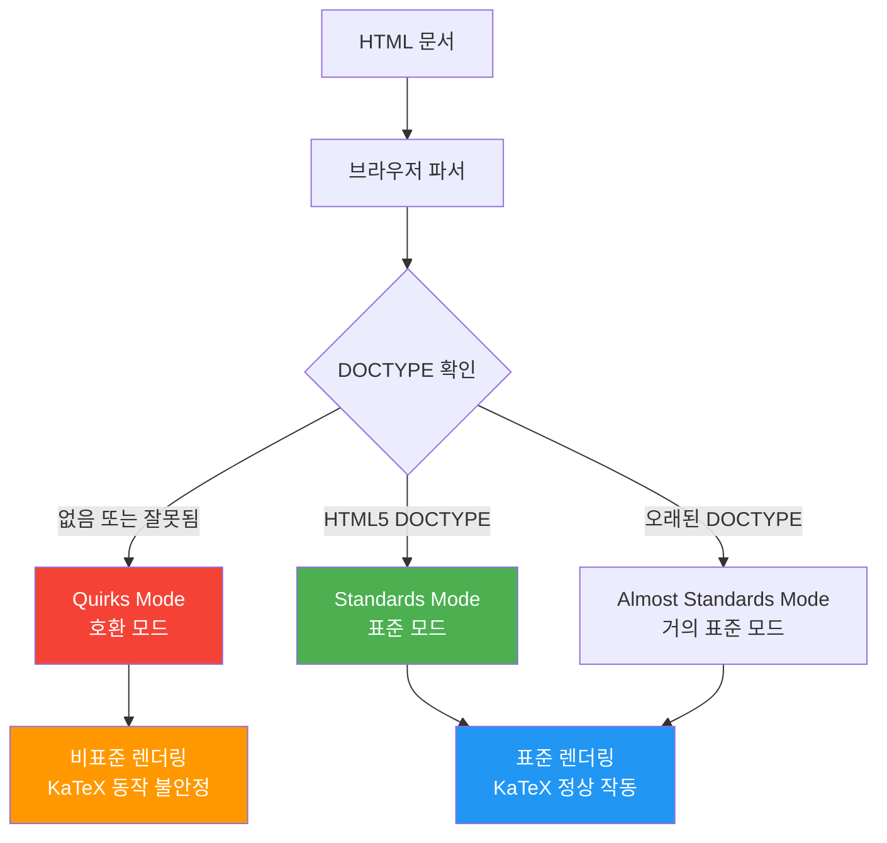
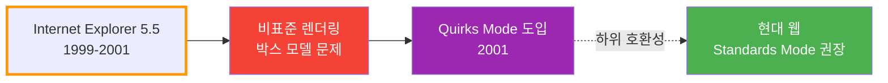
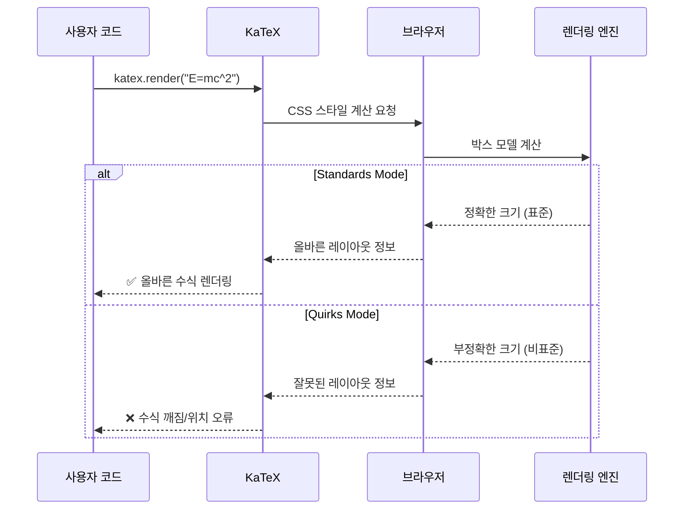

# KaTeX Quirks Mode 경고 해결

KaTeX 사용 시 발생하는 "quirks mode" 경고의 원인과 해결 방법

## 결론부터 말하면

**KaTeX quirks mode 경고는 HTML 문서에 `<!DOCTYPE html>` 선언이 누락되어 발생합니다.**
브라우저가 표준 모드가 아닌 quirks mode로 렌더링하면 KaTeX가 제대로 작동하지 않을 수 있습니다.

```html
<!-- Before: DOCTYPE 누락 (Quirks Mode) -->
<html>
<head>
    <link rel="stylesheet" href="katex.min.css">
    <script src="katex.min.js"></script>
</head>
<body>
    <div id="math"></div>
    <!-- ⚠️ Warning: KaTeX doesn't work in quirks mode -->
</body>
</html>

<!-- After: DOCTYPE 추가 (Standards Mode) -->
<!DOCTYPE html>
<html>
<head>
    <link rel="stylesheet" href="katex.min.css">
    <script src="katex.min.js"></script>
</head>
<body>
    <div id="math"></div>
    <!-- ✅ KaTeX 정상 작동 -->
</body>
</html>
```

## 1. Quirks Mode란?

### 1.1 브라우저 렌더링 모드

**브라우저는 HTML 문서를 3가지 모드 중 하나로 렌더링합니다:**



| 모드 | 설명 | DOCTYPE | 동작 |
|------|------|---------|------|
| **Quirks Mode** | 호환 모드 | 없음 또는 잘못됨 | 오래된 브라우저 동작 모방 (IE 5.5) |
| **Almost Standards Mode** | 거의 표준 모드 | 오래된 DOCTYPE | 표준 모드 + 일부 비표준 동작 |
| **Standards Mode** | 표준 모드 | HTML5 DOCTYPE | 최신 웹 표준 준수 |

### 1.2 Quirks Mode의 역사



**배경:**
- 1990년대 후반~2000년대 초반, 브라우저마다 HTML/CSS 해석이 달랐음
- 특히 Internet Explorer 5.5의 **잘못된 박스 모델** (box model) 구현
- 기존 웹사이트들이 IE의 비표준 동작에 맞춰 제작됨
- 브라우저가 표준을 따르면 기존 사이트들이 깨짐
- **해결책**: DOCTYPE 유무로 렌더링 모드 전환
  - DOCTYPE 있음 → Standards Mode (표준 준수)
  - DOCTYPE 없음 → Quirks Mode (IE 5.5 흉내)

### 1.3 Quirks Mode의 문제점

```javascript
// Quirks Mode에서 발생하는 문제들

// 1. 박스 모델 계산 오류
// Standards Mode: width = content width
// Quirks Mode: width = content + padding + border

// 2. CSS 선택자 대소문자 구분
// Standards Mode: 대소문자 구분
// Quirks Mode: 대소문자 무시

// 3. 단위 없는 숫자 처리
// Standards Mode: 에러
// Quirks Mode: px로 간주

// 4. vertical-align 기본값
// Standards Mode: baseline
// Quirks Mode: bottom
```

## 2. KaTeX와 Quirks Mode

### 2.1 KaTeX가 Quirks Mode에서 동작하지 않는 이유

**KaTeX는 정밀한 CSS 레이아웃과 박스 모델 계산에 의존합니다.**



**구체적인 문제:**

1. **박스 모델 계산 오류**
   ```
   Standards Mode: 괄호 높이 = 20px (정확)
   Quirks Mode: 괄호 높이 = 24px (padding 포함, 부정확)
   → 수식 요소들의 정렬이 어긋남
   ```

2. **폰트 크기 계산 오류**
   ```
   Standards Mode: em 단위 계산 정확
   Quirks Mode: em 단위 계산 부정확
   → 분수, 위첨자, 아래첨자 크기 이상
   ```

3. **Vertical Alignment 오류**
   ```
   Standards Mode: 베이스라인 기준 정렬
   Quirks Mode: 비표준 정렬
   → 수식 요소들의 수직 위치 틀어짐
   ```

### 2.2 실제 렌더링 차이 예시

```html
<!-- 같은 수식을 렌더링해도 결과가 다름 -->

<!-- Standards Mode -->
<!DOCTYPE html>
<html>
<body>
    <div id="math"></div>
    <script>
        katex.render("\\frac{a}{b}", document.getElementById("math"));
        // ✅ 올바른 렌더링:
        //    a
        //   ---
        //    b
    </script>
</body>
</html>

<!-- Quirks Mode -->
<html>
<body>
    <div id="math"></div>
    <script>
        katex.render("\\frac{a}{b}", document.getElementById("math"));
        // ❌ 틀어진 렌더링:
        //   a
        //  ----
        //     b  (위치가 어긋남)
    </script>
</body>
</html>
```

## 3. 경고가 발생하는 원인

### 3.1 DOCTYPE 누락

```html
<!-- ❌ 나쁜 예: DOCTYPE 없음 -->
<html>
<head>
    <title>KaTeX Example</title>
</head>
<body>
    <!-- Quirks Mode로 렌더링됨 -->
</body>
</html>

<!-- ✅ 좋은 예: DOCTYPE 있음 -->
<!DOCTYPE html>
<html>
<head>
    <title>KaTeX Example</title>
</head>
<body>
    <!-- Standards Mode로 렌더링됨 -->
</body>
</html>
```

### 3.2 잘못된 DOCTYPE

```html
<!-- ❌ 나쁜 예: HTML 4.01 Transitional (오래된 DOCTYPE) -->
<!DOCTYPE HTML PUBLIC "-//W3C//DTD HTML 4.01 Transitional//EN"
"http://www.w3.org/TR/html4/loose.dtd">
<html>
<!-- Almost Standards Mode 또는 Quirks Mode -->
</html>

<!-- ❌ 나쁨: XHTML 1.0 (오래된 DOCTYPE) -->
<!DOCTYPE html PUBLIC "-//W3C//DTD XHTML 1.0 Strict//EN"
"http://www.w3.org/TR/xhtml1/DTD/xhtml1-strict.dtd">
<html xmlns="http://www.w3.org/1999/xhtml">
<!-- Almost Standards Mode -->
</html>

<!-- ✅ 좋은 예: HTML5 DOCTYPE (최신) -->
<!DOCTYPE html>
<html>
<!-- Standards Mode -->
</html>
```

### 3.3 DOCTYPE 전 공백/주석

```html
<!-- ❌ 나쁜 예: DOCTYPE 앞에 공백 -->

<!DOCTYPE html>
<html>
<!-- 일부 브라우저에서 Quirks Mode로 인식될 수 있음 -->
</html>

<!-- ❌ 나쁜 예: DOCTYPE 앞에 주석 -->
<!-- 이 사이트는 수학 공식을 표시합니다 -->
<!DOCTYPE html>
<html>
<!-- IE 구버전에서 Quirks Mode로 인식됨 -->
</html>

<!-- ✅ 좋은 예: DOCTYPE가 첫 줄 -->
<!DOCTYPE html>
<html>
<!-- Standards Mode 보장 -->
</html>
```

## 4. 해결 방법

### 4.1 기본 해결책

```html
<!DOCTYPE html>
<html lang="ko">
<head>
    <meta charset="UTF-8">
    <meta name="viewport" content="width=device-width, initial-scale=1.0">
    <title>KaTeX Example</title>

    <!-- KaTeX CSS -->
    <link rel="stylesheet" href="https://cdn.jsdelivr.net/npm/katex@0.16.9/dist/katex.min.css">

    <!-- KaTeX JS -->
    <script defer src="https://cdn.jsdelivr.net/npm/katex@0.16.9/dist/katex.min.js"></script>
</head>
<body>
    <h1>수학 공식</h1>
    <div id="math"></div>

    <script>
        // KaTeX 렌더링
        katex.render("E = mc^2", document.getElementById("math"));
        // ✅ Standards Mode에서 정상 작동
    </script>
</body>
</html>
```

### 4.2 React에서의 해결

```jsx
// public/index.html (Create React App)
<!DOCTYPE html>
<html lang="ko">
  <head>
    <meta charset="utf-8" />
    <link rel="icon" href="%PUBLIC_URL%/favicon.ico" />
    <meta name="viewport" content="width=device-width, initial-scale=1" />

    <!-- KaTeX CSS -->
    <link
      rel="stylesheet"
      href="https://cdn.jsdelivr.net/npm/katex@0.16.9/dist/katex.min.css"
    />

    <title>React KaTeX App</title>
  </head>
  <body>
    <noscript>You need to enable JavaScript to run this app.</noscript>
    <div id="root"></div>
  </body>
</html>
```

```jsx
// src/MathComponent.jsx
import 'katex/dist/katex.min.css';
import { InlineMath, BlockMath } from 'react-katex';

function MathComponent() {
  return (
    <div>
      <h1>수학 공식</h1>

      {/* 인라인 수식 */}
      <p>
        아인슈타인의 방정식: <InlineMath math="E = mc^2" />
      </p>

      {/* 블록 수식 */}
      <BlockMath math="\int_{-\infty}^{\infty} e^{-x^2} dx = \sqrt{\pi}" />

      {/* ✅ DOCTYPE이 올바르면 정상 작동 */}
    </div>
  );
}

export default MathComponent;
```

### 4.3 Next.js에서의 해결

```jsx
// pages/_document.js
import { Html, Head, Main, NextScript } from 'next/document'

export default function Document() {
  return (
    <Html lang="ko">
      {/* Next.js가 자동으로 <!DOCTYPE html>을 추가함 */}
      <Head>
        {/* KaTeX CSS */}
        <link
          rel="stylesheet"
          href="https://cdn.jsdelivr.net/npm/katex@0.16.9/dist/katex.min.css"
        />
      </Head>
      <body>
        <Main />
        <NextScript />
      </body>
    </Html>
  )
}
```

```jsx
// pages/index.js
import 'katex/dist/katex.min.css';
import { InlineMath, BlockMath } from 'react-katex';

export default function Home() {
  return (
    <div>
      <h1>수학 공식</h1>
      <BlockMath math="\sum_{i=1}^{n} i = \frac{n(n+1)}{2}" />
      {/* ✅ Next.js가 자동으로 Standards Mode 보장 */}
    </div>
  );
}
```

### 4.4 Markdown 렌더러에서의 해결

```html
<!-- marked.js + KaTeX 사용 시 -->
<!DOCTYPE html>
<html lang="ko">
<head>
    <meta charset="UTF-8">
    <title>Markdown with KaTeX</title>

    <!-- KaTeX CSS -->
    <link rel="stylesheet" href="https://cdn.jsdelivr.net/npm/katex@0.16.9/dist/katex.min.css">

    <!-- marked.js -->
    <script src="https://cdn.jsdelivr.net/npm/marked/marked.min.js"></script>

    <!-- KaTeX -->
    <script src="https://cdn.jsdelivr.net/npm/katex@0.16.9/dist/katex.min.js"></script>
</head>
<body>
    <div id="content"></div>

    <script>
        const markdown = `
# 수학 공식 예제

인라인 수식: $E = mc^2$

블록 수식:

$$
\\int_{-\\infty}^{\\infty} e^{-x^2} dx = \\sqrt{\\pi}
$$
        `;

        // Markdown 렌더링
        const html = marked.parse(markdown);

        // 수식 부분을 KaTeX로 렌더링
        const rendered = html.replace(
            /\$\$([\s\S]+?)\$\$/g,
            (match, math) => {
                try {
                    return katex.renderToString(math.trim(), {
                        displayMode: true
                    });
                } catch (e) {
                    return match;
                }
            }
        ).replace(
            /\$([^\$]+?)\$/g,
            (match, math) => {
                try {
                    return katex.renderToString(math.trim(), {
                        displayMode: false
                    });
                } catch (e) {
                    return match;
                }
            }
        );

        document.getElementById('content').innerHTML = rendered;
        // ✅ DOCTYPE이 올바르면 정상 작동
    </script>
</body>
</html>
```

## 5. iframe 주의사항

### 5.1 iframe은 부모 DOCTYPE을 상속하지 않음

**중요한 사실: iframe 내부 문서는 독립적인 문서이므로 자체 DOCTYPE이 필요합니다.**

```html
<!-- 부모 페이지 -->
<!DOCTYPE html>
<html>
<head>
    <title>Parent Page</title>
</head>
<body>
    <h1>부모 페이지 (Standards Mode)</h1>

    <!-- iframe -->
    <iframe src="math.html" width="800" height="400"></iframe>

    <!-- ❌ iframe 내부는 부모의 DOCTYPE을 상속하지 않음! -->
</body>
</html>
```

### 5.2 잘못된 iframe 사용

```html
<!-- math.html (잘못된 예) -->
<!-- ❌ DOCTYPE 없음 → Quirks Mode -->
<html>
<head>
    <link rel="stylesheet" href="katex.min.css">
    <script src="katex.min.js"></script>
</head>
<body>
    <div id="math"></div>
    <script>
        katex.render("E = mc^2", document.getElementById("math"));
        // ⚠️ Warning: KaTeX doesn't work in quirks mode
    </script>
</body>
</html>
```

### 5.3 올바른 iframe 사용

```html
<!-- math.html (올바른 예) -->
<!DOCTYPE html>
<html>
<head>
    <meta charset="UTF-8">
    <title>Math</title>
    <link rel="stylesheet" href="https://cdn.jsdelivr.net/npm/katex@0.16.9/dist/katex.min.css">
    <script src="https://cdn.jsdelivr.net/npm/katex@0.16.9/dist/katex.min.js"></script>
</head>
<body>
    <div id="math"></div>
    <script>
        katex.render("E = mc^2", document.getElementById("math"));
        // ✅ 정상 작동
    </script>
</body>
</html>
```

### 5.4 동적 iframe 생성

```javascript
// JavaScript로 iframe을 동적 생성하는 경우
function createMathIframe() {
    const iframe = document.createElement('iframe');
    document.body.appendChild(iframe);

    // iframe 내부 문서 작성
    const doc = iframe.contentDocument || iframe.contentWindow.document;

    // ✅ DOCTYPE 명시적으로 추가
    doc.open();
    doc.write(`
<!DOCTYPE html>
<html>
<head>
    <meta charset="UTF-8">
    <link rel="stylesheet" href="https://cdn.jsdelivr.net/npm/katex@0.16.9/dist/katex.min.css">
    <script src="https://cdn.jsdelivr.net/npm/katex@0.16.9/dist/katex.min.js"><\/script>
</head>
<body>
    <div id="math"></div>
    <script>
        katex.render("\\\\frac{a}{b}", document.getElementById("math"));
    <\/script>
</body>
</html>
    `);
    doc.close();
}

// 사용
createMathIframe();
```

### 5.5 srcdoc 속성 사용

```html
<!-- srcdoc으로 inline HTML 제공 -->
<iframe srcdoc="
<!DOCTYPE html>
<html>
<head>
    <link rel='stylesheet' href='https://cdn.jsdelivr.net/npm/katex@0.16.9/dist/katex.min.css'>
    <script src='https://cdn.jsdelivr.net/npm/katex@0.16.9/dist/katex.min.js'></script>
</head>
<body>
    <div id='math'></div>
    <script>
        katex.render('E = mc^2', document.getElementById('math'));
    </script>
</body>
</html>
" width="800" height="200"></iframe>

<!-- ✅ DOCTYPE 포함으로 Standards Mode 보장 -->
```

## 6. 현재 렌더링 모드 확인 방법

### 6.1 JavaScript로 확인

```javascript
// 브라우저 콘솔에서 실행
console.log(document.compatMode);

// "CSS1Compat" → Standards Mode (정상)
// "BackCompat" → Quirks Mode (문제!)
```

### 6.2 개발자 도구로 확인

```javascript
// 페이지 로드 후 실행
function checkRenderingMode() {
    const mode = document.compatMode;

    if (mode === "CSS1Compat") {
        console.log("✅ Standards Mode - KaTeX 정상 작동 가능");
        return "standards";
    } else if (mode === "BackCompat") {
        console.warn("⚠️ Quirks Mode - KaTeX 동작 불안정");
        console.warn("해결: HTML 문서 첫 줄에 <!DOCTYPE html> 추가");
        return "quirks";
    }
}

// 사용
checkRenderingMode();
```

### 6.3 자동 경고 시스템

```javascript
// 페이지 로드 시 자동으로 검사
document.addEventListener('DOMContentLoaded', () => {
    if (document.compatMode === "BackCompat") {
        // 페이지 상단에 경고 표시
        const warning = document.createElement('div');
        warning.style.cssText = `
            position: fixed;
            top: 0;
            left: 0;
            right: 0;
            background: #ff5252;
            color: white;
            padding: 10px;
            text-align: center;
            font-weight: bold;
            z-index: 9999;
        `;
        warning.textContent = '⚠️ 이 페이지는 Quirks Mode로 실행 중입니다. DOCTYPE을 추가하세요!';
        document.body.insertBefore(warning, document.body.firstChild);

        // 콘솔에도 출력
        console.error('Quirks Mode 감지! DOCTYPE을 추가하세요:');
        console.error('<!DOCTYPE html>');
    }
});
```

## 7. 실전 예제

### 7.1 수학 노트 애플리케이션

```html
<!DOCTYPE html>
<html lang="ko">
<head>
    <meta charset="UTF-8">
    <meta name="viewport" content="width=device-width, initial-scale=1.0">
    <title>수학 노트</title>

    <!-- KaTeX CSS -->
    <link rel="stylesheet" href="https://cdn.jsdelivr.net/npm/katex@0.16.9/dist/katex.min.css">

    <!-- KaTeX Auto-render -->
    <link rel="stylesheet" href="https://cdn.jsdelivr.net/npm/katex@0.16.9/dist/contrib/auto-render.min.css">
    <script defer src="https://cdn.jsdelivr.net/npm/katex@0.16.9/dist/katex.min.js"></script>
    <script defer src="https://cdn.jsdelivr.net/npm/katex@0.16.9/dist/contrib/auto-render.min.js"></script>

    <style>
        body {
            font-family: 'Segoe UI', sans-serif;
            max-width: 800px;
            margin: 40px auto;
            padding: 20px;
            line-height: 1.6;
        }

        .math-note {
            background: #f5f5f5;
            padding: 20px;
            border-radius: 8px;
            margin: 20px 0;
        }

        h1 {
            color: #333;
            border-bottom: 2px solid #4CAF50;
            padding-bottom: 10px;
        }
    </style>
</head>
<body>
    <h1>📐 수학 공식 노트</h1>

    <div class="math-note">
        <h2>1. 이차방정식의 해</h2>
        <p>
            일반적인 이차방정식 $ax^2 + bx + c = 0$의 해는 다음과 같습니다:
        </p>
        <p>
            $$x = \frac{-b \pm \sqrt{b^2 - 4ac}}{2a}$$
        </p>
    </div>

    <div class="math-note">
        <h2>2. 삼각함수 항등식</h2>
        <p>
            기본 삼각함수 항등식:
        </p>
        <p>
            $$\sin^2\theta + \cos^2\theta = 1$$
        </p>
        <p>
            $$\tan\theta = \frac{\sin\theta}{\cos\theta}$$
        </p>
    </div>

    <div class="math-note">
        <h2>3. 적분 공식</h2>
        <p>
            정규분포의 적분:
        </p>
        <p>
            $$\int_{-\infty}^{\infty} e^{-x^2} dx = \sqrt{\pi}$$
        </p>
    </div>

    <script>
        // 페이지 로드 후 수식 자동 렌더링
        document.addEventListener("DOMContentLoaded", function() {
            renderMathInElement(document.body, {
                delimiters: [
                    {left: "$$", right: "$$", display: true},
                    {left: "$", right: "$", display: false}
                ]
            });
        });
    </script>
</body>
</html>
```

### 7.2 온라인 수식 편집기

```html
<!DOCTYPE html>
<html lang="ko">
<head>
    <meta charset="UTF-8">
    <meta name="viewport" content="width=device-width, initial-scale=1.0">
    <title>수식 편집기</title>

    <link rel="stylesheet" href="https://cdn.jsdelivr.net/npm/katex@0.16.9/dist/katex.min.css">
    <script src="https://cdn.jsdelivr.net/npm/katex@0.16.9/dist/katex.min.js"></script>

    <style>
        body {
            font-family: Arial, sans-serif;
            max-width: 900px;
            margin: 40px auto;
            padding: 20px;
        }

        .editor-container {
            display: grid;
            grid-template-columns: 1fr 1fr;
            gap: 20px;
            margin-top: 20px;
        }

        textarea {
            width: 100%;
            height: 200px;
            padding: 10px;
            font-family: monospace;
            font-size: 14px;
            border: 1px solid #ddd;
            border-radius: 4px;
        }

        .preview {
            padding: 20px;
            border: 1px solid #ddd;
            border-radius: 4px;
            background: #f9f9f9;
            min-height: 200px;
            font-size: 18px;
        }

        .mode-indicator {
            padding: 10px;
            border-radius: 4px;
            margin-bottom: 20px;
            font-weight: bold;
        }

        .standards-mode {
            background: #4CAF50;
            color: white;
        }

        .quirks-mode {
            background: #f44336;
            color: white;
        }
    </style>
</head>
<body>
    <h1>🧮 LaTeX 수식 편집기</h1>

    <div id="mode-indicator" class="mode-indicator"></div>

    <div class="editor-container">
        <div>
            <h3>LaTeX 입력</h3>
            <textarea id="latex-input" placeholder="LaTeX 수식을 입력하세요...
예: \frac{a}{b}
예: \sum_{i=1}^{n} i^2
예: \int_0^1 x^2 dx">E = mc^2</textarea>
        </div>

        <div>
            <h3>미리보기</h3>
            <div id="preview" class="preview"></div>
        </div>
    </div>

    <script>
        // 렌더링 모드 확인
        function checkMode() {
            const indicator = document.getElementById('mode-indicator');
            if (document.compatMode === 'CSS1Compat') {
                indicator.className = 'mode-indicator standards-mode';
                indicator.textContent = '✅ Standards Mode - KaTeX 정상 작동';
            } else {
                indicator.className = 'mode-indicator quirks-mode';
                indicator.textContent = '⚠️ Quirks Mode - DOCTYPE을 추가하세요!';
            }
        }

        // 수식 렌더링
        function renderFormula() {
            const input = document.getElementById('latex-input');
            const preview = document.getElementById('preview');

            try {
                katex.render(input.value, preview, {
                    displayMode: true,
                    throwOnError: false,
                    errorColor: '#cc0000'
                });
            } catch (e) {
                preview.textContent = '에러: ' + e.message;
                preview.style.color = '#cc0000';
            }
        }

        // 이벤트 리스너
        document.addEventListener('DOMContentLoaded', () => {
            checkMode();
            renderFormula();

            document.getElementById('latex-input').addEventListener('input', renderFormula);
        });
    </script>
</body>
</html>
```

### 7.3 Vue.js 수식 컴포넌트

```vue
<!-- MathFormula.vue -->
<template>
  <div class="math-formula">
    <div v-if="isQuirksMode" class="warning">
      ⚠️ Quirks Mode 감지! DOCTYPE을 확인하세요.
    </div>

    <div ref="mathEl" class="math-content"></div>
  </div>
</template>

<script setup>
import { ref, onMounted, watch } from 'vue'
import katex from 'katex'
import 'katex/dist/katex.min.css'

const props = defineProps({
  formula: {
    type: String,
    required: true
  },
  displayMode: {
    type: Boolean,
    default: true
  }
})

const mathEl = ref(null)
const isQuirksMode = ref(false)

// 렌더링 모드 확인
function checkRenderingMode() {
  isQuirksMode.value = document.compatMode !== 'CSS1Compat'
  if (isQuirksMode.value) {
    console.warn('⚠️ Quirks Mode 감지! <!DOCTYPE html>을 추가하세요.')
  }
}

// 수식 렌더링
function renderFormula() {
  if (!mathEl.value) return

  try {
    katex.render(props.formula, mathEl.value, {
      displayMode: props.displayMode,
      throwOnError: false,
      errorColor: '#cc0000'
    })
  } catch (e) {
    mathEl.value.textContent = `에러: ${e.message}`
    mathEl.value.style.color = '#cc0000'
  }
}

onMounted(() => {
  checkRenderingMode()
  renderFormula()
})

watch(() => props.formula, renderFormula)
watch(() => props.displayMode, renderFormula)
</script>

<style scoped>
.math-formula {
  margin: 20px 0;
}

.warning {
  padding: 10px;
  background: #ff5252;
  color: white;
  border-radius: 4px;
  margin-bottom: 10px;
  font-weight: bold;
}

.math-content {
  padding: 10px;
  font-size: 1.2em;
}
</style>
```

```vue
<!-- App.vue -->
<template>
  <div id="app">
    <h1>Vue.js KaTeX 예제</h1>

    <MathFormula formula="E = mc^2" />
    <MathFormula formula="\frac{-b \pm \sqrt{b^2 - 4ac}}{2a}" />
    <MathFormula
      formula="\int_{-\infty}^{\infty} e^{-x^2} dx = \sqrt{\pi}"
    />
  </div>
</template>

<script setup>
import MathFormula from './components/MathFormula.vue'
</script>
```

```html
<!-- public/index.html -->
<!DOCTYPE html>
<html lang="ko">
  <head>
    <meta charset="utf-8">
    <meta name="viewport" content="width=device-width,initial-scale=1.0">
    <title>Vue KaTeX App</title>
  </head>
  <body>
    <div id="app"></div>
    <!-- ✅ DOCTYPE이 올바르므로 KaTeX 정상 작동 -->
  </body>
</html>
```

## 8. 트러블슈팅

### 문제 1: DOCTYPE이 있는데도 경고 발생

**증상:** `<!DOCTYPE html>`을 추가했는데도 경고가 계속 나타남

**원인 및 해결:**

```html
<!-- ❌ 문제: DOCTYPE 앞에 공백이나 주석 -->

<!-- 사이트 설명 -->
<!DOCTYPE html>
<html>
<!-- IE 구버전에서 Quirks Mode로 인식 -->
</html>

<!-- ✅ 해결: DOCTYPE을 첫 줄로 -->
<!DOCTYPE html>
<!-- 주석은 DOCTYPE 뒤에 -->
<html>
</html>
```

### 문제 2: iframe에서만 경고 발생

**증상:** 메인 페이지는 정상인데 iframe 내부에서 경고

**해결:**

```html
<!-- iframe 내부 문서 (math.html) -->
<!DOCTYPE html>
<html>
<head>
    <link rel="stylesheet" href="katex.min.css">
</head>
<body>
    <!-- KaTeX 렌더링 -->
</body>
</html>
```

### 문제 3: SPA에서 동적 컨텐츠 로드 시 경고

**증상:** React/Vue SPA에서 동적으로 컨텐츠 로드 시 경고

**해결:**

```jsx
// React에서 동적으로 HTML 삽입 시
function DynamicContent({ htmlContent }) {
    const containerRef = useRef(null);

    useEffect(() => {
        if (containerRef.current) {
            // ✅ DOCTYPE은 메인 index.html에만 있으면 됨
            // dangerouslySetInnerHTML은 DOCTYPE을 필요로 하지 않음
            containerRef.current.innerHTML = htmlContent;

            // 수식 렌더링
            renderMathInElement(containerRef.current);
        }
    }, [htmlContent]);

    return <div ref={containerRef} />;
}
```

## 9. 베스트 프랙티스

### ✅ Do's

1. **항상 DOCTYPE 선언**
   ```html
   <!DOCTYPE html>
   ```

2. **DOCTYPE을 첫 줄에 배치**
   ```html
   <!DOCTYPE html>
   <!-- 공백이나 주석 없이 첫 줄 -->
   ```

3. **iframe 내부 문서에도 DOCTYPE 추가**
   ```html
   <!-- iframe 내부 문서 -->
   <!DOCTYPE html>
   <html>
   ```

4. **렌더링 모드 자동 검사**
   ```javascript
   if (document.compatMode !== 'CSS1Compat') {
       console.warn('Quirks Mode 감지!');
   }
   ```

5. **HTML5 DOCTYPE 사용**
   ```html
   <!DOCTYPE html>  <!-- 간단하고 명확 -->
   ```

### ❌ Don'ts

1. **DOCTYPE 생략 금지**
   ```html
   <!-- ❌ 절대 금지 -->
   <html>
   <head>
   ```

2. **오래된 DOCTYPE 사용 금지**
   ```html
   <!-- ❌ HTML 4.01 DOCTYPE (사용 금지) -->
   <!DOCTYPE HTML PUBLIC "-//W3C//DTD HTML 4.01//EN">
   ```

3. **DOCTYPE 앞에 콘텐츠 넣지 말기**
   ```html
   <!-- ❌ -->

   <!DOCTYPE html>

   <!-- ❌ -->
   <!-- 주석 -->
   <!DOCTYPE html>
   ```

4. **iframe의 DOCTYPE 의존 금지**
   ```html
   <!-- ❌ iframe은 부모 DOCTYPE 상속 안 됨 -->
   <iframe src="no-doctype.html">
   ```

## 10. 추가 리소스

### 렌더링 모드 관련 문서

- [MDN - Quirks Mode and Standards Mode](https://developer.mozilla.org/en-US/docs/Web/HTML/Quirks_Mode_and_Standards_Mode)
- [HTML Living Standard - DOCTYPE](https://html.spec.whatwg.org/multipage/syntax.html#the-doctype)
- [Can I Use - DOCTYPE](https://caniuse.com/?search=doctype)

### KaTeX 관련 문서

- [KaTeX Official Documentation](https://katex.org/docs/supported.html)
- [KaTeX Browser Support](https://katex.org/docs/browser.html)
- [KaTeX API Documentation](https://katex.org/docs/api.html)

## 출처

- [KaTeX Common Issues - Quirks Mode](https://katex.org/docs/issues)
- [MDN Web Docs - Quirks Mode and Standards Mode](https://developer.mozilla.org/en-US/docs/Web/HTML/Quirks_Mode_and_Standards_Mode)
- [HTML Living Standard - DOCTYPE](https://html.spec.whatwg.org/multipage/syntax.html#the-doctype)
- [KaTeX GitHub Issues](https://github.com/KaTeX/KaTeX/issues)
