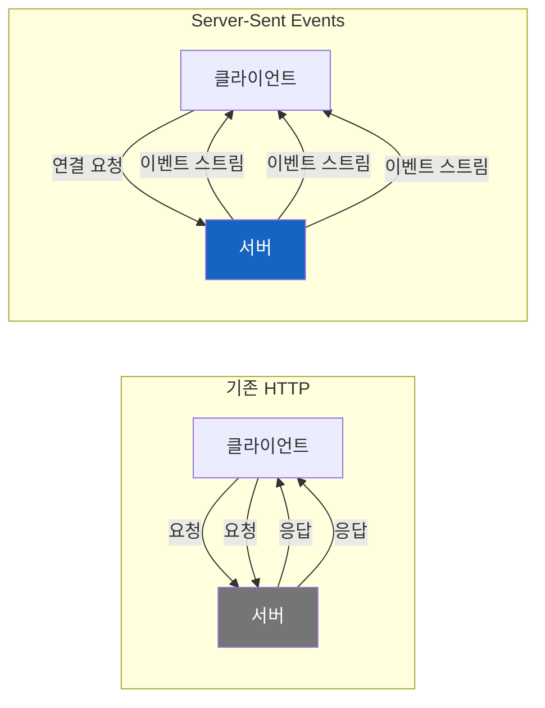
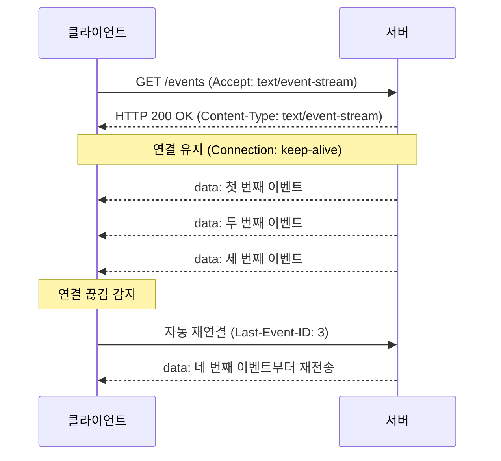
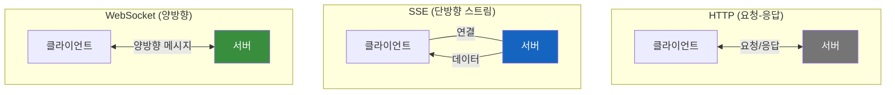
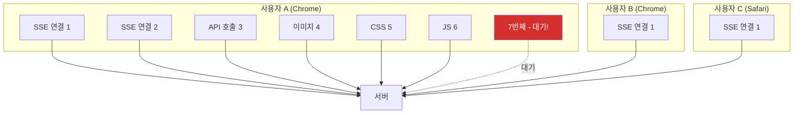
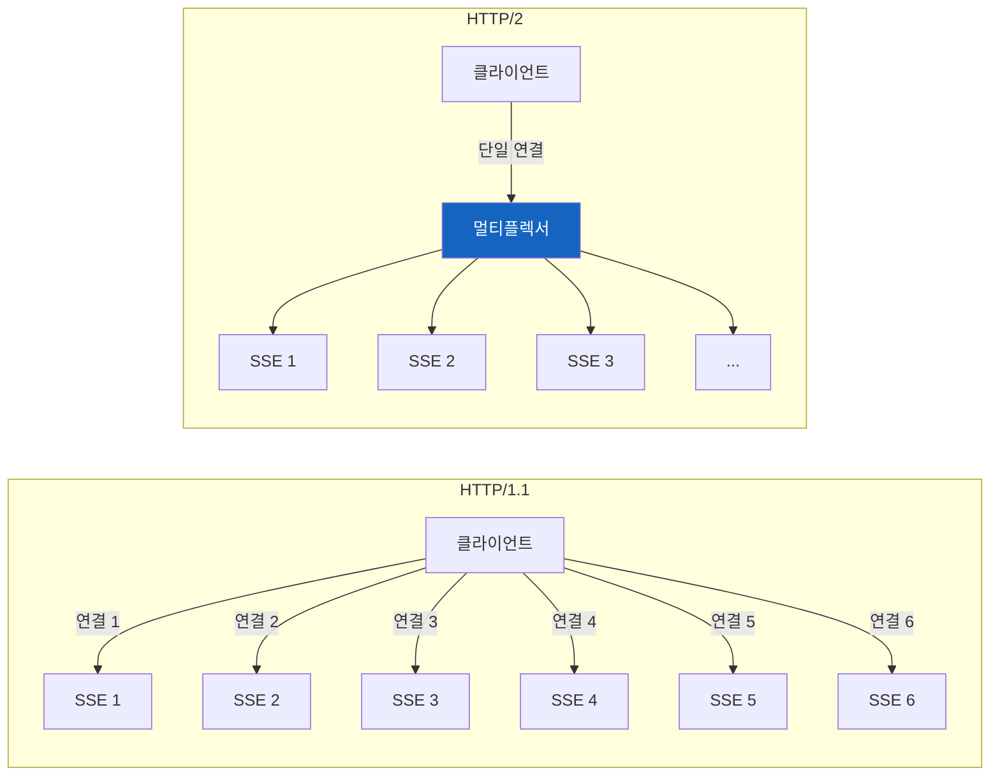
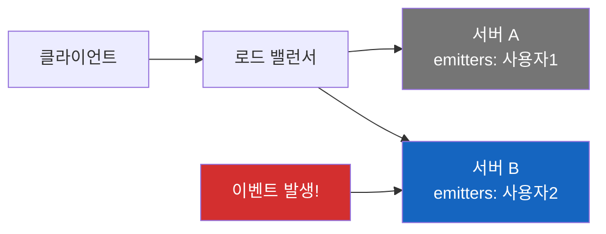
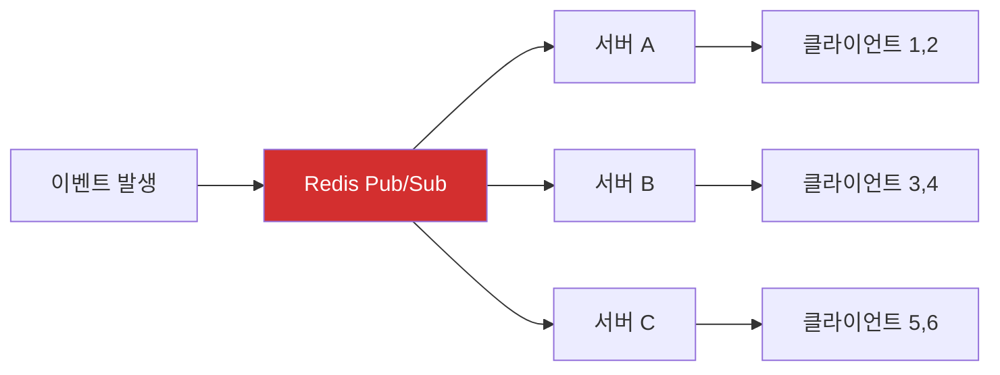

# Server-Sent Events (SSE)

서버가 클라이언트에게 "야, 새 소식 있어!"라고 먼저 말을 걸 수 있다면? 그게 바로 SSE다.

## 결론부터 말하면

**SSE는 서버에서 클라이언트로 단방향 실시간 데이터를 스트리밍하는 기술이다.** HTTP 위에서 동작하며, WebSocket보다 단순하고 가볍다. ChatGPT의 타이핑 효과, 실시간 알림, 주식 시세 등에 사용된다.



| 특징 | 설명 |
|------|------|
| **방향** | 서버 → 클라이언트 (단방향) |
| **프로토콜** | HTTP (기존 인프라 그대로 사용) |
| **데이터 형식** | 텍스트 (UTF-8) |
| **재연결** | 자동 (브라우저가 알아서 처리) |
| **브라우저 지원** | 모든 모던 브라우저 (IE 제외) |

## 1. 왜 SSE가 필요한가?

### 1.1 기존 HTTP의 한계

웹의 기본 통신 모델은 **요청-응답**이다. 클라이언트가 요청해야만 서버가 응답한다.

```
클라이언트: "새 알림 있어?"
서버: "없어"

(3초 후)
클라이언트: "새 알림 있어?"
서버: "없어"

(3초 후)
클라이언트: "새 알림 있어?"
서버: "있어! 여기!"
```

이게 **폴링(Polling)** 방식이다. 문제가 뭘까?

1. **불필요한 요청**: 알림이 없어도 계속 물어봐야 함
2. **지연 발생**: 폴링 주기 사이에 알림이 오면 다음 주기까지 대기
3. **서버 부하**: 수천 명이 3초마다 요청하면?

### 1.2 만약 서버가 먼저 말을 걸 수 있다면?

```
클라이언트: "알림 있으면 알려줘" (연결 유지)
서버: (조용히 대기 중...)

(5분 후, 알림 발생)
서버: "새 알림이야!"

(10분 후, 또 알림 발생)
서버: "또 새 알림이야!"
```

클라이언트가 계속 물어볼 필요 없이, **서버가 이벤트가 발생할 때만 데이터를 보낸다.** 이게 SSE의 핵심 아이디어다.

## 2. SSE는 어떻게 동작하는가?

### 2.1 연결 과정



**핵심 포인트:**

1. 클라이언트가 `text/event-stream` 타입으로 요청
2. 서버가 연결을 끊지 않고 유지
3. 서버가 원할 때 데이터를 푸시
4. 연결이 끊기면 브라우저가 자동 재연결

### 2.2 SSE 메시지 형식

SSE는 매우 단순한 텍스트 형식을 사용한다:

```
data: 이것은 메시지입니다

data: 여러 줄도
data: 가능합니다

event: customEvent
data: {"type": "notification", "message": "새 메시지"}

id: 123
event: update
data: 이벤트 ID와 타입을 지정할 수 있습니다

retry: 5000
data: 재연결 간격을 밀리초로 지정

```

| 필드 | 설명 |
|------|------|
| `data:` | 실제 전송할 데이터 (필수) |
| `event:` | 이벤트 타입 (기본값: message) |
| `id:` | 이벤트 ID (재연결 시 마지막 위치 추적용) |
| `retry:` | 재연결 대기 시간 (밀리초) |

**중요:** 각 메시지는 빈 줄(`\n\n`)로 구분된다.

## 3. HTTP vs SSE vs WebSocket

이 세 가지를 헷갈리는 경우가 많다. 명확히 비교해보자.



| 특징 | HTTP | SSE | WebSocket |
|------|------|-----|-----------|
| **통신 방향** | 양방향 (요청-응답) | 단방향 (서버→클라) | 양방향 |
| **연결 방식** | 매번 새 연결 | 연결 유지 | 연결 유지 |
| **프로토콜** | HTTP | HTTP | ws:// (별도 프로토콜) |
| **데이터 형식** | 모든 형식 | 텍스트만 | 텍스트 + 바이너리 |
| **재연결** | N/A | 자동 | 수동 구현 필요 |
| **프록시/방화벽** | 문제없음 | 문제없음 | 막힐 수 있음 |
| **복잡도** | 낮음 | 낮음 | 높음 |
| **브라우저 연결 제한** | 요청당 | 도메인당 6개 | 도메인당 제한 없음 |

### 언제 무엇을 써야 하는가?

```
┌─────────────────────────────────────────────────────────────┐
│ "서버에서 클라이언트로만 데이터를 보내면 된다"               │
│  → SSE (알림, 피드, 시세, AI 응답 스트리밍)                 │
├─────────────────────────────────────────────────────────────┤
│ "클라이언트와 서버가 양방향으로 대화해야 한다"              │
│  → WebSocket (채팅, 게임, 협업 도구)                        │
├─────────────────────────────────────────────────────────────┤
│ "단발성 데이터 요청/응답이면 충분하다"                       │
│  → HTTP (REST API, 폼 제출, 파일 다운로드)                  │
├─────────────────────────────────────────────────────────────┤
│ "기존 HTTP 인프라를 그대로 사용해야 한다"                   │
│  → SSE (프록시, 로드밸런서, 방화벽 호환)                    │
└─────────────────────────────────────────────────────────────┘
```

## 4. 실제 코드로 보는 SSE

### 4.1 클라이언트 (JavaScript)

```javascript
// EventSource API - 브라우저 내장
const eventSource = new EventSource('/api/events');

// 기본 메시지 수신
eventSource.onmessage = (event) => {
    console.log('받은 데이터:', event.data);
};

// 연결 성공
eventSource.onopen = () => {
    console.log('SSE 연결됨');
};

// 에러 처리 (자동 재연결 시도함)
eventSource.onerror = (error) => {
    console.error('SSE 에러:', error);
    if (eventSource.readyState === EventSource.CLOSED) {
        console.log('연결 종료됨');
    }
};

// 커스텀 이벤트 수신
eventSource.addEventListener('notification', (event) => {
    const data = JSON.parse(event.data);
    showNotification(data.message);
});

eventSource.addEventListener('priceUpdate', (event) => {
    const data = JSON.parse(event.data);
    updateStockPrice(data.symbol, data.price);
});

// 연결 종료
function disconnect() {
    eventSource.close();
}
```

### 4.2 서버 (Spring Boot)

> **SseEmitter vs Flux**: Spring에서 SSE를 구현하는 두 가지 방식이 있다.
> - `SseEmitter`: 전통적인 서블릿 기반 **Spring MVC**에서 사용
> - `Flux<T>`: 리액티브 스택인 **Spring WebFlux**에서 사용
>
> 프로그래밍 모델의 차이일 뿐, 둘 다 동일한 SSE를 구현한다. 아래는 Spring MVC 예시다.

```java
@RestController
@RequestMapping("/api")
public class SSEController {

    private final List<SseEmitter> emitters = new CopyOnWriteArrayList<>();

    // SSE 연결 엔드포인트
    @GetMapping(value = "/events", produces = MediaType.TEXT_EVENT_STREAM_VALUE)
    public SseEmitter subscribe() {
        SseEmitter emitter = new SseEmitter(Long.MAX_VALUE); // 타임아웃 설정
        emitters.add(emitter);

        // 연결 종료 시 정리
        emitter.onCompletion(() -> emitters.remove(emitter));
        emitter.onTimeout(() -> emitters.remove(emitter));
        emitter.onError(e -> emitters.remove(emitter));

        // 연결 확인용 초기 이벤트
        try {
            emitter.send(SseEmitter.event()
                    .name("connect")
                    .data("연결 성공"));
        } catch (IOException e) {
            emitter.completeWithError(e);
        }

        return emitter;
    }

    // 모든 클라이언트에게 이벤트 전송
    public void broadcast(String eventName, Object data) {
        List<SseEmitter> deadEmitters = new ArrayList<>();

        emitters.forEach(emitter -> {
            try {
                emitter.send(SseEmitter.event()
                        .name(eventName)
                        .data(data));
            } catch (IOException e) {
                deadEmitters.add(emitter);
            }
        });

        emitters.removeAll(deadEmitters);
    }

    // 특정 이벤트 발생 시 호출
    @PostMapping("/notify")
    public void sendNotification(@RequestBody NotificationDto notification) {
        broadcast("notification", notification);
    }
}
```

### 4.3 서버 (Node.js/Express)

```javascript
const express = require('express');
const app = express();

// 연결된 클라이언트 관리
const clients = new Set();

// SSE 엔드포인트
app.get('/api/events', (req, res) => {
    // SSE 헤더 설정
    res.setHeader('Content-Type', 'text/event-stream');
    res.setHeader('Cache-Control', 'no-cache');
    res.setHeader('Connection', 'keep-alive');

    // 연결 유지를 위한 keep-alive
    res.flushHeaders();

    // 클라이언트 등록
    clients.add(res);
    console.log(`클라이언트 연결: ${clients.size}명`);

    // 연결 확인 이벤트
    res.write('event: connect\n');
    res.write('data: 연결 성공\n\n');

    // 연결 종료 시 정리
    req.on('close', () => {
        clients.delete(res);
        console.log(`클라이언트 종료: ${clients.size}명`);
    });
});

// 모든 클라이언트에게 브로드캐스트
function broadcast(eventName, data) {
    const message = `event: ${eventName}\ndata: ${JSON.stringify(data)}\n\n`;

    clients.forEach(client => {
        client.write(message);
    });
}

// 알림 전송 API
app.post('/api/notify', express.json(), (req, res) => {
    broadcast('notification', req.body);
    res.json({ success: true, clients: clients.size });
});

app.listen(3000);
```

## 5. 실무 활용 사례

### 5.1 ChatGPT 스타일 AI 응답 스트리밍

ChatGPT가 타이핑하듯 글자가 하나씩 나타나는 효과, 이게 SSE다.

```javascript
// 클라이언트
const eventSource = new EventSource('/api/chat?message=' + encodeURIComponent(userMessage));

let fullResponse = '';
eventSource.onmessage = (event) => {
    const chunk = event.data;
    if (chunk === '[DONE]') {
        eventSource.close();
        return;
    }
    fullResponse += chunk;
    updateChatUI(fullResponse);
};
```

```java
// Spring Boot 서버
@GetMapping(value = "/api/chat", produces = MediaType.TEXT_EVENT_STREAM_VALUE)
public Flux<String> chat(@RequestParam String message) {
    return openAiService.streamChat(message)
            .map(chunk -> "data: " + chunk + "\n\n")
            .concatWith(Mono.just("data: [DONE]\n\n"));
}
```

### 5.2 실시간 주식/코인 시세

```javascript
// 클라이언트
const priceSource = new EventSource('/api/prices?symbols=AAPL,GOOGL,BTC');

priceSource.addEventListener('priceUpdate', (event) => {
    const { symbol, price, change } = JSON.parse(event.data);
    updatePriceDisplay(symbol, price, change);
});
```

### 5.3 파일 업로드 진행률

```javascript
// 파일 업로드 후 처리 진행률 수신
const progressSource = new EventSource(`/api/upload/progress/${uploadId}`);

progressSource.onmessage = (event) => {
    const { stage, percent, message } = JSON.parse(event.data);
    updateProgressBar(percent);
    updateStatusMessage(`${stage}: ${message}`);

    if (percent === 100) {
        progressSource.close();
        showSuccess();
    }
};
```

### 5.4 실시간 알림 시스템

```javascript
// 로그인 후 알림 스트림 연결
const notificationSource = new EventSource('/api/notifications', {
    withCredentials: true  // 쿠키 포함 (인증)
});

notificationSource.addEventListener('notification', (event) => {
    const notification = JSON.parse(event.data);
    showNotificationToast(notification);
    incrementBadgeCount();
});

notificationSource.addEventListener('read', (event) => {
    const { notificationId } = JSON.parse(event.data);
    markAsRead(notificationId);
});
```

## 6. SSE의 장단점

### 장점

| 장점 | 설명 |
|------|------|
| **단순함** | WebSocket보다 구현이 훨씬 쉬움 |
| **HTTP 호환** | 기존 인프라 그대로 사용 (프록시, 방화벽, 로드밸런서) |
| **자동 재연결** | 브라우저가 알아서 처리 |
| **이벤트 ID** | 마지막 수신 위치 추적으로 데이터 유실 방지 |
| **텍스트 기반** | 디버깅이 쉬움 (브라우저 개발자 도구에서 확인 가능) |

### 단점

| 단점 | 설명 |
|------|------|
| **단방향** | 클라이언트→서버는 별도 HTTP 요청 필요 |
| **연결 제한** | 브라우저당 도메인별 6개 연결 제한 (HTTP/2에서는 해결) |
| **텍스트만** | 바이너리 데이터 전송 불가 (Base64 인코딩 필요) |
| **IE 미지원** | 폴리필 필요 (하지만 IE는 이제 죽었다) |
| **연결 유지 비용** | 많은 클라이언트 = 많은 열린 연결 |

### "브라우저당 도메인별 6개 연결 제한"의 정확한 의미

이 부분을 오해하기 쉽다. **"서비스에 6명만 접속 가능"이 아니다!**

```
브라우저당 = 한 사용자의 브라우저 인스턴스
도메인별 = 같은 도메인(예: chat.example.com)에 대해
6개 = 동시 HTTP/1.1 연결 수
```

**즉, 한 사람이 같은 사이트에 동시에 열 수 있는 연결이 6개라는 뜻이다.**

| 상황 | 결과 |
|------|------|
| 회사 직원 100명이 각자 ChatGPT 사용 | **100개 SSE 연결** (각자 1개씩) ✅ |
| 한 사람이 탭 10개로 ChatGPT 열기 | **6개만 연결**, 4개는 대기 ⚠️ |
| 한 페이지에서 SSE 3개 + API 호출 3개 | **6개 연결**, 추가 요청은 대기 |



**실제 제한 요소는 서버의 연결 처리 능력이다.** 1000명이 동시 접속하면 최소 1000개의 SSE 연결을 유지해야 한다.

### 연결 제한 문제 해결 방법

**방법 1: 여러 SSE를 하나로 통합**

```javascript
// Bad: 여러 SSE 연결
const notifications = new EventSource('/api/notifications');
const chat = new EventSource('/api/chat');
const prices = new EventSource('/api/prices');

// Good: 하나의 SSE로 이벤트 타입 구분
const events = new EventSource('/api/events');
events.addEventListener('notification', handleNotification);
events.addEventListener('chat', handleChat);
events.addEventListener('price', handlePrice);
```

**방법 2: HTTP/2 사용 (권장)**

### HTTP/2와 SSE

HTTP/2에서는 하나의 TCP 연결로 여러 스트림을 멀티플렉싱할 수 있어서, 연결 제한 문제가 크게 완화된다. **HTTPS를 사용하면 대부분 자동으로 HTTP/2가 적용된다.**



## 7. SSE 사용 시 주의사항

### 7.1 연결 관리

```java
// 타임아웃 설정 (너무 길면 리소스 낭비)
SseEmitter emitter = new SseEmitter(30 * 60 * 1000L); // 30분

// 주기적 하트비트로 연결 유지 확인
@Scheduled(fixedRate = 30000) // 30초마다
public void sendHeartbeat() {
    emitters.forEach(emitter -> {
        try {
            emitter.send(SseEmitter.event().comment("heartbeat"));
        } catch (IOException e) {
            // 연결 끊김 감지
        }
    });
}
```

### 7.2 인증 처리

```javascript
// SSE는 헤더 커스터마이징이 제한적
// 방법 1: 쿼리 파라미터로 토큰 전달 (비추천 - URL 노출)
new EventSource('/api/events?token=' + accessToken);

// 방법 2: 쿠키 사용 (추천)
new EventSource('/api/events', { withCredentials: true });

// 방법 3: 초기 연결 후 인증 이벤트
eventSource.addEventListener('auth_required', () => {
    // 별도 인증 처리
});
```

### 7.3 에러 처리와 재연결

```javascript
const eventSource = new EventSource('/api/events');

eventSource.onerror = (error) => {
    switch (eventSource.readyState) {
        case EventSource.CONNECTING:
            console.log('재연결 시도 중...');
            break;
        case EventSource.CLOSED:
            console.log('연결 종료됨, 수동 재연결 필요');
            // 지수 백오프로 재연결
            setTimeout(() => reconnect(), backoffTime);
            break;
    }
};
```

### 7.4 Nginx 프록시 버퍼링 문제 (실무 필수!)

**SSE가 로컬에서는 잘 되는데 운영 환경에서 안 된다면?** 99% 확률로 프록시 버퍼링 문제다.

Nginx는 기본적으로 백엔드 응답을 **버퍼에 모아뒀다가 한 번에 전송**한다. 이러면 SSE의 실시간성이 완전히 깨진다.

```nginx
# nginx.conf - SSE 엔드포인트 설정
location /api/events {
    proxy_pass http://backend;

    # 핵심: 버퍼링 비활성화
    proxy_buffering off;

    # SSE 관련 추가 설정
    proxy_cache off;
    proxy_set_header Connection '';
    proxy_http_version 1.1;
    chunked_transfer_encoding off;

    # 타임아웃 설정 (긴 연결 유지)
    proxy_read_timeout 86400s;  # 24시간
    proxy_send_timeout 86400s;
}
```

| 설정 | 설명 |
|------|------|
| `proxy_buffering off` | **필수!** 응답 버퍼링 비활성화 |
| `proxy_cache off` | 캐싱 비활성화 |
| `proxy_http_version 1.1` | HTTP/1.1 사용 (keep-alive 지원) |
| `proxy_read_timeout` | 긴 연결 유지를 위한 타임아웃 증가 |

**AWS ALB, CloudFlare 등 다른 프록시도 마찬가지다.** 각 서비스의 "스트리밍 응답" 또는 "버퍼링 비활성화" 옵션을 찾아서 설정해야 한다.

### 7.5 Scale-out 환경에서의 SSE

서버를 여러 대로 확장하면 새로운 문제가 생긴다.



**문제:** 사용자1은 서버 A에 연결되어 있는데, 이벤트가 서버 B에서 발생하면? 사용자1은 이벤트를 받지 못한다!

**해결 방법:**

```
┌─────────────────────────────────────────────────────────────┐
│ 방법 1: Sticky Session                                      │
│  → 같은 사용자는 항상 같은 서버로 라우팅                     │
│  → 간단하지만, 서버 장애 시 연결 유실                        │
├─────────────────────────────────────────────────────────────┤
│ 방법 2: Redis Pub/Sub로 서버 간 이벤트 전파 (권장)           │
│  → 모든 서버가 Redis 채널 구독                              │
│  → 이벤트 발생 시 Redis로 브로드캐스트                       │
│  → 각 서버가 자신의 클라이언트에게 전달                      │
└─────────────────────────────────────────────────────────────┘
```

```java
// Redis Pub/Sub를 활용한 Scale-out 대응
@Component
public class SSEBroadcaster {
    private final RedisTemplate<String, String> redisTemplate;
    private final List<SseEmitter> localEmitters = new CopyOnWriteArrayList<>();

    // Redis 메시지 수신 → 로컬 클라이언트에게 전파
    @RedisListener(topics = "sse-events")
    public void onMessage(String message) {
        localEmitters.forEach(emitter -> {
            try {
                emitter.send(message);
            } catch (IOException e) {
                // 연결 끊김 처리
            }
        });
    }

    // 이벤트 발생 시 Redis로 발행 → 모든 서버로 전파
    public void broadcast(String event) {
        redisTemplate.convertAndSend("sse-events", event);
    }
}
```



## 8. 정리

**SSE는 "서버가 클라이언트에게 먼저 말 거는" 가장 단순한 방법이다.**

| 상황 | 선택 |
|------|------|
| 실시간 알림, 피드, 시세 | **SSE** |
| AI 응답 스트리밍 (ChatGPT 스타일) | **SSE** |
| 진행률 표시 | **SSE** |
| 실시간 채팅 | WebSocket |
| 게임, 협업 도구 | WebSocket |
| 일반 API 호출 | HTTP |

**한 문장으로:** SSE는 HTTP 위에서 동작하는 단방향 실시간 스트리밍 기술로, WebSocket보다 단순하고 기존 인프라와 호환된다.

---

## 출처

- [MDN Web Docs - Server-sent events](https://developer.mozilla.org/en-US/docs/Web/API/Server-sent_events)
- [HTML Living Standard - Server-sent events](https://html.spec.whatwg.org/multipage/server-sent-events.html)
- [Spring Framework - SseEmitter](https://docs.spring.io/spring-framework/docs/current/javadoc-api/org/springframework/web/servlet/mvc/method/annotation/SseEmitter.html)
