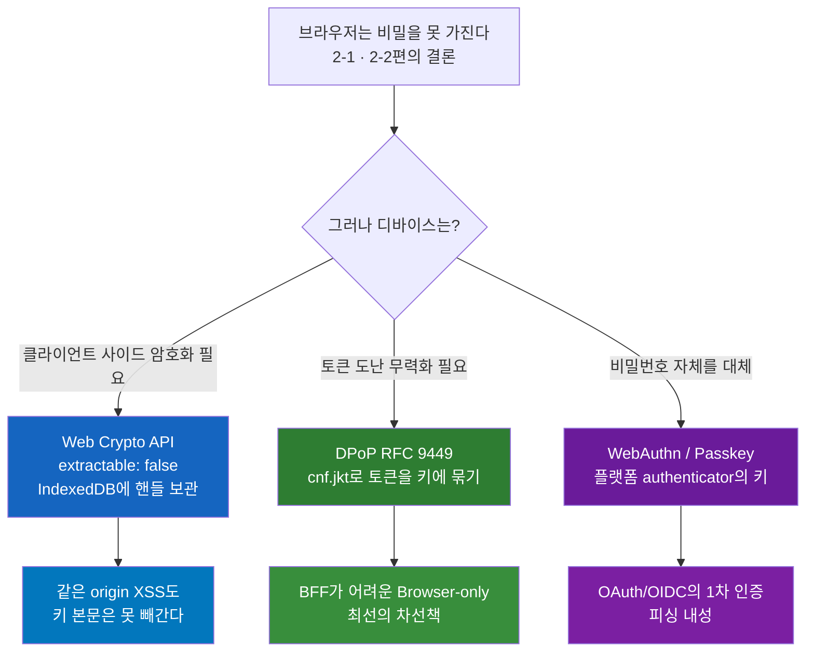
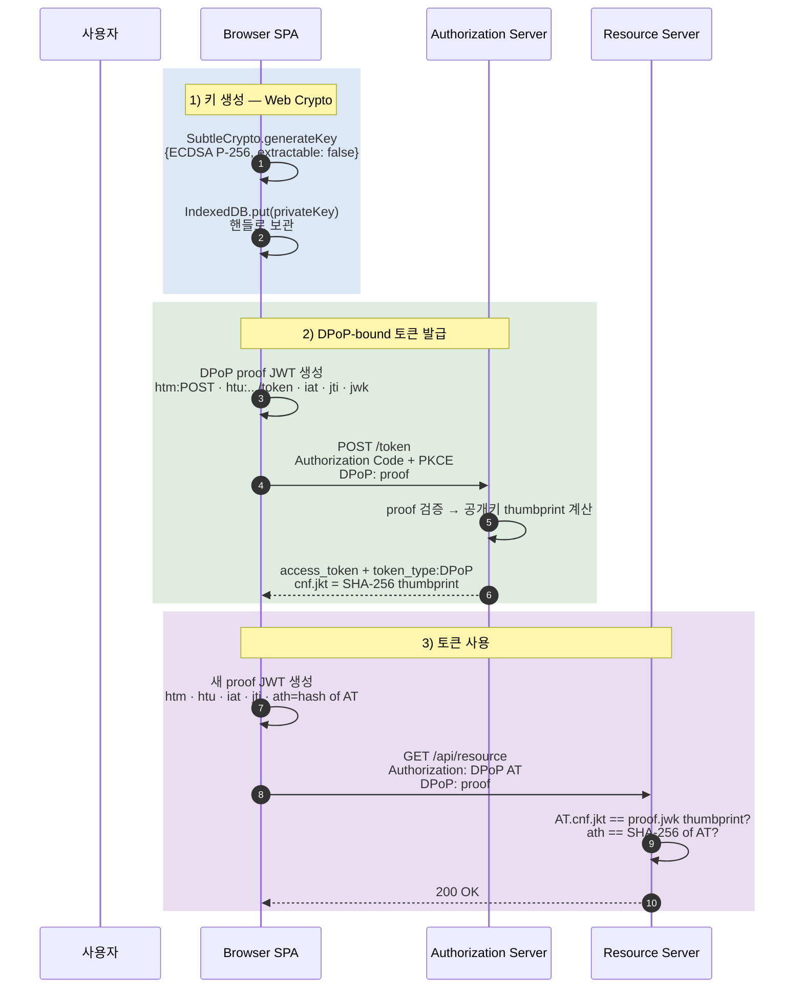
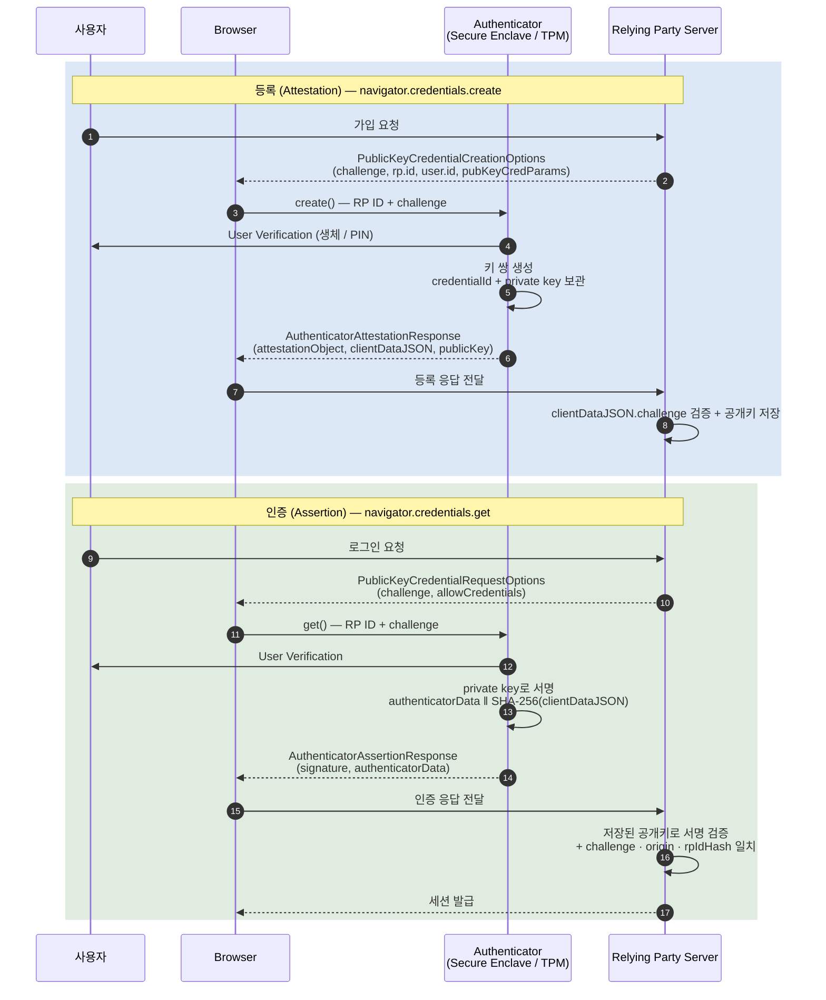
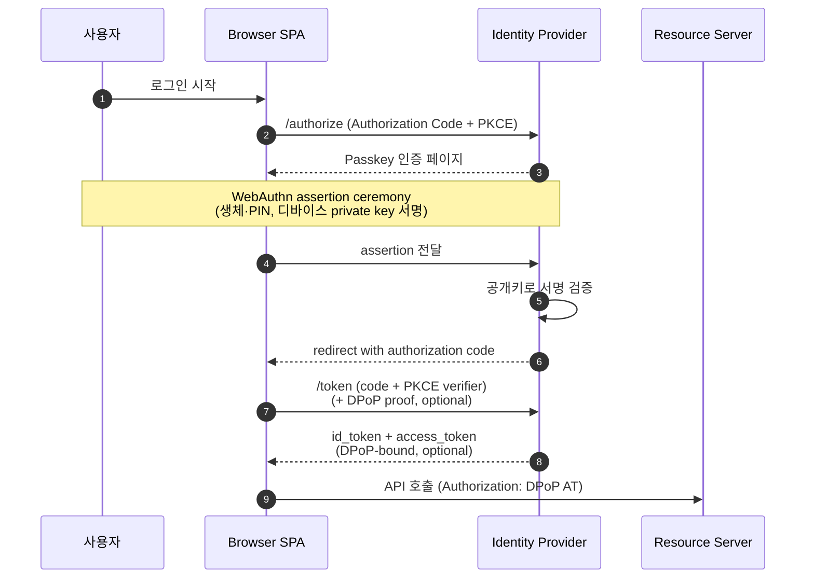
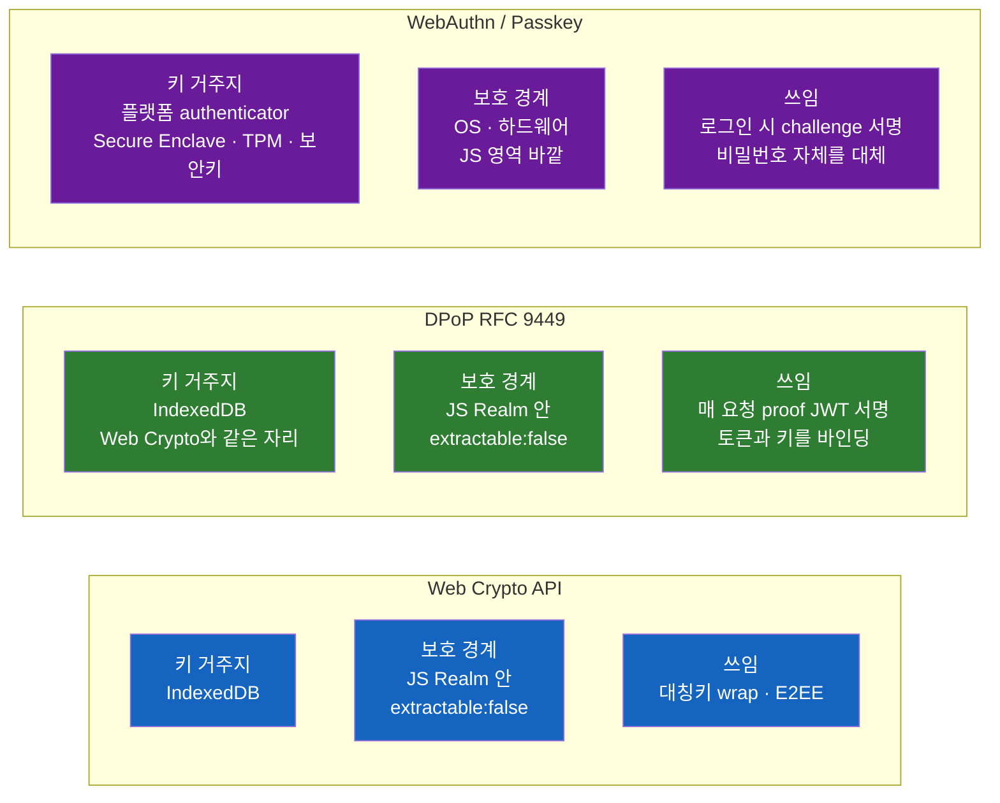

# Web Crypto API와 Passkey, DPoP — 브라우저에서 진짜 보안이 필요할 때

[2-1편](토큰을-어디에-둘-것인가-Cookie-Authorization-Header-Storage-5종-완전-비교.md)이 "토큰을 어디에 둘 것인가"를, [2-2편](브라우저는-어떻게-토큰을-받아오는가-OAuth-2.1-PKCE-BFF의-시퀀스를-끝까지-따라가기.md)이 "그 토큰을 어떻게 받아오는가"를 닫았다면, 이 글은 그 두 글이 공유한 한 가지 전제를 정면으로 흔든다. **브라우저는 정말 비밀을 못 가지는가.** 그리고 만약 가질 수 있다면, 그 진보가 토큰·세션·인증 각각에 어디까지 닿는가.

## 결론부터 말하면

**브라우저 안의 JavaScript는 여전히 비밀을 못 가진다. 그러나 그 옆에 있는 디바이스의 키는 가질 수 있다.** 이 한 발의 진보를 세 표준이 서로 다른 자리에서 받아낸다 — **Web Crypto API**(클라이언트 사이드 암호화), **DPoP / RFC 9449**(토큰을 키에 묶기), **WebAuthn / Passkey**(비밀번호 자체를 디바이스 키로 대체). 셋 다 비대칭 키 모델을 쓰지만, 키가 사는 자리와 보호 경계는 모두 다르다. 이 차이가 곧 보호 강도의 차이다.



| 기술 | 키가 사는 자리 | 보호 경계 | 무엇을 보호하나 |
|------|--------------|---------|-------------|
| **Web Crypto API** | IndexedDB의 `CryptoKey` 핸들 | JS Realm 안, `extractable: false` | 같은 origin 코드도 키 본문은 못 봄 |
| **DPoP** (RFC 9449) | IndexedDB의 `CryptoKey` (Web Crypto와 같은 자리) | JS Realm 안, `extractable: false` | 토큰을 훔쳐도 키가 없으면 못 씀 |
| **WebAuthn / Passkey** | 플랫폼 authenticator (Secure Enclave / TPM) 또는 보안키 | OS · 하드웨어 — **JS 영역 밖** | 사용자 인증 자체를 비대칭 서명으로 |

이 표의 마지막 두 줄이 결정적이다. **DPoP의 키는 같은 origin XSS가 mint(서명 발행)할 수는 있지만 추출할 수는 없다.** **Passkey의 키는 그 mint 자체가 OS의 사용자 확인 프롬프트 뒤에 있어 같은 origin XSS도 임의로 사용할 수 없다.** 셋이 한 그림으로 모이는 자리는 글의 후반부에 둔다.

## 1. 왜 다시 디바이스의 키인가

[2-2편](브라우저는-어떻게-토큰을-받아오는가-OAuth-2.1-PKCE-BFF의-시퀀스를-끝까지-따라가기.md)의 결론은 단순했다. **브라우저는 `client_secret`을 안전하게 보관할 수 없다.** SPA는 본질적으로 Public Client이고, [draft-ietf-oauth-browser-based-apps-26](https://datatracker.ietf.org/doc/draft-ietf-oauth-browser-based-apps/)은 그래서 BFF를 1순위로 권고했다. 토큰의 책임을 백엔드 세션으로 옮기는 일이었다.

그러나 모든 자리에서 BFF가 가능한 것은 아니다. **토큰이 어쩔 수 없이 브라우저로 내려와야 하는 자리** -- 정적 호스팅만 가능한 SPA, BFF를 운영할 인력이 없는 작은 팀, 모바일·데스크톱 앱과 토큰을 공유해야 하는 통합 환경 -- 가 여전히 많다. 그리고 BFF로 토큰을 가린다 해도, **세션 쿠키 자체가 도난되면 다른 디바이스에서 그대로 사용된다는 위협**은 남는다.

이 두 약점은 같은 뿌리에서 나온다. **bearer token 모델** -- 토큰을 들고 있는 자가 곧 권한자라는 가정. 도난된 토큰이 다른 디바이스에서 그대로 작동한다는 사실은 OAuth가 처음부터 안고 있던 한계였다.

이 한계를 깨려면 토큰에 **"어떤 키를 가진 디바이스만 이걸 쓸 수 있다"는 단서**를 박아야 한다. 그 단서를 만드는 비대칭 키가 어디에 살아야 하는가. 이전에는 답이 없었다. 자바스크립트가 키 본문을 만지는 한, XSS는 그것을 같이 가져갔다.

**Web Crypto API**가 그 자리를 바꾼다. JavaScript는 키를 사용하지만, **raw key material**(byte array) 은 스크립트 메모리에 노출되지 않는다. 다른 디바이스로 키를 복제해 갈 수 있는 형태의 export가 막힌다는 의미다. (이 보호의 정확한 경계 -- `CryptoKey` 핸들 자체는 structured clone으로 다른 컨텍스트에 전달될 수 있다는 점 -- 은 §2.3에서 따로 다룬다.) 이 보장이 서면 그 위에 두 표준이 자연스럽게 쌓인다 -- 토큰을 그 키에 묶어 도난을 무력화하는 **DPoP**, 그리고 키를 OS 영역으로 한 번 더 끌어내려 인증 그 자체를 키로 만드는 **WebAuthn / Passkey**.

이 글은 그 세 자리를 차례로 따라간다.

## 2. Web Crypto API — 불투명 핸들로서의 키

### 2.1 `extractable: false`가 뒤집은 것

[Web Cryptography Level 2](https://www.w3.org/TR/webcrypto-2/)는 `SubtleCrypto.generateKey(algorithm, extractable, keyUsages)`라는 단순한 시그니처 위에 큰 결정을 박아 두었다. 두 번째 인자가 `false`이면 그 키는 **export 자체가 불가능**하다.

```javascript
const keyPair = await crypto.subtle.generateKey(
  { name: 'ECDSA', namedCurve: 'P-256' },
  false,                    // extractable: false — 핵심
  ['sign', 'verify']
);

// 이 두 호출은 모두 InvalidAccessError를 던진다
// (ECDSA private key는 'pkcs8' 또는 'jwk' 포맷으로만 export 가능 — 'raw'는 대칭키·공개키 용)
await crypto.subtle.exportKey('pkcs8', keyPair.privateKey);
await crypto.subtle.wrapKey('pkcs8', keyPair.privateKey, wrappingKey, alg);
```

[MDN의 `CryptoKey.extractable` 페이지](https://developer.mozilla.org/en-US/docs/Web/API/CryptoKey/extractable)는 이 점을 명확히 한다 -- *"If the key cannot be exported, exportKey() or wrapKey() will throw an exception if used to extract it."*

여기서 중요한 통찰은 `CryptoKey`가 **값이 아니라 핸들**이라는 점이다. JS는 그 객체를 변수에 잡고 `sign()`·`verify()` 같은 메서드를 호출할 수 있지만, 그 객체에서 키 본문(byte array)을 꺼내는 표준 API가 존재하지 않는다. 비유하자면 운영체제의 파일 디스크립터와 같다 -- 번호로 파일을 읽고 쓸 수 있지만, 번호 자체에서 파일 내용을 추출하는 시스템 콜은 없다.

### 2.2 IndexedDB가 살릴 수 있는 정확한 이유

[2-1편 §2.4](토큰을-어디에-둘-것인가-Cookie-Authorization-Header-Storage-5종-완전-비교.md#24-indexeddb)에서 짧게 언급했던 자리를 본격적으로 풀어 보자. **IndexedDB는 `CryptoKey` 객체를 그대로 저장할 수 있다.**

```javascript
const tx = db.transaction('keys', 'readwrite');
tx.objectStore('keys').put({ id: 'dpop-key', key: keyPair.privateKey });
```

이게 가능한 이유는 IndexedDB의 직렬화가 **structured clone algorithm**을 쓰기 때문이다. JSON.stringify는 prototype과 메서드를 잃기 때문에 `CryptoKey`를 살리지 못한다. structured clone은 다르다. 브라우저 내부의 표현을 보존하면서 복사한다. 그래서 `extractable: false` 플래그도, 키와 함께 등록된 `keyUsages`도 그대로 유지된다.

다음 페이지 로드 시 같은 객체를 꺼내 쓰면 -- 사용은 되지만, 여전히 본문은 나오지 않는다. **localStorage와는 자리가 다르다.** localStorage는 문자열만 다루므로 키를 저장하려면 어떤 형태로든 export가 필요하고, 그 시점에 `extractable: false`의 의미가 무너진다.

WorkOS의 [DPoP 가이드](https://workos.com/blog/dpop-rfc-9449-explained)는 같은 결론을 단호하게 표현한다 -- *"If you find yourself base64-encoding a private key into localStorage, you have defeated DPoP."*

### 2.3 같은 origin XSS가 만나는 정확한 경계

이 모델이 막는 것과 못 막는 것을 정확히 분리해야 한다. 흔한 오해 한 가지부터 짚는다 -- **`extractable: false`는 "키가 origin 밖으로 한 발짝도 못 나간다"는 의미가 아니다.**

| XSS가 할 수 있는 일 | XSS가 할 수 없는 일 |
|---------------------|---------------------|
| `crypto.subtle.sign(...)`를 호출해 페이지가 열린 동안 임의의 메시지에 서명 | `exportKey('raw' / 'pkcs8' / 'jwk')`로 키 byte를 뽑아 평문 전송 |
| IndexedDB에서 `CryptoKey` 핸들을 가져와 `sign()` 인자로 사용 | `wrapKey()`로 키를 다른 키로 감싸 export |
| `postMessage`로 `CryptoKey` 핸들을 자기 통제 iframe·worker·popup에 전달해 그 컨텍스트에서 mint 권한 유지 | 그 핸들로부터 raw key bytes를 복원해 다른 디바이스·다른 브라우저로 키를 복제 |
| 키를 삭제하거나, 새 키를 만들어 덮어쓰기 | 키 사용을 OS 수준에서 차단·승인 요청 |

세 번째 줄이 [W3C Web Cryptography API §11 Security considerations for developers](https://www.w3.org/TR/webcrypto-2/#security-developers)가 명시적으로 경고하는 자리다. **`CryptoKey`는 structured-cloneable 객체이므로 `postMessage`로 다른 origin·다른 컨텍스트에 전달될 수 있다.** XSS 페이로드가 자기 통제하의 iframe이나 service worker, 또는 `window.open`으로 띄운 attacker origin에 핸들을 떠넘기면 -- 비록 raw bytes는 끝까지 노출되지 않더라도 -- 해당 컨텍스트가 살아 있는 동안 mint 권한이 함께 흘러간다. 그래서 권고는 두 단계다.

1. **raw key material의 export는 `extractable: false`로 막는다.** 이것이 "다른 디바이스로의 키 복제"를 닫는 한 줄이다.
2. **`CryptoKey` 핸들의 cross-context 노출도 별도 통제가 필요하다** -- COOP/COEP로 origin 격리, 임의 iframe / popup·opener 차단, postMessage 핸들러에서 신뢰하지 않는 origin에 `CryptoKey`를 보내지 않기.

요약하면 **"키 본문의 영구적 유출(exfiltration to another device) 은 차단되지만, 같은 페이지 또는 cross-context로 이동한 핸들이 살아 있는 동안의 임의 mint는 막지 못한다."** 이 차이를 잡고 다음 절로 넘어간다 -- 이것이 정확히 DPoP가 추가로 깔아 두는 방어선의 자리다.

## 3. DPoP (RFC 9449) — 토큰을 키에 묶기

### 3.1 Bearer가 안고 있던 한 가지

OAuth 2.0의 access token은 본디 [RFC 6750](https://datatracker.ietf.org/doc/html/rfc6750)이 정의한 **Bearer Token**이다. 이름 그대로 "들고 있는 자(bearer)"가 권한자다. 토큰이 네트워크나 저장소에서 새는 순간, 다른 디바이스에서 그대로 사용된다. 이 모델 위에서는 도난 = 즉시 권한 이전이다.

[RFC 9449 (DPoP)](https://datatracker.ietf.org/doc/html/rfc9449)는 이 등식을 깬다. 첫 문장이 모든 것을 요약한다 -- *"This document describes a mechanism for sender-constraining OAuth 2.0 tokens via a proof-of-possession mechanism on the application level."*

핵심 단어가 두 개다. **sender-constrained** -- 토큰이 발급된 그 클라이언트(정확히는 그 클라이언트가 가진 키)에게만 묶인다. **application level** -- TLS 같은 채널 계층이 아니라 HTTP 헤더라는 애플리케이션 계층에서 동작한다. 이 두 결정이 곧 "왜 브라우저에 mTLS가 아니라 DPoP인가"의 답이다(§3.5에서 정리한다).

### 3.2 DPoP proof JWT — 매 요청마다 새 서명

DPoP는 두 종류의 데이터를 만든다 -- **DPoP-bound access token**(인가 서버가 발급)과 **DPoP proof JWT**(클라이언트가 매 요청마다 만들어 헤더에 박는 짧은 수명의 JWT). [RFC 9449 §4.2](https://datatracker.ietf.org/doc/html/rfc9449#section-4.2)는 proof JWT의 구조를 못박는다.

**JOSE Header**

| 파라미터 | 값 |
|---------|---|
| `typ` | 반드시 `"dpop+jwt"` |
| `alg` | 비대칭 JWS 알고리즘. `"none"`과 대칭 MAC은 명시적으로 금지 |
| `jwk` | proof를 검증할 공개키(JWK 포맷). *"It MUST NOT contain a private key."* |

**Payload Claims**

| 클레임 | 언제 | 의미 |
|--------|-----|------|
| `htm` | 항상 | 요청의 HTTP method (예: `"POST"`) |
| `htu` | 항상 | 요청 URI, *"without query and fragment parts"* |
| `iat` | 항상 | 생성 시각 |
| `jti` | 항상 | 고유 식별자. *"negligible probability that the same value will be assigned"* |
| `ath` | 액세스 토큰을 함께 보낼 때 | **Base64URL-encoded SHA-256 해시** of access token. 단순 해시 바이트가 아니라 인코딩된 문자열이라는 점이 [RFC 9449 §4.2](https://datatracker.ietf.org/doc/html/rfc9449#section-4.2)에 못박혀 있다 |
| `nonce` | 서버가 요구할 때 | 인가 서버가 `DPoP-Nonce` 헤더로 내려준 값. 단순 `iat`/`jti` 윈도우 검증만으로는 짧은 시간 안의 proof 재전송을 막기 어렵기 때문에, 서버가 401과 함께 nonce를 내려주고 *"이 값을 포함해 즉시 다시 서명하라"* 고 강제하는 능동적 replay 방어 메커니즘이다([RFC 9449 §8](https://datatracker.ietf.org/doc/html/rfc9449#section-8)) |

이 6개의 클레임이 **"이 요청은 정확히 이 키를 가진 자가, 정확히 이 시점에, 정확히 이 URL · 메서드로 만들었다"** 를 한 번에 증명한다.

### 3.3 인가 서버가 박는 `cnf.jkt`

토큰 발급 단계에서 인가 서버가 하는 일은 단순하다 -- 받아 든 proof JWT의 `jwk`로 [JWK Thumbprint(RFC 7638)](https://datatracker.ietf.org/doc/html/rfc7638)을 SHA-256으로 계산한 값을 access token의 `cnf.jkt`에 박는다([RFC 9449 §6.1](https://datatracker.ietf.org/doc/html/rfc9449#section-6.1)).

```json
{
  "iss": "https://auth.example.com",
  "sub": "user-42",
  "exp": 1745832000,
  "cnf": {
    "jkt": "0ZcOCORZNYy-DWpqq30jZyJGHTN0d2HglBV3uiguA4I"
  }
}
```

`cnf`는 [RFC 7800](https://datatracker.ietf.org/doc/html/rfc7800)이 정의한 **Confirmation** 클레임이다. "이 토큰은 어떤 키 소유자가 가져야 한다"는 사실을 토큰 안에 박는 표준화된 자리다. `jkt`는 그중 JWK Thumbprint를 가리키는 키. 이 한 줄이 해당 토큰을 그 키에 영구히 묶는다.

### 3.4 Resource Server가 검증하는 자리

리소스 서버는 두 가지를 받는다.

```http
GET /api/resource HTTP/1.1
Authorization: DPoP eyJhbGc...     # access token
DPoP: eyJ0eXAi...                  # proof JWT
```

검증 절차는 [RFC 9449 §7.1](https://datatracker.ietf.org/doc/html/rfc9449#section-7)이 명시한다 -- proof의 서명을 그 안의 `jwk`로 검증하고, `htm`·`htu`가 실제 요청과 일치하는지, `iat`가 합리적 시간 윈도우 안인지, 서버가 요구한 `nonce`가 들어 있는지, 그리고 **proof의 `jwk`로 계산한 thumbprint가 access token의 `cnf.jkt`와 일치하는지**, 마지막으로 **`ath`가 제시된 access token의 SHA-256 해시와 같은지**를 검증한다. *"The resource server MUST NOT grant access to the resource unless all checks are successful."*

전체 시퀀스는 다음과 같다.



도난 시나리오를 세 가지로 갈라 본다.

| 도난 시나리오 | bearer token | DPoP-bound token |
|---------------|--------------|------------------|
| 네트워크 캡처(MITM 또는 로그 누출) | 다른 디바이스에서 그대로 사용 가능 | 키가 없으므로 다른 디바이스에서 사용 불가 |
| 같은 origin XSS, 토큰만 evil.com으로 송신 | 다른 디바이스에서 사용 가능 | **사용 불가**(키는 못 빼냈으므로) |
| 같은 origin XSS, 페이지 점령 후 같은 페이지에서 호출 | 즉시 사용 가능 | mint는 가능 — 페이지가 열린 동안만 |

마지막 줄이 핵심이다. **DPoP는 XSS를 무효화하지 않는다.** XSS가 발생한 페이지가 열려 있는 동안 공격자는 그 키로 proof JWT를 새로 만들 수 있다. WorkOS 가이드는 그래서 *"short access token lifetimes matter even more under DPoP"* 라고 정리한다. DPoP가 닫는 위협은 정확히 **"토큰이 디바이스 밖으로 나간 뒤"** 의 사용이다. 페이지 안에서 일어나는 mint는 [2-1편 §4](토큰을-어디에-둘-것인가-Cookie-Authorization-Header-Storage-5종-완전-비교.md#4-공격-시나리오-매트릭스)의 session riding과 같은 자리에 머문다.

### 3.5 mTLS가 아니라 왜 DPoP인가

[RFC 8705](https://datatracker.ietf.org/doc/html/rfc8705)의 **mTLS-bound access token**도 같은 sender-constraining 목표를 푼다. 사실 더 강하다 -- TLS 핸드셰이크 자체에서 클라이언트 인증서를 검증하므로 애플리케이션 계층의 우회 여지가 더 좁다. 그런데 브라우저에는 거의 쓰이지 않는다.

이유는 단순하다. **브라우저는 임의의 X.509 클라이언트 인증서를 발급·관리할 도구가 없다.** 사용자 운영체제의 인증서 저장소를 거치는 mTLS는 PKI 운영, TLS termination 통제, 인증서 회전 자동화를 모두 요구하고, 이는 SPA 배포 모델과 어울리지 않는다. WorkOS 가이드는 단정한다 -- *"SPAs cannot present client certificates."*

DPoP는 그 자리를 애플리케이션 계층으로 끌어내려 답한다. **TLS는 그대로(서버 인증), 키 소유 증명은 HTTP 헤더로(`DPoP`).** 브라우저가 가진 것 -- Web Crypto API와 fetch 한 번으로 충분하다. 이 단순함이 DPoP를 *"브라우저용 sender-constraining 표준"* 의 사실상 유일한 답으로 만들었다.

[2-2편의 결정 트리](브라우저는-어떻게-토큰을-받아오는가-OAuth-2.1-PKCE-BFF의-시퀀스를-끝까지-따라가기.md#결론부터-말하면)에서 BFF가 1순위, Browser-only가 3순위였던 이유는 토큰의 노출 표면이었다. **DPoP를 켜면 Browser-only의 노출 표면 일부가 닫힌다.** 정확히는 "토큰이 디바이스 밖으로 나간 뒤"의 사용이 닫히고, "페이지 안의 mint"는 여전히 남는다. 그래서 BFF를 대체하지 못하지만, BFF가 어려운 자리에서 BFF에 가장 가까이 가는 길이 된다.

## 4. WebAuthn / Passkey — 인증 자체를 디바이스 키로

### 4.1 비밀번호의 비대칭화

DPoP가 토큰 사용에서 키를 끌어왔다면, **WebAuthn**은 한 단계 더 위 -- **사용자 인증 그 자체** -- 에 같은 모델을 박는다. [W3C Web Authentication Level 3](https://www.w3.org/TR/webauthn-3/)이 정의한 표준이고, FIDO2 / CTAP2와 짝을 이룬다.

핵심 발상은 단순하다. 비밀번호는 **사용자가 아는 비밀**(shared secret)이다. 사용자도 알고 서버도 안다. 이 대칭성이 모든 위협의 뿌리였다 -- 서버 DB 유출 시 비밀이 그대로 새고, 피싱 사이트에 입력하는 순간 가짜 사이트에 비밀을 넘기게 된다. WebAuthn은 그 자리를 비대칭으로 바꾼다. **사용자(정확히는 사용자의 디바이스) 만이 가지는 private key, 서버는 public key만 보관.**

### 4.2 등록(Attestation)과 인증(Assertion) — 두 ceremony

WebAuthn은 두 개의 ceremony를 정의한다. JS API의 진입점이 곧 ceremony의 이름표다.

| Ceremony | JS API | 만들어지는 객체 |
|----------|--------|----------------|
| 등록 | `navigator.credentials.create({ publicKey })` | `AuthenticatorAttestationResponse` |
| 인증 | `navigator.credentials.get({ publicKey })` | `AuthenticatorAssertionResponse` |

[Spec §6.5](https://www.w3.org/TR/webauthn-3/)는 attestation을 *"verifiable evidence as to the origin of an authenticator and the data it emits"* 로, assertion을 *"the cryptographically signed AuthenticatorAssertionResponse object returned by an authenticator"* 로 정의한다. 등록은 "이 authenticator가 무엇이며 어떤 키를 만들었나"를 증명하고, 인증은 "이 키를 가진 자가 지금 여기 있다"를 증명한다.



서명되는 데이터의 구성 -- `authenticatorData ‖ SHA-256(clientDataJSON)` -- 이 핵심이다. `clientDataJSON`에는 **요청한 origin**과 **challenge**가 들어 있고, `authenticatorData`에는 authenticator가 알고 있는 **`rpIdHash`**(등록 시 박혔던 RP ID의 SHA-256)가 들어 있다. 이 둘이 함께 서명되므로, 가짜 사이트가 사용자를 속여 인증을 시도하게 만들어도 그 사이트의 origin이 등록된 origin과 일치하지 않는 한 RP의 검증이 실패한다. **이것이 Passkey의 phishing-resistance가 정확히 어디서 오는지의 답이다 -- "사용자가 속아도 디바이스가 속지 않는다."**

### 4.3 Discoverable Credential, UV vs UP, Platform vs Roaming

WebAuthn 표준에는 정확히 짚어 둘 용어가 셋 있다.

**Discoverable Credential** (구 "Resident Key"). 인증 시 RP가 `allowCredentials`를 비워 보내도 authenticator가 RP ID만으로 자기 안의 어떤 credential을 쓸지 알 수 있는 형태. *"Historically called resident keys/credentials; now called passkeys."* (스펙 표현). 이것이 곧 우리가 흔히 말하는 **Passkey**다 -- 사용자가 username을 먼저 입력하지 않아도 디바이스가 알아서 떠올린다.

**User Presence (UP) vs User Verification (UV)**. UP는 *"a simple test confirming a human is there"* (보통 버튼 한 번). UV는 *"the authenticator verifies the user"* (생체 / PIN). UV가 들어가면 **"디바이스 + 사용자"** 라는 두 요소가 한 번에 충족되어, 별도 MFA가 없어도 인증 강도가 보장된다.

**Platform vs Roaming Authenticator**. Platform은 디바이스에 통합된 것 -- 지문 센서, TPM, Secure Enclave. Roaming은 외부 -- USB·BLE·NFC 보안키(YubiKey 등). 두 종류는 ceremony가 같지만 보호 모델이 다르다. Platform은 디바이스 분실 시 함께 잃고, Roaming은 별도로 들고 다닌다. 보안키 종류에 따른 [FIDO certification level](https://fidoalliance.org/certification/authenticator-certification-levels/)도 같은 자리에서 정의된다.

### 4.4 Synced Passkey — UX 혁신과 트레이드오프

원래 WebAuthn은 키를 디바이스에 묶어 두는 모델이었다(device-bound). 디바이스를 잃으면 그 키도 잃는다. 이게 보안적으로는 깔끔했지만, 사용자가 새 폰으로 바꿀 때마다 모든 사이트에 재등록해야 하는 UX 부담이 컸다. 이 부담이 Passkey의 채택을 막는 가장 큰 벽이었다.

2022년 Apple·Google·Microsoft가 도입한 **Synced Passkey**가 그 자리를 푼다. iCloud Keychain·Google Password Manager·1Password 같은 동기화된 보관소가 디바이스 사이로 키를 안전하게 운반한다. 사용자는 새 디바이스에서 같은 계정으로 로그인하기만 하면 모든 Passkey가 따라온다.

이 결정은 **편리함을 위해 보안 모델 한 줄을 양보**한 것이기도 하다. 키가 더 이상 단일 하드웨어에 묶이지 않으므로, "Secure Enclave 안에서만 산다"는 절대적 격리는 사라진다. 대신 클라우드 보관소의 보안(end-to-end 암호화·계정 인증)이 그 자리를 받는다. 이 트레이드오프가 합리적인지에 대한 논쟁은 여전하지만 -- 일부 보안 엔지니어는 device-bound로 회귀해야 한다고 보고, 다른 쪽은 채택률 확대가 비밀번호 시대 종식의 전제라고 본다 -- **소비자 SaaS와 일반 사용자 환경에서는 Synced Passkey가 사실상 표준이 됐다.** 사내 SSO·금융·관리자 계정 등 위험이 큰 자리에서는 device-bound 또는 Roaming 보안키를 의무화하는 정책이 함께 운용된다.

## 5. Passkey × OAuth/OIDC — 1차 인증의 자리

[2-2편](브라우저는-어떻게-토큰을-받아오는가-OAuth-2.1-PKCE-BFF의-시퀀스를-끝까지-따라가기.md)이 그린 시퀀스에서 사용자가 IdP에 비밀번호를 입력하던 자리를 떠올려 보자. 그 자리가 곧 Passkey가 들어가는 자리다.



한 점이 분명해진다. **Passkey는 OAuth를 대체하지 않는다.** OAuth는 **권한 위임** 프로토콜이고, Passkey는 **사용자 인증** 메커니즘이다. 둘은 다른 층이다. Passkey가 비밀번호를 대체하면 IdP가 발급하는 ID token / access token의 **신뢰 기반**이 비대칭 키로 바뀌는 것이지, OAuth 흐름 자체가 사라지는 것이 아니다.

이 결합이 가장 강한 자리는 **BFF + Passkey + DPoP** 의 풀스택이다. 로그인은 Passkey로(피싱 내성), 토큰의 거주지는 BFF의 백엔드 세션으로(저장소 위협 차단), 그리고 BFF 밖의 자체 백엔드 ↔ 외부 API 호출에 DPoP를 묶는다(토큰 도난 무력화). 비밀번호도 없고, 브라우저에 토큰도 없고, 토큰을 어디서 훔쳐도 키 없이는 못 쓴다.

BFF가 어려운 Browser-only 자리에서는 다음 조합이 현실적 최선이다 -- Passkey 로그인 + Browser-only OAuth + DPoP-bound access token. BFF를 못 깔아도 토큰 도난의 영향은 DPoP가 닫고, 비밀번호 자체의 위험은 Passkey가 닫는다.

## 6. 한 그림 — 같은 비대칭 키, 세 자리

세 자리에서 키는 서로 다른 모습이다.



이 그림에서 두 가지가 분명해진다.

첫째, **Web Crypto와 DPoP는 사실상 같은 자리에 산다.** DPoP의 키는 Web Crypto가 만들어 IndexedDB에 보관한다. DPoP는 별도의 새 저장소를 도입하는 게 아니라, Web Crypto가 열어 둔 자리 위에 application-level proof 형식을 얹는 표준이다.

둘째, **WebAuthn의 키만 한 단계 더 깊다.** 그 키는 JS의 어떤 호출로도 만질 수 없다. authenticator(Secure Enclave / TPM / 보안키)가 OS를 통해 사용자 확인을 거쳐서만 서명한다. 이 차이가 곧 보호 강도의 차이 -- DPoP는 페이지가 열린 동안의 임의 mint를 막지 못하지만, WebAuthn은 그 mint 자체가 OS 프롬프트(생체/PIN) 뒤에 있다.

세 줄로 묶으면 다음과 같다.

> **Web Crypto** 가 *"브라우저 안에 키가 살 수 있다"*는 토대를 깔고, **DPoP** 가 그 토대 위에서 *"토큰을 그 키에 묶는다"*, **WebAuthn** 이 한 단계 더 내려가 *"인증 자체를 키로 만든다."*

[2-2편](브라우저는-어떻게-토큰을-받아오는가-OAuth-2.1-PKCE-BFF의-시퀀스를-끝까지-따라가기.md)이 마지막 줄로 남긴 *"Web Crypto API와 Passkey가 어떻게 토큰의 책임을 디바이스 안의 키로 옮겨가는가"* 의 답이 여기서 닫힌다 -- **세 자리에 나누어, 그러나 같은 비대칭 키 모델로.**

## 7. 결정 가이드 — 언제 무엇을 쓰는가

세 기술은 서로 다른 위협을 닫는다. 어느 하나가 다른 둘을 대체하지 않는다.

| 시나리오 | Web Crypto | DPoP | Passkey |
|----------|-----------|------|---------|
| **E2EE 메모 / 클라이언트 사이드 암호화** -- 서버에 평문이 닿으면 안 되는 데이터 | ✅ 충분 | -- | -- |
| **BFF 도입 어려운 Browser-only SPA** -- 토큰이 브라우저에 있어야 함 | ✅ DPoP의 키 보관소 | ✅ 토큰 도난 방어 | △ 1차 인증으로 추가 가능 |
| **소비자 SaaS 로그인** -- 비밀번호 피싱 차단 | -- | △ 백엔드 BFF가 더 자연스러움 | ✅ 1차 인증 |
| **사내 SSO / 관리자 계정** -- 위험이 큰 자리 | -- | △ | ✅ device-bound 또는 Roaming 보안키 |
| **MFA 대체** -- TOTP·SMS의 약점 보완 | -- | -- | ✅ UV로 단일 ceremony에서 두 요소 |
| **풀스택 (BFF + 토큰 + 인증)** | ✅ Web Crypto는 자연스럽게 깔림 | ✅ BFF ↔ 외부 API 호출에 | ✅ IdP 1차 인증 |

권고를 한 줄로 좁히면 이렇다. **"브라우저에 토큰이 살아야 하는 자리에서는 DPoP를, 사용자 인증이 살아야 하는 자리에서는 Passkey를, 그리고 임의의 클라이언트 사이드 암호화가 필요한 자리에서는 Web Crypto만으로도 충분히 강하다."**

## 8. Spring으로 보는 풀스택

세 표준이 Spring 생태계에 어떻게 도착해 있는지를 짚어 두자.

### 8.1 Spring Security 6.4+ — `webAuthn()` DSL

[Spring Security 6.4](https://docs.spring.io/spring-security/reference/servlet/authentication/passkeys.html)부터 WebAuthn 지원이 native DSL로 들어왔다.

```java
@Bean
SecurityFilterChain filterChain(HttpSecurity http) throws Exception {
    http
        .formLogin(withDefaults())
        .webAuthn(webAuthn -> webAuthn
            .rpId("example.com")
            .allowedOrigins("https://example.com")
        );
    return http.build();
}
```

이 한 블록이 다음 엔드포인트를 자동으로 만든다.

| 엔드포인트 | 메서드 | 역할 |
|-----------|-------|------|
| `/webauthn/register/options` | POST | 등록 옵션 (challenge, RP 설정 등) 반환 |
| `/webauthn/register` | POST | 새 credential 등록 |
| `/webauthn/authenticate/options` | POST | 인증 옵션 반환 |
| `/login/webauthn` | POST | assertion 검증 |

기본 구현은 `HttpSession` 기반으로 challenge를 보관하므로 운영에서는 [Baeldung 가이드](https://www.baeldung.com/spring-security-integrate-passkeys)가 짚는 대로 영속 저장소(`PublicKeyCredentialUserEntityRepository`·`UserCredentialRepository` 구현체) 교체가 필요하다. 의존성은 `spring-security-webauthn` 한 줄.

### 8.2 Spring Authorization Server 1.5.0-M1 — DPoP 발급

[GitHub issue #1813](https://github.com/spring-projects/spring-authorization-server/issues/1813)에서 트래킹된 DPoP 지원은 **Spring Authorization Server 1.5.0-M1** 마일스톤에 들어왔다. 인가 서버 측에서 클라이언트가 보낸 DPoP proof를 검증하고 access token에 `cnf.jkt`를 박는 흐름이 표준 경로 위에서 동작한다.

### 8.3 Resource Server — DPoP-bound 검증

[Spring Security DPoP 가이드](https://docs.spring.io/spring-security/reference/servlet/oauth2/resource-server/dpop-tokens.html)는 클라이언트 측 proof JWT 생성을 다룬다.

```java
JwsHeader jwsHeader = JwsHeader.with(SignatureAlgorithm.RS256)
    .type("dpop+jwt")
    .jwk(rsaKey.toPublicJWK().toJSONObject())
    .build();
JwtClaimsSet claims = JwtClaimsSet.builder()
    .issuedAt(Instant.now())
    .claim("htm", "GET")
    .claim("htu", "https://resource.example.com/resource")
    .claim("ath", sha256(accessToken))
    .id(UUID.randomUUID().toString())
    .build();
Jwt dPoPProof = jwtEncoder.encode(JwtEncoderParameters.from(jwsHeader, claims));
```

리소스 서버 측에서는 `Authorization: DPoP <AT>` + `DPoP: <proof>` 의 짝을 받아 access token을 검증하고, 별도 검증기에서 proof JWT의 서명·시간·`htm`·`htu`·`jkt`-`cnf.jkt` 일치를 확인한다. **Spring Security 6.5부터는 이 검증을 일급으로 지원하는 [`DPoPAuthenticationProvider`](https://docs.spring.io/spring-security/site/docs/current/api/org/springframework/security/oauth2/server/resource/authentication/DPoPAuthenticationProvider.html)와 짝꿍인 `DPoPAuthenticationToken` · `DPoPProofJwtDecoderFactory`가 표준 컴포넌트로 제공된다.** 그 이전 버전(6.4 이하)에서는 `OncePerRequestFilter`로 검증기를 직접 끼우는 패턴이 일반적이었고, 커스텀 `nonce` 정책이나 분산 환경의 `jti` 캐시가 필요한 경우에는 6.5+에서도 같은 패턴을 그대로 활용할 수 있다.

> 운영에서 한 가지 단골 함정 -- **리버스 프록시 뒤의 `htu` 정합성**. 리소스 서버가 Nginx·ALB·API Gateway 뒤에 있으면 클라이언트가 서명한 `https://api.example.com/v1/orders`와 서버가 실제로 보는 `http://internal:8080/orders`가 달라 검증이 실패한다. Spring 환경에서는 `ForwardedHeaderFilter`(또는 `server.forward-headers-strategy=framework`) 설정으로 `Forwarded` / `X-Forwarded-*` 헤더를 받아 원래 URL을 복원해야 `htu` 비교가 의도대로 동작한다.

### 8.4 인접 영역 — OneTimeToken / Passwordless

Spring Security 6.4+는 `oneTimeTokenLogin()` DSL을 함께 도입해 매직 링크 / OTP 계열 passwordless도 1차 시민으로 지원한다. Passkey가 답이 아닌 자리(예: 이메일만 가진 신규 사용자) 에서 같은 passwordless 철학을 잇는다.

## 9. 정리 — 시리즈의 매듭

이 글이 답한 질문은 단 하나였다. **브라우저는 정말 비밀을 못 가지는가, 그리고 그 답이 토큰·세션·인증에 어디까지 닿는가.** 거꾸로 쌓아 보면 이렇다.

- 브라우저 안의 JavaScript는 여전히 비밀을 못 가진다. 그러나 **`extractable: false`** 가 박힌 `CryptoKey`는 본문이 노출되지 않은 채 사용 가능한 *불투명 핸들* 이다.
- 그 핸들이 사는 자리 -- IndexedDB -- 가 곧 **DPoP의 키 보관소** 이기도 하다. DPoP는 [RFC 9449](https://datatracker.ietf.org/doc/html/rfc9449)가 정의한 `cnf.jkt`로 토큰을 그 키에 묶고, 매 요청마다 짧은 수명의 proof JWT가 *"이 키를 가진 자가 이 시점에 이 URL을 호출했다"* 를 증명한다. **bearer 모델이 안고 있던 도난 위협을 application 계층에서 닫는다.**
- DPoP가 닫지 못하는 한 가지 -- 페이지가 열린 동안의 임의 mint -- 는 다음 층에서 닫힌다. **WebAuthn / Passkey** 가 키를 OS·하드웨어 영역으로 끌어내려, mint 자체가 사용자 확인 프롬프트 뒤에 있게 만든다. 그리고 서명 안에 origin과 RP ID가 함께 들어가므로, 사용자가 가짜 사이트에 속아도 *디바이스가* 속지 않는다 -- **이것이 phishing-resistance의 정확한 출처다.**
- 셋은 **OAuth를 대체하지 않는다.** Passkey는 IdP의 1차 인증을, DPoP는 그 IdP가 발급한 토큰을 키에 묶는 일을 맡는다. 풀스택은 **BFF + Passkey + DPoP** -- [2-2편](브라우저는-어떻게-토큰을-받아오는가-OAuth-2.1-PKCE-BFF의-시퀀스를-끝까지-따라가기.md)의 BFF 권고 위에 두 표준이 자연스럽게 겹쳐 앉는다.
- Spring 생태계에서 이 풀스택은 **Spring Security 6.4의 `webAuthn()`** + **Spring Authorization Server 1.5.0-M1의 DPoP** + **resource server의 `cnf.jkt` 검증** 으로 구체화된다. 한 곳에 모든 것이 있고, 추가 인프라 없이 단일 프레임워크 안에서 결합된다.

[1편](Fetch-AbortController-CORS-백엔드-개발자가-브라우저-HTTP를-만날-때.md)이 *"브라우저 HTTP는 왜 다른가"* 를, [2-1편](토큰을-어디에-둘-것인가-Cookie-Authorization-Header-Storage-5종-완전-비교.md)이 *"토큰을 어디에 둘 것인가"* 를, [2-2편](브라우저는-어떻게-토큰을-받아오는가-OAuth-2.1-PKCE-BFF의-시퀀스를-끝까지-따라가기.md)이 *"그 토큰이 어떻게 도착하는가"* 를 닫았다면, 이 2-3편이 닫는 것은 그 모든 글의 **공통 전제** 다. **브라우저는 비밀을 못 가진다 -- 그러나 디바이스는 가질 수 있다.** 한 발의 진보가, 토큰의 사용·세션의 도난·사용자 인증이라는 세 자리에 같은 비대칭 키 모델을 동시에 깔아 둔다.

이 시리즈는 여기서 매듭짓는다. 다음 글이 있다면, 그것은 같은 모델이 브라우저 밖 -- 모바일·IoT·엣지 디바이스 -- 으로 어떻게 흘러가는지를 보는 글이 될 것이다.

## 출처

**1차 — IETF / W3C 표준**

- [RFC 9449: OAuth 2.0 Demonstrating Proof of Possession (DPoP)](https://datatracker.ietf.org/doc/html/rfc9449)
- [RFC 7800: Proof-of-Possession Key Semantics for JSON Web Tokens (JWTs)](https://datatracker.ietf.org/doc/html/rfc7800)
- [RFC 7638: JSON Web Key (JWK) Thumbprint](https://datatracker.ietf.org/doc/html/rfc7638)
- [RFC 8705: OAuth 2.0 Mutual-TLS Client Authentication and Certificate-Bound Access Tokens](https://datatracker.ietf.org/doc/html/rfc8705)
- [RFC 6750: The OAuth 2.0 Authorization Framework: Bearer Token Usage](https://datatracker.ietf.org/doc/html/rfc6750)
- [W3C — Web Authentication: An API for accessing Public Key Credentials Level 3](https://www.w3.org/TR/webauthn-3/)
- [W3C — Web Cryptography API Level 2](https://www.w3.org/TR/webcrypto-2/)

**2차 — 프레임워크 공식 문서**

- [Spring Security — Passkeys](https://docs.spring.io/spring-security/reference/servlet/authentication/passkeys.html)
- [Spring Security — OAuth 2.0 DPoP-bound Access Tokens](https://docs.spring.io/spring-security/reference/servlet/oauth2/resource-server/dpop-tokens.html)
- [Spring Authorization Server — Issue #1813 (DPoP support, 1.5.0-M1)](https://github.com/spring-projects/spring-authorization-server/issues/1813)
- [Spring Security — Issue #14915 (RFC 9449 Authentication Scheme)](https://github.com/spring-projects/spring-security/issues/14915)
- [MDN — `CryptoKey.extractable`](https://developer.mozilla.org/en-US/docs/Web/API/CryptoKey/extractable)
- [MDN — `SubtleCrypto`](https://developer.mozilla.org/en-US/docs/Web/API/SubtleCrypto)

**3차 — 해설 / 분석**

- [WorkOS — DPoP (RFC 9449) explained](https://workos.com/blog/dpop-rfc-9449-explained)
- [oauth.net — DPoP](https://oauth.net/2/dpop/)
- [Mike Jones — DPoP is now RFC 9449](https://self-issued.info/?p=2417)
- [Keycloak 26.4 — Official Support for DPoP](https://www.keycloak.org/2025/10/dpop-support-26-4)
- [Baeldung — Integrating Passkeys into Spring Security](https://www.baeldung.com/spring-security-integrate-passkeys)
- [Authsignal — Synced vs Device-Bound Passkeys](https://www.authsignal.com/blog/articles/synced-vs-device-bound-passkeys-convenience-and-authentication-experiences)
- [Okta Developer — Configure DPoP](https://developer.okta.com/docs/guides/dpop/nonoktaresourceserver/main/)
