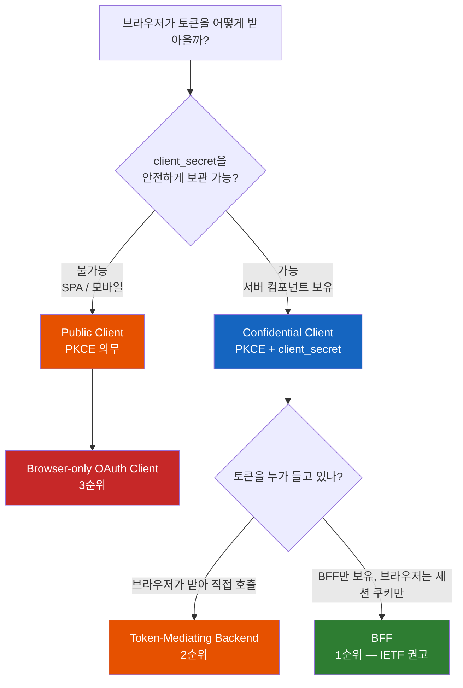
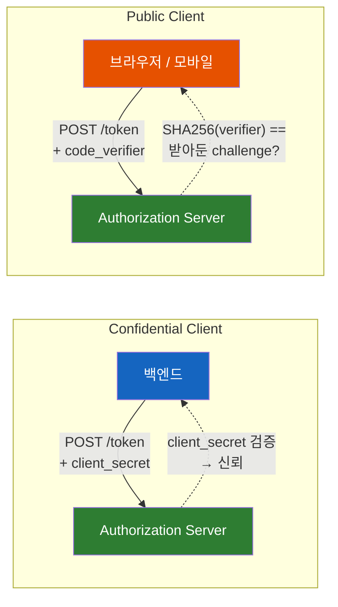
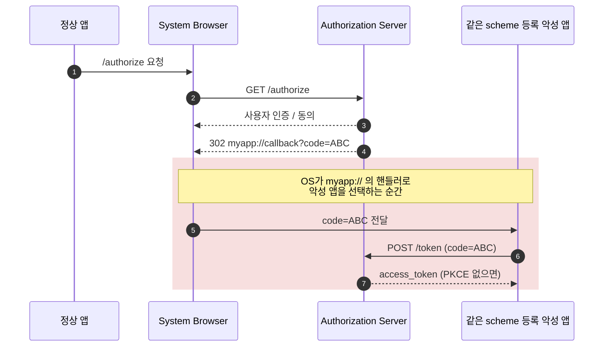
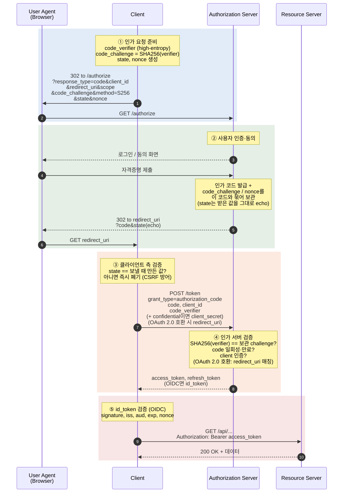
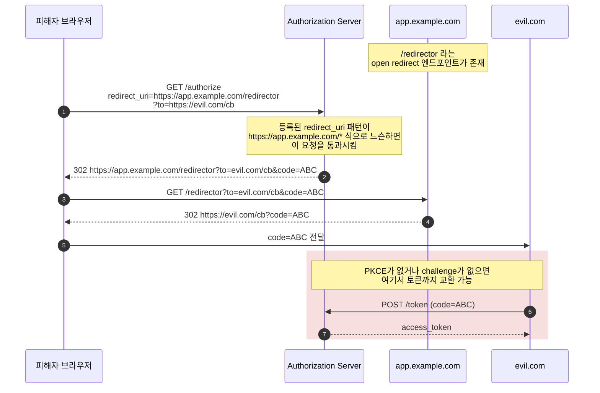
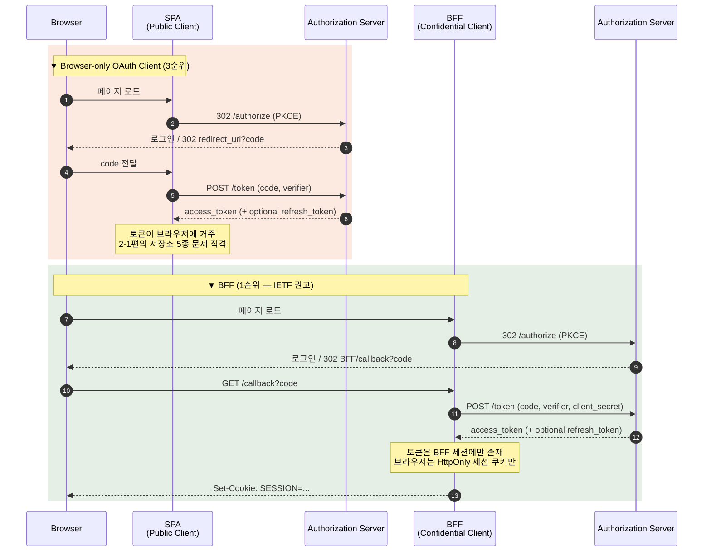
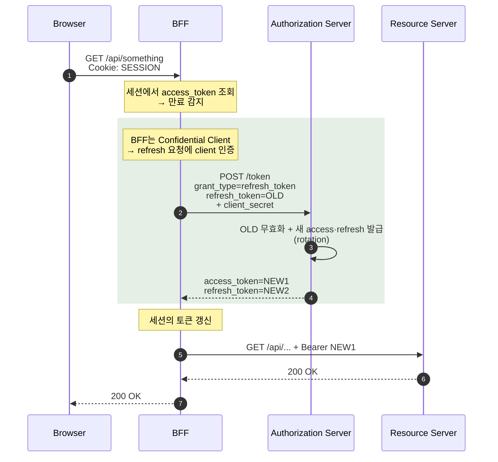
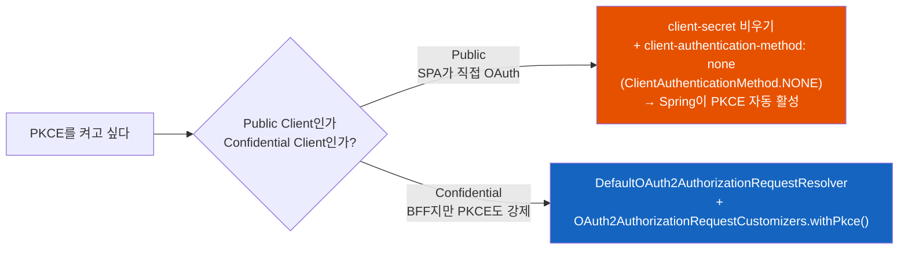

# 브라우저는 어떻게 토큰을 받아오는가 — OAuth 2.1, PKCE, BFF의 시퀀스를 끝까지 따라가기

SPA가 백엔드 없이 토큰을 받아오는 과정은 단순한 리다이렉트의 연속처럼 보인다. 그러나 그 안에는 **client_secret을 숨길 수 없다**는 한 가지 사실에서 파생된 PKCE, state, nonce, BFF 같은 결정들이 겹겹이 쌓여 있다. 이 글은 **토큰이 도대체 어떻게, 어떤 시퀀스를 거쳐 브라우저까지 도착하는가**를 끝까지 따라간다.

## 결론부터 말하면

**브라우저의 OAuth는 "client_secret을 안전하게 보관할 수 없다"는 단 한 가지 사실에서 모든 것이 파생된다.** SPA는 본질적으로 Public Client다. 그리고 Public Client는 PKCE 없이는 안전한 인가 코드 교환이 불가능하다. PKCE가 주는 것은 "client_secret의 흉내"가 아니라, **"같은 디바이스 안에서 인가 코드를 가로챌 수 있는 자도 토큰까지는 가져갈 수 없게" 만드는 보호막**이다.

이 보호막을 어디에 둘 것인가에 따라 [draft-ietf-oauth-browser-based-apps-26](https://datatracker.ietf.org/doc/draft-ietf-oauth-browser-based-apps/)는 세 가지 패턴을 보안 강도 순으로 정렬한다.



| 패턴 | OAuth 클라이언트 정체성 | 토큰의 거주지 | 브라우저가 직접 만지는 것 |
|------|----------------------|-------------|------------------------|
| **BFF** | 백엔드(Confidential) | 백엔드 세션 | HttpOnly 세션 쿠키 |
| **Token-Mediating Backend** | 백엔드(Confidential) | access token: 브라우저 / refresh token: 백엔드 세션 | access_token |
| **Browser-only** | 브라우저(Public) | 브라우저 | access_token (+ optional refresh_token) |

이 표의 위에서 아래로 내려갈수록 [2-1편](토큰을-어디에-둘-것인가-Cookie-Authorization-Header-Storage-5종-완전-비교.md)이 분석한 XSS 노출 표면이 넓어진다. 그래서 IETF 권고는 위에서부터 우선순위가 매겨진다. 이 글은 그 결정이 왜 그렇게 내려졌는지를 시퀀스 한 줄 한 줄을 따라가며 드러낸다.

## 1. 왜 OAuth 2.1인가 — 사라진 두 가지 길

OAuth 2.0은 2012년 [RFC 6749](https://datatracker.ietf.org/doc/html/rfc6749)로 표준화됐다. 그때의 명세는 네 가지 grant type을 늘어놓고 "용도에 맞게 골라 쓰라"고 했다. **Authorization Code, Implicit, Resource Owner Password Credentials(ROPC), Client Credentials.** 그런데 2026년의 [draft-ietf-oauth-v2-1-15](https://datatracker.ietf.org/doc/draft-ietf-oauth-v2-1/)에는 두 개가 사라져 있다. Implicit과 ROPC가 그것이다.

이 두 grant가 사라진 이유는 OAuth 2.1을 "이전과 호환되지 않는 새 프로토콜"이 아니라 **"OAuth 2.0이 10년간 학습한 보안 베스트 프랙티스의 응축본"** 으로 만들기 위해서다. 사라진 자리에 새로운 것이 들어온 것이 아니라, **위험하다고 누적적으로 판명된 길이 닫혔을 뿐**이다.

### 1.1 Implicit Grant가 사라진 이유

Implicit은 SPA가 처음 등장하던 시기의 답이었다. "브라우저는 비밀을 못 갖는다 → 그러니 토큰 교환 단계를 생략하고 access token을 redirect URL의 fragment(`#`)로 곧장 던져주자"는 발상이다.

```
https://app.example.com/callback#access_token=eyJhbGc...&token_type=Bearer
```

문제는 한두 개가 아니었다.

- **URL fragment는 브라우저 history와 즐겨찾기에 남는다.** 사용자가 뒤로가기를 누르거나 콜백 URL을 즐겨찾기에 저장하면 토큰이 세션 너머로 살아남는다.
- **JavaScript에 노출된 채 도착한다.** 콜백 페이지에서 실행되는 모든 스크립트 — 우리 코드, 광고 SDK, 분석 픽셀, 손상된 의존성, 브라우저 확장 — 이 `location.hash`를 그대로 읽는다. (참고로 [RFC 9110 §10.1.3](https://www.rfc-editor.org/rfc/rfc9110#section-10.1.3)은 `Referer` 생성 시 fragment를 제외하도록 의무화하므로, 위험의 본질은 Referer 누출이 아니라 콜백 처리 과정 자체의 노출이다.)
- **토큰 치환 공격이 가능하다.** 공격자가 자기 access token을 피해자의 콜백 URL에 박아 넣으면, 피해자가 알아채지 못한 채 공격자 계정의 데이터를 자기 데이터로 착각하게 된다.
- **refresh token을 받을 수 없다.** 그래서 만료 처리가 거칠어지거나, 무한히 긴 access token으로 도피하게 된다.

[RFC 9700](https://datatracker.ietf.org/doc/rfc9700/)과 OAuth 2.1은 "Implicit은 PKCE가 들어간 Authorization Code Flow로 대체하라"고 못박았다. 더 흥미로운 것은 **PKCE가 Implicit을 죽인 게 아니라, Implicit이 죽고 보니 그 자리를 PKCE 붙은 Authorization Code가 그대로 차지할 수 있었다**는 사실이다.

### 1.2 ROPC가 사라진 이유

ROPC는 더 단순한 죽음을 맞았다. **"클라이언트가 사용자의 비밀번호를 직접 받아서 토큰으로 교환하라"** 는 grant인데, OAuth가 처음에 풀고자 했던 문제 그 자체("비밀번호를 제3자에게 넘기지 않고 권한을 위임한다")의 해답을 정면으로 부정한다. MFA, 비밀번호리스 인증, 동의 화면, 외부 IdP 위임 — 어느 것도 ROPC 위에서 자연스럽게 동작하지 않는다.

### 1.3 결과 — 모든 길은 Authorization Code + PKCE로 모인다

사라진 둘을 빼고 나면 SPA·모바일·데스크톱 어디서든 단 하나의 길이 남는다. **Authorization Code Grant + PKCE.** 그리고 PKCE의 위치는 OAuth 2.0 시절의 "권장"에서 분명히 끌어올려졌다. [RFC 9700 §2.1.1](https://www.rfc-editor.org/rfc/rfc9700#section-2.1.1)은 **Public Client에 PKCE를 MUST**, **Confidential Client에는 RECOMMENDED**로 둔다. 단 하나의 예외는 OAuth 2.1 [§7.5.1](https://datatracker.ietf.org/doc/html/draft-ietf-oauth-v2-1-15#section-7.5.1)이 정의하는데, **Confidential Client이고 인가 서버가 그 클라이언트의 OIDC `nonce` 구현을 신뢰할 수 있을 때**에 한해 PKCE를 생략할 수 있다(그래도 RECOMMENDED). 이 글이 다루는 SPA는 모두 Public Client이거나 BFF의 Confidential Client이므로, 어느 경로에서든 PKCE는 사실상 항상 켜져 있는 모습으로 등장한다.

## 2. Public vs Confidential — 모든 결정의 출발

OAuth 2.0은 첫 문장에서 클라이언트를 두 종류로 갈라놓는다([RFC 6749 §2.1](https://datatracker.ietf.org/doc/html/rfc6749#section-2.1)).

| 분류 | 정의 | 실제 예시 |
|------|------|---------|
| **Confidential Client** | client_secret을 안전하게 보관할 수 있는 클라이언트 | 전통적 서버 사이드 웹 앱, BFF의 백엔드, M2M 서비스 |
| **Public Client** | client_secret을 안전하게 보관할 수 없는 클라이언트 | SPA, 네이티브 모바일/데스크톱 앱, IoT 디바이스 |

이 구분은 단순하지만 결정적이다. **클라이언트가 자기 정체성을 증명할 비밀을 가질 수 있는가**라는 단 하나의 질문이고, 답에 따라 인가 서버가 그 클라이언트를 신뢰하는 방식 자체가 달라진다.

브라우저가 비밀을 못 갖는 이유는 자명하다. 자바스크립트 번들에 `client_secret`을 박는 순간 그 문자열은 브라우저 사용자 누구나 DevTools로 열어 볼 수 있다. 모바일 네이티브 앱도 마찬가지다. 디스어셈블 도구는 무료고, 추출은 자동화되어 있다. 반면 BFF의 백엔드 코드는 사용자가 접근할 수 없는 서버 메모리 안에서만 살아 있다. 같은 OAuth 클라이언트라는 추상이지만, 그것이 어디서 실행되느냐에 따라 분류가 갈린다.

이 두 클라이언트는 인가 서버에 자기를 증명하는 방법이 다르다.



Confidential Client는 "내가 등록할 때 받은 secret을 알고 있다"는 사실로 자기를 증명한다. Public Client는 그게 불가능하니 다른 방식이 필요한데, 그것이 바로 PKCE다. **PKCE는 Public Client에게 "client_secret을 흉내내는 무언가"를 주는 것이 아니라, "인가 코드 가로채기를 막는 별개의 보호막"을 준다.** 이 정확한 구분이 다음 절의 핵심이다.

## 3. PKCE — code_verifier 한 쌍의 정확한 일

PKCE(Proof Key for Code Exchange, RFC 7636)는 직역하면 "코드 교환을 위한 증명 키"다. 이 작명에 답이 다 들어 있다. **인가 코드(code)를 토큰으로 교환(exchange)할 때, 자기가 그 코드를 처음 요청한 당사자임을 증명(proof)할 키(key)** 다. 무엇으로부터 보호하는가? **인가 코드 가로채기 공격(authorization code interception attack)** 으로부터.

### 3.1 인가 코드는 어떻게 가로채지는가

PKCE 없는 Authorization Code Flow에서 가장 무거운 데이터는 짧고 일회용인 인가 코드다. "이 코드를 토큰 엔드포인트에 들고 가면 access token으로 바꿔준다"는 영수증과 같다. 문제는 이 영수증이 **redirect URL의 query string**으로 흘러간다는 점이다. 같은 디바이스에서 누군가가 그 redirect를 가로챌 수 있다면, 영수증을 그대로 들고 토큰을 받아갈 수 있다.

이런 일이 실제로 일어나는 가장 대표적인 환경이 **모바일 네이티브 앱**이다. iOS와 Android에서 네이티브 앱은 `myapp://callback` 같은 custom URL scheme을 등록할 수 있다. 그런데 이 등록은 **OS 차원에서 유일성이 보장되지 않는다.** 같은 scheme을 두 앱이 등록하면 OS는 어떤 앱이 그 redirect를 받을지 결정해야 한다. 악성 앱이 같은 scheme을 등록한 채 먼저 설치되어 있다면, 정상 앱이 받아야 할 인가 코드를 악성 앱이 채갈 수 있다.



브라우저 환경에서도 비슷한 변종이 있다. iframe·브라우저 확장·악성 BHO 등이 redirect URL을 관찰하는 시나리오, 또는 OS의 URL 핸들러를 hijack하는 시나리오. **공통점은 "코드는 가져갔지만 처음 인가 요청을 보낸 당사자인지는 증명할 수 없다"** 이다. PKCE는 정확히 그 빈자리를 채운다.

### 3.2 PKCE 메커니즘 — verifier는 끝까지 숨고 challenge만 먼저 간다

PKCE는 일회용 비밀과 그 해시 한 쌍을 사용한다.

| 이름 | 어떻게 만들어지는가 | 어디로 가는가 |
|------|------------------|--------------|
| `code_verifier` | 클라이언트가 매 인가 요청마다 새로 생성하는 high-entropy 문자열 (43~128자) | **토큰 엔드포인트 호출 때까지 클라이언트 안에만 머문다** |
| `code_challenge` | `BASE64URL(SHA256(code_verifier))` (S256 방식) | 인가 요청에 함께 실려 인가 서버로 |
| `code_challenge_method` | `S256` (RFC 7636의 plain은 OAuth 2.1·RFC 9700에서 사실상 deprecated) | 인가 요청 |

흐름은 이렇다.

1. **인가 요청 전**: 클라이언트가 `code_verifier`를 새로 만들고 그 SHA-256 해시를 `code_challenge`로 보낸다.
2. **인가 서버**: 발급한 인가 코드와 함께 `code_challenge`를 보관해 둔다.
3. **토큰 교환**: 클라이언트가 `code`와 함께 **원본 `code_verifier`** 를 토큰 엔드포인트에 제출한다.
4. **인가 서버**: 받은 `code_verifier`를 SHA-256으로 해시한 값이 보관해 둔 `code_challenge`와 같은지 확인한다.

여기서 핵심은 **`code_verifier`가 토큰 엔드포인트 호출 때까지 어디에도 노출되지 않는다**는 사실이다. 위 3.1의 시나리오로 돌아가 보자. 악성 앱이 인가 코드를 가로챘다고 하자. 그 앱은 `code_challenge`는 알 수 있다(인가 요청 URL의 일부였으므로). 그러나 SHA-256은 일방향이므로 `code_challenge`로부터 `code_verifier`를 역산할 수 없다. 토큰 엔드포인트는 정확한 verifier가 없으면 토큰을 내주지 않는다. **코드는 가져갔지만 토큰은 가져갈 수 없다.**

이 메커니즘은 client_secret과 닮았지만 결정적으로 다르다.

| | client_secret | PKCE code_verifier |
|--|---------------|------------------|
| 언제 생성되나? | 클라이언트 등록 시 1회 | 매 인가 요청마다 |
| 어디에 보관되나? | 클라이언트 (영구) | 클라이언트 (한 흐름 동안만) |
| 어디까지 가나? | 토큰 엔드포인트 | 토큰 엔드포인트 |
| 누가 검증하나? | 인가 서버 | 인가 서버 |
| 누출되면? | **모든 미래 흐름이 위험** | **그 한 번의 흐름만 위험** |

PKCE는 client_secret을 흉내낸 것이 아니라, **"흉내낼 수 없는 환경(브라우저)에서도 일회성 흐름의 무결성은 지킬 수 있게" 만든 별개의 도구**다. 그래서 보호 범위도 자연스럽게 Public Client 너머로 확장됐다. **[RFC 9700 §2.1.1](https://www.rfc-editor.org/rfc/rfc9700#section-2.1.1)** 은 Public Client에 PKCE를 MUST, **Confidential Client에는 RECOMMENDED**로 두고 OIDC `nonce` 대안을 MAY로 허용한다. **[OAuth 2.1 draft-15 §7.5.1](https://datatracker.ietf.org/doc/html/draft-ietf-oauth-v2-1-15#section-7.5.1)** 은 그보다 강하게, "Confidential Client이고 인가 서버가 그 클라이언트의 OIDC `nonce` 구현을 신뢰할 수 있을 때"라는 좁은 예외를 빼면 PKCE를 기본 요구사항으로 둔다. client_secret이 영구 비밀을 책임진다면, PKCE는 한 흐름의 무결성을 책임진다. 둘은 보호 영역이 다르다.

> **SPA에서만 부각되는 기술적 전제 하나.** 인가 요청과 토큰 교환 사이에 브라우저는 인가 서버로 한 번 이탈했다 돌아온다. 그 사이 페이지는 사라지고 메모리도 초기화된다. 그래서 `code_verifier`(와 `state`/`nonce`)는 인가 요청 직전에 생성하더라도 **탭 단위 임시 저장소(예: `sessionStorage`)에 명시적으로 보관**해 두었다가 콜백 페이지에서 다시 꺼내야 한다(이 부분은 PKCE의 표준 요구가 아니라 SPA 구현이 흐름의 중간 상태를 어디에 둘지에 대한 선택이다). 메모리 변수에만 두면 콜백에서 verifier가 사라진 채 토큰 교환이 실패한다. 굳이 `sessionStorage`인 이유는 두 가지다 — `localStorage`와 달리 **탭(top-level browsing context)별로 격리**되므로 사용자가 여러 탭에서 동시에 로그인 흐름을 진행해도 verifier/state가 서로 덮어쓰이지 않고, 탭이 닫히면 자동으로 폐기되어 흐름이 미완료로 남았을 때의 잔류물이 줄어든다. 이 자리는 [2-1편](토큰을-어디에-둘-것인가-Cookie-Authorization-Header-Storage-5종-완전-비교.md)에서 본 "토큰의 영구 저장소"가 아니라 **흐름 한 번을 잇는 일회용 저장소**다. 토큰 교환 직후 즉시 삭제하면 노출 표면은 한 번 흐름의 길이로 닫힌다. (참고: 인가 흐름이 새 창/팝업으로 열리는 SDK 패턴이라면 `sessionStorage`가 탭 단위라 부모 탭의 verifier에 닿지 못한다 — 이 경우 `BroadcastChannel`이나 `postMessage`로 두 컨텍스트를 잇는 별도 코드가 필요하다.)

### 3.3 plain은 왜 deprecated인가, 그리고 PKCE Downgrade Attack

[RFC 7636](https://datatracker.ietf.org/doc/html/rfc7636)은 두 가지 challenge method를 정의했다.

- **plain**: `code_challenge = code_verifier` (해시 없이 그대로)
- **S256**: `code_challenge = BASE64URL(SHA256(code_verifier))`

plain은 위에서 본 보호를 사실상 제공하지 못한다. 인가 요청을 관찰할 수 있는 자는 곧 verifier도 안다. RFC 9700은 "verifier를 노출하지 않는 방법을 사용하라, 현재 그 조건을 만족하는 것은 S256뿐"이라고 못박았다. **클라이언트가 S256을 지원하면 반드시 S256을 써야 한다.** plain은 SHA-256 구현이 없는 극히 제한된 환경의 호환용으로만 남는다.

그런데 여기서 또 하나 무서운 변종이 있다. **PKCE Downgrade Attack**. 공격자가 인가 요청을 가로채 `code_challenge` 파라미터를 통째로 제거한 뒤 인가 서버에 흘려보낸다. 보호조치 없는 인가 서버는 "PKCE 없이 발급된 코드"로 처리해 토큰 교환 단계에서 verifier 검증을 생략한다. 그러면 PKCE의 보호가 무력화된다.

이를 막기 위해 RFC 9700은 인가 서버에 두 가지를 요구한다.

1. **PKCE 지원 여부를 클라이언트가 감지할 수 있게 하라.** Authorization Server Metadata([RFC 8414](https://datatracker.ietf.org/doc/html/rfc8414))의 `code_challenge_methods_supported` 필드로 지원하는 method를 공개하는 것이 **권장**되며, 배포별로 다른 방식의 통지도 허용된다.
2. **토큰 요청에 `code_verifier`가 들어왔다면, 인가 요청에 `code_challenge`도 있었는지 확인하라.** 둘 중 하나만 있다면 거부해야 한다(반대 방향 일관성도 포함).

이 두 조치가 들어가면 공격자가 challenge를 제거해도, 토큰 단계에서 verifier가 등장하는 순간 인가 서버가 일관성 위반을 감지한다.

## 4. Authorization Code + PKCE 풀 시퀀스 — 한 줄씩 따라가기

이제 위의 모든 조각을 묶어 한 흐름으로 본다. **이 시퀀스가 OAuth 2.1·RFC 9700·OIDC를 통틀어 SPA가 토큰을 받아오는 정통의 길이다.** 한 가지 미리 짚어둘 것 — 시퀀스 안에 등장하는 "클라이언트 측 검증"(state 매칭, ID Token signature/iss/aud/exp/nonce)은 **BFF 패턴에서는 브라우저 JS가 아니라 BFF 백엔드가 수행한다.** 브라우저는 콜백 URL을 그대로 BFF에 흘려보낼 뿐이고, 검증의 책임은 confidential client인 BFF가 진다. SPA가 직접 OAuth를 도는 Browser-only 패턴에서만 이 검증이 브라우저 JS의 일이다.



위 시퀀스의 한 줄 한 줄이 무엇을 검증하고, 빠지면 무엇이 무너지는지 정리한다.

### 4.1 state — CSRF 방어선 (Authorization Code Flow의 CSRF)

`state`는 클라이언트가 인가 요청을 만들 때 생성해 함께 보내는 값이다. 인가 서버는 그것을 redirect 응답에 그대로 실어 돌려준다. **클라이언트는 자기가 보낸 값과 돌아온 값이 일치하는지 확인해야 한다.**

이 한 줄을 빼먹으면 어떻게 되는가? 공격자가 자기 계정으로 인가 흐름을 시작해 인가 코드를 받은 뒤, 그 코드가 실린 redirect URL을 피해자에게 클릭하게 만든다. 피해자의 브라우저는 그 코드를 자기 클라이언트의 콜백으로 가져가 토큰으로 교환하고, 그 결과 **피해자가 공격자의 계정에 로그인된 상태로 머물게 된다.** 사용자는 자기 계정인 줄 알고 데이터를 입력하지만 모두 공격자 계정에 쌓인다(account confusion / login CSRF).

state 검증이 들어가면 이 공격은 막힌다. 공격자가 만든 흐름의 state는 피해자 브라우저에 저장된 state와 다르므로 클라이언트가 즉시 폐기한다.

### 4.2 nonce — OIDC ID Token의 replay 방어

`nonce`는 OIDC([OpenID Connect Core 1.0 §3.1.2.1](https://openid.net/specs/openid-connect-core-1_0.html#AuthRequest))에서 들어왔다. state와 비슷해 보이지만 보호 영역이 다르다.

- **state**: 인가 코드 흐름 자체의 무결성을 보호 → CSRF
- **nonce**: 발급된 ID Token의 무결성을 보호 → ID Token replay

클라이언트가 인가 요청에 `nonce`를 실어 보내면, 인가 서버는 발급되는 ID Token의 클레임에 그 nonce를 그대로 넣는다. 클라이언트는 ID Token을 검증할 때 자기가 보낸 nonce와 같은지 비교한다. **공격자가 다른 흐름에서 발급된 ID Token을 가로채 재사용하려 해도, 그 토큰의 nonce 클레임은 현재 흐름의 nonce와 다르므로 거부된다.**

### 4.3 ID Token 검증 — 5종 점검은 모두 다른 위협을 막는다

OIDC ID Token은 받았다고 끝이 아니다. 다섯 가지를 검증해야 한다.

| 점검 항목 | 무엇을 막는가 |
|----------|--------------|
| **signature** | 토큰 위조 |
| **iss** (issuer) | 가짜 IdP가 발급한 토큰을 속아 받는 일 |
| **aud** (audience) | 다른 클라이언트용으로 발급된 토큰을 우리 토큰으로 쓰는 일 (token substitution) |
| **exp** (expiry) | 만료 토큰 사용 |
| **nonce** | ID Token replay (4.2) |

**aud 검증을 빼먹으면 발생하는 사고**가 OIDC의 가장 흔한 잘못 중 하나다. 같은 IdP를 쓰는 클라이언트 A와 B가 있을 때, 사용자가 A에서 받은 ID Token을 B에 가져다 붙이면 B가 그것을 자기 토큰으로 받아들이는 사고가 일어난다. aud는 토큰이 누구를 향해 발급되었는지를 명시하므로, 받은 쪽은 반드시 자기 client_id와 일치하는지 확인해야 한다.

### 4.4 redirect_uri — 정확 매칭의 자리는 인가 요청 단계로 모인다

`redirect_uri`의 검증 자리는 OAuth 2.0과 OAuth 2.1에서 다르다.

- **OAuth 2.0 ([RFC 6749 §4.1.3](https://datatracker.ietf.org/doc/html/rfc6749#section-4.1.3))**: 인가 요청과 토큰 요청 양쪽에 `redirect_uri`가 실리고, 인가 서버는 두 값이 일치하는지 비교했다. 코드 인젝션을 막기 위한 장치였다.
- **OAuth 2.1 ([draft-15 §10.2](https://datatracker.ietf.org/doc/html/draft-ietf-oauth-v2-1-15#section-10.2))**: 토큰 요청의 `redirect_uri` 파라미터가 **제거됐다.** 같은 보호를 PKCE의 `code_verifier`가 더 강하게 제공하므로 더 보낼 이유가 없다. 인가 서버는 OAuth 2.0 클라이언트와의 호환을 위해 들어오면 받아서 RFC 6749대로 매칭해야 하지만, **OAuth 2.1만 따르는 클라이언트는 그 파라미터를 보내지 않는다.**

남는 검증은 인가 요청 단계 한 곳뿐이고, 그 자리가 강해졌다. RFC 9700과 OAuth 2.1은 인가 서버가 인가 요청의 `redirect_uri`를 클라이언트가 등록해 둔 값과 **exact string matching**으로 비교하도록 의무화했다(loopback IP의 포트만 예외). 인가 서버는 발급한 인가 코드에 그 `redirect_uri`를 묶어 두므로, 토큰 요청 단계에서 굳이 한 번 더 확인하지 않아도 코드 인젝션은 PKCE 검증으로 닫힌다. 이 정확 매칭이 왜 그토록 중요한지는 다음 절에서 본다.

## 5. Redirect 함정 — 한 글자 차이가 코드를 잃게 만든다

OAuth 2.0의 초창기에는 redirect URI 매칭이 느슨했다. prefix 매칭, wildcard 매칭, query 무시 등 구현이 제각각이었다. 그 결과 **Open Redirect를 통한 인가 코드 탈취**라는 부류의 공격이 무수히 보고되었다.

### 5.1 Open Redirect → 인가 코드 탈취

공격 시퀀스는 단순하다.



이 공격을 막는 길은 두 갈래다.

1. **인가 서버는 redirect_uri를 exact string match로 검증하라** (RFC 9700·OAuth 2.1).
2. **PKCE를 의무로 하라.** 코드를 가로채도 verifier가 없으니 토큰까지는 못 간다.

두 보호가 함께 들어가면 위 공격은 두 단계에서 막힌다. **방어는 한 곳에 의지하지 않는다.** RFC 9700이 Public Client에 PKCE를 MUST로 끌어올린 결정, 그리고 OAuth 2.1이 좁은 OIDC `nonce` 예외를 빼고는 PKCE를 기본 요구로 둔 결정도 이 다층 방어의 연장선이다.

### 5.2 response_mode — query / fragment / form_post

같은 인가 코드라도 어디에 실려 돌아오느냐는 또 다른 결정 사항이다.

| response_mode | 코드가 실리는 위치 | 특성 |
|---------------|-----------------|------|
| `query` | URL query string | 기본값, 서버 로그·Referer·history에 남을 수 있음 |
| `fragment` | URL fragment (`#`) | 서버에 안 보내짐(브라우저 안에서만), Implicit이 쓰던 자리 |
| `form_post` | POST body (자동 form submit) | history·Referer에 안 남음, OIDC가 정의 |

Authorization Code Flow는 보통 `query`를 쓴다(코드가 서버에 보내져야 하므로). `form_post`는 OIDC의 ID Token을 직접 받을 때 history 노출을 줄이려는 선택이다. **OAuth 2.1은 token in query string은 금지하지만, code in query는 허용한다.** 코드는 일회성·짧은 수명·PKCE 보호가 있으므로 토큰과 다른 등급으로 본다.

## 6. Browser-only vs BFF — 같은 시퀀스의 분기

지금까지의 시퀀스는 **"클라이언트가 누구인가"** 라는 자리에 SPA를 그대로 넣어도, BFF의 백엔드를 넣어도 똑같이 동작한다. 그러나 [draft-ietf-oauth-browser-based-apps-26](https://datatracker.ietf.org/doc/draft-ietf-oauth-browser-based-apps/)은 두 길을 명확히 구분한다.



**시퀀스의 모양은 같다. 갈라지는 한 점은 `POST /token`의 응답을 누가 받느냐다.**

- **Browser-only**: SPA(브라우저 내 JS)가 직접 받는다. 그 순간부터 access token과 refresh token은 [2-1편](토큰을-어디에-둘-것인가-Cookie-Authorization-Header-Storage-5종-완전-비교.md)이 분석한 다섯 저장소 중 어디엔가 들어가야 한다. XSS 노출 표면이 즉시 활성화된다.
- **BFF**: 백엔드가 받는다. **Spring/서버 사이드 세션 기반 BFF에서는** 토큰이 백엔드 세션 저장소(메모리·Redis·DB 등)에 들어가고, 브라우저에는 그 세션을 식별하는 HttpOnly·Secure·SameSite 쿠키만 내려간다. (draft-26은 BFF의 일반 모델로 **암호화된 클라이언트 사이드 쿠키 세션**도 허용한다 — 이 경우에도 키는 BFF가 들고 있고 쿠키 본문은 브라우저 JS가 못 푸므로 결과는 같다.) 브라우저 JS는 토큰을 한 번도 만지지 않는다.

draft-26은 BFF의 책임을 세 가지로 명문화한다.

1. **Authorization Server에 대해 Confidential OAuth Client로 동작.**
2. **OAuth access/refresh 토큰을 쿠키 기반 세션 컨텍스트 안에서 관리.** JavaScript에 직접 노출하지 않는다.
3. **모든 Resource Server 요청을 자기 자신을 통해 프록시.** 요청에 access token을 붙이는 것은 BFF의 일이다.

이 세 책임이 깨지지 않는 한, **브라우저에는 추출할 토큰이 없다.** draft-26의 표현으로는 **"Single-Execution Token Theft"** (활성 세션 중 XSS가 한 번 실행되어 토큰을 그 자리에서 탈취해 가는 시나리오)도, **"Persistent Token Theft"** (브라우저 저장소에 영속된 토큰을 나중에 꺼내 가는 시나리오)도 구조적으로 차단된다. 동시에 BFF가 Confidential Client이므로 공격자가 같은 클라이언트로 새 OAuth 흐름을 시작해 토큰을 얻어내는 것도 막힌다.

남는 위험은 무엇인가? [2-1편](토큰을-어디에-둘-것인가-Cookie-Authorization-Header-Storage-5종-완전-비교.md)이 분석한 그대로다. **BFF는 토큰 탈취(Theft)는 구조적으로 닫지만, 활성 세션을 올라타는 대리 호출(Session Riding)은 별개의 위협으로 살아 있다.** 그리고 그 라이딩은 보호 범위가 다른 두 축으로 갈라진다.

- **Cross-site Session Riding (CSRF)** → SameSite Lax/Strict, double-submit 쿠키, Origin/Referer 검증으로 막는다. 외부 사이트가 우리 BFF API를 사용자 쿠키로 호출하는 자리.
- **Same-origin XSS Riding** → CSRF 방어로는 막히지 않는다. 같은 origin에서 실행되는 악성 JS는 정당한 호출처럼 보인다. 이 자리는 **XSS 자체를 못 들어오게 하는 일** — Content Security Policy, 입출력 escape, 의존성 감사 — 그리고 **서버 측의 추가 방어선** — 자원 단위 권한 검사(인가를 토큰/세션만으로 판단하지 않고 리소스 ACL과 함께), 민감 작업의 step-up 인증, 이상 탐지·rate limit — 으로 완화해야 한다.

추가로 **악성 브라우저 확장의 chrome.cookies API를 통한 세션 하이재킹**도 BFF 위에서는 닫히지 않는다(브라우저 권한 모델 바깥의 위협). BFF는 토큰을 닫아도 세션은 여전히 같은 쿠키 모델 위에 있다는 사실을 잊지 않는 것이 핵심이다.

### 6.1 Token-Mediating Backend — 어중간한 자리

draft-26이 정의하는 두 번째 패턴은 BFF와 Browser-only의 중간이다. 백엔드가 OAuth 클라이언트 역할은 맡지만, 받아낸 access token을 브라우저에 내려준다. 브라우저는 그 토큰으로 Resource Server를 직접 호출한다.

이 패턴의 매력은 "백엔드가 client_secret 책임을 진다"는 한 줄이다. 그러나 단점이 명확하다. **토큰이 브라우저에 거주하는 순간**, [2-1편](토큰을-어디에-둘-것인가-Cookie-Authorization-Header-Storage-5종-완전-비교.md)의 저장소 문제가 다시 켜진다. 게다가 draft-26은 추가 위험으로 **scope elevation**을 지적한다. 토큰 발급을 캐시하고 재사용할 때, 캐시된 토큰의 scope가 프론트엔드가 요청한 scope의 상위 집합이라면 그 큰 scope의 토큰을 그대로 내려줄 수 있다. 백엔드가 의도하지 않은 권한 확대다. 막으려면 refresh token으로 더 작은 scope의 새 토큰을 발급받아 내려주는 별도 로직이 필요하다.

그래서 IETF 권고 순서는 BFF > Token-Mediating > Browser-only다. 토큰을 브라우저에 두지 않을 수 있다면 두지 마라, 두어야 한다면 그 결정을 관통하는 위협을 모두 의식하라는 것이다.

## 7. Refresh & Logout — 받아온 뒤의 라이프사이클

토큰은 받는 순간이 끝이 아니다. 만료가 오면 갱신해야 하고, 사용자가 로그아웃하면 뜻한 대로 죽어야 한다.

### 7.1 BFF의 Refresh Token Rotation

[2-1편](토큰을-어디에-둘-것인가-Cookie-Authorization-Header-Storage-5종-완전-비교.md)에서 본 refresh rotation은 BFF 위에서 가장 자연스럽다. draft-26의 그림은 다음과 같다.



여기서 두 가지가 결정적이다.

- **Refresh 호출 자체가 client_secret으로 인증된다.** 그 결과 **refresh token이 그 발급 대상인 Confidential Client에 묶인다 (client binding / client authentication).** 도난된 refresh token만 가지고는 다른 클라이언트가 그것을 쓸 수 없다. (참고로 OAuth 용어상 **"sender-constrained token"** 은 mTLS([RFC 8705](https://datatracker.ietf.org/doc/html/rfc8705))나 DPoP([RFC 9449](https://datatracker.ietf.org/doc/html/rfc9449))처럼 토큰을 특정 sender의 키에 암호학적으로 묶는 별개의 개념이다 — Confidential Client의 client authentication은 그것과 다르다.)
- **Rotation은 도난 탐지의 출발점이다.** 같은 OLD refresh token이 두 번 들어오면 인가 서버는 "어딘가에서 도난당했다"고 판단해 그 패밀리 전체를 폐기한다. [2-1편](토큰을-어디에-둘-것인가-Cookie-Authorization-Header-Storage-5종-완전-비교.md)에서 본 도난 탐지 흐름이 그대로 동작한다.

### 7.2 OIDC RP-Initiated Logout과 Back-channel Logout

로그아웃은 BFF 세션을 죽이는 것만으로 끝나지 않는다. **IdP의 세션도 끝내야** 다른 RP에 잔류한 SSO 세션이 사용되지 않는다. 두 가지 메커니즘이 정의돼 있다.

| 메커니즘 | 시작점 | 흐름 |
|---------|-------|------|
| **[RP-Initiated Logout](https://openid.net/specs/openid-connect-rpinitiated-1_0.html)** | RP가 사용자를 IdP의 `end_session_endpoint`로 보냄 | IdP가 자기 세션 종료 → 등록된 `post_logout_redirect_uri`로 다시 보냄 |
| **[Back-Channel Logout](https://openid.net/specs/openid-connect-backchannel-1_0.html)** | IdP가 RP에 직접 logout 요청을 보냄(서버-서버) | RP가 logout token을 검증하고 자기 세션 종료 |

BFF 패턴에서 흥미로운 점은 **back-channel logout이 자연스럽게 동작한다**는 것이다. IdP가 BFF에 직접 로그아웃 알림을 보낼 수 있는 서버 사이드 엔드포인트가 BFF에 이미 있기 때문이다. Browser-only 패턴에서는 브라우저가 닫혀 있을 때 IdP가 도달할 수 있는 RP 컴포넌트 자체가 없다. 이 한 점이 SSO 환경에서 BFF가 더 깨끗하게 동작하는 또 하나의 이유다(단 한 가지 전제: **IdP가 BFF의 back-channel 엔드포인트에 네트워크로 도달할 수 있어야 한다.** 사설망이나 외부 인입이 막힌 환경에서는 동작하지 않으므로, 외부에서 도달 가능한 별도의 webhook 게이트웨이를 두거나 IdP를 같은 네트워크 안으로 끌어들이는 설계가 함께 따라온다).

## 8. Spring 비교 — 어디에 어떤 클래스가 있는가

지금까지의 시퀀스를 Spring으로 옮긴다면 어디에 어떤 클래스가 자리잡는지 정리한다.

### 8.1 클라이언트 측 — spring-boot-starter-oauth2-client

Spring Security의 `oauth2Login()`이 활성화되면 위 시퀀스의 ①~⑤가 자동으로 구성된다.

```yaml
spring:
  security:
    oauth2:
      client:
        registration:
          my-idp:
            client-id: spa-bff
            client-secret: ${IDP_CLIENT_SECRET}
            authorization-grant-type: authorization_code
            redirect-uri: "{baseUrl}/login/oauth2/code/{registrationId}"
            scope: openid, profile, email
        provider:
          my-idp:
            issuer-uri: https://idp.example.com
```

핵심 클래스는 둘이다.

- **`ClientRegistration`**: 위 설정이 매핑되는 객체. client-id·client-secret·redirect-uri·grant-type·scopes·provider 메타데이터를 모두 담는다.
- **`OAuth2AuthorizedClient`**: 인가 코드 교환이 끝난 뒤 발급된 access/refresh 토큰을 들고 있는 객체. 기본 저장 위치는 `OAuth2AuthorizedClientRepository`(보통 HTTP 세션).

위 시퀀스에 매핑하면 Spring 앱은 정확히 BFF 역할을 한다. **토큰은 서버 세션 안에 머물고, 브라우저에는 `JSESSIONID`(또는 Spring Session의 세션 쿠키)만 내려간다.** [2-1편](토큰을-어디에-둘-것인가-Cookie-Authorization-Header-Storage-5종-완전-비교.md)의 BFF 결론과 정확히 닿는다.

### 8.2 PKCE 활성화 — `ClientAuthenticationMethod.NONE`과 `withPkce()`

Spring Security 6은 PKCE를 두 경로로 지원한다.



Confidential Client 경로(D)의 코드는 다음과 같다.

```java
@Bean
public OAuth2AuthorizationRequestResolver authorizationRequestResolver(
        ClientRegistrationRepository repo) {
    var resolver = new DefaultOAuth2AuthorizationRequestResolver(
        repo,
        OAuth2AuthorizationRequestRedirectFilter.DEFAULT_AUTHORIZATION_REQUEST_BASE_URI
    );
    resolver.setAuthorizationRequestCustomizer(
        OAuth2AuthorizationRequestCustomizers.withPkce()
    );
    return resolver;
}

@Bean
SecurityFilterChain chain(HttpSecurity http,
        OAuth2AuthorizationRequestResolver resolver) throws Exception {
    http
        .authorizeHttpRequests(a -> a.anyRequest().authenticated())
        .oauth2Login(o -> o.authorizationEndpoint(e ->
            e.authorizationRequestResolver(resolver)
        ));
    return http.build();
}
```

Public Client 경로(C)는 설정이 한층 단순하다. `client-secret`을 빈 값으로 두고 `client-authentication-method: none`을 지정하면, Spring Security가 그 클라이언트를 Public Client로 분류해 PKCE를 자동 적용한다. 다만 [2-1편](토큰을-어디에-둘-것인가-Cookie-Authorization-Header-Storage-5종-완전-비교.md)과 이 글의 결론에 따르면, **프로덕션 SPA에서 Public Client 경로는 IETF 권고 3순위다.** Spring 환경에서 첫 번째 답은 항상 BFF + 강제 PKCE다.

### 8.3 BFF 토큰 첨부 — Spring Cloud Gateway TokenRelay

BFF가 React/Vue SPA의 정적 자산만 서빙하고 모든 API 호출을 백엔드의 Resource Server로 프록시하는 구조라면, 그 프록시 자리에 정확히 들어맞는 컴포넌트가 [Spring Cloud Gateway의 `TokenRelay` 필터](https://docs.enterprise.spring.io/spring-cloud-gateway/reference/spring-cloud-gateway/gatewayfilter-factories/tokenrelay-factory.html)다(이 필터는 Spring Cloud Gateway 전용이며, 일반 Spring Boot Servlet 환경의 BFF에서는 `AuthorizedClientServiceOAuth2AuthorizedClientManager`로 `WebClient`/`RestTemplate`에 토큰을 주입하는 방식을 쓴다).

```yaml
spring:
  cloud:
    gateway:
      routes:
        - id: api
          uri: https://resource.example.com
          predicates:
            - Path=/api/**
          filters:
            - TokenRelay
```

이 한 줄이 하는 일은 위 시퀀스의 마지막 단계다. **세션에서 `OAuth2AuthorizedClient`를 찾아 access token을 꺼내고, 다운스트림 Resource Server 호출에 `Authorization: Bearer ...` 헤더로 붙인다.** 토큰을 브라우저에 한 번도 노출하지 않는다.

실무에서 한 가지 더 자주 막히는 자리는 **로그인 성공 직후 사용자를 SPA의 어느 경로로 돌려보낼 것인가**다. Spring Security의 `oauth2Login()`은 `defaultSuccessUrl(...)` 또는 커스텀 `AuthenticationSuccessHandler`로 그 자리를 잡아준다. SPA가 라우팅을 책임지므로, 보통 `/`나 `/app` 같은 SPA 진입점을 지정하고 그 뒤의 클라이언트 사이드 라우팅은 SPA가 이어 받는다. 다중 인스턴스 환경이라면 한 단계 더 — `OAuth2AuthorizedClient`와 HTTP 세션을 어디에 둘지(Spring Session + Redis, JDBC `OAuth2AuthorizedClientService` 등), 로그아웃 시 세션과 refresh token을 함께 폐기하는 전략을 함께 설계해야 한다.

### 8.4 자체 IdP — Spring Authorization Server

위까지가 OAuth 클라이언트 쪽이라면, 인가 서버 자체를 자기 손으로 운영해야 할 때는 [Spring Authorization Server](https://docs.spring.io/spring-authorization-server/reference/)가 답이다. 위 시퀀스의 AS 자리에 들어간다.

```java
RegisteredClient publicClient = RegisteredClient.withId(UUID.randomUUID().toString())
    .clientId("spa-public")
    .clientAuthenticationMethod(ClientAuthenticationMethod.NONE)
    .authorizationGrantType(AuthorizationGrantType.AUTHORIZATION_CODE)
    .redirectUri("http://127.0.0.1:4200/callback")
    .scope("openid")
    .clientSettings(ClientSettings.builder()
        .requireProofKey(true)        // PKCE 강제
        .requireAuthorizationConsent(true)
        .build())
    .build();
```

Spring Authorization Server에서는 public client든 confidential client든 `requireProofKey(true)`(또는 YAML의 `require-proof-key: true`)로 PKCE 요구를 명시적으로 켜는 것이 권장된다. **Confidential Client에 켤 때 의미가 한층 분명하다.** RFC 9700 §2.1.1이 Confidential Client에 PKCE를 RECOMMENDED로 두고 OAuth 2.1이 좁은 OIDC `nonce` 예외 외엔 기본 요구로 두므로, 이 한 줄은 그 권고를 안전한 쪽으로 강제로 끌어올리는 자리에 정확히 놓인다.

## 9. 결정 가이드 — 당신의 상황별 추천

지금까지의 모든 결정이 어떤 상황에서 어떻게 닫히는지 짧은 표로 정리한다.

| 상황 | 추천 패턴 | 이유 |
|------|---------|------|
| **공개 프로덕션 SPA** (소비자 웹앱) | **BFF + Confidential PKCE + HttpOnly Session Cookie** | XSS 노출 표면 최소화. 2-1편의 5속성 + 이 글의 시퀀스가 모두 같은 결론으로 모임 |
| **사내 내부 SPA** (망분리, 단순 SSO) | BFF가 1순위지만 Browser-only도 검토 가능 | 위협 모델이 좁고 BFF 운용 비용이 클 때. PKCE는 항상 켤 것 |
| **모바일 / 데스크톱 네이티브** | System Browser + custom URL scheme(또는 [PKCE 위 Universal/App Links](https://datatracker.ietf.org/doc/html/rfc8252)) + Public Client + PKCE | client_secret을 가질 수 없음. PKCE가 코드 가로채기를 닫는 유일한 보호. WebView OAuth는 RFC 8252가 명시적으로 비권장 |
| **IoT / TV / 입력 어려운 디바이스** | **Device Authorization Grant** ([RFC 8628](https://datatracker.ietf.org/doc/html/rfc8628)) | 디바이스가 polling으로 토큰을 받고 사용자는 별도 디바이스(스마트폰 등)에서 user code를 입력해 동의. 토큰 요청은 `grant_type` + `device_code` + `client_id`로 구성되므로 **PKCE의 `code_challenge`/`code_verifier`는 이 grant에 정의되지 않는다.** 보호는 짧은 user code 수명·polling 간격 제어(`slow_down`)·user code brute-force 방어·가능한 경우의 client authentication·refresh token rotation/sender-constraining(DPoP·mTLS)으로 대신 한다. 이 글의 redirect 모델이 안 통하는 자리 |
| **임베디드 위젯 / 3rd-party 사이트에 박히는 SDK** | 부모 페이지의 BFF에 위임하거나, 자체 IdP의 federation을 사용 | 임베드된 컨텍스트에서는 인가 흐름의 redirect 자체가 어려움 |
| **데모 / 학습 / 짧은 수명 프로젝트** | Browser-only + PKCE도 OK | "안전 저장소"가 없는 비용을 받아들일 수 있을 때만. 단, 토큰 만료를 짧게 가져갈 것 |

## 10. 정리

이 글이 답한 질문은 단 하나였다. **브라우저는 어떻게 토큰을 받아오는가.** 그 답을 거꾸로 쌓아 보면 다음과 같다.

- 브라우저는 **client_secret을 안전하게 보관할 수 없다.** 이 한 가지 사실이 모든 결정의 시작점이다.
- 그래서 SPA가 직접 OAuth를 하면 **Public Client**가 되고, **PKCE가 의무**가 된다(RFC 9700·OAuth 2.1).
- PKCE는 client_secret을 흉내내는 것이 아니라, **인가 코드 가로채기로부터 한 흐름의 무결성을 보호**한다. plain은 사실상 deprecated, S256만이 답이다.
- Authorization Code Flow의 한 줄 한 줄은 다른 위협을 막는다. **state는 CSRF, nonce는 ID Token replay, aud는 token substitution, redirect_uri exact match는 Open Redirect 코드 탈취.** 어느 한 줄도 장식이 아니다.
- 토큰을 받아온 뒤가 더 큰 결정이다. **Browser-only는 [2-1편](토큰을-어디에-둘-것인가-Cookie-Authorization-Header-Storage-5종-완전-비교.md)의 저장소 문제 직격**, **BFF는 토큰을 브라우저 밖에 두어 그 문제를 구조적으로 닫는다.** 그래서 [draft-ietf-oauth-browser-based-apps-26](https://datatracker.ietf.org/doc/draft-ietf-oauth-browser-based-apps/)는 BFF를 1순위로 명문화했다.
- Spring 환경에서 이 결정은 **`spring-boot-starter-oauth2-client` + 세션 + Spring Cloud Gateway `TokenRelay`** 의 조합으로 정확히 BFF가 된다. PKCE 강제는 `OAuth2AuthorizationRequestCustomizers.withPkce()` 한 줄이 책임지고, 자체 IdP라면 Spring Authorization Server의 `requireProofKey(true)`가 그 자리를 받는다.

[1편](Fetch-AbortController-CORS-백엔드-개발자가-브라우저-HTTP를-만날-때.md)이 "브라우저 HTTP는 왜 다른가"를 닫고, [2-1편](토큰을-어디에-둘-것인가-Cookie-Authorization-Header-Storage-5종-완전-비교.md)이 "토큰을 어디에 둘 것인가"를 닫았다면, 이 2-2편은 그 사이에 놓여 있던 **"그래서 그 토큰이 어떻게 도착하는가"** 의 시퀀스를 닫는다. 다음 2-3편은 한 발 더 깊이 들어간다. **브라우저에서 진짜 보안이 필요할 때, Web Crypto API와 Passkey가 어떻게 토큰의 책임을 디바이스 안의 키로 옮겨가는가.**

## 출처

**1차 — IETF / OpenID 표준**

- [draft-ietf-oauth-v2-1-15: The OAuth 2.1 Authorization Framework (2026)](https://datatracker.ietf.org/doc/draft-ietf-oauth-v2-1/)
- [RFC 9700: Best Current Practice for OAuth 2.0 Security (2025-01)](https://datatracker.ietf.org/doc/rfc9700/)
- [draft-ietf-oauth-browser-based-apps-26: OAuth 2.0 for Browser-Based Applications (2025-12-04)](https://datatracker.ietf.org/doc/draft-ietf-oauth-browser-based-apps/)
- [RFC 7636: Proof Key for Code Exchange by OAuth Public Clients](https://datatracker.ietf.org/doc/html/rfc7636)
- [RFC 6749: The OAuth 2.0 Authorization Framework](https://datatracker.ietf.org/doc/html/rfc6749)
- [RFC 8414: OAuth 2.0 Authorization Server Metadata](https://datatracker.ietf.org/doc/html/rfc8414)
- [RFC 8252: OAuth 2.0 for Native Apps (BCP)](https://datatracker.ietf.org/doc/html/rfc8252)
- [RFC 8628: OAuth 2.0 Device Authorization Grant](https://datatracker.ietf.org/doc/html/rfc8628)
- [OpenID Connect Core 1.0](https://openid.net/specs/openid-connect-core-1_0.html)
- [OpenID Connect RP-Initiated Logout 1.0](https://openid.net/specs/openid-connect-rpinitiated-1_0.html)
- [OpenID Connect Back-Channel Logout 1.0](https://openid.net/specs/openid-connect-backchannel-1_0.html)

**2차 — 프레임워크 공식 문서**

- [Spring Security — Authorization Grant Support](https://docs.spring.io/spring-security/reference/servlet/oauth2/client/authorization-grants.html)
- [Spring Security — Client Authentication Support](https://docs.spring.io/spring-security/reference/servlet/oauth2/client/client-authentication.html)
- [Spring Authorization Server — How-to: Authenticate using a Single Page Application with PKCE](https://docs.spring.io/spring-authorization-server/reference/guides/how-to-pkce.html)
- [Spring Cloud Gateway — TokenRelay GatewayFilter Factory](https://docs.spring.io/spring-cloud-gateway/reference/spring-cloud-gateway-server-webflux/gatewayfilter-factories/tokenrelay-factory.html)

**3차 — 해설 / 분석**

- [oauth.net/2.1 — OAuth 2.1 explained](https://oauth.net/2.1/)
- [oauth.net/2/browser-based-apps](https://oauth.net/2/browser-based-apps/)
- [oauth.net/2/oauth-best-practice](https://oauth.net/2/oauth-best-practice/)
- [WorkOS — OAuth best practices: We read RFC 9700 so you don't have to](https://workos.com/blog/oauth-best-practices)
- [Auth0 — PKCE in Web Applications with Spring Security](https://auth0.com/blog/pkce-in-web-applications-with-spring-security/)
- [Baeldung — PKCE Support for Secret Clients with Spring Security](https://www.baeldung.com/spring-security-pkce-secret-clients)
